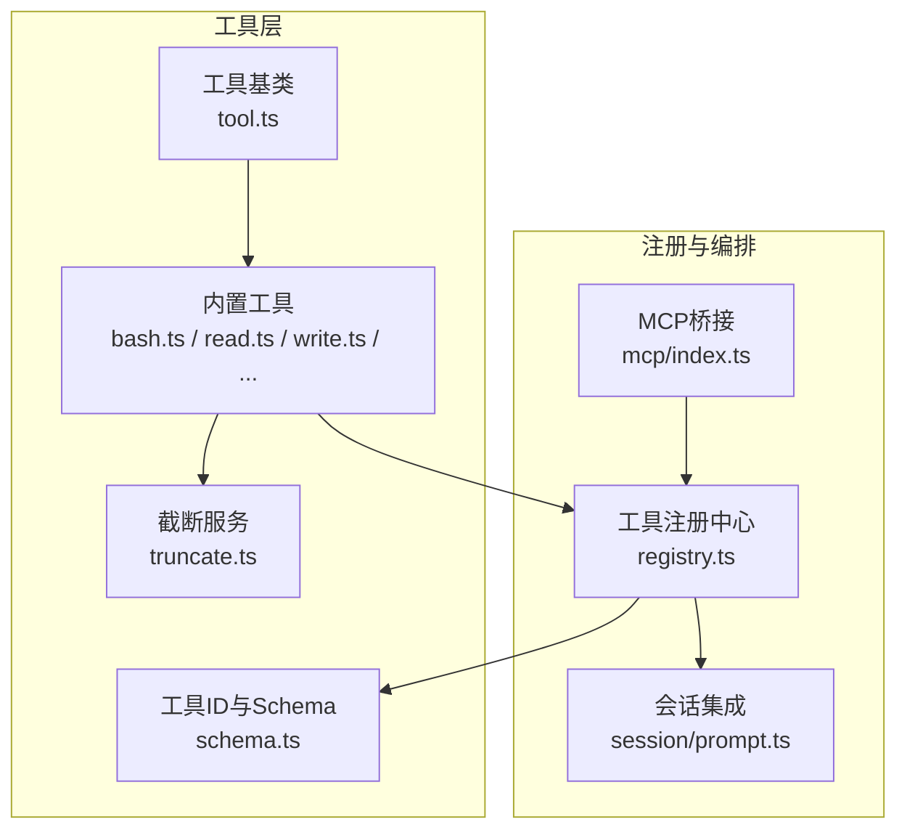
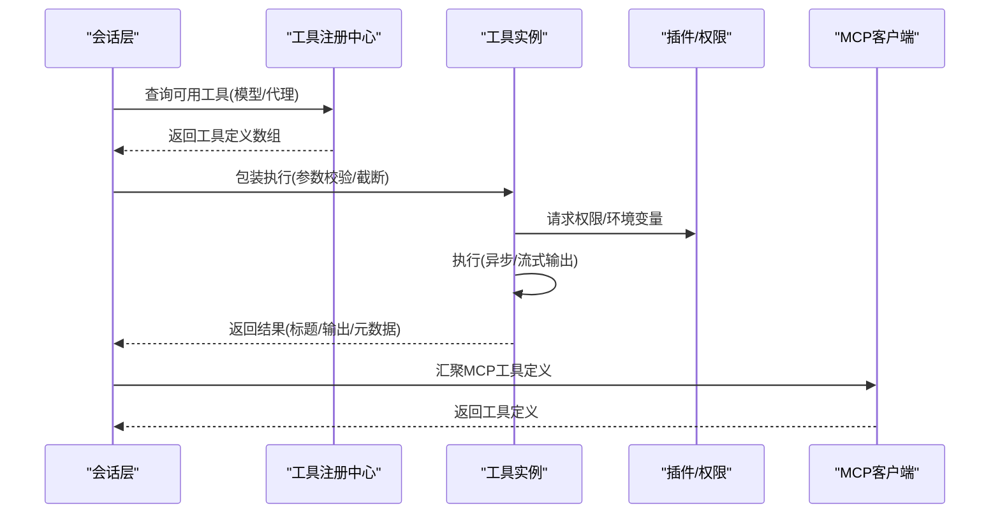
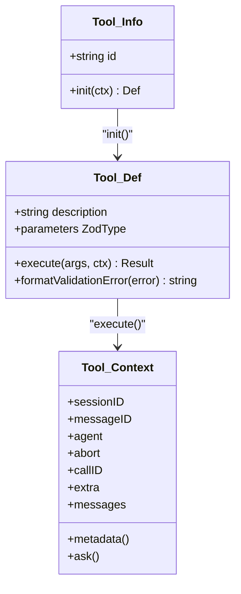
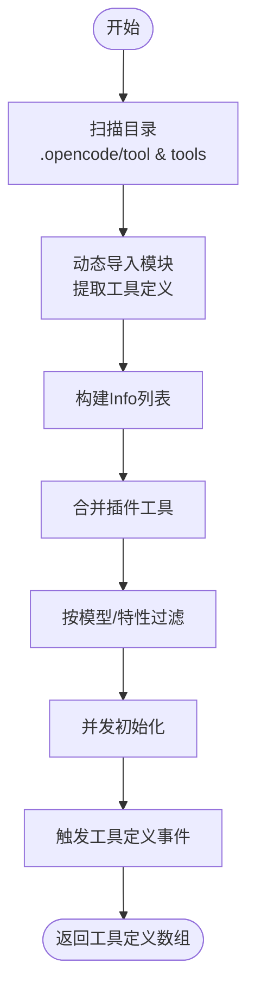
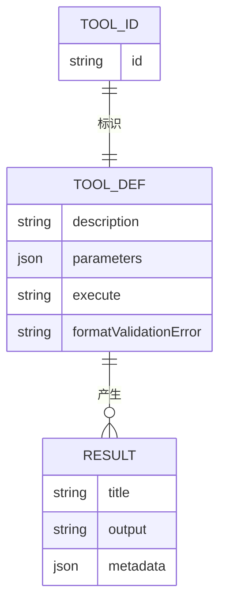
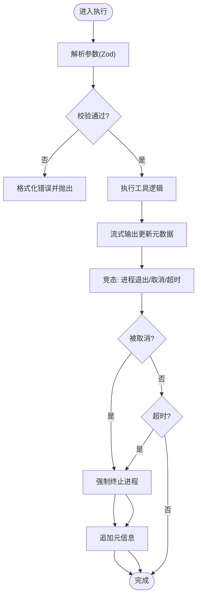
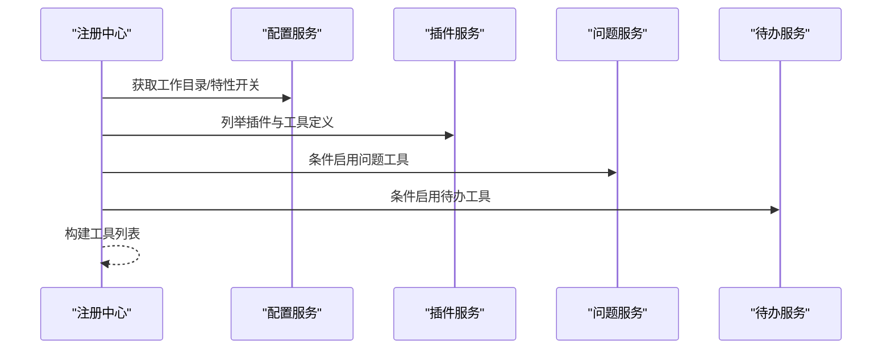
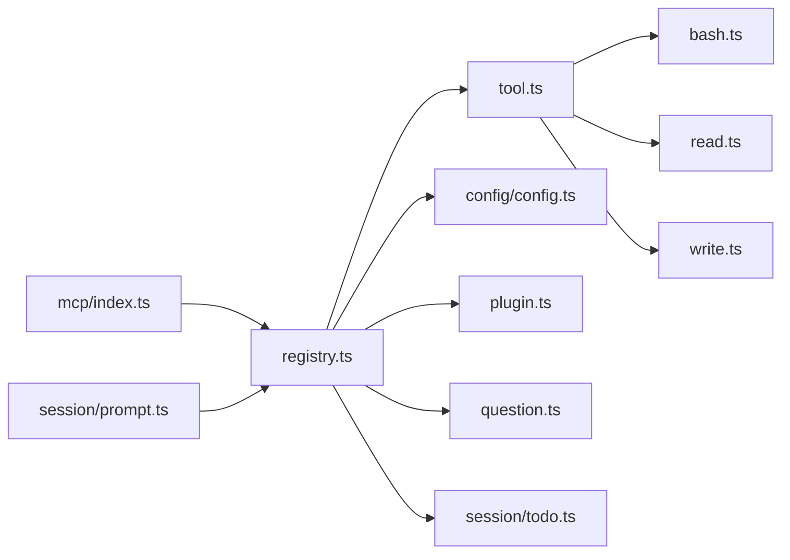

# 工具架构设计

<cite>
**本文引用的文件**   
- [packages/opencode/src/tool/tool.ts](file://packages/opencode/src/tool/tool.ts)
- [packages/opencode/src/tool/registry.ts](file://packages/opencode/src/tool/registry.ts)
- [packages/opencode/src/tool/schema.ts](file://packages/opencode/src/tool/schema.ts)
- [packages/opencode/src/tool/bash.ts](file://packages/opencode/src/tool/bash.ts)
- [packages/opencode/src/tool/read.ts](file://packages/opencode/src/tool/read.ts)
- [packages/opencode/src/tool/write.ts](file://packages/opencode/src/tool/write.ts)
- [packages/opencode/src/tool/truncate.ts](file://packages/opencode/src/tool/truncate.ts)
- [packages/opencode/src/tool/invalid.ts](file://packages/opencode/src/tool/invalid.ts)
- [packages/opencode/src/tool/mcp/index.ts](file://packages/opencode/src/tool/mcp/index.ts)
- [packages/opencode/src/session/prompt.ts](file://packages/opencode/src/session/prompt.ts)
- [packages/opencode/test/tool/tool-define.test.ts](file://packages/opencode/test/tool/tool-define.test.ts)
- [packages/opencode/test/tool/registry.test.ts](file://packages/opencode/test/tool/registry.test.ts)
</cite>

## 目录
1. [引言](#引言)
2. [项目结构](#项目结构)
3. [核心组件](#核心组件)
4. [架构总览](#架构总览)
5. [详细组件分析](#详细组件分析)
6. [依赖关系分析](#依赖关系分析)
7. [性能考量](#性能考量)
8. [故障排查指南](#故障排查指南)
9. [结论](#结论)
10. [附录](#附录)

## 引言
本文件面向 OpenCode 工具系统，聚焦 Tool.Service 的核心设计理念与实现细节，系统阐述工具接口规范、工具注册机制、工具生命周期管理；解析工具系统的分层架构与设计模式；详解工具元数据系统（描述、参数、返回值）；说明异步执行模型、错误处理与超时控制；描述依赖注入与工具间协作；并总结扩展性与性能优化策略。目标是帮助开发者快速理解并高效扩展工具体系。

## 项目结构
OpenCode 工具系统位于 packages/opencode/src/tool 下，采用“工具基类 + 具体工具实现 + 注册中心”的分层组织方式：
- 工具基类：统一接口定义、参数校验包装、输出截断与元数据增强
- 具体工具：如 Bash、Read、Write 等，提供具体能力
- 注册中心：扫描自定义工具、聚合内置工具、按模型/权限过滤、暴露统一查询接口
- 元数据与 ID 规范：通过 Zod Schema 与标识符品牌化确保类型安全
- MCP 工具桥接：将外部 MCP 客户端工具纳入统一调度
- 会话集成：在对话流程中触发工具执行、权限请求与前后置钩子

图表来源
- [packages/opencode/src/tool/tool.ts:1-113](file://packages/opencode/src/tool/tool.ts#L1-L113)
- [packages/opencode/src/tool/registry.ts:1-249](file://packages/opencode/src/tool/registry.ts#L1-L249)
- [packages/opencode/src/tool/schema.ts:1-18](file://packages/opencode/src/tool/schema.ts#L1-L18)
- [packages/opencode/src/tool/bash.ts:1-497](file://packages/opencode/src/tool/bash.ts#L1-L497)
- [packages/opencode/src/tool/read.ts:1-297](file://packages/opencode/src/tool/read.ts#L1-L297)
- [packages/opencode/src/tool/write.ts:1-85](file://packages/opencode/src/tool/write.ts#L1-L85)
- [packages/opencode/src/tool/truncate.ts:1-145](file://packages/opencode/src/tool/truncate.ts#L1-L145)
- [packages/opencode/src/tool/mcp/index.ts:163-634](file://packages/opencode/src/tool/mcp/index.ts#L163-L634)
- [packages/opencode/src/session/prompt.ts:436-500](file://packages/opencode/src/session/prompt.ts#L436-L500)

章节来源
- [packages/opencode/src/tool/registry.ts:1-249](file://packages/opencode/src/tool/registry.ts#L1-L249)
- [packages/opencode/src/tool/tool.ts:1-113](file://packages/opencode/src/tool/tool.ts#L1-L113)

## 核心组件
- 工具接口与生命周期
  - 工具定义包含 description、parameters（Zod）、execute、可选 formatValidationError
  - 工具以 Info 形式存在，通过 init 返回 Def，实现延迟初始化与参数校验包装
  - 执行前进行参数解析与格式化错误转换，执行后自动截断输出并补充元数据
- 工具注册中心
  - 支持从 .opencode/tool 与 .opencode/tools 目录动态加载自定义工具
  - 合并插件提供的工具定义，统一构建工具列表
  - 按模型提供商与特性开关过滤工具，批量初始化并触发工具定义事件
- 工具元数据系统
  - 使用 Zod Schema 定义参数与返回值结构，支持描述与校验
  - 工具ID 品牌化，结合升序标识符生成稳定排序
- 异步执行与超时控制
  - 工具执行封装在 Effect 中，支持并发初始化、流式输出更新与中断
  - 进程执行支持超时与用户取消，自动清理进程并记录元信息
- 依赖注入与协作
  - 通过 Layer 提供 Config、Plugin、Question、Todo 等服务，注册中心按需注入
  - 会话层在调用工具前后触发事件，统一接入权限请求与消息附件处理

章节来源
- [packages/opencode/src/tool/tool.ts:9-113](file://packages/opencode/src/tool/tool.ts#L9-L113)
- [packages/opencode/src/tool/registry.ts:39-249](file://packages/opencode/src/tool/registry.ts#L39-L249)
- [packages/opencode/src/tool/schema.ts:7-18](file://packages/opencode/src/tool/schema.ts#L7-L18)
- [packages/opencode/src/tool/truncate.ts:13-145](file://packages/opencode/src/tool/truncate.ts#L13-L145)

## 架构总览
工具系统采用“服务化 + 效果化执行”的架构：
- 工具基类提供统一的定义与包装逻辑
- 注册中心负责发现、聚合与筛选工具，并暴露查询接口
- 会话层在运行期将工具定义转换为可执行的工具实例，触发权限与事件
- MCP 工具桥接将外部工具无缝纳入统一调度

图表来源
- [packages/opencode/src/tool/registry.ts:171-216](file://packages/opencode/src/tool/registry.ts#L171-L216)
- [packages/opencode/src/session/prompt.ts:436-500](file://packages/opencode/src/session/prompt.ts#L436-L500)
- [packages/opencode/src/tool/mcp/index.ts:611-634](file://packages/opencode/src/tool/mcp/index.ts#L611-L634)

## 详细组件分析

### 工具基类与生命周期
- 接口规范
  - Def 描述工具能力：description、parameters（Zod）、execute、可选 formatValidationError
  - Info 为惰性包装器，通过 init 返回 Def，避免重复包装与状态泄漏
- 生命周期管理
  - 初始化阶段：解析参数 Schema，注入执行包装器，统一错误格式化
  - 执行阶段：先校验参数，再执行业务逻辑，最后进行输出截断与元数据补充
- 设计要点
  - 不污染原始工具定义，多次 init 返回独立实例
  - 保持最小包装栈深度，避免深层调用栈

图表来源
- [packages/opencode/src/tool/tool.ts:29-47](file://packages/opencode/src/tool/tool.ts#L29-L47)
- [packages/opencode/src/tool/tool.ts:18-28](file://packages/opencode/src/tool/tool.ts#L18-L28)

章节来源
- [packages/opencode/src/tool/tool.ts:58-113](file://packages/opencode/src/tool/tool.ts#L58-L113)
- [packages/opencode/test/tool/tool-define.test.ts:19-101](file://packages/opencode/test/tool/tool-define.test.ts#L19-L101)

### 工具注册中心与发现机制
- 自定义工具发现
  - 扫描 .opencode/tool 与 .opencode/tools 目录，支持 .js/.ts 文件
  - 将导出的工具定义映射为 Info，命名规则：默认模块名或 namespace_id
- 插件工具聚合
  - 遍历已加载插件的 tool 字段，合并为 Info 列表
- 工具筛选与构建
  - 基于 ProviderID、特性开关与模型类型过滤
  - 并发初始化所有工具，触发工具定义事件，返回统一的工具定义数组
- 依赖注入
  - 通过 Layer 提供 Config、Plugin、Question、Todo 等服务

图表来源
- [packages/opencode/src/tool/registry.ts:70-122](file://packages/opencode/src/tool/registry.ts#L70-L122)
- [packages/opencode/src/tool/registry.ts:143-216](file://packages/opencode/src/tool/registry.ts#L143-L216)

章节来源
- [packages/opencode/src/tool/registry.ts:39-249](file://packages/opencode/src/tool/registry.ts#L39-L249)
- [packages/opencode/test/tool/registry.test.ts:12-88](file://packages/opencode/test/tool/registry.test.ts#L12-L88)

### 工具元数据系统
- 参数与返回值规范
  - 使用 Zod Schema 定义参数结构与描述，保证类型安全与可读性
  - 返回值包含 title、output、metadata，支持 attachments
- 工具ID与标识符
  - 工具ID 品牌化，结合升序标识符生成稳定排序，便于持久化与检索
- 截断与预览
  - 输出超过阈值时截断并保存完整内容至专用目录，提示用户使用 Task/Grep/Read 查看

图表来源
- [packages/opencode/src/tool/schema.ts:7-18](file://packages/opencode/src/tool/schema.ts#L7-L18)
- [packages/opencode/src/tool/tool.ts:29-47](file://packages/opencode/src/tool/tool.ts#L29-L47)
- [packages/opencode/src/tool/truncate.ts:22-121](file://packages/opencode/src/tool/truncate.ts#L22-L121)

章节来源
- [packages/opencode/src/tool/schema.ts:1-18](file://packages/opencode/src/tool/schema.ts#L1-L18)
- [packages/opencode/src/tool/truncate.ts:13-145](file://packages/opencode/src/tool/truncate.ts#L13-L145)

### 异步执行模型、错误处理与超时控制
- 异步执行
  - 工具执行封装在 Effect 中，支持并发初始化与流式输出更新
  - Bash 工具通过子进程流式读取标准输出，实时更新元数据
- 错误处理
  - 参数校验失败时优先使用 formatValidationError 格式化错误
  - 执行异常通过 Cause.squash 统一抛出，避免深层嵌套
- 超时与中断
  - Bash 工具支持超时与用户取消，超时/取消后强制终止进程并追加元信息
  - 会话层 Runner 提供 Shell/Run 状态机，支持中断回调与 Busy 错误

图表来源
- [packages/opencode/src/tool/tool.ts:65-94](file://packages/opencode/src/tool/tool.ts#L65-L94)
- [packages/opencode/src/tool/bash.ts:317-409](file://packages/opencode/src/tool/bash.ts#L317-L409)
- [packages/opencode/src/tool/registry.ts:196-216](file://packages/opencode/src/tool/registry.ts#L196-L216)

章节来源
- [packages/opencode/src/tool/tool.ts:58-113](file://packages/opencode/src/tool/tool.ts#L58-L113)
- [packages/opencode/src/tool/bash.ts:24-51](file://packages/opencode/src/tool/bash.ts#L24-L51)
- [packages/opencode/src/tool/bash.ts:317-409](file://packages/opencode/src/tool/bash.ts#L317-L409)

### 依赖注入与工具协作
- 依赖注入
  - 注册中心通过 Layer 提供 Config、Plugin、Question、Todo 等服务
  - 工具在执行前可触发插件事件（如 shell.env），获取环境变量等
- 工具协作
  - 会话层在调用工具前后触发事件，统一接入权限请求与消息附件处理
  - MCP 工具桥接将外部工具纳入统一调度，输入 Schema 经模型适配转换

图表来源
- [packages/opencode/src/tool/registry.ts:60-231](file://packages/opencode/src/tool/registry.ts#L60-L231)

章节来源
- [packages/opencode/src/tool/registry.ts:60-231](file://packages/opencode/src/tool/registry.ts#L60-L231)
- [packages/opencode/src/session/prompt.ts:436-500](file://packages/opencode/src/session/prompt.ts#L436-L500)
- [packages/opencode/src/tool/mcp/index.ts:611-634](file://packages/opencode/src/tool/mcp/index.ts#L611-L634)

## 依赖关系分析
- 组件耦合
  - 工具基类与具体工具低耦合，通过 Info/Def 接口解耦
  - 注册中心对 Config/Plugin/Question/Todo 存在依赖，但通过 Layer 解耦
- 外部依赖
  - 进程执行依赖 effect/unstable/process 与 ChildProcess
  - MCP 工具依赖远程/本地连接与超时控制
- 循环依赖
  - 未见循环依赖迹象，各模块职责清晰

图表来源
- [packages/opencode/src/tool/tool.ts:1-113](file://packages/opencode/src/tool/tool.ts#L1-L113)
- [packages/opencode/src/tool/registry.ts:17-37](file://packages/opencode/src/tool/registry.ts#L17-L37)
- [packages/opencode/src/tool/mcp/index.ts:163-634](file://packages/opencode/src/tool/mcp/index.ts#L163-L634)
- [packages/opencode/src/session/prompt.ts:436-500](file://packages/opencode/src/session/prompt.ts#L436-L500)

章节来源
- [packages/opencode/src/tool/registry.ts:17-37](file://packages/opencode/src/tool/registry.ts#L17-L37)

## 性能考量
- 并发初始化
  - 注册中心对工具定义并发初始化，显著降低启动延迟
- 流式输出
  - Bash 工具通过流式读取标准输出，实时更新元数据，提升交互体验
- 截断策略
  - 输出超过阈值时截断并保存完整内容，避免内存与传输压力
- 超时与中断
  - 进程执行设置合理超时，支持用户取消，防止长时间阻塞
- 会话 Runner
  - 提供 Shell/Run 状态机与 Busy 错误，避免并发冲突

章节来源
- [packages/opencode/src/tool/registry.ts:214-216](file://packages/opencode/src/tool/registry.ts#L214-L216)
- [packages/opencode/src/tool/bash.ts:344-383](file://packages/opencode/src/tool/bash.ts#L344-L383)
- [packages/opencode/src/tool/truncate.ts:63-121](file://packages/opencode/src/tool/truncate.ts#L63-L121)
- [packages/opencode/src/effect/runner.ts:141-169](file://packages/opencode/src/effect/runner.ts#L141-L169)

## 故障排查指南
- 参数校验失败
  - 检查工具定义中的 parameters 是否与调用参数匹配
  - 若提供 formatValidationError，优先参考其格式化后的错误信息
- 工具未被发现
  - 确认工具文件位于 .opencode/tool 或 .opencode/tools 目录
  - 确认导出形式符合工具定义规范
- 进程超时或被取消
  - 检查 Bash 工具的 timeout 设置与实际命令耗时
  - 用户取消会强制终止进程并追加元信息，确认是否预期行为
- 权限拒绝
  - 确认会话层已触发 ask 权限请求，检查 patterns/always 配置
- 输出过大被截断
  - 查看截断服务输出路径，使用 Task/Grep/Read 分页查看

章节来源
- [packages/opencode/src/tool/tool.ts:65-94](file://packages/opencode/src/tool/tool.ts#L65-L94)
- [packages/opencode/src/tool/registry.ts:105-111](file://packages/opencode/src/tool/registry.ts#L105-L111)
- [packages/opencode/src/tool/bash.ts:373-398](file://packages/opencode/src/tool/bash.ts#L373-L398)
- [packages/opencode/src/tool/truncate.ts:104-121](file://packages/opencode/src/tool/truncate.ts#L104-L121)

## 结论
OpenCode 工具系统通过“工具基类 + 注册中心 + 会话集成”的分层设计，实现了统一的工具接口规范、灵活的注册与发现机制、完善的生命周期管理与错误处理。借助 Effect 的效果化执行与并发初始化，系统在保证类型安全与可维护性的同时，具备良好的性能与扩展性。MCP 桥接进一步拓展了工具生态，使外部工具无缝融入统一调度。

## 附录
- 工具开发最佳实践
  - 使用 Zod 定义清晰的参数 Schema 与描述
  - 在 formatValidationError 中提供友好的错误提示
  - 对可能耗时的操作设置合理超时与中断处理
  - 通过 ask 请求必要的权限，确保合规执行
- 扩展性建议
  - 新增工具时遵循 Info/Def 接口，尽量复用现有工具能力
  - 通过插件机制提供工具扩展点
  - 利用会话事件钩子实现跨工具协作与审计