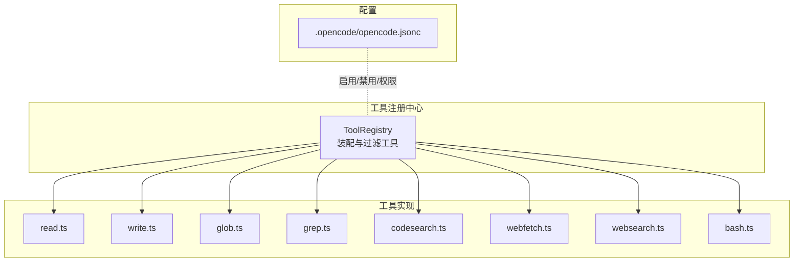
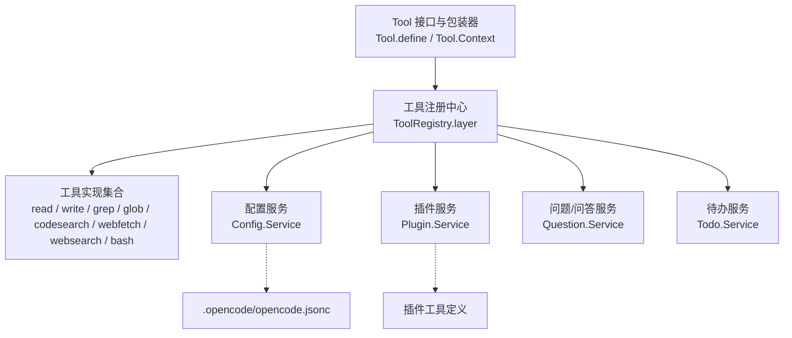
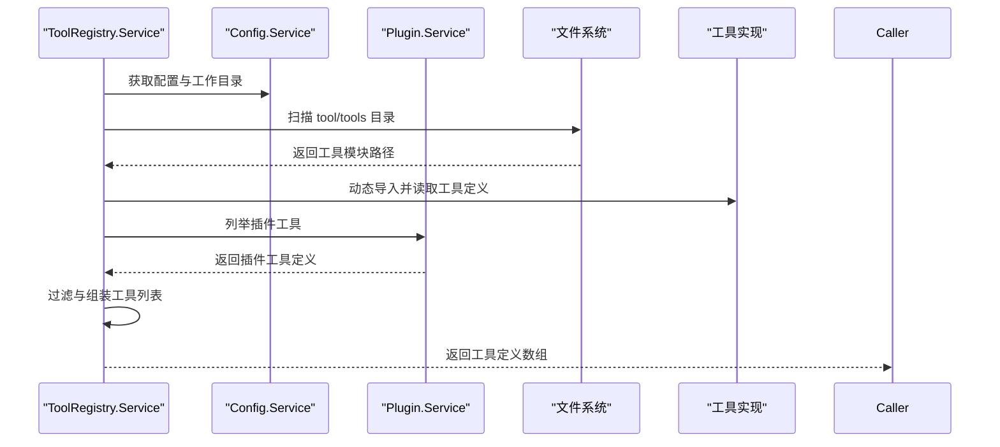
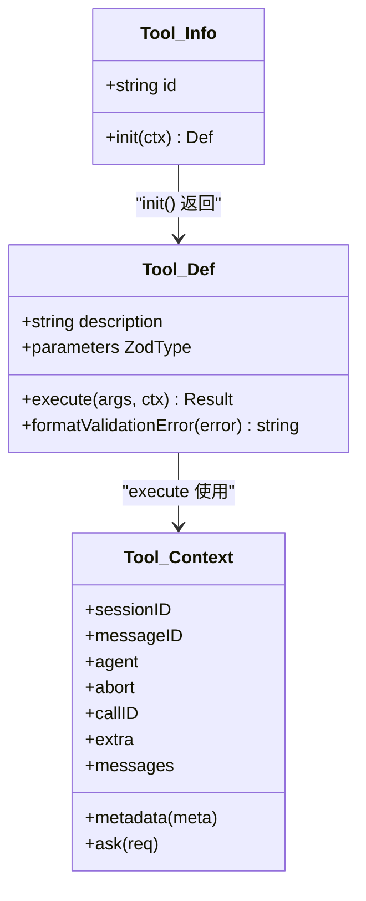
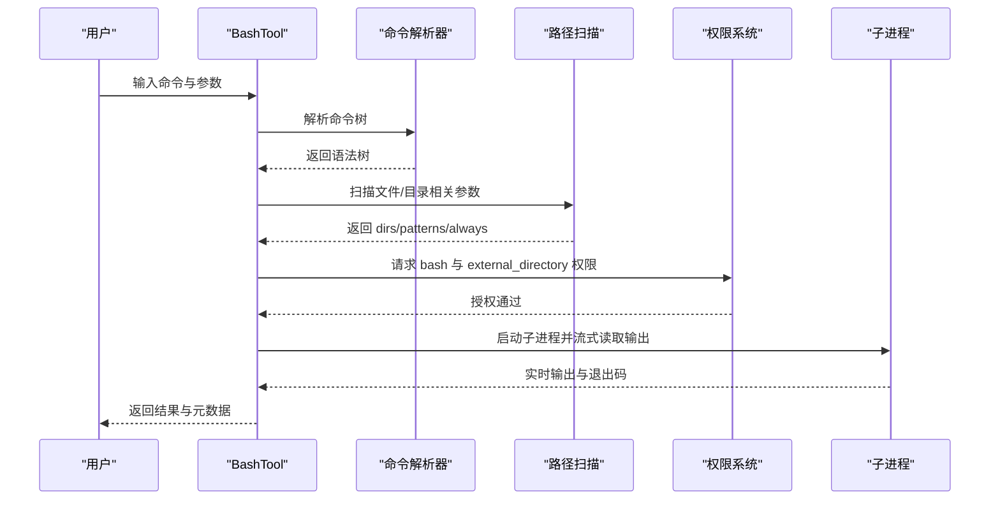
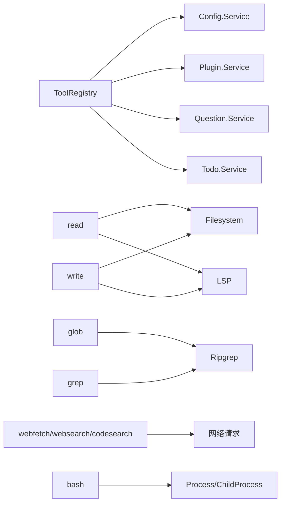

# 工具系统

<cite>
**本文引用的文件**
- [packages/opencode/src/tool/registry.ts](file://packages/opencode/src/tool/registry.ts)
- [packages/opencode/src/tool/tool.ts](file://packages/opencode/src/tool/tool.ts)
- [packages/opencode/src/tool/read.ts](file://packages/opencode/src/tool/read.ts)
- [packages/opencode/src/tool/write.ts](file://packages/opencode/src/tool/write.ts)
- [packages/opencode/src/tool/grep.ts](file://packages/opencode/src/tool/grep.ts)
- [packages/opencode/src/tool/codesearch.ts](file://packages/opencode/src/tool/codesearch.ts)
- [packages/opencode/src/tool/webfetch.ts](file://packages/opencode/src/tool/webfetch.ts)
- [packages/opencode/src/tool/websearch.ts](file://packages/opencode/src/tool/websearch.ts)
- [packages/opencode/src/tool/bash.ts](file://packages/opencode/src/tool/bash.ts)
- [packages/opencode/src/tool/glob.ts](file://packages/opencode/src/tool/glob.ts)
- [.opencode/opencode.jsonc](file://.opencode/opencode.jsonc)
</cite>

## 目录
1. [简介](#简介)
2. [项目结构](#项目结构)
3. [核心组件](#核心组件)
4. [架构总览](#架构总览)
5. [详细组件分析](#详细组件分析)
6. [依赖关系分析](#依赖关系分析)
7. [性能考量](#性能考量)
8. [故障排查指南](#故障排查指南)
9. [结论](#结论)
10. [附录](#附录)

## 简介
本文件为 OpenCode 工具系统的全面技术文档，聚焦于工具系统的核心架构与实现细节，包括 Tool.Service 的设计模式、工具注册机制、工具执行流程；系统内工具的分类体系（文件操作、代码搜索、编辑、网络、系统等）及其功能特性；安全控制机制（权限验证、路径白名单、命令限制等）；扩展开发流程（自定义工具创建、接口规范、注册方法）；使用示例与最佳实践；以及性能优化建议。

## 项目结构
OpenCode 工具系统位于 packages/opencode/src/tool 目录下，采用“按功能模块划分”的组织方式，每个工具以独立文件实现，统一通过工具注册中心进行装配与暴露。配置层面通过 .opencode/opencode.jsonc 控制工具启用状态与权限规则。

图表来源
- [packages/opencode/src/tool/registry.ts:39-249](file://packages/opencode/src/tool/registry.ts#L39-L249)
- [packages/opencode/src/tool/read.ts:21-236](file://packages/opencode/src/tool/read.ts#L21-L236)
- [packages/opencode/src/tool/write.ts:20-84](file://packages/opencode/src/tool/write.ts#L20-L84)
- [packages/opencode/src/tool/glob.ts:10-78](file://packages/opencode/src/tool/glob.ts#L10-L78)
- [packages/opencode/src/tool/grep.ts:15-156](file://packages/opencode/src/tool/grep.ts#L15-L156)
- [packages/opencode/src/tool/codesearch.ts:36-132](file://packages/opencode/src/tool/codesearch.ts#L36-L132)
- [packages/opencode/src/tool/webfetch.ts:11-162](file://packages/opencode/src/tool/webfetch.ts#L11-L162)
- [packages/opencode/src/tool/websearch.ts:40-150](file://packages/opencode/src/tool/websearch.ts#L40-L150)
- [packages/opencode/src/tool/bash.ts:439-496](file://packages/opencode/src/tool/bash.ts#L439-L496)
- [.opencode/opencode.jsonc:14-18](file://.opencode/opencode.jsonc#L14-L18)

章节来源
- [packages/opencode/src/tool/registry.ts:39-249](file://packages/opencode/src/tool/registry.ts#L39-L249)
- [.opencode/opencode.jsonc:1-19](file://.opencode/opencode.jsonc#L1-L19)

## 核心组件
- 工具接口与包装器：Tool 定义了工具的统一接口、参数校验、执行上下文与错误格式化，并提供 define/defineEffect 包装器，自动注入参数校验与输出截断逻辑。
- 工具注册中心：ToolRegistry 负责扫描插件与本地工具目录、构建工具列表、按模型能力与实验开关过滤工具、触发工具定义事件并返回可被模型使用的工具清单。

关键要点
- 参数校验：所有工具在执行前通过 Zod schema 校验，非法参数会抛出可格式化的错误。
- 输出截断：未显式设置 metadata.truncated 时，统一由 Truncate 组件对输出进行长度与行数截断，避免大文本污染对话。
- 过滤策略：根据 ProviderID、模型名称与实验开关动态决定是否暴露某些工具（如 codesearch/websearch、apply_patch、edit/write 等）。

章节来源
- [packages/opencode/src/tool/tool.ts:9-113](file://packages/opencode/src/tool/tool.ts#L9-L113)
- [packages/opencode/src/tool/registry.ts:177-216](file://packages/opencode/src/tool/registry.ts#L177-L216)

## 架构总览
工具系统采用“服务层 + 工具层 + 配置层”的分层架构。服务层通过 Effect/Layer 提供依赖注入与运行时管理；工具层以模块化实现各类工具；配置层控制工具启用与权限策略。

图表来源
- [packages/opencode/src/tool/tool.ts:9-113](file://packages/opencode/src/tool/tool.ts#L9-L113)
- [packages/opencode/src/tool/registry.ts:60-231](file://packages/opencode/src/tool/registry.ts#L60-L231)
- [.opencode/opencode.jsonc:1-19](file://.opencode/opencode.jsonc#L1-L19)

## 详细组件分析

### 工具注册中心（ToolRegistry）
- 扫描策略：遍历配置中的 directories，查找 tool/tools 目录下的 .ts/.js 文件，动态导入并提取工具定义。
- 插件集成：从已加载插件中读取 tool 字段，合并为自定义工具集。
- 过滤逻辑：依据 ProviderID、模型名称与实验开关过滤工具；对特定工具（如 apply_patch、edit/write）做条件启用。
- 定义事件：在生成工具定义时触发 tool.definition 事件，便于上层收集与展示。

图表来源
- [packages/opencode/src/tool/registry.ts:60-231](file://packages/opencode/src/tool/registry.ts#L60-L231)

章节来源
- [packages/opencode/src/tool/registry.ts:39-249](file://packages/opencode/src/tool/registry.ts#L39-L249)

### 工具接口与包装器（Tool）
- 上下文 Context：包含 sessionID、messageID、agent、AbortSignal、callID、extra、messages 等；支持 metadata 回调与 ask 权限请求。
- 定义与包装：define/defineEffect 将工具封装为 Info 对象，自动注入参数校验与输出截断；formatValidationError 可定制错误提示。
- 兼容性：支持同步与 Effect 异步初始化，统一对外暴露。

图表来源
- [packages/opencode/src/tool/tool.ts:29-47](file://packages/opencode/src/tool/tool.ts#L29-L47)

章节来源
- [packages/opencode/src/tool/tool.ts:9-113](file://packages/opencode/src/tool/tool.ts#L9-L113)

### 文件操作工具

#### read（文件/目录读取）
- 功能：支持绝对/相对路径读取文件或列出目录内容；对二进制文件、图片/PDF 做特殊处理；支持行号偏移与行数限制；自动建议相近文件名。
- 安全：通过 assertExternalDirectory 与权限请求确保仅访问受信任路径；对偏移范围进行校验。
- 截断：默认最多读取 2000 行，单行最大长度限制；超过阈值提示续读。

图表来源
- [packages/opencode/src/tool/read.ts:28-236](file://packages/opencode/src/tool/read.ts#L28-L236)

章节来源
- [packages/opencode/src/tool/read.ts:21-297](file://packages/opencode/src/tool/read.ts#L21-L297)

#### write（写入文件）
- 功能：写入指定文件，计算差异并触发权限请求；写入后格式化、发布文件变更事件、更新时间戳；收集 LSP 诊断并提示修复。
- 安全：要求 edit 权限，基于目标文件相对路径生成 patterns；若文件存在则校验最近读取时间防止并发覆盖。
- 输出：返回写入成功消息与诊断信息摘要。

章节来源
- [packages/opencode/src/tool/write.ts:20-84](file://packages/opencode/src/tool/write.ts#L20-L84)

#### glob（通配符匹配）
- 功能：基于 ripgrep.files 在指定目录下按 glob 模式匹配文件，按修改时间排序，限制返回数量并提示截断。
- 安全：通过权限请求与外部目录检查，确保仅在受信任目录执行。

章节来源
- [packages/opencode/src/tool/glob.ts:10-78](file://packages/opencode/src/tool/glob.ts#L10-L78)

#### grep（内容搜索）
- 功能：基于 ripgrep 搜索指定目录下匹配正则的内容，解析输出为结构化结果，按修改时间排序；支持 include 通配符与截断。
- 安全：请求 grep 权限，限定搜索路径为受信任目录。

章节来源
- [packages/opencode/src/tool/grep.ts:15-156](file://packages/opencode/src/tool/grep.ts#L15-L156)

### 代码搜索工具

#### codesearch（代码片段检索）
- 功能：调用外部 MCP 服务，基于查询返回相关代码上下文；支持超时控制与 SSE 解析。
- 安全：请求 codesearch 权限；对响应大小与超时进行严格限制。

章节来源
- [packages/opencode/src/tool/codesearch.ts:36-132](file://packages/opencode/src/tool/codesearch.ts#L36-L132)

### 网络工具

#### webfetch（网页抓取）
- 功能：支持 text/markdown/html 多格式返回；自动处理 HTML 转 Markdown；支持图片直接作为附件返回；带 UA 伪装与 Cloudflare 挑战处理。
- 安全：请求 webfetch 权限；限制最大响应大小与超时。

章节来源
- [packages/opencode/src/tool/webfetch.ts:11-162](file://packages/opencode/src/tool/webfetch.ts#L11-L162)

#### websearch（网页搜索）
- 功能：调用外部 MCP 服务进行网络搜索，返回结构化上下文；支持多种搜索类型与结果数量控制。
- 安全：请求 websearch 权限；超时与错误处理完善。

章节来源
- [packages/opencode/src/tool/websearch.ts:40-150](file://packages/opencode/src/tool/websearch.ts#L40-L150)

### 系统工具

#### bash（命令执行）
- 功能：解析命令树，静态识别涉及的路径与命令，请求 bash 与 external_directory 权限；支持超时、中断、输出预览与元数据记录。
- 安全：对可能影响文件系统的命令进行路径扫描与白名单过滤；支持 PowerShell 与 Bash 的差异化处理；环境变量来自插件扩展。
- 性能：流式读取子进程输出，实时更新元数据；超时与中断快速回收资源。

图表来源
- [packages/opencode/src/tool/bash.ts:470-496](file://packages/opencode/src/tool/bash.ts#L470-L496)
- [packages/opencode/src/tool/bash.ts:317-409](file://packages/opencode/src/tool/bash.ts#L317-L409)

章节来源
- [packages/opencode/src/tool/bash.ts:439-496](file://packages/opencode/src/tool/bash.ts#L439-L496)

## 依赖关系分析
- 工具注册中心依赖配置、插件、问答与待办服务，用于构建工具列表与触发事件。
- 工具实现依赖工具接口、文件系统、进程、网络与 LSP 等基础设施。
- 配置文件 opencode.jsonc 控制工具启用与权限规则，影响注册中心的过滤与暴露。

图表来源
- [packages/opencode/src/tool/registry.ts:60-231](file://packages/opencode/src/tool/registry.ts#L60-L231)
- [packages/opencode/src/tool/read.ts:1-20](file://packages/opencode/src/tool/read.ts#L1-L20)
- [packages/opencode/src/tool/write.ts:1-15](file://packages/opencode/src/tool/write.ts#L1-L15)
- [packages/opencode/src/tool/glob.ts:1-8](file://packages/opencode/src/tool/glob.ts#L1-L8)
- [packages/opencode/src/tool/grep.ts:1-6](file://packages/opencode/src/tool/grep.ts#L1-L6)
- [packages/opencode/src/tool/webfetch.ts:1-5](file://packages/opencode/src/tool/webfetch.ts#L1-L5)
- [packages/opencode/src/tool/websearch.ts:1-4](file://packages/opencode/src/tool/websearch.ts#L1-L4)
- [packages/opencode/src/tool/codesearch.ts:1-4](file://packages/opencode/src/tool/codesearch.ts#L1-L4)
- [packages/opencode/src/tool/bash.ts:1-22](file://packages/opencode/src/tool/bash.ts#L1-L22)

章节来源
- [packages/opencode/src/tool/registry.ts:39-249](file://packages/opencode/src/tool/registry.ts#L39-L249)
- [.opencode/opencode.jsonc:1-19](file://.opencode/opencode.jsonc#L1-L19)

## 性能考量
- 流式输出：bash 工具通过流式读取子进程输出，降低内存峰值并提升交互体验。
- 结果截断：read/grep/glob 等工具对输出长度与数量进行限制，避免大文本影响对话性能。
- 超时与中断：网络工具与 bash 工具均支持超时与中断，保障长时间任务不会阻塞。
- 并发与异步：注册中心在生成工具定义时使用无界并发，加速批量初始化。
- 缓存与预热：read 工具会触发生态系统 LSP 触摸，有助于后续编辑体验。

## 故障排查指南
- 参数校验失败：检查工具参数 schema 是否满足要求，参考 formatValidationError 自定义提示。
- 权限被拒：确认请求的 patterns/always 是否覆盖到实际访问路径；必要时调整配置或使用 bypassCwdCheck（谨慎使用）。
- 路径越界：read 的 offset 必须大于等于 1；超出文件行数会报错。
- 二进制文件：read 对二进制文件直接拒绝；如需查看请改用其他方式。
- 网络超时：webfetch/websearch/codesearch 设置了合理超时；可适当增加 timeout 或简化查询。
- bash 超时/中断：可通过缩短命令、拆分子任务或提高超时解决；注意观察输出元数据中的提示。

章节来源
- [packages/opencode/src/tool/tool.ts:58-94](file://packages/opencode/src/tool/tool.ts#L58-L94)
- [packages/opencode/src/tool/read.ts:28-31](file://packages/opencode/src/tool/read.ts#L28-L31)
- [packages/opencode/src/tool/webfetch.ts:21-25](file://packages/opencode/src/tool/webfetch.ts#L21-L25)
- [packages/opencode/src/tool/websearch.ts:65-77](file://packages/opencode/src/tool/websearch.ts#L65-L77)
- [packages/opencode/src/tool/codesearch.ts:53-62](file://packages/opencode/src/tool/codesearch.ts#L53-L62)
- [packages/opencode/src/tool/bash.ts:373-398](file://packages/opencode/src/tool/bash.ts#L373-L398)

## 结论
OpenCode 工具系统以清晰的接口抽象、完善的注册与过滤机制、严格的权限与安全控制为核心，提供了覆盖文件、搜索、编辑、网络与系统等多类场景的工具集。通过统一的工具包装器与输出截断策略，系统在保证安全性的同时兼顾性能与可用性。扩展开发者可遵循工具接口规范，快速实现自定义工具并纳入统一注册流程。

## 附录

### 工具分类与功能速览
- 文件操作：read（读取文件/目录）、write（写入文件）、glob（通配符匹配）、grep（内容搜索）
- 代码搜索：codesearch（代码上下文检索）
- 网络工具：webfetch（网页抓取）、websearch（网页搜索）
- 系统工具：bash（命令执行）

章节来源
- [packages/opencode/src/tool/read.ts:21-236](file://packages/opencode/src/tool/read.ts#L21-L236)
- [packages/opencode/src/tool/write.ts:20-84](file://packages/opencode/src/tool/write.ts#L20-L84)
- [packages/opencode/src/tool/glob.ts:10-78](file://packages/opencode/src/tool/glob.ts#L10-L78)
- [packages/opencode/src/tool/grep.ts:15-156](file://packages/opencode/src/tool/grep.ts#L15-L156)
- [packages/opencode/src/tool/codesearch.ts:36-132](file://packages/opencode/src/tool/codesearch.ts#L36-L132)
- [packages/opencode/src/tool/webfetch.ts:11-162](file://packages/opencode/src/tool/webfetch.ts#L11-L162)
- [packages/opencode/src/tool/websearch.ts:40-150](file://packages/opencode/src/tool/websearch.ts#L40-L150)
- [packages/opencode/src/tool/bash.ts:439-496](file://packages/opencode/src/tool/bash.ts#L439-L496)

### 工具安全控制机制
- 权限验证：工具执行前通过 ctx.ask 发起权限请求，patterns/always 决定白名单范围。
- 路径白名单：外部目录检查与通配符匹配，确保只访问受信任路径。
- 命令限制：bash 工具解析命令树，识别潜在文件操作并请求 external_directory 权限；对 PowerShell/Bash 差异化处理。
- 超时与中断：网络与 bash 工具均支持超时与中断，防止长时间占用。

章节来源
- [packages/opencode/src/tool/read.ts:43-53](file://packages/opencode/src/tool/read.ts#L43-L53)
- [packages/opencode/src/tool/write.ts:34-43](file://packages/opencode/src/tool/write.ts#L34-L43)
- [packages/opencode/src/tool/glob.ts:21-30](file://packages/opencode/src/tool/glob.ts#L21-L30)
- [packages/opencode/src/tool/grep.ts:22-36](file://packages/opencode/src/tool/grep.ts#L22-L36)
- [packages/opencode/src/tool/webfetch.ts:27-36](file://packages/opencode/src/tool/webfetch.ts#L27-L36)
- [packages/opencode/src/tool/websearch.ts:65-77](file://packages/opencode/src/tool/websearch.ts#L65-L77)
- [packages/opencode/src/tool/codesearch.ts:53-62](file://packages/opencode/src/tool/codesearch.ts#L53-L62)
- [packages/opencode/src/tool/bash.ts:267-288](file://packages/opencode/src/tool/bash.ts#L267-L288)

### 扩展开发流程
- 创建工具文件：在 tool/tools 目录下新增工具实现，导出 Tool.define(...) 工具对象。
- 接口规范：实现 description、parameters（Zod schema）、execute(args, ctx) 三要素；可选 formatValidationError。
- 注册与暴露：无需手动注册，ToolRegistry 会自动扫描目录与插件工具；也可通过配置 opencode.jsonc 控制启用状态。
- 权限与安全：在 execute 中通过 ctx.ask 发起权限请求；对路径进行外部目录检查与白名单约束。

章节来源
- [packages/opencode/src/tool/registry.ts:98-122](file://packages/opencode/src/tool/registry.ts#L98-L122)
- [packages/opencode/src/tool/tool.ts:96-111](file://packages/opencode/src/tool/tool.ts#L96-L111)
- [.opencode/opencode.jsonc:14-18](file://.opencode/opencode.jsonc#L14-L18)

### 工具使用示例（调用方式与参数）
- read
  - 参数：filePath（绝对/相对路径）、offset（可选）、limit（可选）
  - 用途：读取文件内容或列出目录条目；支持续读与预览
- write
  - 参数：content（写入内容）、filePath（绝对路径）
  - 用途：写入文件并触发格式化与诊断
- glob
  - 参数：pattern（通配符）、path（可选，默认当前目录）
  - 用途：按模式匹配文件并排序
- grep
  - 参数：pattern（正则）、path（可选）、include（可选）
  - 用途：在目录中搜索匹配内容
- webfetch
  - 参数：url、format（text/markdown/html）、timeout（可选）
  - 用途：抓取网页并转换为指定格式
- websearch
  - 参数：query、numResults（可选）、livecrawl（可选）、type（可选）、contextMaxCharacters（可选）
  - 用途：网络搜索并返回上下文
- codesearch
  - 参数：query、tokensNum（1000-50000，默认5000）
  - 用途：检索相关代码上下文
- bash
  - 参数：command、timeout（可选）、workdir（可选）、description（可选）
  - 用途：执行系统命令并返回输出与元数据

章节来源
- [packages/opencode/src/tool/read.ts:23-27](file://packages/opencode/src/tool/read.ts#L23-L27)
- [packages/opencode/src/tool/write.ts:22-25](file://packages/opencode/src/tool/write.ts#L22-L25)
- [packages/opencode/src/tool/glob.ts:12-19](file://packages/opencode/src/tool/glob.ts#L12-L19)
- [packages/opencode/src/tool/grep.ts:17-21](file://packages/opencode/src/tool/grep.ts#L17-L21)
- [packages/opencode/src/tool/webfetch.ts:13-20](file://packages/opencode/src/tool/webfetch.ts#L13-L20)
- [packages/opencode/src/tool/websearch.ts:45-64](file://packages/opencode/src/tool/websearch.ts#L45-L64)
- [packages/opencode/src/tool/codesearch.ts:38-52](file://packages/opencode/src/tool/codesearch.ts#L38-L52)
- [packages/opencode/src/tool/bash.ts:455-469](file://packages/opencode/src/tool/bash.ts#L455-L469)