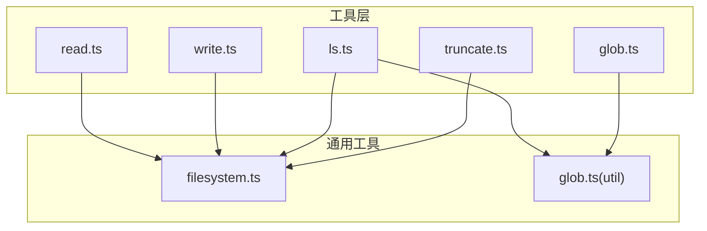
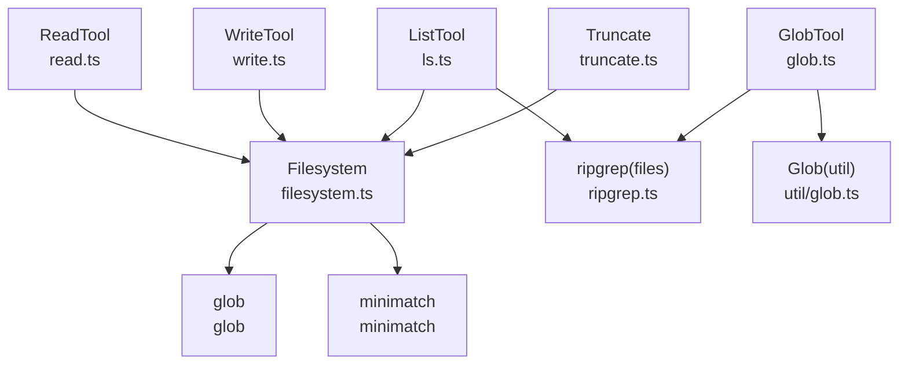
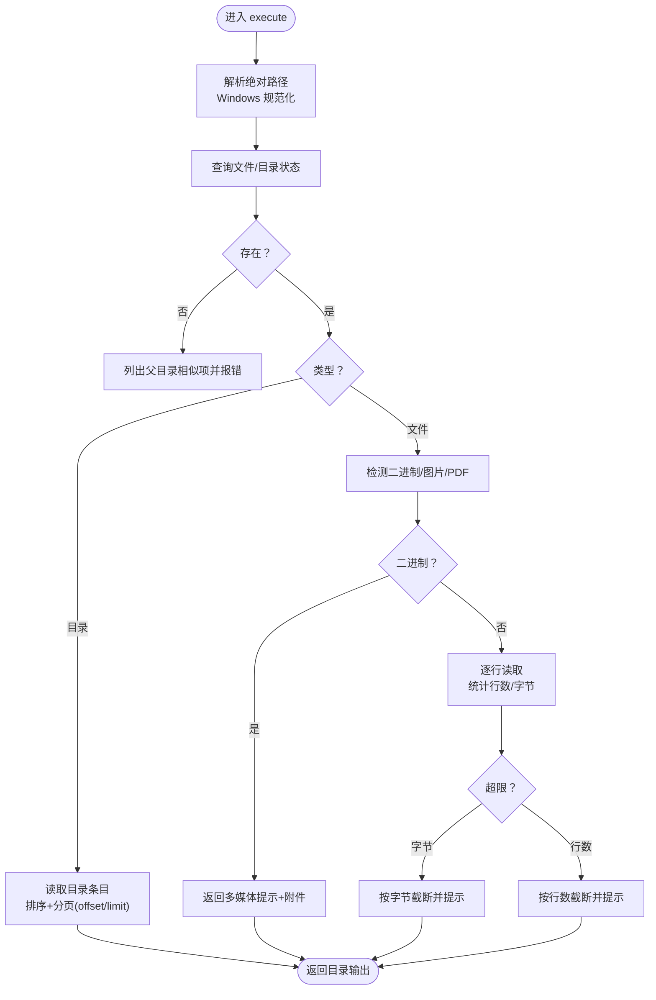
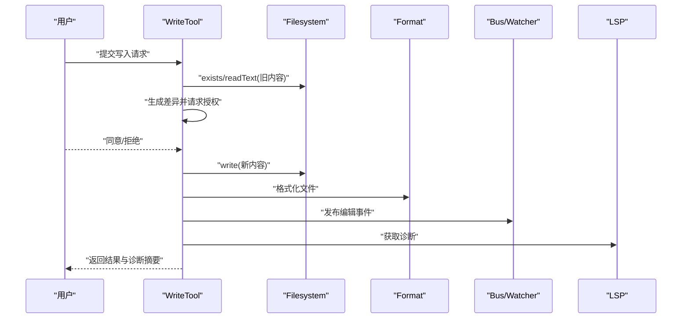
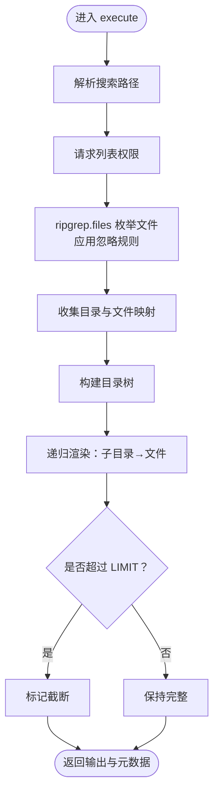
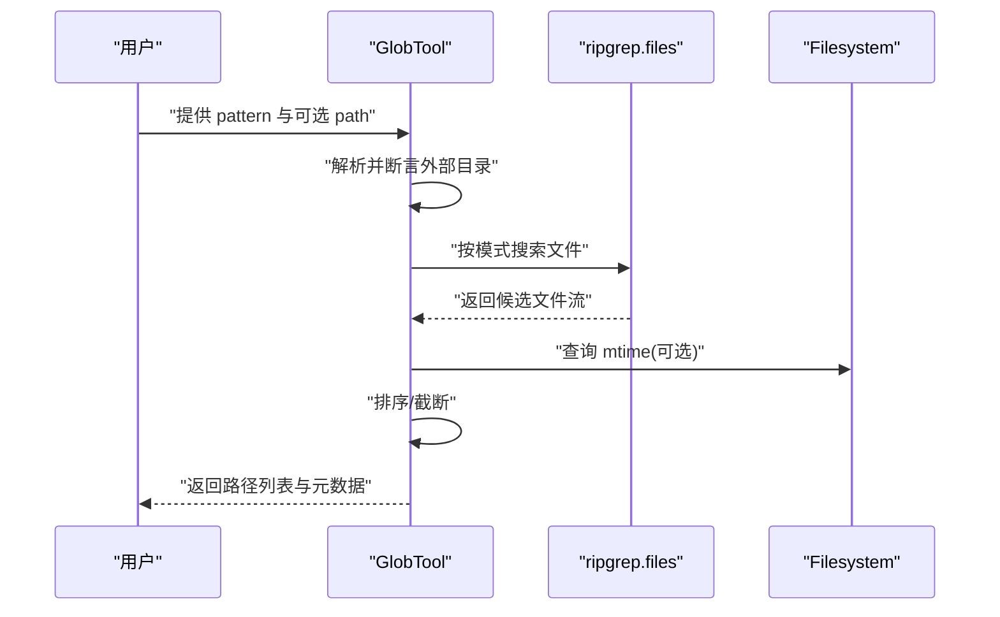
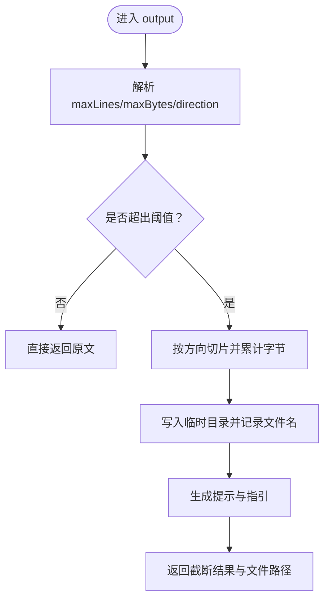
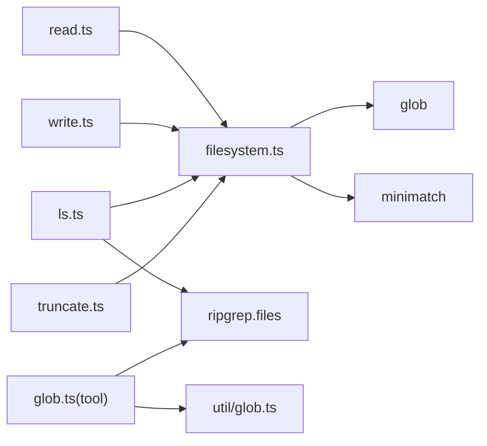

# 文件操作工具

<cite>
**本文引用的文件**
- [packages/opencode/src/tool/read.ts](file://packages/opencode/src/tool/read.ts)
- [packages/opencode/src/util/filesystem.ts](file://packages/opencode/src/util/filesystem.ts)
- [packages/opencode/src/tool/write.ts](file://packages/opencode/src/tool/write.ts)
- [packages/opencode/src/tool/ls.ts](file://packages/opencode/src/tool/ls.ts)
- [packages/opencode/src/tool/glob.ts](file://packages/opencode/src/tool/glob.ts)
- [packages/opencode/src/util/glob.ts](file://packages/opencode/src/util/glob.ts)
- [packages/opencode/src/tool/truncate.ts](file://packages/opencode/src/tool/truncate.ts)
- [packages/opencode/src/tool/ls.txt](file://packages/opencode/src/tool/ls.txt)
- [packages/opencode/src/tool/read.txt](file://packages/opencode/src/tool/read.txt)
- [packages/opencode/src/tool/write.txt](file://packages/opencode/src/tool/write.txt)
- [packages/opencode/src/tool/glob.txt](file://packages/opencode/src/tool/glob.txt)
</cite>

## 目录
1. [简介](#简介)
2. [项目结构](#项目结构)
3. [核心组件](#核心组件)
4. [架构总览](#架构总览)
5. [详细组件分析](#详细组件分析)
6. [依赖关系分析](#依赖关系分析)
7. [性能考量](#性能考量)
8. [故障排查指南](#故障排查指南)
9. [结论](#结论)
10. [附录：使用示例与参数说明](#附录使用示例与参数说明)

## 简介
本文件面向 OpenCode 的文件操作工具集，系统性梳理以下能力：
- 文件读取工具（read）：路径解析、编码处理、行偏移与截断控制
- 文件写入工具（write）：覆盖写入、变更确认、格式化与诊断提示
- 目录列表工具（ls）：忽略规则、递归结构化输出、数量限制
- 文件匹配工具（glob）：通配符匹配、路径搜索、结果排序与截断
- 文件截断工具（truncate）：预览与落盘策略、保留周期与清理机制

文档同时提供流程图与时序图，帮助读者从高层到代码级理解各工具的实现与交互。

## 项目结构
OpenCode 的文件操作工具位于 packages/opencode/src/tool 下，配套的通用文件系统能力在 packages/opencode/src/util 中。核心模块如下：
- 工具层：read.ts、write.ts、ls.ts、glob.ts、truncate.ts
- 工具描述文案：read.txt、write.txt、ls.txt、glob.txt
- 通用工具：filesystem.ts（读写、路径解析、MIME 判断等）、glob.ts（通配符扫描）

图表来源
- [packages/opencode/src/tool/read.ts:1-297](file://packages/opencode/src/tool/read.ts#L1-L297)
- [packages/opencode/src/tool/write.ts:1-85](file://packages/opencode/src/tool/write.ts#L1-L85)
- [packages/opencode/src/tool/ls.ts:1-122](file://packages/opencode/src/tool/ls.ts#L1-L122)
- [packages/opencode/src/tool/glob.ts:1-79](file://packages/opencode/src/tool/glob.ts#L1-L79)
- [packages/opencode/src/tool/truncate.ts:1-145](file://packages/opencode/src/tool/truncate.ts#L1-L145)
- [packages/opencode/src/util/filesystem.ts:1-246](file://packages/opencode/src/util/filesystem.ts#L1-L246)
- [packages/opencode/src/util/glob.ts:1-35](file://packages/opencode/src/util/glob.ts#L1-L35)

章节来源
- [packages/opencode/src/tool/read.ts:1-297](file://packages/opencode/src/tool/read.ts#L1-L297)
- [packages/opencode/src/tool/write.ts:1-85](file://packages/opencode/src/tool/write.ts#L1-L85)
- [packages/opencode/src/tool/ls.ts:1-122](file://packages/opencode/src/tool/ls.ts#L1-L122)
- [packages/opencode/src/tool/glob.ts:1-79](file://packages/opencode/src/tool/glob.ts#L1-L79)
- [packages/opencode/src/tool/truncate.ts:1-145](file://packages/opencode/src/tool/truncate.ts#L1-L145)
- [packages/opencode/src/util/filesystem.ts:1-246](file://packages/opencode/src/util/filesystem.ts#L1-L246)
- [packages/opencode/src/util/glob.ts:1-35](file://packages/opencode/src/util/glob.ts#L1-L35)

## 核心组件
- 文件系统抽象（Filesystem）
  - 提供 exists/isDir/stat/statAsync/size 等元数据能力
  - 提供 readText/readJson/readBytes/readArrayBuffer 等读取能力
  - 提供 write/writeJson/writeStream 等写入能力（含权限设置）
  - 提供 MIME 类型判断、路径规范化与 Windows 路径转换
- 通配符扫描（Glob）
  - 封装 glob/minimatch，提供异步/同步扫描与单文件匹配
- 读取工具（ReadTool）
  - 支持文件与目录读取；对目录返回条目列表并可分页
  - 对二进制/PDF/图片进行特殊处理并可返回附件
  - 基于行偏移与字节上限进行截断
- 写入工具（WriteTool）
  - 读取旧内容生成差异，请求用户确认后执行写入
  - 写入后触发格式化、事件通知与 LSP 诊断收集
- 目录列表工具（ListTool）
  - 使用 ripgrep 进行文件枚举，内置忽略规则与数量限制
  - 构建树形结构化输出
- 文件匹配工具（GlobTool）
  - 基于 ripgrep 搜索匹配文件，按修改时间倒序
  - 结果截断并给出提示
- 截断工具（Truncate）
  - 预览与落盘策略：超过阈值时保存全文至临时目录并返回提示
  - 定期清理过期文件

章节来源
- [packages/opencode/src/util/filesystem.ts:1-246](file://packages/opencode/src/util/filesystem.ts#L1-L246)
- [packages/opencode/src/util/glob.ts:1-35](file://packages/opencode/src/util/glob.ts#L1-L35)
- [packages/opencode/src/tool/read.ts:1-297](file://packages/opencode/src/tool/read.ts#L1-L297)
- [packages/opencode/src/tool/write.ts:1-85](file://packages/opencode/src/tool/write.ts#L1-L85)
- [packages/opencode/src/tool/ls.ts:1-122](file://packages/opencode/src/tool/ls.ts#L1-L122)
- [packages/opencode/src/tool/glob.ts:1-79](file://packages/opencode/src/tool/glob.ts#L1-L79)
- [packages/opencode/src/tool/truncate.ts:1-145](file://packages/opencode/src/tool/truncate.ts#L1-L145)

## 架构总览
下图展示工具层与通用工具层的交互关系，以及关键外部依赖（如 ripgrep、glob、minimatch）：

图表来源
- [packages/opencode/src/tool/read.ts:1-297](file://packages/opencode/src/tool/read.ts#L1-L297)
- [packages/opencode/src/tool/write.ts:1-85](file://packages/opencode/src/tool/write.ts#L1-L85)
- [packages/opencode/src/tool/ls.ts:1-122](file://packages/opencode/src/tool/ls.ts#L1-L122)
- [packages/opencode/src/tool/glob.ts:1-79](file://packages/opencode/src/tool/glob.ts#L1-L79)
- [packages/opencode/src/util/filesystem.ts:1-246](file://packages/opencode/src/util/filesystem.ts#L1-L246)
- [packages/opencode/src/util/glob.ts:1-35](file://packages/opencode/src/util/glob.ts#L1-L35)

## 详细组件分析

### 文件读取工具（ReadTool）
- 功能要点
  - 路径解析：支持相对路径解析到工作区根，Windows 平台路径大小写规范化
  - 权限与安全：通过外部目录断言确保只访问允许范围
  - 目录读取：列出条目并排序，支持 offset/limit 分页
  - 文件读取：逐行读取，限制最大行数与最大字节数，自动截断并提示
  - 二进制检测：对常见二进制扩展与高比例非打印字符进行判定
  - 多媒体处理：对图片/PDF 返回提示与内联附件
- 关键流程（文件读取）

图表来源
- [packages/opencode/src/tool/read.ts:28-236](file://packages/opencode/src/tool/read.ts#L28-L236)

章节来源
- [packages/opencode/src/tool/read.ts:1-297](file://packages/opencode/src/tool/read.ts#L1-L297)

### 文件写入工具（WriteTool）
- 功能要点
  - 路径解析：绝对路径优先，否则拼接工作区目录
  - 变更确认：读取旧内容生成差异，请求用户授权
  - 写入执行：调用 Filesystem.write，随后格式化与事件通知
  - LSP 诊断：收集并汇总错误信息，限制每文件与跨项目数量
- 时序图（写入流程）

图表来源
- [packages/opencode/src/tool/write.ts:26-83](file://packages/opencode/src/tool/write.ts#L26-L83)
- [packages/opencode/src/util/filesystem.ts:61-84](file://packages/opencode/src/util/filesystem.ts#L61-L84)

章节来源
- [packages/opencode/src/tool/write.ts:1-85](file://packages/opencode/src/tool/write.ts#L1-L85)
- [packages/opencode/src/util/filesystem.ts:1-246](file://packages/opencode/src/util/filesystem.ts#L1-L246)

### 目录列表工具（ListTool）
- 功能要点
  - 忽略规则：内置大量常见目录/缓存/IDE产物忽略模式
  - 搜索：基于 ripgrep.files 枚举文件，支持自定义忽略数组
  - 输出：构建树形结构，先子目录后文件，字母序排列
  - 限制：最多返回固定数量（LIMIT），避免过量输出
- 流程图（目录枚举与渲染）

图表来源
- [packages/opencode/src/tool/ls.ts:44-121](file://packages/opencode/src/tool/ls.ts#L44-L121)

章节来源
- [packages/opencode/src/tool/ls.ts:1-122](file://packages/opencode/src/tool/ls.ts#L1-L122)

### 文件匹配工具（GlobTool）
- 功能要点
  - 模式匹配：基于 ripgrep.files 按 glob 模式搜索
  - 路径选择：未提供时使用当前工作目录，支持相对/绝对路径
  - 排序与截断：按修改时间倒序，限制返回数量并提示
- 时序图（glob 搜索）

图表来源
- [packages/opencode/src/tool/glob.ts:21-78](file://packages/opencode/src/tool/glob.ts#L21-L78)
- [packages/opencode/src/util/glob.ts:23-33](file://packages/opencode/src/util/glob.ts#L23-L33)

章节来源
- [packages/opencode/src/tool/glob.ts:1-79](file://packages/opencode/src/tool/glob.ts#L1-L79)
- [packages/opencode/src/util/glob.ts:1-35](file://packages/opencode/src/util/glob.ts#L1-L35)

### 文件截断工具（Truncate）
- 功能要点
  - 预览策略：超过行数或字节阈值时，仅返回预览并落盘全文
  - 方向控制：支持“头部”或“尾部”截断
  - 保留与清理：定期清理过期文件，保留固定天数
  - 权限提示：根据代理权限给出后续建议（Task 或 Read/Grep）
- 流程图（截断决策）

图表来源
- [packages/opencode/src/tool/truncate.ts:63-121](file://packages/opencode/src/tool/truncate.ts#L63-L121)

章节来源
- [packages/opencode/src/tool/truncate.ts:1-145](file://packages/opencode/src/tool/truncate.ts#L1-L145)

## 依赖关系分析
- 工具层依赖
  - read.ts/writet.ts/ls.ts/glob.ts 均依赖 Filesystem 抽象
  - ls.ts/glob.ts 依赖 ripgrep.files 进行高效文件枚举
  - truncate.ts 依赖文件系统服务进行落盘与清理
- 通用工具依赖
  - filesystem.ts 依赖 glob/minimatch 实现通配符与 MIME 判断
  - util/glob.ts 作为统一的 glob 扫描封装

图表来源
- [packages/opencode/src/tool/read.ts:1-297](file://packages/opencode/src/tool/read.ts#L1-L297)
- [packages/opencode/src/tool/write.ts:1-85](file://packages/opencode/src/tool/write.ts#L1-L85)
- [packages/opencode/src/tool/ls.ts:1-122](file://packages/opencode/src/tool/ls.ts#L1-L122)
- [packages/opencode/src/tool/glob.ts:1-79](file://packages/opencode/src/tool/glob.ts#L1-L79)
- [packages/opencode/src/tool/truncate.ts:1-145](file://packages/opencode/src/tool/truncate.ts#L1-L145)
- [packages/opencode/src/util/filesystem.ts:1-246](file://packages/opencode/src/util/filesystem.ts#L1-L246)
- [packages/opencode/src/util/glob.ts:1-35](file://packages/opencode/src/util/glob.ts#L1-L35)

章节来源
- [packages/opencode/src/util/filesystem.ts:1-246](file://packages/opencode/src/util/filesystem.ts#L1-L246)
- [packages/opencode/src/util/glob.ts:1-35](file://packages/opencode/src/util/glob.ts#L1-L35)

## 性能考量
- 读取工具
  - 逐行读取并累计字节，避免一次性加载大文件导致内存峰值
  - 对二进制文件快速判定，减少不必要的 I/O
- 写入工具
  - 仅在用户授权后写入，避免无效写入
  - 写入后格式化与 LSP 诊断可能带来额外开销，建议在必要时使用
- 目录列表与匹配
  - 使用 ripgrep.files 进行高效枚举，内置忽略规则减少无关文件
  - 结果数量限制与排序，避免大规模输出带来的 UI 压力
- 截断工具
  - 预览阈值较小，避免长文本传输；全文落盘于本地临时目录，降低网络与存储压力

## 故障排查指南
- 无法读取文件
  - 检查路径是否为绝对路径或相对于工作区；Windows 平台注意大小写规范化
  - 若文件不存在，工具会尝试提供父目录相似项建议
- 二进制文件不可读
  - 工具会对常见二进制扩展与高比例非打印字符进行判定并拒绝读取
- 写入被拒绝
  - 需要用户授权差异确认；若未授权，写入不会执行
- 目录列表为空或不完整
  - 检查忽略规则是否过于严格；适当放宽 ignore 参数
- glob 结果被截断
  - 结果数量达到上限；建议缩小搜索范围或使用更具体的模式
- 截断提示
  - 当输出超过阈值时，工具会提示全文已保存至临时目录，建议使用 Task/Grep/Read 进一步处理

章节来源
- [packages/opencode/src/tool/read.ts:55-77](file://packages/opencode/src/tool/read.ts#L55-L77)
- [packages/opencode/src/tool/read.ts:147-149](file://packages/opencode/src/tool/read.ts#L147-L149)
- [packages/opencode/src/tool/write.ts:34-43](file://packages/opencode/src/tool/write.ts#L34-L43)
- [packages/opencode/src/tool/ls.ts:57-62](file://packages/opencode/src/tool/ls.ts#L57-L62)
- [packages/opencode/src/tool/glob.ts:36-56](file://packages/opencode/src/tool/glob.ts#L36-L56)
- [packages/opencode/src/tool/truncate.ts:70-72](file://packages/opencode/src/tool/truncate.ts#L70-L72)

## 结论
OpenCode 的文件操作工具以 Filesystem 为核心抽象，围绕读取、写入、列表、匹配与截断五大能力构建了安全、可控且高效的文件操作链路。通过权限断言、阈值控制与外部工具集成，既保证了易用性，也兼顾了性能与安全性。

## 附录：使用示例与参数说明

- 读取工具（read）
  - 参数
    - filePath：目标文件或目录的绝对路径
    - offset：起始行号（1 起始），用于分页
    - limit：最大读取行数（默认 2000）
  - 行为
    - 目录：列出条目并按字母序排序，支持 offset/limit 分页
    - 文件：逐行读取，按行数与字节上限截断，返回预览与提示
    - 二进制/图片/PDF：返回提示与附件
  - 示例路径
    - [packages/opencode/src/tool/read.ts:23-27](file://packages/opencode/src/tool/read.ts#L23-L27)
    - [packages/opencode/src/tool/read.txt](file://packages/opencode/src/tool/read.txt)

- 写入工具（write）
  - 参数
    - filePath：目标文件的绝对路径
    - content：要写入的内容
  - 行为
    - 读取旧内容生成差异，请求授权后写入
    - 写入后格式化、发布事件、收集 LSP 诊断
  - 示例路径
    - [packages/opencode/src/tool/write.ts:22-25](file://packages/opencode/src/tool/write.ts#L22-L25)
    - [packages/opencode/src/tool/write.txt](file://packages/opencode/src/tool/write.txt)

- 目录列表工具（ls）
  - 参数
    - path：要列出的目录绝对路径（未提供则使用工作区）
    - ignore：glob 忽略模式数组
  - 行为
    - 应用内置忽略规则与自定义 ignore，使用 ripgrep 枚举文件
    - 构建树形结构输出，先子目录后文件，字母序排列
  - 示例路径
    - [packages/opencode/src/tool/ls.ts:40-43](file://packages/opencode/src/tool/ls.ts#L40-L43)
    - [packages/opencode/src/tool/ls.txt](file://packages/opencode/src/tool/ls.txt)

- 文件匹配工具（glob）
  - 参数
    - pattern：glob 模式
    - path：搜索目录（未提供则使用工作区）
  - 行为
    - 使用 ripgrep.files 搜索匹配文件，按修改时间倒序
    - 结果数量受限并提示
  - 示例路径
    - [packages/opencode/src/tool/glob.ts:12-19](file://packages/opencode/src/tool/glob.ts#L12-L19)
    - [packages/opencode/src/tool/glob.txt](file://packages/opencode/src/tool/glob.txt)

- 截断工具（truncate）
  - 参数
    - maxLines：最大行数阈值（默认 2000）
    - maxBytes：最大字节数阈值（默认 50KB）
    - direction：截断方向（head/tail，默认 head）
  - 行为
    - 超阈值时保存全文至临时目录，返回预览与提示
    - 定期清理过期文件
  - 示例路径
    - [packages/opencode/src/tool/truncate.ts:24-28](file://packages/opencode/src/tool/truncate.ts#L24-L28)