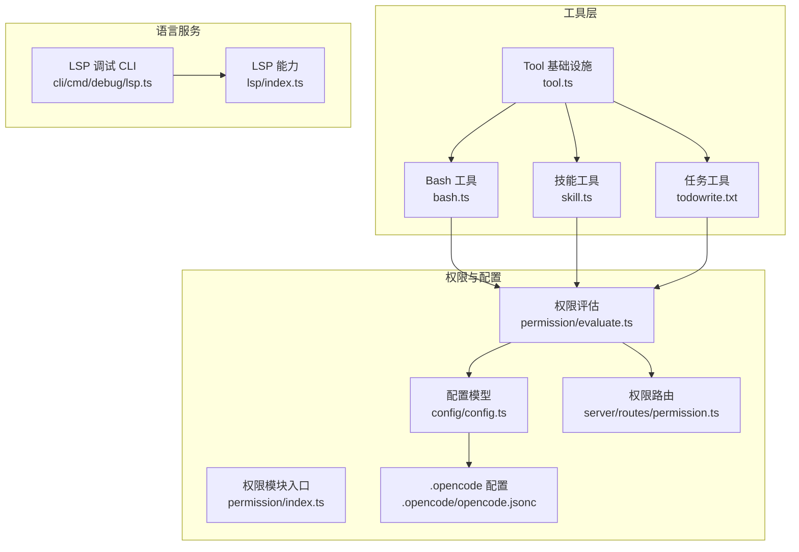
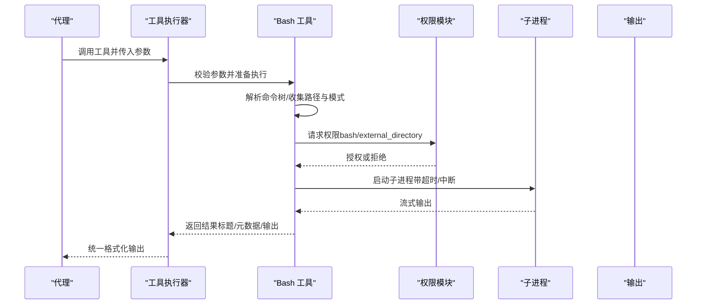
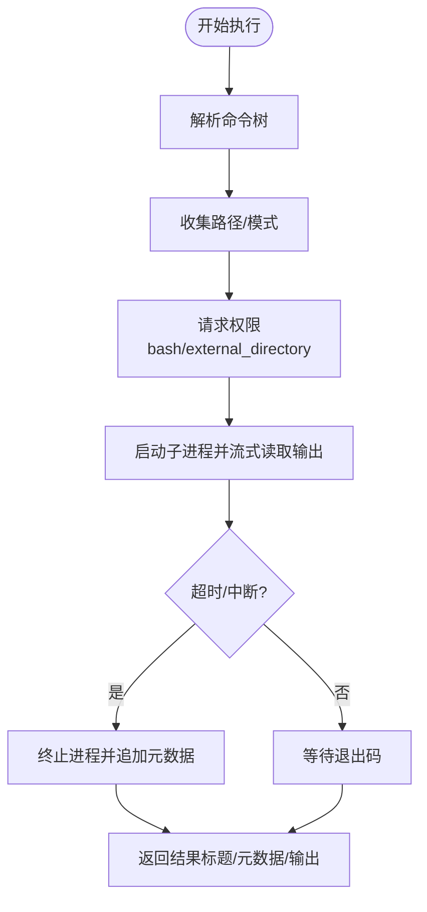
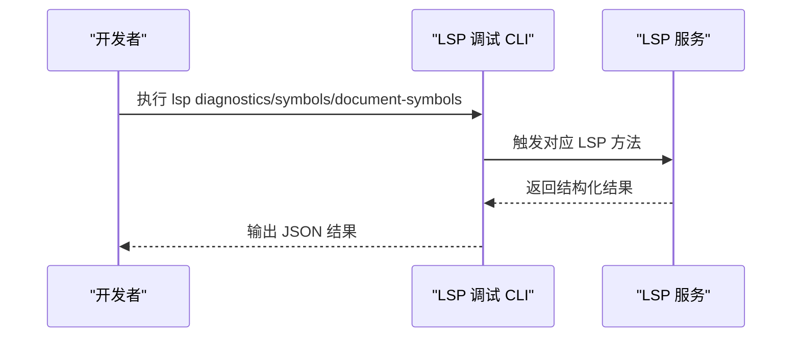
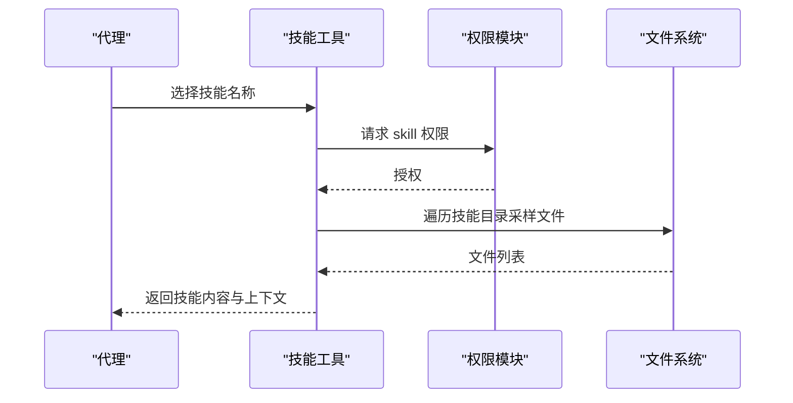
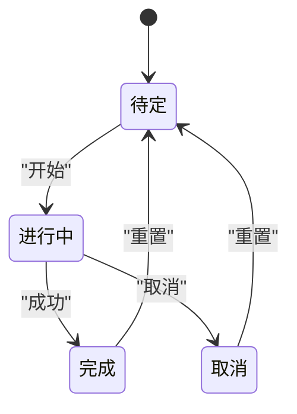
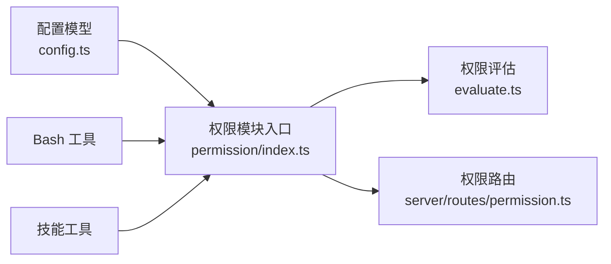

# 系统工具

<cite>
**本文引用的文件**
- [packages/opencode/src/tool/bash.ts](file://packages/opencode/src/tool/bash.ts)
- [packages/opencode/src/tool/bash.txt](file://packages/opencode/src/tool/bash.txt)
- [packages/opencode/src/tool/tool.ts](file://packages/opencode/src/tool/tool.ts)
- [packages/opencode/src/lsp/index.ts](file://packages/opencode/src/lsp/index.ts)
- [packages/opencode/src/cli/cmd/debug/lsp.ts](file://packages/opencode/src/cli/cmd/debug/lsp.ts)
- [packages/opencode/src/tool/skill.ts](file://packages/opencode/src/tool/skill.ts)
- [packages/opencode/src/tool/todowrite.txt](file://packages/opencode/src/tool/todowrite.txt)
- [packages/opencode/src/permission/evaluate.ts](file://packages/opencode/src/permission/evaluate.ts)
- [packages/opencode/src/permission/index.ts](file://packages/opencode/src/permission/index.ts)
- [packages/opencode/src/config/config.ts](file://packages/opencode/src/config/config.ts)
- [packages/opencode/src/server/routes/permission.ts](file://packages/opencode/src/server/routes/permission.ts)
- [.opencode/opencode.jsonc](file://.opencode/opencode.jsonc)
- [packages/opencode/test/tool/bash.test.ts](file://packages/opencode/test/tool/bash.test.ts)
- [packages/opencode/test/tool/task.test.ts](file://packages/opencode/test/tool/task.test.ts)
- [packages/opencode/test/permission-task.test.ts](file://packages/opencode/test/permission-task.test.ts)
</cite>

## 目录
1. [简介](#简介)
2. [项目结构](#项目结构)
3. [核心组件](#核心组件)
4. [架构总览](#架构总览)
5. [详细组件分析](#详细组件分析)
6. [依赖关系分析](#依赖关系分析)
7. [性能考量](#性能考量)
8. [故障排查指南](#故障排查指南)
9. [结论](#结论)
10. [附录](#附录)

## 简介
本文件面向 OpenCode 系统中的“系统工具”，围绕以下四大工具进行专业级技术说明：Bash 执行工具（bash）、语言服务器协议工具（lsp）、技能工具（skill）、任务工具（task）。内容覆盖实现机制、安全防护、配置参数与典型应用场景，并辅以可视化图示帮助不同背景读者理解。

## 项目结构
OpenCode 的工具层位于 packages/opencode/src/tool 下，围绕 Tool 基础设施定义具体工具；语言服务能力在 lsp 模块中实现；权限与策略在 permission 模块中集中处理；配置项在 config 模块中定义；调试与 CLI 在 cli/cmd/debug 中提供辅助工具。

图表来源
- [packages/opencode/src/tool/tool.ts:1-113](file://packages/opencode/src/tool/tool.ts#L1-L113)
- [packages/opencode/src/tool/bash.ts:1-497](file://packages/opencode/src/tool/bash.ts#L1-L497)
- [packages/opencode/src/tool/skill.ts:1-106](file://packages/opencode/src/tool/skill.ts#L1-L106)
- [packages/opencode/src/tool/todowrite.txt:146-166](file://packages/opencode/src/tool/todowrite.txt#L146-L166)
- [packages/opencode/src/lsp/index.ts:55-558](file://packages/opencode/src/lsp/index.ts#L55-L558)
- [packages/opencode/src/cli/cmd/debug/lsp.ts:1-53](file://packages/opencode/src/cli/cmd/debug/lsp.ts#L1-L53)
- [packages/opencode/src/permission/evaluate.ts:1-15](file://packages/opencode/src/permission/evaluate.ts#L1-L15)
- [packages/opencode/src/permission/index.ts:1-41](file://packages/opencode/src/permission/index.ts#L1-L41)
- [packages/opencode/src/config/config.ts:432-468](file://packages/opencode/src/config/config.ts#L432-L468)
- [packages/opencode/src/server/routes/permission.ts:52-69](file://packages/opencode/src/server/routes/permission.ts#L52-L69)
- [.opencode/opencode.jsonc:1-19](file://.opencode/opencode.jsonc#L1-L19)

章节来源
- [packages/opencode/src/tool/tool.ts:1-113](file://packages/opencode/src/tool/tool.ts#L1-L113)
- [packages/opencode/src/tool/bash.ts:1-497](file://packages/opencode/src/tool/bash.ts#L1-L497)
- [packages/opencode/src/tool/skill.ts:1-106](file://packages/opencode/src/tool/skill.ts#L1-L106)
- [packages/opencode/src/tool/todowrite.txt:146-166](file://packages/opencode/src/tool/todowrite.txt#L146-L166)
- [packages/opencode/src/lsp/index.ts:55-558](file://packages/opencode/src/lsp/index.ts#L55-L558)
- [packages/opencode/src/cli/cmd/debug/lsp.ts:1-53](file://packages/opencode/src/cli/cmd/debug/lsp.ts#L1-L53)
- [packages/opencode/src/permission/evaluate.ts:1-15](file://packages/opencode/src/permission/evaluate.ts#L1-L15)
- [packages/opencode/src/permission/index.ts:1-41](file://packages/opencode/src/permission/index.ts#L1-L41)
- [packages/opencode/src/config/config.ts:432-468](file://packages/opencode/src/config/config.ts#L432-L468)
- [packages/opencode/src/server/routes/permission.ts:52-69](file://packages/opencode/src/server/routes/permission.ts#L52-L69)
- [.opencode/opencode.jsonc:1-19](file://.opencode/opencode.jsonc#L1-L19)

## 核心组件
- 工具基础设施（Tool）
  - 定义工具的统一接口、参数校验、执行包装与输出截断逻辑，确保各工具的一致性与可扩展性。
- Bash 工具（bash）
  - 解析命令树、提取路径与模式、请求权限、运行子进程并捕获输出，支持超时与中断。
- LSP 工具（lsp）
  - 提供符号、诊断、调用层次等语言服务能力，支持调试 CLI。
- 技能工具（skill）
  - 加载领域技能，注入上下文与资源，触发权限请求。
- 任务工具（task）
  - 描述与排序可用子代理，驱动工作流执行与状态管理。

章节来源
- [packages/opencode/src/tool/tool.ts:1-113](file://packages/opencode/src/tool/tool.ts#L1-L113)
- [packages/opencode/src/tool/bash.ts:1-497](file://packages/opencode/src/tool/bash.ts#L1-L497)
- [packages/opencode/src/lsp/index.ts:55-558](file://packages/opencode/src/lsp/index.ts#L55-L558)
- [packages/opencode/src/tool/skill.ts:1-106](file://packages/opencode/src/tool/skill.ts#L1-L106)
- [packages/opencode/src/tool/todowrite.txt:146-166](file://packages/opencode/src/tool/todowrite.txt#L146-L166)

## 架构总览
系统工具通过 Tool 基础设施统一编排，权限模块负责策略评估与交互式授权，LSP 提供语言服务，技能工具与任务工具分别承载知识与工作流能力。

图表来源
- [packages/opencode/src/tool/tool.ts:58-94](file://packages/opencode/src/tool/tool.ts#L58-L94)
- [packages/opencode/src/tool/bash.ts:267-409](file://packages/opencode/src/tool/bash.ts#L267-L409)
- [packages/opencode/src/permission/evaluate.ts:9-15](file://packages/opencode/src/permission/evaluate.ts#L9-L15)

## 详细组件分析

### Bash 执行工具（bash）
- 命令解析与扫描
  - 使用 Tree-sitter 解析 Bash/Powershell 命令，提取命令节点、参数与重定向，识别文件操作命令与路径参数，生成目录与模式集合用于权限请求。
- 沙箱隔离与环境
  - 选择可接受的 shell，构造进程环境（合并插件注入），Windows 上对 PowerShell 进行特定参数处理；非 Windows 平台使用独立进程。
- 输出捕获与元数据
  - 通过流式解码累积输出，实时上报元数据（如部分输出预览），支持超时与用户中断，终止后追加元数据标记。
- 权限与安全
  - 对外部目录访问与命令模式发起授权请求；对仅切换目录的命令不触发 bash 权限；支持 always 模式避免重复提示。

图表来源
- [packages/opencode/src/tool/bash.ts:261-409](file://packages/opencode/src/tool/bash.ts#L261-L409)

章节来源
- [packages/opencode/src/tool/bash.ts:1-497](file://packages/opencode/src/tool/bash.ts#L1-L497)
- [packages/opencode/src/tool/bash.txt:1-23](file://packages/opencode/src/tool/bash.txt#L1-L23)
- [packages/opencode/test/tool/bash.test.ts:116-134](file://packages/opencode/test/tool/bash.test.ts#L116-L134)
- [packages/opencode/test/tool/bash.test.ts:842-896](file://packages/opencode/test/tool/bash.test.ts#L842-L896)
- [packages/opencode/test/tool/bash.test.ts:899-930](file://packages/opencode/test/tool/bash.test.ts#L899-L930)

### LSP 工具（lsp）
- 能力范围
  - 提供符号解析（文档/工作区）、引用、实现、调用层次、诊断等语言服务方法；包含诊断信息美化输出。
- 调试 CLI
  - 提供诊断、符号与文档符号的调试命令，便于本地验证 LSP 状态与结果。

图表来源
- [packages/opencode/src/cli/cmd/debug/lsp.ts:16-53](file://packages/opencode/src/cli/cmd/debug/lsp.ts#L16-L53)
- [packages/opencode/src/lsp/index.ts:528-558](file://packages/opencode/src/lsp/index.ts#L528-L558)

章节来源
- [packages/opencode/src/lsp/index.ts:55-558](file://packages/opencode/src/lsp/index.ts#L55-L558)
- [packages/opencode/src/cli/cmd/debug/lsp.ts:1-53](file://packages/opencode/src/cli/cmd/debug/lsp.ts#L1-L53)

### 技能工具（skill）
- 功能概述
  - 列出可用技能，加载指定技能内容，注入技能上下文与资源文件列表，触发权限请求。
- 知识库与检索
  - 通过 Ripgrep 遍历技能目录，采样列出相关文件，作为上下文补充；技能内容本身由技能文件提供。

图表来源
- [packages/opencode/src/tool/skill.ts:43-103](file://packages/opencode/src/tool/skill.ts#L43-L103)

章节来源
- [packages/opencode/src/tool/skill.ts:1-106](file://packages/opencode/src/tool/skill.ts#L1-L106)

### 任务工具（task）
- 工作流控制
  - 描述与排序可用子代理，驱动任务执行；状态包括 pending、in_progress、completed、cancelled。
- 依赖与调度
  - 一次仅允许一个 in_progress 任务，完成后方可开启新任务；取消无关任务。
- 配置与场景
  - 可通过配置启用/禁用工具；结合权限规则控制任务访问。

图表来源
- [packages/opencode/src/tool/todowrite.txt:146-166](file://packages/opencode/src/tool/todowrite.txt#L146-L166)

章节来源
- [packages/opencode/src/tool/todowrite.txt:146-166](file://packages/opencode/src/tool/todowrite.txt#L146-L166)
- [packages/opencode/test/tool/task.test.ts:11-49](file://packages/opencode/test/tool/task.test.ts#L11-L49)
- [packages/opencode/test/permission-task.test.ts:38-65](file://packages/opencode/test/permission-task.test.ts#L38-L65)

## 依赖关系分析
- 工具与权限
  - Bash 与 Skill 在执行前会根据扫描结果请求权限；权限评估遵循“最后匹配优先”的规则，支持通配符与组合规则。
- 配置与策略
  - 权限动作（allow/deny/ask）与规则集从配置加载，支持对象与字符串两种形式；原始键序保留以便按顺序评估。
- 路由与界面
  - 权限路由提供列表接口，便于前端展示待决请求。

图表来源
- [packages/opencode/src/config/config.ts:432-468](file://packages/opencode/src/config/config.ts#L432-L468)
- [packages/opencode/src/permission/index.ts:1-41](file://packages/opencode/src/permission/index.ts#L1-L41)
- [packages/opencode/src/permission/evaluate.ts:9-15](file://packages/opencode/src/permission/evaluate.ts#L9-L15)
- [packages/opencode/src/server/routes/permission.ts:52-69](file://packages/opencode/src/server/routes/permission.ts#L52-L69)

章节来源
- [packages/opencode/src/config/config.ts:432-468](file://packages/opencode/src/config/config.ts#L432-L468)
- [packages/opencode/src/permission/index.ts:1-41](file://packages/opencode/src/permission/index.ts#L1-L41)
- [packages/opencode/src/permission/evaluate.ts:1-15](file://packages/opencode/src/permission/evaluate.ts#L1-L15)
- [packages/opencode/src/server/routes/permission.ts:52-69](file://packages/opencode/src/server/routes/permission.ts#L52-L69)

## 性能考量
- Bash 工具
  - 使用流式输出与预览截断，避免一次性加载大量输出；默认超时可按需调整；Windows 上对 PowerShell 的特殊处理降低兼容性开销。
- 技能工具
  - 采用采样方式列举文件，限制数量以减少 IO 开销；内容加载与权限请求分离，提升响应速度。
- LSP 工具
  - 通过调试 CLI 快速验证结果，避免在生产环境频繁触发重负载请求。

## 故障排查指南
- Bash 权限未授予
  - 现象：执行被阻断或需要确认。
  - 处理：检查权限规则与 always 模式；确认命令是否仅包含目录切换而不触发 bash 权限。
- Bash 超时或中断
  - 现象：长时间运行命令被终止。
  - 处理：适当提高超时；在中断后检查输出是否已捕获。
- 技能加载失败
  - 现象：找不到技能或权限被拒绝。
  - 处理：确认技能名称与可用列表一致；检查权限配置。
- 任务状态异常
  - 现象：并发任务或状态不一致。
  - 处理：遵循“一次仅一个 in_progress”原则；及时完成或取消任务。

章节来源
- [packages/opencode/test/tool/bash.test.ts:842-896](file://packages/opencode/test/tool/bash.test.ts#L842-L896)
- [packages/opencode/test/tool/bash.test.ts:899-930](file://packages/opencode/test/tool/bash.test.ts#L899-L930)
- [packages/opencode/test/permission-task.test.ts:38-65](file://packages/opencode/test/permission-task.test.ts#L38-L65)

## 结论
OpenCode 的系统工具通过统一的工具基础设施与严格的权限策略，实现了安全可控的 Bash 执行、完善的 LSP 能力、灵活的技能注入与严谨的任务管理。配合可配置的策略与调试工具，能够满足复杂工程场景下的自动化与智能化需求。

## 附录

### 配置参数与应用场景
- 工具开关与权限
  - 可在全局配置中关闭特定工具（如某些工具的开关位）；通过权限规则控制工具使用范围。
- Bash 工具
  - 参数：命令、超时、工作目录、描述；适用于构建、部署、运维脚本等终端操作。
- LSP 工具
  - 场景：代码补全、符号导航、错误诊断、调用链分析；配合调试 CLI 快速定位问题。
- 技能工具
  - 场景：加载领域知识、模板与脚本资源，辅助代理在特定任务上具备更强上下文能力。
- 任务工具
  - 场景：将复杂任务拆分为有序步骤，明确状态流转，保障执行一致性与可追踪性。

章节来源
- [.opencode/opencode.jsonc:14-18](file://.opencode/opencode.jsonc#L14-L18)
- [packages/opencode/src/tool/bash.ts:455-469](file://packages/opencode/src/tool/bash.ts#L455-L469)
- [packages/opencode/src/tool/skill.ts:36-38](file://packages/opencode/src/tool/skill.ts#L36-L38)
- [packages/opencode/src/tool/todowrite.txt:146-166](file://packages/opencode/src/tool/todowrite.txt#L146-L166)