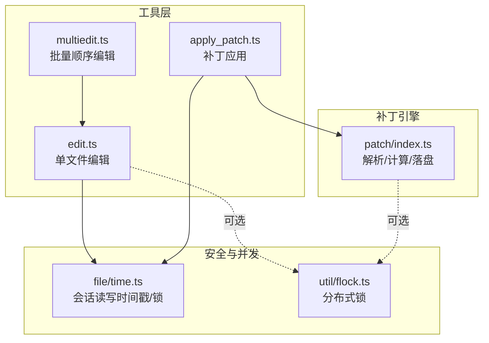
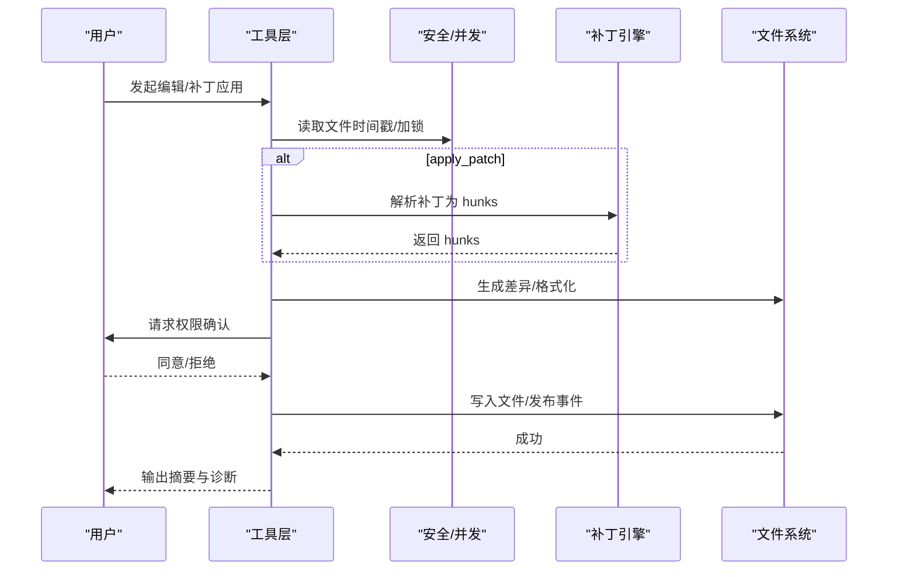
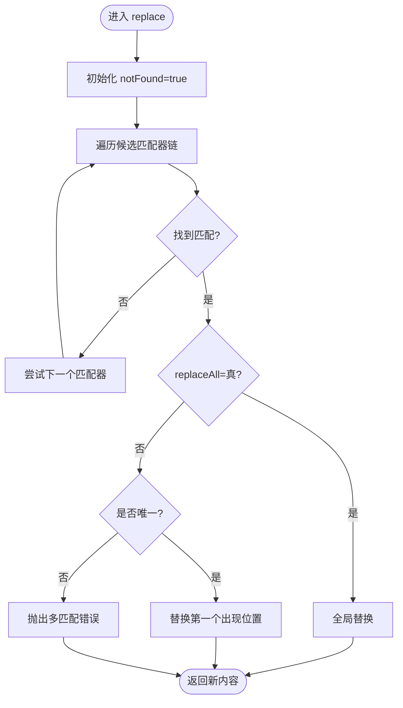
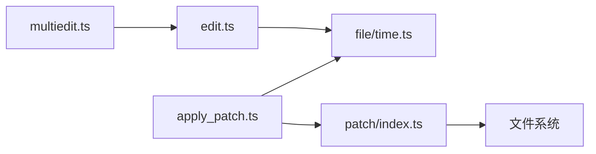

# 编辑工具

<cite>
**本文引用的文件**
- [packages/opencode/src/tool/edit.ts](file://packages/opencode/src/tool/edit.ts)
- [packages/opencode/src/tool/edit.txt](file://packages/opencode/src/tool/edit.txt)
- [packages/opencode/src/tool/multiedit.ts](file://packages/opencode/src/tool/multiedit.ts)
- [packages/opencode/src/tool/multiedit.txt](file://packages/opencode/src/tool/multiedit.txt)
- [packages/opencode/src/tool/apply_patch.ts](file://packages/opencode/src/tool/apply_patch.ts)
- [packages/opencode/src/tool/apply_patch.txt](file://packages/opencode/src/tool/apply_patch.txt)
- [packages/opencode/src/patch/index.ts](file://packages/opencode/src/patch/index.ts)
- [packages/opencode/src/file/time.ts](file://packages/opencode/src/file/time.ts)
- [packages/opencode/src/util/flock.ts](file://packages/opencode/src/util/flock.ts)
- [packages/opencode/test/tool/edit.test.ts](file://packages/opencode/test/tool/edit.test.ts)
- [packages/opencode/test/patch/patch.test.ts](file://packages/opencode/test/patch/patch.test.ts)
- [packages/opencode/test/file/time.test.ts](file://packages/opencode/test/file/time.test.ts)
- [packages/opencode/test/util/flock.test.ts](file://packages/opencode/test/util/flock.test.ts)
</cite>

## 目录
1. [简介](#简介)
2. [项目结构](#项目结构)
3. [核心组件](#核心组件)
4. [架构总览](#架构总览)
5. [详细组件分析](#详细组件分析)
6. [依赖关系分析](#依赖关系分析)
7. [性能考量](#性能考量)
8. [故障排查指南](#故障排查指南)
9. [结论](#结论)
10. [附录：高级用法与示例](#附录高级用法与示例)

## 简介
本指南面向 OpenCode 的编辑工具链，覆盖三类能力：
- 单文件编辑工具（edit）：精确字符串替换、插入、格式化与安全校验
- 批量编辑工具（multiedit）：对同一文件的顺序多步编辑，保证原子性
- 补丁应用工具（apply_patch）：基于统一补丁格式解析 hunks，执行新增/更新/删除/移动，并进行差异计算与 LSP 校验

文档重点解释实现机制、并发控制、差异处理、安全验证与回滚思路，并提供高级用法建议。

## 项目结构
围绕编辑工具的核心文件组织如下：
- 工具定义与执行逻辑：edit.ts、multiedit.ts、apply_patch.ts
- 工具说明文案：edit.txt、multiedit.txt、apply_patch.txt
- 补丁解析与应用：patch/index.ts
- 安全与并发控制：file/time.ts（会话时间戳与锁）、util/flock.ts（分布式锁）
- 测试用例：edit.test.ts、patch.test.ts、file/time.test.ts、util/flock.test.ts

图表来源
- [packages/opencode/src/tool/edit.ts:37-167](file://packages/opencode/src/tool/edit.ts#L37-L167)
- [packages/opencode/src/tool/multiedit.ts:8-46](file://packages/opencode/src/tool/multiedit.ts#L8-L46)
- [packages/opencode/src/tool/apply_patch.ts:22-281](file://packages/opencode/src/tool/apply_patch.ts#L22-L281)
- [packages/opencode/src/patch/index.ts:190-420](file://packages/opencode/src/patch/index.ts#L190-L420)
- [packages/opencode/src/file/time.ts:10-134](file://packages/opencode/src/file/time.ts#L10-L134)
- [packages/opencode/src/util/flock.ts:1-190](file://packages/opencode/src/util/flock.ts#L1-L190)

章节来源
- [packages/opencode/src/tool/edit.ts:1-668](file://packages/opencode/src/tool/edit.ts#L1-L668)
- [packages/opencode/src/tool/multiedit.ts:1-47](file://packages/opencode/src/tool/multiedit.ts#L1-L47)
- [packages/opencode/src/tool/apply_patch.ts:1-282](file://packages/opencode/src/tool/apply_patch.ts#L1-L282)
- [packages/opencode/src/patch/index.ts:1-681](file://packages/opencode/src/patch/index.ts#L1-L681)
- [packages/opencode/src/file/time.ts:1-134](file://packages/opencode/src/file/time.ts#L1-L134)
- [packages/opencode/src/util/flock.ts:1-190](file://packages/opencode/src/util/flock.ts#L1-L190)

## 核心组件
- 单文件编辑（edit）
  - 精确字符串替换，支持多候选匹配策略（逐字、去空白、块锚点、缩进无关、转义归一、边界修剪、上下文感知等），可选择全部替换
  - 严格的安全前置：必须先读取文件，再在会话内修改；修改前后生成差异，触发格式化与 LSP 诊断
  - 并发控制：文件级互斥锁，避免竞态与覆盖

- 批量编辑（multiedit）
  - 在单文件上按序执行多个编辑步骤，每个步骤基于前一步结果
  - 原子性：任一步失败则整体回滚（通过顺序执行与错误传播实现）

- 补丁应用（apply_patch）
  - 解析自描述补丁（Begin/End 包裹，Add/Delete/Update/Move to 头部），提取 hunks
  - 对每个 hunk 计算新内容、生成差异、校验路径与权限，最终落盘并通知 LSP

章节来源
- [packages/opencode/src/tool/edit.ts:37-167](file://packages/opencode/src/tool/edit.ts#L37-L167)
- [packages/opencode/src/tool/multiedit.ts:8-46](file://packages/opencode/src/tool/multiedit.ts#L8-L46)
- [packages/opencode/src/tool/apply_patch.ts:22-281](file://packages/opencode/src/tool/apply_patch.ts#L22-L281)
- [packages/opencode/src/patch/index.ts:190-420](file://packages/opencode/src/patch/index.ts#L190-L420)

## 架构总览
下图展示从用户意图到文件落盘的关键流程与交互：

图表来源
- [packages/opencode/src/tool/edit.ts:57-122](file://packages/opencode/src/tool/edit.ts#L57-L122)
- [packages/opencode/src/tool/apply_patch.ts:25-186](file://packages/opencode/src/tool/apply_patch.ts#L25-L186)
- [packages/opencode/src/patch/index.ts:190-246](file://packages/opencode/src/patch/index.ts#L190-L246)
- [packages/opencode/src/file/time.ts:76-108](file://packages/opencode/src/file/time.ts#L76-L108)

## 详细组件分析

### 单文件编辑工具（edit）
- 实现要点
  - 参数校验：绝对路径、old/new 不同、非空 oldString
  - 文件读取与行结尾归一化，确保替换前后一致
  - 多候选匹配器链：逐个尝试，命中后决定是否全部替换或唯一替换
  - 权限请求：生成差异摘要，等待用户确认
  - 落盘与后续：写入、格式化、发布事件、更新会话时间戳
  - LSP 诊断：收集错误并限制输出数量

- 关键流程（替换算法）

图表来源
- [packages/opencode/src/tool/edit.ts:630-668](file://packages/opencode/src/tool/edit.ts#L630-L668)

- 安全与并发
  - 会话时间戳断言：未读取即修改会报错
  - 文件级互斥：withLock 序列化同一文件的并发操作
  - 分布式锁：可选用于跨进程/跨实例的强一致性场景

- 格式保持
  - 行结尾检测与转换，保证 CRLF/LF 统一
  - 替换后重新计算差异，保留上下文缩进

章节来源
- [packages/opencode/src/tool/edit.ts:37-167](file://packages/opencode/src/tool/edit.ts#L37-L167)
- [packages/opencode/src/file/time.ts:76-108](file://packages/opencode/src/file/time.ts#L76-L108)
- [packages/opencode/test/tool/edit.test.ts:624-663](file://packages/opencode/test/tool/edit.test.ts#L624-L663)

### 批量编辑工具（multiedit）
- 实现要点
  - 基于 edit 工具顺序执行多个编辑步骤
  - 每次迭代基于上一步结果继续替换
  - 原子性：任一步失败则整体失败（由顺序执行与异常传播保证）

- 并发与事务
  - 由于是顺序执行，天然避免了“早期修改影响后续查找”的问题
  - 若需跨文件并发，应使用独立 multiedit 实例或外部编排

- 回滚机制
  - 无显式回滚栈；通过一次性顺序提交实现“要么全成功，要么全不生效”

章节来源
- [packages/opencode/src/tool/multiedit.ts:8-46](file://packages/opencode/src/tool/multiedit.ts#L8-L46)
- [packages/opencode/src/tool/multiedit.txt:15-30](file://packages/opencode/src/tool/multiedit.txt#L15-L30)

### 补丁应用工具（apply_patch）
- 实现要点
  - 解析补丁：Begin/End 标记、Add/Delete/Update/Move to 头部
  - 计算新内容：deriveNewContentsFromChunks，按 chunks 顺序定位并替换
  - 路径与权限：解析相对/绝对路径，权限请求，生成汇总差异
  - 落盘与通知：创建目录、写入/删除/移动、格式化、发布事件、LSP 触摸

- 差异处理与冲突
  - 通过上下文定位（change_context）与尾部锚定（is_end_of_file）提升稳定性
  - 若找不到预期上下文，抛出错误，避免误改
  - 生成统一 diff 用于 UI 展示与审计

- 并发与一致性
  - 逐个 hunk 应用，减少跨文件并发风险
  - 可结合文件级锁与会话时间戳进一步加固

章节来源
- [packages/opencode/src/tool/apply_patch.ts:22-281](file://packages/opencode/src/tool/apply_patch.ts#L22-L281)
- [packages/opencode/src/patch/index.ts:190-420](file://packages/opencode/src/patch/index.ts#L190-L420)
- [packages/opencode/test/patch/patch.test.ts:105-134](file://packages/opencode/test/patch/patch.test.ts#L105-L134)

## 依赖关系分析
- 工具层依赖
  - edit/apply_patch 依赖 file/time 进行会话断言与文件锁
  - apply_patch 依赖 patch 引擎解析与计算
  - multiedit 依赖 edit，形成顺序链路

- 外部依赖
  - diff 库用于差异生成与统计
  - effect 生态用于服务层与并发语义（文件时间戳服务）

图表来源
- [packages/opencode/src/tool/edit.ts:10-20](file://packages/opencode/src/tool/edit.ts#L10-L20)
- [packages/opencode/src/tool/multiedit.ts:1-7](file://packages/opencode/src/tool/multiedit.ts#L1-L7)
- [packages/opencode/src/tool/apply_patch.ts:1-17](file://packages/opencode/src/tool/apply_patch.ts#L1-L17)
- [packages/opencode/src/patch/index.ts:1-6](file://packages/opencode/src/patch/index.ts#L1-L6)

章节来源
- [packages/opencode/src/tool/edit.ts:1-668](file://packages/opencode/src/tool/edit.ts#L1-L668)
- [packages/opencode/src/tool/multiedit.ts:1-47](file://packages/opencode/src/tool/multiedit.ts#L1-L47)
- [packages/opencode/src/tool/apply_patch.ts:1-282](file://packages/opencode/src/tool/apply_patch.ts#L1-L282)
- [packages/opencode/src/patch/index.ts:1-681](file://packages/opencode/src/patch/index.ts#L1-L681)

## 性能考量
- 替换算法
  - 多候选匹配器链按优先级尝试，最坏情况下可能多次扫描内容
  - replaceAll 会进行一次全量替换，适合大规模重命名/批量替换
- 差异计算
  - 使用 diff 库生成两版内容差异，开销与变更规模线性相关
- 并发控制
  - 文件级互斥与会话时间戳断言避免竞态，但串行化可能降低吞吐
- 建议
  - 大文件编辑优先使用 replaceAll 与块锚点匹配，减少多轮替换
  - 批量任务拆分为多实例并行，单实例内顺序执行以保证一致性

[本节为通用指导，无需特定文件引用]

## 故障排查指南
- “必须先读取文件”错误
  - 症状：直接修改文件时报错
  - 处理：先调用 Read 工具，再执行 edit 或 apply_patch
  - 参考
    - [packages/opencode/src/file/time.ts:89-104](file://packages/opencode/src/file/time.ts#L89-L104)

- “oldString 未找到或多匹配”错误
  - 症状：edit 报错
  - 处理：提供更大上下文使 oldString 唯一；或启用 replaceAll
  - 参考
    - [packages/opencode/src/tool/edit.ts:661-667](file://packages/opencode/src/tool/edit.ts#L661-L667)

- 并发写入冲突
  - 症状：多个进程同时修改同一文件导致覆盖
  - 处理：使用 withLock 或会话时间戳断言；必要时启用分布式锁
  - 参考
    - [packages/opencode/src/file/time.ts:106-108](file://packages/opencode/src/file/time.ts#L106-L108)
    - [packages/opencode/test/file/time.test.ts:219-284](file://packages/opencode/test/file/time.test.ts#L219-L284)
    - [packages/opencode/src/util/flock.ts:134-190](file://packages/opencode/src/util/flock.ts#L134-L190)
    - [packages/opencode/test/util/flock.test.ts:209-268](file://packages/opencode/test/util/flock.test.ts#L209-L268)

- 补丁解析失败
  - 症状：apply_patch 报错
  - 处理：检查 Begin/End 标记、头部格式、Move to 与 Update 块
  - 参考
    - [packages/opencode/src/patch/index.ts:190-246](file://packages/opencode/src/patch/index.ts#L190-L246)
    - [packages/opencode/test/patch/patch.test.ts:83-88](file://packages/opencode/test/patch/patch.test.ts#L83-L88)

章节来源
- [packages/opencode/src/file/time.ts:89-108](file://packages/opencode/src/file/time.ts#L89-L108)
- [packages/opencode/src/tool/edit.ts:661-667](file://packages/opencode/src/tool/edit.ts#L661-L667)
- [packages/opencode/src/util/flock.ts:134-190](file://packages/opencode/src/util/flock.ts#L134-L190)
- [packages/opencode/src/patch/index.ts:190-246](file://packages/opencode/src/patch/index.ts#L190-L246)
- [packages/opencode/test/file/time.test.ts:219-284](file://packages/opencode/test/file/time.test.ts#L219-L284)
- [packages/opencode/test/util/flock.test.ts:209-268](file://packages/opencode/test/util/flock.test.ts#L209-L268)
- [packages/opencode/test/patch/patch.test.ts:83-88](file://packages/opencode/test/patch/patch.test.ts#L83-L88)

## 结论
OpenCode 的编辑工具链以“安全前置 + 差异可见 + 并发受控”为核心设计：
- edit 提供高鲁棒的精确替换与格式化
- multiedit 保障单文件顺序编辑的原子性
- apply_patch 将变更以统一补丁形式表达，便于审阅与自动化
配合会话时间戳断言、文件级互斥与可选分布式锁，可在团队协作中有效避免竞态与误改。

[本节为总结，无需特定文件引用]

## 附录：高级用法与示例
- 复杂替换模式
  - 使用块锚点与上下文感知匹配器，提升定位精度
  - 通过 replaceAll 实现变量重命名、批量结构调整
  - 参考
    - [packages/opencode/src/tool/edit.ts:240-373](file://packages/opencode/src/tool/edit.ts#L240-L373)
    - [packages/opencode/src/tool/edit.ts:637-667](file://packages/opencode/src/tool/edit.ts#L637-L667)

- 正则表达式编辑
  - 当前 edit 采用精确匹配与候选匹配器链；如需正则，请先在外部工具中生成精确 oldString/newString，再交由 edit 执行
  - 参考
    - [packages/opencode/src/tool/edit.txt:3-11](file://packages/opencode/src/tool/edit.txt#L3-L11)

- 批量重构操作
  - 使用 multiedit 对同一文件执行多步替换，确保每步基于前一步结果
  - 注意：顺序不可逆，避免早期修改影响后续查找
  - 参考
    - [packages/opencode/src/tool/multiedit.txt:15-30](file://packages/opencode/src/tool/multiedit.txt#L15-L30)

- 补丁应用最佳实践
  - 先生成补丁，再调用 apply_patch；利用 Move to 支持重命名与移动
  - 通过 change_context 与 is_end_of_file 提升定位稳健性
  - 参考
    - [packages/opencode/src/tool/apply_patch.txt:1-34](file://packages/opencode/src/tool/apply_patch.txt#L1-L34)
    - [packages/opencode/src/patch/index.ts:108-160](file://packages/opencode/src/patch/index.ts#L108-L160)

- 并发与回滚
  - edit/multiedit 通过顺序执行实现“要么全成功，要么全不生效”
  - apply_patch 逐 hunk 应用，失败时可人工修正补丁后重试
  - 参考
    - [packages/opencode/src/tool/multiedit.ts:23-45](file://packages/opencode/src/tool/multiedit.ts#L23-L45)
    - [packages/opencode/src/tool/apply_patch.ts:188-227](file://packages/opencode/src/tool/apply_patch.ts#L188-L227)