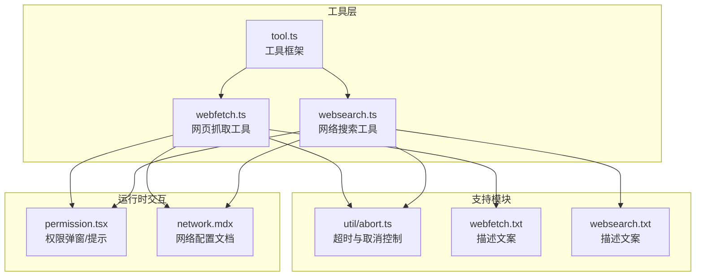
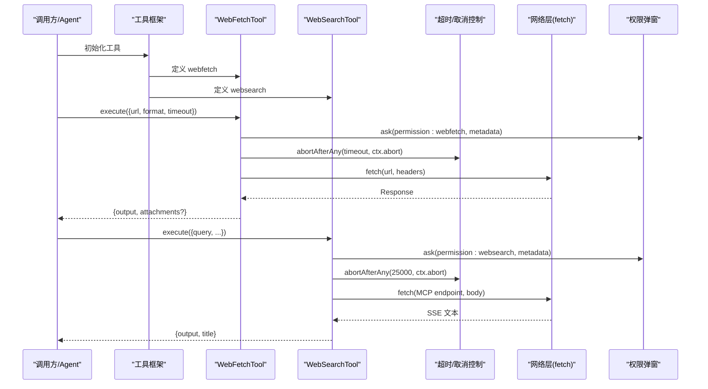
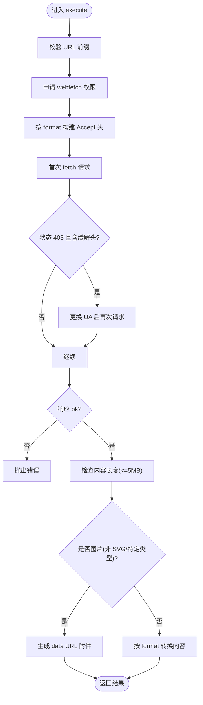
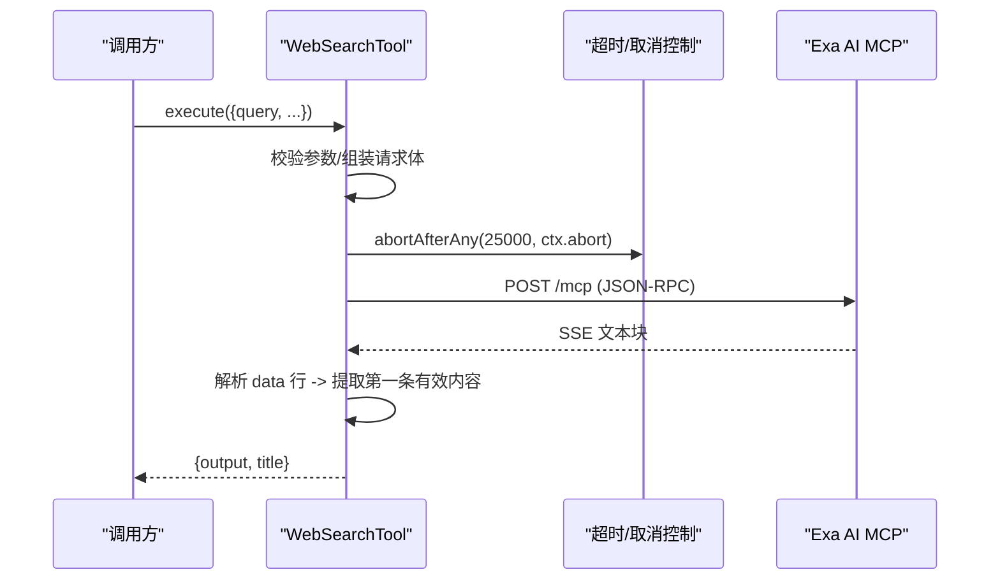
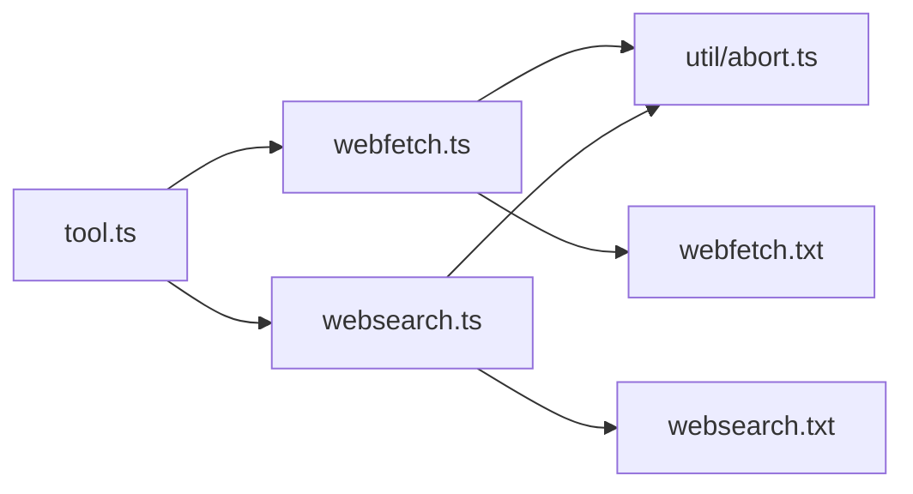

# 网络工具

<cite>
**本文引用的文件**
- [packages/opencode/src/tool/webfetch.ts](file://packages/opencode/src/tool/webfetch.ts)
- [packages/opencode/src/tool/websearch.ts](file://packages/opencode/src/tool/websearch.ts)
- [packages/opencode/src/tool/tool.ts](file://packages/opencode/src/tool/tool.ts)
- [packages/opencode/src/util/abort.ts](file://packages/opencode/src/util/abort.ts)
- [packages/opencode/src/tool/webfetch.txt](file://packages/opencode/src/tool/webfetch.txt)
- [packages/opencode/src/tool/websearch.txt](file://packages/opencode/src/tool/websearch.txt)
- [packages/opencode/test/tool/webfetch.test.ts](file://packages/opencode/test/tool/webfetch.test.ts)
- [packages/web/src/content/docs/network.mdx](file://packages/web/src/content/docs/network.mdx)
- [packages/opencode/src/cli/cmd/tui/routes/session/permission.tsx](file://packages/opencode/src/cli/cmd/tui/routes/session/permission.tsx)
- [packages/web/src/content/docs/ru/tools.mdx](file://packages/web/src/content/docs/ru/tools.mdx)
</cite>

## 目录
1. [简介](#简介)
2. [项目结构](#项目结构)
3. [核心组件](#核心组件)
4. [架构总览](#架构总览)
5. [详细组件分析](#详细组件分析)
6. [依赖关系分析](#依赖关系分析)
7. [性能考量](#性能考量)
8. [故障排查指南](#故障排查指南)
9. [结论](#结论)
10. [附录](#附录)

## 简介
本文件为 OpenCode 网络工具的技术文档，聚焦两类核心能力：网页抓取工具（webfetch）与网络搜索工具（websearch）。文档从系统架构、数据流、处理逻辑、安全控制、错误处理与配置使用等维度进行深入说明，并辅以可视化图示帮助不同背景的读者理解与使用。

## 项目结构
网络工具位于统一的工具框架之下，采用“工具定义 + 执行器”的模式组织代码，便于扩展与测试。关键文件分布如下：
- 工具定义与执行：webfetch.ts、websearch.ts
- 工具框架基类：tool.ts
- 取消控制与超时：util/abort.ts
- 工具描述文案：webfetch.txt、websearch.txt
- 测试用例：test/tool/webfetch.test.ts
- 安全与网络配置文档：packages/web/src/content/docs/network.mdx
- 权限弹窗与提示：cli/cmd/tui/routes/session/permission.tsx
- 配置启用说明：packages/web/src/content/docs/ru/tools.mdx

图表来源
- [packages/opencode/src/tool/tool.ts:1-113](file://packages/opencode/src/tool/tool.ts#L1-L113)
- [packages/opencode/src/tool/webfetch.ts:1-207](file://packages/opencode/src/tool/webfetch.ts#L1-L207)
- [packages/opencode/src/tool/websearch.ts:1-151](file://packages/opencode/src/tool/websearch.ts#L1-L151)
- [packages/opencode/src/util/abort.ts:1-36](file://packages/opencode/src/util/abort.ts#L1-L36)
- [packages/opencode/src/tool/webfetch.txt:1-14](file://packages/opencode/src/tool/webfetch.txt#L1-L14)
- [packages/opencode/src/tool/websearch.txt:1-15](file://packages/opencode/src/tool/websearch.txt#L1-L15)
- [packages/opencode/src/cli/cmd/tui/routes/session/permission.tsx:319-347](file://packages/opencode/src/cli/cmd/tui/routes/session/permission.tsx#L319-L347)
- [packages/web/src/content/docs/network.mdx:1-57](file://packages/web/src/content/docs/network.mdx#L1-L57)

章节来源
- [packages/opencode/src/tool/tool.ts:1-113](file://packages/opencode/src/tool/tool.ts#L1-L113)
- [packages/opencode/src/util/abort.ts:1-36](file://packages/opencode/src/util/abort.ts#L1-L36)

## 核心组件
- 工具框架（Tool.define）
  - 提供参数校验、执行包装、输出截断与元数据注入能力，确保工具调用的一致性与安全性。
- 网页抓取工具（WebFetchTool）
  - 支持 text/markdown/html 三种返回格式；内置大小限制、Cloudflare 检测绕过、图片转附件等特性。
- 网络搜索工具（WebSearchTool）
  - 基于 MCP 协议对接 Exa AI，支持实时搜索与内容抓取，解析 SSE 响应并返回最相关文本。

章节来源
- [packages/opencode/src/tool/tool.ts:58-112](file://packages/opencode/src/tool/tool.ts#L58-L112)
- [packages/opencode/src/tool/webfetch.ts:11-162](file://packages/opencode/src/tool/webfetch.ts#L11-L162)
- [packages/opencode/src/tool/websearch.ts:40-150](file://packages/opencode/src/tool/websearch.ts#L40-L150)

## 架构总览
下图展示工具在会话中的典型调用链：工具初始化 → 参数校验 → 权限申请 → 发起请求 → 结果解析与输出。

图表来源
- [packages/opencode/src/tool/webfetch.ts:21-161](file://packages/opencode/src/tool/webfetch.ts#L21-L161)
- [packages/opencode/src/tool/websearch.ts:65-148](file://packages/opencode/src/tool/websearch.ts#L65-L148)
- [packages/opencode/src/util/abort.ts:28-35](file://packages/opencode/src/util/abort.ts#L28-L35)
- [packages/opencode/src/cli/cmd/tui/routes/session/permission.tsx:319-347](file://packages/opencode/src/cli/cmd/tui/routes/session/permission.tsx#L319-L347)

## 详细组件分析

### 网页抓取工具（webfetch）
- 功能要点
  - 参数与校验：url、format（text/markdown/html）、timeout（上限 120 秒）。
  - 权限控制：通过 ctx.ask 申请 webfetch 权限，携带 url/format/timeout 元信息。
  - 超时与取消：基于 abortAfterAny 组合用户中断信号与定时器。
  - 请求头策略：根据 format 动态设置 Accept 头，提升命中率；固定 User-Agent 与语言头。
  - 内容检测与转换：
    - 图片（除 SVG、特定二进制类型）转为 data URL 附件。
    - HTML → Markdown 使用 TurndownService；HTML → Text 使用 HTMLRewriter 过滤脚本/样式等。
  - 大小限制：响应头与实际字节长度均不超过 5MB。
  - 云服务商防护绕过：当状态码 403 且包含特定缓解头时，改用特定 UA 再次请求。
- 输出结构
  - 返回标准字段：title、metadata、output；图片场景附加 attachments 数组。

图表来源
- [packages/opencode/src/tool/webfetch.ts:21-161](file://packages/opencode/src/tool/webfetch.ts#L21-L161)

章节来源
- [packages/opencode/src/tool/webfetch.ts:11-162](file://packages/opencode/src/tool/webfetch.ts#L11-L162)
- [packages/opencode/src/tool/webfetch.txt:1-14](file://packages/opencode/src/tool/webfetch.txt#L1-L14)
- [packages/opencode/test/tool/webfetch.test.ts:1-101](file://packages/opencode/test/tool/webfetch.test.ts#L1-L101)

### 网络搜索工具（websearch）
- 功能要点
  - 参数与校验：query、numResults（默认 8）、livecrawl（fallback/preferred）、type（auto/fast/deep）、contextMaxCharacters。
  - 权限控制：通过 ctx.ask 申请 websearch 权限，携带查询与配置元信息。
  - 请求协议：构造 MCP JSON-RPC 请求体，向 Exa AI 的 MCP 端点发起 POST。
  - 超时与取消：固定 25 秒超时，结合 ctx.abort。
  - 响应解析：逐行解析 SSE 文本，提取首个包含内容的结果。
- 输出结构
  - 返回标准字段：output（最相关文本）、title（包含查询词）、metadata。

图表来源
- [packages/opencode/src/tool/websearch.ts:65-148](file://packages/opencode/src/tool/websearch.ts#L65-L148)

章节来源
- [packages/opencode/src/tool/websearch.ts:40-150](file://packages/opencode/src/tool/websearch.ts#L40-L150)
- [packages/opencode/src/tool/websearch.txt:1-15](file://packages/opencode/src/tool/websearch.txt#L1-L15)

### 工具框架与通用能力
- 参数校验与错误格式化：通过 Zod schema 校验输入，必要时调用 formatValidationError 自定义错误消息。
- 执行包装：对 execute 结果进行输出截断处理，自动注入截断标记与可选输出路径。
- 上下文接口：提供 sessionID、messageID、agent、abort、ask 等统一能力，便于权限与生命周期管理。

章节来源
- [packages/opencode/src/tool/tool.ts:58-112](file://packages/opencode/src/tool/tool.ts#L58-L112)

## 依赖关系分析
- 工具到框架：WebFetchTool/WebSearchTool 均通过 Tool.define 注册，继承框架提供的参数校验、执行包装与输出截断。
- 取消控制：abortAfterAny 将用户中断信号与定时器合并，避免资源泄漏。
- 外部服务：websearch 依赖 MCP 端点；webfetch 依赖目标站点与 CDN/反爬策略应对。
- 文案与描述：各自 txt 文件提供使用说明与行为约束。

图表来源
- [packages/opencode/src/tool/tool.ts:1-113](file://packages/opencode/src/tool/tool.ts#L1-L113)
- [packages/opencode/src/tool/webfetch.ts:1-207](file://packages/opencode/src/tool/webfetch.ts#L1-L207)
- [packages/opencode/src/tool/websearch.ts:1-151](file://packages/opencode/src/tool/websearch.ts#L1-L151)
- [packages/opencode/src/util/abort.ts:1-36](file://packages/opencode/src/util/abort.ts#L1-L36)
- [packages/opencode/src/tool/webfetch.txt:1-14](file://packages/opencode/src/tool/webfetch.txt#L1-L14)
- [packages/opencode/src/tool/websearch.txt:1-15](file://packages/opencode/src/tool/websearch.txt#L1-L15)

## 性能考量
- 超时与取消
  - webfetch：默认 30 秒，最大 120 秒；websearch：固定 25 秒；均通过 AbortSignal 控制。
- 内容大小限制
  - 严格限制响应大小（5MB），避免内存压力与传输开销。
- 格式选择
  - 优先选择 text/markdown 可显著减少传输体积；仅在需要保留结构时使用 html。
- 重试策略
  - 当前实现未内置自动重试；如需增强，可在上层会话或代理层引入指数退避与 Retry-After 处理（参考会话重试机制的通用思路）。

章节来源
- [packages/opencode/src/tool/webfetch.ts:7-9](file://packages/opencode/src/tool/webfetch.ts#L7-L9)
- [packages/opencode/src/tool/websearch.ts:6-12](file://packages/opencode/src/tool/websearch.ts#L6-L12)
- [packages/opencode/src/util/abort.ts:28-35](file://packages/opencode/src/util/abort.ts#L28-L35)

## 故障排查指南
- 权限相关
  - 现象：工具调用被阻断或弹出确认。
  - 处理：确认配置中已允许对应权限；TUI 会显示权限弹窗标题与元信息，便于核对。
- 超时与取消
  - 现象：请求长时间无响应或被中断。
  - 处理：检查网络环境与代理设置；适当增大 timeout（webfetch 最大 120 秒）；确保 ctx.abort 正常传递。
- 内容过大
  - 现象：抛出“响应过大”错误。
  - 处理：改用较小范围的 URL 或降低 format；关注目标站点 content-length 头。
- 云服务商防护
  - 现象：403 并出现缓解头。
  - 处理：工具已内置 UA 切换逻辑；若仍失败，检查网络代理与证书配置。
- 搜索无结果
  - 现象：返回“未找到结果”提示。
  - 处理：调整 query、numResults、type 或 livecrawl；确认 Exa 服务可用性与网络连通性。

章节来源
- [packages/opencode/src/cli/cmd/tui/routes/session/permission.tsx:319-347](file://packages/opencode/src/cli/cmd/tui/routes/session/permission.tsx#L319-L347)
- [packages/opencode/src/tool/webfetch.ts:75-88](file://packages/opencode/src/tool/webfetch.ts#L75-L88)
- [packages/opencode/src/tool/websearch.ts:134-138](file://packages/opencode/src/tool/websearch.ts#L134-L138)

## 结论
webfetch 与 websearch 在 OpenCode 中分别承担“内容抓取”与“实时搜索”的核心职责。前者强调格式转换、大小控制与反爬适配，后者强调协议对接与 SSE 解析。两者均通过工具框架获得一致的参数校验、权限控制与输出规范，配合超时/取消机制与网络配置文档，形成稳定可靠的网络访问能力。

## 附录

### 安全控制机制
- URL 白名单与权限
  - 工具通过 ctx.ask 申请权限，携带元信息；TUI 弹窗展示请求详情，便于审核。
- 请求频率限制
  - 未在工具层内置全局限速；建议在上层会话或网关层实施速率控制。
- SSL/TLS 与代理
  - 支持标准代理环境变量与自定义 CA 证书，满足企业网络要求。

章节来源
- [packages/opencode/src/tool/webfetch.ts:27-36](file://packages/opencode/src/tool/webfetch.ts#L27-L36)
- [packages/opencode/src/tool/websearch.ts:66-77](file://packages/opencode/src/tool/websearch.ts#L66-L77)
- [packages/web/src/content/docs/network.mdx:1-57](file://packages/web/src/content/docs/network.mdx#L1-L57)

### 错误处理策略
- 超时与取消
  - 使用 abortAfterAny 统一处理；捕获 AbortError 并转换为明确错误信息。
- 连接异常
  - 对非 OK 响应读取文本并抛错；websearch 明确包含状态码与响应体。
- 内容格式验证
  - 通过 Zod schema 校验参数；格式化错误消息便于修复输入。

章节来源
- [packages/opencode/src/tool/websearch.ts:112-147](file://packages/opencode/src/tool/websearch.ts#L112-L147)
- [packages/opencode/src/tool/webfetch.ts:75-88](file://packages/opencode/src/tool/webfetch.ts#L75-L88)
- [packages/opencode/src/tool/tool.ts:67-76](file://packages/opencode/src/tool/tool.ts#L67-L76)

### 配置选项与使用示例
- 代理设置
  - 支持 HTTPS_PROXY/HTTP_PROXY/NO_PROXY；TUI 本地服务器需绕过代理。
- 认证机制
  - 基础认证可嵌入代理 URL；避免硬编码密码。
- 自定义头部
  - webfetch 固定 User-Agent 与 Accept-Language；可通过修改源码扩展。
- 工具启用
  - webfetch：在配置中开启 permission.webfetch。
  - websearch：在配置中开启 permission.websearch；或通过环境变量启用 Exa。

章节来源
- [packages/web/src/content/docs/network.mdx:14-55](file://packages/web/src/content/docs/network.mdx#L14-L55)
- [packages/web/src/content/docs/ru/tools.mdx:255-290](file://packages/web/src/content/docs/ru/tools.mdx#L255-L290)