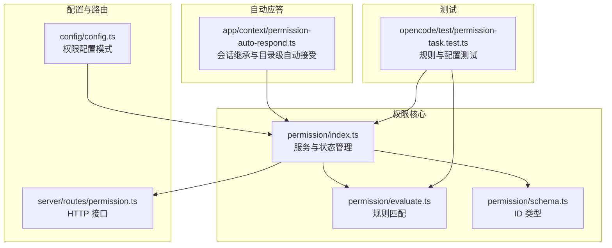
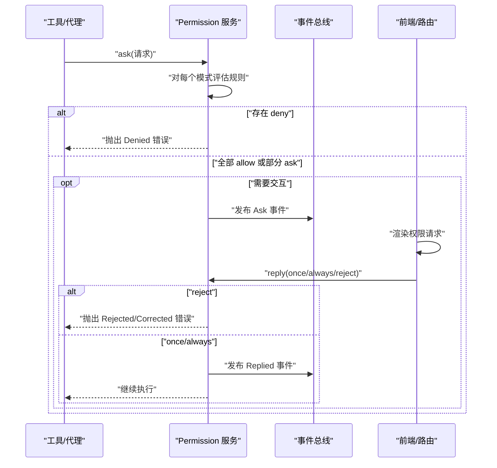
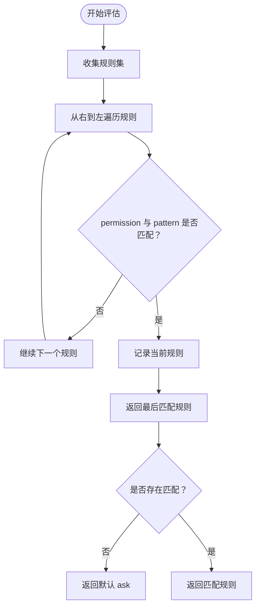
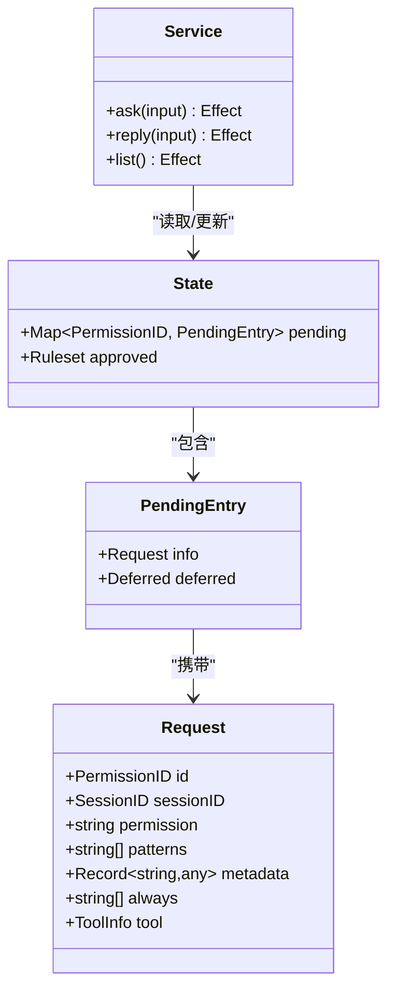
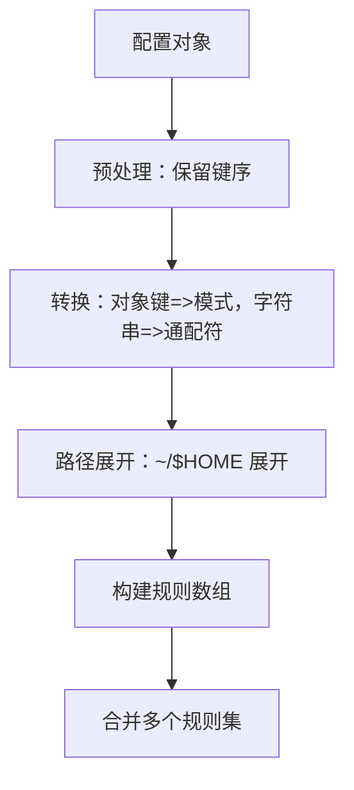
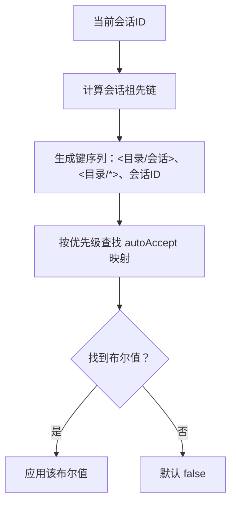
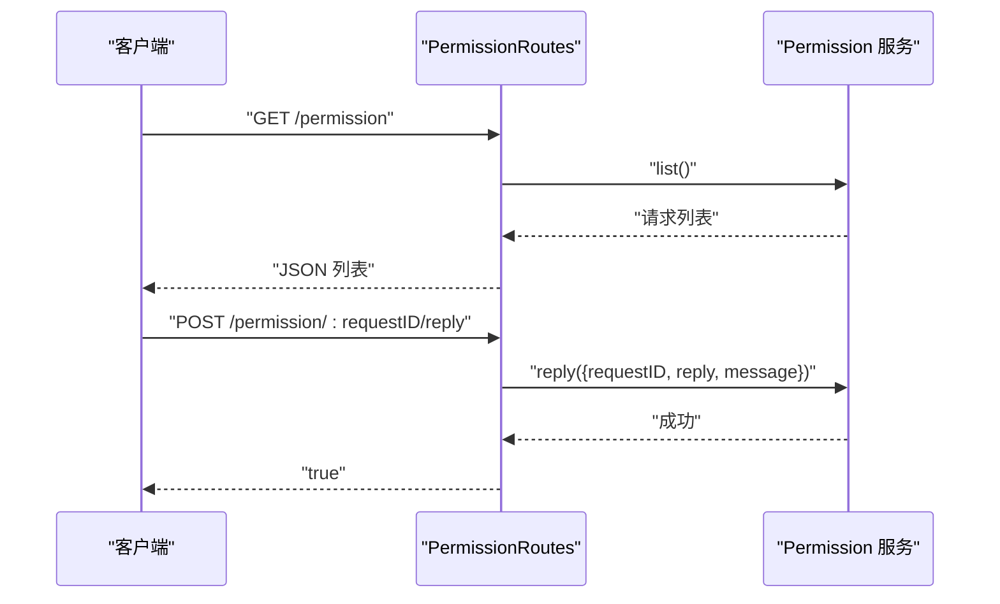
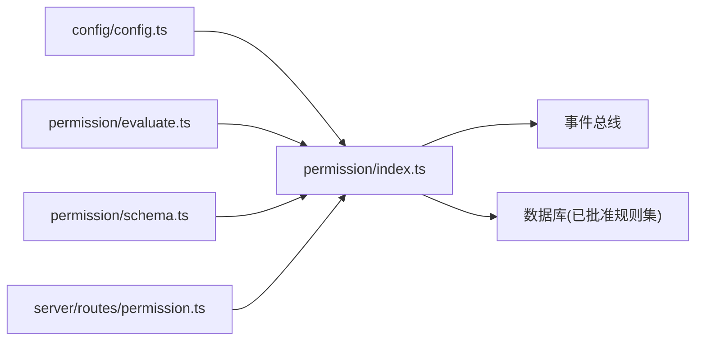

# 权限控制系统

<cite>
**本文引用的文件**
- [packages/opencode/src/permission/index.ts](file://packages/opencode/src/permission/index.ts)
- [packages/opencode/src/permission/evaluate.ts](file://packages/opencode/src/permission/evaluate.ts)
- [packages/opencode/src/permission/schema.ts](file://packages/opencode/src/permission/schema.ts)
- [packages/opencode/src/config/config.ts](file://packages/opencode/src/config/config.ts)
- [packages/opencode/src/server/routes/permission.ts](file://packages/opencode/src/server/routes/permission.ts)
- [packages/app/src/context/permission-auto-respond.ts](file://packages/app/src/context/permission-auto-respond.ts)
- [packages/opencode/test/permission-task.test.ts](file://packages/opencode/test/permission-task.test.ts)
</cite>

## 目录
1. [简介](#简介)
2. [项目结构](#项目结构)
3. [核心组件](#核心组件)
4. [架构总览](#架构总览)
5. [详细组件分析](#详细组件分析)
6. [依赖关系分析](#依赖关系分析)
7. [性能考量](#性能考量)
8. [故障排查指南](#故障排查指南)
9. [结论](#结论)
10. [附录：权限配置示例与最佳实践](#附录权限配置示例与最佳实践)

## 简介
本文件系统性阐述 OpenCode 权限控制体系的设计理念、数据结构、执行流程与集成方式。重点覆盖以下方面：
- 权限规则的数据模型与匹配算法
- 默认权限、用户自定义权限、代理特定权限的优先级与合并机制
- 文件访问控制策略（外部目录访问限制、敏感文件保护、路径白名单）
- 命令执行权限（危险命令限制、交互式确认、权限提升）
- 权限配置示例与安全最佳实践
- 权限控制与代理、工具系统的集成流程

## 项目结构
权限系统主要由以下模块构成：
- 规则与评估：规则定义、匹配算法、默认行为
- 配置解析：将用户配置转换为规则集
- 服务层：请求发起、等待用户回复、持久化批准结果
- 路由层：对外暴露权限审批接口
- 自动应答：会话继承与目录级自动接受
- 测试用例：覆盖规则匹配、禁用工具判定、配置加载等场景

图表来源
- [packages/opencode/src/permission/index.ts:1-326](file://packages/opencode/src/permission/index.ts#L1-L326)
- [packages/opencode/src/permission/evaluate.ts:1-16](file://packages/opencode/src/permission/evaluate.ts#L1-L16)
- [packages/opencode/src/permission/schema.ts:1-18](file://packages/opencode/src/permission/schema.ts#L1-L18)
- [packages/opencode/src/config/config.ts:430-629](file://packages/opencode/src/config/config.ts#L430-L629)
- [packages/opencode/src/server/routes/permission.ts:1-70](file://packages/opencode/src/server/routes/permission.ts#L1-L70)
- [packages/app/src/context/permission-auto-respond.ts:1-52](file://packages/app/src/context/permission-auto-respond.ts#L1-L52)
- [packages/opencode/test/permission-task.test.ts:1-324](file://packages/opencode/test/permission-task.test.ts#L1-L324)

章节来源
- [packages/opencode/src/permission/index.ts:1-326](file://packages/opencode/src/permission/index.ts#L1-L326)
- [packages/opencode/src/permission/evaluate.ts:1-16](file://packages/opencode/src/permission/evaluate.ts#L1-L16)
- [packages/opencode/src/permission/schema.ts:1-18](file://packages/opencode/src/permission/schema.ts#L1-L18)
- [packages/opencode/src/config/config.ts:430-629](file://packages/opencode/src/config/config.ts#L430-L629)
- [packages/opencode/src/server/routes/permission.ts:1-70](file://packages/opencode/src/server/routes/permission.ts#L1-L70)
- [packages/app/src/context/permission-auto-respond.ts:1-52](file://packages/app/src/context/permission-auto-respond.ts#L1-L52)
- [packages/opencode/test/permission-task.test.ts:1-324](file://packages/opencode/test/permission-task.test.ts#L1-L324)

## 核心组件
- 权限规则与动作
  - 规则对象包含 permission、pattern、action 三要素；action 取值为 allow/deny/ask。
  - 规则集为规则数组，支持多规则集合并。
- 请求与回复
  - 请求包含请求 ID、会话 ID、权限名、目标模式列表、元数据、是否“总是”通过等字段。
  - 回复类型支持 once/always/reject，分别表示本次有效、全局生效、拒绝。
- 服务与状态
  - 服务维护“待定请求”集合与“已批准规则集”，并基于事件总线广播“询问/回复”事件。
- ID 类型
  - 使用强类型的 PermissionID，支持升序生成与校验。

章节来源
- [packages/opencode/src/permission/index.ts:19-136](file://packages/opencode/src/permission/index.ts#L19-L136)
- [packages/opencode/src/permission/schema.ts:7-17](file://packages/opencode/src/permission/schema.ts#L7-L17)

## 架构总览
权限控制采用“规则驱动 + 交互确认”的双层架构：
- 规则层：按顺序评估规则，最后一条匹配规则决定结果，默认返回 ask。
- 交互层：当规则要求 ask 时，向用户发起确认；用户可选择一次性或永久允许，或拒绝。

图表来源
- [packages/opencode/src/permission/index.ts:167-260](file://packages/opencode/src/permission/index.ts#L167-L260)
- [packages/opencode/src/server/routes/permission.ts:36-46](file://packages/opencode/src/server/routes/permission.ts#L36-L46)

## 详细组件分析

### 权限规则与评估
- 匹配算法
  - 从右到左查找最后一个匹配规则，permission 与 pattern 均支持通配符匹配。
  - 若无匹配，返回默认 ask。
- 规则优先级
  - 后出现的规则覆盖先前规则（最后匹配胜出）。
- 禁用工具
  - 仅当存在 pattern 为 * 且 action 为 deny 的规则时，才会在工具层面禁用该工具（如 task）。

图表来源
- [packages/opencode/src/permission/evaluate.ts:9-15](file://packages/opencode/src/permission/evaluate.ts#L9-L15)

章节来源
- [packages/opencode/src/permission/evaluate.ts:1-16](file://packages/opencode/src/permission/evaluate.ts#L1-L16)
- [packages/opencode/test/permission-task.test.ts:11-72](file://packages/opencode/test/permission-task.test.ts#L11-L72)

### 权限服务与状态管理
- 状态结构
  - pending：按请求 ID 存储待处理请求及其异步承诺。
  - approved：已批准的规则集，用于后续快速评估。
- ask 流程
  - 对每个模式评估规则，若发现 deny 则直接拒绝；若全部 allow 则无需交互；否则发布 Ask 事件等待用户回复。
- reply 流程
  - reject：拒绝当前请求及同一会话的其他待处理请求，并广播拒绝事件。
  - once：仅本次允许，不写入 approved。
  - always：将请求中 always 指定的模式加入 approved，并尝试批量放行同一会话的其他请求。
- 生命周期
  - 服务销毁时，所有 pending 请求统一失败，确保资源释放。

图表来源
- [packages/opencode/src/permission/index.ts:123-131](file://packages/opencode/src/permission/index.ts#L123-L131)
- [packages/opencode/src/permission/index.ts:167-260](file://packages/opencode/src/permission/index.ts#L167-L260)

章节来源
- [packages/opencode/src/permission/index.ts:140-269](file://packages/opencode/src/permission/index.ts#L140-L269)

### 权限配置与规则集构建
- 配置模式
  - 支持字符串简写（作用于所有模式）与对象形式（键为模式，值为动作）。
  - 保留原始键序，保证规则顺序稳定。
- 规则集构建
  - 将配置转换为规则数组，支持 ~、$HOME 等展开，便于路径类权限表达。
- 合并策略
  - 多个规则集简单拼接，遵循“最后匹配胜出”。

图表来源
- [packages/opencode/src/config/config.ts:450-496](file://packages/opencode/src/config/config.ts#L450-L496)
- [packages/opencode/src/permission/index.ts:279-295](file://packages/opencode/src/permission/index.ts#L279-L295)

章节来源
- [packages/opencode/src/config/config.ts:435-496](file://packages/opencode/src/config/config.ts#L435-L496)
- [packages/opencode/src/permission/index.ts:279-295](file://packages/opencode/src/permission/index.ts#L279-L295)

### 自动应答与会话继承
- 会话继承
  - 当前会话无法决策时，向上追溯父会话的目录级自动接受标记，实现“子会话可继承父会话的目录授权”。
- 目录级自动接受
  - 支持针对目录的“/*”级开关，以及“会话/目录”组合键。
- 优先级
  - 子会话显式键优先于父会话键；目录级键优先于旧版会话键。

图表来源
- [packages/app/src/context/permission-auto-respond.ts:23-51](file://packages/app/src/context/permission-auto-respond.ts#L23-L51)

章节来源
- [packages/app/src/context/permission-auto-respond.ts:1-52](file://packages/app/src/context/permission-auto-respond.ts#L1-L52)

### HTTP 路由与用户交互
- 列表接口：返回所有会话的待处理权限请求。
- 回复接口：接收 once/always/reject，调用 Permission.reply 并广播结果。

图表来源
- [packages/opencode/src/server/routes/permission.ts:9-69](file://packages/opencode/src/server/routes/permission.ts#L9-L69)

章节来源
- [packages/opencode/src/server/routes/permission.ts:1-70](file://packages/opencode/src/server/routes/permission.ts#L1-L70)

### 文件访问控制策略
- 外部目录访问限制
  - 通过 external_directory 权限与路径模式控制；结合 fromConfig 的路径展开能力，可将 ~/$HOME 展开为真实路径，避免越权。
- 敏感文件保护
  - 在规则集中对 .env、.git、密钥文件等设置 deny 或 ask，确保不会被读取或修改。
- 路径白名单机制
  - 使用 allow 模式限定可访问路径范围，未显式允许的路径默认 ask，必要时触发用户确认。

章节来源
- [packages/opencode/src/config/config.ts:470-494](file://packages/opencode/src/config/config.ts#L470-L494)
- [packages/opencode/src/permission/index.ts:279-295](file://packages/opencode/src/permission/index.ts#L279-L295)

### 命令执行权限
- 危险命令限制
  - 对 bash、task 等高风险工具设置 deny 或 ask；对于 edit 系列工具（write/edit/apply_patch/multiedit），统一映射到 edit 权限进行控制。
- 交互式确认机制
  - 当规则返回 ask 时，服务发布 Ask 事件，前端弹窗提示用户确认；用户可选择 once/always/reject。
- 权限提升流程
  - once：仅本次允许；always：将模式加入 approved，后续同会话内相同请求不再弹窗。

章节来源
- [packages/opencode/src/permission/index.ts:297-308](file://packages/opencode/src/permission/index.ts#L297-L308)
- [packages/opencode/src/permission/index.ts:167-260](file://packages/opencode/src/permission/index.ts#L167-L260)

## 依赖关系分析
- 组件耦合
  - permission/index.ts 依赖 evaluate.ts 进行规则匹配；依赖 config.ts 的配置模式；依赖 schema.ts 的 ID 类型；依赖 server/routes/permission.ts 提供 HTTP 接口。
- 事件总线
  - 通过 Bus 事件广播 Ask/Replied，解耦 UI 与后端逻辑。
- 数据持久化
  - 已批准规则集存储于数据库表中，随项目实例恢复。

图表来源
- [packages/opencode/src/permission/index.ts:1-326](file://packages/opencode/src/permission/index.ts#L1-L326)
- [packages/opencode/src/permission/evaluate.ts:1-16](file://packages/opencode/src/permission/evaluate.ts#L1-L16)
- [packages/opencode/src/permission/schema.ts:1-18](file://packages/opencode/src/permission/schema.ts#L1-L18)
- [packages/opencode/src/config/config.ts:430-629](file://packages/opencode/src/config/config.ts#L430-L629)
- [packages/opencode/src/server/routes/permission.ts:1-70](file://packages/opencode/src/server/routes/permission.ts#L1-L70)

章节来源
- [packages/opencode/src/permission/index.ts:140-165](file://packages/opencode/src/permission/index.ts#L140-L165)

## 性能考量
- 规则评估复杂度
  - 规则集扁平化后线性扫描，时间复杂度 O(N)；N 为规则总数。建议将高频规则前置，减少回溯成本。
- 交互延迟
  - ask/reply 为异步流程，需考虑网络与 UI 渲染延迟；可通过批量放行（always）降低重复弹窗。
- 内存占用
  - pending Map 与 approved 规则集随请求数量增长；服务销毁时统一清理，避免泄漏。

## 故障排查指南
- 常见错误类型
  - DeniedError：用户配置了 deny 规则导致拒绝。
  - RejectedError：用户拒绝当前请求。
  - CorrectedError：用户拒绝并提供反馈。
- 审计与定位
  - 使用 list 接口查看待处理请求，结合日志定位具体请求 ID。
  - 检查规则匹配顺序，确认是否存在更靠后的 allow/ask 覆盖。
- 冲突处理
  - 若工具被禁用但运行异常，检查 disabled 判定条件（仅当 pattern:* 且 action:deny 时才禁用工具）。

章节来源
- [packages/opencode/src/permission/index.ts:83-105](file://packages/opencode/src/permission/index.ts#L83-L105)
- [packages/opencode/src/server/routes/permission.ts:64-67](file://packages/opencode/src/server/routes/permission.ts#L64-L67)
- [packages/opencode/test/permission-task.test.ts:74-142](file://packages/opencode/test/permission-task.test.ts#L74-L142)

## 结论
OpenCode 权限系统以“规则优先、交互兜底”为核心设计，通过严格的规则匹配与灵活的交互确认，实现了对工具与命令的细粒度控制。配合配置解析、自动应答与事件总线，系统在安全性与可用性之间取得良好平衡。建议在生产环境中：
- 明确默认策略（建议 ask），仅对可信路径与工具开放 allow；
- 使用 always 降低重复弹窗，但需谨慎；
- 定期审计权限使用情况，清理过期规则；
- 对高危操作（bash/task/edit）保持严格限制。

## 附录：权限配置示例与最佳实践
- 示例一：基础工具权限
  - 允许编辑与读取，禁止任务工具；对 bash 全局 ask。
- 示例二：代理特定权限
  - 为特定代理（如 code-reviewer）单独设置 allow/deny，其余代理 ask。
- 示例三：外部目录访问
  - 仅允许访问指定目录，其他路径 ask；敏感文件（.env/.git）显式 deny。
- 最佳实践
  - 平衡安全与便利：默认 ask，仅在明确信任时使用 always。
  - 审计与追踪：记录每次 ask/reply 的上下文信息，便于回溯。
  - 冲突处理：避免全局 deny 与局部 allow 的矛盾，优先使用更具体的 allow 覆盖。

章节来源
- [packages/opencode/test/permission-task.test.ts:144-323](file://packages/opencode/test/permission-task.test.ts#L144-L323)
- [packages/opencode/src/config/config.ts:470-494](file://packages/opencode/src/config/config.ts#L470-L494)