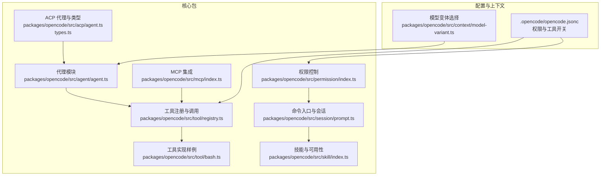
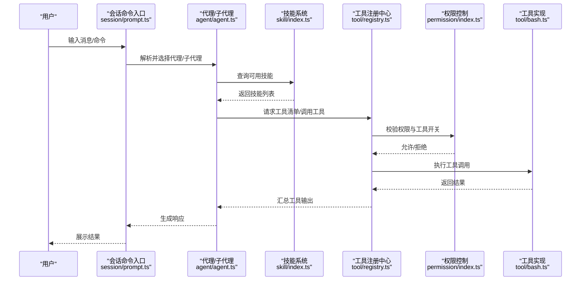
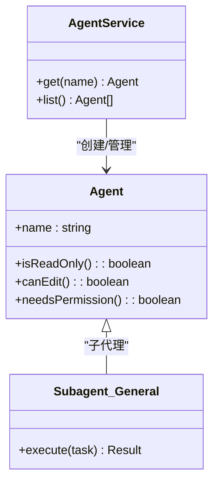
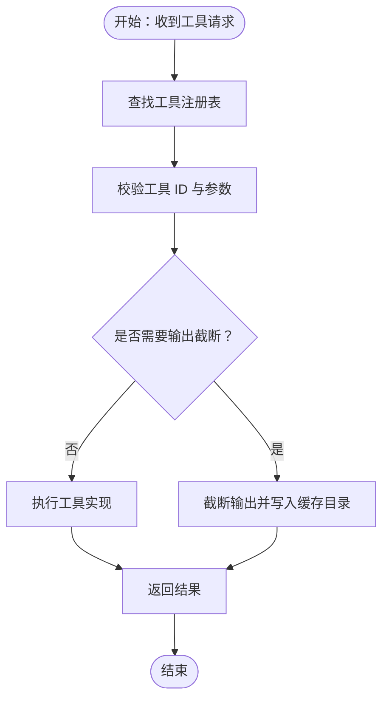
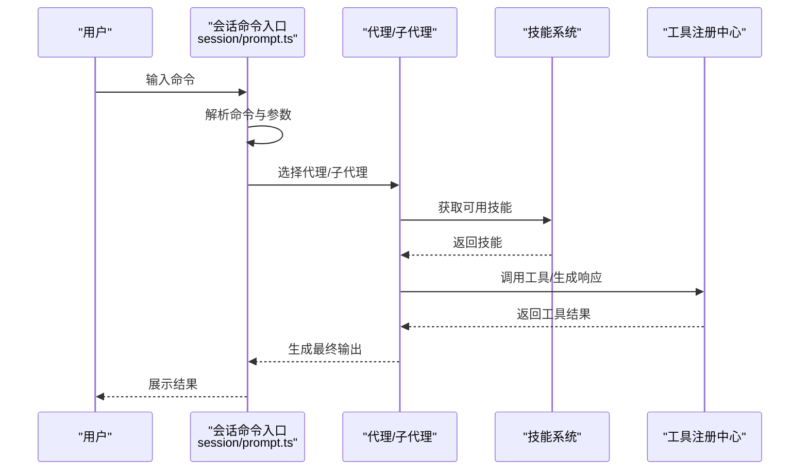
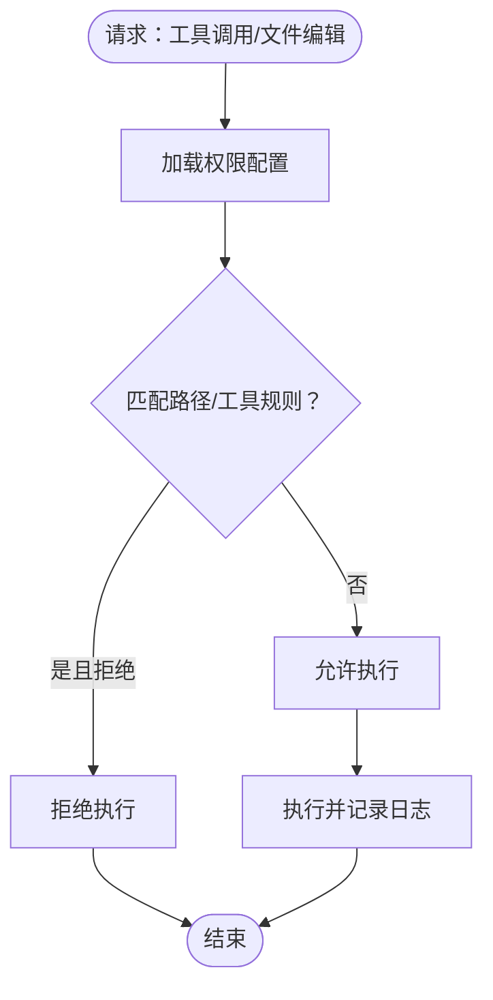
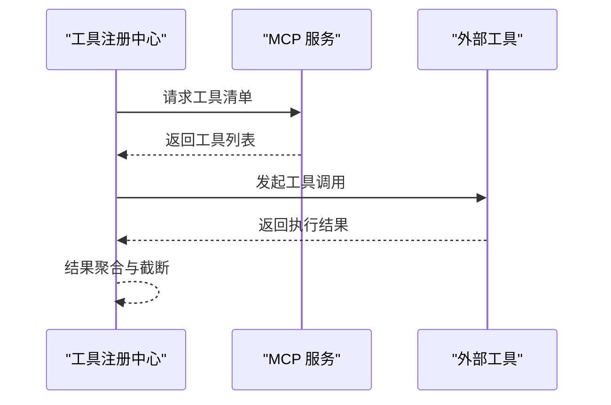
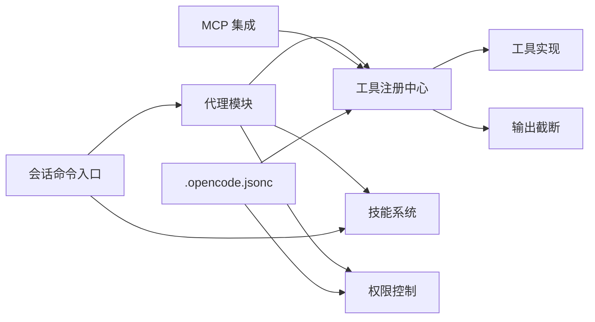

# 核心功能

<cite>
**本文引用的文件**
- [README.md](file://README.md)
- [.opencode/opencode.jsonc](file://.opencode/opencode.jsonc)
- [packages/opencode/src/agent/agent.ts](file://packages/opencode/src/agent/agent.ts)
- [packages/opencode/src/acp/agent.ts](file://packages/opencode/src/acp/agent.ts)
- [packages/opencode/src/permission/index.ts](file://packages/opencode/src/permission/index.ts)
- [packages/opencode/src/tool/registry.ts](file://packages/opencode/src/tool/registry.ts)
- [packages/opencode/src/tool/bash.ts](file://packages/opencode/src/tool/bash.ts)
- [packages/opencode/src/tool/schema.ts](file://packages/opencode/src/tool/schema.ts)
- [packages/opencode/src/tool/truncate.ts](file://packages/opencode/src/tool/truncate.ts)
- [packages/opencode/src/session/prompt.ts](file://packages/opencode/src/session/prompt.ts)
- [packages/opencode/src/skill/index.ts](file://packages/opencode/src/skill/index.ts)
- [packages/opencode/src/mcp/index.ts](file://packages/opencode/src/mcp/index.ts)
- [packages/opencode/src/bus/bus-event.ts](file://packages/opencode/src/bus/bus-event.ts)
- [packages/opencode/src/bus/global.ts](file://packages/opencode/src/bus/global.ts)
- [packages/opencode/src/cli/cmd/tui/routes/session/dialog-subagent.tsx](file://packages/opencode/src/cli/cmd/tui/routes/session/dialog-subagent.tsx)
- [packages/opencode/src/cli/cmd/tui/routes/session/subagent-footer.tsx](file://packages/opencode/src/cli/cmd/tui/routes/session/subagent-footer.tsx)
- [packages/opencode/src/context/model-variant.ts](file://packages/opencode/src/context/model-variant.ts)
- [packages/opencode/src/session/system.ts](file://packages/opencode/src/session/system.ts)
- [packages/opencode/src/auth/index.ts](file://packages/opencode/src/auth/index.ts)
- [packages/opencode/src/acp/types.ts](file://packages/opencode/src/acp/types.ts)
- [packages/opencode/src/acp/session.ts](file://packages/opencode/src/acp/session.ts)
- [packages/opencode/src/account/index.ts](file://packages/opencode/src/account/index.ts)
- [packages/opencode/src/account/repo.ts](file://packages/opencode/src/account/repo.ts)
- [packages/opencode/src/account/schema.ts](file://packages/opencode/src/account/schema.ts)
- [packages/opencode/src/account/account.sql.ts](file://packages/opencode/src/account/account.sql.ts)
- [packages/opencode/src/mcp/index.ts](file://packages/opencode/src/mcp/index.ts)
- [packages/opencode/src/mcp/index.ts](file://packages/opencode/src/mcp/index.ts)
</cite>

## 目录
1. [简介](#简介)
2. [项目结构](#项目结构)
3. [核心组件](#核心组件)
4. [架构总览](#架构总览)
5. [详细组件分析](#详细组件分析)
6. [依赖分析](#依赖分析)
7. [性能考量](#性能考量)
8. [故障排查指南](#故障排查指南)
9. [结论](#结论)
10. [附录](#附录)

## 简介
本文件面向 OpenCode 的核心功能模块，系统性阐述以下方面：
- 代理系统：build、plan、general 等内置代理的设计理念与使用场景
- 工具系统：40+ 内置工具的功能分类、调用方式与扩展机制
- 命令系统：20+ 命令处理器的职责分工与交互
- 权限控制：文件访问控制、命令执行限制等安全机制
- 协作关系：模块间的数据流、处理逻辑与集成点
- 性能与最佳实践：优化策略与使用建议

## 项目结构
OpenCode 的核心能力主要集中在 packages/opencode 包中，围绕“代理（Agent）—工具（Tool）—命令（Command）—会话（Session）—权限（Permission）”的主干展开，并通过 MCP（Model Context Protocol）与外部工具生态连接。

图示来源
- [packages/opencode/src/agent/agent.ts](file://packages/opencode/src/agent/agent.ts)
- [packages/opencode/src/acp/agent.ts](file://packages/opencode/src/acp/agent.ts)
- [packages/opencode/src/tool/registry.ts](file://packages/opencode/src/tool/registry.ts)
- [packages/opencode/src/tool/bash.ts](file://packages/opencode/src/tool/bash.ts)
- [packages/opencode/src/permission/index.ts](file://packages/opencode/src/permission/index.ts)
- [packages/opencode/src/session/prompt.ts](file://packages/opencode/src/session/prompt.ts)
- [packages/opencode/src/skill/index.ts](file://packages/opencode/src/skill/index.ts)
- [packages/opencode/src/mcp/index.ts](file://packages/opencode/src/mcp/index.ts)
- [.opencode/opencode.jsonc](file://.opencode/opencode.jsonc)
- [packages/opencode/src/context/model-variant.ts](file://packages/opencode/src/context/model-variant.ts)

章节来源
- [README.md](file://README.md)
- [.opencode/opencode.jsonc](file://.opencode/opencode.jsonc)

## 核心组件
- 代理系统：提供 build（全权限开发）、plan（只读分析）、general（复杂多步任务）等子代理，支持在消息中以 @general 调用。
- 工具系统：统一注册与调用入口，支持 Bash、文件系统、网络等工具；具备输出截断与缓存目录管理。
- 命令系统：会话层命令入口，负责解析用户输入、路由到相应处理器，并与技能/代理协同。
- 权限控制：基于路径规则与工具开关进行访问控制，支持对特定路径或工具的显式拒绝。
- MCP 集成：对外部工具与服务的桥接，统一工具发现与调用。
- 技能系统：提供可用技能查询与加载，支撑代理与命令的上下文增强。

章节来源
- [README.md](file://README.md)
- [packages/opencode/src/agent/agent.ts](file://packages/opencode/src/agent/agent.ts)
- [packages/opencode/src/acp/agent.ts](file://packages/opencode/src/acp/agent.ts)
- [packages/opencode/src/tool/registry.ts](file://packages/opencode/src/tool/registry.ts)
- [packages/opencode/src/tool/bash.ts](file://packages/opencode/src/tool/bash.ts)
- [packages/opencode/src/permission/index.ts](file://packages/opencode/src/permission/index.ts)
- [packages/opencode/src/session/prompt.ts](file://packages/opencode/src/session/prompt.ts)
- [packages/opencode/src/skill/index.ts](file://packages/opencode/src/skill/index.ts)
- [packages/opencode/src/mcp/index.ts](file://packages/opencode/src/mcp/index.ts)

## 架构总览
OpenCode 的运行时由“用户输入 → 会话命令解析 → 代理/技能决策 → 工具调用 → 权限校验 → 输出结果”的闭环构成。MCP 提供外部工具能力，配置文件决定权限与工具开关。

图示来源
- [packages/opencode/src/session/prompt.ts](file://packages/opencode/src/session/prompt.ts)
- [packages/opencode/src/agent/agent.ts](file://packages/opencode/src/agent/agent.ts)
- [packages/opencode/src/skill/index.ts](file://packages/opencode/src/skill/index.ts)
- [packages/opencode/src/tool/registry.ts](file://packages/opencode/src/tool/registry.ts)
- [packages/opencode/src/permission/index.ts](file://packages/opencode/src/permission/index.ts)
- [packages/opencode/src/tool/bash.ts](file://packages/opencode/src/tool/bash.ts)

## 详细组件分析

### 代理系统：build、plan、general
- 设计理念
  - build：默认全权限代理，适合开发工作，可直接编辑文件、执行命令。
  - plan：只读代理，禁止文件编辑，默认要求权限确认后才运行 bash 命令，适合探索与规划。
  - general：用于复杂搜索与多步任务的子代理，可在消息中通过 @general 触发。
- 使用场景
  - 初次进入不熟悉的代码库：优先使用 plan 分析与询问权限。
  - 日常开发与修复：使用 build 快速迭代。
  - 多步骤任务编排：使用 @general 子代理进行复杂流程。
- 关键实现要点
  - 代理类与服务封装位于代理模块，提供代理实例获取与状态管理。
  - ACP 代理与类型定义提供更强的类型约束与会话能力。

图示来源
- [packages/opencode/src/agent/agent.ts](file://packages/opencode/src/agent/agent.ts)
- [packages/opencode/src/acp/agent.ts](file://packages/opencode/src/acp/agent.ts)

章节来源
- [README.md](file://README.md)
- [packages/opencode/src/agent/agent.ts](file://packages/opencode/src/agent/agent.ts)
- [packages/opencode/src/acp/agent.ts](file://packages/opencode/src/acp/agent.ts)

### 工具系统：架构、调用与扩展
- 统一注册与调用
  - 工具注册中心负责工具清单、调用分发与结果聚合。
  - 工具 ID 类型与校验确保调用一致性。
- 输出截断与缓存
  - 工具输出具备截断策略与专用缓存目录，避免过大输出影响性能与存储。
- 示例：Bash 工具
  - Bash 工具提供日志记录与错误处理，作为工具扩展的参考实现。
- 扩展机制
  - 新增工具需在注册中心登记，遵循工具 ID 规范与调用协议。
  - 可通过 MCP 注入外部工具，统一管理与调用。

图示来源
- [packages/opencode/src/tool/registry.ts](file://packages/opencode/src/tool/registry.ts)
- [packages/opencode/src/tool/schema.ts](file://packages/opencode/src/tool/schema.ts)
- [packages/opencode/src/tool/truncate.ts](file://packages/opencode/src/tool/truncate.ts)
- [packages/opencode/src/tool/bash.ts](file://packages/opencode/src/tool/bash.ts)

章节来源
- [packages/opencode/src/tool/registry.ts](file://packages/opencode/src/tool/registry.ts)
- [packages/opencode/src/tool/schema.ts](file://packages/opencode/src/tool/schema.ts)
- [packages/opencode/src/tool/truncate.ts](file://packages/opencode/src/tool/truncate.ts)
- [packages/opencode/src/tool/bash.ts](file://packages/opencode/src/tool/bash.ts)

### 命令系统：组织结构与职责
- 命令入口
  - 会话命令入口负责解析用户输入，识别命令与参数，路由到对应处理器。
- 与代理/技能协作
  - 命令触发后，结合代理与技能信息，决定下一步动作（如调用工具、生成提示词等）。
- 子代理交互
  - 在 TUI 中可通过对话框与底部栏切换/调用子代理（如 @general），实现多步任务编排。

图示来源
- [packages/opencode/src/session/prompt.ts](file://packages/opencode/src/session/prompt.ts)
- [packages/opencode/src/agent/agent.ts](file://packages/opencode/src/agent/agent.ts)
- [packages/opencode/src/skill/index.ts](file://packages/opencode/src/skill/index.ts)
- [packages/opencode/src/tool/registry.ts](file://packages/opencode/src/tool/registry.ts)

章节来源
- [packages/opencode/src/session/prompt.ts](file://packages/opencode/src/session/prompt.ts)
- [packages/opencode/src/cli/cmd/tui/routes/session/dialog-subagent.tsx](file://packages/opencode/src/cli/cmd/tui/routes/session/dialog-subagent.tsx)
- [packages/opencode/src/cli/cmd/tui/routes/session/subagent-footer.tsx](file://packages/opencode/src/cli/cmd/tui/routes/session/subagent-footer.tsx)

### 权限控制系统：文件访问与命令限制
- 配置驱动
  - 通过配置文件设置权限规则（如对特定路径的编辑禁用）与工具开关。
- 运行时校验
  - 工具调用前进行权限检查，若被拒绝则中断执行并反馈。
- 安全边界
  - 对危险操作（如 bash 命令）默认要求权限确认，plan 代理强制此策略。

图示来源
- [.opencode/opencode.jsonc](file://.opencode/opencode.jsonc)
- [packages/opencode/src/permission/index.ts](file://packages/opencode/src/permission/index.ts)
- [packages/opencode/src/tool/registry.ts](file://packages/opencode/src/tool/registry.ts)

章节来源
- [.opencode/opencode.jsonc](file://.opencode/opencode.jsonc)
- [packages/opencode/src/permission/index.ts](file://packages/opencode/src/permission/index.ts)

### MCP 集成：外部工具与服务桥接
- 工具发现与调用
  - 通过 MCP 统一发现与调用外部工具，减少适配成本。
- 与工具注册中心协作
  - MCP 工具经注册中心统一调度，保持一致的调用体验与权限校验。

图示来源
- [packages/opencode/src/mcp/index.ts](file://packages/opencode/src/mcp/index.ts)
- [packages/opencode/src/tool/registry.ts](file://packages/opencode/src/tool/registry.ts)

章节来源
- [packages/opencode/src/mcp/index.ts](file://packages/opencode/src/mcp/index.ts)
- [packages/opencode/src/tool/registry.ts](file://packages/opencode/src/tool/registry.ts)

### 技能系统：可用性与上下文增强
- 可用技能查询
  - 提供代理/会话维度的技能可用性判断，辅助代理做出更合适的决策。
- 与会话系统协作
  - 技能信息参与提示词构建与工具调用策略制定。

章节来源
- [packages/opencode/src/skill/index.ts](file://packages/opencode/src/skill/index.ts)
- [packages/opencode/src/session/system.ts](file://packages/opencode/src/session/system.ts)

### 会话与上下文：模型变体与颜色映射
- 模型变体选择
  - 根据当前代理与模型配置选择合适的提示词模板与行为。
- 代理颜色映射
  - 为不同代理提供可视化标识，便于界面区分。

章节来源
- [packages/opencode/src/context/model-variant.ts](file://packages/opencode/src/context/model-variant.ts)
- [packages/opencode/src/agent/agent.ts](file://packages/opencode/src/agent/agent.ts)

## 依赖分析
- 组件耦合
  - 代理依赖工具注册中心与权限控制；工具依赖注册中心与截断策略；命令入口依赖代理与技能；MCP 与工具注册中心协作。
- 外部依赖
  - MCP 作为外部工具桥接层，提升工具生态的可扩展性。
- 安全与稳定性
  - 权限配置与工具开关形成第一道防线；输出截断降低资源占用风险。

图示来源
- [packages/opencode/src/agent/agent.ts](file://packages/opencode/src/agent/agent.ts)
- [packages/opencode/src/tool/registry.ts](file://packages/opencode/src/tool/registry.ts)
- [packages/opencode/src/tool/truncate.ts](file://packages/opencode/src/tool/truncate.ts)
- [packages/opencode/src/permission/index.ts](file://packages/opencode/src/permission/index.ts)
- [packages/opencode/src/session/prompt.ts](file://packages/opencode/src/session/prompt.ts)
- [packages/opencode/src/mcp/index.ts](file://packages/opencode/src/mcp/index.ts)
- [.opencode/opencode.jsonc](file://.opencode/opencode.jsonc)

章节来源
- [packages/opencode/src/agent/agent.ts](file://packages/opencode/src/agent/agent.ts)
- [packages/opencode/src/tool/registry.ts](file://packages/opencode/src/tool/registry.ts)
- [packages/opencode/src/permission/index.ts](file://packages/opencode/src/permission/index.ts)
- [packages/opencode/src/session/prompt.ts](file://packages/opencode/src/session/prompt.ts)
- [packages/opencode/src/mcp/index.ts](file://packages/opencode/src/mcp/index.ts)
- [.opencode/opencode.jsonc](file://.opencode/opencode.jsonc)

## 性能考量
- 输出截断与缓存
  - 对工具输出进行截断与缓存，避免大文本影响渲染与存储。
- 工具调用批量化
  - 合理合并工具调用，减少重复 IO 与进程启动开销。
- 权限前置校验
  - 在调用前快速拒绝高风险操作，减少无效执行。
- MCP 缓存与复用
  - 利用 MCP 的工具清单缓存，降低发现与连接成本。
- 代理选择策略
  - 在不熟悉代码库时优先使用 plan，减少不必要的文件变更与命令执行。

## 故障排查指南
- 工具调用失败
  - 检查工具开关与权限配置，确认工具 ID 是否正确。
  - 查看工具日志与输出截断后的缓存位置。
- 权限被拒
  - 核对配置文件中的路径规则与工具开关，必要时临时放宽规则验证问题。
- 子代理不可用
  - 确认会话界面中子代理入口是否启用，以及 @general 是否在消息中正确触发。
- MCP 工具异常
  - 检查 MCP 服务连通性与工具清单更新，必要时重启服务。

章节来源
- [packages/opencode/src/tool/bash.ts](file://packages/opencode/src/tool/bash.ts)
- [packages/opencode/src/tool/truncate.ts](file://packages/opencode/src/tool/truncate.ts)
- [packages/opencode/src/permission/index.ts](file://packages/opencode/src/permission/index.ts)
- [packages/opencode/src/cli/cmd/tui/routes/session/dialog-subagent.tsx](file://packages/opencode/src/cli/cmd/tui/routes/session/dialog-subagent.tsx)
- [packages/opencode/src/cli/cmd/tui/routes/session/subagent-footer.tsx](file://packages/opencode/src/cli/cmd/tui/routes/session/subagent-footer.tsx)

## 结论
OpenCode 的核心通过“代理—工具—命令—权限—MCP—技能”的协同，实现了从输入到输出的完整闭环。配置驱动的权限体系与统一的工具注册中心保证了安全性与可扩展性；子代理与 MCP 桥接进一步增强了复杂任务的处理能力。建议在新环境优先使用 plan 探索，再根据需要切换至 build 或 @general 子代理；合理利用工具截断与 MCP 缓存，持续优化性能与稳定性。

## 附录
- 相关文件路径
  - 代理与 ACP：[packages/opencode/src/agent/agent.ts](file://packages/opencode/src/agent/agent.ts)，[packages/opencode/src/acp/agent.ts](file://packages/opencode/src/acp/agent.ts)，[packages/opencode/src/acp/types.ts](file://packages/opencode/src/acp/types.ts)，[packages/opencode/src/acp/session.ts](file://packages/opencode/src/acp/session.ts)
  - 工具与注册：[packages/opencode/src/tool/registry.ts](file://packages/opencode/src/tool/registry.ts)，[packages/opencode/src/tool/schema.ts](file://packages/opencode/src/tool/schema.ts)，[packages/opencode/src/tool/truncate.ts](file://packages/opencode/src/tool/truncate.ts)，[packages/opencode/src/tool/bash.ts](file://packages/opencode/src/tool/bash.ts)
  - 命令与会话：[packages/opencode/src/session/prompt.ts](file://packages/opencode/src/session/prompt.ts)，[packages/opencode/src/session/system.ts](file://packages/opencode/src/session/system.ts)
  - 权限控制：[packages/opencode/src/permission/index.ts](file://packages/opencode/src/permission/index.ts)
  - MCP 集成：[packages/opencode/src/mcp/index.ts](file://packages/opencode/src/mcp/index.ts)
  - 技能系统：[packages/opencode/src/skill/index.ts](file://packages/opencode/src/skill/index.ts)
  - 配置与上下文：[.opencode/opencode.jsonc](file://.opencode/opencode.jsonc)，[packages/opencode/src/context/model-variant.ts](file://packages/opencode/src/context/model-variant.ts)
  - 认证与账户：[packages/opencode/src/auth/index.ts](file://packages/opencode/src/auth/index.ts)，[packages/opencode/src/account/index.ts](file://packages/opencode/src/account/index.ts)，[packages/opencode/src/account/repo.ts](file://packages/opencode/src/account/repo.ts)，[packages/opencode/src/account/schema.ts](file://packages/opencode/src/account/schema.ts)，[packages/opencode/src/account/account.sql.ts](file://packages/opencode/src/account/account.sql.ts)
  - 事件总线：[packages/opencode/src/bus/bus-event.ts](file://packages/opencode/src/bus/bus-event.ts)，[packages/opencode/src/bus/global.ts](file://packages/opencode/src/bus/global.ts)