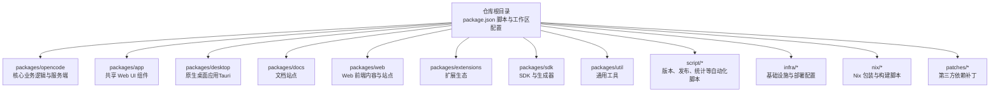
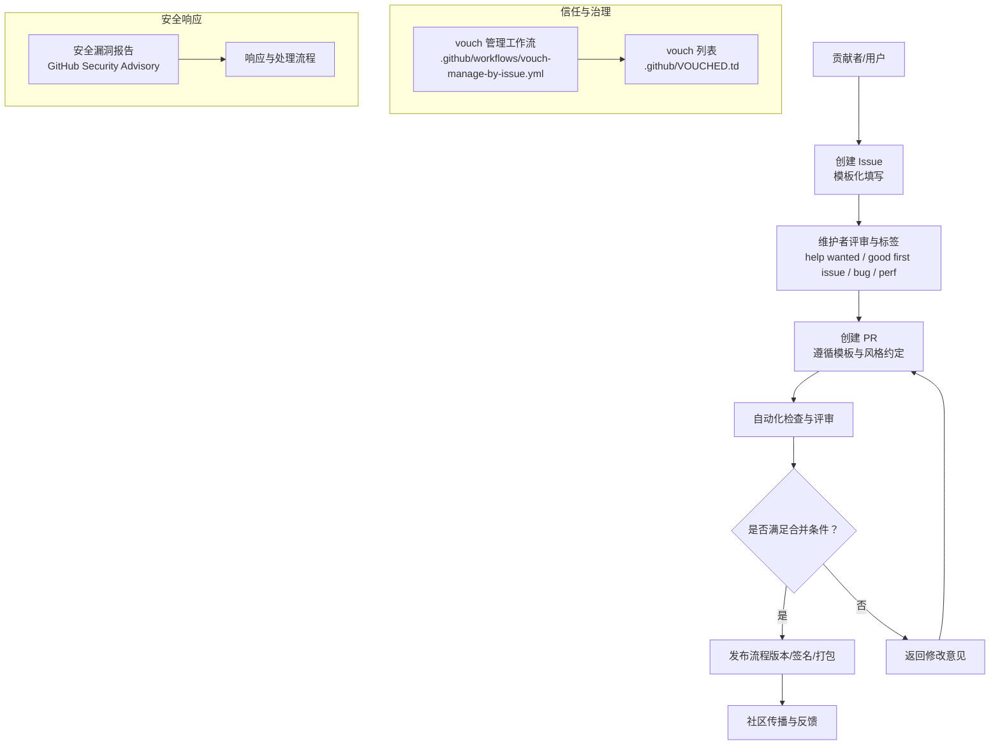
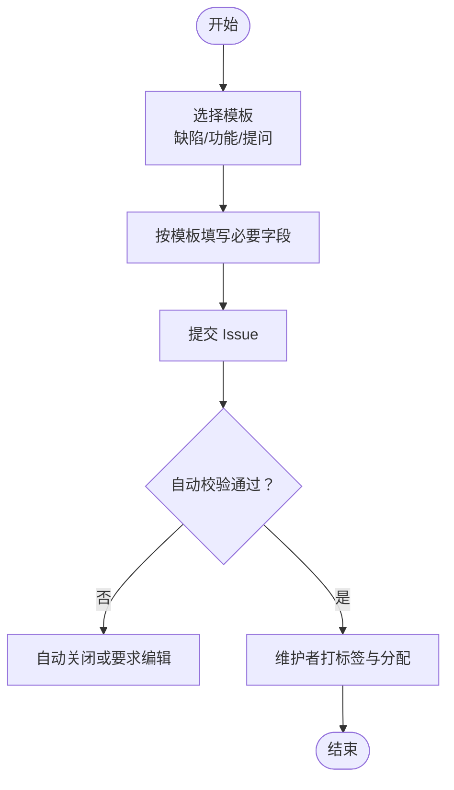
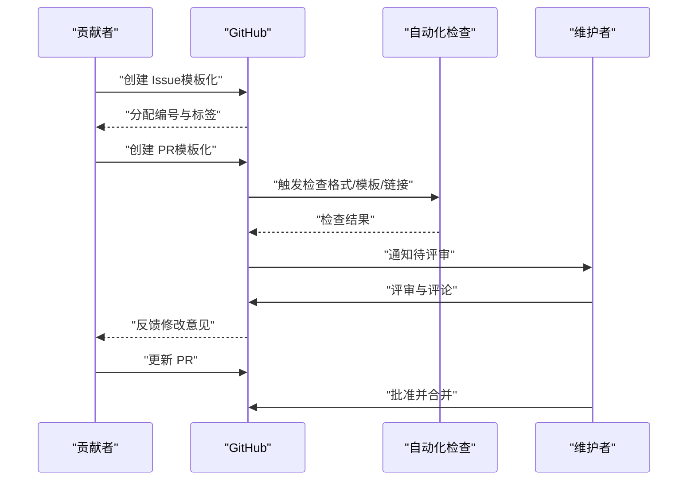
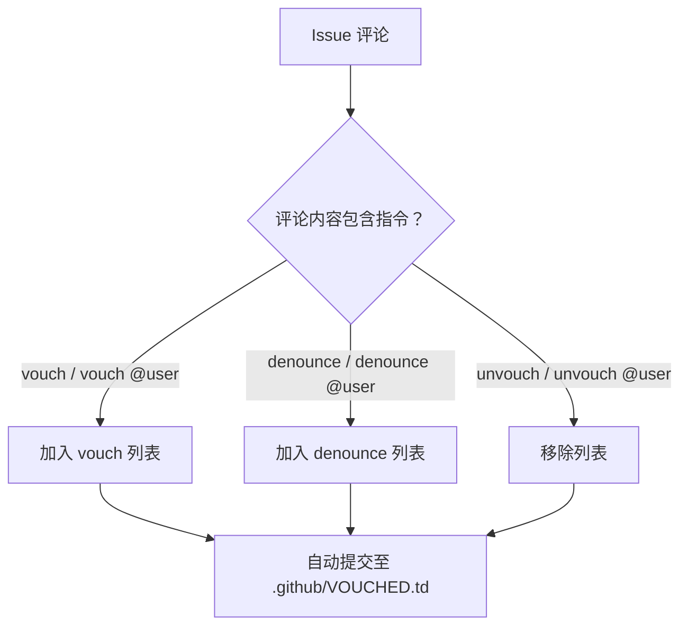
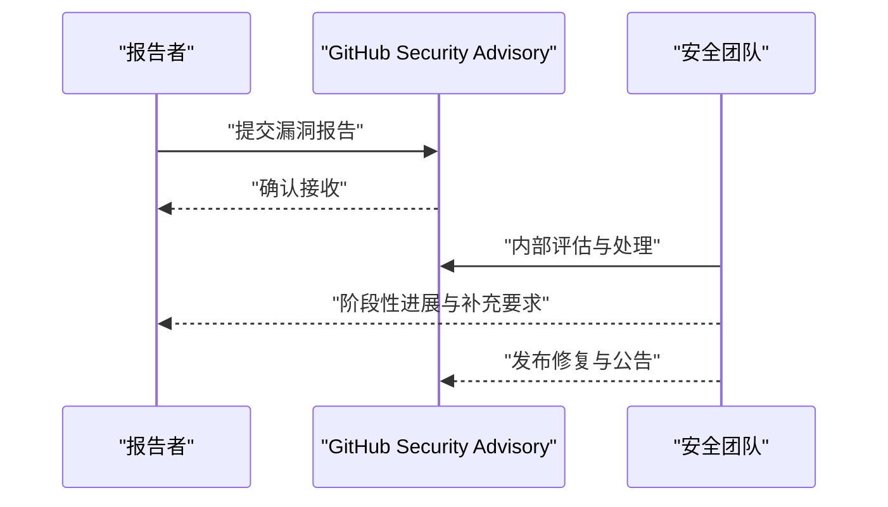
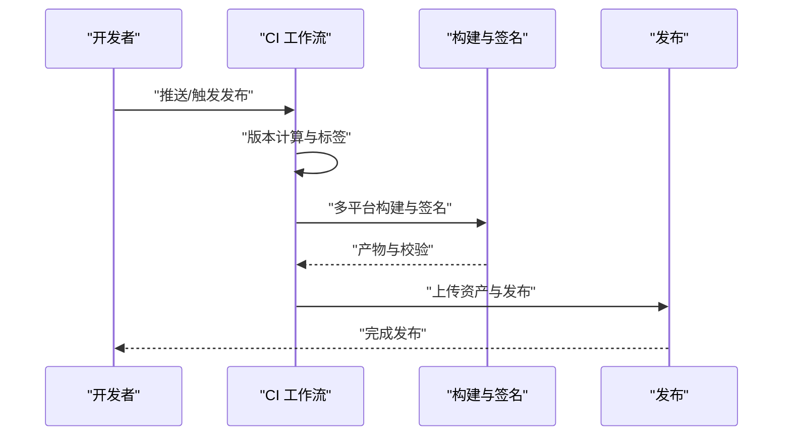
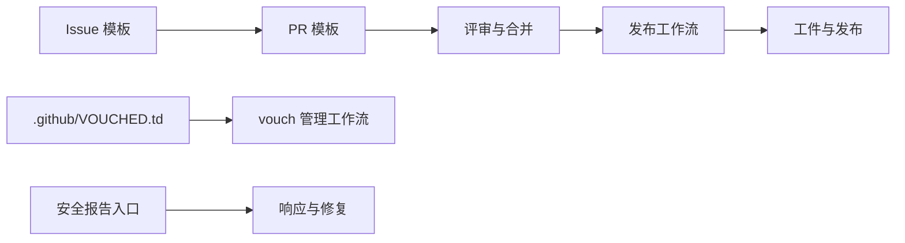

# 社区与贡献

<cite>
**本文引用的文件**
- [CONTRIBUTING.md](file://CONTRIBUTING.md)
- [SECURITY.md](file://SECURITY.md)
- [README.md](file://README.md)
- [.github/pull_request_template.md](file://.github/pull_request_template.md)
- [.github/ISSUE_TEMPLATE/bug-report.yml](file://.github/ISSUE_TEMPLATE/bug-report.yml)
- [.github/ISSUE_TEMPLATE/feature-request.yml](file://.github/ISSUE_TEMPLATE/feature-request.yml)
- [.github/ISSUE_TEMPLATE/question.yml](file://.github/ISSUE_TEMPLATE/question.yml)
- [.github/VOUCHED.td](file://.github/VOUCHED.td)
- [.github/workflows/vouch-manage-by-issue.yml](file://.github/workflows/vouch-manage-by-issue.yml)
- [.github/workflows/publish.yml](file://.github/workflows/publish.yml)
- [AGENTS.md](file://AGENTS.md)
- [package.json](file://package.json)
</cite>

## 目录
1. [引言](#引言)
2. [项目结构](#项目结构)
3. [核心组件](#核心组件)
4. [架构总览](#架构总览)
5. [详细组件分析](#详细组件分析)
6. [依赖分析](#依赖分析)
7. [性能考虑](#性能考虑)
8. [故障排查指南](#故障排查指南)
9. [结论](#结论)
10. [附录](#附录)

## 引言
本指南面向所有希望参与 OpenCode 社区建设与发展的开发者与用户，旨在帮助你快速理解如何以规范、高效且包容的方式参与项目：从提交 Issue、创建 Pull Request 到代码评审；从行为准则到治理结构；从安全漏洞报告到社区支持渠道。我们鼓励多样化的参与形式，包括但不限于代码贡献、文档改进、问题反馈与社区推广，并强调协作文化与开源精神。

## 项目结构
OpenCode 是一个多包（monorepo）项目，采用 Bun 作为开发与运行时工具，结合 Tauri 构建原生桌面应用，同时提供 CLI、Web 界面与 SDK 等多种使用形态。根目录下的脚本与配置文件定义了统一的开发体验与发布流程。

图示来源
- [package.json:1-124](file://package.json#L1-L124)

章节来源
- [package.json:1-124](file://package.json#L1-L124)

## 核心组件
- 贡献流程与规范：Issue 首先策略、PR 模板要求、标题约定、风格偏好与评审期望。
- 行为准则与信任系统：通过 vouch 系统管理贡献者信任度，明确 vouch/denounce/unvouch 流程与政策。
- 安全与合规：安全漏洞报告通道、负责任披露流程与威胁模型说明。
- 社区支持与沟通：Discord 社区、GitHub Discussions 等渠道入口。
- 开发与调试：本地开发命令、服务器与 Web 应用运行方式、调试技巧与注意事项。
- 发布与治理：CI 工作流与发布流程、分支策略与权限控制。

章节来源
- [CONTRIBUTING.md:190-312](file://CONTRIBUTING.md#L190-L312)
- [SECURITY.md:1-48](file://SECURITY.md#L1-L48)
- [README.md:119-142](file://README.md#L119-L142)
- [.github/pull_request_template.md:1-30](file://.github/pull_request_template.md#L1-L30)
- [.github/VOUCHED.td:1-32](file://.github/VOUCHED.td#L1-L32)

## 架构总览
下图展示了社区参与的关键流程：从 Issue 提交到 PR 合并，再到发布与安全响应，以及信任系统的协同作用。

图示来源
- [CONTRIBUTING.md:190-312](file://CONTRIBUTING.md#L190-L312)
- [.github/VOUCHED.td:1-32](file://.github/VOUCHED.td#L1-L32)
- [.github/workflows/vouch-manage-by-issue.yml:1-38](file://.github/workflows/vouch-manage-by-issue.yml#L1-L38)
- [SECURITY.md:37-48](file://SECURITY.md#L37-L48)
- [.github/workflows/publish.yml:1-630](file://.github/workflows/publish.yml#L1-L630)

## 详细组件分析

### Issue 提交流程与模板
- 必须使用官方模板：缺陷报告、功能请求、提问。
- 缺陷报告需包含复现步骤、截图或分享链接、操作系统与终端信息等。
- 功能请求需验证“未被提出过”，并清晰描述需求与收益。
- 提问类 Issue 需包含具体问题。
- 所有 Issue 必须符合模板与指南，否则将被自动关闭或要求在时限内修正。

图示来源
- [.github/ISSUE_TEMPLATE/bug-report.yml:1-68](file://.github/ISSUE_TEMPLATE/bug-report.yml#L1-L68)
- [.github/ISSUE_TEMPLATE/feature-request.yml:1-21](file://.github/ISSUE_TEMPLATE/feature-request.yml#L1-L21)
- [.github/ISSUE_TEMPLATE/question.yml:1-12](file://.github/ISSUE_TEMPLATE/question.yml#L1-L12)
- [CONTRIBUTING.md:294-312](file://CONTRIBUTING.md#L294-L312)

章节来源
- [.github/ISSUE_TEMPLATE/bug-report.yml:1-68](file://.github/ISSUE_TEMPLATE/bug-report.yml#L1-L68)
- [.github/ISSUE_TEMPLATE/feature-request.yml:1-21](file://.github/ISSUE_TEMPLATE/feature-request.yml#L1-L21)
- [.github/ISSUE_TEMPLATE/question.yml:1-12](file://.github/ISSUE_TEMPLATE/question.yml#L1-L12)
- [CONTRIBUTING.md:294-312](file://CONTRIBUTING.md#L294-L312)

### Pull Request 创建与评审标准
- Issue 首先：所有 PR 必须关联现有 Issue，使用修复语义链接。
- PR 模板：明确类型、变更说明、验证方法、UI 截图等。
- 标题约定：遵循约定式提交规范，可选包范围。
- 评审期望：保持 PR 小而聚焦、解释问题与修复原因、避免 AI 生成长篇文本。
- UI 变更需附带前后对比截图；逻辑变更需说明测试与复现方法。
- 风格偏好：函数单一职责、避免不必要的解构、优先使用单行命名、优先使用 Bun API、类型精确、不可变变量、避免 else 与 try/catch 等。

图示来源
- [.github/pull_request_template.md:1-30](file://.github/pull_request_template.md#L1-L30)
- [CONTRIBUTING.md:190-262](file://CONTRIBUTING.md#L190-L262)

章节来源
- [.github/pull_request_template.md:1-30](file://.github/pull_request_template.md#L1-L30)
- [CONTRIBUTING.md:190-262](file://CONTRIBUTING.md#L190-L262)

### 行为准则与信任系统（Vouch）
- vouch 列表由维护者管理，记录受信任与被禁止的贡献者。
- 维护者可在 Issue 评论中使用指令进行 vouch/denounce/unvouch。
- 被 denounce 的用户会被自动关闭相关 Issue/PR；如被误判可联系维护者申诉。
- 未 vouch 用户仍可正常参与，无需事先申请。

图示来源
- [.github/workflows/vouch-manage-by-issue.yml:1-38](file://.github/workflows/vouch-manage-by-issue.yml#L1-L38)
- [.github/VOUCHED.td:1-32](file://.github/VOUCHED.td#L1-L32)
- [CONTRIBUTING.md:267-293](file://CONTRIBUTING.md#L267-L293)

章节来源
- [.github/workflows/vouch-manage-by-issue.yml:1-38](file://.github/workflows/vouch-manage-by-issue.yml#L1-L38)
- [.github/VOUCHED.td:1-32](file://.github/VOUCHED.td#L1-L32)
- [CONTRIBUTING.md:267-293](file://CONTRIBUTING.md#L267-L293)

### 安全漏洞报告与负责任披露
- 不接受 AI 自动生成的安全报告，以免浪费维护者资源。
- 明确威胁模型：不提供沙箱隔离，服务端模式需自行加固；部分场景不在受理范围内。
- 报告渠道：使用 GitHub Security Advisory 的“Report a Vulnerability”页面提交。
- 响应流程：团队会尽快确认并推进修复与公告；若超过一定工作日未收到回复，可邮件跟进。

图示来源
- [SECURITY.md:1-48](file://SECURITY.md#L1-L48)

章节来源
- [SECURITY.md:1-48](file://SECURITY.md#L1-L48)

### 社区资源与支持渠道
- 社区与讨论：Discord 社区、GitHub Discussions（如存在）。
- 文档与安装：多语言 README、安装脚本与包管理器分发。
- 项目主页与下载：官网与桌面应用下载入口。

章节来源
- [README.md:119-142](file://README.md#L119-L142)

### 开发与调试指南
- 开发环境：Bun 1.3+，根目录启动开发服务器与各子包开发命令。
- 运行方式：CLI 服务器、Web 应用、桌面应用（Tauri）三类运行模式与端口配置。
- 调试建议：优先使用 `--inspect` 方式手动启动并在浏览器/IDE 中附加；避免某些 VSCode 调试配置导致断点错位。
- 生成与 SDK：当 API 或 SDK 变更后，执行生成脚本以同步 SDK。

章节来源
- [CONTRIBUTING.md:32-178](file://CONTRIBUTING.md#L32-L178)
- [AGENTS.md:1-129](file://AGENTS.md#L1-L129)

### 发布与治理（CI 工作流）
- 分支与触发：在 dev、beta、snapshot-* 等分支或手动触发。
- 版本管理：脚本计算版本、发布标签与仓库目标。
- 多平台构建：CLI 与桌面应用（Tauri/Electron）跨平台打包与签名。
- 资产上传与发布：上传工件、签名验证、AUR 与 NPM 发布。
- 权限与并发：明确权限与并发组，确保发布一致性。

图示来源
- [.github/workflows/publish.yml:1-630](file://.github/workflows/publish.yml#L1-L630)

章节来源
- [.github/workflows/publish.yml:1-630](file://.github/workflows/publish.yml#L1-L630)

## 依赖分析
- 贡献流程依赖于 Issue 模板与 PR 模板，确保信息完整与可追溯。
- vouch 系统依赖 GitHub Actions 自动化管理与 .github/VOUCHED.td 文件。
- 安全响应依赖 GitHub Security Advisory 页面与邮件回退机制。
- 发布流程依赖多平台构建与签名工具链，以及包管理器与 AUR 的发布配置。

图示来源
- [.github/ISSUE_TEMPLATE/bug-report.yml:1-68](file://.github/ISSUE_TEMPLATE/bug-report.yml#L1-L68)
- [.github/ISSUE_TEMPLATE/feature-request.yml:1-21](file://.github/ISSUE_TEMPLATE/feature-request.yml#L1-L21)
- [.github/ISSUE_TEMPLATE/question.yml:1-12](file://.github/ISSUE_TEMPLATE/question.yml#L1-L12)
- [.github/pull_request_template.md:1-30](file://.github/pull_request_template.md#L1-L30)
- [.github/VOUCHED.td:1-32](file://.github/VOUCHED.td#L1-L32)
- [.github/workflows/vouch-manage-by-issue.yml:1-38](file://.github/workflows/vouch-manage-by-issue.yml#L1-L38)
- [SECURITY.md:37-48](file://SECURITY.md#L37-L48)
- [.github/workflows/publish.yml:1-630](file://.github/workflows/publish.yml#L1-L630)

## 性能考虑
- 保持 PR 小而聚焦，减少评审与回归风险。
- 使用自动化脚本与模板减少重复劳动，提升反馈速度。
- 在本地开发中优先使用 Bun 的原生命令与调试选项，避免 IDE/终端差异导致的调试成本。

## 故障排查指南
- Issue 未通过模板校验：检查必填字段与占位符，按提示在时限内编辑。
- PR 被拒或长时间无人评审：确认是否关联了 Issue、标题是否符合约定式提交、描述是否简洁清晰。
- vouch/denounce 争议：在 Issue 下评论说明情况，等待维护者处理。
- 安全报告被拒：确认不是 AI 自动生成内容，按要求重新提交。

章节来源
- [CONTRIBUTING.md:294-312](file://CONTRIBUTING.md#L294-L312)
- [CONTRIBUTING.md:267-293](file://CONTRIBUTING.md#L267-L293)
- [SECURITY.md:5-7](file://SECURITY.md#L5-L7)

## 结论
OpenCode 的社区与贡献体系以规范化的流程、透明的治理与负责任的安全响应为核心，既保障了高质量交付，也营造了包容友好的协作氛围。我们鼓励每一位参与者从最小可行贡献开始，逐步深入，共同推动项目向前发展。

## 附录
- 新贡献者入门建议
  - 先从“good first issue”或“help wanted”标签的任务入手，熟悉 Issue 与 PR 流程。
  - 阅读并遵守 PR 模板与风格偏好，确保描述简洁、可验证。
  - 在 Discord 或 Discussions 中与其他贡献者交流，获取及时反馈。
  - 如遇到安全问题，请通过安全报告通道私下提交，避免公开披露。
- 成长路径建议
  - 从文档改进、小修复与 UI 微调起步，逐步承担更大范围的功能开发。
  - 关注发布工作流与跨平台构建，提升对交付质量的理解。
  - 积极参与评审与讨论，提升协作效率与代码质量意识。