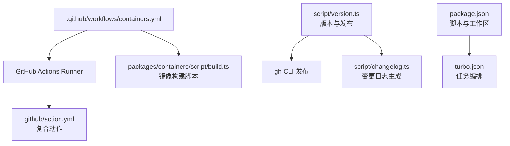
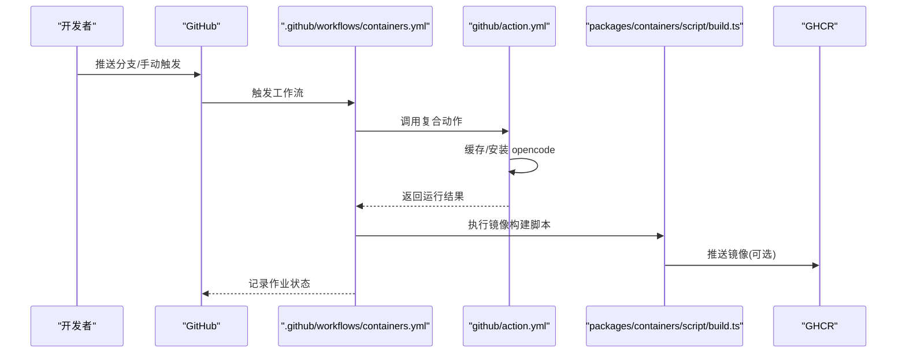
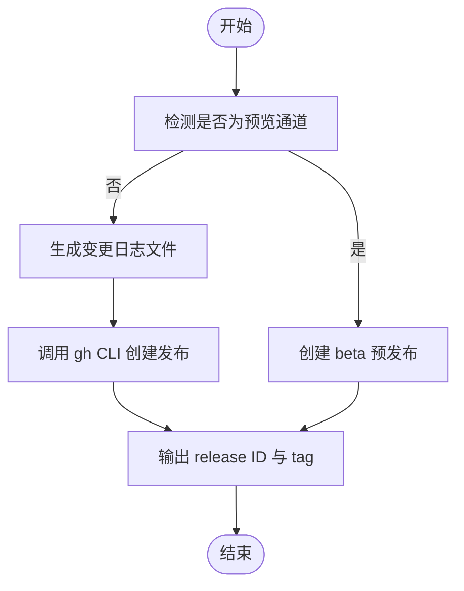
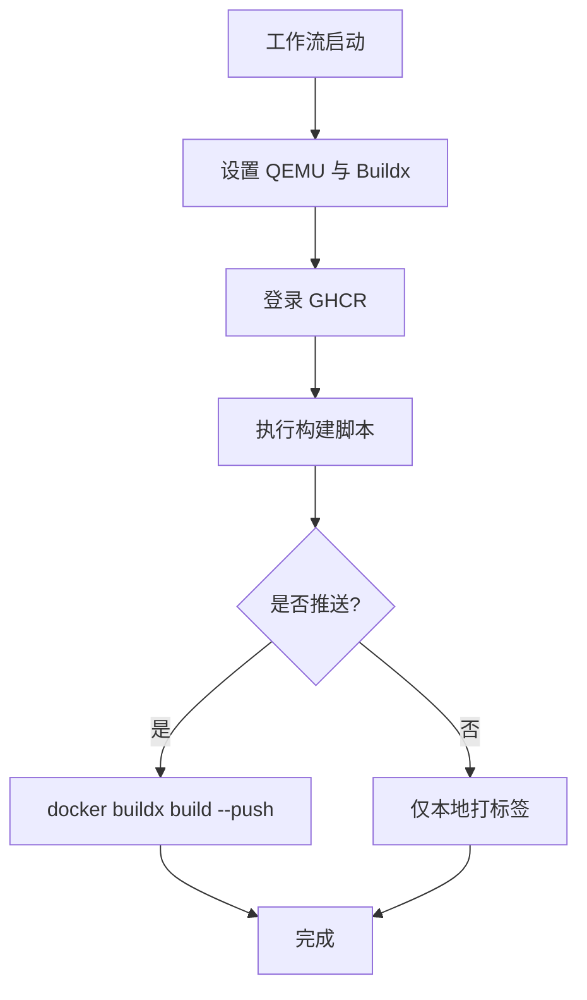
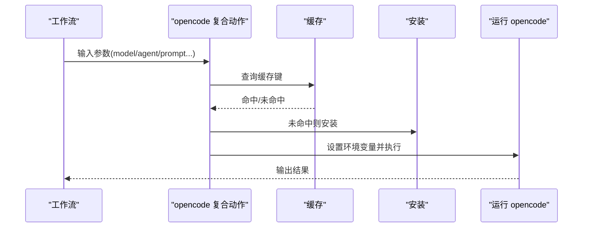
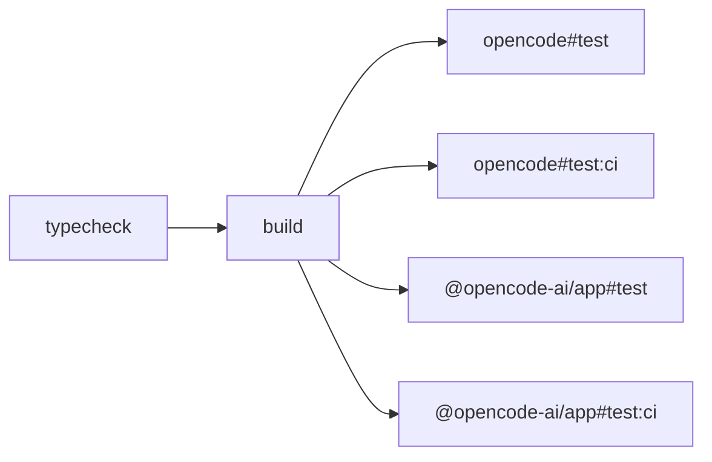
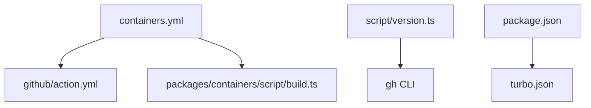

# CI/CD 流水线

<cite>
**本文引用的文件**
- [.github/publish-python-sdk.yml](file://.github/publish-python-sdk.yml)
- [script/version.ts](file://script/version.ts)
- [script/changelog.ts](file://script/changelog.ts)
- [package.json](file://package.json)
- [turbo.json](file://turbo.json)
- [github/action.yml](file://github/action.yml)
- [.github/workflows/containers.yml](file://.github/workflows/containers.yml)
- [packages/containers/script/build.ts](file://packages/containers/script/build.ts)
</cite>

## 目录
1. [简介](#简介)
2. [项目结构](#项目结构)
3. [核心组件](#核心组件)
4. [架构总览](#架构总览)
5. [详细组件分析](#详细组件分析)
6. [依赖关系分析](#依赖关系分析)
7. [性能考量](#性能考量)
8. [故障排查指南](#故障排查指南)
9. [结论](#结论)
10. [附录](#附录)

## 简介
本文件系统性梳理 OpenCode 的 CI/CD 流水线配置与管理实践，覆盖以下主题：
- GitHub Actions 工作流：代码质量检查、单元测试、集成测试与端到端测试的自动化执行策略
- 构建与发布流程：多平台二进制构建、容器镜像构建与推送、版本标签管理
- 自动化发布策略：语义化版本控制、变更日志生成、发布通知
- 代码审查与质量门禁：覆盖率要求、静态分析检查与合规性管理
- 部署回滚与蓝绿部署：可扩展的发布策略建议
- 流水线监控与失败排查：可观测性与问题定位方法

## 项目结构
围绕 CI/CD 的关键目录与文件如下：
- .github/workflows：GitHub Actions 工作流定义（如容器镜像构建）
- .github/actions：自定义复合动作（Composite Actions）
- script：版本与变更日志脚本
- packages/containers/script：容器镜像构建脚本
- package.json 与 turbo.json：统一脚本与任务编排入口

图表来源
- [.github/workflows/containers.yml:1-45](file://.github/workflows/containers.yml#L1-L45)
- [github/action.yml:1-80](file://github/action.yml#L1-L80)
- [packages/containers/script/build.ts:36-77](file://packages/containers/script/build.ts#L36-L77)
- [script/version.ts:1-37](file://script/version.ts#L1-L37)
- [script/changelog.ts:1-77](file://script/changelog.ts#L1-L77)
- [package.json:1-124](file://package.json#L1-L124)
- [turbo.json:1-32](file://turbo.json#L1-L32)

章节来源
- [.github/workflows/containers.yml:1-45](file://.github/workflows/containers.yml#L1-L45)
- [github/action.yml:1-80](file://github/action.yml#L1-L80)
- [packages/containers/script/build.ts:36-77](file://packages/containers/script/build.ts#L36-L77)
- [script/version.ts:1-37](file://script/version.ts#L1-L37)
- [script/changelog.ts:1-77](file://script/changelog.ts#L1-L77)
- [package.json:1-124](file://package.json#L1-L124)
- [turbo.json:1-32](file://turbo.json#L1-L32)

## 核心组件
- 版本与发布脚本：负责从脚本环境推导版本号、生成发布说明、调用 GitHub CLI 创建预发布或正式发布，并输出关键元数据供后续步骤使用
- 变更日志生成器：通过 opencode 命令生成 UPCOMING_CHANGELOG.md，支持从指定版本到当前提交范围的日志生成
- 容器镜像构建脚本：基于 Docker Buildx 在多平台构建镜像并可选推送至 GHCR
- GitHub Actions 工作流：以容器镜像构建为例，展示如何在受控环境中执行构建与推送
- 复合动作：封装 opencode 安装、缓存与运行逻辑，便于在不同触发条件下复用
- 任务编排：通过 Turbo 统一管理类型检查、构建与测试任务及其产物缓存

章节来源
- [script/version.ts:1-37](file://script/version.ts#L1-L37)
- [script/changelog.ts:1-77](file://script/changelog.ts#L1-L77)
- [packages/containers/script/build.ts:36-77](file://packages/containers/script/build.ts#L36-L77)
- [.github/workflows/containers.yml:1-45](file://.github/workflows/containers.yml#L1-L45)
- [github/action.yml:1-80](file://github/action.yml#L1-L80)
- [turbo.json:1-32](file://turbo.json#L1-L32)

## 架构总览
下图展示了从触发到产出的关键路径：工作流触发 → 执行构建/测试 → 生成发布物 → 推送镜像/发布版本。

图表来源
- [.github/workflows/containers.yml:1-45](file://.github/workflows/containers.yml#L1-L45)
- [github/action.yml:1-80](file://github/action.yml#L1-L80)
- [packages/containers/script/build.ts:36-77](file://packages/containers/script/build.ts#L36-L77)

## 详细组件分析

### 版本与发布流程（语义化版本、变更日志、发布通知）
- 版本推导：脚本根据运行环境推导版本号；非预览场景会生成发布说明文件并通过 gh CLI 创建预发布或正式发布，同时输出 release ID 与 tag 供后续步骤使用
- 变更日志：通过调用 opencode 命令生成 UPCOMING_CHANGELOG.md，支持从指定起止版本/引用生成范围变更记录
- 发布通知：结合 GitHub Release 的元数据输出，可用于后续通知或制品归档

图表来源
- [script/version.ts:1-37](file://script/version.ts#L1-L37)
- [script/changelog.ts:1-77](file://script/changelog.ts#L1-L77)

章节来源
- [script/version.ts:1-37](file://script/version.ts#L1-L37)
- [script/changelog.ts:1-77](file://script/changelog.ts#L1-L77)

### 容器镜像构建与推送（多平台、GHCR）
- 触发条件：对 packages/containers 目录与工作流文件的推送触发
- 平台与工具链：启用 QEMU 与 Docker Buildx，支持多平台镜像构建
- 登录与推送：使用 GITHUB_TOKEN 登录 GHCR，按需推送镜像
- 构建脚本：支持 base、bun-node 与其他镜像的差异化构建参数与推送行为

图表来源
- [.github/workflows/containers.yml:1-45](file://.github/workflows/containers.yml#L1-L45)
- [packages/containers/script/build.ts:36-77](file://packages/containers/script/build.ts#L36-L77)

章节来源
- [.github/workflows/containers.yml:1-45](file://.github/workflows/containers.yml#L1-L45)
- [packages/containers/script/build.ts:36-77](file://packages/containers/script/build.ts#L36-L77)

### 复合动作：opencode GitHub Action
- 功能：自动获取最新版本、缓存二进制、安装并运行 opencode，支持多种输入参数（模型、代理、提示词等）
- 使用场景：可在 PR 评论、Issue 评论等事件中触发，实现自动化审查与辅助操作

图表来源
- [github/action.yml:1-80](file://github/action.yml#L1-L80)

章节来源
- [github/action.yml:1-80](file://github/action.yml#L1-L80)

### 任务编排与测试（Turbo）
- 类型检查与构建：全局环境变量与输出目录配置
- 单元测试与 CI 测试：针对不同包的任务，设置依赖顺序与产物输出，便于缓存与并行执行
- 环境透传：允许 CI 环境变量透传，确保测试稳定性

图表来源
- [turbo.json:1-32](file://turbo.json#L1-L32)

章节来源
- [turbo.json:1-32](file://turbo.json#L1-L32)

### Python SDK 自动发布（占位与扩展）
- 当前文件为占位示例，展示了使用 uv 管理 Python 依赖、从发布标签设置版本、生成与发布 Python SDK 的思路
- 建议：在实际工作流中启用 release/published 事件或手动触发，读取 GITHUB_REF_NAME 或最近标签作为版本号，同步更新 pyproject.toml 与生成器配置后发布至 PyPI

章节来源
- [.github/publish-python-sdk.yml:1-72](file://.github/publish-python-sdk.yml#L1-L72)

## 依赖关系分析
- 工作流对复合动作的依赖：通过 .github/actions/setup-bun 或直接使用 github/action.yml
- 构建脚本对 Docker 生态的依赖：QEMU、Buildx、GHCR 登录
- 版本与发布对 gh CLI 的依赖：用于创建/查询发布元数据
- 任务编排对 Turbo 的依赖：统一管理类型检查、构建与测试任务

图表来源
- [.github/workflows/containers.yml:1-45](file://.github/workflows/containers.yml#L1-L45)
- [github/action.yml:1-80](file://github/action.yml#L1-L80)
- [packages/containers/script/build.ts:36-77](file://packages/containers/script/build.ts#L36-L77)
- [script/version.ts:1-37](file://script/version.ts#L1-L37)
- [package.json:1-124](file://package.json#L1-L124)
- [turbo.json:1-32](file://turbo.json#L1-L32)

章节来源
- [.github/workflows/containers.yml:1-45](file://.github/workflows/containers.yml#L1-L45)
- [github/action.yml:1-80](file://github/action.yml#L1-L80)
- [packages/containers/script/build.ts:36-77](file://packages/containers/script/build.ts#L36-L77)
- [script/version.ts:1-37](file://script/version.ts#L1-L37)
- [package.json:1-124](file://package.json#L1-L124)
- [turbo.json:1-32](file://turbo.json#L1-L32)

## 性能考量
- 缓存策略：复合动作中对 opencode 二进制进行缓存，减少重复安装时间
- 并行与增量：Turbo 任务依赖与输出缓存，提升类型检查与测试的并行度
- 多平台构建：Buildx 支持跨平台镜像构建，合理选择平台矩阵以平衡耗时与覆盖度
- 产物缓存：测试阶段将 JUnit XML 等产物缓存，便于报告与重放

## 故障排查指南
- opencode 复合动作
  - 检查缓存键与 runner OS/Arch 是否匹配
  - 确认安装步骤是否被跳过（缓存命中）
  - 核对输入参数（模型、代理、提示词）是否正确传递
- 容器镜像构建
  - 确认 QEMU 与 Buildx 已正确设置
  - 检查 GHCR 登录凭据与仓库权限
  - 若推送失败，确认镜像标签与 registry 地址一致
- 版本与发布
  - 若 gh CLI 失败，检查 GITHUB_TOKEN 权限与网络连通性
  - 确认版本号解析逻辑与标签命名规范一致
- 任务编排
  - 若测试产物缺失，检查任务依赖与 passThroughEnv 配置
  - 对比本地与 CI 环境差异，必要时开启详细日志

章节来源
- [github/action.yml:1-80](file://github/action.yml#L1-L80)
- [.github/workflows/containers.yml:1-45](file://.github/workflows/containers.yml#L1-L45)
- [script/version.ts:1-37](file://script/version.ts#L1-L37)
- [turbo.json:1-32](file://turbo.json#L1-L32)

## 结论
本仓库已具备完善的 CI/CD 基础设施：通过复合动作实现 opencode 的可复用执行、通过 Turbo 统一任务编排、通过脚本实现版本与发布自动化、通过工作流实现容器镜像的多平台构建与推送。建议在此基础上进一步完善：
- 补充代码质量检查与覆盖率门禁
- 扩展端到端测试与集成测试的工作流
- 明确蓝绿/滚动发布的策略与回滚流程
- 强化监控与告警，完善失败排查与根因分析

## 附录
- 相关文件路径与职责概览
  - .github/workflows/containers.yml：容器镜像构建与推送
  - github/action.yml：opencode 复合动作
  - packages/containers/script/build.ts：镜像构建脚本
  - script/version.ts：版本与发布元数据输出
  - script/changelog.ts：变更日志生成
  - package.json：脚本与工作区配置
  - turbo.json：任务编排与缓存