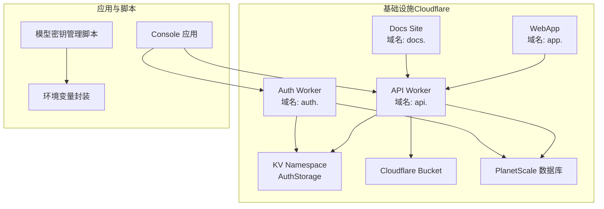
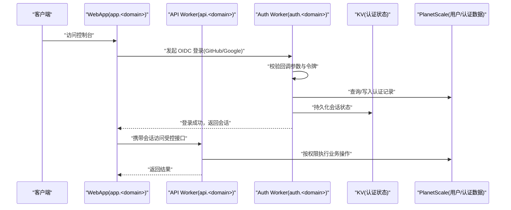
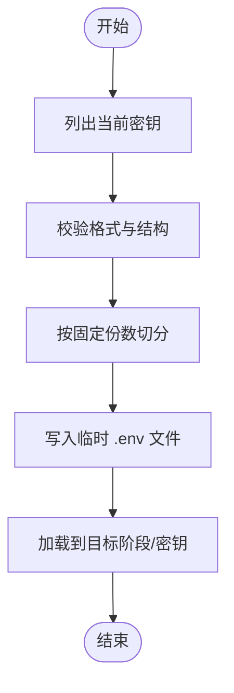
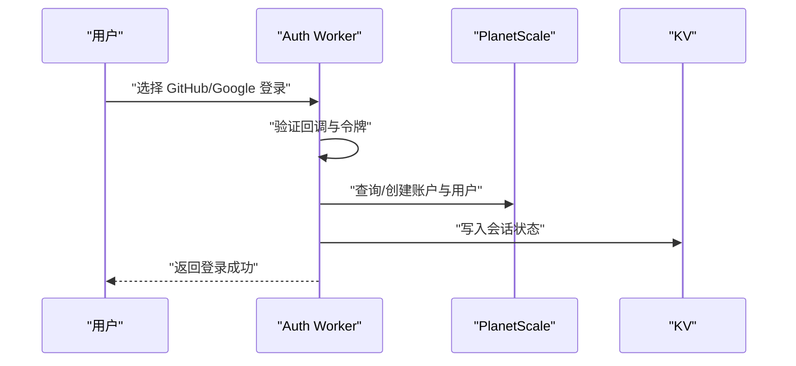
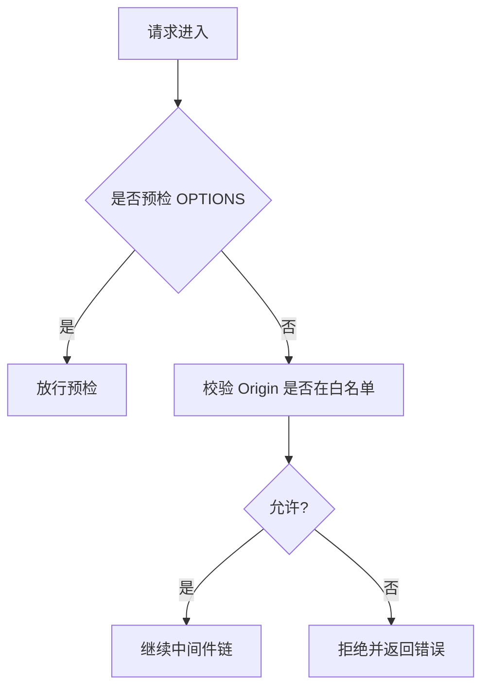
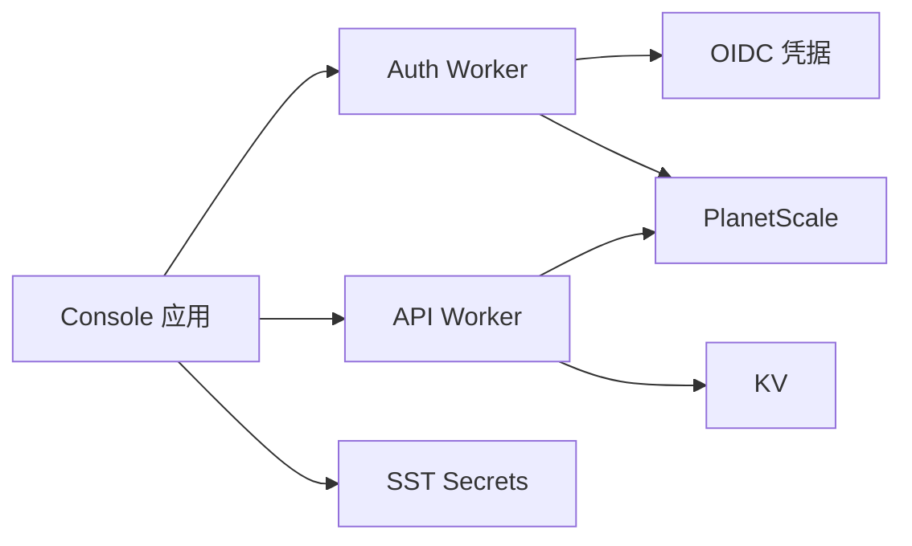

# 安全配置

<cite>
**本文引用的文件**
- [SECURITY.md](file://SECURITY.md)
- [sst.config.ts](file://sst.config.ts)
- [infra/secret.ts](file://infra/secret.ts)
- [infra/app.ts](file://infra/app.ts)
- [infra/console.ts](file://infra/console.ts)
- [infra/stage.ts](file://infra/stage.ts)
- [packages/console/function/src/auth.ts](file://packages/console/function/src/auth.ts)
- [packages/opencode/src/auth/index.ts](file://packages/opencode/src/auth/index.ts)
- [packages/opencode/src/mcp/auth.ts](file://packages/opencode/src/mcp/auth.ts)
- [packages/opencode/src/server/server.ts](file://packages/opencode/src/server/server.ts)
- [packages/opencode/src/cli/network.ts](file://packages/opencode/src/cli/network.ts)
- [packages/web/src/content/docs/ar/web.mdx](file://packages/web/src/content/docs/ar/web.mdx)
- [packages/web/src/content/docs/nb/network.mdx](file://packages/web/src/content/docs/nb/network.mdx)
- [packages/web/src/content/docs/ru/network.mdx](file://packages/web/src/content/docs/ru/network.mdx)
- [packages/console/core/script/pull-models.ts](file://packages/console/core/script/pull-models.ts)
- [packages/console/core/script/promote-models.ts](file://packages/console/core/script/promote-models.ts)
- [packages/console/core/script/update-models.ts](file://packages/console/core/script/update-models.ts)
- [packages/opencode/src/env/index.ts](file://packages/opencode/src/env/index.ts)
</cite>

## 目录
1. [简介](#简介)
2. [项目结构](#项目结构)
3. [核心组件](#核心组件)
4. [架构总览](#架构总览)
5. [详细组件分析](#详细组件分析)
6. [依赖关系分析](#依赖关系分析)
7. [性能考量](#性能考量)
8. [故障排查指南](#故障排查指南)
9. [结论](#结论)
10. [附录](#附录)

## 简介
本指南面向 OpenCode 的安全配置与运维，聚焦以下方面：
- API 密钥与敏感信息管理：环境变量加密、密钥轮换、访问控制与最小权限原则
- 网络配置安全：CORS 设置、HTTPS 强制、代理与证书信任、服务器访问控制
- 身份认证与授权：本地服务器密码保护、OAuth 集成、会话与令牌管理
- 数据传输与存储安全：端到端加密、密钥分段与最小暴露面
- 安全审计与漏洞扫描：日志与可观测性、自动化扫描与补丁策略
- 安全事件响应与应急处置：报告渠道、升级路径与隔离策略
- 合规与认证：威胁模型、责任边界与合规指引

## 项目结构
OpenCode 采用多包工作区与基础设施即代码（IaC）结合的组织方式：
- 基础设施通过 SST 在 Cloudflare Workers 上部署，包含 API Worker、认证 Worker、静态站点与数据库链接
- 应用侧包含 Web 控制台、函数功能与本地服务端能力
- 安全相关的关键点分布在基础设施定义、认证实现与网络配置中

图表来源
- [infra/app.ts:13-49](file://infra/app.ts#L13-L49)
- [infra/console.ts:60-65](file://infra/console.ts#L60-L65)
- [infra/console.ts:214-259](file://infra/console.ts#L214-L259)
- [infra/stage.ts:1-20](file://infra/stage.ts#L1-L20)

章节来源
- [sst.config.ts:3-23](file://sst.config.ts#L3-L23)
- [infra/app.ts:1-69](file://infra/app.ts#L1-L69)
- [infra/console.ts:1-260](file://infra/console.ts#L1-L260)
- [infra/stage.ts:1-20](file://infra/stage.ts#L1-L20)

## 核心组件
- 基础设施与密钥管理
  - 使用 SST Secret 管理各类密钥，如 R2 访问凭据、Stripe 秘钥、GitHub/GitLab/Google 客户端凭据等
  - 将敏感值注入到 Worker 环境或链接对象中，避免硬编码
- 认证与授权
  - Auth Worker 提供 GitHub/Google OIDC 登录，并将用户主体映射到账户与工作空间
  - 本地服务器支持基于密码的 HTTP Basic Auth，用于保护控制平面
- 网络与 CORS
  - 本地服务端对 CORS 进行白名单校验，仅允许受信来源
  - CLI 支持自定义 CORS、主机名与端口，便于企业网络环境适配
- 模型密钥管理
  - 通过脚本读取/更新分片后的模型密钥，结合验证与加载流程，降低单点泄露风险

章节来源
- [infra/secret.ts:1-5](file://infra/secret.ts#L1-L5)
- [sst.config.ts:10-15](file://sst.config.ts#L10-L15)
- [infra/app.ts:3-11](file://infra/app.ts#L3-L11)
- [infra/console.ts:56-65](file://infra/console.ts#L56-L65)
- [packages/console/function/src/auth.ts:41-224](file://packages/console/function/src/auth.ts#L41-L224)
- [packages/opencode/src/server/server.ts:39-90](file://packages/opencode/src/server/server.ts#L39-L90)
- [packages/opencode/src/cli/network.ts:47-60](file://packages/opencode/src/cli/network.ts#L47-L60)
- [packages/console/core/script/pull-models.ts:1-33](file://packages/console/core/script/pull-models.ts#L1-L33)
- [packages/console/core/script/promote-models.ts:1-33](file://packages/console/core/script/promote-models.ts#L1-L33)
- [packages/console/core/script/update-models.ts:1-43](file://packages/console/core/script/update-models.ts#L1-L43)

## 架构总览
下图展示安全相关组件在系统中的交互关系：认证、API、存储与数据库之间的连接与数据流。

图表来源
- [infra/console.ts:60-65](file://infra/console.ts#L60-L65)
- [infra/app.ts:13-49](file://infra/app.ts#L13-L49)
- [packages/console/function/src/auth.ts:41-224](file://packages/console/function/src/auth.ts#L41-L224)

## 详细组件分析

### 组件一：密钥与敏感信息管理
- 设计要点
  - 所有外部服务密钥均通过 SST Secret 声明并在运行时注入，避免源码与配置文件泄露
  - 对大体量敏感数据（如模型密钥）进行分片存储与分步更新，降低单次泄露影响面
  - 通过脚本化流程完成密钥读取、校验与加载，减少人工干预
- 最小权限与轮换
  - 为不同阶段与资源分别设置密钥，限制访问范围
  - 使用脚本在受控环境中进行密钥更新，确保变更可追溯
- 可视化

图表来源
- [packages/console/core/script/pull-models.ts:1-33](file://packages/console/core/script/pull-models.ts#L1-L33)
- [packages/console/core/script/promote-models.ts:1-33](file://packages/console/core/script/promote-models.ts#L1-L33)
- [packages/console/core/script/update-models.ts:1-43](file://packages/console/core/script/update-models.ts#L1-L43)

章节来源
- [infra/secret.ts:1-5](file://infra/secret.ts#L1-L5)
- [sst.config.ts:10-15](file://sst.config.ts#L10-L15)
- [infra/app.ts:3-11](file://infra/app.ts#L3-L11)
- [infra/console.ts:153-184](file://infra/console.ts#L153-L184)
- [packages/console/core/script/pull-models.ts:1-33](file://packages/console/core/script/pull-models.ts#L1-L33)
- [packages/console/core/script/promote-models.ts:1-33](file://packages/console/core/script/promote-models.ts#L1-L33)
- [packages/console/core/script/update-models.ts:1-43](file://packages/console/core/script/update-models.ts#L1-L43)

### 组件二：身份认证与授权
- OAuth 集成
  - Auth Worker 使用 OpenAuth 提供 GitHub 与 Google OIDC 登录，支持邮箱与用户主体映射
  - 登录成功后将用户与账户关联，并自动加入默认工作空间
- 本地服务器访问控制
  - 通过环境变量启用 HTTP Basic Auth，未设置密码时拒绝访问并发出警告
- 令牌与会话
  - 本地会话由 Auth Worker 管理；应用层支持多种认证形态（OAuth/API/Well-Known），用于不同场景下的凭据存储与传递

图表来源
- [packages/console/function/src/auth.ts:41-224](file://packages/console/function/src/auth.ts#L41-L224)
- [packages/opencode/src/auth/index.ts:1-42](file://packages/opencode/src/auth/index.ts#L1-L42)

章节来源
- [packages/console/function/src/auth.ts:41-224](file://packages/console/function/src/auth.ts#L41-L224)
- [packages/opencode/src/auth/index.ts:1-42](file://packages/opencode/src/auth/index.ts#L1-L42)
- [packages/opencode/src/mcp/auth.ts:1-34](file://packages/opencode/src/mcp/auth.ts#L1-L34)
- [SECURITY.md:21-24](file://SECURITY.md#L21-L24)

### 组件三：网络配置与 CORS
- CORS 白名单
  - 本地服务端对 CORS 来源进行严格校验，仅放行受信来源（本地回环、特定域与显式传入项）
- 企业网络适配
  - 支持通过环境变量与 CLI 参数配置代理、自定义证书与监听地址
- HTTPS 与强制
  - 基于 Cloudflare Workers 的部署天然具备边缘 TLS；建议在企业前置网关或反向代理处统一终止 TLS 并进行访问控制

图表来源
- [packages/opencode/src/server/server.ts:39-90](file://packages/opencode/src/server/server.ts#L39-L90)
- [packages/opencode/src/cli/network.ts:47-60](file://packages/opencode/src/cli/network.ts#L47-L60)
- [packages/web/src/content/docs/nb/network.mdx:1-57](file://packages/web/src/content/docs/nb/network.mdx#L1-L57)
- [packages/web/src/content/docs/ru/network.mdx:37-57](file://packages/web/src/content/docs/ru/network.mdx#L37-L57)
- [packages/web/src/content/docs/ar/web.mdx:73-87](file://packages/web/src/content/docs/ar/web.mdx#L73-L87)

章节来源
- [packages/opencode/src/server/server.ts:39-90](file://packages/opencode/src/server/server.ts#L39-L90)
- [packages/opencode/src/cli/network.ts:47-60](file://packages/opencode/src/cli/network.ts#L47-L60)
- [packages/web/src/content/docs/nb/network.mdx:1-57](file://packages/web/src/content/docs/nb/network.mdx#L1-L57)
- [packages/web/src/content/docs/ru/network.mdx:37-57](file://packages/web/src/content/docs/ru/network.mdx#L37-L57)
- [packages/web/src/content/docs/ar/web.mdx:73-87](file://packages/web/src/content/docs/ar/web.mdx#L73-L87)

### 组件四：数据传输与存储安全
- 传输加密
  - 通过 Cloudflare 边缘网络提供 TLS 终止与加密传输；企业内部建议在入口处统一终止 TLS 并实施访问控制
- 存储安全
  - 敏感数据以 SST Secret 管理并注入到运行时；数据库凭据通过链接对象注入，避免明文存储
  - 模型密钥分片存储与脚本化更新，降低泄露风险

章节来源
- [sst.config.ts:10-15](file://sst.config.ts#L10-L15)
- [infra/console.ts:33-41](file://infra/console.ts#L33-L41)
- [packages/console/core/script/update-models.ts:1-43](file://packages/console/core/script/update-models.ts#L1-L43)

### 组件五：安全审计与可观测性
- 日志与追踪
  - 控制平面在非 /log 路径上记录请求信息并统计耗时，便于审计与问题定位
  - Console 应用在生产环境配置了日志处理器，将 Tail 事件发送至日志处理 Worker
- 建议
  - 结合 Honeycomb API Key 等指标，建立告警与基线监控
  - 对异常登录、失败认证与高风险操作进行告警

章节来源
- [packages/opencode/src/server/server.ts:52-68](file://packages/opencode/src/server/server.ts#L52-L68)
- [infra/console.ts:209-212](file://infra/console.ts#L209-L212)

## 依赖关系分析
- 组件耦合
  - API Worker 依赖 KV 与数据库链接；Auth Worker 依赖 OIDC 凭据与数据库
  - Console 应用依赖 Auth Worker 与 API Worker，同时通过链接对象注入密钥与配置
- 外部依赖
  - Cloudflare Workers/KV/Bucket、PlanetScale、Stripe、GitHub/GitLab/Google 等第三方服务
- 潜在风险
  - 若未正确设置服务器密码，本地服务器可能被未授权访问
  - CORS 白名单配置不当可能导致跨域劫持或越权访问

图表来源
- [infra/app.ts:13-49](file://infra/app.ts#L13-L49)
- [infra/console.ts:60-65](file://infra/console.ts#L60-L65)
- [infra/console.ts:214-259](file://infra/console.ts#L214-L259)

章节来源
- [infra/app.ts:1-69](file://infra/app.ts#L1-L69)
- [infra/console.ts:1-260](file://infra/console.ts#L1-L260)

## 性能考量
- 中间件链路
  - 认证与 CORS 校验在请求进入路由前执行，建议保持白名单精简以降低匹配开销
- 日志与追踪
  - 非 /log 路径记录请求信息，建议在高并发场景下评估日志写入对性能的影响
- 传输优化
  - 利用 Cloudflare 边缘网络提升 TLS 握手与缓存效率；企业前置网关可开启压缩与连接复用

## 故障排查指南
- 无法访问本地服务器
  - 检查是否设置了服务器密码；未设置密码时会拒绝访问并提示
- CORS 报错
  - 确认前端来源是否在白名单内；可通过 CLI 参数追加额外来源
- 认证失败
  - 检查 OIDC 客户端 ID/Secret 是否正确注入；确认回调地址与作用域配置
- 密钥更新失败
  - 使用脚本读取/校验/加载流程，确保分片长度与格式符合预期

章节来源
- [SECURITY.md:21-24](file://SECURITY.md#L21-L24)
- [packages/opencode/src/server/server.ts:39-90](file://packages/opencode/src/server/server.ts#L39-L90)
- [packages/console/function/src/auth.ts:41-224](file://packages/console/function/src/auth.ts#L41-L224)
- [packages/console/core/script/update-models.ts:1-43](file://packages/console/core/script/update-models.ts#L1-L43)

## 结论
OpenCode 的安全配置围绕“最小权限、密钥分层、严格 CORS、可控访问”展开。通过 SST Secret 与脚本化流程管理敏感信息，借助 Auth Worker 实现标准化的 OIDC 登录，配合本地服务器密码保护与白名单 CORS，形成从传输到存储、从认证到审计的完整闭环。建议在企业环境中进一步强化入口网关的访问控制与 TLS 终止策略，并持续开展漏洞扫描与基线审计。

## 附录
- 威胁模型与责任边界
  - 项目明确不提供沙箱隔离，若需强隔离请在容器或虚拟机中运行
  - 服务器模式为可选，启用时必须设置密码；否则视为未认证
- 报告与升级
  - 安全问题通过 GitHub Security Advisory 报告；超过一定时间未响应可邮件联系安全邮箱
- 合规与认证
  - 项目文档未声明特定行业认证；建议结合企业合规要求补充审计与合规检查清单

章节来源
- [SECURITY.md:9-47](file://SECURITY.md#L9-L47)