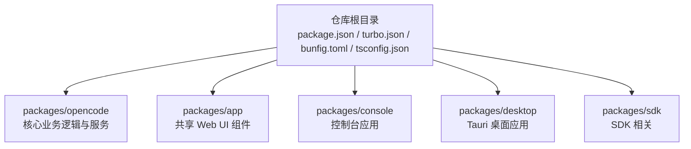
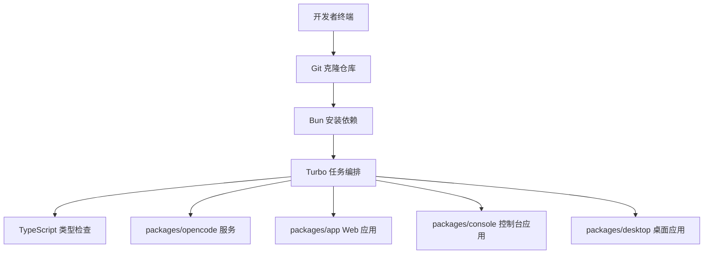
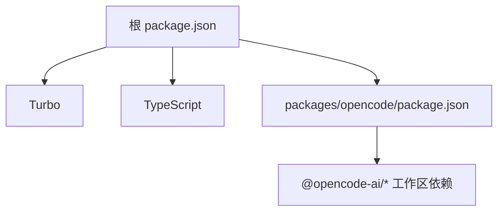

# 本地开发环境

<cite>
**本文引用的文件**
- [README.md](file://README.md)
- [CONTRIBUTING.md](file://CONTRIBUTING.md)
- [package.json](file://package.json)
- [turbo.json](file://turbo.json)
- [bunfig.toml](file://bunfig.toml)
- [tsconfig.json](file://tsconfig.json)
- [flake.nix](file://flake.nix)
- [nix/opencode.nix](file://nix/opencode.nix)
- [packages/opencode/package.json](file://packages/opencode/package.json)
</cite>

## 目录
1. [简介](#简介)
2. [项目结构](#项目结构)
3. [核心组件](#核心组件)
4. [架构总览](#架构总览)
5. [详细组件分析](#详细组件分析)
6. [依赖分析](#依赖分析)
7. [性能考虑](#性能考虑)
8. [故障排查指南](#故障排查指南)
9. [结论](#结论)
10. [附录](#附录)

## 简介
本文件面向首次参与 OpenCode 开发的贡献者，提供从零开始搭建本地开发环境的完整指南。内容覆盖前置依赖（Node.js、Bun、Git）、项目克隆与工作区初始化、monorepo 工作流与 Turbo 构建系统、TypeScript 类型检查、热重载与多端开发（Web、桌面、控制台）以及 VS Code 调试配置与常见问题处理。目标是帮助你在最短时间内完成环境准备并顺利运行项目。

## 项目结构
OpenCode 采用 monorepo 结构组织，根目录通过包管理器与构建工具统一管理多个子包。核心开发入口位于根脚本与工作区配置中，同时提供 Nix 开发壳以简化依赖与工具链准备。

图表来源
- [package.json:20-27](file://package.json#L20-L27)
- [package.json:28-75](file://package.json#L28-L75)

章节来源
- [package.json:20-27](file://package.json#L20-L27)
- [package.json:28-75](file://package.json#L28-L75)

## 核心组件
- 包管理与工作区：根 package.json 定义了工作区范围与 catalog 依赖版本，确保各子包依赖一致性。
- 构建与缓存：Turbo 作为构建编排器，定义任务依赖与输出目录，提升增量构建效率。
- TypeScript 配置：基于 @tsconfig/bun 的 tsconfig.json，统一类型检查与编译选项。
- 运行时与调试：Bun 提供快速运行与热重载；Nix 提供可复现的开发环境与二进制打包。

章节来源
- [package.json:20-27](file://package.json#L20-L27)
- [package.json:28-75](file://package.json#L28-L75)
- [turbo.json:5-30](file://turbo.json#L5-L30)
- [tsconfig.json:1-6](file://tsconfig.json#L1-L6)
- [bunfig.toml:1-7](file://bunfig.toml#L1-L7)

## 架构总览
下图展示了本地开发的关键流程：从克隆仓库到启动不同子系统的开发服务器，并通过 Turbo 实现类型检查与增量构建。

图表来源
- [package.json:8-19](file://package.json#L8-L19)
- [turbo.json:5-30](file://turbo.json#L5-L30)
- [CONTRIBUTING.md:34-40](file://CONTRIBUTING.md#L34-L40)

章节来源
- [package.json:8-19](file://package.json#L8-L19)
- [turbo.json:5-30](file://turbo.json#L5-L30)
- [CONTRIBUTING.md:34-40](file://CONTRIBUTING.md#L34-L40)

## 详细组件分析

### 前置要求与安装
- Node.js：用于生成补全与部分构建步骤，推荐使用稳定版。
- Bun：项目首选运行时，版本由根 package.json 的 packageManager 字段声明。
- Git：用于克隆与分支管理。
- 可选：Nix（flake.nix）可提供可复现的开发环境与二进制打包。

章节来源
- [package.json:7](file://package.json#L7)
- [flake.nix:23-29](file://flake.nix#L23-L29)

### 项目克隆与初始化
- 克隆仓库后，在根目录执行依赖安装，随后即可使用开发脚本启动不同子系统。
- 根脚本提供了多种开发模式：核心服务、Web 应用、控制台、Storybook、桌面应用等。

章节来源
- [CONTRIBUTING.md:34-40](file://CONTRIBUTING.md#L34-L40)
- [package.json:8-19](file://package.json#L8-L19)

### monorepo 工作区与依赖管理
- 工作区范围在根 package.json 的 workspaces 字段中定义，覆盖多个子包与 catalog 依赖版本。
- catalog 机制统一管理大量依赖版本，避免重复与冲突。
- 依赖安装后，可通过 Turbo 并行或串行执行任务，如类型检查、测试、构建等。

章节来源
- [package.json:20-27](file://package.json#L20-L27)
- [package.json:28-75](file://package.json#L28-L75)
- [turbo.json:5-30](file://turbo.json#L5-L30)

### Turbo 构建系统与任务
- Turbo 任务定义了类型检查、构建、测试等任务及其依赖关系与输出目录。
- 通过任务命名空间区分不同包的任务（例如 opencode#test），便于精细化控制。

章节来源
- [turbo.json:5-30](file://turbo.json#L5-L30)

### TypeScript 编译与类型检查
- tsconfig.json 继承 @tsconfig/bun 的默认配置，确保与 Bun 运行时兼容。
- 在根目录执行类型检查任务，或在子包内按需进行类型验证。

章节来源
- [tsconfig.json:1-6](file://tsconfig.json#L1-L6)
- [package.json:14](file://package.json#L14)

### 热重载与开发服务器
- 核心服务：支持以浏览器条件运行，便于前端集成与热重载。
- Web 应用：独立的开发服务器，端口由子包配置决定。
- 控制台应用：提供高并发文件描述符限制的启动方式，避免资源不足导致的崩溃。
- 桌面应用：Tauri 开发模式，自动启动 Web 开发服务器并在原生窗口中打开。

章节来源
- [package.json:9-13](file://package.json#L9-L13)
- [package.json:11](file://package.json#L11)
- [package.json:12](file://package.json#L12)
- [CONTRIBUTING.md:124-141](file://CONTRIBUTING.md#L124-L141)

### VS Code 调试配置与断点设置
- 推荐使用 Bun 的调试模式，通过指定 inspect 地址连接调试器。
- 若需要在 TUI 中触发断点，可尝试以分离进程的方式启动服务与前端。
- 可导出 BUN_OPTIONS 环境变量以简化每次调试的参数输入。

章节来源
- [CONTRIBUTING.md:158-178](file://CONTRIBUTING.md#L158-L178)

### 常用开发命令
- 启动核心服务：在根目录执行相应脚本，进入交互式 CLI 或启动 API 服务。
- 启动 Web 应用：先启动核心服务，再启动 Web 应用开发服务器。
- 启动控制台应用：根据需要调整文件描述符上限。
- 启动桌面应用：使用 Tauri 开发模式，自动打开原生窗口。
- 类型检查：通过 Turbo 执行类型检查任务。
- 生成 SDK：当 API 或 SDK 发生变更时，运行生成脚本更新 SDK。

章节来源
- [package.json:8-19](file://package.json#L8-L19)
- [CONTRIBUTING.md:97-123](file://CONTRIBUTING.md#L97-L123)
- [CONTRIBUTING.md:142-154](file://CONTRIBUTING.md#L142-L154)

### Nix 开发壳与二进制打包
- flake.nix 提供 devShells，默认包含 bun、nodejs、pkg-config、openssl、git 等开发必需工具。
- nix/opencode.nix 将 node_modules 复制到构建产物中，生成可执行二进制与补全脚本，并设置运行时环境变量。

章节来源
- [flake.nix:21-31](file://flake.nix#L21-L31)
- [nix/opencode.nix:16-53](file://nix/opencode.nix#L16-L53)
- [nix/opencode.nix:55-80](file://nix/opencode.nix#L55-L80)

## 依赖分析
下图展示根级依赖与任务之间的耦合关系，强调类型检查与构建任务的前置依赖。

图表来源
- [package.json:20-27](file://package.json#L20-L27)
- [package.json:28-75](file://package.json#L28-L75)
- [packages/opencode/package.json:42-106](file://packages/opencode/package.json#L42-L106)

章节来源
- [package.json:20-27](file://package.json#L20-L27)
- [package.json:28-75](file://package.json#L28-L75)
- [packages/opencode/package.json:42-106](file://packages/opencode/package.json#L42-L106)

## 性能考虑
- 使用 Turbo 进行增量构建与并行任务调度，减少重复计算。
- 在控制台应用启动前适当提高文件描述符上限，避免高并发场景下的资源限制。
- 利用 Bun 的热重载能力，缩短迭代周期；必要时启用调试等待模式以稳定断点命中。
- 对大型 monorepo，合理拆分任务边界，避免不必要的全局重建。

## 故障排查指南
- 无法启动桌面应用：确认已满足 Tauri 前置依赖（Rust 工具链与平台库）。
- 断点不生效：优先使用 Bun 的调试模式并通过指定的 inspect 地址连接；若仍失败，尝试分离启动服务与前端。
- 端口冲突：为不同子系统选择独立端口，或在启动参数中显式指定端口。
- 类型检查失败：先在根目录执行类型检查任务，定位问题后再逐包修复。
- Nix 打包异常：检查哈希与平台兼容性，必要时使用更新派生以暴露正确哈希。

章节来源
- [CONTRIBUTING.md:150-151](file://CONTRIBUTING.md#L150-L151)
- [CONTRIBUTING.md:162-172](file://CONTRIBUTING.md#L162-L172)
- [nix/opencode.nix:82-89](file://nix/opencode.nix#L82-L89)

## 结论
通过以上步骤，你可以在本地快速搭建 OpenCode 的开发环境，并利用 Bun、Turbo、TypeScript 与 Nix 等工具实现高效开发与构建。遇到问题时，优先参考本文的故障排查章节与贡献指南中的调试建议，以最小成本恢复开发效率。

## 附录
- 快速命令清单
  - 安装依赖：在根目录执行依赖安装命令。
  - 启动核心服务：在根目录执行核心服务脚本。
  - 启动 Web 应用：先启动核心服务，再启动 Web 应用开发服务器。
  - 启动控制台应用：根据需要调整文件描述符上限后启动。
  - 启动桌面应用：使用 Tauri 开发模式。
  - 类型检查：通过 Turbo 执行类型检查任务。
  - 生成 SDK：当 API 或 SDK 发生变更时运行生成脚本。

章节来源
- [package.json:8-19](file://package.json#L8-L19)
- [CONTRIBUTING.md:97-123](file://CONTRIBUTING.md#L97-L123)
- [CONTRIBUTING.md:142-154](file://CONTRIBUTING.md#L142-L154)