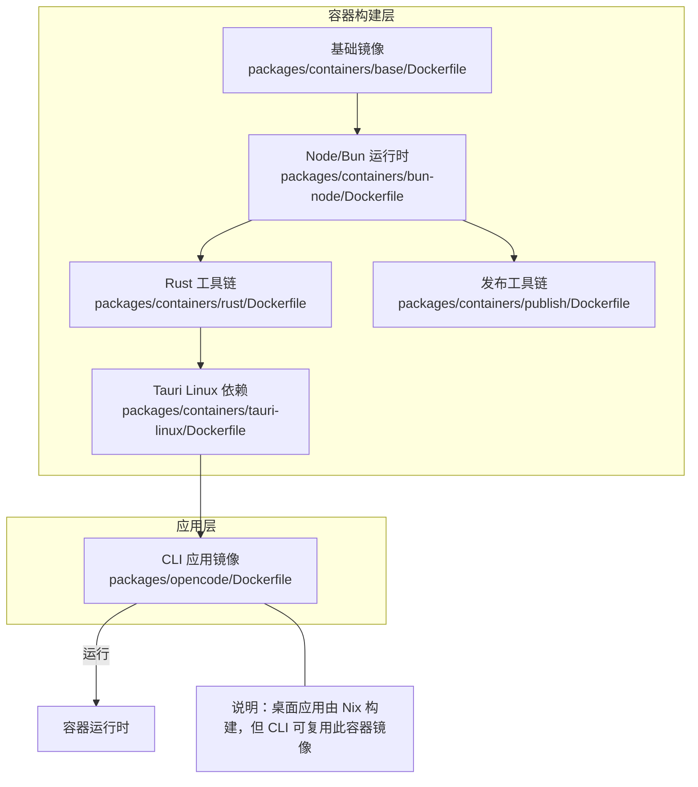
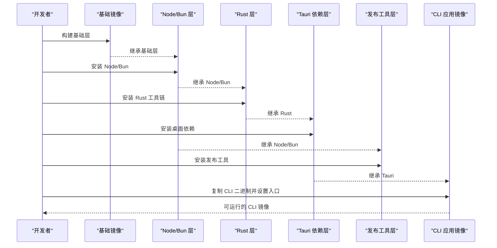
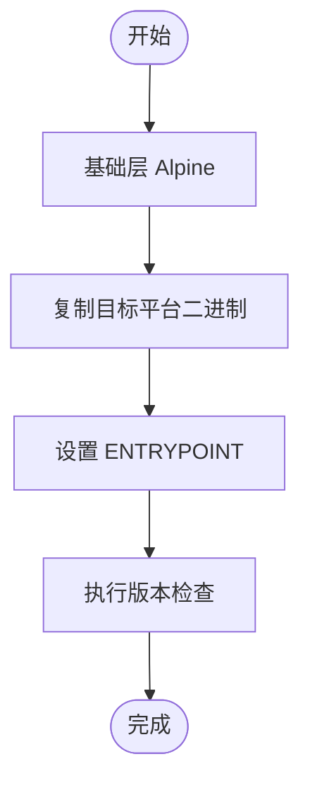
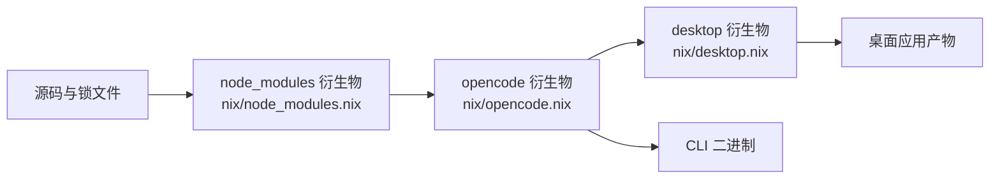
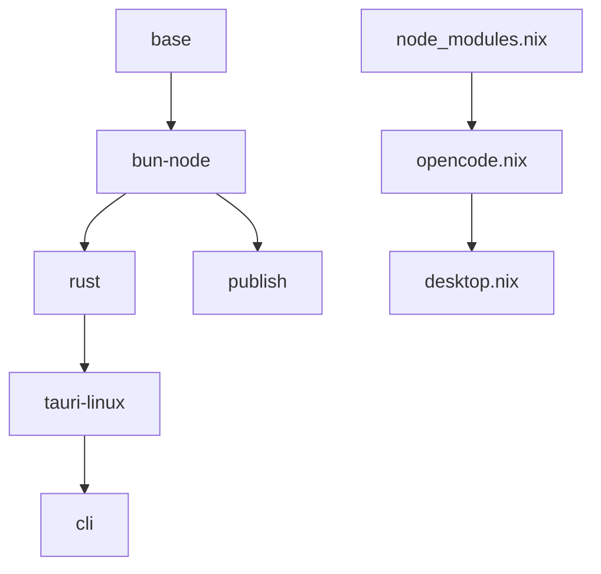

# Docker 容器化部署

<cite>
**本文引用的文件**
- [flake.nix](file://flake.nix)
- [flake.lock](file://flake.lock)
- [nix/opencode.nix](file://nix/opencode.nix)
- [nix/desktop.nix](file://nix/desktop.nix)
- [nix/node_modules.nix](file://nix/node_modules.nix)
- [packages/containers/base/Dockerfile](file://packages/containers/base/Dockerfile)
- [packages/containers/bun-node/Dockerfile](file://packages/containers/bun-node/Dockerfile)
- [packages/containers/publish/Dockerfile](file://packages/containers/publish/Dockerfile)
- [packages/containers/rust/Dockerfile](file://packages/containers/rust/Dockerfile)
- [packages/containers/tauri-linux/Dockerfile](file://packages/containers/tauri-linux/Dockerfile)
- [packages/opencode/Dockerfile](file://packages/opencode/Dockerfile)
- [package.json](file://package.json)
- [turbo.json](file://turbo.json)
</cite>

## 目录
1. [简介](#简介)
2. [项目结构](#项目结构)
3. [核心组件](#核心组件)
4. [架构总览](#架构总览)
5. [详细组件分析](#详细组件分析)
6. [依赖分析](#依赖分析)
7. [性能考虑](#性能考虑)
8. [故障排查指南](#故障排查指南)
9. [结论](#结论)
10. [附录](#附录)

## 简介
本指南面向 OpenCode 的容器化部署，聚焦三大应用的 Dockerfile 配置与多阶段构建策略：CLI 应用、Web 应用与桌面应用（基于 Tauri）。文档涵盖基础镜像选择、依赖管理、容器运行参数、端口映射与卷挂载建议、Nix 在容器中的应用方式、Compose 编排与 Kubernetes 部署思路、安全最佳实践、性能优化与监控配置，并提供可直接参考的构建与部署命令路径。

## 项目结构
OpenCode 仓库采用 Monorepo 结构，容器相关配置集中在 packages/containers 下，分别定义了通用基础层、Node/Bun 运行环境、发布工具链、Rust 构建环境以及 Linux 桌面打包依赖。CLI 应用的最终运行镜像位于 packages/opencode/Dockerfile；桌面应用由 Nix 衍生物驱动构建，但其依赖的 CLI 可通过容器镜像复用。

图表来源
- [packages/containers/base/Dockerfile:1-19](file://packages/containers/base/Dockerfile#L1-L19)
- [packages/containers/bun-node/Dockerfile:1-25](file://packages/containers/bun-node/Dockerfile#L1-L25)
- [packages/containers/rust/Dockerfile:1-14](file://packages/containers/rust/Dockerfile#L1-L14)
- [packages/containers/tauri-linux/Dockerfile:1-13](file://packages/containers/tauri-linux/Dockerfile#L1-L13)
- [packages/containers/publish/Dockerfile:1-11](file://packages/containers/publish/Dockerfile#L1-L11)
- [packages/opencode/Dockerfile:1-19](file://packages/opencode/Dockerfile#L1-L19)

章节来源
- [packages/containers/base/Dockerfile:1-19](file://packages/containers/base/Dockerfile#L1-L19)
- [packages/containers/bun-node/Dockerfile:1-25](file://packages/containers/bun-node/Dockerfile#L1-L25)
- [packages/containers/rust/Dockerfile:1-14](file://packages/containers/rust/Dockerfile#L1-L14)
- [packages/containers/tauri-linux/Dockerfile:1-13](file://packages/containers/tauri-linux/Dockerfile#L1-L13)
- [packages/containers/publish/Dockerfile:1-11](file://packages/containers/publish/Dockerfile#L1-L11)
- [packages/opencode/Dockerfile:1-19](file://packages/opencode/Dockerfile#L1-L19)

## 核心组件
- 基础镜像层（Ubuntu）：提供系统工具链与常用二进制，作为后续构建层的基础。
- Node/Bun 运行时层：安装 Node.js 与 Bun，启用 Corepack，为 JS/TS 构建与脚本执行提供环境。
- Rust 工具链层：安装 Rustup 与 Cargo，支持 Rust 包与 Tauri 桌面应用构建。
- Tauri Linux 依赖层：安装桌面应用所需的 GTK/Webkit 等系统库。
- 发布工具链层：安装 Docker 与包管理器等发布所需工具。
- CLI 应用镜像（Alpine 多架构）：基于 musl 的精简运行时，按 TARGETARCH 选择二进制，禁用运行时转译缓存以适配临时容器。

章节来源
- [packages/containers/base/Dockerfile:1-19](file://packages/containers/base/Dockerfile#L1-L19)
- [packages/containers/bun-node/Dockerfile:1-25](file://packages/containers/bun-node/Dockerfile#L1-L25)
- [packages/containers/rust/Dockerfile:1-14](file://packages/containers/rust/Dockerfile#L1-L14)
- [packages/containers/tauri-linux/Dockerfile:1-13](file://packages/containers/tauri-linux/Dockerfile#L1-L13)
- [packages/containers/publish/Dockerfile:1-11](file://packages/containers/publish/Dockerfile#L1-L11)
- [packages/opencode/Dockerfile:1-19](file://packages/opencode/Dockerfile#L1-L19)

## 架构总览
下图展示从基础到应用的多阶段构建关系，以及 CLI 应用的运行入口。

图表来源
- [packages/containers/base/Dockerfile:1-19](file://packages/containers/base/Dockerfile#L1-L19)
- [packages/containers/bun-node/Dockerfile:1-25](file://packages/containers/bun-node/Dockerfile#L1-L25)
- [packages/containers/rust/Dockerfile:1-14](file://packages/containers/rust/Dockerfile#L1-L14)
- [packages/containers/tauri-linux/Dockerfile:1-13](file://packages/containers/tauri-linux/Dockerfile#L1-L13)
- [packages/containers/publish/Dockerfile:1-11](file://packages/containers/publish/Dockerfile#L1-L11)
- [packages/opencode/Dockerfile:1-19](file://packages/opencode/Dockerfile#L1-L19)

## 详细组件分析

### CLI 应用镜像（Alpine 多架构）
- 多阶段与多架构：使用 Alpine 作为基础，按 TARGETARCH 选择对应二进制，避免重复构建。
- 运行时优化：禁用运行时转译缓存，适合临时容器。
- 入口与校验：设置 ENTRYPOINT 为 CLI 可执行文件，并在镜像末尾执行版本检查。

图表来源
- [packages/opencode/Dockerfile:1-19](file://packages/opencode/Dockerfile#L1-L19)

章节来源
- [packages/opencode/Dockerfile:1-19](file://packages/opencode/Dockerfile#L1-L19)

### Node/Bun 运行时层
- 环境变量：设置 Bun 安装路径与 PATH，确保 bun 与 node 命令可用。
- 平台适配：根据 CPU 架构选择 Node.js 二进制，启用 Corepack。
- 版本验证：安装后打印版本信息，便于镜像一致性核验。

章节来源
- [packages/containers/bun-node/Dockerfile:1-25](file://packages/containers/bun-node/Dockerfile#L1-L25)

### Rust 工具链层
- 工具链安装：通过 rustup 安装指定稳定工具链。
- 环境变量：设置 Cargo 与 rustup 的本地目录，统一 PATH。
- 版本验证：安装后打印 rustc 与 cargo 版本。

章节来源
- [packages/containers/rust/Dockerfile:1-14](file://packages/containers/rust/Dockerfile#L1-L14)

### Tauri Linux 依赖层
- 系统库：安装桌面应用运行所需的 GTK、Webkit、SVG、指示器等开发包。
- 用途：为桌面应用打包提供必要的系统依赖。

章节来源
- [packages/containers/tauri-linux/Dockerfile:1-13](file://packages/containers/tauri-linux/Dockerfile#L1-L13)

### 发布工具链层
- Docker 与包管理器：安装 docker.io 与 pacman 包管理器，满足发布流程需求。
- 适用场景：CI/CD 或本地发布环境。

章节来源
- [packages/containers/publish/Dockerfile:1-11](file://packages/containers/publish/Dockerfile#L1-L11)

### 基础镜像层（Ubuntu）
- 工具集：安装构建工具、证书、curl、git、jq、pkg-config、python3、unzip、xz-utils、zip 等。
- 清理缓存：卸载 apt 缓存以减小镜像体积。

章节来源
- [packages/containers/base/Dockerfile:1-19](file://packages/containers/base/Dockerfile#L1-L19)

### Nix 在容器中的应用
- Nix 目标：通过 flake 与 nix/*.nix 文件构建 CLI 与桌面应用，确保依赖可复现与可升级。
- 关键构件：
  - node_modules 衍生物：在受控源码集合上执行 bun install，生成可复现的 node_modules。
  - opencode 衍生物：在 node_modules 基础上构建 CLI 二进制，注入补丁与模型数据路径。
  - desktop 衍生物：在 opencode 基础上构建 Tauri 桌面应用，包含 Linux 打包依赖与 sidecar。
- 与容器的关系：Nix 产物可作为构建输入或直接产出二进制供 CLI 镜像使用；桌面应用可由 Nix 构建，但 CLI 运行镜像仍可复用上述 Alpine 镜像。

图表来源
- [flake.nix:33-51](file://flake.nix#L33-L51)
- [nix/node_modules.nix:1-86](file://nix/node_modules.nix#L1-L86)
- [nix/opencode.nix:1-102](file://nix/opencode.nix#L1-L102)
- [nix/desktop.nix:1-101](file://nix/desktop.nix#L1-L101)

章节来源
- [flake.nix:1-77](file://flake.nix#L1-L77)
- [flake.lock:1-28](file://flake.lock#L1-L28)
- [nix/node_modules.nix:1-86](file://nix/node_modules.nix#L1-L86)
- [nix/opencode.nix:1-102](file://nix/opencode.nix#L1-L102)
- [nix/desktop.nix:1-101](file://nix/desktop.nix#L1-L101)

## 依赖分析
- 容器依赖链：base → bun-node → rust → tauri-linux；bun-node → publish；tauri-linux → cli。
- Nix 依赖链：node_modules → opencode → desktop。
- Monorepo 与工作区：package.json 定义了工作区与依赖，turbo.json 规范了任务与输出，确保构建一致性。

图表来源
- [packages/containers/base/Dockerfile:1-19](file://packages/containers/base/Dockerfile#L1-L19)
- [packages/containers/bun-node/Dockerfile:1-25](file://packages/containers/bun-node/Dockerfile#L1-L25)
- [packages/containers/rust/Dockerfile:1-14](file://packages/containers/rust/Dockerfile#L1-L14)
- [packages/containers/tauri-linux/Dockerfile:1-13](file://packages/containers/tauri-linux/Dockerfile#L1-L13)
- [packages/containers/publish/Dockerfile:1-11](file://packages/containers/publish/Dockerfile#L1-L11)
- [packages/opencode/Dockerfile:1-19](file://packages/opencode/Dockerfile#L1-L19)
- [nix/node_modules.nix:1-86](file://nix/node_modules.nix#L1-L86)
- [nix/opencode.nix:1-102](file://nix/opencode.nix#L1-L102)
- [nix/desktop.nix:1-101](file://nix/desktop.nix#L1-L101)

章节来源
- [package.json:1-124](file://package.json#L1-L124)
- [turbo.json:1-32](file://turbo.json#L1-L32)

## 性能考虑
- 多阶段与分层缓存：利用 Docker 分层缓存减少重复安装；基础层固定不变，上层增量更新。
- 最小化依赖：仅安装必要工具与库，避免冗余包。
- 多架构镜像：按 TARGETARCH 选择二进制，避免交叉编译成本。
- 运行时优化：禁用运行时转译缓存，降低容器启动开销。
- Nix 可复现性：通过锁定哈希与受控源码集合，提升构建稳定性与可重复性。

## 故障排查指南
- Node/Bun 版本不一致：确认安装后版本打印与期望一致。
- Rust 工具链缺失：检查 rustup 初始化与 PATH 设置。
- 桌面依赖缺失：确认已安装 GTK/Webkit 等系统库。
- CLI 无法执行：检查 ENTRYPOINT 与二进制复制路径。
- Nix 构建失败：核对 node_modules 衍生物的哈希与源码集合是否匹配。

章节来源
- [packages/containers/bun-node/Dockerfile:1-25](file://packages/containers/bun-node/Dockerfile#L1-L25)
- [packages/containers/rust/Dockerfile:1-14](file://packages/containers/rust/Dockerfile#L1-L14)
- [packages/containers/tauri-linux/Dockerfile:1-13](file://packages/containers/tauri-linux/Dockerfile#L1-L13)
- [packages/opencode/Dockerfile:1-19](file://packages/opencode/Dockerfile#L1-L19)
- [nix/node_modules.nix:1-86](file://nix/node_modules.nix#L1-L86)

## 结论
OpenCode 的容器化方案以多阶段构建为核心，结合 Nix 的可复现性与多架构支持，实现了 CLI、Web 与桌面应用的高效交付。通过最小化依赖与分层缓存，既保证了构建速度，也提升了运行时性能。建议在生产环境中配合安全基线与资源限制，持续集成中使用多架构镜像与可复现的 Nix 构建产物。

## 附录

### 容器运行时配置与最佳实践
- 用户与权限：以非 root 用户运行，限制权限与写入能力。
- 资源限制：设置 CPU/内存限额，避免资源争用。
- 网络与端口：仅暴露必要端口；CLI 应用通常无需端口映射。
- 卷挂载：挂载日志、配置与缓存目录，持久化重要数据。
- 健康检查：为 Web/服务类容器添加健康检查探针。
- 日志与审计：集中收集容器日志，开启审计与合规扫描。

### Docker Compose 编排与 Kubernetes 部署思路
- Compose：定义服务、网络、卷与环境变量；为 CLI/Web/桌面应用分别配置独立服务与资源限制。
- Kubernetes：使用 Deployment/StatefulSet 管理副本与状态；ConfigMap/Secret 管理配置与密钥；Service/PodDisruptionBudget 保障可用性；HPA 根据指标自动扩缩容。

### 实际构建与部署示例（命令路径）
- 构建基础层镜像
  - [packages/containers/base/Dockerfile:1-19](file://packages/containers/base/Dockerfile#L1-L19)
- 构建 Node/Bun 运行时镜像
  - [packages/containers/bun-node/Dockerfile:1-25](file://packages/containers/bun-node/Dockerfile#L1-L25)
- 构建 Rust 工具链镜像
  - [packages/containers/rust/Dockerfile:1-14](file://packages/containers/rust/Dockerfile#L1-L14)
- 构建 Tauri Linux 依赖镜像
  - [packages/containers/tauri-linux/Dockerfile:1-13](file://packages/containers/tauri-linux/Dockerfile#L1-L13)
- 构建发布工具链镜像
  - [packages/containers/publish/Dockerfile:1-11](file://packages/containers/publish/Dockerfile#L1-L11)
- 构建 CLI 应用镜像
  - [packages/opencode/Dockerfile:1-19](file://packages/opencode/Dockerfile#L1-L19)
- 使用 Nix 构建 CLI 与桌面应用
  - [flake.nix:33-51](file://flake.nix#L33-L51)
  - [nix/node_modules.nix:1-86](file://nix/node_modules.nix#L1-L86)
  - [nix/opencode.nix:1-102](file://nix/opencode.nix#L1-L102)
  - [nix/desktop.nix:1-101](file://nix/desktop.nix#L1-L101)