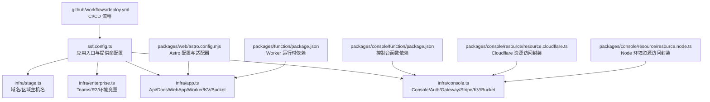
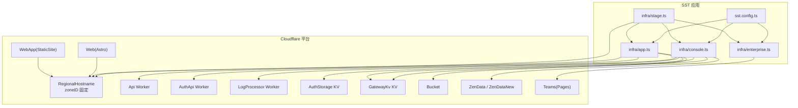
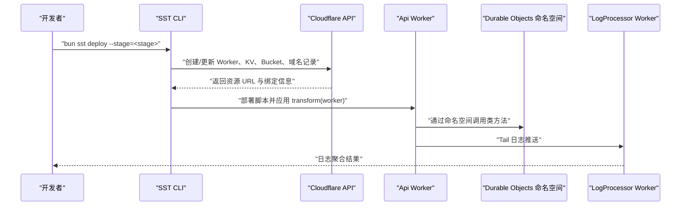
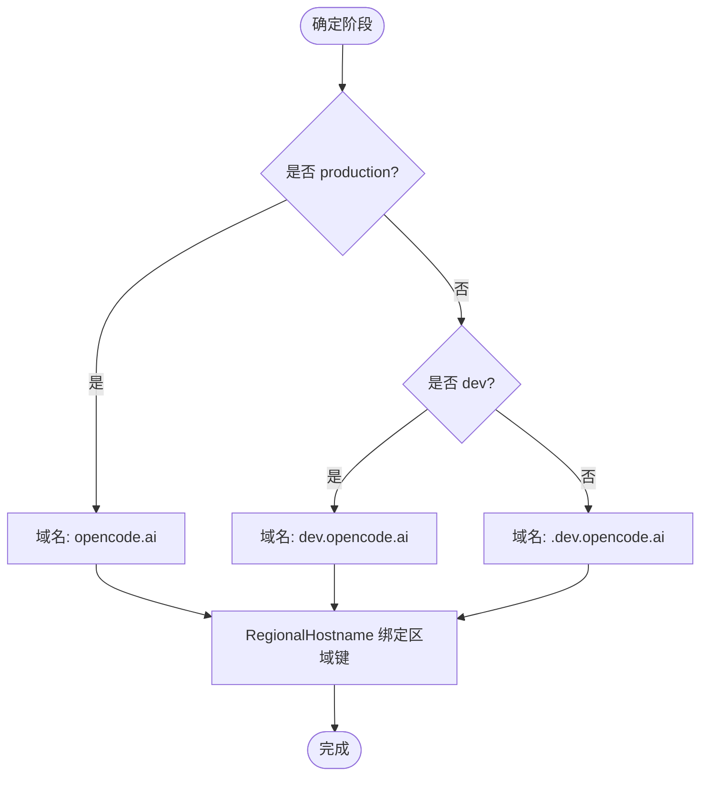
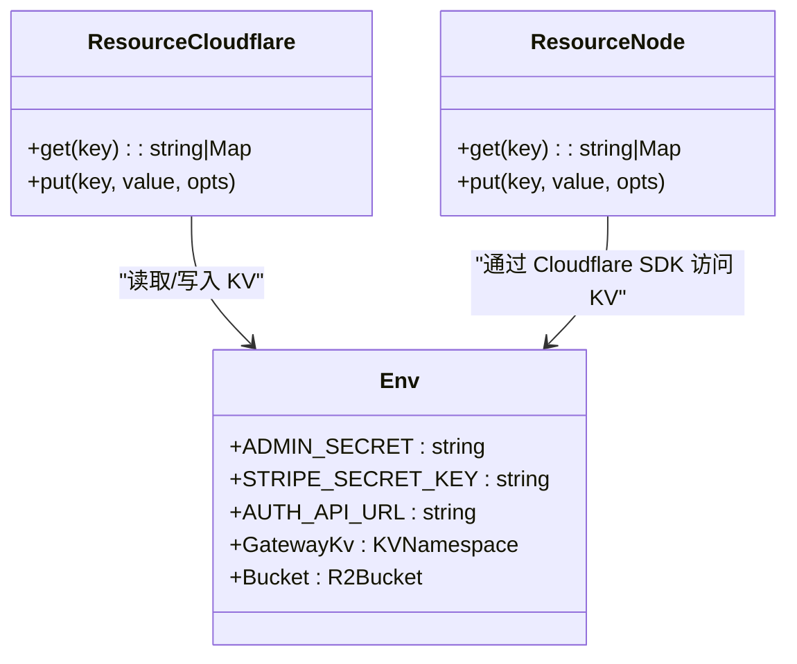
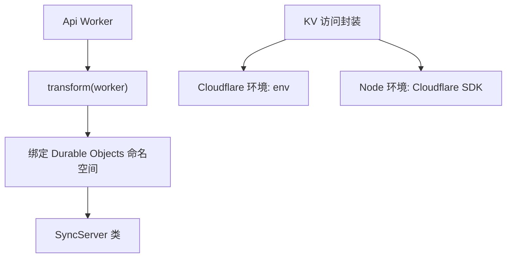
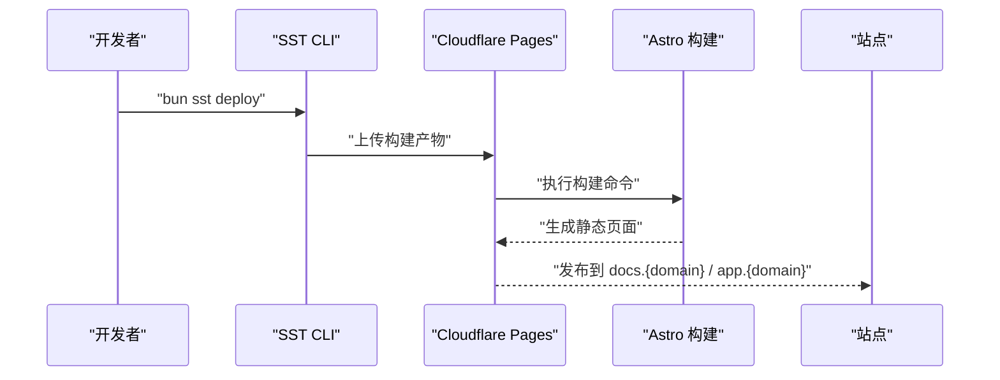
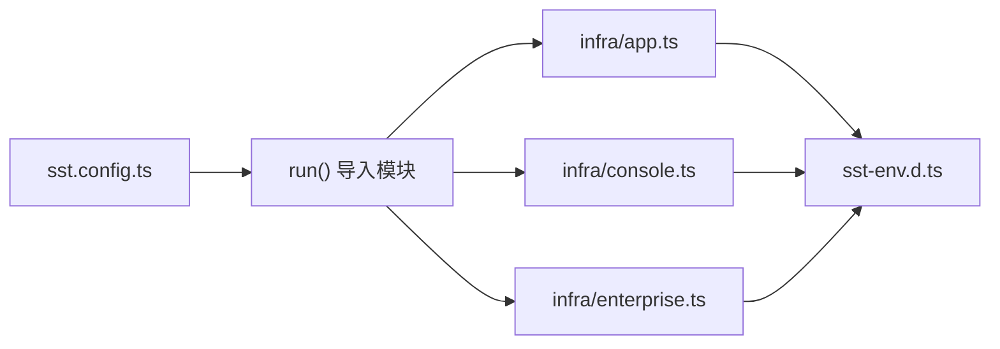

# 云原生部署

<cite>
**本文引用的文件**
- [sst.config.ts](file://sst.config.ts)
- [sst-env.d.ts](file://sst-env.d.ts)
- [infra/stage.ts](file://infra/stage.ts)
- [infra/app.ts](file://infra/app.ts)
- [infra/console.ts](file://infra/console.ts)
- [infra/enterprise.ts](file://infra/enterprise.ts)
- [infra/secret.ts](file://infra/secret.ts)
- [.github/workflows/deploy.yml](file://.github/workflows/deploy.yml)
- [packages/web/astro.config.mjs](file://packages/web/astro.config.mjs)
- [packages/function/package.json](file://packages/function/package.json)
- [packages/console/function/package.json](file://packages/console/function/package.json)
- [packages/console/resource/resource.cloudflare.ts](file://packages/console/resource/resource.cloudflare.ts)
- [packages/console/resource/resource.node.ts](file://packages/console/resource/resource.node.ts)
</cite>

## 目录
1. [简介](#简介)
2. [项目结构](#项目结构)
3. [核心组件](#核心组件)
4. [架构总览](#架构总览)
5. [详细组件分析](#详细组件分析)
6. [依赖关系分析](#依赖关系分析)
7. [性能考量](#性能考量)
8. [故障排除指南](#故障排除指南)
9. [结论](#结论)
10. [附录](#附录)

## 简介
本指南面向在 Cloudflare 平台上进行云原生部署的工程师与运维人员，系统讲解基于 SST（Serverless Stack Toolkit）的部署架构与实践，覆盖以下主题：
- 基于 SST 的 Cloudflare Workers 部署：Worker 函数配置、域名绑定、环境变量与密钥注入、Durable Objects 绑定与迁移策略
- Cloudflare Pages 静态站点部署：Astro 框架集成、构建命令与输出目录、站点域名映射
- Cloudflare KV 存储与 R2 对象存储：命名空间与访问凭据、跨平台资源访问封装
- 多阶段环境配置：development、staging、production 的差异化行为
- 密钥管理、安全配置与监控设置
- 实际部署命令与常见问题排查

## 项目结构
该仓库采用 monorepo 结构，基础设施通过 SST 在根目录统一编排，前端与后端分别位于 packages 下的不同子包中。关键部署相关文件分布如下：
- 根级配置：SST 应用入口与类型声明
- 基础设施定义：按功能域拆分（应用、控制台、企业版）
- 工作流：GitHub Actions 自动化部署
- 前端框架：Astro + Cloudflare Pages 静态站点
- 后端运行时：Cloudflare Workers（Hono）

**图表来源**
- [sst.config.ts:1-24](file://sst.config.ts#L1-L24)
- [infra/app.ts:1-69](file://infra/app.ts#L1-L69)
- [infra/console.ts:1-260](file://infra/console.ts#L1-L260)
- [infra/enterprise.ts:1-18](file://infra/enterprise.ts#L1-L18)
- [infra/stage.ts:1-20](file://infra/stage.ts#L1-L20)
- [.github/workflows/deploy.yml:1-38](file://.github/workflows/deploy.yml#L1-L38)
- [packages/web/astro.config.mjs:1-78](file://packages/web/astro.config.mjs#L1-L78)
- [packages/function/package.json:1-21](file://packages/function/package.json#L1-L21)
- [packages/console/function/package.json:1-32](file://packages/console/function/package.json#L1-L32)
- [packages/console/resource/resource.cloudflare.ts:1-19](file://packages/console/resource/resource.cloudflare.ts#L1-L19)
- [packages/console/resource/resource.node.ts:1-44](file://packages/console/resource/resource.node.ts#L1-L44)

**章节来源**
- [sst.config.ts:1-24](file://sst.config.ts#L1-L24)
- [infra/stage.ts:1-20](file://infra/stage.ts#L1-L20)
- [infra/app.ts:1-69](file://infra/app.ts#L1-L69)
- [infra/console.ts:1-260](file://infra/console.ts#L1-L260)
- [infra/enterprise.ts:1-18](file://infra/enterprise.ts#L1-L18)
- [.github/workflows/deploy.yml:1-38](file://.github/workflows/deploy.yml#L1-L38)
- [packages/web/astro.config.mjs:1-78](file://packages/web/astro.config.mjs#L1-L78)
- [packages/function/package.json:1-21](file://packages/function/package.json#L1-L21)
- [packages/console/function/package.json:1-32](file://packages/console/function/package.json#L1-L32)
- [packages/console/resource/resource.cloudflare.ts:1-19](file://packages/console/resource/resource.cloudflare.ts#L1-L19)
- [packages/console/resource/resource.node.ts:1-44](file://packages/console/resource/resource.node.ts#L1-L44)

## 核心组件
- 应用层（Api/Docs/WebApp）
  - Api：Cloudflare Worker，承载业务接口，绑定 KV、对象存储与多平台认证密钥；启用 Logpush，并通过 Durable Objects 命名空间实现状态化服务
  - Docs：Astro 驱动的文档站点，部署为 Cloudflare Pages，域名 docs.{domain}
  - WebApp：静态站点（packages/app），通过 Cloudflare StaticSite 托管，构建命令与输出目录由基础设施定义
- 控制台层（Console/Auth/Gateway）
  - Console：SolidStart 应用，链接数据库、KV、邮件与支付等外部服务，配置日志处理链路
  - AuthApi：独立 Worker，负责认证与会话管理，使用 KV 存储会话数据
  - Gateway：Stripe Webhook 端点与价格模型配置，配合 KV 缓存网关状态
- 企业版（Teams）
  - Teams 应用通过 Cloudflare Pages 部署，使用 R2 作为存储适配器，通过环境变量注入 R2 凭据与桶名称
- 域名与区域
  - 基于阶段动态生成主域名与短域名，注册区域主机名以优化边缘路由

**章节来源**
- [infra/app.ts:13-69](file://infra/app.ts#L13-L69)
- [infra/console.ts:56-260](file://infra/console.ts#L56-L260)
- [infra/enterprise.ts:4-18](file://infra/enterprise.ts#L4-L18)
- [infra/stage.ts:1-20](file://infra/stage.ts#L1-L20)

## 架构总览
下图展示 SST 编排下的整体部署架构：基础设施定义、资源链接、域名与区域主机名、以及各应用与服务之间的依赖关系。

**图表来源**
- [sst.config.ts:1-24](file://sst.config.ts#L1-L24)
- [infra/stage.ts:9-13](file://infra/stage.ts#L9-L13)
- [infra/app.ts:13-69](file://infra/app.ts#L13-L69)
- [infra/console.ts:56-260](file://infra/console.ts#L56-L260)
- [infra/enterprise.ts:4-18](file://infra/enterprise.ts#L4-L18)

## 详细组件分析

### Worker 函数配置与 Durable Objects
- Api Worker
  - 域名绑定：api.{domain}
  - 环境变量：WEB_DOMAIN 注入站点域名
  - 链接资源：对象存储、多平台认证密钥、管理密钥、即时通讯密钥等
  - 安全与可观测性：启用 Logpush；通过 transform.worker 绑定 Durable Objects 命名空间 SYNC_SERVER；迁移标签按阶段配置
- AuthApi Worker
  - 域名绑定：auth.{domain}
  - 链接资源：数据库、KV（AuthStorage）、OAuth 客户端密钥、Google 客户端 ID
- 日志处理链路
  - LogProcessor Worker 通过 tailConsumers 接收 Console Worker 的 Tail 日志，便于集中观测

**图表来源**
- [infra/app.ts:13-49](file://infra/app.ts#L13-L49)
- [infra/console.ts:209-212](file://infra/console.ts#L209-L212)
- [infra/console.ts:249-258](file://infra/console.ts#L249-L258)

**章节来源**
- [infra/app.ts:13-49](file://infra/app.ts#L13-L49)
- [infra/console.ts:56-65](file://infra/console.ts#L56-L65)
- [infra/console.ts:209-212](file://infra/console.ts#L209-L212)
- [infra/console.ts:249-258](file://infra/console.ts#L249-L258)

### 域名绑定与区域主机名
- 动态域名
  - 生产：opencode.ai
  - 开发：dev.opencode.ai
  - 其他阶段：<stage>.dev.opocode.ai
- 区域主机名
  - 将域名绑定到指定区域键（如 us），提升边缘路由效率
- 短域名（企业版）
  - teams 站点使用短域名（如 opncd.ai），便于对外展示

**图表来源**
- [infra/stage.ts:1-5](file://infra/stage.ts#L1-L5)
- [infra/stage.ts:9-13](file://infra/stage.ts#L9-L13)

**章节来源**
- [infra/stage.ts:1-5](file://infra/stage.ts#L1-L5)
- [infra/stage.ts:9-13](file://infra/stage.ts#L9-L13)

### 环境变量与密钥管理
- 类型安全的资源声明
  - sst-env.d.ts 自动生成资源类型，确保在代码中以类型安全方式访问 Worker 环境变量与链接资源
- 常见密钥与资源
  - 认证与会话：ADMIN_SECRET、ZEN_SESSION_SECRET、GITHUB_*、FEISHU_*、DISCORD_*、GOOGLE_CLIENT_ID
  - 支付与订阅：STRIPE_*、ZEN_*_PRICE、STRIPE_WEBHOOK_SECRET
  - 邮件与营销：EMAILOCTOPUS_API_KEY、AWS_SES_*
  - 观测与日志：HONEYCOMB_API_KEY、LogProcessor
  - 存储与对象：AuthStorage、GatewayKv、Bucket、ZenData、ZenDataNew、EnterpriseStorage、R2AccessKey、R2SecretKey
- 使用方式
  - 在 Worker 中通过 env 访问；在控制台函数中通过 resource 封装访问 Cloudflare KV；在本地或 CI 中通过 SST 提供的 Secret 资源注入

**图表来源**
- [sst-env.d.ts:7-311](file://sst-env.d.ts#L7-L311)
- [packages/console/resource/resource.cloudflare.ts:1-19](file://packages/console/resource/resource.cloudflare.ts#L1-L19)
- [packages/console/resource/resource.node.ts:1-44](file://packages/console/resource/resource.node.ts#L1-L44)

**章节来源**
- [sst-env.d.ts:7-311](file://sst-env.d.ts#L7-L311)
- [packages/console/resource/resource.cloudflare.ts:1-19](file://packages/console/resource/resource.cloudflare.ts#L1-L19)
- [packages/console/resource/resource.node.ts:1-44](file://packages/console/resource/resource.node.ts#L1-L44)

### Cloudflare KV 与 Durable Objects
- KV 使用
  - AuthStorage：用于会话与临时数据
  - GatewayKv：用于网关状态缓存
  - 资源访问封装：Cloudflare 环境通过 env 直接访问；Node 环境通过 Cloudflare SDK 以 account_id 与 namespaceId 访问
- Durable Objects
  - Api Worker 通过 transform.worker 绑定 SYNC_SERVER 命名空间，支持状态化与长连接场景
  - 迁移标签按阶段配置，避免生产与非生产环境的迁移冲突

**图表来源**
- [infra/app.ts:30-48](file://infra/app.ts#L30-L48)
- [packages/console/resource/resource.cloudflare.ts:1-19](file://packages/console/resource/resource.cloudflare.ts#L1-L19)
- [packages/console/resource/resource.node.ts:1-44](file://packages/console/resource/resource.node.ts#L1-L44)

**章节来源**
- [infra/app.ts:30-48](file://infra/app.ts#L30-L48)
- [packages/console/resource/resource.cloudflare.ts:1-19](file://packages/console/resource/resource.cloudflare.ts#L1-L19)
- [packages/console/resource/resource.node.ts:1-44](file://packages/console/resource/resource.node.ts#L1-L44)

### Cloudflare Pages 静态站点与 Astro 集成
- 文档站点（Web/Astro）
  - 域名：docs.{domain}
  - 框架：Astro + Starlight
  - 适配器：Cloudflare Pages 输出模式
  - 环境变量：SST_STAGE、VITE_API_URL（指向 Api Worker）
- WebApp（StaticSite）
  - 域名：app.{domain}
  - 构建命令：bun turbo build
  - 输出目录：./dist
- 控制台（Console/SolidStart）
  - 域名：{domain}
  - 链接资源：数据库、KV、Stripe、邮件、销售系统等

**图表来源**
- [infra/app.ts:51-69](file://infra/app.ts#L51-L69)
- [packages/web/astro.config.mjs:13-29](file://packages/web/astro.config.mjs#L13-L29)

**章节来源**
- [infra/app.ts:51-69](file://infra/app.ts#L51-L69)
- [packages/web/astro.config.mjs:13-29](file://packages/web/astro.config.mjs#L13-L29)

### 多阶段环境配置（development、staging、production）
- 阶段选择与资源策略
  - production：保留删除保护、保留资源、PlanetScale 分支直连生产
  - 非生产：可移除资源、隔离分支与凭据
- 域名与区域主机名
  - 不同阶段使用不同主域名与短域名，确保流量隔离
- Stripe Webhook 与价格模型
  - 按阶段注入不同的 Stripe 秘钥与发布密钥，区分开发与生产回调地址
- R2 凭据
  - 企业版通过 Secret 注入 R2 访问凭据，确保不同阶段使用独立桶

**章节来源**
- [sst.config.ts:4-17](file://sst.config.ts#L4-L17)
- [infra/stage.ts:1-5](file://infra/stage.ts#L1-L5)
- [infra/console.ts:13-31](file://infra/console.ts#L13-L31)
- [.github/workflows/deploy.yml:33-38](file://.github/workflows/deploy.yml#L33-L38)
- [infra/enterprise.ts:10-17](file://infra/enterprise.ts#L10-L17)

### 安全配置与监控
- 安全
  - 使用 SST Secret 管理敏感信息，避免硬编码
  - 生产环境启用删除保护与只读策略
  - Worker 启用 Logpush，结合 Honeycomb 进行日志采集
- 监控
  - Console Worker 通过 tailConsumers 将 Tail 日志发送至 LogProcessor
  - 可扩展至自定义指标与告警（建议在现有 Honeycomb 集成基础上增加规则）

**章节来源**
- [sst.config.ts:7-8](file://sst.config.ts#L7-L8)
- [infra/console.ts:209-212](file://infra/console.ts#L209-L212)
- [infra/console.ts:249-258](file://infra/console.ts#L249-L258)

## 依赖关系分析
- SST 应用入口依赖基础设施模块，按阶段运行导入顺序加载
- 应用与控制台模块共享阶段域名与资源，形成清晰的边界
- 前端站点通过环境变量与 Worker URL 进行耦合，确保运行时一致性

**图表来源**
- [sst.config.ts:18-22](file://sst.config.ts#L18-L22)
- [sst-env.d.ts:1-315](file://sst-env.d.ts#L1-L315)

**章节来源**
- [sst.config.ts:18-22](file://sst.config.ts#L18-L22)
- [sst-env.d.ts:1-315](file://sst-env.d.ts#L1-L315)

## 性能考量
- 边缘路由优化：通过 RegionalHostname 将域名绑定到区域键，降低延迟
- Worker 与 KV：合理使用 KV 作为缓存层，减少数据库压力；对批量 KV 操作使用 bulkGet/bulkPut
- 构建与缓存：Astro Pages 与 StaticSite 构建命令应保持稳定，避免不必要的重构建
- Durable Objects：仅在需要状态化与实时性的场景使用，避免过度使用导致成本上升

## 故障排除指南
- 部署失败（Pulumi 版本冲突）
  - 现象：GitHub Runner 内置 Pulumi 与 SST 版本不兼容
  - 解决：移除系统语言插件以强制使用 SST 自带版本
  - 参考步骤：[deploy.yml:30-32](file://.github/workflows/deploy.yml#L30-L32)
- Worker 无法访问 KV 或环境变量
  - 检查资源是否正确 link 到 Worker，确认 sst-env.d.ts 是否同步
  - 参考资源声明：[sst-env.d.ts:7-311](file://sst-env.d.ts#L7-L311)
- Durable Objects 类未找到
  - 确认 transform(worker) 中已绑定命名空间，且类名一致
  - 参考绑定位置：[infra/app.ts:35-40](file://infra/app.ts#L35-L40)
- Stripe Webhook 回调异常
  - 核对阶段对应的密钥与回调地址，确保事件列表与签名一致
  - 参考定义：[infra/console.ts:71-101](file://infra/console.ts#L71-L101)
- Pages 构建失败
  - 确认构建命令与输出目录与基础设施定义一致
  - 参考定义：[infra/app.ts:64-67](file://infra/app.ts#L64-L67)，[packages/web/astro.config.mjs:17-19](file://packages/web/astro.config.mjs#L17-L19)
- R2 权限错误
  - 检查 R2AccessKey、R2SecretKey 是否注入，桶名与区域是否匹配
  - 参考注入位置：[infra/enterprise.ts:10-17](file://infra/enterprise.ts#L10-L17)，[infra/secret.ts:1-5](file://infra/secret.ts#L1-L5)

**章节来源**
- [.github/workflows/deploy.yml:30-32](file://.github/workflows/deploy.yml#L30-L32)
- [sst-env.d.ts:7-311](file://sst-env.d.ts#L7-L311)
- [infra/app.ts:35-40](file://infra/app.ts#L35-L40)
- [infra/console.ts:71-101](file://infra/console.ts#L71-L101)
- [infra/app.ts:64-67](file://infra/app.ts#L64-L67)
- [packages/web/astro.config.mjs:17-19](file://packages/web/astro.config.mjs#L17-L19)
- [infra/enterprise.ts:10-17](file://infra/enterprise.ts#L10-L17)
- [infra/secret.ts:1-5](file://infra/secret.ts#L1-L5)

## 结论
本指南基于 SST 的基础设施即代码能力，系统阐述了 OpenCode 在 Cloudflare 平台上的云原生部署方案。通过明确的阶段化配置、严格的密钥管理、可观测的日志链路以及 Astro + Pages 的静态站点集成，实现了高可用、可扩展且易于维护的交付体系。建议在后续迭代中持续完善监控告警与自动化测试，进一步提升稳定性与交付效率。

## 附录
- 实际部署命令
  - 开发/预发布：bun sst deploy --stage=dev
  - 生产：bun sst deploy --stage=production
  - 参考工作流：[deploy.yml:33-38](file://.github/workflows/deploy.yml#L33-L38)
- 关键文件路径
  - 应用 Worker：[infra/app.ts:13-49](file://infra/app.ts#L13-L49)
  - 控制台 Worker：[infra/console.ts:60-65](file://infra/console.ts#L60-L65)
  - 文档站点：[infra/app.ts:51-59](file://infra/app.ts#L51-L59)，[packages/web/astro.config.mjs:13-29](file://packages/web/astro.config.mjs#L13-L29)
  - 企业版站点：[infra/enterprise.ts:6-17](file://infra/enterprise.ts#L6-L17)
  - 资源类型声明：[sst-env.d.ts:7-311](file://sst-env.d.ts#L7-L311)