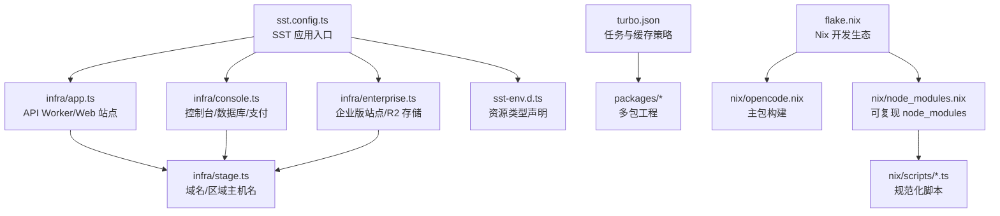
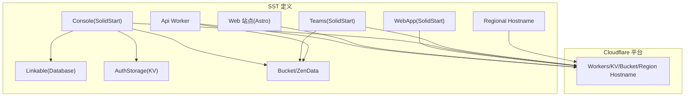
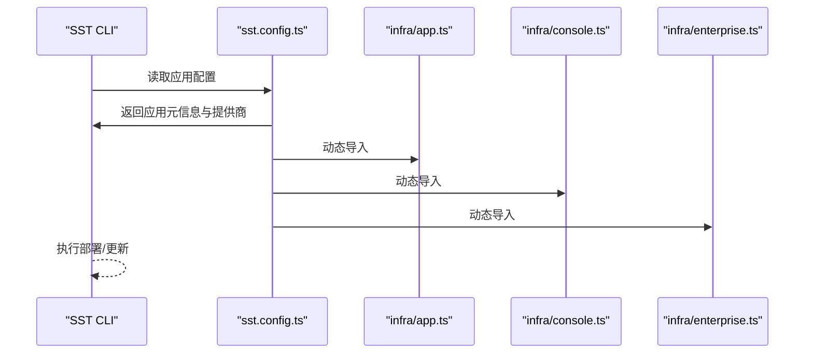
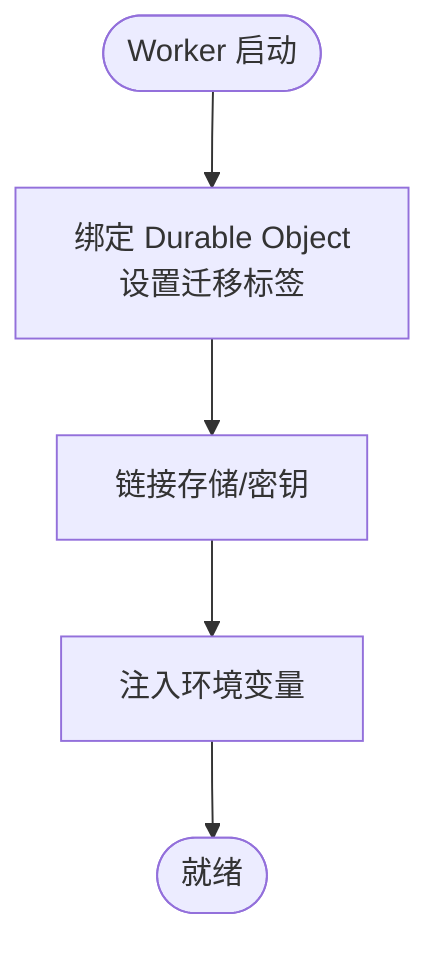
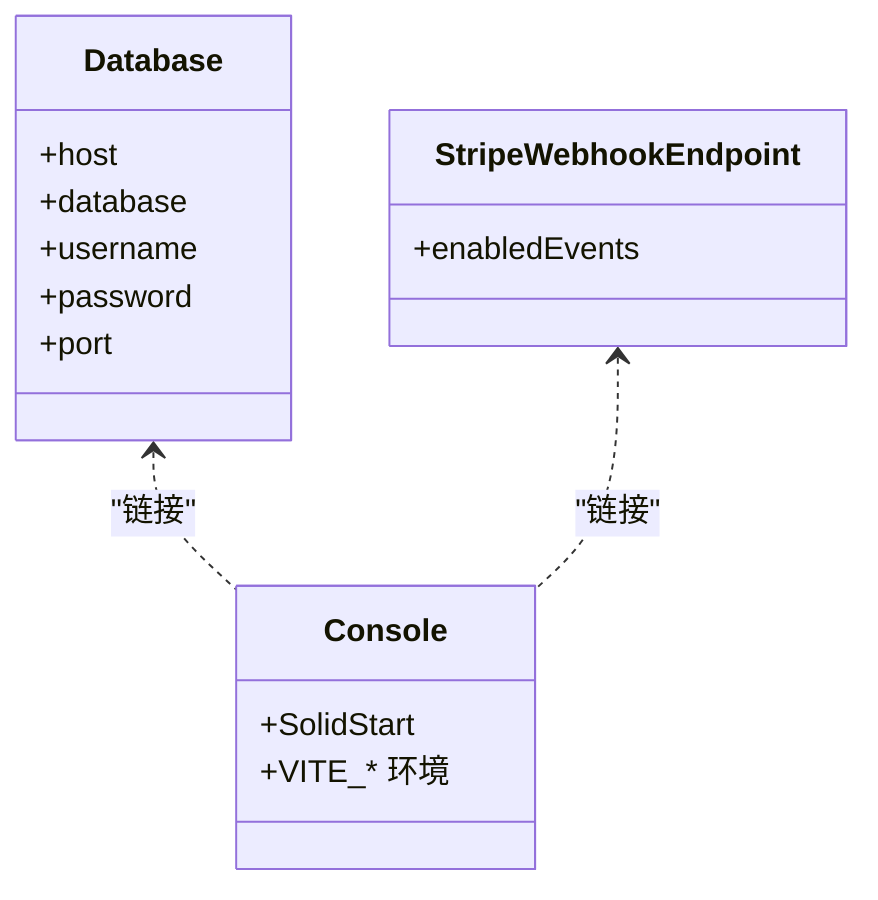
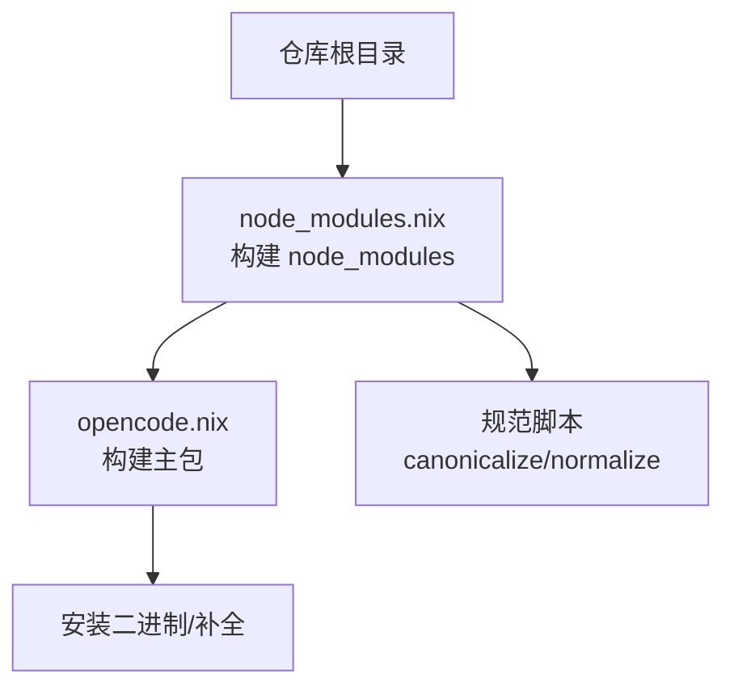
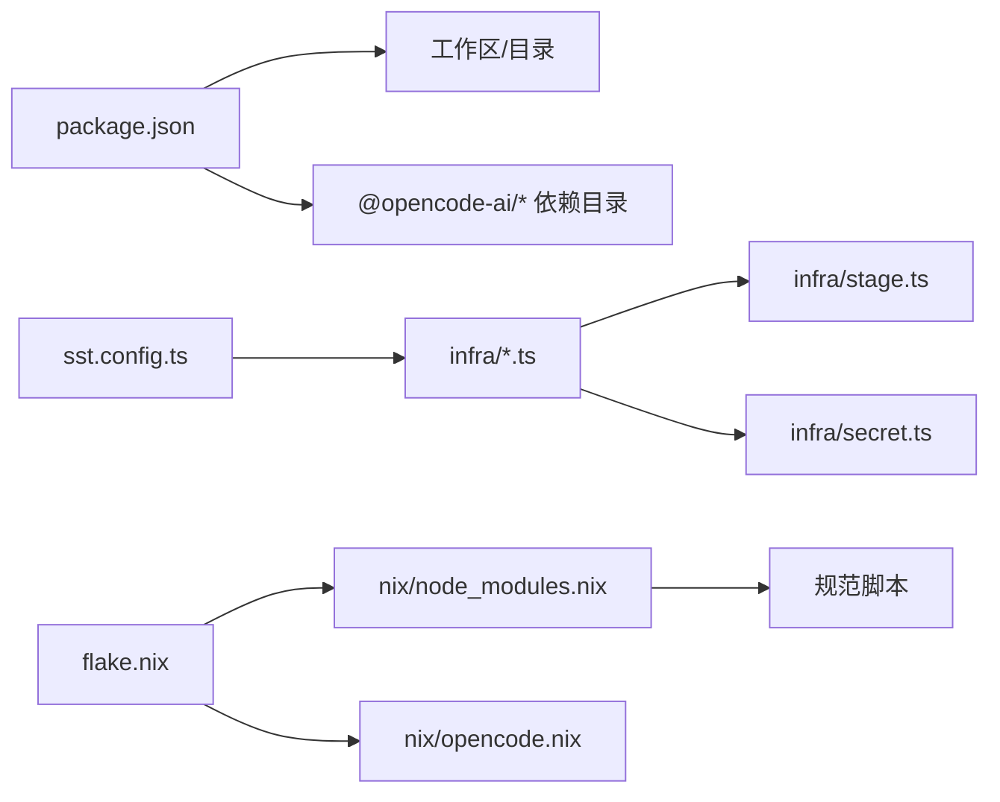

# 基础设施配置

<cite>
**本文引用的文件**
- [sst.config.ts](file://sst.config.ts)
- [sst-env.d.ts](file://sst-env.d.ts)
- [turbo.json](file://turbo.json)
- [flake.nix](file://flake.nix)
- [nix/opencode.nix](file://nix/opencode.nix)
- [nix/node_modules.nix](file://nix/node_modules.nix)
- [nix/scripts/canonicalize-node-modules.ts](file://nix/scripts/canonicalize-node-modules.ts)
- [nix/scripts/normalize-bun-binaries.ts](file://nix/scripts/normalize-bun-binaries.ts)
- [infra/app.ts](file://infra/app.ts)
- [infra/console.ts](file://infra/console.ts)
- [infra/enterprise.ts](file://infra/enterprise.ts)
- [infra/secret.ts](file://infra/secret.ts)
- [infra/stage.ts](file://infra/stage.ts)
- [package.json](file://package.json)
- [bunfig.toml](file://bunfig.toml)
</cite>

## 目录
1. [简介](#简介)
2. [项目结构](#项目结构)
3. [核心组件](#核心组件)
4. [架构总览](#架构总览)
5. [详细组件分析](#详细组件分析)
6. [依赖关系分析](#依赖关系分析)
7. [性能考量](#性能考量)
8. [故障排查指南](#故障排查指南)
9. [结论](#结论)
10. [附录](#附录)

## 简介
本指南面向 OpenCode 基础设施与配置，系统性讲解以下内容：
- SST 配置文件结构与各组件配置项
- 环境变量管理、密钥轮换与安全配置
- Nix 包管理系统配置与使用
- Turborepo 构建配置与任务调度
- 基础设施即代码最佳实践与版本管理
- 配置验证、测试与部署前检查流程
- 常见配置错误与解决方案

## 项目结构
OpenCode 将基础设施定义为代码（IaC），通过 SST 在 Cloudflare 平台上编排应用、存储与服务；同时使用 Nix 提供可复现的开发环境与包构建；Turborepo 统一管理多包工程的类型检查与构建任务。

图表来源
- [sst.config.ts:1-24](file://sst.config.ts#L1-L24)
- [infra/app.ts:1-69](file://infra/app.ts#L1-L69)
- [infra/console.ts:1-260](file://infra/console.ts#L1-L260)
- [infra/enterprise.ts:1-18](file://infra/enterprise.ts#L1-L18)
- [infra/stage.ts:1-20](file://infra/stage.ts#L1-L20)
- [sst-env.d.ts:1-315](file://sst-env.d.ts#L1-L315)
- [turbo.json:1-32](file://turbo.json#L1-L32)
- [flake.nix:1-77](file://flake.nix#L1-L77)
- [nix/opencode.nix:1-102](file://nix/opencode.nix#L1-L102)
- [nix/node_modules.nix:1-86](file://nix/node_modules.nix#L1-L86)

章节来源
- [sst.config.ts:1-24](file://sst.config.ts#L1-L24)
- [turbo.json:1-32](file://turbo.json#L1-L32)
- [flake.nix:1-77](file://flake.nix#L1-L77)

## 核心组件
- SST 应用配置：集中定义应用名称、删除策略、保护策略、提供商（Stripe、PlanetScale）等。
- 资源定义：API Worker、Web 站点、控制台、企业版站点、数据库、KV、存储桶、Webhook 等。
- 环境与密钥：通过 sst.Secret 与 Linkable 抽象暴露到运行时，统一在 sst-env.d.ts 中声明类型。
- Nix：提供可复现的开发 Shell、包构建与 node_modules 规范化。
- Turborepo：统一的任务依赖、输出缓存与 CI 行为。

章节来源
- [sst.config.ts:3-23](file://sst.config.ts#L3-L23)
- [sst-env.d.ts:7-311](file://sst-env.d.ts#L7-L311)
- [infra/app.ts:13-69](file://infra/app.ts#L13-L69)
- [infra/console.ts:33-259](file://infra/console.ts#L33-L259)
- [infra/enterprise.ts:4-17](file://infra/enterprise.ts#L4-L17)

## 架构总览
下图展示 SST 资源如何在不同阶段（生产/开发/预发布）协同工作，并与 Cloudflare 平台集成。

图表来源
- [infra/app.ts:13-69](file://infra/app.ts#L13-L69)
- [infra/console.ts:33-259](file://infra/console.ts#L33-L259)
- [infra/enterprise.ts:4-17](file://infra/enterprise.ts#L4-L17)
- [infra/stage.ts:1-20](file://infra/stage.ts#L1-L20)

## 详细组件分析

### SST 应用配置与运行流程
- 应用元数据：名称、删除策略（生产保留）、保护策略（生产受保护）、Home 提供商（Cloudflare）。
- 提供商：Stripe 秘钥来自环境变量；PlanetScale 版本固定。
- 运行时导入：按顺序加载 app/console/enterprise 模块，完成资源定义与链接。

图表来源
- [sst.config.ts:3-23](file://sst.config.ts#L3-L23)
- [infra/app.ts:19-22](file://infra/app.ts#L19-L22)

章节来源
- [sst.config.ts:3-23](file://sst.config.ts#L3-L23)

### API Worker 与 Web 站点
- API Worker：绑定 Durable Object、迁移标签、日志推送；与存储桶、多套密钥进行链接。
- Web 站点（Astro）：注入 SST 阶段与 API 地址。
- WebApp（SolidStart）：通过 Turborepo 构建命令打包，域名指向 app.{domain}。

图表来源
- [infra/app.ts:13-49](file://infra/app.ts#L13-L49)
- [infra/app.ts:51-69](file://infra/app.ts#L51-L69)

章节来源
- [infra/app.ts:13-69](file://infra/app.ts#L13-L69)

### 控制台与数据库、支付
- 数据库：PlanetScale 集群与分支，动态生成密码；以 Linkable 形式暴露连接信息。
- 认证：独立 Worker，链接数据库与 KV，注入客户端 ID 密钥。
- 支付：Stripe Webhook 端点启用多项事件；定价与优惠券模型化。
- 控制台：SolidStart 应用，链接数据库、KV、邮件/Salesforce/日志处理等密钥与资源。
- 日志：Tail Workers 到 LogProcessor。

图表来源
- [infra/console.ts:33-41](file://infra/console.ts#L33-L41)
- [infra/console.ts:71-101](file://infra/console.ts#L71-L101)
- [infra/console.ts:214-259](file://infra/console.ts#L214-L259)

章节来源
- [infra/console.ts:33-259](file://infra/console.ts#L33-L259)

### 企业版站点与 R2 存储
- Teams 站点：使用 Cloudflare R2 作为存储适配器，通过环境变量注入账户与密钥。
- 存储桶：企业版专用 Bucket。

章节来源
- [infra/enterprise.ts:4-17](file://infra/enterprise.ts#L4-L17)
- [infra/secret.ts:1-5](file://infra/secret.ts#L1-L5)

### 域名与区域主机名
- 根据阶段返回不同域名；生产与 dev 使用不同短域；注册 Regional Hostname 指向 us 区域。

章节来源
- [infra/stage.ts:1-20](file://infra/stage.ts#L1-L20)

### 环境变量与类型声明
- sst-env.d.ts 自动生成资源类型，覆盖所有 Secret、Linkable 与 Worker/站点 URL。
- 在应用中通过 sst.Secret 与 Linkable 暴露值，前端/后端按需读取。

章节来源
- [sst-env.d.ts:7-311](file://sst-env.d.ts#L7-L311)
- [infra/app.ts:16-29](file://infra/app.ts#L16-L29)
- [infra/console.ts:243-248](file://infra/console.ts#L243-L248)

### Nix 包管理系统
- flake.nix：定义支持平台、开发 Shell、overlay 与包集合；引入 node_modules 衍生与桌面包。
- node_modules.nix：基于 fileset 与 lockfile 冻结安装，输出哈希校验；构建阶段仅安装指定包路径。
- opencode.nix：将 node_modules 注入构建环境，执行打包与 schema 生成，安装二进制并生成补全。
- 规范化脚本：canonicalize-node-modules.ts 与 normalize-bun-binaries.ts 保证 .bun 结构与二进制链接一致性。

图表来源
- [flake.nix:21-51](file://flake.nix#L21-L51)
- [nix/node_modules.nix:25-77](file://nix/node_modules.nix#L25-L77)
- [nix/opencode.nix:30-80](file://nix/opencode.nix#L30-L80)
- [nix/scripts/canonicalize-node-modules.ts:20-89](file://nix/scripts/canonicalize-node-modules.ts#L20-L89)
- [nix/scripts/normalize-bun-binaries.ts:14-46](file://nix/scripts/normalize-bun-binaries.ts#L14-L46)

章节来源
- [flake.nix:1-77](file://flake.nix#L1-L77)
- [nix/node_modules.nix:1-86](file://nix/node_modules.nix#L1-L86)
- [nix/opencode.nix:1-102](file://nix/opencode.nix#L1-L102)
- [nix/scripts/canonicalize-node-modules.ts:1-102](file://nix/scripts/canonicalize-node-modules.ts#L1-L102)
- [nix/scripts/normalize-bun-binaries.ts:1-131](file://nix/scripts/normalize-bun-binaries.ts#L1-L131)

### Turborepo 构建与任务调度
- 全局环境：CI、OPENCODE_DISABLE_SHARE。
- 任务：
  - typecheck：类型检查
  - build：构建，产物输出 dist/**
  - opencode#test / @opencode-ai/app#test：按依赖顺序构建后测试，CI 下产出 junit.xml
- passThroughEnv：允许任务继承通配符环境变量，便于跨包共享。

章节来源
- [turbo.json:1-32](file://turbo.json#L1-L32)
- [package.json:8-18](file://package.json#L8-L18)

## 依赖关系分析
- SST 层面：app/console/enterprise 模块由 sst.config.ts 统一调度；stage.ts 提供域名与区域主机名；secret.ts 定义 R2 凭据占位。
- Nix 层面：node_modules.nix 与 opencode.nix 通过 overlay 关联；规范脚本确保 .bun 结构稳定。
- 工程层面：package.json 定义工作区与 catalog，bunfig.toml 控制安装与测试根目录。

图表来源
- [package.json:20-75](file://package.json#L20-L75)
- [sst.config.ts:18-22](file://sst.config.ts#L18-L22)
- [infra/stage.ts:1-20](file://infra/stage.ts#L1-L20)
- [infra/secret.ts:1-5](file://infra/secret.ts#L1-L5)
- [flake.nix:33-51](file://flake.nix#L33-L51)
- [nix/node_modules.nix:25-77](file://nix/node_modules.nix#L25-L77)
- [nix/opencode.nix:30-80](file://nix/opencode.nix#L30-L80)

章节来源
- [package.json:1-124](file://package.json#L1-L124)
- [sst.config.ts:18-22](file://sst.config.ts#L18-L22)
- [flake.nix:1-77](file://flake.nix#L1-L77)

## 性能考量
- SST 部署：按模块分层导入，减少单次解析体积；Worker 启用日志推送与 Tail，便于观测。
- Nix 构建：冻结安装与输出哈希校验，避免缓存污染；规范脚本降低运行时查找开销。
- Turborepo：任务依赖与输出缓存，避免重复构建；CI 任务产出 junit.xml 便于并行测试结果聚合。

## 故障排查指南
- 环境变量缺失
  - 症状：Worker 启动时报错或功能异常
  - 排查：确认 sst.Secret 是否在当前阶段正确创建；sst-env.d.ts 是否包含对应资源类型
  - 参考
    - [sst-env.d.ts:7-311](file://sst-env.d.ts#L7-L311)
    - [infra/app.ts:16-29](file://infra/app.ts#L16-L29)
- 密钥轮换
  - 步骤：在 Cloudflare Secrets 更新密钥后，重新部署受影响 Worker；如涉及 Stripe/PlanetScale，同步更新对应凭据
  - 参考
    - [infra/console.ts:71-101](file://infra/console.ts#L71-L101)
    - [infra/console.ts:235-241](file://infra/console.ts#L235-L241)
- Nix 构建失败
  - 症状：node_modules 输出哈希不匹配
  - 处理：运行 updater 衍生以打印正确哈希；更新 hashes.json 对应条目
  - 参考
    - [flake.nix:69-73](file://flake.nix#L69-L73)
    - [nix/node_modules.nix:75-77](file://nix/node_modules.nix#L75-L77)
- Turborepo 缓存问题
  - 症状：本地构建正常但 CI 失败
  - 处理：清理缓存目录；检查 tasks 的 dependsOn 与 outputs；确认 passThroughEnv 是否包含必要变量
  - 参考
    - [turbo.json:5-30](file://turbo.json#L5-L30)
- 测试根目录误用
  - 症状：从根目录直接运行测试报错
  - 处理：遵循各包内测试脚本；根目录禁止直接测试
  - 参考
    - [bunfig.toml:4-6](file://bunfig.toml#L4-L6)
    - [package.json:18](file://package.json#L18)

章节来源
- [sst-env.d.ts:7-311](file://sst-env.d.ts#L7-L311)
- [infra/app.ts:16-29](file://infra/app.ts#L16-L29)
- [infra/console.ts:71-101](file://infra/console.ts#L71-L101)
- [infra/console.ts:235-241](file://infra/console.ts#L235-L241)
- [flake.nix:69-73](file://flake.nix#L69-L73)
- [nix/node_modules.nix:75-77](file://nix/node_modules.nix#L75-L77)
- [turbo.json:5-30](file://turbo.json#L5-L30)
- [bunfig.toml:4-6](file://bunfig.toml#L4-L6)
- [package.json:18](file://package.json#L18)

## 结论
本指南梳理了 OpenCode 基础设施的关键配置与最佳实践：以 SST 实现 IaC，结合 Cloudflare 平台完成应用与数据层编排；以 Nix 提供可复现的开发与构建环境；以 Turborepo 统一多包工程的任务与缓存策略。通过严格的密钥管理、类型声明与规范化脚本，保障了配置的一致性与可维护性。

## 附录
- 最佳实践
  - 分阶段管理：生产保留/保护、非生产自动清理
  - 提供商版本固定：Stripe/PlanetScale 明确版本
  - 密钥最小暴露：仅在需要的 Worker/KV 中链接
  - 类型安全：依赖 sst-env.d.ts 与 Linkable
  - 可复现构建：Nix 输出哈希校验与规范脚本
  - 任务解耦：Turborepo 任务明确依赖与输出
- 版本管理
  - 通过 flake.lock 与 hashes.json 固定依赖与哈希
  - 语义化版本与变更记录配合 CI 发布流程
- 部署前检查清单
  - 确认 sst.Secret 与 Linkable 已创建
  - 确认域名与 Regional Hostname 已生效
  - 确认 Nix 构建哈希与 node_modules 规范化通过
  - 确认 Turborepo 任务缓存命中与 CI 输出