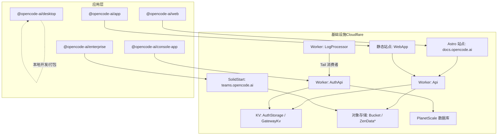
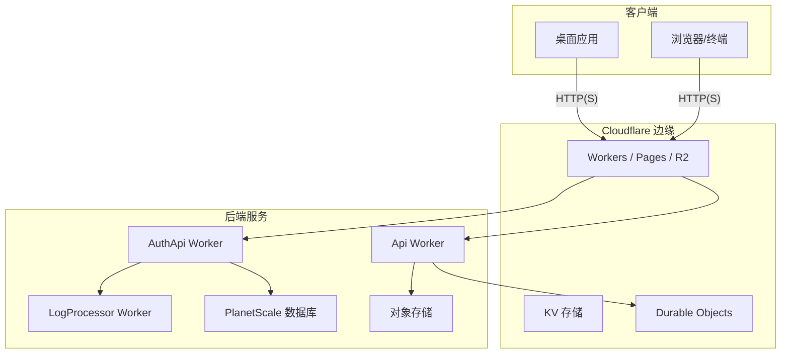
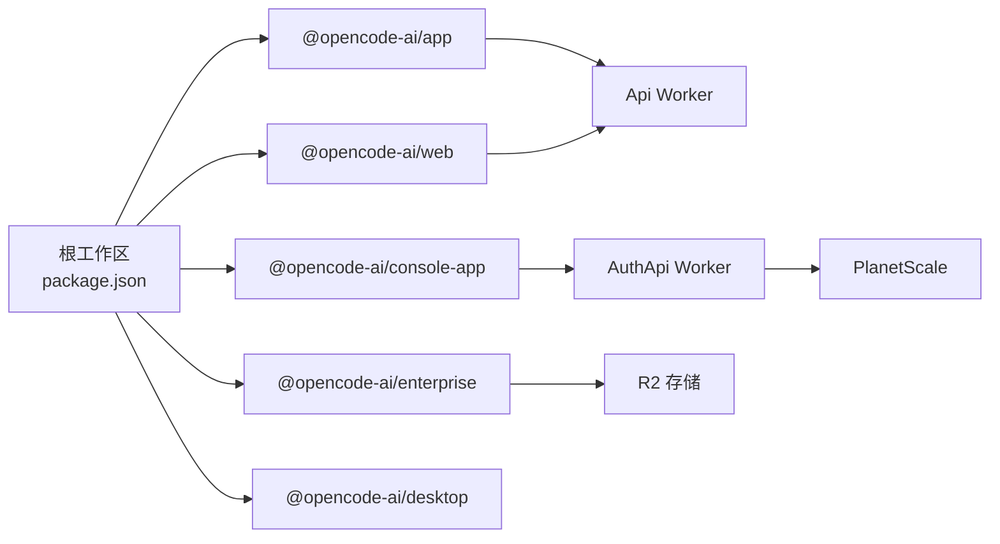

# 多应用部署策略

<cite>
**本文引用的文件**
- [README.md](file://README.md)
- [sst.config.ts](file://sst.config.ts)
- [turbo.json](file://turbo.json)
- [package.json](file://package.json)
- [infra/app.ts](file://infra/app.ts)
- [infra/console.ts](file://infra/console.ts)
- [infra/enterprise.ts](file://infra/enterprise.ts)
- [packages/app/package.json](file://packages/app/package.json)
- [packages/web/package.json](file://packages/web/package.json)
- [packages/desktop/package.json](file://packages/desktop/package.json)
- [packages/console/app/package.json](file://packages/console/app/package.json)
- [packages/enterprise/package.json](file://packages/enterprise/package.json)
</cite>

## 目录
1. [简介](#简介)
2. [项目结构](#项目结构)
3. [核心组件](#核心组件)
4. [架构总览](#架构总览)
5. [详细组件分析](#详细组件分析)
6. [依赖关系分析](#依赖关系分析)
7. [性能考量](#性能考量)
8. [故障排查指南](#故障排查指南)
9. [结论](#结论)
10. [附录](#附录)

## 简介
本指南面向 OpenCode 的多应用部署场景，覆盖 CLI 应用、Web 应用、桌面应用与文档网站的独立部署流程；说明各应用的构建配置、依赖管理与部署目标；阐述应用间的服务发现与通信配置；解释共享资源（数据库、对象存储、密钥等）的管理与版本同步策略；给出部署顺序、回滚策略与蓝绿部署方案建议；提供 CI/CD 流水线配置与自动化部署脚本思路；最后包含监控指标与健康检查配置要点。

## 项目结构
OpenCode 采用多包工作区（monorepo）组织方式，核心应用包括：
- Web 应用：packages/app（Cloudflare Workers 静态站点）
- 文档网站：packages/web（Astro Starlight）
- 控制台应用：packages/console/app（SolidStart）
- 企业版应用：packages/enterprise（Cloudflare Workers）
- 桌面应用：packages/desktop（Tauri）
- 核心 SDK/工具：packages/opencode、packages/sdk、packages/ui、packages/util 等

基础设施通过 SST 平台在 Cloudflare 上进行编排，统一域名与资源链接。

图表来源
- [infra/app.ts:13-69](file://infra/app.ts#L13-L69)
- [infra/console.ts:60-259](file://infra/console.ts#L60-L259)
- [infra/enterprise.ts:6-17](file://infra/enterprise.ts#L6-L17)
- [packages/app/package.json:11-25](file://packages/app/package.json#L11-L25)
- [packages/web/package.json:6-12](file://packages/web/package.json#L6-L12)
- [packages/console/app/package.json:6-12](file://packages/console/app/package.json#L6-L12)
- [packages/enterprise/package.json:7-14](file://packages/enterprise/package.json#L7-L14)

章节来源
- [README.md:46-118](file://README.md#L46-L118)
- [package.json:20-75](file://package.json#L20-L75)
- [turbo.json:1-32](file://turbo.json#L1-L32)

## 核心组件
- 应用与构建
  - Web 应用（packages/app）：使用 Vite 构建，Cloudflare 静态站点托管，构建命令由 SST 调用 turborepo。
  - 文档网站（packages/web）：Astro Starlight，Cloudflare 部署。
  - 控制台应用（packages/console/app）：SolidStart，Cloudflare Workers 部署。
  - 企业版应用（packages/enterprise）：Cloudflare Workers，支持 R2 存储适配。
  - 桌面应用（packages/desktop）：Tauri，本地开发与打包。
- 基础设施（SST）
  - Api Worker：承载业务 API，绑定 Durable Object SyncServer，连接对象存储与多种密钥。
  - AuthApi Worker：认证服务，连接 PlanetScale 数据库与 KV。
  - LogProcessor Worker：日志处理，作为 Tail 消费者接入 AuthApi。
  - 静态站点与 Astro 站点：分别指向 packages/app 与 packages/web。
  - 企业版：R2 存储适配，环境变量注入。
- 共享资源
  - PlanetScale 数据库：按阶段分支隔离，生产分支只读或受保护。
  - Cloudflare KV：认证状态与网关缓存。
  - 对象存储：通用 Bucket 与 ZenData* 专用桶。
  - Stripe：Webhook 与价格配置。
  - 密钥：GitHub、Discord、飞书、Stripe、SES、Salesforce 等。

章节来源
- [infra/app.ts:13-69](file://infra/app.ts#L13-L69)
- [infra/console.ts:6-41](file://infra/console.ts#L6-L41)
- [infra/console.ts:60-101](file://infra/console.ts#L60-L101)
- [infra/console.ts:209-212](file://infra/console.ts#L209-L212)
- [infra/enterprise.ts:4-17](file://infra/enterprise.ts#L4-L17)

## 架构总览
下图展示 OpenCode 多应用部署的整体架构与交互关系：

图表来源
- [infra/app.ts:13-49](file://infra/app.ts#L13-L49)
- [infra/console.ts:60-101](file://infra/console.ts#L60-L101)
- [infra/console.ts:209-212](file://infra/console.ts#L209-L212)

## 详细组件分析

### CLI 应用（本地开发与安装）
- 安装方式
  - 支持 curl 安装脚本、包管理器（npm/bun/pnpm/yarn、Homebrew、Scoop、Chocolatey、Pacman）等多种安装路径。
  - 安装目录优先级：自定义目录 > XDG 目录 > $HOME/bin > 默认 $HOME/.opencode/bin。
- 开发与运行
  - 工作区根提供 dev 脚本，可进入 packages/opencode 以浏览器条件启动前端入口。
- 依赖与脚本
  - 包含 @opencode-ai/plugin、@opencode-ai/script、@opencode-ai/sdk 等工作区依赖。
  - 使用 Bun 作为包管理器与运行时，类型检查通过 turbo 统一执行。

章节来源
- [README.md:48-98](file://README.md#L48-L98)
- [package.json:9-18](file://package.json#L9-L18)
- [package.json:88-94](file://package.json#L88-L94)

### Web 应用（packages/app）
- 构建与部署
  - Vite 构建，Cloudflare 静态站点托管。
  - SST 在 infra/app.ts 中定义 WebApp 静态站点，指定构建命令为 turborepo 的 build，并输出到 dist。
- 依赖与脚本
  - 单元测试与 E2E 测试脚本，类型检查通过 tsgo。
- 通信配置
  - 文档网站（docs.opencode.ai）通过环境变量 VITE_API_URL 指向 Api Worker 的 URL。
  - WebApp（app.opencode.ai）通过 Api Worker 提供的接口进行数据访问。

章节来源
- [infra/app.ts:61-69](file://infra/app.ts#L61-L69)
- [packages/app/package.json:11-25](file://packages/app/package.json#L11-L25)
- [packages/web/package.json:6-12](file://packages/web/package.json#L6-L12)

### 文档网站（packages/web）
- 构建与部署
  - Astro Starlight，Cloudflare 部署。
  - 通过 SST 的 Astro 组件绑定域名 docs.opencode.ai，设置 SST_STAGE 与 VITE_API_URL。
- 依赖与脚本
  - 开发、构建、预览脚本；依赖 @astrojs/starlight、@astrojs/solid-js 等。

章节来源
- [infra/app.ts:51-59](file://infra/app.ts#L51-L59)
- [packages/web/package.json:6-12](file://packages/web/package.json#L6-L12)

### 控制台应用（packages/console/app）
- 构建与部署
  - SolidStart，Cloudflare Workers 部署。
  - 通过 SST 的 SolidStart 组件绑定主域名，注入多个密钥与服务链接（数据库、对象存储、Stripe、邮件等）。
- 依赖与脚本
  - 类型检查、开发、构建脚本；构建时生成站点地图与配置文件。
- 通信配置
  - 通过 VITE_AUTH_URL 指向 AuthApi Worker。
  - 通过 VITE_STRIPE_PUBLISHABLE_KEY 注入 Stripe 公钥。

章节来源
- [infra/console.ts:214-259](file://infra/console.ts#L214-L259)
- [packages/console/app/package.json:6-12](file://packages/console/app/package.json#L6-L12)

### 企业版应用（packages/enterprise）
- 构建与部署
  - Cloudflare Workers，支持 OPENCODE_DEPLOYMENT_TARGET=cloudflare 的构建变体。
  - 通过环境变量注入 R2 凭据与存储桶名称，实现对象存储适配。
- 依赖与脚本
  - 类型检查、开发、构建脚本；提供生产 Shell 连接命令。

章节来源
- [infra/enterprise.ts:6-17](file://infra/enterprise.ts#L6-L17)
- [packages/enterprise/package.json:7-14](file://packages/enterprise/package.json#L7-L14)

### 桌面应用（packages/desktop）
- 构建与部署
  - Tauri 应用，本地开发与打包；依赖 @tauri-apps 系列插件。
- 依赖与脚本
  - 类型检查、开发、构建、预览与 Tauri 命令。

章节来源
- [packages/desktop/package.json:7-14](file://packages/desktop/package.json#L7-L14)

### 应用间服务发现与通信
- 服务发现
  - 所有应用通过 SST 组件暴露的 URL 或域名进行互相发现（如 docs 站点通过 VITE_API_URL 指向 Api Worker）。
- 通信配置
  - 控制台应用通过 VITE_AUTH_URL 指向 AuthApi Worker。
  - 企业版应用通过环境变量注入 R2 凭据与存储桶，实现对象存储访问。
  - Api Worker 通过 KV 与对象存储进行数据持久化与共享。

章节来源
- [infra/app.ts:54-58](file://infra/app.ts#L54-L58)
- [infra/console.ts:243-248](file://infra/console.ts#L243-L248)
- [infra/enterprise.ts:10-16](file://infra/enterprise.ts#L10-L16)

### 共享资源管理与版本同步
- 数据库
  - PlanetScale：按阶段创建分支，生产分支受保护；密码凭据通过 SST 输出属性暴露给应用。
- 对象存储
  - 通用 Bucket 与 ZenData* 专用桶，Api Worker 与企业版应用均使用。
- 密钥与配置
  - 通过 SST Secret 与 Linkable 统一管理，应用通过 link 注入所需密钥与服务 URL。
- 版本同步
  - 生产与非生产环境的迁移标签不同，确保数据模型演进的兼容性与回滚能力。

章节来源
- [infra/console.ts:8-41](file://infra/console.ts#L8-L41)
- [infra/app.ts:11-29](file://infra/app.ts#L11-L29)
- [infra/console.ts:187-192](file://infra/console.ts#L187-L192)

## 依赖关系分析
- 工作区与包管理
  - 根 package.json 定义工作区与 catalog 依赖，统一类型与工具链版本。
  - turbo.json 定义任务依赖与输出缓存，确保构建一致性。
- 应用间依赖
  - packages/app 与 packages/web 通过 Api Worker 间接耦合。
  - packages/console/app 依赖 AuthApi Worker 与 PlanetScale 数据库。
  - packages/enterprise 依赖 R2 存储与相关密钥。
- 外部依赖
  - Cloudflare Workers、KV、Durable Objects、Pages、R2。
  - Stripe、PlanetScale、邮件与 CRM 等第三方服务。

图表来源
- [package.json:20-75](file://package.json#L20-L75)
- [turbo.json:1-32](file://turbo.json#L1-L32)
- [infra/app.ts:13-69](file://infra/app.ts#L13-L69)
- [infra/console.ts:60-101](file://infra/console.ts#L60-L101)
- [infra/enterprise.ts:6-17](file://infra/enterprise.ts#L6-L17)

章节来源
- [package.json:20-75](file://package.json#L20-L75)
- [turbo.json:1-32](file://turbo.json#L1-L32)

## 性能考量
- 边缘部署
  - 利用 Cloudflare Workers 与 Pages 实现全球边缘分发，降低延迟。
- 构建优化
  - 使用 turborepo 缓存构建产物，减少重复构建时间。
- 数据访问
  - 通过 KV 与 Durable Objects 降低数据库往返次数，提升响应速度。
- 存储与带宽
  - 对象存储适合大文件与静态资源，结合 CDN 加速。

## 故障排查指南
- 认证与鉴权
  - 检查 AuthApi Worker 的密钥注入与数据库连接；确认 VITE_AUTH_URL 指向正确。
- API 可用性
  - 确认 Api Worker 的 URL 可达；检查 KV 与对象存储绑定是否生效。
- 日志与可观测性
  - LogProcessor 作为 Tail 消费者接入 AuthApi，用于收集日志；检查 Honeycomb API Key。
- 数据库
  - PlanetScale 分支与凭据需与 SST 输出一致；生产分支受保护，避免误改。
- 企业版存储
  - 确认 R2 凭据与存储桶名称环境变量已正确注入。

章节来源
- [infra/console.ts:209-212](file://infra/console.ts#L209-L212)
- [infra/console.ts:6-41](file://infra/console.ts#L6-L41)
- [infra/enterprise.ts:10-16](file://infra/enterprise.ts#L10-L16)

## 结论
OpenCode 的多应用部署以 SST 为核心，结合 Cloudflare 的边缘能力，实现了高可用、低延迟的应用交付。通过统一的密钥与资源管理、清晰的应用边界与依赖关系，以及完善的监控与日志体系，能够支撑从 CLI、Web、桌面到文档网站的全栈部署需求。建议在 CI/CD 中集成 turborepo 缓存与阶段化部署，配合蓝绿/金丝雀发布策略，进一步提升交付质量与风险控制。

## 附录

### 部署顺序建议
- 基础设施先行：PlanetScale 分支、KV、对象存储、Stripe Webhook。
- 后端服务：AuthApi → Api Worker → LogProcessor。
- 前端与静态站点：WebApp → 文档网站 → 控制台应用。
- 企业版：R2 存储与环境变量就绪后部署。
- 桌面应用：本地开发与打包，不参与边缘部署。

### 回滚策略
- 数据库：PlanetScale 分支隔离，回滚至父分支或上一个稳定分支。
- 边缘服务：通过 Cloudflare Workers 的版本与路由切换实现快速回滚。
- 静态资源：对象存储版本化，回退到上一个稳定版本。

### 蓝绿部署方案
- 使用 Cloudflare Workers 的路由规则与版本标签，将新版本流量切一半到新版本，观察指标后再全量切换。
- 对于静态站点，先部署新版本到暂存路径，验证无误后再切换域名指向。

### CI/CD 流水线配置与自动化部署脚本
- 构建与测试
  - 使用 turborepo 执行 typecheck 与单元测试；E2E 测试通过 Playwright。
  - 在根目录执行 SST 部署，按顺序加载 infra/app.ts、infra/console.ts、infra/enterprise.ts。
- 自动化脚本
  - 通过 SST CLI 与 Cloudflare API 完成 Workers、KV、R2、Pages 的部署与更新。
  - 将密钥与环境变量通过 SST Secret 注入，避免硬编码。

章节来源
- [turbo.json:1-32](file://turbo.json#L1-L32)
- [sst.config.ts:18-23](file://sst.config.ts#L18-L23)
- [packages/app/package.json:18-24](file://packages/app/package.json#L18-L24)
- [packages/web/package.json:6-12](file://packages/web/package.json#L6-L12)
- [packages/console/app/package.json:6-12](file://packages/console/app/package.json#L6-L12)
- [packages/enterprise/package.json:7-14](file://packages/enterprise/package.json#L7-L14)

### 监控指标与健康检查
- 边缘日志
  - 使用 LogProcessor 作为 Tail 消费者，集中收集 AuthApi 与相关服务日志。
- 数据库健康
  - 通过 PlanetScale 的仪表盘与慢查询日志监控数据库性能。
- API 健康检查
  - 在 Api Worker 中添加 /health 端点，返回服务状态与依赖健康情况。
- 前端监控
  - 在 WebApp 与 Console 中集成错误上报与性能指标采集。

章节来源
- [infra/console.ts:209-212](file://infra/console.ts#L209-L212)
- [infra/app.ts:13-49](file://infra/app.ts#L13-L49)