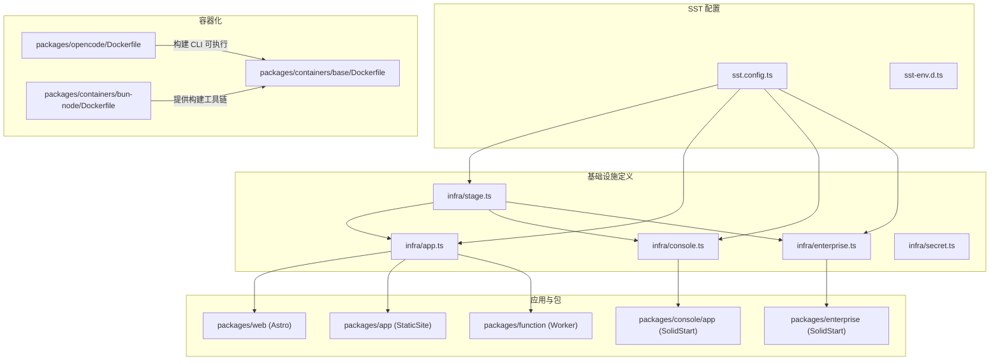
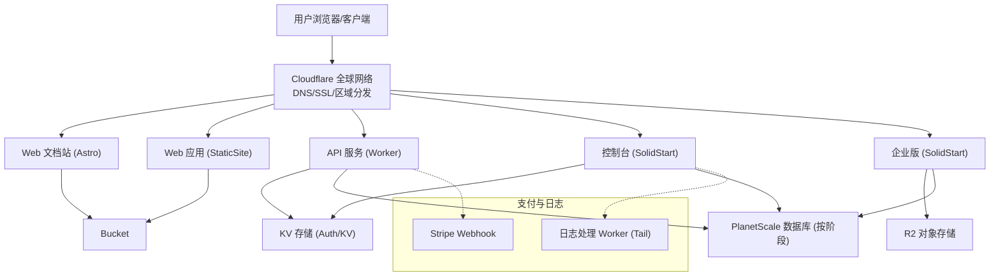
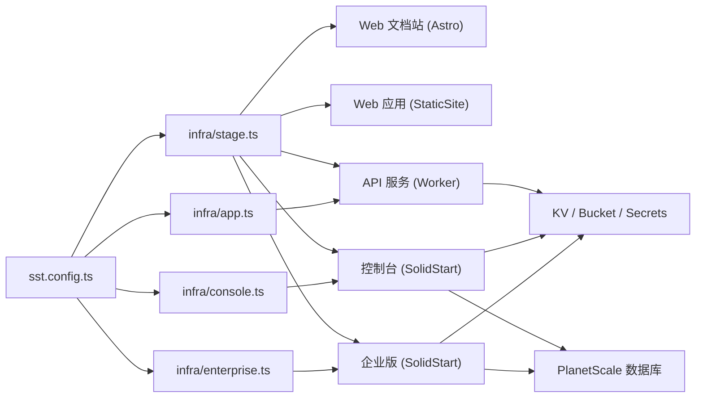

# 生产环境部署

<cite>
**本文引用的文件**
- [sst.config.ts](file://sst.config.ts)
- [sst-env.d.ts](file://sst-env.d.ts)
- [infra/app.ts](file://infra/app.ts)
- [infra/console.ts](file://infra/console.ts)
- [infra/enterprise.ts](file://infra/enterprise.ts)
- [infra/stage.ts](file://infra/stage.ts)
- [infra/secret.ts](file://infra/secret.ts)
- [packages/opencode/Dockerfile](file://packages/opencode/Dockerfile)
- [packages/containers/base/Dockerfile](file://packages/containers/base/Dockerfile)
- [packages/containers/bun-node/Dockerfile](file://packages/containers/bun-node/Dockerfile)
- [package.json](file://package.json)
</cite>

## 目录
1. [简介](#简介)
2. [项目结构](#项目结构)
3. [核心组件](#核心组件)
4. [架构总览](#架构总览)
5. [详细组件分析](#详细组件分析)
6. [依赖关系分析](#依赖关系分析)
7. [性能考量](#性能考量)
8. [故障排查指南](#故障排查指南)
9. [结论](#结论)
10. [附录](#附录)

## 简介
本指南面向 OpenCode 在生产环境的云原生部署，基于 SST（Simple Serverless Toolkit）与 Cloudflare 平台，覆盖以下主题：
- 基于 SST 的多阶段部署策略：开发、测试、生产
- Cloudflare Worker、Cloudflare Pages、Cloudflare KV、Cloudflare R2 的配置与集成
- 多应用独立部署：Web 应用、API 服务、控制台与企业版应用
- 域名与 SSL、CDN 加速与区域分发
- Docker 容器化与镜像构建、容器编排思路
- 部署脚本与自动化流程建议
- 环境变量与密钥管理最佳实践

## 项目结构
OpenCode 采用 monorepo 结构，使用 SST 进行基础设施即代码（IaC）定义，并通过 Cloudflare 提供的边缘运行时与存储能力实现全栈云原生部署。

图表来源
- [sst.config.ts:1-24](file://sst.config.ts#L1-L24)
- [sst-env.d.ts:1-315](file://sst-env.d.ts#L1-L315)
- [infra/stage.ts:1-20](file://infra/stage.ts#L1-L20)
- [infra/app.ts:1-69](file://infra/app.ts#L1-L69)
- [infra/console.ts:1-260](file://infra/console.ts#L1-L260)
- [infra/enterprise.ts:1-18](file://infra/enterprise.ts#L1-L18)
- [packages/opencode/Dockerfile:1-19](file://packages/opencode/Dockerfile#L1-L19)
- [packages/containers/base/Dockerfile:1-19](file://packages/containers/base/Dockerfile#L1-L19)
- [packages/containers/bun-node/Dockerfile:1-25](file://packages/containers/bun-node/Dockerfile#L1-L25)

章节来源
- [sst.config.ts:1-24](file://sst.config.ts#L1-L24)
- [package.json:1-124](file://package.json#L1-L124)

## 核心组件
- 应用与服务
  - Web 文档站：Astro 静态站点，部署在 Cloudflare Pages/Astro
  - Web 应用：静态站点，部署在 Cloudflare StaticSite
  - API 服务：Cloudflare Worker，承载业务逻辑与数据访问
  - 控制台：SolidStart 应用，托管于 Cloudflare Workers（Server）
  - 企业版：SolidStart 应用，托管于 Cloudflare Workers（Server），使用 R2 存储适配
- 边缘存储与缓存
  - Cloudflare KV：会话与网关状态等键值数据
  - Cloudflare R2：企业版对象存储
  - Cloudflare Bucket：通用对象存储（用于文档、日志等）
- 数据层
  - PlanetScale 数据库分支与凭据（按阶段隔离）
- 支付与订阅
  - Stripe Webhook 与价格配置（产品与价格）
- 开发与运维
  - 日志处理 Worker（Tail 链路）
  - 区域主机名（Regional Hostname）与 DNS 策略

章节来源
- [infra/app.ts:13-69](file://infra/app.ts#L13-L69)
- [infra/console.ts:33-41](file://infra/console.ts#L33-L41)
- [infra/console.ts:56-65](file://infra/console.ts#L56-L65)
- [infra/console.ts:103-151](file://infra/console.ts#L103-L151)
- [infra/enterprise.ts:4-17](file://infra/enterprise.ts#L4-L17)
- [infra/stage.ts:1-20](file://infra/stage.ts#L1-L20)

## 架构总览
下图展示生产环境的端到端部署视图，涵盖域名、边缘计算、存储与数据库：

图表来源
- [infra/app.ts:51-69](file://infra/app.ts#L51-L69)
- [infra/console.ts:209-212](file://infra/console.ts#L209-L212)
- [infra/console.ts:71-101](file://infra/console.ts#L71-L101)
- [infra/enterprise.ts:6-17](file://infra/enterprise.ts#L6-L17)
- [infra/stage.ts:9-13](file://infra/stage.ts#L9-L13)

## 详细组件分析

### 多阶段部署策略
- 阶段识别与保护
  - 生产：保留资源、保护部署
  - 开发/测试：自动清理、可回滚
- 域名与区域分发
  - 根据阶段动态生成主域名与短域名
  - 使用 Regional Hostname 将流量路由至指定区域
- 资源与安全
  - 移除策略与保护策略由阶段决定
  - 密钥与敏感参数通过 SST Secret 管理

章节来源
- [sst.config.ts:3-17](file://sst.config.ts#L3-L17)
- [infra/stage.ts:1-20](file://infra/stage.ts#L1-L20)

### Web 文档站（Astro）
- 部署目标：Cloudflare Astro 静态站点
- 动态环境变量：注入 SST 阶段与 API 地址
- 域名：docs.{domain}

章节来源
- [infra/app.ts:51-59](file://infra/app.ts#L51-L59)

### Web 应用（StaticSite）
- 部署目标：Cloudflare StaticSite
- 构建命令：使用 monorepo 工作流的构建脚本
- 域名：app.{domain}

章节来源
- [infra/app.ts:61-69](file://infra/app.ts#L61-L69)

### API 服务（Worker）
- 部署目标：Cloudflare Worker
- 域名：api.{domain}
- 环境变量：注入 WEB_DOMAIN
- 链接资源：KV、存储桶、第三方密钥
- 迁移与 Durable Object：按阶段启用不同标签与类映射
- 日志推送：开启 Logpush

章节来源
- [infra/app.ts:13-49](file://infra/app.ts#L13-L49)

### 控制台（Console）与认证
- 部署目标：Cloudflare Workers（Server）
- 数据库：PlanetScale 按阶段分支与密码
- 认证：独立 Worker，使用 KV 存储状态
- 支付：Stripe Webhook 与价格配置
- 日志：Tail 消费器连接日志处理 Worker
- 环境变量：注入认证地址与 Stripe 公钥

章节来源
- [infra/console.ts:8-41](file://infra/console.ts#L8-L41)
- [infra/console.ts:56-65](file://infra/console.ts#L56-L65)
- [infra/console.ts:71-101](file://infra/console.ts#L71-L101)
- [infra/console.ts:209-212](file://infra/console.ts#L209-L212)
- [infra/console.ts:214-259](file://infra/console.ts#L214-L259)

### 企业版（Teams）
- 部署目标：Cloudflare Workers（Server）
- 存储：R2 对象存储，通过环境变量注入账户与密钥
- 域名：shortDomain（opncd.ai 或其子域）

章节来源
- [infra/enterprise.ts:4-17](file://infra/enterprise.ts#L4-L17)
- [infra/secret.ts:1-5](file://infra/secret.ts#L1-L5)

### 数据库与密钥管理
- PlanetScale：按阶段创建分支与密码，生成 Linkable 数据库属性
- 密钥：通过 SST Secret 统一管理，注入到各 Worker 与应用
- 环境类型：自动生成的 sst-env.d.ts 提供类型提示

章节来源
- [infra/console.ts:8-41](file://infra/console.ts#L8-L41)
- [sst-env.d.ts:1-315](file://sst-env.d.ts#L1-L315)

### 域名、SSL 与 CDN 加速
- 域名：根据阶段生成 docs.{domain}、app.{domain}、api.{domain}、auth.{domain} 等
- SSL：Cloudflare 自动签发与续期
- CDN：全球边缘网络加速
- 区域分发：Regional Hostname 将流量定向至 us 区域

章节来源
- [infra/stage.ts:1-20](file://infra/stage.ts#L1-L20)

### Docker 容器化部署方案
- CLI 可执行镜像
  - 基于 Alpine，针对 x64/arm64 多架构构建
  - 禁用 Bun 运行时转译缓存以优化容器瞬态场景
- 构建基础镜像
  - Ubuntu 24.04，预装常用工具链与语言运行时
- 构建工具链镜像
  - 预装 Node/Bun，便于在 CI 中复用

章节来源
- [packages/opencode/Dockerfile:1-19](file://packages/opencode/Dockerfile#L1-L19)
- [packages/containers/base/Dockerfile:1-19](file://packages/containers/base/Dockerfile#L1-L19)
- [packages/containers/bun-node/Dockerfile:1-25](file://packages/containers/bun-node/Dockerfile#L1-L25)

## 依赖关系分析

图表来源
- [sst.config.ts:18-22](file://sst.config.ts#L18-L22)
- [infra/stage.ts:1-20](file://infra/stage.ts#L1-L20)
- [infra/app.ts:13-69](file://infra/app.ts#L13-L69)
- [infra/console.ts:214-259](file://infra/console.ts#L214-L259)
- [infra/enterprise.ts:6-17](file://infra/enterprise.ts#L6-L17)

章节来源
- [sst.config.ts:18-22](file://sst.config.ts#L18-L22)
- [infra/app.ts:13-49](file://infra/app.ts#L13-L49)
- [infra/console.ts:214-259](file://infra/console.ts#L214-L259)

## 性能考量
- 边缘优先：所有请求尽量在 Cloudflare 边缘完成，减少回源延迟
- KV 与 R2：热点数据使用 KV，大文件与二进制内容使用 R2
- Worker 迁移与 DO：按阶段启用不同迁移标签，避免生产中断
- 日志链路：Tail 消费器将日志推送到专用 Worker，降低主服务开销
- 构建与缓存：Docker 镜像禁用 Bun 转译缓存，适合瞬态容器；CI 中可利用缓存层提升速度

## 故障排查指南
- 部署失败
  - 检查阶段配置与保护策略，确认是否为生产阶段导致资源保留
  - 查看 Worker 迁移标签与 Durable Object 类映射是否匹配
- 域名与 SSL
  - 确认 Regional Hostname 是否正确绑定 Zone ID 与区域
  - 检查 DNS 解析与证书状态
- 数据库连接
  - 核对 PlanetScale 分支与密码是否按阶段创建
  - 确认 Linkable 数据库属性是否注入到应用
- 密钥与环境变量
  - 使用 sst-env.d.ts 类型检查是否存在缺失的 Secret
  - 在本地开发时，确保通过 SST Secret 注入或环境变量提供

章节来源
- [sst.config.ts:3-17](file://sst.config.ts#L3-L17)
- [infra/stage.ts:9-13](file://infra/stage.ts#L9-L13)
- [infra/console.ts:8-41](file://infra/console.ts#L8-L41)
- [sst-env.d.ts:1-315](file://sst-env.d.ts#L1-L315)

## 结论
本指南提供了基于 SST 与 Cloudflare 的 OpenCode 生产级部署蓝图，涵盖多阶段策略、边缘计算与存储、数据库与支付集成、以及容器化与运维要点。通过严格的密钥管理、区域分发与日志链路设计，可在保证安全性的同时获得优异的全球性能与可维护性。

## 附录

### 多阶段部署流程（建议）
- 开发阶段
  - 自动清理资源，快速迭代
  - 使用本地密钥或 CI 凭证注入
- 测试阶段
  - 与生产隔离的数据库分支与存储
  - 启用完整日志链路与监控
- 生产阶段
  - 保留资源与保护策略
  - 严格审批与回滚策略
  - 使用 Regional Hostname 与全局 CDN

章节来源
- [sst.config.ts:3-17](file://sst.config.ts#L3-L17)
- [infra/stage.ts:1-20](file://infra/stage.ts#L1-L20)

### 部署脚本与自动化（建议）
- CI/CD 流程
  - 安装依赖与类型检查
  - 构建各应用（Astro、StaticSite、SolidStart）
  - 执行 SST 部署（按阶段选择）
  - 推送 Docker 镜像（如需）
- 关键命令参考
  - 项目根目录脚本与工作区配置见 package.json

章节来源
- [package.json:8-18](file://package.json#L8-L18)

### 环境变量与密钥管理最佳实践
- 使用 SST Secret 管理敏感信息
- 通过 sst-env.d.ts 获取类型提示，避免拼写错误
- 不在代码仓库中提交密钥，使用 CI 凭证注入
- 按阶段分离数据库与存储，最小权限原则

章节来源
- [sst-env.d.ts:1-315](file://sst-env.d.ts#L1-L315)
- [infra/console.ts:235-241](file://infra/console.ts#L235-L241)