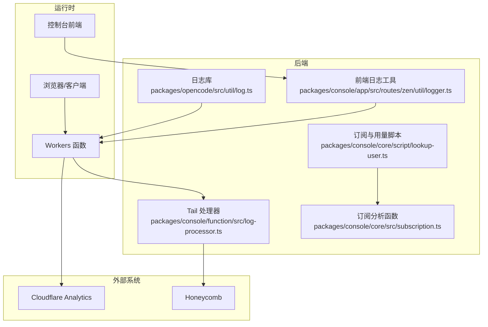
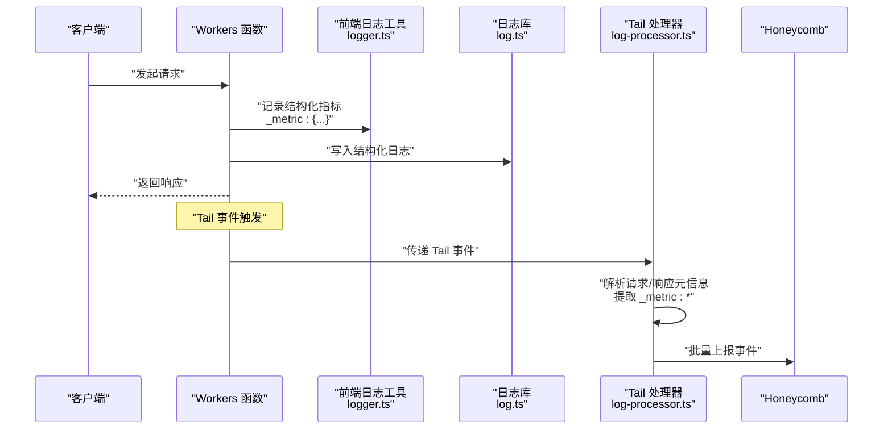
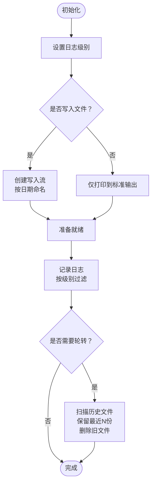
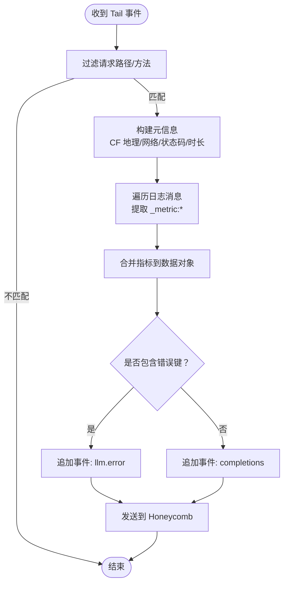
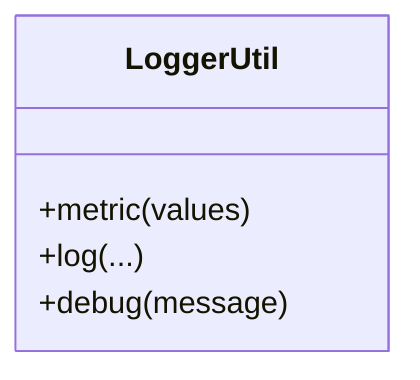
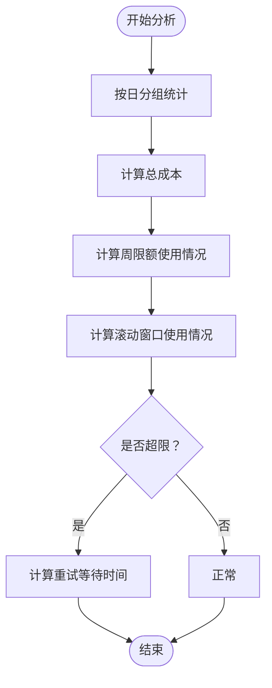
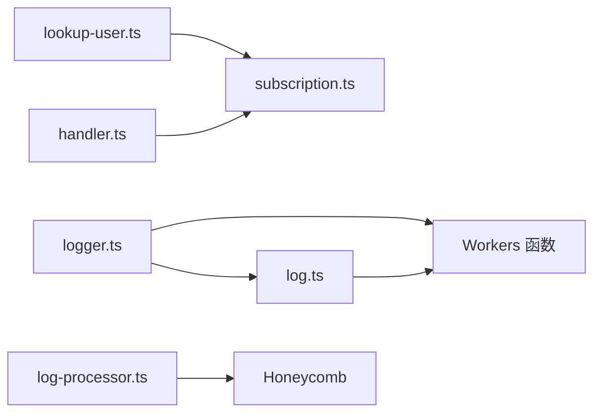

# 监控与日志

<cite>
**本文引用的文件**
- [.opencode/opencode.jsonc](file://.opencode/opencode.jsonc)
- [packages/opencode/src/util/log.ts](file://packages/opencode/src/util/log.ts)
- [packages/console/function/src/log-processor.ts](file://packages/console/function/src/log-processor.ts)
- [packages/console/app/src/routes/zen/util/logger.ts](file://packages/console/app/src/routes/zen/util/logger.ts)
- [packages/console/app/src/routes/zen/util/handler.ts](file://packages/console/app/src/routes/zen/util/handler.ts)
- [packages/console/core/src/subscription.ts](file://packages/console/core/src/subscription.ts)
- [packages/console/core/script/lookup-user.ts](file://packages/console/core/script/lookup-user.ts)
- [packages/console/app/src/routes/workspace/[id]/usage/graph-section.tsx](file://packages/console/app/src/routes/workspace/[id]/usage/graph-section.tsx)
- [packages/opencode/src/config/paths.ts](file://packages/opencode/src/config/paths.ts)
- [packages/opencode/src/env/index.ts](file://packages/opencode/src/env/index.ts)
- [sst.config.ts](file://sst.config.ts)
</cite>

## 目录
1. [简介](#简介)
2. [项目结构](#项目结构)
3. [核心组件](#核心组件)
4. [架构总览](#架构总览)
5. [详细组件分析](#详细组件分析)
6. [依赖关系分析](#依赖关系分析)
7. [性能考量](#性能考量)
8. [故障排查指南](#故障排查指南)
9. [结论](#结论)
10. [附录](#附录)

## 简介
本文件面向 OpenCode 的监控与日志体系，聚焦以下目标：
- 日志收集与聚合：结构化日志格式、日志级别配置、日志轮转策略
- 性能监控指标：响应时间、吞吐量、错误率等关键指标的采集与使用
- 集成 Cloudflare Analytics（及其他可观测性工具）：配置与数据流
- 告警规则：错误阈值、性能警告、可用性监控
- 日志查询与分析最佳实践：如何从结构化日志中提取指标
- 故障排查：基于日志的定位方法
- 仪表板与自定义指标：如何在现有基础上扩展可视化与告警

## 项目结构
OpenCode 使用 SST（Serverless Stack Toolkit）在 Cloudflare 平台上部署应用，监控与日志能力主要分布在以下模块：
- 核心日志库：统一的日志初始化、级别过滤、文件输出与轮转
- 控制台函数：Tail 日志到 Honeycomb 的处理器
- 控制台前端工具：结构化指标输出与调试开关
- 订阅与用量脚本：按周/滚动窗口的用量分析与限流逻辑
- 配置与环境：配置模板替换、环境变量注入

图表来源
- [packages/opencode/src/util/log.ts:60-78](file://packages/opencode/src/util/log.ts#L60-L78)
- [packages/console/function/src/log-processor.ts:52-61](file://packages/console/function/src/log-processor.ts#L52-L61)
- [packages/console/app/src/routes/zen/util/logger.ts:4-6](file://packages/console/app/src/routes/zen/util/logger.ts#L4-L6)
- [packages/console/core/script/lookup-user.ts:227-253](file://packages/console/core/script/lookup-user.ts#L227-L253)
- [packages/console/core/src/subscription.ts:89-120](file://packages/console/core/src/subscription.ts#L89-L120)

章节来源
- [sst.config.ts:1-24](file://sst.config.ts#L1-L24)
- [.opencode/opencode.jsonc:1-19](file://.opencode/opencode.jsonc#L1-L19)

## 核心组件
- 结构化日志库：提供统一的日志级别、标签、时间测量与文件输出；支持按天轮转与清理
- Tail 处理器：从 Workers Tail 中提取请求元信息与结构化指标，发送至 Honeycomb
- 前端日志工具：以“_metric:”前缀输出结构化指标，便于聚合与分析
- 用量与订阅分析：按周/滚动窗口统计用量，用于限流与仪表板展示
- 配置与环境：支持 {env:VAR} 与 {file:path} 模板替换，便于注入密钥与外部配置

章节来源
- [packages/opencode/src/util/log.ts:9-182](file://packages/opencode/src/util/log.ts#L9-L182)
- [packages/console/function/src/log-processor.ts:1-65](file://packages/console/function/src/log-processor.ts#L1-L65)
- [packages/console/app/src/routes/zen/util/logger.ts:1-13](file://packages/console/app/src/routes/zen/util/logger.ts#L1-L13)
- [packages/console/core/script/lookup-user.ts:227-253](file://packages/console/core/script/lookup-user.ts#L227-L253)
- [packages/opencode/src/config/paths.ts:78-112](file://packages/opencode/src/config/paths.ts#L78-L112)
- [packages/opencode/src/env/index.ts:1-28](file://packages/opencode/src/env/index.ts#L1-L28)

## 架构总览
下图展示了从请求到日志采集、结构化指标注入、Tail 聚合与外部系统上报的整体流程。

图表来源
- [packages/console/function/src/log-processor.ts:5-63](file://packages/console/function/src/log-processor.ts#L5-L63)
- [packages/console/app/src/routes/zen/util/logger.ts:4-6](file://packages/console/app/src/routes/zen/util/logger.ts#L4-L6)
- [packages/opencode/src/util/log.ts:100-181](file://packages/opencode/src/util/log.ts#L100-L181)

## 详细组件分析

### 日志库（结构化日志与轮转）
- 日志级别与过滤：支持 DEBUG/INFO/WARN/ERROR 四级，按优先级过滤输出
- 标签与上下文：通过 tag/key=value 形式附加上下文，便于检索
- 时间测量：time 方法自动记录“started/completed/duration”，便于性能分析
- 文件输出与轮转：按日期生成日志文件，保留最近 N 份并清理旧文件
- 初始化选项：可选择打印到标准输出或写入文件，并设置日志级别

图表来源
- [packages/opencode/src/util/log.ts:60-90](file://packages/opencode/src/util/log.ts#L60-L90)
- [packages/opencode/src/util/log.ts:100-181](file://packages/opencode/src/util/log.ts#L100-L181)

章节来源
- [packages/opencode/src/util/log.ts:9-182](file://packages/opencode/src/util/log.ts#L9-L182)

### Tail 处理器（Honeycomb 聚合）
- 请求过滤：仅处理特定路径的 POST 请求
- 元信息提取：从请求头与 CF 边缘字段提取地理、网络等上下文
- 结构化指标注入：解析以“_metric:”开头的日志消息，合并为事件数据
- 事件类型：当指标包含特定错误键时，标记为“llm.error”，否则为“completions”
- 上报：向 Honeycomb 批量提交事件

图表来源
- [packages/console/function/src/log-processor.ts:5-63](file://packages/console/function/src/log-processor.ts#L5-L63)

章节来源
- [packages/console/function/src/log-processor.ts:1-65](file://packages/console/function/src/log-processor.ts#L1-L65)

### 前端日志工具（结构化指标输出）
- 指标输出：通过“_metric:”前缀输出 JSON，供 Tail 处理器解析
- 调试开关：生产阶段禁用 debug 输出，避免噪声

图表来源
- [packages/console/app/src/routes/zen/util/logger.ts:3-12](file://packages/console/app/src/routes/zen/util/logger.ts#L3-L12)

章节来源
- [packages/console/app/src/routes/zen/util/logger.ts:1-13](file://packages/console/app/src/routes/zen/util/logger.ts#L1-L13)

### 用量与订阅分析（性能与成本指标）
- 28 天使用统计：按天汇总请求次数、输入/输出/推理/缓存令牌用量与成本
- 周限额分析：按周重置，计算使用占比与剩余重试时间
- 滚动窗口：固定窗口大小，结合更新时间判断是否仍有效

图表来源
- [packages/console/core/script/lookup-user.ts:227-253](file://packages/console/core/script/lookup-user.ts#L227-L253)
- [packages/console/core/src/subscription.ts:89-120](file://packages/console/core/src/subscription.ts#L89-L120)

章节来源
- [packages/console/core/script/lookup-user.ts:330-358](file://packages/console/core/script/lookup-user.ts#L330-L358)
- [packages/console/core/src/subscription.ts:89-120](file://packages/console/core/src/subscription.ts#L89-L120)

### 配置与环境（模板替换与注入）
- 模板替换：支持 {env:VAR} 注入环境变量与 {file:path} 注入文件内容
- 安全性：缺失占位符可选择报错或留空，避免泄露敏感信息

章节来源
- [packages/opencode/src/config/paths.ts:78-112](file://packages/opencode/src/config/paths.ts#L78-L112)
- [packages/opencode/src/env/index.ts:1-28](file://packages/opencode/src/env/index.ts#L1-L28)

## 依赖关系分析
- 日志库被多处调用，统一了日志格式与输出策略
- Tail 处理器依赖前端日志工具输出的“_metric:”指标
- 订阅与用量脚本依赖数据库查询结果，用于生成成本与用量指标
- 配置与环境模块为上述组件提供安全的密钥与外部配置注入

图表来源
- [packages/console/app/src/routes/zen/util/logger.ts:4-6](file://packages/console/app/src/routes/zen/util/logger.ts#L4-L6)
- [packages/opencode/src/util/log.ts:100-181](file://packages/opencode/src/util/log.ts#L100-L181)
- [packages/console/function/src/log-processor.ts:52-61](file://packages/console/function/src/log-processor.ts#L52-L61)
- [packages/console/core/script/lookup-user.ts:227-253](file://packages/console/core/script/lookup-user.ts#L227-L253)
- [packages/console/core/src/subscription.ts:89-120](file://packages/console/core/src/subscription.ts#L89-L120)

章节来源
- [packages/console/app/src/routes/zen/util/handler.ts:634-654](file://packages/console/app/src/routes/zen/util/handler.ts#L634-L654)

## 性能考量
- 响应时间：Tail 处理器从事件中提取 duration 字段，可用于端到端时延分析
- 吞吐量：28 天使用统计中的请求计数与令牌用量可作为吞吐指标
- 错误率：当结构化指标包含错误键时，会生成“llm.error”事件，便于计算错误率
- 日志开销：生产阶段关闭 debug 输出，减少 I/O；文件轮转避免磁盘膨胀

章节来源
- [packages/console/function/src/log-processor.ts:32-35](file://packages/console/function/src/log-processor.ts#L32-L35)
- [packages/console/app/src/routes/zen/util/logger.ts:8-11](file://packages/console/app/src/routes/zen/util/logger.ts#L8-L11)
- [packages/console/core/script/lookup-user.ts:227-253](file://packages/console/core/script/lookup-user.ts#L227-L253)

## 故障排查指南
- 定位无指标问题：确认前端是否输出“_metric:”前缀；检查 Tail 是否正确过滤路径
- 定位错误率异常：关注“llm.error”事件数量与错误键分布
- 定位性能退化：对比 duration 分布与 28 天使用趋势，识别异常峰值
- 定位限流问题：核对周限额与滚动窗口的使用情况，确认重试时间提示

章节来源
- [packages/console/function/src/log-processor.ts:40-48](file://packages/console/function/src/log-processor.ts#L40-L48)
- [packages/console/app/src/routes/zen/util/handler.ts:634-654](file://packages/console/app/src/routes/zen/util/handler.ts#L634-L654)
- [packages/console/core/src/subscription.ts:89-120](file://packages/console/core/src/subscription.ts#L89-L120)

## 结论
OpenCode 的监控与日志体系以统一的日志库为基础，通过前端结构化指标与 Tail 处理器实现端到端的性能与错误观测，并借助 Honeycomb 进行聚合分析。用量与订阅分析脚本提供了成本与限额维度的关键指标，配合 Cloudflare 平台可实现完整的可观测性闭环。建议在现有基础上补充：
- 在 Honeycomb 中建立常用指标（如 p95/p99 延迟、错误率、RPM）的视图与告警
- 将关键业务指标映射到 Cloudflare Analytics，完善端到端链路观测
- 在生产环境保持 debug 关闭，必要时通过临时开关进行问题定位

## 附录

### 日志级别与格式规范
- 级别：DEBUG/INFO/WARN/ERROR
- 格式：包含时间戳、相对耗时、标签键值对与消息体
- 示例路径：[日志创建与格式化:111-128](file://packages/opencode/src/util/log.ts#L111-L128)

章节来源
- [packages/opencode/src/util/log.ts:9-182](file://packages/opencode/src/util/log.ts#L9-L182)

### 结构化指标字段建议
- 通用字段：duration、request_length、status、ip、cf.*（大区/国家/城市/经纬度/时区）
- 错误字段：llm.error.code、llm.error.message
- 业务字段：model、provider、workspaceID、keyID、plan

章节来源
- [packages/console/function/src/log-processor.ts:24-36](file://packages/console/function/src/log-processor.ts#L24-L36)
- [packages/console/function/src/log-processor.ts:42-47](file://packages/console/function/src/log-processor.ts#L42-L47)

### Cloudflare Analytics 集成要点
- Workers Tail 事件默认可接入 Cloudflare Analytics，用于实时观测
- 可在 Honeycomb 中进一步做细粒度分析与告警
- 配置参考：平台与提供商由 SST 配置指定

章节来源
- [sst.config.ts:9-16](file://sst.config.ts#L9-L16)

### 告警规则建议
- 错误阈值：llm.error 事件在 5 分钟窗口内超过阈值触发
- 性能警告：p95 延迟在 1 分钟窗口内持续高于阈值
- 可用性监控：HTTP 5xx 比例在 5 分钟窗口内超过阈值
- 用量告警：周限额使用率接近 90% 提醒，超限时阻断并提示重试

章节来源
- [packages/console/function/src/log-processor.ts:44-46](file://packages/console/function/src/log-processor.ts#L44-L46)
- [packages/console/core/src/subscription.ts:114-119](file://packages/console/core/src/subscription.ts#L114-L119)

### 仪表板与自定义指标
- 仪表板建议：延迟分布、错误率、RPM、令牌用量、成本曲线
- 自定义指标：在前端 logger.ts 中通过 metric(values) 输出，Tail 处理器自动聚合
- 数据源：Honeycomb 事件、Cloudflare Analytics、数据库用量脚本

章节来源
- [packages/console/app/src/routes/zen/util/logger.ts:4-6](file://packages/console/app/src/routes/zen/util/logger.ts#L4-L6)
- [packages/console/function/src/log-processor.ts:49-49](file://packages/console/function/src/log-processor.ts#L49-L49)
- [packages/console/app/src/routes/workspace/[id]/usage/graph-section.tsx:27-62](file://packages/console/app/src/routes/workspace/[id]/usage/graph-section.tsx#L27-L62)