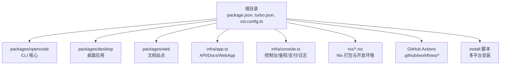
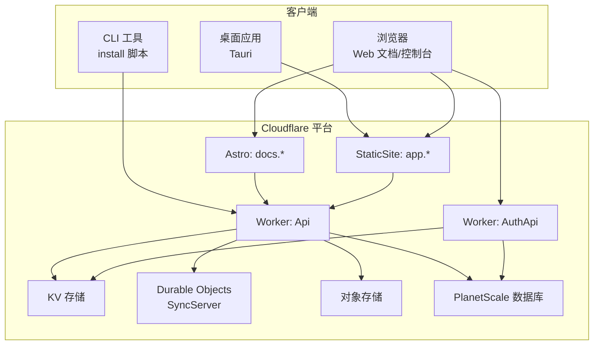
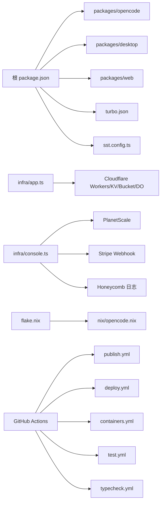

# 部署运维

<cite>
**本文引用的文件**
- [README.md](file://README.md)
- [package.json](file://package.json)
- [turbo.json](file://turbo.json)
- [sst.config.ts](file://sst.config.ts)
- [infra/app.ts](file://infra/app.ts)
- [infra/console.ts](file://infra/console.ts)
- [install](file://install)
- [flake.nix](file://flake.nix)
- [nix/opencode.nix](file://nix/opencode.nix)
- [packages/opencode/package.json](file://packages/opencode/package.json)
- [packages/desktop/package.json](file://packages/desktop/package.json)
- [packages/web/package.json](file://packages/web/package.json)
- [.github/workflows/publish.yml](file://.github/workflows/publish.yml)
- [.github/workflows/deploy.yml](file://.github/workflows/deploy.yml)
- [.github/workflows/containers.yml](file://.github/workflows/containers.yml)
- [.github/workflows/test.yml](file://.github/workflows/test.yml)
- [.github/workflows/typecheck.yml](file://.github/workflows/typecheck.yml)
</cite>

## 目录
1. [简介](#简介)
2. [项目结构](#项目结构)
3. [核心组件](#核心组件)
4. [架构总览](#架构总览)
5. [详细组件分析](#详细组件分析)
6. [依赖关系分析](#依赖关系分析)
7. [性能考量](#性能考量)
8. [故障排除指南](#故障排除指南)
9. [结论](#结论)
10. [附录](#附录)

## 简介
本文件面向运维与开发团队，提供 OpenCode 从开发环境到生产环境的完整部署与运维指南。内容覆盖本地开发环境搭建、生产环境部署（Cloudflare Workers、静态站点与数据库）、多平台分发（CLI、Web、桌面应用）、CI/CD 流水线、监控与日志、安全配置、故障排除、备份恢复与版本升级等。

## 项目结构
OpenCode 采用 Monorepo 结构，使用包管理器与构建工具协调各子模块。根目录包含统一的脚本、配置与工作流；packages 下为具体功能包；infra 描述云端资源；nix 提供 Nix 开发与打包；.github/workflows 提供自动化流水线。

图表来源
- [package.json:1-124](file://package.json#L1-L124)
- [turbo.json:1-32](file://turbo.json#L1-L32)
- [sst.config.ts:1-24](file://sst.config.ts#L1-L24)
- [infra/app.ts:1-69](file://infra/app.ts#L1-L69)
- [infra/console.ts:1-260](file://infra/console.ts#L1-L260)
- [install:1-461](file://install#L1-L461)
- [flake.nix:1-77](file://flake.nix#L1-L77)
- [nix/opencode.nix:1-102](file://nix/opencode.nix#L1-L102)

章节来源
- [package.json:1-124](file://package.json#L1-L124)
- [turbo.json:1-32](file://turbo.json#L1-L32)
- [sst.config.ts:1-24](file://sst.config.ts#L1-L24)

## 核心组件
- CLI 工具与安装：通过统一安装脚本支持多平台二进制分发与路径注入，便于本地与生产快速部署。
- Web 文档与前端：基于 Astro 的静态站点与文档系统，部署于 Cloudflare。
- 控制台与后端：Cloudflare Worker 提供鉴权、支付回调、日志处理等服务，并链接 PlanetScale 数据库。
- 桌面应用：基于 Tauri 的跨平台桌面客户端，支持更新与系统集成插件。
- Nix 打包：提供可复现的开发环境与二进制打包，便于本地与 CI 使用。
- CI/CD：通过 GitHub Actions 实现发布、容器化、测试与类型检查流水线。

章节来源
- [install:1-461](file://install#L1-L461)
- [packages/opencode/package.json:1-164](file://packages/opencode/package.json#L1-L164)
- [packages/web/package.json:1-45](file://packages/web/package.json#L1-L45)
- [packages/desktop/package.json:1-45](file://packages/desktop/package.json#L1-L45)
- [infra/app.ts:1-69](file://infra/app.ts#L1-L69)
- [infra/console.ts:1-260](file://infra/console.ts#L1-L260)
- [flake.nix:1-77](file://flake.nix#L1-L77)
- [nix/opencode.nix:1-102](file://nix/opencode.nix#L1-L102)

## 架构总览
OpenCode 生产环境以 Cloudflare Workers 为核心，结合 KV、Durable Objects、对象存储与 PlanetScale 数据库，提供 API、鉴权、支付、日志与文档站点服务。CLI 与桌面应用通过统一安装脚本与 Nix 打包进行交付。

图表来源
- [infra/app.ts:13-69](file://infra/app.ts#L13-L69)
- [infra/console.ts:60-259](file://infra/console.ts#L60-L259)
- [packages/web/package.json:1-45](file://packages/web/package.json#L1-L45)
- [packages/desktop/package.json:1-45](file://packages/desktop/package.json#L1-L45)

## 详细组件分析

### 本地开发环境搭建
- 依赖与工具
  - 包管理器与脚手架：根 package.json 声明了工作区与脚本，支持 dev、typecheck 等常用命令。
  - Nix 开发壳：flake.nix 提供统一的开发环境，包含 bun、nodejs、pkg-config、openssl、git 等。
  - Node 模块缓存：nix/node_modules.nix 与 nix/opencode.nix 组合，实现可复现构建与包装。
- 环境变量与全局配置
  - turbo.json 定义了全局环境变量与任务依赖，确保类型检查与构建一致性。
  - sst.config.ts 指定 Cloudflare 作为 home，定义移除与保护策略，以及 Stripe/PlanetScale 等提供商。
- 调试设置
  - 各包内提供 dev、start、preview 等脚本，便于快速启动前端与文档站点。
  - Nix 打包时设置版本与通道变量，便于本地验证安装与运行。

章节来源
- [package.json:8-18](file://package.json#L8-L18)
- [turbo.json:1-32](file://turbo.json#L1-L32)
- [sst.config.ts:3-23](file://sst.config.ts#L3-L23)
- [flake.nix:21-31](file://flake.nix#L21-L31)
- [nix/opencode.nix:16-80](file://nix/opencode.nix#L16-L80)

### 生产环境部署选项
- Cloudflare Workers 与静态站点
  - API Worker：绑定 Durable Objects、对象存储与 KV，启用 Logpush，按阶段迁移策略配置。
  - 文档站点：Astro 静态站点，注入 SST 阶段与 API 地址。
  - WebApp：静态站点，使用 turborepo 构建输出。
- 数据库与鉴权
  - PlanetScale 分支与密码管理，提供连接属性给控制台与 API。
  - Auth Worker：提供 OAuth 客户端密钥与 KV 存储，支撑登录与会话。
- 支付与日志
  - Stripe Webhook：注册事件列表，配合控制台与支付流程。
  - 日志处理：独立 Worker 处理日志并上报 Honeycomb。

章节来源
- [infra/app.ts:13-69](file://infra/app.ts#L13-L69)
- [infra/console.ts:8-41](file://infra/console.ts#L8-L41)
- [infra/console.ts:60-101](file://infra/console.ts#L60-L101)
- [infra/console.ts:209-212](file://infra/console.ts#L209-L212)

### 多平台部署策略
- CLI 工具打包与分发
  - 安装脚本：自动识别 OS/架构、musl、基线 CPU 特性，下载对应归档并写入 PATH。
  - Nix 打包：生成单文件二进制与补全，设置模型与版本环境变量，便于本地与 CI 使用。
- Web 应用部署
  - 文档站点与 WebApp：通过 Astro 构建并部署至 Cloudflare，注入 API 地址与阶段信息。
- 桌面应用分发
  - Tauri：在 packages/desktop 中定义构建与预览脚本，集成剪贴板、深链、窗口状态等系统插件，支持更新。

章节来源
- [install:71-205](file://install#L71-L205)
- [nix/opencode.nix:45-73](file://nix/opencode.nix#L45-L73)
- [packages/web/package.json:6-12](file://packages/web/package.json#L6-L12)
- [packages/desktop/package.json:7-14](file://packages/desktop/package.json#L7-L14)

### CI/CD 流水线
- 发布与容器化
  - 发布流水线：触发发布流程，产出二进制与包。
  - 容器化流水线：构建容器镜像并推送至镜像仓库。
- 测试与类型检查
  - 测试流水线：执行单元测试并生成 JUnit 报告。
  - 类型检查流水线：对代码进行类型检查，保障质量。
- 部署流水线
  - 部署流水线：根据分支与标签触发部署，调用 SST 运行时导入 infra/app.ts 与 infra/console.ts。

章节来源
- [.github/workflows/publish.yml](file://.github/workflows/publish.yml)
- [.github/workflows/containers.yml](file://.github/workflows/containers.yml)
- [.github/workflows/test.yml](file://.github/workflows/test.yml)
- [.github/workflows/typecheck.yml](file://.github/workflows/typecheck.yml)
- [.github/workflows/deploy.yml](file://.github/workflows/deploy.yml)
- [sst.config.ts:18-22](file://sst.config.ts#L18-L22)
- [infra/app.ts:19-21](file://infra/app.ts#L19-L21)
- [infra/console.ts:214-259](file://infra/console.ts#L214-L259)

### 监控与日志配置
- 日志处理
  - LogProcessor Worker：接收日志并上报 Honeycomb，控制台 Worker 通过 Tail Consumer 将日志发送至该处理器。
- 性能指标
  - Cloudflare Worker 启用 Logpush，便于将请求日志导出到下游分析系统。
- 错误追踪
  - 建议在控制台与 API 中集成错误上报（如 Sentry 或 Honeycomb），并在 Worker 中记录关键错误上下文。

章节来源
- [infra/console.ts:209-212](file://infra/console.ts#L209-L212)
- [infra/console.ts:249-257](file://infra/console.ts#L249-L257)
- [infra/app.ts:30-47](file://infra/app.ts#L30-L47)

### 安全配置指南
- API 密钥管理
  - 使用 SST Secret 管理敏感信息，如 GitHub 私钥、Stripe 密钥、邮箱与社交平台密钥等。
- 网络与访问控制
  - Cloudflare Workers 默认具备 WAF 与速率限制能力；建议开启 HTTPS、严格证书校验与最小权限原则。
- 访问控制
  - 控制台与 API 通过鉴权 Worker 与数据库约束用户访问；建议启用双因素与会话过期策略。

章节来源
- [infra/app.ts:3-11](file://infra/app.ts#L3-L11)
- [infra/console.ts:56-65](file://infra/console.ts#L56-L65)
- [sst.config.ts:10-15](file://sst.config.ts#L10-L15)

## 依赖关系分析

图表来源
- [package.json:20-75](file://package.json#L20-L75)
- [turbo.json:5-30](file://turbo.json#L5-L30)
- [sst.config.ts:3-23](file://sst.config.ts#L3-L23)
- [infra/app.ts:13-69](file://infra/app.ts#L13-L69)
- [infra/console.ts:60-259](file://infra/console.ts#L60-L259)
- [flake.nix:33-74](file://flake.nix#L33-L74)
- [nix/opencode.nix:16-80](file://nix/opencode.nix#L16-L80)

章节来源
- [package.json:20-75](file://package.json#L20-L75)
- [turbo.json:5-30](file://turbo.json#L5-L30)
- [sst.config.ts:3-23](file://sst.config.ts#L3-L23)
- [infra/app.ts:13-69](file://infra/app.ts#L13-L69)
- [infra/console.ts:60-259](file://infra/console.ts#L60-L259)
- [flake.nix:33-74](file://flake.nix#L33-L74)
- [nix/opencode.nix:16-80](file://nix/opencode.nix#L16-L80)

## 性能考量
- 构建与缓存
  - 使用 turborepo 并行构建，减少重复任务；Nix 打包可复用 node_modules 缓存。
- 传输与压缩
  - Cloudflare 边缘网络提供全球加速与压缩；静态站点与对象存储配合 CDN。
- 数据库与 IO
  - PlanetScale 提供低延迟连接；合理设计索引与查询，避免热点表。
- 日志与可观测性
  - 启用 Logpush 与 Honeycomb 上报，结合采样策略降低开销。

## 故障排除指南
- 安装失败或版本不匹配
  - 检查安装脚本的 OS/架构识别与 musl 判断逻辑，确认下载归档与目标路径。
- 构建与类型检查失败
  - 在根目录执行类型检查与构建任务，核对 turbo.json 的任务依赖与输出目录。
- Worker 启动异常
  - 查看 Cloudflare 日志推送与 Tail Consumer 配置，定位鉴权、数据库连接与 KV 权限问题。
- 数据库连接失败
  - 确认 PlanetScale 分支与密码是否正确，检查连接属性与网络策略。
- 桌面应用无法更新或系统集成异常
  - 检查 Tauri 插件配置与签名策略，确认更新源与权限。

章节来源
- [install:221-235](file://install#L221-L235)
- [turbo.json:5-30](file://turbo.json#L5-L30)
- [infra/app.ts:30-47](file://infra/app.ts#L30-L47)
- [infra/console.ts:33-41](file://infra/console.ts#L33-L41)
- [packages/desktop/package.json:7-14](file://packages/desktop/package.json#L7-L14)

## 结论
OpenCode 的生产部署以 Cloudflare 平台为核心，结合 Workers、KV、对象存储与 PlanetScale 数据库，形成高可用、低延迟的服务架构。通过统一安装脚本、Nix 打包与 GitHub Actions 流水线，实现了从开发到生产的高效闭环。建议在生产中强化密钥管理、访问控制与日志监控，并持续优化构建与缓存策略以提升性能与稳定性。

## 附录
- 快速参考
  - 本地开发：在根目录执行开发脚本，使用 Nix 开发壳或直接使用 bun。
  - 构建与发布：使用 turborepo 与 GitHub Actions 触发发布与部署。
  - 安装与分发：使用安装脚本或 Nix 打包产物进行多平台交付。
  - 监控与日志：启用 Logpush 与 Honeycomb，结合 Tail Consumer 进行日志处理。