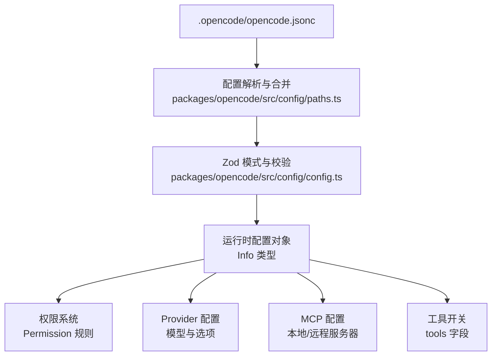
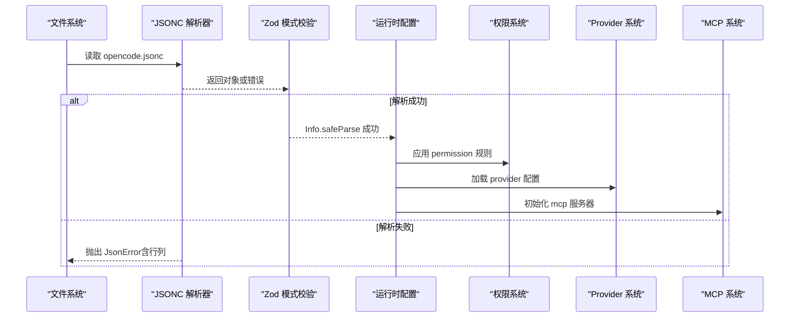
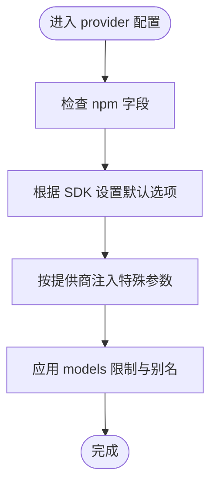
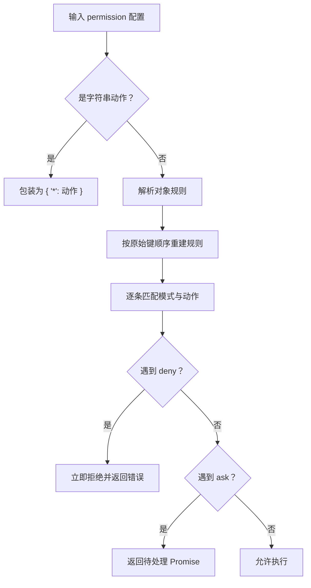
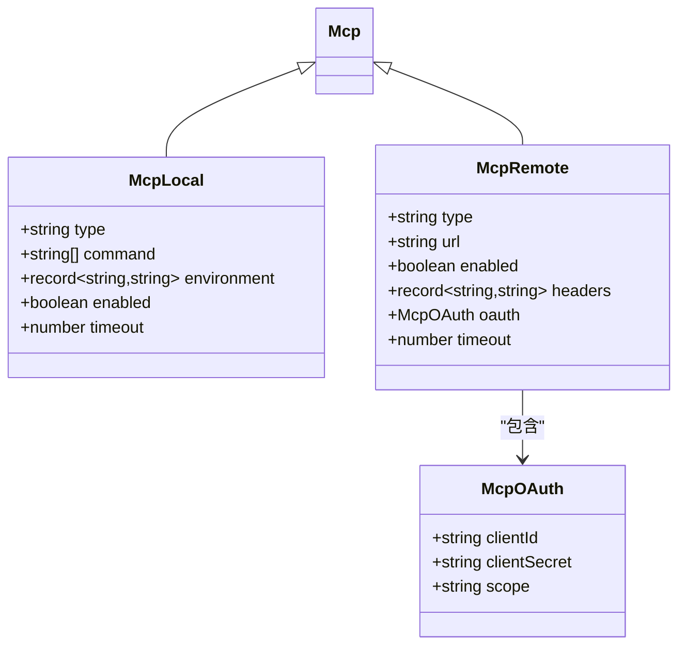
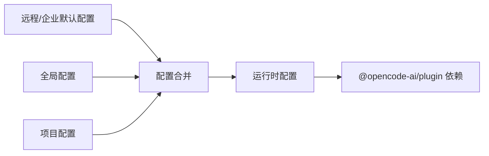

# 全局配置

<cite>
**本文引用的文件**
- [.opencode/opencode.jsonc](file://.opencode/opencode.jsonc)
- [packages/opencode/src/config/config.ts](file://packages/opencode/src/config/config.ts)
- [packages/opencode/src/config/paths.ts](file://packages/opencode/src/config/paths.ts)
- [packages/opencode/src/cli/error.ts](file://packages/opencode/src/cli/error.ts)
- [packages/opencode/src/provider/transform.ts](file://packages/opencode/src/provider/transform.ts)
- [packages/opencode/src/mcp/auth.ts](file://packages/opencode/src/mcp/auth.ts)
- [packages/opencode/src/mcp/index.ts](file://packages/opencode/src/mcp/index.ts)
- [packages/web/src/content/docs/tr/config.mdx](file://packages/web/src/content/docs/tr/config.mdx)
- [packages/web/src/content/docs/zh/providers.mdx](file://packages/web/src/content/docs/zh/providers.mdx)
- [packages/web/src/content/docs/bs/mcp-servers.mdx](file://packages/web/src/content/docs/bs/mcp-servers.mdx)
- [packages/opencode/test/config/config.test.ts](file://packages/opencode/test/config/config.test.ts)
- [packages/opencode/test/permission/next.test.ts](file://packages/opencode/test/permission/next.test.ts)
- [.opencode/package.json](file://.opencode/package.json)
</cite>

## 目录
1. [简介](#简介)
2. [项目结构](#项目结构)
3. [核心组件](#核心组件)
4. [架构总览](#架构总览)
5. [详细组件分析](#详细组件分析)
6. [依赖关系分析](#依赖关系分析)
7. [性能考量](#性能考量)
8. [故障排查指南](#故障排查指南)
9. [结论](#结论)
10. [附录](#附录)

## 简介
本文件面向使用者与维护者，系统化说明全局配置文件 .opencode/opencode.jsonc 的结构、字段语义、默认行为、可选值范围与验证规则，并重点解析以下主题：
- provider 提供商配置：如何为不同 AI 模型提供商（如 OpenAI 兼容、OpenRouter 等）进行参数配置与模型限制设置
- permission 权限系统：权限动作、规则对象、通配与优先级顺序的配置语法与执行逻辑
- tools 工具开关：对工具启用/禁用的影响范围与迁移路径
- mcp 配置：本地与远程 MCP 服务器的连接方式、认证与超时等参数
- JSON Schema 验证与错误提示：解析失败、校验失败时的定位信息与修复建议
- 完整示例与最佳实践：覆盖常见场景与企业级部署要点

## 项目结构
全局配置位于 .opencode 目录下的 opencode.jsonc 文件中，采用 JSONC 格式（支持注释），并由后端通过 Zod Schema 进行强类型校验与转换。

图表来源
- [packages/opencode/src/config/paths.ts:152-167](file://packages/opencode/src/config/paths.ts#L152-L167)
- [packages/opencode/src/config/config.ts:470-500](file://packages/opencode/src/config/config.ts#L470-L500)

章节来源
- [.opencode/opencode.jsonc:1-19](file://.opencode/opencode.jsonc#L1-L19)
- [packages/opencode/src/config/paths.ts:152-167](file://packages/opencode/src/config/paths.ts#L152-L167)

## 核心组件
- 配置文件与解析
  - 支持 JSONC 注释；解析失败会输出具体行列位置与上下文
  - 通过 Zod 模式进行严格校验，失败时抛出结构化错误
- 模式与类型
  - 使用 z.object、z.union、z.discriminatedUnion 等组合复杂结构
  - 对关键字段（如 Permission、Mcp）提供元数据 ref，便于文档生成与 IDE 提示
- 错误处理
  - CLI 层将 InvalidError 转换为人类可读的错误消息，包含问题路径与详细信息

章节来源
- [packages/opencode/src/config/config.ts:1094-1133](file://packages/opencode/src/config/config.ts#L1094-L1133)
- [packages/opencode/src/cli/error.ts:32-46](file://packages/opencode/src/cli/error.ts#L32-L46)

## 架构总览
下图展示从配置文件到运行时配置的关键流程，以及各子系统之间的交互：

图表来源
- [packages/opencode/src/config/paths.ts:152-167](file://packages/opencode/src/config/paths.ts#L152-L167)
- [packages/opencode/src/config/config.ts:470-500](file://packages/opencode/src/config/config.ts#L470-L500)

## 详细组件分析

### provider 配置
- 作用与位置
  - provider 用于声明 AI 模型提供商及其模型列表、SDK 包、基础 URL、API Key、自定义请求头等
  - 在 UI 中可通过 /models 命令查看已配置的提供商与模型
- 结构要点
  - npm：指定使用的 AI SDK 包（例如 OpenAI 兼容包）
  - name：在 UI 中显示的提供商名称
  - options：通用选项，如 baseURL、apiKey、headers
  - models：按模型名映射的模型配置，可包含 name 与 limit（如 context、output）
- 行为细节
  - 不同提供商可能有默认选项差异（例如某些 SDK 默认关闭 store）
  - 部分模型（如特定 Gemini）会自动注入 reasoning 或 usage 参数
  - 某些提供商（如 zai/zhipuai）在兼容包下会开启 thinking 功能
  - 与会话相关参数（如 promptCacheKey）会基于 sessionID 注入
- 示例参考
  - 可参考多语言文档中的提供商配置示例，了解 apiKey、headers、limit 等字段的设置方式

图表来源
- [packages/opencode/src/provider/transform.ts:746-787](file://packages/opencode/src/provider/transform.ts#L746-L787)
- [packages/opencode/src/provider/transform.ts:997-1046](file://packages/opencode/src/provider/transform.ts#L997-L1046)

章节来源
- [.opencode/opencode.jsonc:3-7](file://.opencode/opencode.jsonc#L3-L7)
- [packages/web/src/content/docs/zh/providers.mdx](file://packages/web/src/content/docs/zh/providers.mdx)
- [packages/opencode/src/provider/transform.ts:746-787](file://packages/opencode/src/provider/transform.ts#L746-L787)

### permission 权限系统
- 作用与位置
  - permission 控制各类操作（如 read、edit、bash、websearch 等）的权限动作
  - 支持字符串动作（allow/deny/ask）或对象规则（键为模式，值为动作）
- 语法与规则
  - 支持通配符模式（如 tools_*、reasoning_model_* 等）
  - 保留关键字：*、edit、write、external_directory、read、todowrite、thoughts_*、reasoning_model_*、tools_*、pr_comments_*
  - 动作优先级：allow > ask > deny；当存在多个匹配时，以“先匹配先生效”的顺序决定最终结果
- 关键行为
  - 保持原始键顺序（preserve key order），确保规则优先级明确
  - 支持对象形式的规则集，键为模式，值为动作或规则对象
- 测试与验证
  - 单测覆盖了键顺序保留、ask/allow/deny 的行为、以及混合规则的拒绝优先级

图表来源
- [packages/opencode/src/config/config.ts:470-500](file://packages/opencode/src/config/config.ts#L470-L500)
- [packages/opencode/src/config/config.ts:432-468](file://packages/opencode/src/config/config.ts#L432-L468)
- [packages/opencode/test/permission/next.test.ts:479-538](file://packages/opencode/test/permission/next.test.ts#L479-L538)

章节来源
- [.opencode/opencode.jsonc:8-12](file://.opencode/opencode.jsonc#L8-L12)
- [packages/opencode/src/config/config.ts:470-500](file://packages/opencode/src/config/config.ts#L470-L500)
- [packages/opencode/test/permission/next.test.ts:1074-1116](file://packages/opencode/test/permission/next.test.ts#L1074-L1116)

### tools 工具开关
- 作用与位置
  - tools 用于控制内置工具的启用/禁用（如 github-triage、github-pr-search）
- 影响范围
  - 旧版 Agent 配置中的 tools 字段会被自动迁移到 permission 字段
  - 具体映射规则：write/edit/patch/multiedit 统一映射到 edit 权限；其他工具映射到同名权限
- 最佳实践
  - 建议优先使用 permission 字段管理细粒度权限，避免直接依赖 tools 的迁移逻辑

章节来源
- [.opencode/opencode.jsonc:14-17](file://.opencode/opencode.jsonc#L14-L17)
- [packages/opencode/src/config/config.ts:520-607](file://packages/opencode/src/config/config.ts#L520-L607)

### mcp 配置
- 作用与位置
  - mcp 用于配置本地或远程 MCP 服务器，支持启动命令、URL、请求头、超时、OAuth 等
- 类型与字段
  - 本地 MCP（type: local）：command、environment、enabled、timeout
  - 远程 MCP（type: remote）：url、enabled、headers、oauth、timeout
  - OAuth：clientId、clientSecret、scope；可设为 false 禁用自动检测
- 认证与状态
  - 支持认证流程（authenticate、finishAuth）、移除认证（removeAuth）
  - 支持查询 OAuth 支持状态与存储令牌状态
- 示例参考
  - 多语言文档提供了远程 MCP 的配置示例与字段说明

图表来源
- [packages/opencode/src/config/config.ts:372-431](file://packages/opencode/src/config/config.ts#L372-L431)
- [packages/opencode/src/config/config.ts:393-406](file://packages/opencode/src/config/config.ts#L393-L406)

章节来源
- [.opencode/opencode.jsonc](file://.opencode/opencode.jsonc#L13)
- [packages/opencode/src/config/config.ts:372-431](file://packages/opencode/src/config/config.ts#L372-L431)
- [packages/opencode/src/mcp/auth.ts:160-173](file://packages/opencode/src/mcp/auth.ts#L160-L173)
- [packages/opencode/src/mcp/index.ts:909-921](file://packages/opencode/src/mcp/index.ts#L909-L921)
- [packages/web/src/content/docs/bs/mcp-servers.mdx:116-140](file://packages/web/src/content/docs/bs/mcp-servers.mdx#L116-L140)

## 依赖关系分析
- 配置加载与合并
  - 远程/企业默认配置最先加载，作为基线；随后加载全局与项目配置，逐层覆盖
  - 项目配置具有最高优先级，可覆盖远程与全局配置
- 插件与环境
  - .opencode/package.json 中声明了 @opencode-ai/plugin 依赖，用于扩展工具与能力
- 验证与错误
  - JSONC 解析错误会包含行列号与上下文行，便于快速定位
  - Zod 校验失败会输出结构化问题列表，CLI 层将其格式化为用户可读文本

图表来源
- [packages/web/src/content/docs/tr/config.mdx:64-112](file://packages/web/src/content/docs/tr/config.mdx#L64-L112)
- [.opencode/package.json:1-5](file://.opencode/package.json#L1-L5)

章节来源
- [packages/web/src/content/docs/tr/config.mdx:64-112](file://packages/web/src/content/docs/tr/config.mdx#L64-L112)
- [.opencode/package.json:1-5](file://.opencode/package.json#L1-L5)

## 性能考量
- 配置解析与校验
  - JSONC 解析与 Zod 校验均为内存与 CPU 密集型步骤，建议避免在热路径重复解析
  - 对大型配置文件，尽量减少不必要的嵌套与冗余字段
- MCP 请求超时
  - 为远程 MCP 服务器设置合理的 timeout，避免阻塞主流程
- Provider 选项
  - 合理设置 baseURL 与 headers，减少网络往返与鉴权失败重试

## 故障排查指南
- JSONC 解析错误
  - 现象：报错包含“解析错误”、“行列号”、“上下文行”
  - 排查：根据行列号定位问题行，检查逗号、引号、注释是否正确
- Zod 校验错误
  - 现象：InvalidError，包含 path 与 issues 列表
  - 排查：对照 schema 字段类型与必填项，修正类型不匹配或缺失字段
- 权限判定异常
  - 现象：ask 返回待决 Promise，deny 抛出拒绝错误
  - 排查：确认 permission 规则顺序与模式匹配，注意 deny 的优先级
- MCP 认证问题
  - 现象：无法连接远程 MCP 或认证失败
  - 排查：核对 url、headers、oauth 配置；使用认证接口检查状态与令牌更新

章节来源
- [packages/opencode/src/config/paths.ts:152-167](file://packages/opencode/src/config/paths.ts#L152-L167)
- [packages/opencode/src/config/config.ts:1094-1133](file://packages/opencode/src/config/config.ts#L1094-L1133)
- [packages/opencode/src/cli/error.ts:32-46](file://packages/opencode/src/cli/error.ts#L32-L46)
- [packages/opencode/test/permission/next.test.ts:518-538](file://packages/opencode/test/permission/next.test.ts#L518-L538)

## 结论
全局配置文件 .opencode/opencode.jsonc 通过严格的 Zod 模式与 JSONC 解析，为 provider、permission、tools、mcp 等关键领域提供了清晰、可验证且可扩展的配置入口。遵循本文档的结构、默认值、可选范围与验证规则，可有效降低配置风险并提升团队协作效率。

## 附录

### 配置文件示例与最佳实践
- 示例参考
  - provider 配置示例（含 npm、name、options、models）可参考多语言文档中的示例片段
  - mcp 配置示例（远程服务器）可参考多语言文档中的示例片段
- 最佳实践
  - 将企业默认配置置于远程/企业层，本地仅覆盖必要项
  - 使用 permission 明确列出规则并保持键顺序，避免模糊通配导致权限扩大
  - 对远程 MCP 设置合理超时与认证策略，定期轮换令牌
  - 将工具开关迁移至 permission，避免依赖旧版 tools 字段

章节来源
- [packages/web/src/content/docs/zh/providers.mdx](file://packages/web/src/content/docs/zh/providers.mdx)
- [packages/web/src/content/docs/bs/mcp-servers.mdx:116-140](file://packages/web/src/content/docs/bs/mcp-servers.mdx#L116-L140)
- [packages/web/src/content/docs/tr/config.mdx:64-112](file://packages/web/src/content/docs/tr/config.mdx#L64-L112)

### 配置项清单与默认值
- provider
  - 字段：opencode（示例空对象）、其他提供商对象（npm、name、options、models）
  - 默认值：未显式设置时不加载对应提供商
  - 可选值：npm 为 SDK 包名；options 支持 baseURL、apiKey、headers；models 支持 name、limit
- permission
  - 字段：read、edit、glob、grep、list、bash、task、external_directory、todowrite、question、webfetch、websearch、codesearch、lsp、doom_loop、skill 及通配键
  - 默认值：未设置时按规则顺序推断
  - 可选值：动作枚举（ask、allow、deny）
- tools
  - 字段：github-triage、github-pr-search 等
  - 默认值：未设置时按迁移逻辑推断
  - 可选值：布尔值
- mcp
  - 字段：type（local/remote）、command/environment（local）、url/headers/oauth/timeout（remote）
  - 默认值：未设置时按类型默认初始化
  - 可选值：布尔值 enabled；正整数 timeout；headers 为字符串到字符串映射

章节来源
- [.opencode/opencode.jsonc:1-19](file://.opencode/opencode.jsonc#L1-L19)
- [packages/opencode/src/config/config.ts:372-431](file://packages/opencode/src/config/config.ts#L372-L431)
- [packages/opencode/src/config/config.ts:470-500](file://packages/opencode/src/config/config.ts#L470-L500)
- [packages/opencode/src/config/config.ts:520-607](file://packages/opencode/src/config/config.ts#L520-L607)

### JSON Schema 验证机制与错误提示
- 验证机制
  - JSONC 解析阶段：捕获语法错误并输出行列号与上下文
  - Zod 校验阶段：对 Info 类型进行结构化校验，失败时输出 issues 列表
- 错误提示
  - CLI 层将 InvalidError 转换为可读文本，包含路径与问题字段路径
  - 建议在 CI 中捕获并打印错误，以便快速修复

章节来源
- [packages/opencode/src/config/paths.ts:152-167](file://packages/opencode/src/config/paths.ts#L152-L167)
- [packages/opencode/src/config/config.ts:1094-1133](file://packages/opencode/src/config/config.ts#L1094-L1133)
- [packages/opencode/src/cli/error.ts:32-46](file://packages/opencode/src/cli/error.ts#L32-L46)