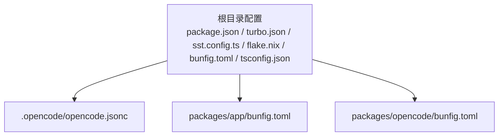
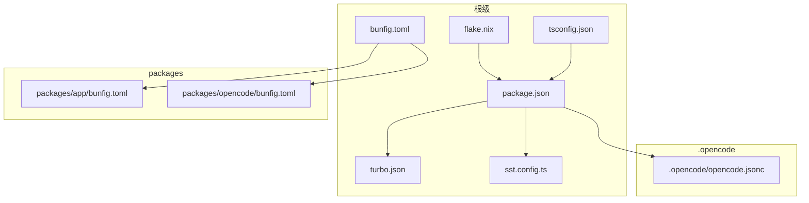
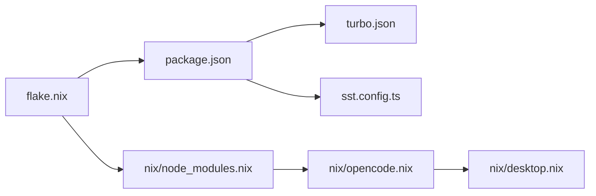

# 工作区配置

<cite>
**本文引用的文件**
- [.opencode/opencode.jsonc](file://.opencode/opencode.jsonc)
- [package.json](file://package.json)
- [turbo.json](file://turbo.json)
- [sst.config.ts](file://sst.config.ts)
- [flake.nix](file://flake.nix)
- [bunfig.toml](file://bunfig.toml)
- [packages/opencode/bunfig.toml](file://packages/opencode/bunfig.toml)
- [packages/app/bunfig.toml](file://packages/app/bunfig.toml)
- [nix/opencode.nix](file://nix/opencode.nix)
- [nix/node_modules.nix](file://nix/node_modules.nix)
- [nix/desktop.nix](file://nix/desktop.nix)
- [tsconfig.json](file://tsconfig.json)
</cite>

## 目录
1. [简介](#简介)
2. [项目结构](#项目结构)
3. [核心组件](#核心组件)
4. [架构总览](#架构总览)
5. [详细组件分析](#详细组件分析)
6. [依赖关系分析](#依赖关系分析)
7. [性能考量](#性能考量)
8. [故障排查指南](#故障排查指南)
9. [结论](#结论)
10. [附录](#附录)

## 简介
本文件系统性说明如何在项目根目录及子包中创建与管理工作区配置，覆盖以下主题：
- 配置文件格式与可用项
- 全局配置、工作区配置与命令行参数的合并与优先级
- 多项目工作区的配置管理策略
- 配置缓存与同步机制
- 冲突处理与最佳实践
- 模板与示例路径指引（以源码路径代替具体代码）

## 项目结构
该仓库采用 monorepo 结构，使用多种工具链协同工作：
- 根级包管理与工作区：通过根级 package.json 的 workspaces 字段声明工作区范围，并在 catalog 中集中管理依赖版本
- 构建与任务编排：通过 turbo.json 定义任务图谱与环境变量透传策略
- 平台部署：通过 sst.config.ts 配置应用与提供商
- Nix 打包与开发环境：通过 flake.nix 及若干 .nix 文件构建可复现的开发与发布流程
- Bun 配置：根级与各子包的 bunfig.toml 提供测试根目录、预加载脚本等配置
- TypeScript 基础配置：通过 tsconfig.json 继承统一的 TS 配置

图表来源
- [package.json:20-75](file://package.json#L20-L75)
- [turbo.json:1-32](file://turbo.json#L1-L32)
- [sst.config.ts:1-24](file://sst.config.ts#L1-L24)
- [flake.nix:1-77](file://flake.nix#L1-L77)
- [bunfig.toml:1-7](file://bunfig.toml#L1-L7)
- [.opencode/opencode.jsonc:1-19](file://.opencode/opencode.jsonc#L1-L19)
- [packages/app/bunfig.toml:1-4](file://packages/app/bunfig.toml#L1-L4)
- [packages/opencode/bunfig.toml:1-8](file://packages/opencode/bunfig.toml#L1-L8)

章节来源
- [package.json:1-124](file://package.json#L1-L124)
- [turbo.json:1-32](file://turbo.json#L1-L32)
- [sst.config.ts:1-24](file://sst.config.ts#L1-L24)
- [flake.nix:1-77](file://flake.nix#L1-L77)
- [bunfig.toml:1-7](file://bunfig.toml#L1-L7)
- [.opencode/opencode.jsonc:1-19](file://.opencode/opencode.jsonc#L1-L19)
- [packages/app/bunfig.toml:1-4](file://packages/app/bunfig.toml#L1-L4)
- [packages/opencode/bunfig.toml:1-8](file://packages/opencode/bunfig.toml#L1-L8)
- [tsconfig.json:1-6](file://tsconfig.json#L1-L6)

## 核心组件
- 根级工作区与包管理：根级 package.json 定义 workspaces 与 catalog，统一管理依赖版本与脚本
- 任务编排与缓存：turbo.json 定义任务依赖、输出缓存与环境变量透传
- 平台配置：sst.config.ts 定义应用名称、清理策略、保护级别与提供商
- Nix 开发与打包：flake.nix 提供开发 Shell 与包导出；nix/*.nix 负责安装、构建与封装
- Bun 配置：根级与子包的 bunfig.toml 控制测试根目录、预加载脚本等
- TypeScript 配置：tsconfig.json 继承统一 TS 规范

章节来源
- [package.json:20-75](file://package.json#L20-L75)
- [turbo.json:1-32](file://turbo.json#L1-L32)
- [sst.config.ts:3-23](file://sst.config.ts#L3-L23)
- [flake.nix:21-31](file://flake.nix#L21-L31)
- [nix/opencode.nix:16-53](file://nix/opencode.nix#L16-L53)
- [bunfig.toml:1-7](file://bunfig.toml#L1-L7)
- [packages/app/bunfig.toml:1-4](file://packages/app/bunfig.toml#L1-L4)
- [packages/opencode/bunfig.toml:1-8](file://packages/opencode/bunfig.toml#L1-L8)
- [tsconfig.json:1-6](file://tsconfig.json#L1-L6)

## 架构总览
下图展示工作区配置在不同层级的分布与交互：

图表来源
- [package.json:1-124](file://package.json#L1-L124)
- [turbo.json:1-32](file://turbo.json#L1-L32)
- [sst.config.ts:1-24](file://sst.config.ts#L1-L24)
- [flake.nix:1-77](file://flake.nix#L1-L77)
- [bunfig.toml:1-7](file://bunfig.toml#L1-L7)
- [tsconfig.json:1-6](file://tsconfig.json#L1-L6)
- [.opencode/opencode.jsonc:1-19](file://.opencode/opencode.jsonc#L1-L19)
- [packages/app/bunfig.toml:1-4](file://packages/app/bunfig.toml#L1-L4)
- [packages/opencode/bunfig.toml:1-8](file://packages/opencode/bunfig.toml#L1-L8)

## 详细组件分析

### 根级工作区与包管理（package.json）
- 工作区范围：通过 workspaces.packages 明确列出各子包路径，形成统一的 monorepo 边界
- 依赖目录：catalog 用于集中声明依赖版本，减少重复与漂移
- 脚本与条件运行：dev 脚本通过 --cwd 与条件选择器在不同子包间切换
- 依赖与覆盖：通过 catalog: 与 overrides 将版本锁定到 catalog，确保一致性

章节来源
- [package.json:20-75](file://package.json#L20-L75)
- [package.json:88-94](file://package.json#L88-L94)
- [package.json:113-122](file://package.json#L113-L122)

### 任务编排与缓存（turbo.json）
- 全局环境：globalEnv/globalPassThroughEnv 控制全局环境变量可见性
- 任务定义：为不同任务指定依赖与输出目录，便于缓存命中与增量构建
- CI 任务：为特定任务配置 CI 输出，确保产物可被流水线消费

章节来源
- [turbo.json:1-32](file://turbo.json#L1-L32)

### 平台部署配置（sst.config.ts）
- 应用元数据：名称、清理策略、保护级别
- 云提供商：Stripe、PlanetScale 等提供商密钥与版本
- 运行时导入：按阶段导入基础设施模块

章节来源
- [sst.config.ts:3-23](file://sst.config.ts#L3-L23)

### Nix 开发与打包（flake.nix 与 nix/*.nix）
- 开发 Shell：提供统一的开发环境（bun、nodejs、pkg-config、openssl、git 等）
- 包导出：为不同平台导出 opencode 与桌面应用包
- 覆盖层：通过 overlay 注入 node_modules 与桌面应用
- node_modules 构建：在 nix/node_modules.nix 中执行安装、规范化与哈希校验
- opencode 打包：在 nix/opencode.nix 中执行构建、安装与包装程序
- 桌面应用：在 nix/desktop.nix 中集成 Rust/Tauri 构建流程

章节来源
- [flake.nix:21-31](file://flake.nix#L21-L31)
- [nix/node_modules.nix:48-71](file://nix/node_modules.nix#L48-L71)
- [nix/opencode.nix:16-53](file://nix/opencode.nix#L16-L53)
- [nix/desktop.nix:26-101](file://nix/desktop.nix#L26-L101)

### Bun 配置（bunfig.toml 与子包）
- 根级安装策略：精确安装与测试根目录隔离
- 子包测试配置：app 与 opencode 子包分别设置测试根目录与预加载脚本
- 测试超时：通过脚本而非配置文件传递超时参数

章节来源
- [bunfig.toml:1-7](file://bunfig.toml#L1-L7)
- [packages/app/bunfig.toml:1-4](file://packages/app/bunfig.toml#L1-L4)
- [packages/opencode/bunfig.toml:1-8](file://packages/opencode/bunfig.toml#L1-L8)

### TypeScript 配置（tsconfig.json）
- 继承：通过 extends 使用统一的 TS 配置基线
- 编译选项：空对象占位，便于子包按需扩展

章节来源
- [tsconfig.json:1-6](file://tsconfig.json#L1-L6)

### 工作区配置文件格式与可用项
- JSON/JSONC：.opencode/opencode.jsonc 采用 JSONC 格式，支持注释与 schema 引用
- 关键字段示例：provider、permission、mcp、tools 等
- 用途：用于 AI/Agent 相关能力的提供方、权限控制、工具开关等

章节来源
- [.opencode/opencode.jsonc:1-19](file://.opencode/opencode.jsonc#L1-L19)

### 配置继承机制与优先级（合并策略）
- 层级顺序（从高到低）：命令行参数 > 工作区配置 > 全局配置
- 合并策略：
  - 对象字段：深度合并，子包配置覆盖同名键
  - 数组字段：通常采用替换或追加策略，具体取决于工具实现
  - 环境变量：通过 pass-through 与 globalEnv 控制可见性
- 实践建议：
  - 在根级定义默认值，子包仅覆盖差异部分
  - 使用 catalog 与 overrides 统一版本，避免分散覆盖

章节来源
- [turbo.json:3-4](file://turbo.json#L3-L4)
- [turbo.json:14-29](file://turbo.json#L14-L29)
- [package.json:27-74](file://package.json#L27-L74)
- [package.json:113-122](file://package.json#L113-L122)

### 不同项目类型的配置差异与特殊设置
- Web 应用（packages/app）：测试根目录指向 src，预加载 DOM 环境脚本
- CLI/工具（packages/opencode）：预加载 UI 预设脚本，测试根目录独立配置
- 桌面应用（packages/desktop）：通过 Nix 与 Tauri 构建，侧车二进制由 Nix 打包注入

章节来源
- [packages/app/bunfig.toml:1-4](file://packages/app/bunfig.toml#L1-L4)
- [packages/opencode/bunfig.toml:1-8](file://packages/opencode/bunfig.toml#L1-L8)
- [nix/desktop.nix:74-76](file://nix/desktop.nix#L74-L76)

### 多项目工作区的配置管理方案
- 分层治理：根级统一约束，子包按需扩展
- 任务编排：通过 turbo.json 的 dependsOn 与 outputs 管理跨包依赖与缓存
- 环境隔离：通过 pass-through 与 globalEnv 控制敏感变量
- 版本治理：通过 catalog 与 overrides 固化依赖版本

章节来源
- [package.json:20-75](file://package.json#L20-L75)
- [turbo.json:5-30](file://turbo.json#L5-L30)

### 配置缓存与同步机制
- Turbo 缓存：通过 tasks.*.outputs 定义产物目录，提升增量构建效率
- Nix 缓存：通过 outputHash 与递归哈希保证构建一致性与可复现性
- Bun 安装缓存：Nix 构建阶段临时设置安装缓存目录，加速依赖安装

章节来源
- [turbo.json:7-10](file://turbo.json#L7-L10)
- [nix/node_modules.nix:50-61](file://nix/node_modules.nix#L50-L61)

### 配置冲突的解决方案与最佳实践
- 冲突来源：不同层级同名键的覆盖、数组策略不一致、环境变量泄露
- 解决方案：
  - 明确优先级与合并策略，避免隐式覆盖
  - 使用 catalog 统一版本，减少分散 overrides
  - 严格控制 pass-through 范围，避免敏感信息外泄
- 最佳实践：
  - 在根级定义默认值，子包仅覆盖差异
  - 为 CI 任务单独配置输出，确保产物稳定
  - 使用 JSONC 注释记录配置意图与变更原因

章节来源
- [turbo.json:3-4](file://turbo.json#L3-L4)
- [turbo.json:14-29](file://turbo.json#L14-L29)
- [package.json:27-74](file://package.json#L27-L74)
- [package.json:113-122](file://package.json#L113-L122)

## 依赖关系分析
- 包管理依赖：package.json 的 workspaces 与 catalog 影响所有子包的依赖解析
- 构建依赖：turbo.json 的任务依赖决定构建顺序与缓存命中
- 平台依赖：sst.config.ts 导入基础设施模块，受 stage 与提供商配置影响
- Nix 依赖：flake.nix 的 overlay 与 nix/*.nix 的 derive 关系决定最终包与开发环境

图表来源
- [package.json:1-124](file://package.json#L1-L124)
- [turbo.json:1-32](file://turbo.json#L1-L32)
- [sst.config.ts:1-24](file://sst.config.ts#L1-L24)
- [flake.nix:1-77](file://flake.nix#L1-L77)
- [nix/node_modules.nix:1-86](file://nix/node_modules.nix#L1-L86)
- [nix/opencode.nix:1-102](file://nix/opencode.nix#L1-L102)
- [nix/desktop.nix:1-101](file://nix/desktop.nix#L1-L101)

章节来源
- [package.json:1-124](file://package.json#L1-L124)
- [turbo.json:1-32](file://turbo.json#L1-L32)
- [sst.config.ts:1-24](file://sst.config.ts#L1-L24)
- [flake.nix:1-77](file://flake.nix#L1-L77)
- [nix/node_modules.nix:1-86](file://nix/node_modules.nix#L1-L86)
- [nix/opencode.nix:1-102](file://nix/opencode.nix#L1-L102)
- [nix/desktop.nix:1-101](file://nix/desktop.nix#L1-L101)

## 性能考量
- 增量构建：通过 turbo.json 的 outputs 与 dependsOn 提升缓存命中率
- 依赖安装：Nix 构建阶段设置安装缓存目录，减少重复下载
- 平台适配：Nix 根据主机系统选择 CPU/OS 参数，避免不必要的重装
- 环境隔离：pass-through 与 globalEnv 控制变量范围，降低无效计算

章节来源
- [turbo.json:7-10](file://turbo.json#L7-L10)
- [nix/node_modules.nix:50-61](file://nix/node_modules.nix#L50-L61)
- [nix/node_modules.nix:18-19](file://nix/node_modules.nix#L18-L19)
- [turbo.json:3-4](file://turbo.json#L3-L4)

## 故障排查指南
- 依赖版本不一致：检查 package.json 的 catalog 与 overrides 是否正确
- 任务缓存异常：确认 turbo.json 的 outputs 与 dependsOn 是否匹配当前构建目标
- 平台构建失败：核对 flake.nix 与 nix/*.nix 的系统列表与依赖包是否齐全
- 测试环境问题：检查各包的 bunfig.toml 中的测试根目录与预加载脚本
- 配置未生效：确认配置文件路径与工具支持情况，必要时添加 JSON Schema 引用

章节来源
- [package.json:27-74](file://package.json#L27-L74)
- [turbo.json:5-30](file://turbo.json#L5-L30)
- [flake.nix:11-16](file://flake.nix#L11-L16)
- [packages/app/bunfig.toml:1-4](file://packages/app/bunfig.toml#L1-L4)
- [packages/opencode/bunfig.toml:1-8](file://packages/opencode/bunfig.toml#L1-L8)
- [.opencode/opencode.jsonc:1-19](file://.opencode/opencode.jsonc#L1-L19)

## 结论
本工作区通过多工具链协同实现了可复现、可扩展且高性能的配置体系。根级统一约束、子包差异化覆盖、任务缓存与 Nix 可复现性共同构成了稳定的工程基础。遵循本文的优先级与合并策略、版本治理与缓存设计，可在多项目场景下高效管理配置。

## 附录
- 配置模板与示例项目路径
  - 工作区配置模板：[package.json](file://package.json)
  - 任务编排模板：[turbo.json](file://turbo.json)
  - 平台部署模板：[sst.config.ts](file://sst.config.ts)
  - Nix 开发与打包模板：[flake.nix](file://flake.nix)、[nix/node_modules.nix](file://nix/node_modules.nix)、[nix/opencode.nix](file://nix/opencode.nix)、[nix/desktop.nix](file://nix/desktop.nix)
  - Bun 配置模板：[bunfig.toml](file://bunfig.toml)、[packages/app/bunfig.toml](file://packages/app/bunfig.toml)、[packages/opencode/bunfig.toml](file://packages/opencode/bunfig.toml)
  - TypeScript 基线模板：[tsconfig.json](file://tsconfig.json)
  - Agent/工具配置模板：[.opencode/opencode.jsonc](file://.opencode/opencode.jsonc)