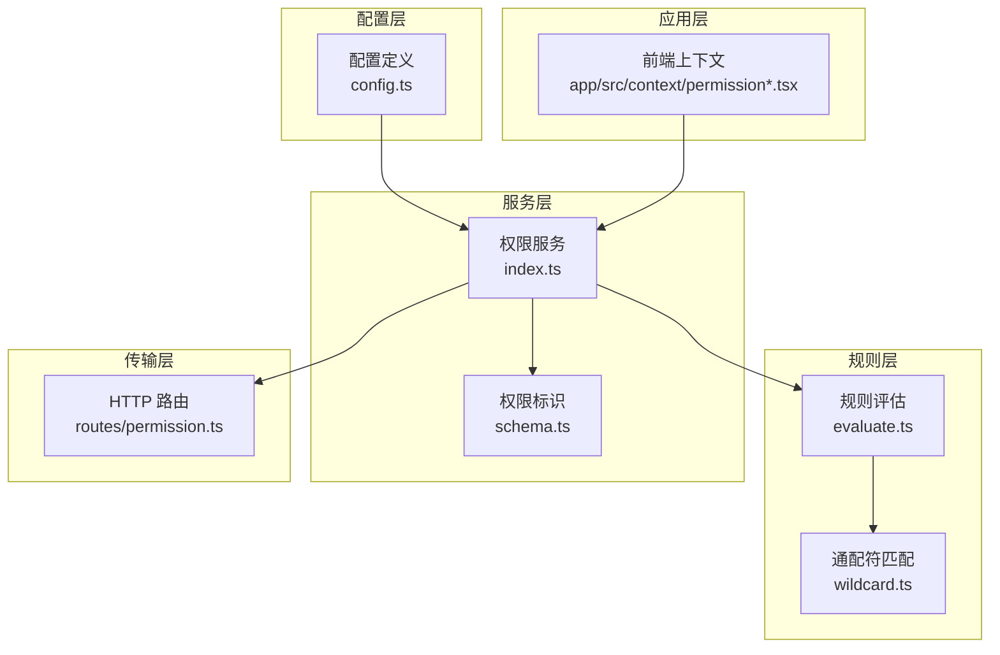
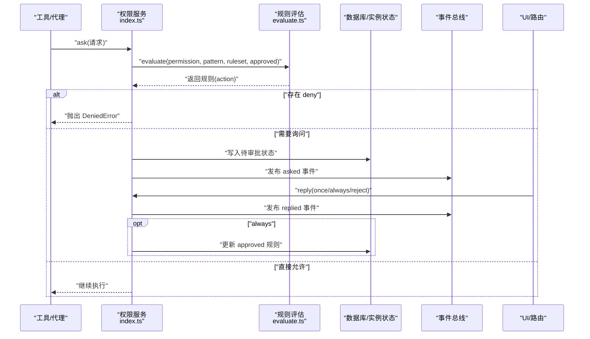
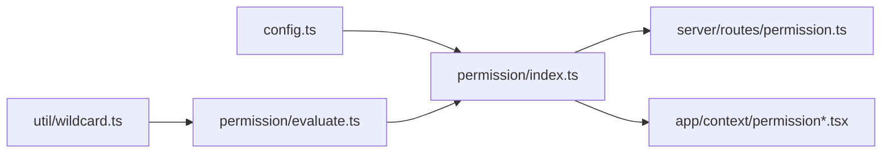
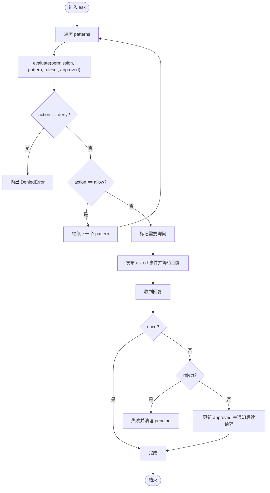

# 权限管理

<cite>
**本文引用的文件**
- [packages/opencode/src/permission/index.ts](file://packages/opencode/src/permission/index.ts)
- [packages/opencode/src/permission/evaluate.ts](file://packages/opencode/src/permission/evaluate.ts)
- [packages/opencode/src/permission/schema.ts](file://packages/opencode/src/permission/schema.ts)
- [packages/opencode/src/server/routes/permission.ts](file://packages/opencode/src/server/routes/permission.ts)
- [packages/opencode/src/config/config.ts](file://packages/opencode/src/config/config.ts)
- [packages/opencode/src/util/wildcard.ts](file://packages/opencode/src/util/wildcard.ts)
- [packages/web/src/content/docs/permissions.mdx](file://packages/web/src/content/docs/permissions.mdx)
- [packages/opencode/test/permission-task.test.ts](file://packages/opencode/test/permission-task.test.ts)
- [packages/opencode/test/permission/next.test.ts](file://packages/opencode/test/permission/next.test.ts)
- [packages/app/src/context/permission.tsx](file://packages/app/src/context/permission.tsx)
- [packages/app/src/context/permission-auto-respond.ts](file://packages/app/src/context/permission-auto-respond.ts)
- [packages/opencode/src/cli/cmd/debug/agent.ts](file://packages/opencode/src/cli/cmd/debug/agent.ts)
</cite>

## 目录
1. [简介](#简介)
2. [项目结构](#项目结构)
3. [核心组件](#核心组件)
4. [架构总览](#架构总览)
5. [详细组件分析](#详细组件分析)
6. [依赖关系分析](#依赖关系分析)
7. [性能考量](#性能考量)
8. [故障排查指南](#故障排查指南)
9. [结论](#结论)
10. [附录](#附录)

## 简介
本文件系统性阐述 OpenCode 的权限控制系统与配置方法，覆盖以下主题：
- 权限规则语法与表达式：路径匹配、操作类型、条件判断
- 内置权限类型与自定义权限的实现方式
- 权限检查执行流程与性能优化
- 不同场景下的权限配置示例（团队协作、代码审查、文件访问控制）
- 权限缓存与刷新机制
- 调试方法与常见问题解决方案
- 安全边界与防护措施

## 项目结构
OpenCode 的权限系统由“配置解析 → 规则评估 → 请求处理 → 会话交互 → 存储与持久化”构成，核心文件分布如下：
- 配置层：定义权限配置的结构与默认值，支持字符串简写与对象粒度规则
- 规则层：将配置转换为规则集，并通过通配符匹配进行评估
- 服务层：维护会话内待审批请求、已批准规则集，提供 ask/reply/list 接口
- 传输层：HTTP 路由暴露列表与回复接口
- 工具层：通配符匹配算法与键生成工具
- 文档与测试：官方文档与单元/集成测试覆盖典型用例

图表来源
- [packages/opencode/src/config/config.ts:470-500](file://packages/opencode/src/config/config.ts#L470-L500)
- [packages/opencode/src/permission/index.ts:133-136](file://packages/opencode/src/permission/index.ts#L133-L136)
- [packages/opencode/src/permission/evaluate.ts:9-15](file://packages/opencode/src/permission/evaluate.ts#L9-L15)
- [packages/opencode/src/util/wildcard.ts:4-20](file://packages/opencode/src/util/wildcard.ts#L4-L20)
- [packages/opencode/src/permission/schema.ts:7-17](file://packages/opencode/src/permission/schema.ts#L7-L17)
- [packages/opencode/src/server/routes/permission.ts:39-44](file://packages/opencode/src/server/routes/permission.ts#L39-L44)
- [packages/app/src/context/permission.tsx:120-124](file://packages/app/src/context/permission.tsx#L120-L124)

章节来源
- [packages/opencode/src/config/config.ts:470-500](file://packages/opencode/src/config/config.ts#L470-L500)
- [packages/opencode/src/permission/index.ts:133-136](file://packages/opencode/src/permission/index.ts#L133-L136)
- [packages/opencode/src/permission/evaluate.ts:9-15](file://packages/opencode/src/permission/evaluate.ts#L9-L15)
- [packages/opencode/src/util/wildcard.ts:4-20](file://packages/opencode/src/util/wildcard.ts#L4-L20)
- [packages/opencode/src/permission/schema.ts:7-17](file://packages/opencode/src/permission/schema.ts#L7-L17)
- [packages/opencode/src/server/routes/permission.ts:39-44](file://packages/opencode/src/server/routes/permission.ts#L39-L44)
- [packages/app/src/context/permission.tsx:120-124](file://packages/app/src/context/permission.tsx#L120-L124)

## 核心组件
- 权限动作 Action：允许（allow）、拒绝（deny）、询问（ask）
- 权限规则 Rule：permission（权限名）、pattern（模式串）、action（动作）
- 规则集 Ruleset：规则数组
- 请求 Request：包含 id、sessionID、permission、patterns、metadata、always、tool 等字段
- 回复 Reply：一次性（once）、总是（always）、拒绝（reject）
- 错误类型：被拒绝（RejectedError）、更正反馈（CorrectedError）、被禁止（DeniedError）

章节来源
- [packages/opencode/src/permission/index.ts:22-41](file://packages/opencode/src/permission/index.ts#L22-L41)
- [packages/opencode/src/permission/index.ts:43-61](file://packages/opencode/src/permission/index.ts#L43-L61)
- [packages/opencode/src/permission/index.ts:63-64](file://packages/opencode/src/permission/index.ts#L63-L64)
- [packages/opencode/src/permission/index.ts:83-105](file://packages/opencode/src/permission/index.ts#L83-L105)

## 架构总览
权限系统采用“配置 → 规则 → 评估 → 服务 → 路由”的分层设计。配置层负责解析用户配置；规则层负责将配置转换为规则集并进行匹配；服务层维护状态（待审批请求与已批准规则），并通过事件总线与 UI 交互；路由层提供 HTTP 接口以供外部调用。

图表来源
- [packages/opencode/src/permission/index.ts:167-202](file://packages/opencode/src/permission/index.ts#L167-L202)
- [packages/opencode/src/permission/evaluate.ts:9-15](file://packages/opencode/src/permission/evaluate.ts#L9-L15)
- [packages/opencode/src/server/routes/permission.ts:39-44](file://packages/opencode/src/server/routes/permission.ts#L39-L44)

## 详细组件分析

### 配置与规则语法
- 支持两种配置形式：
  - 字符串简写：对某个权限整体设置 ask/allow/deny
  - 对象粒度：按 pattern 设置具体动作，支持通配符
- 关键字段与默认行为：
  - 全局通配符“*”可作为兜底规则
  - 外部目录 external_directory 用于放宽工作区外路径访问
  - 默认策略：大多数权限默认允许；doom_loop 与 external_directory 默认询问
  - read 默认允许，但 .env 系列文件默认拒绝（可通过显式规则覆盖）

章节来源
- [packages/opencode/src/config/config.ts:470-500](file://packages/opencode/src/config/config.ts#L470-L500)
- [packages/web/src/content/docs/permissions.mdx:26-44](file://packages/web/src/content/docs/permissions.mdx#L26-L44)
- [packages/web/src/content/docs/permissions.mdx:81-87](file://packages/web/src/content/docs/permissions.mdx#L81-L87)
- [packages/web/src/content/docs/permissions.mdx:149-168](file://packages/web/src/content/docs/permissions.mdx#L149-L168)

### 规则评估与匹配
- 匹配逻辑：
  - 使用通配符匹配 permission 与 pattern
  - 采用“最后匹配规则胜出”的策略（findLast）
  - 若无匹配，默认返回 ask 动作
- 通配符规则：
  - * 匹配任意字符序列
  - ? 匹配单个字符
  - 结尾“ *”会被特殊处理，使命令参数可选匹配（如 ls 匹配 ls 或 ls -la）

章节来源
- [packages/opencode/src/permission/evaluate.ts:9-15](file://packages/opencode/src/permission/evaluate.ts#L9-L15)
- [packages/opencode/src/util/wildcard.ts:4-20](file://packages/opencode/src/util/wildcard.ts#L4-L20)

### 权限服务与状态管理
- 状态组成：
  - pending：待审批请求映射（PermissionID → 请求信息与 Deferred）
  - approved：已批准规则集（全局/会话级）
- 核心能力：
  - ask：遍历 patterns，逐条评估；若发现 deny 则抛出 DeniedError；否则发布 asked 事件并等待回复
  - reply：根据回复类型（once/always/reject）处理 Deferred，并在 always 情况下更新 approved
  - list：列出所有待审批请求
- 生命周期与清理：
  - 实例销毁时，未处理的待审批请求统一失败并清空

章节来源
- [packages/opencode/src/permission/index.ts:128-131](file://packages/opencode/src/permission/index.ts#L128-L131)
- [packages/opencode/src/permission/index.ts:167-202](file://packages/opencode/src/permission/index.ts#L167-L202)
- [packages/opencode/src/permission/index.ts:204-260](file://packages/opencode/src/permission/index.ts#L204-L260)
- [packages/opencode/src/permission/index.ts:262-265](file://packages/opencode/src/permission/index.ts#L262-L265)
- [packages/opencode/src/permission/index.ts:144-165](file://packages/opencode/src/permission/index.ts#L144-L165)

### HTTP 路由与 UI 交互
- GET /：列出所有待审批请求
- POST /:requestID/reply：对指定请求进行回复（once/always/reject）
- UI 自动应答：基于会话链路与目录键，自动决定是否跳过弹窗

章节来源
- [packages/opencode/src/server/routes/permission.ts:9-70](file://packages/opencode/src/server/routes/permission.ts#L9-L70)
- [packages/app/src/context/permission.tsx:120-124](file://packages/app/src/context/permission.tsx#L120-L124)
- [packages/app/src/context/permission-auto-respond.ts:41-51](file://packages/app/src/context/permission-auto-respond.ts#L41-L51)

### 权限 ID 与标识
- PermissionID：基于升序标识符生成，确保请求唯一性与排序稳定性
- 支持从字符串构造与升序生成

章节来源
- [packages/opencode/src/permission/schema.ts:7-17](file://packages/opencode/src/permission/schema.ts#L7-L17)

### 集成测试与用例验证
- 任务权限（task）：覆盖 wildcard、ask/allow/deny、全局 deny 导致工具禁用等场景
- 多实例/多会话：跨目录并发 ask/reply 行为与拒绝传播
- CLI 调试：在调试工具运行前先评估规则，遇 deny 直接抛错

章节来源
- [packages/opencode/test/permission-task.test.ts:11-72](file://packages/opencode/test/permission-task.test.ts#L11-L72)
- [packages/opencode/test/permission-task.test.ts:74-142](file://packages/opencode/test/permission-task.test.ts#L74-L142)
- [packages/opencode/test/permission/next.test.ts:917-970](file://packages/opencode/test/permission/next.test.ts#L917-L970)
- [packages/opencode/src/cli/cmd/debug/agent.ts:158-166](file://packages/opencode/src/cli/cmd/debug/agent.ts#L158-L166)

## 依赖关系分析
- 组件耦合：
  - 服务层依赖配置层（fromConfig）、规则层（evaluate）、存储层（InstanceState/DB）
  - 评估层依赖通配符工具
  - 路由层依赖服务层
  - UI 上下文依赖服务层与事件总线
- 可能的循环依赖：
  - 当前结构清晰，未见直接循环导入
- 外部依赖：
  - effect（ServiceMap/Layer/Deferred/Effect）
  - hono（路由）
  - zod（配置校验）

图表来源
- [packages/opencode/src/config/config.ts:470-500](file://packages/opencode/src/config/config.ts#L470-L500)
- [packages/opencode/src/permission/index.ts:133-136](file://packages/opencode/src/permission/index.ts#L133-L136)
- [packages/opencode/src/permission/evaluate.ts:9-15](file://packages/opencode/src/permission/evaluate.ts#L9-L15)
- [packages/opencode/src/util/wildcard.ts:4-20](file://packages/opencode/src/util/wildcard.ts#L4-L20)
- [packages/opencode/src/server/routes/permission.ts:39-44](file://packages/opencode/src/server/routes/permission.ts#L39-L44)
- [packages/app/src/context/permission.tsx:120-124](file://packages/app/src/context/permission.tsx#L120-L124)

## 性能考量
- 评估复杂度：
  - 规则评估为线性扫描（findLast），时间复杂度 O(R)，R 为规则数量
  - 建议将兜底规则置于末尾，避免不必要的多次匹配
- 匹配效率：
  - 通配符预编译为正则，平台差异（大小写/换行）通过标志位处理
- 并发与内存：
  - pending 映射在实例销毁时统一清理，防止泄漏
  - UI 自动应答使用 TTL 与上限裁剪，避免无限增长

章节来源
- [packages/opencode/src/permission/evaluate.ts:9-15](file://packages/opencode/src/permission/evaluate.ts#L9-L15)
- [packages/opencode/src/util/wildcard.ts:4-20](file://packages/opencode/src/util/wildcard.ts#L4-L20)
- [packages/app/src/context/permission.tsx:103-118](file://packages/app/src/context/permission.tsx#L103-L118)

## 故障排查指南
- 常见错误类型与定位
  - DeniedError：规则集中存在 deny，需检查对应 permission/pattern
  - RejectedError/CorrectedError：用户拒绝或带反馈拒绝，需检查 UI 回复
- 调试建议
  - 在 CLI 调试工具中提前评估规则，快速定位 deny
  - 查看日志中的 evaluate 输入与规则集
  - 使用路由列出待审批请求，确认 pending 状态
- 常见问题
  - 问号与星号含义混淆：确认“*”匹配任意，“?”仅匹配单字符
  - 外部目录未放行：即使使用 ~/$HOME，仍需 external_directory 规则
  - 全局 deny 导致工具禁用：disabled() 仅在 pattern:* 且 action:deny 时禁用工具

章节来源
- [packages/opencode/src/permission/index.ts:83-105](file://packages/opencode/src/permission/index.ts#L83-L105)
- [packages/opencode/src/cli/cmd/debug/agent.ts:158-166](file://packages/opencode/src/cli/cmd/debug/agent.ts#L158-L166)
- [packages/opencode/src/server/routes/permission.ts:64-67](file://packages/opencode/src/server/routes/permission.ts#L64-L67)
- [packages/web/src/content/docs/permissions.mdx:73-87](file://packages/web/src/content/docs/permissions.mdx#L73-L87)
- [packages/web/src/content/docs/permissions.mdx:89-124](file://packages/web/src/content/docs/permissions.mdx#L89-L124)

## 结论
OpenCode 的权限系统以“配置即规则、规则即策略”的理念构建，通过通配符匹配与“最后规则胜出”原则实现灵活而可控的授权模型。其分层设计保证了可扩展性与可维护性，结合 UI 自动应答与事件总线，实现了良好的用户体验与可观测性。建议在生产环境中：
- 明确兜底规则顺序，优先放置宽松规则
- 外部目录访问严格控制，配合 read 默认策略
- 使用 always 时谨慎，避免过度放宽
- 借助测试用例覆盖关键路径，保障变更质量

## 附录

### 场景化配置示例（思路与要点）
- 团队协作
  - 将 edit 设为 ask，bash 的安全前缀设为 allow，其余设为 ask
  - 使用 external_directory 限定可信路径
- 代码审查
  - task 中对特定子代理（如 code-reviewer）设为 deny，其余默认 ask
  - read 默认允许，敏感文件（.env）显式 deny
- 文件访问控制
  - glob/grep/list 精细化到目录层级
  - 使用 ~/$HOME 展开简化规则书写

章节来源
- [packages/web/src/content/docs/permissions.mdx:128-146](file://packages/web/src/content/docs/permissions.mdx#L128-L146)
- [packages/web/src/content/docs/permissions.mdx:149-168](file://packages/web/src/content/docs/permissions.mdx#L149-L168)
- [packages/web/src/content/docs/permissions.mdx:192-218](file://packages/web/src/content/docs/permissions.mdx#L192-L218)

### 权限检查执行流程（代码级）

图表来源
- [packages/opencode/src/permission/index.ts:167-202](file://packages/opencode/src/permission/index.ts#L167-L202)
- [packages/opencode/src/permission/index.ts:204-260](file://packages/opencode/src/permission/index.ts#L204-L260)
- [packages/opencode/src/permission/evaluate.ts:9-15](file://packages/opencode/src/permission/evaluate.ts#L9-L15)