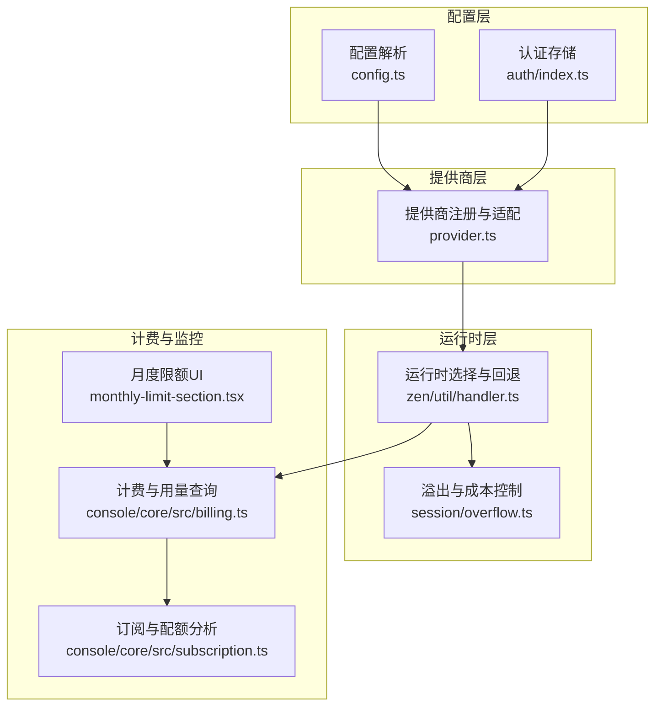
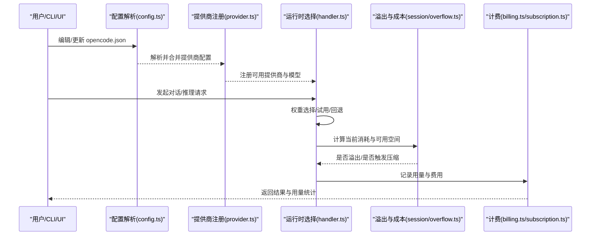
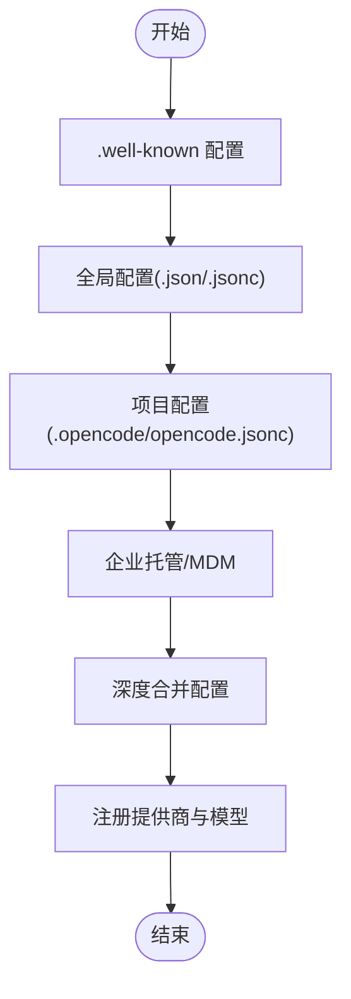
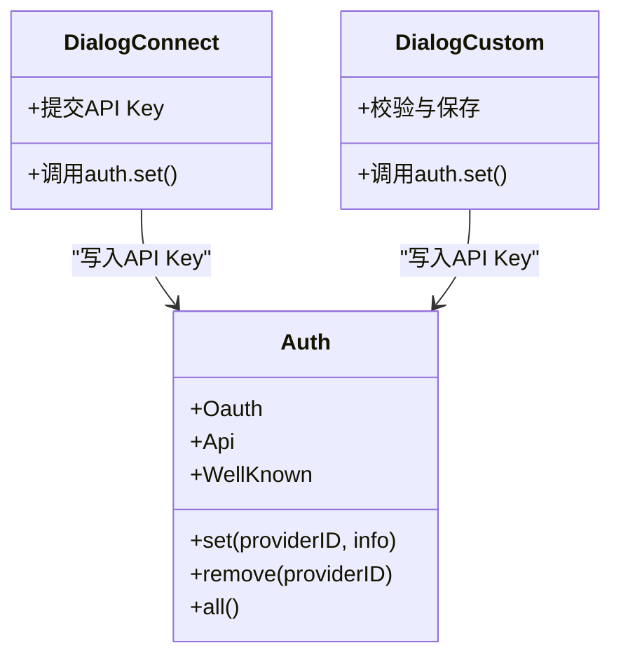
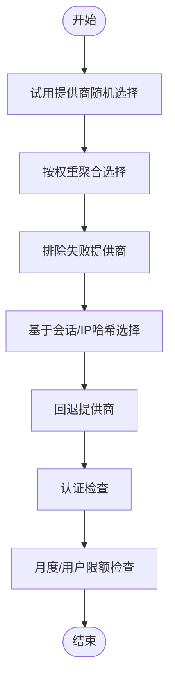
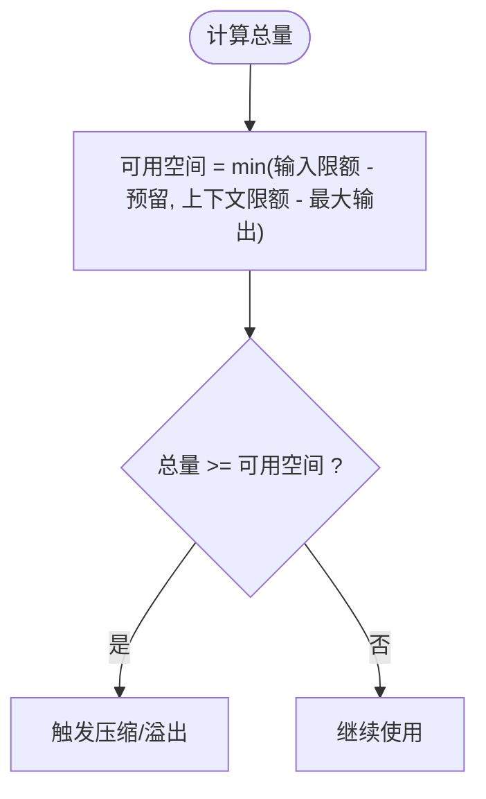
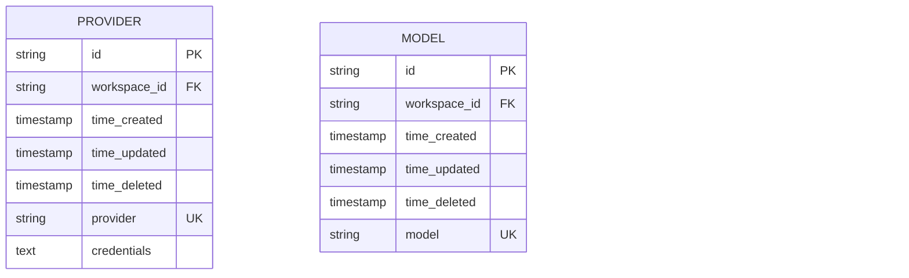
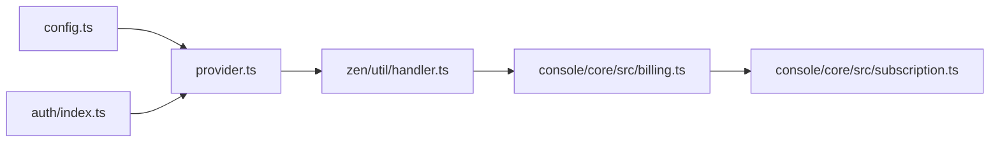

# 模型提供商配置

<cite>
**本文引用的文件**
- [packages/opencode/src/provider/provider.ts](file://packages/opencode/src/provider/provider.ts)
- [packages/opencode/src/config/config.ts](file://packages/opencode/src/config/config.ts)
- [packages/opencode/src/auth/index.ts](file://packages/opencode/src/auth/index.ts)
- [packages/console/app/src/routes/zen/util/handler.ts](file://packages/console/app/src/routes/zen/util/handler.ts)
- [packages/console/app/src/routes/workspace/[id]/billing/monthly-limit-section.tsx](file://packages/console/app/src/routes/workspace/[id]/billing/monthly-limit-section.tsx)
- [packages/console/core/migrations/20250915172014_bright_photon/migration.sql](file://packages/console/core/migrations/20250915172014_bright_photon/migration.sql)
- [packages/console/core/migrations/20250911231144_jazzy_skrulls/migration.sql](file://packages/console/core/migrations/20250911231144_jazzy_skrulls/migration.sql)
- [packages/console/core/migrations/20251007230438_ordinary_ultragirl/migration.sql](file://packages/console/core/migrations/20251007230438_ordinary_ultragirl/migration.sql)
- [packages/console/core/src/subscription.ts](file://packages/console/core/src/subscription.ts)
- [packages/console/app/src/routes/workspace/[id]/usage/usage-section.tsx](file://packages/console/app/src/routes/workspace/[id]/usage/usage-section.tsx)
- [packages/console/core/src/billing.ts](file://packages/console/core/src/billing.ts)
- [packages/opencode/src/session/overflow.ts](file://packages/opencode/src/session/overflow.ts)
- [packages/app/src/components/dialog-custom-provider.tsx](file://packages/app/src/components/dialog-custom-provider.tsx)
- [packages/app/src/components/dialog-connect-provider.tsx](file://packages/app/src/components/dialog-connect-provider.tsx)
- [packages/opencode/test/provider/provider.test.ts](file://packages/opencode/test/provider/provider.test.ts)
- [packages/web/src/content/docs/de/providers.mdx](file://packages/web/src/content/docs/de/providers.mdx)
- [.opencode/opencode.jsonc](file://.opencode/opencode.jsonc)
</cite>

## 目录
1. [简介](#简介)
2. [项目结构](#项目结构)
3. [核心组件](#核心组件)
4. [架构总览](#架构总览)
5. [详细组件分析](#详细组件分析)
6. [依赖关系分析](#依赖关系分析)
7. [性能考量](#性能考量)
8. [故障排除指南](#故障排除指南)
9. [结论](#结论)
10. [附录](#附录)

## 简介
本文件面向需要在系统中配置与管理多种 AI 模型提供商（如 OpenAI、Anthropic、Google 等）的用户与工程师，提供从配置到运行时行为、从认证与安全到成本控制与版本迁移的完整说明。内容覆盖：
- 如何为不同提供商配置选项、模型清单与变体
- API 密钥与认证的存储与使用
- 模型选择、参数调优与成本控制策略
- 多提供商并行与负载均衡、切换与回退机制
- 配额与用量监控、月度限额与计费
- 配置版本管理与迁移策略
- 常见问题排查与性能优化建议

## 项目结构
围绕“模型提供商配置”的关键模块包括：
- 配置解析与合并：负责读取全局与项目级配置、远程配置、企业托管配置等来源，统一合并为最终生效配置
- 提供商注册与适配：内置多家 SDK 提供商，按需加载与自定义扩展
- 认证与密钥管理：集中存储与访问各类提供商的凭据
- 运行时选择与回退：根据会话标识、权重与试用策略选择提供商，支持回退与重试
- 成本与配额：基于模型限额与用量进行溢出检测与费用计算
- 数据迁移：对历史数据与表结构进行迁移以支持新的配置与计费模型

图表来源
- [packages/opencode/src/config/config.ts:1144-1538](file://packages/opencode/src/config/config.ts#L1144-L1538)
- [packages/opencode/src/auth/index.ts:1-42](file://packages/opencode/src/auth/index.ts#L1-L42)
- [packages/opencode/src/provider/provider.ts:127-150](file://packages/opencode/src/provider/provider.ts#L127-L150)
- [packages/console/app/src/routes/zen/util/handler.ts:441-471](file://packages/console/app/src/routes/zen/util/handler.ts#L441-L471)
- [packages/opencode/src/session/overflow.ts:1-22](file://packages/opencode/src/session/overflow.ts#L1-L22)
- [packages/console/core/src/billing.ts:48-65](file://packages/console/core/src/billing.ts#L48-L65)
- [packages/console/core/src/subscription.ts:49-155](file://packages/console/core/src/subscription.ts#L49-L155)
- [packages/console/app/src/routes/workspace/[id]/billing/monthly-limit-section.tsx](file://packages/console/app/src/routes/workspace/[id]/billing/monthly-limit-section.tsx#L1-L36)

章节来源
- [packages/opencode/src/config/config.ts:1144-1538](file://packages/opencode/src/config/config.ts#L1144-L1538)
- [packages/opencode/src/provider/provider.ts:127-150](file://packages/opencode/src/provider/provider.ts#L127-L150)
- [packages/opencode/src/auth/index.ts:1-42](file://packages/opencode/src/auth/index.ts#L1-L42)
- [packages/console/app/src/routes/zen/util/handler.ts:441-471](file://packages/console/app/src/routes/zen/util/handler.ts#L441-L471)
- [packages/opencode/src/session/overflow.ts:1-22](file://packages/opencode/src/session/overflow.ts#L1-L22)
- [packages/console/core/src/billing.ts:48-65](file://packages/console/core/src/billing.ts#L48-L65)
- [packages/console/core/src/subscription.ts:49-155](file://packages/console/core/src/subscription.ts#L49-L155)
- [packages/console/app/src/routes/workspace/[id]/billing/monthly-limit-section.tsx](file://packages/console/app/src/routes/workspace/[id]/billing/monthly-limit-section.tsx#L1-L36)

## 核心组件
- 配置解析与合并
  - 支持多源配置：本地项目、全局、远程 .well-known、企业托管、macOS MDM 等
  - 合并策略：数组字段去重拼接、对象深度合并、保留原始键序
  - 关键字段：provider（提供商配置）、enabled_providers/disabled_providers（启用/禁用列表）、model/small_model 默认模型、compaction 自动压缩参数等
- 提供商注册与适配
  - 内置多家 SDK 提供商（OpenAI、Anthropic、Google、Azure、Bedrock、OpenRouter、Vercel 等）
  - 按提供商类型注入默认头部、区域/端点、模型前缀规则、获取模型句柄的差异逻辑
  - 支持自定义提供商（通过 npm 包名与 options/baseURL/apiKey/headers 等）
- 认证与密钥管理
  - 存储格式：OAuth、API Key、WellKnown（远程令牌）
  - UI 与命令行均可写入；删除时自动清理尾斜杠键
- 运行时选择与回退
  - 基于会话 ID 或 IP 的哈希选择权重聚合的提供商
  - 支持试用提供商随机挑选、回退提供商、排除失败提供商
- 成本与配额
  - 模型维度限额：上下文、输入、输出
  - 溢出检测：根据可用空间与预留缓冲判断是否触发压缩
  - 用量与计费：按微美分记录，支持周/月滚动窗口与固定限额

章节来源
- [packages/opencode/src/config/config.ts:848-1043](file://packages/opencode/src/config/config.ts#L848-L1043)
- [packages/opencode/src/provider/provider.ts:127-150](file://packages/opencode/src/provider/provider.ts#L127-L150)
- [packages/opencode/src/auth/index.ts:14-42](file://packages/opencode/src/auth/index.ts#L14-L42)
- [packages/console/app/src/routes/zen/util/handler.ts:441-471](file://packages/console/app/src/routes/zen/util/handler.ts#L441-L471)
- [packages/opencode/src/session/overflow.ts:1-22](file://packages/opencode/src/session/overflow.ts#L1-L22)

## 架构总览
下图展示从配置到运行时选择、再到计费与监控的整体流程。

图表来源
- [packages/opencode/src/config/config.ts:1144-1538](file://packages/opencode/src/config/config.ts#L1144-L1538)
- [packages/opencode/src/provider/provider.ts:127-150](file://packages/opencode/src/provider/provider.ts#L127-L150)
- [packages/console/app/src/routes/zen/util/handler.ts:441-471](file://packages/console/app/src/routes/zen/util/handler.ts#L441-L471)
- [packages/opencode/src/session/overflow.ts:1-22](file://packages/opencode/src/session/overflow.ts#L1-L22)
- [packages/console/core/src/billing.ts:48-65](file://packages/console/core/src/billing.ts#L48-L65)
- [packages/console/core/src/subscription.ts:49-155](file://packages/console/core/src/subscription.ts#L49-L155)

## 详细组件分析

### 配置与提供商注册
- 配置来源与优先级
  - 远程 .well-known 配置（可被全局/项目配置覆盖）
  - 全局配置目录（支持 .json/.jsonc）
  - 项目内 .opencode/opencode.json/opencode.jsonc
  - 企业托管目录与 macOS MDM
  - 合并后生成最终配置，含 provider、model、agent、compaction 等
- 提供商注册
  - 内置 SDK 映射与按提供商的自定义加载器（注入默认头部、区域、端点、模型前缀等）
  - 支持自定义提供商：指定 npm 包名与 options（baseURL、apiKey、headers 等）

图表来源
- [packages/opencode/src/config/config.ts:1290-1414](file://packages/opencode/src/config/config.ts#L1290-L1414)
- [packages/opencode/src/provider/provider.ts:127-150](file://packages/opencode/src/provider/provider.ts#L127-L150)

章节来源
- [packages/opencode/src/config/config.ts:1144-1538](file://packages/opencode/src/config/config.ts#L1144-L1538)
- [packages/opencode/src/provider/provider.ts:127-150](file://packages/opencode/src/provider/provider.ts#L127-L150)

### 认证与密钥管理
- 支持三种认证类型：OAuth、API Key、WellKnown（远程令牌）
- UI/命令行写入后，系统自动规范化键名（去除尾斜杠），并支持删除时清理冗余键
- 对于某些提供商（如 GitHub Copilot、Bedrock、Google Vertex 等），系统会注入特定头部或凭据链

图表来源
- [packages/opencode/src/auth/index.ts:14-42](file://packages/opencode/src/auth/index.ts#L14-L42)
- [packages/app/src/components/dialog-connect-provider.tsx:402-420](file://packages/app/src/components/dialog-connect-provider.tsx#L402-L420)
- [packages/app/src/components/dialog-custom-provider.tsx:104-132](file://packages/app/src/components/dialog-custom-provider.tsx#L104-L132)

章节来源
- [packages/opencode/src/auth/index.ts:1-42](file://packages/opencode/src/auth/index.ts#L1-L42)
- [packages/app/src/components/dialog-connect-provider.tsx:402-420](file://packages/app/src/components/dialog-connect-provider.tsx#L402-L420)
- [packages/app/src/components/dialog-custom-provider.tsx:104-132](file://packages/app/src/components/dialog-custom-provider.tsx#L104-L132)

### 运行时选择、负载均衡与回退
- 选择策略
  - 试用提供商随机挑选
  - 基于会话 ID 最后 4 字符的哈希，按权重聚合选择
  - 排除已失败提供商，避免重复失败
  - 回退提供商兜底
- 认证与匿名策略
  - 若未提供有效 API Key 且不允许匿名，则抛出错误
- 月度限额与用户限额
  - 当当月累计用量达到限额时，抛出相应错误

图表来源
- [packages/console/app/src/routes/zen/util/handler.ts:441-471](file://packages/console/app/src/routes/zen/util/handler.ts#L441-L471)
- [packages/console/app/src/routes/zen/util/handler.ts:743-783](file://packages/console/app/src/routes/zen/util/handler.ts#L743-L783)

章节来源
- [packages/console/app/src/routes/zen/util/handler.ts:441-471](file://packages/console/app/src/routes/zen/util/handler.ts#L441-L471)
- [packages/console/app/src/routes/zen/util/handler.ts:743-783](file://packages/console/app/src/routes/zen/util/handler.ts#L743-L783)

### 成本控制与溢出检测
- 模型限额
  - 上下文、输入、输出三类限额
  - 变体与默认值处理：未指定时默认为 0，测试用例验证默认成本为 0
- 溢出检测
  - 使用预留缓冲（默认 20K 或模型最大输出）计算可用空间
  - 当输入/输出/缓存读写总和达到可用空间时触发压缩或报错
- 计费与用量
  - 微单位记录用量，支持周/月滚动窗口与固定限额
  - UI 展示用量明细与分组

图表来源
- [packages/opencode/src/session/overflow.ts:1-22](file://packages/opencode/src/session/overflow.ts#L1-L22)
- [packages/opencode/test/provider/provider.test.ts:465-504](file://packages/opencode/test/provider/provider.test.ts#L465-L504)
- [packages/console/core/src/subscription.ts:49-155](file://packages/console/core/src/subscription.ts#L49-L155)
- [packages/console/app/src/routes/workspace/[id]/usage/usage-section.tsx](file://packages/console/app/src/routes/workspace/[id]/usage/usage-section.tsx#L1-L34)

章节来源
- [packages/opencode/src/session/overflow.ts:1-22](file://packages/opencode/src/session/overflow.ts#L1-L22)
- [packages/opencode/test/provider/provider.test.ts:465-504](file://packages/opencode/test/provider/provider.test.ts#L465-L504)
- [packages/console/core/src/subscription.ts:49-155](file://packages/console/core/src/subscription.ts#L49-L155)
- [packages/console/app/src/routes/workspace/[id]/usage/usage-section.tsx](file://packages/console/app/src/routes/workspace/[id]/usage/usage-section.tsx#L1-L34)

### 多提供商并行与负载均衡
- 权重聚合：将多个提供商按权重展开为候选集合，再通过哈希选择
- 试用提供商：在未明确指定时随机挑选
- 回退策略：当主选失败时切换到回退提供商
- 实践建议
  - 为高可用提供商设置相同权重，实现简单轮询
  - 将低延迟/高成功率提供商权重提高
  - 为新旧模型分别配置权重，逐步迁移

章节来源
- [packages/console/app/src/routes/zen/util/handler.ts:441-471](file://packages/console/app/src/routes/zen/util/handler.ts#L441-L471)

### 配置版本管理与迁移
- 配置版本
  - 支持 .json/.jsonc，自动补全 $schema 并写回
  - 插件规范解析与去重
- 数据库迁移
  - provider 表新增唯一索引与列约束
  - usage 表 provider 列长度调整
  - model 表新增唯一索引
- 迁移策略
  - 采用增量迁移脚本，按序执行
  - 迁移过程中记录进度与错误，保证幂等性

图表来源
- [packages/console/core/migrations/20250915172014_bright_photon/migration.sql:1-3](file://packages/console/core/migrations/20250915172014_bright_photon/migration.sql#L1-L3)
- [packages/console/core/migrations/20250911231144_jazzy_skrulls/migration.sql:1-1](file://packages/console/core/migrations/20250911231144_jazzy_skrulls/migration.sql#L1-L1)
- [packages/console/core/migrations/20251007230438_ordinary_ultragirl/migration.sql:1-10](file://packages/console/core/migrations/20251007230438_ordinary_ultragirl/migration.sql#L1-L10)

章节来源
- [packages/console/core/migrations/20250915172014_bright_photon/migration.sql:1-3](file://packages/console/core/migrations/20250915172014_bright_photon/migration.sql#L1-L3)
- [packages/console/core/migrations/20250911231144_jazzy_skrulls/migration.sql:1-1](file://packages/console/core/migrations/20250911231144_jazzy_skrulls/migration.sql#L1-L1)
- [packages/console/core/migrations/20251007230438_ordinary_ultragirl/migration.sql:1-10](file://packages/console/core/migrations/20251007230438_ordinary_ultragirl/migration.sql#L1-L10)

### 各提供商配置要点与示例路径
- OpenAI
  - 通过 npm 包名与 options.baseURL/apiKey/headers 配置
  - 自定义 responses/chat 模型选择逻辑
  - 示例路径：[packages/opencode/src/provider/provider.ts:206-213](file://packages/opencode/src/provider/provider.ts#L206-L213)
- Anthropic
  - 注入特定头部以启用细粒度流式工具与思维流能力
  - 示例路径：[packages/opencode/src/provider/provider.ts:174-182](file://packages/opencode/src/provider/provider.ts#L174-L182)
- Google（含 Vertex）
  - Vertex 通过应用默认凭据注入 Authorization 头
  - 示例路径：[packages/opencode/src/provider/provider.ts:439-485](file://packages/opencode/src/provider/provider.ts#L439-L485)
- Azure/Azure Cognitive Services
  - 支持 completion URLs 与 responses 的模型选择差异
  - 示例路径：[packages/opencode/src/provider/provider.ts:231-272](file://packages/opencode/src/provider/provider.ts#L231-L272)
- Bedrock
  - 支持区域、凭据链、Bearer Token、Endpoint/ baseURL 优先级
  - 示例路径：[packages/opencode/src/provider/provider.ts:273-418](file://packages/opencode/src/provider/provider.ts#L273-L418)
- 自定义提供商
  - 通过 npm 包名与 options 配置，支持 headers、timeout、chunkTimeout 等
  - 示例路径：[packages/web/src/content/docs/de/providers.mdx:1857-1903](file://packages/web/src/content/docs/de/providers.mdx#L1857-L1903)

章节来源
- [packages/opencode/src/provider/provider.ts:174-182](file://packages/opencode/src/provider/provider.ts#L174-L182)
- [packages/opencode/src/provider/provider.ts:206-213](file://packages/opencode/src/provider/provider.ts#L206-L213)
- [packages/opencode/src/provider/provider.ts:231-272](file://packages/opencode/src/provider/provider.ts#L231-L272)
- [packages/opencode/src/provider/provider.ts:273-418](file://packages/opencode/src/provider/provider.ts#L273-L418)
- [packages/opencode/src/provider/provider.ts:439-485](file://packages/opencode/src/provider/provider.ts#L439-L485)
- [packages/web/src/content/docs/de/providers.mdx:1857-1903](file://packages/web/src/content/docs/de/providers.mdx#L1857-L1903)

## 依赖关系分析
- 配置层依赖认证服务与账户服务，以拉取远程配置与令牌
- 提供商层依赖配置与认证，按提供商类型注入差异化选项
- 运行时层依赖提供商与计费，进行选择、回退与用量记录
- 计费层依赖数据库，提供滚动窗口与固定限额分析

图表来源
- [packages/opencode/src/config/config.ts:1144-1538](file://packages/opencode/src/config/config.ts#L1144-L1538)
- [packages/opencode/src/provider/provider.ts:127-150](file://packages/opencode/src/provider/provider.ts#L127-L150)
- [packages/opencode/src/auth/index.ts:1-42](file://packages/opencode/src/auth/index.ts#L1-L42)
- [packages/console/app/src/routes/zen/util/handler.ts:441-471](file://packages/console/app/src/routes/zen/util/handler.ts#L441-L471)
- [packages/console/core/src/billing.ts:48-65](file://packages/console/core/src/billing.ts#L48-L65)
- [packages/console/core/src/subscription.ts:49-155](file://packages/console/core/src/subscription.ts#L49-L155)

章节来源
- [packages/opencode/src/config/config.ts:1144-1538](file://packages/opencode/src/config/config.ts#L1144-L1538)
- [packages/opencode/src/provider/provider.ts:127-150](file://packages/opencode/src/provider/provider.ts#L127-L150)
- [packages/opencode/src/auth/index.ts:1-42](file://packages/opencode/src/auth/index.ts#L1-L42)
- [packages/console/app/src/routes/zen/util/handler.ts:441-471](file://packages/console/app/src/routes/zen/util/handler.ts#L441-L471)
- [packages/console/core/src/billing.ts:48-65](file://packages/console/core/src/billing.ts#L48-L65)
- [packages/console/core/src/subscription.ts:49-155](file://packages/console/core/src/subscription.ts#L49-L155)

## 性能考量
- 超时与分块超时
  - provider.options.timeout：请求整体超时，默认 5 分钟；可设为 false 禁用
  - provider.options.chunkTimeout：SSE 分块间隔超时，无分块到达则中断
- 溢出与压缩
  - 合理设置模型限额与预留缓冲，避免频繁压缩
  - 对长上下文场景，优先提升上下文限额而非降低输出限额
- 负载均衡
  - 通过权重聚合与哈希选择实现简单均衡
  - 为高可用提供商设置更高权重，减少抖动

章节来源
- [packages/opencode/src/config/config.ts:815-840](file://packages/opencode/src/config/config.ts#L815-L840)
- [packages/opencode/src/session/overflow.ts:1-22](file://packages/opencode/src/session/overflow.ts#L1-L22)

## 故障排除指南
- 无法连接提供商
  - 检查 API Key 是否正确写入与未被尾斜杠键干扰
  - 确认 options.baseURL 与网络连通性
  - 查看 provider.options.headers 是否与提供商要求一致
- 月度/用户限额触发
  - 在 UI 中设置月度限额并确认时间维度匹配
  - 查看滚动窗口与固定限额分析，确认用量边界
- 溢出与压缩
  - 检查模型限额与预留缓冲设置
  - 对于带输入限额的模型，注意可用空间计算差异
- 配置未生效
  - 确认配置文件扩展名与解析顺序（.jsonc 优先）
  - 检查远程 .well-known 与企业托管是否覆盖了本地配置

章节来源
- [packages/opencode/src/auth/index.ts:1-42](file://packages/opencode/src/auth/index.ts#L1-L42)
- [packages/console/app/src/routes/workspace/[id]/billing/monthly-limit-section.tsx](file://packages/console/app/src/routes/workspace/[id]/billing/monthly-limit-section.tsx#L1-L36)
- [packages/console/core/src/subscription.ts:49-155](file://packages/console/core/src/subscription.ts#L49-L155)
- [packages/opencode/src/session/overflow.ts:1-22](file://packages/opencode/src/session/overflow.ts#L1-L22)
- [packages/opencode/src/config/config.ts:1144-1538](file://packages/opencode/src/config/config.ts#L1144-L1538)

## 结论
本配置体系通过“多源配置 + 深度合并 + 提供商适配 + 认证与计费”的闭环，实现了对 OpenAI、Anthropic、Google 等主流提供商的统一接入与治理。结合权重聚合、回退策略与限额/用量监控，可在保障稳定性的同时实现成本可控与性能优化。建议在生产环境遵循最小权限原则与最小暴露面，定期审查限额与模型限额，确保配置与用量的可观测性与可追溯性。

## 附录
- 配置示例与最佳实践
  - 自定义提供商示例与 options 设置参考：[packages/web/src/content/docs/de/providers.mdx:1857-1903](file://packages/web/src/content/docs/de/providers.mdx#L1857-L1903)
  - 全局配置样例：[.opencode/opencode.jsonc:1-19](file://.opencode/opencode.jsonc#L1-L19)
- 相关测试
  - 模型成本默认值测试：[packages/opencode/test/provider/provider.test.ts:465-504](file://packages/opencode/test/provider/provider.test.ts#L465-L504)