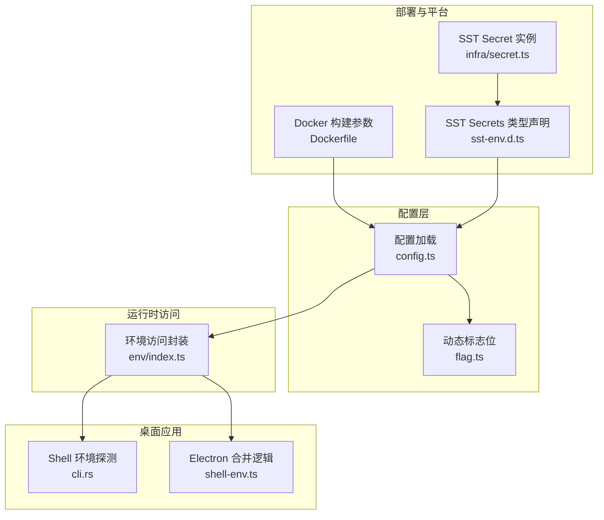
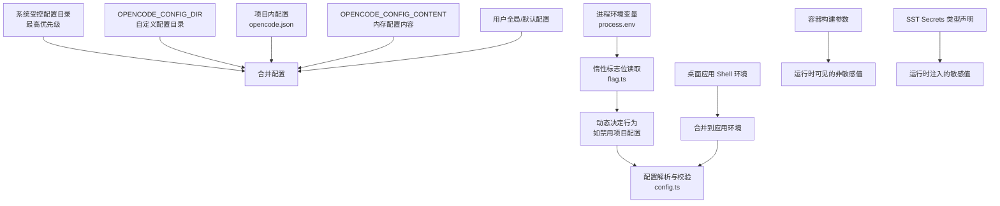
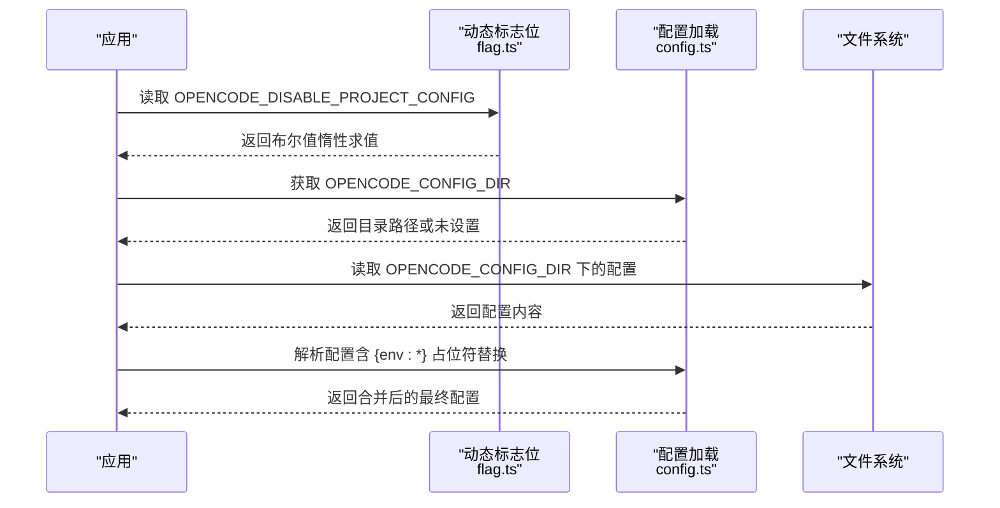
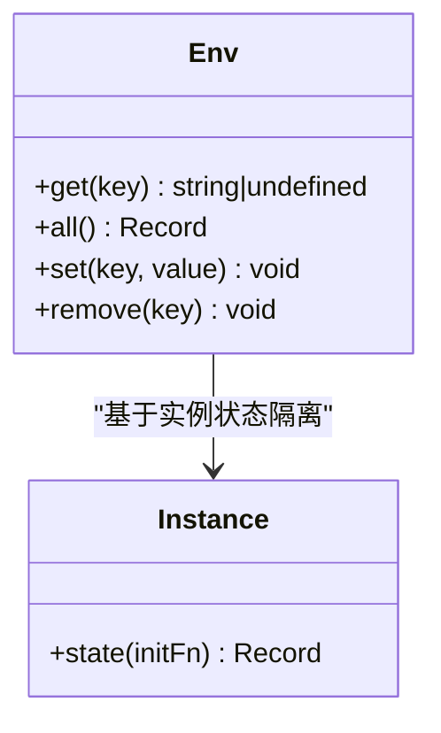
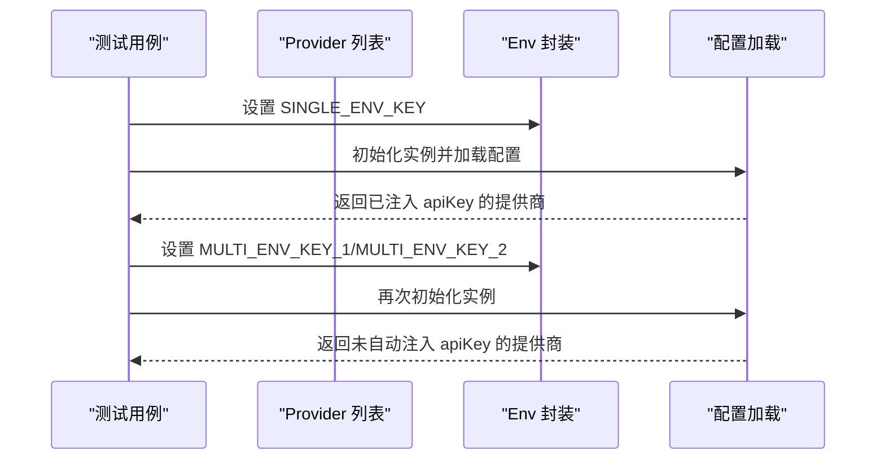
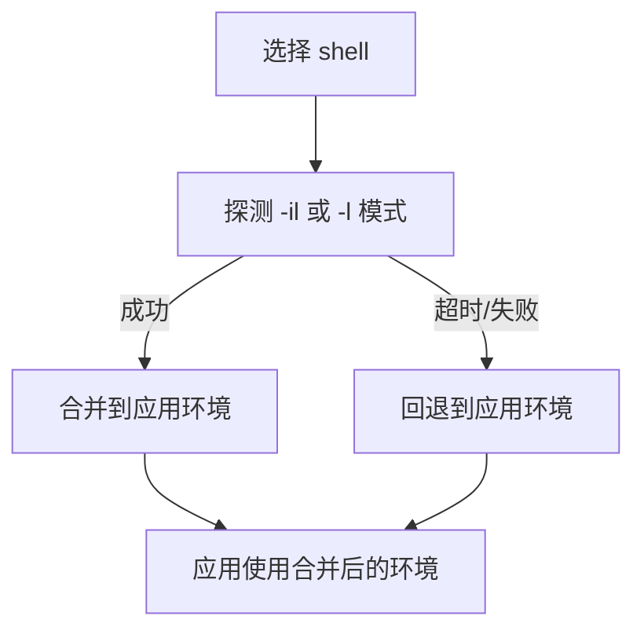
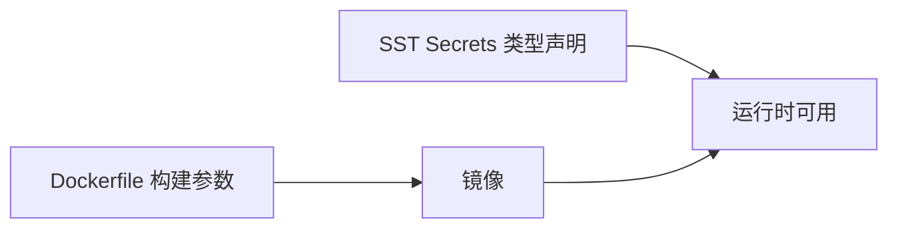
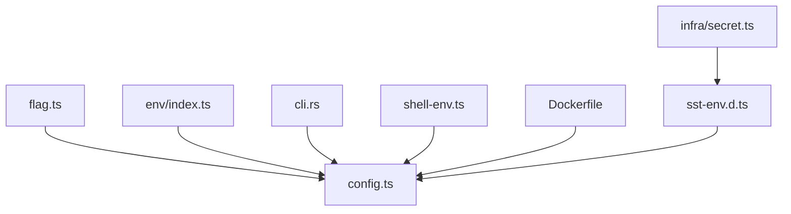

# 环境变量配置

<cite>
**本文引用的文件**
- [packages/opencode/src/env/index.ts](file://packages/opencode/src/env/index.ts)
- [packages/opencode/src/flag/flag.ts](file://packages/opencode/src/flag/flag.ts)
- [packages/opencode/src/config/config.ts](file://packages/opencode/src/config/config.ts)
- [packages/opencode/test/provider/provider.test.ts](file://packages/opencode/test/provider/provider.test.ts)
- [packages/opencode/test/config/config.test.ts](file://packages/opencode/test/config/config.test.ts)
- [packages/opencode/test/preload.ts](file://packages/opencode/test/preload.ts)
- [packages/desktop/src-tauri/src/cli.rs](file://packages/desktop/src-tauri/src/cli.rs)
- [packages/desktop-electron/src/main/shell-env.ts](file://packages/desktop-electron/src/main/shell-env.ts)
- [sst-env.d.ts](file://sst-env.d.ts)
- [infra/secret.ts](file://infra/secret.ts)
- [packages/containers/base/Dockerfile](file://packages/containers/base/Dockerfile)
- [packages/containers/bun-node/Dockerfile](file://packages/containers/bun-node/Dockerfile)
- [.opencode/agent/translator.md](file://.opencode/agent/translator.md)
</cite>

## 目录
1. [简介](#简介)
2. [项目结构与环境变量相关模块](#项目结构与环境变量相关模块)
3. [核心组件与职责](#核心组件与职责)
4. [架构总览](#架构总览)
5. [详细组件分析](#详细组件分析)
6. [依赖关系分析](#依赖关系分析)
7. [性能与安全考量](#性能与安全考量)
8. [故障排除指南](#故障排除指南)
9. [结论](#结论)
10. [附录：环境变量清单与最佳实践](#附录环境变量清单与最佳实践)

## 简介
本文件系统性梳理 OpenCode 在多运行环境（本地开发、桌面应用、容器化、云平台）中的环境变量配置与使用方式，覆盖以下主题：
- 全部支持的环境变量及其作用范围与优先级
- 敏感信息的安全存储与使用策略
- 不同运行环境下的设置方法与示例
- 动态加载与验证机制
- 常见陷阱与最佳实践
- 故障排除步骤

## 项目结构与环境变量相关模块
OpenCode 的环境变量体系由以下模块协同构成：
- 配置加载与解析：负责从多个来源合并配置，支持动态获取环境变量（如 OPENCODE_CONFIG_DIR、OPENCODE_DISABLE_PROJECT_CONFIG）
- 环境变量访问封装：为每个实例隔离环境变量副本，避免并发测试互相干扰
- 提供商与模型配置：根据环境变量自动注入或校验 API Key
- 桌面应用：在启动时探测 shell 环境变量，进行合并与覆盖
- 容器化与云平台：通过 Docker 构建参数与 SST Secrets 管理敏感配置

图表来源
- [packages/opencode/src/config/config.ts:60-75](file://packages/opencode/src/config/config.ts#L60-L75)
- [packages/opencode/src/flag/flag.ts:94-122](file://packages/opencode/src/flag/flag.ts#L94-L122)
- [packages/opencode/src/env/index.ts:3-28](file://packages/opencode/src/env/index.ts#L3-L28)
- [packages/desktop/src-tauri/src/cli.rs:320-352](file://packages/desktop/src-tauri/src/cli.rs#L320-L352)
- [packages/desktop-electron/src/main/shell-env.ts:57-88](file://packages/desktop-electron/src/main/shell-env.ts#L57-L88)
- [packages/containers/base/Dockerfile](file://packages/containers/base/Dockerfile)
- [packages/containers/bun-node/Dockerfile](file://packages/containers/bun-node/Dockerfile)
- [sst-env.d.ts:1-315](file://sst-env.d.ts#L1-L315)
- [infra/secret.ts:1-5](file://infra/secret.ts#L1-L5)

章节来源
- [packages/opencode/src/config/config.ts:60-75](file://packages/opencode/src/config/config.ts#L60-L75)
- [packages/opencode/src/flag/flag.ts:94-122](file://packages/opencode/src/flag/flag.ts#L94-L122)
- [packages/opencode/src/env/index.ts:3-28](file://packages/opencode/src/env/index.ts#L3-L28)
- [packages/desktop/src-tauri/src/cli.rs:320-352](file://packages/desktop/src-tauri/src/cli.rs#L320-L352)
- [packages/desktop-electron/src/main/shell-env.ts:57-88](file://packages/desktop-electron/src/main/shell-env.ts#L57-L88)
- [packages/containers/base/Dockerfile](file://packages/containers/base/Dockerfile)
- [packages/containers/bun-node/Dockerfile](file://packages/containers/bun-node/Dockerfile)
- [sst-env.d.ts:1-315](file://sst-env.d.ts#L1-L315)
- [infra/secret.ts:1-5](file://infra/secret.ts#L1-L5)

## 核心组件与职责
- 配置加载与解析（config.ts）
  - 管理系统级受控配置目录（最高优先级），支持 macOS MDM 等企业场景
  - 支持动态标志位（如 OPENCODE_DISABLE_PROJECT_CONFIG、OPENCODE_CONFIG_DIR）按访问时刻重新评估
  - 支持 OPENCODE_CONFIG_CONTENT 的模板占位符替换（{env:VAR}）
- 环境变量访问封装（env/index.ts）
  - 为每个实例隔离 process.env 副本，避免并发测试相互影响
  - 提供 get/all/set/remove 接口
- 动态标志位（flag.ts）
  - 对部分环境变量采用惰性 getter，确保外部工具在运行时设置后可被即时读取
- 桌面应用 Shell 环境（cli.rs、shell-env.ts）
  - 探测交互式 shell 输出的环境变量，合并到应用环境；对 nushell 进行特殊处理
- 容器化与云平台（Dockerfile、sst-env.d.ts、infra/secret.ts）
  - 通过构建参数传递非敏感配置；敏感配置通过 SST Secrets 注入类型声明并在运行时可用

章节来源
- [packages/opencode/src/config/config.ts:60-75](file://packages/opencode/src/config/config.ts#L60-L75)
- [packages/opencode/src/flag/flag.ts:94-122](file://packages/opencode/src/flag/flag.ts#L94-L122)
- [packages/opencode/src/env/index.ts:3-28](file://packages/opencode/src/env/index.ts#L3-L28)
- [packages/desktop/src-tauri/src/cli.rs:320-352](file://packages/desktop/src-tauri/src/cli.rs#L320-L352)
- [packages/desktop-electron/src/main/shell-env.ts:57-88](file://packages/desktop-electron/src/main/shell-env.ts#L57-L88)
- [packages/containers/base/Dockerfile](file://packages/containers/base/Dockerfile)
- [packages/containers/bun-node/Dockerfile](file://packages/containers/bun-node/Dockerfile)
- [sst-env.d.ts:1-315](file://sst-env.d.ts#L1-L315)
- [infra/secret.ts:1-5](file://infra/secret.ts#L1-L5)

## 架构总览
下图展示环境变量在不同运行阶段的流向与覆盖关系：

图表来源
- [packages/opencode/src/config/config.ts:60-75](file://packages/opencode/src/config/config.ts#L60-L75)
- [packages/opencode/src/flag/flag.ts:94-122](file://packages/opencode/src/flag/flag.ts#L94-L122)
- [packages/desktop/src-tauri/src/cli.rs:320-352](file://packages/desktop/src-tauri/src/cli.rs#L320-L352)
- [packages/containers/base/Dockerfile](file://packages/containers/base/Dockerfile)
- [sst-env.d.ts:1-315](file://sst-env.d.ts#L1-L315)

## 详细组件分析

### 组件一：配置加载与动态标志位（config.ts 与 flag.ts）
- 系统受控配置目录（最高优先级）
  - 用于企业统一管控，覆盖所有用户与项目配置
- OPENCODE_CONFIG_DIR
  - 自定义配置目录优先于项目配置
- OPENCODE_DISABLE_PROJECT_CONFIG
  - 惰性 getter，允许在运行时由外部工具设置以跳过项目配置与相对指令路径
- OPENCODE_CONFIG_CONTENT
  - 支持模板占位符 {env:VAR}，在解析前进行替换，不直接写回明文到磁盘

图表来源
- [packages/opencode/src/flag/flag.ts:94-122](file://packages/opencode/src/flag/flag.ts#L94-L122)
- [packages/opencode/src/config/config.ts:60-75](file://packages/opencode/src/config/config.ts#L60-L75)
- [packages/opencode/test/config/config.test.ts:2206-2214](file://packages/opencode/test/config/config.test.ts#L2206-L2214)

章节来源
- [packages/opencode/src/config/config.ts:60-75](file://packages/opencode/src/config/config.ts#L60-L75)
- [packages/opencode/src/flag/flag.ts:94-122](file://packages/opencode/src/flag/flag.ts#L94-L122)
- [packages/opencode/test/config/config.test.ts:2206-2214](file://packages/opencode/test/config/config.test.ts#L2206-L2214)

### 组件二：环境变量访问封装（env/index.ts）
- 为每个实例复制一份 process.env，避免并发测试互相污染
- 提供 get/all/set/remove 方法，便于在不同模块中统一管理

图表来源
- [packages/opencode/src/env/index.ts:3-28](file://packages/opencode/src/env/index.ts#L3-L28)

章节来源
- [packages/opencode/src/env/index.ts:3-28](file://packages/opencode/src/env/index.ts#L3-L28)

### 组件三：提供商与模型配置中的密钥注入（provider.test.ts）
- 当提供商标识仅配置了一个环境变量时，会自动将该变量值注入到提供商的 apiKey 字段
- 当提供商标识配置了多个环境变量时，不会自动注入，需显式传入

图表来源
- [packages/opencode/test/provider/provider.test.ts:1105-1187](file://packages/opencode/test/provider/provider.test.ts#L1105-L1187)

章节来源
- [packages/opencode/test/provider/provider.test.ts:1105-1187](file://packages/opencode/test/provider/provider.test.ts#L1105-L1187)

### 组件四：桌面应用 Shell 环境合并（cli.rs 与 shell-env.ts）
- 探测交互式 shell 的环境变量输出，合并到应用环境
- 对 nushell 进行特殊处理，跳过探测
- Electron 版本提供类似的合并逻辑

图表来源
- [packages/desktop/src-tauri/src/cli.rs:320-352](file://packages/desktop/src-tauri/src/cli.rs#L320-L352)
- [packages/desktop-electron/src/main/shell-env.ts:57-88](file://packages/desktop-electron/src/main/shell-env.ts#L57-L88)

章节来源
- [packages/desktop/src-tauri/src/cli.rs:320-352](file://packages/desktop/src-tauri/src/cli.rs#L320-L352)
- [packages/desktop-electron/src/main/shell-env.ts:57-88](file://packages/desktop-electron/src/main/shell-env.ts#L57-L88)

### 组件五：容器化与云平台（Dockerfile 与 SST Secrets）
- Docker 构建参数用于传递非敏感配置（如 REGISTRY、BUN_VERSION）
- SST Secrets 通过类型声明在编译期约束，在运行时注入敏感值（如 R2AccessKey、R2SecretKey）

图表来源
- [packages/containers/base/Dockerfile](file://packages/containers/base/Dockerfile)
- [packages/containers/bun-node/Dockerfile](file://packages/containers/bun-node/Dockerfile)
- [sst-env.d.ts:1-315](file://sst-env.d.ts#L1-L315)
- [infra/secret.ts:1-5](file://infra/secret.ts#L1-L5)

章节来源
- [packages/containers/base/Dockerfile](file://packages/containers/base/Dockerfile)
- [packages/containers/bun-node/Dockerfile](file://packages/containers/bun-node/Dockerfile)
- [sst-env.d.ts:1-315](file://sst-env.d.ts#L1-L315)
- [infra/secret.ts:1-5](file://infra/secret.ts#L1-L5)

## 依赖关系分析
- 配置加载依赖动态标志位（惰性读取）
- 环境访问封装依赖实例状态隔离
- 桌面应用依赖 shell 环境探测与合并
- 容器化与云平台依赖构建参数与 Secrets 类型声明

图表来源
- [packages/opencode/src/flag/flag.ts:94-122](file://packages/opencode/src/flag/flag.ts#L94-L122)
- [packages/opencode/src/config/config.ts:60-75](file://packages/opencode/src/config/config.ts#L60-L75)
- [packages/opencode/src/env/index.ts:3-28](file://packages/opencode/src/env/index.ts#L3-L28)
- [packages/desktop/src-tauri/src/cli.rs:320-352](file://packages/desktop/src-tauri/src/cli.rs#L320-L352)
- [packages/desktop-electron/src/main/shell-env.ts:57-88](file://packages/desktop-electron/src/main/shell-env.ts#L57-L88)
- [packages/containers/base/Dockerfile](file://packages/containers/base/Dockerfile)
- [sst-env.d.ts:1-315](file://sst-env.d.ts#L1-L315)
- [infra/secret.ts:1-5](file://infra/secret.ts#L1-L5)

章节来源
- [packages/opencode/src/flag/flag.ts:94-122](file://packages/opencode/src/flag/flag.ts#L94-L122)
- [packages/opencode/src/config/config.ts:60-75](file://packages/opencode/src/config/config.ts#L60-L75)
- [packages/opencode/src/env/index.ts:3-28](file://packages/opencode/src/env/index.ts#L3-L28)
- [packages/desktop/src-tauri/src/cli.rs:320-352](file://packages/desktop/src-tauri/src/cli.rs#L320-L352)
- [packages/desktop-electron/src/main/shell-env.ts:57-88](file://packages/desktop-electron/src/main/shell-env.ts#L57-L88)
- [packages/containers/base/Dockerfile](file://packages/containers/base/Dockerfile)
- [sst-env.d.ts:1-315](file://sst-env.d.ts#L1-L315)
- [infra/secret.ts:1-5](file://infra/secret.ts#L1-L5)

## 性能与安全考量
- 性能
  - 惰性标志位避免在模块加载时读取环境变量，减少不必要的 IO 与解析开销
  - 桌面应用的 shell 环境探测带超时控制，防止阻塞启动
- 安全
  - 敏感配置通过 SST Secrets 注入，不在 Dockerfile 中硬编码
  - 配置内容中的 {env:*} 占位符在解析时替换，不落盘明文
  - 测试中清理敏感环境变量，避免泄露

章节来源
- [packages/opencode/src/flag/flag.ts:94-122](file://packages/opencode/src/flag/flag.ts#L94-L122)
- [packages/opencode/src/config/config.ts:60-75](file://packages/opencode/src/config/config.ts#L60-L75)
- [packages/opencode/test/preload.ts:54-76](file://packages/opencode/test/preload.ts#L54-L76)
- [packages/containers/bun-node/Dockerfile](file://packages/containers/bun-node/Dockerfile)
- [sst-env.d.ts:1-315](file://sst-env.d.ts#L1-L315)

## 故障排除指南
- 问题：OPENCODE_CONFIG_DIR 未生效
  - 检查是否设置了 OPENCODE_DISABLE_PROJECT_CONFIG 导致项目配置被跳过
  - 确认 OPENCODE_CONFIG_DIR 路径存在且包含有效配置
- 问题：{env:*} 占位符未被替换
  - 确保占位符格式正确（如 {env:VAR}）
  - 检查配置解析流程是否在写入前完成替换
- 问题：桌面应用未继承 shell 环境变量
  - 检查 shell 是否为 nushell（会被跳过）
  - 查看探测日志，确认 -il/-l 模式是否返回成功
- 问题：提供商未自动注入 API Key
  - 若提供商标识配置了多个环境变量，不会自动注入
  - 仅当仅配置一个环境变量时才会自动注入
- 问题：容器内无法读取敏感配置
  - 确认 SST Secrets 已在运行环境中注入
  - 检查类型声明与实际注入的键名一致

章节来源
- [packages/opencode/test/config/config.test.ts:2206-2214](file://packages/opencode/test/config/config.test.ts#L2206-L2214)
- [packages/opencode/test/provider/provider.test.ts:1105-1187](file://packages/opencode/test/provider/provider.test.ts#L1105-L1187)
- [packages/desktop/src-tauri/src/cli.rs:320-352](file://packages/desktop/src-tauri/src/cli.rs#L320-L352)
- [packages/containers/bun-node/Dockerfile](file://packages/containers/bun-node/Dockerfile)
- [sst-env.d.ts:1-315](file://sst-env.d.ts#L1-L315)

## 结论
OpenCode 的环境变量体系通过“系统受控配置目录（最高优先级）→ 自定义配置目录 → 项目配置 → 内存配置内容 → 用户默认配置”的层次化设计，结合惰性标志位与实例隔离的环境访问封装，实现了灵活、安全、可维护的配置管理。桌面应用与容器化部署分别通过 shell 环境合并与 SST Secrets 保障了跨平台一致性与安全性。

## 附录：环境变量清单与最佳实践

### 支持的环境变量清单（节选）
- 配置与加载
  - OPENCODE_DISABLE_PROJECT_CONFIG：跳过项目配置与相对指令路径
  - OPENCODE_CONFIG_DIR：自定义配置目录
  - OPENCODE_CONFIG_CONTENT：内存中的配置内容（支持 {env:*} 占位符）
  - OPENCODE_MODELS_URL / OPENCODE_MODELS_PATH：模型列表与路径
  - OPENCODE_DB：数据库连接字符串（内存模式示例）
- 认证与服务器
  - OPENCODE_SERVER_USERNAME / OPENCODE_SERVER_PASSWORD：服务端认证
- 提供商与模型
  - 多家大模型厂商的 API Key（如 ANTHROPIC_API_KEY、OPENAI_API_KEY、GOOGLE_API_KEY 等）
  - OPENCODE_API_KEY：通用 API Key
- 代理与网络
  - HTTP_PROXY / HTTPS_PROXY / NO_PROXY：代理配置
- 日志与调试
  - RUST_LOG：日志级别
- 桌面应用
  - OPENCODE_CLIENT：客户端标识（桌面端示例）
- 云平台与容器
  - CLOUDFLARE_*：Cloudflare 相关凭据
  - R2AccessKey / R2SecretKey：对象存储密钥（通过 SST Secrets 注入）

章节来源
- [.opencode/agent/translator.md:536-632](file://.opencode/agent/translator.md#L536-L632)
- [packages/opencode/test/config/config.test.ts:2206-2214](file://packages/opencode/test/config/config.test.ts#L2206-L2214)
- [packages/opencode/test/preload.ts:54-76](file://packages/opencode/test/preload.ts#L54-L76)
- [sst-env.d.ts:1-315](file://sst-env.d.ts#L1-L315)
- [infra/secret.ts:1-5](file://infra/secret.ts#L1-L5)

### 最佳实践
- 敏感信息
  - 使用 SST Secrets 管理密钥，不在 Dockerfile 或配置文件中硬编码
  - 配置内容中的敏感字段使用占位符，避免明文落盘
- 配置优先级
  - 企业受控配置目录最高优先级，其次自定义配置目录，再项目配置，最后默认配置
- 动态行为
  - 使用惰性标志位（如 OPENCODE_DISABLE_PROJECT_CONFIG）在运行时调整行为
- 桌面应用
  - 启动时探测 shell 环境变量，注意 nushell 的特殊处理
- 容器化
  - 通过构建参数传递非敏感配置，敏感配置通过 Secrets 注入

### 常见陷阱
- 忘记清理测试中的敏感环境变量，导致误用或泄露
- 在提供商标识配置多个环境变量时期望自动注入 API Key
- 未设置 OPENCODE_CONFIG_DIR 导致项目配置未被加载
- 未正确配置 SST Secrets 导致运行时无法读取敏感值

### 不同运行环境下的设置方法
- 本地开发
  - 在 shell 中导出所需环境变量，桌面应用会探测并合并
  - 使用 OPENCODE_CONFIG_DIR 指向本地配置目录
- CI/CD
  - 在流水线中设置敏感变量（通过 Secrets 管理），非敏感变量通过构建参数传递
- 生产环境
  - 企业受控配置目录优先级最高，确保统一策略
  - 通过 SST Secrets 注入敏感配置，避免明文存储