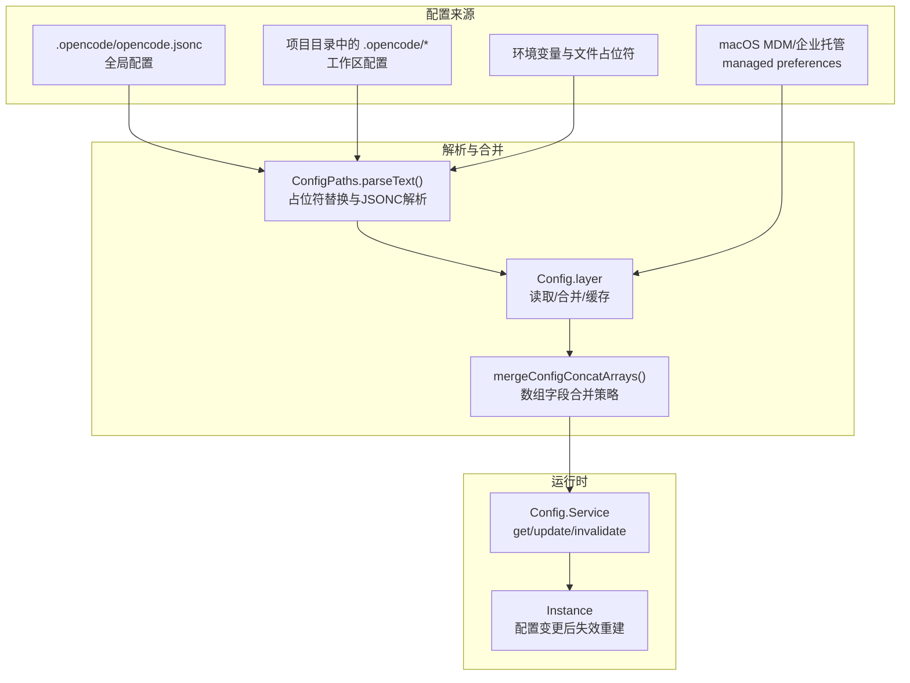
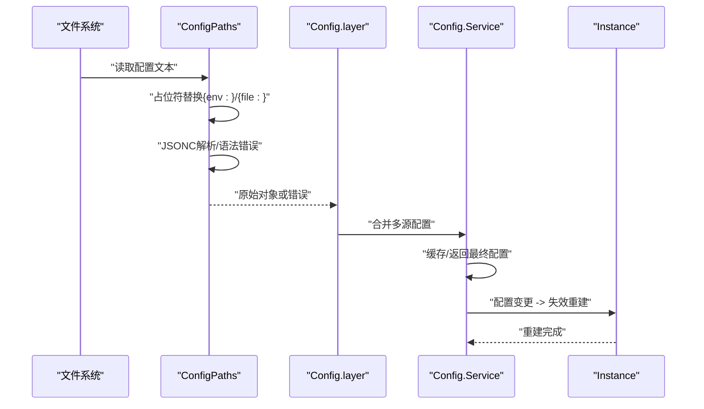
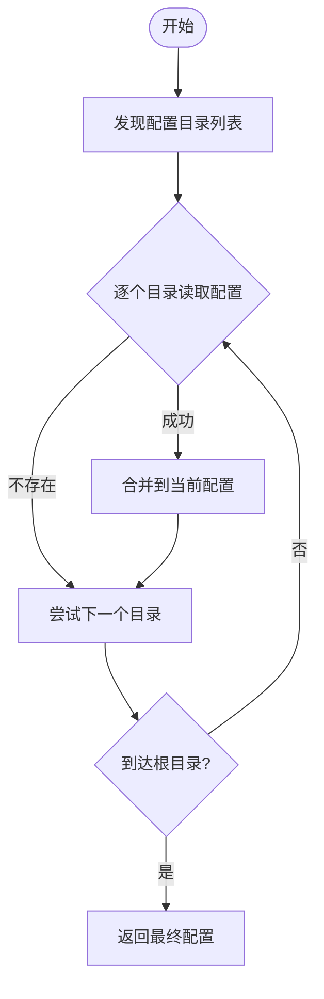
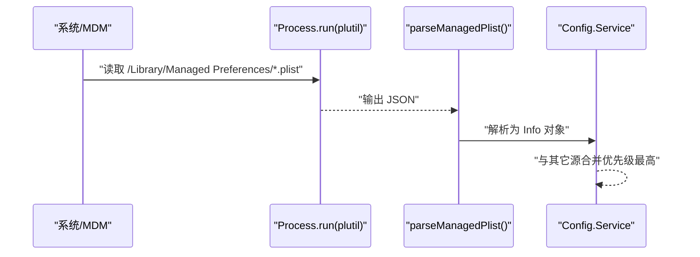
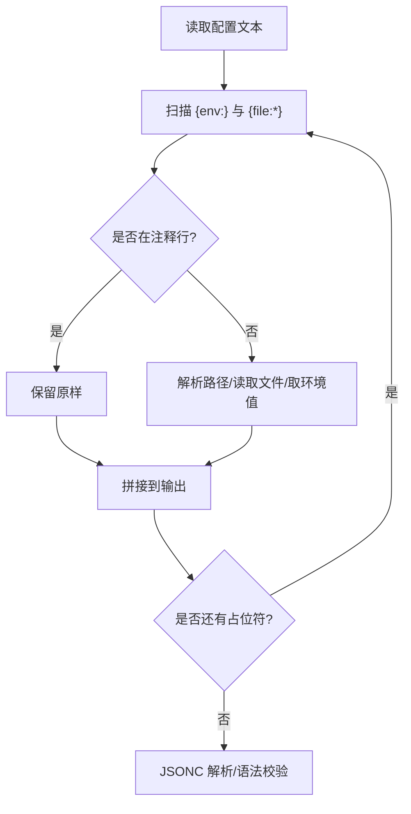
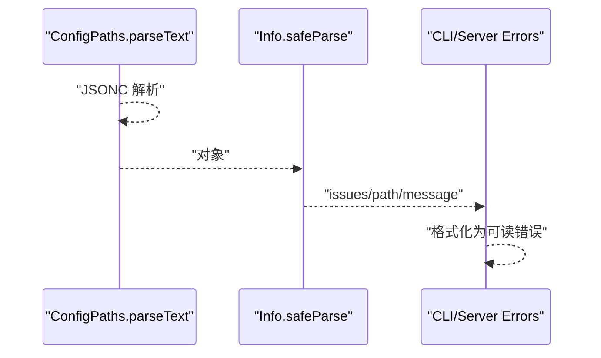
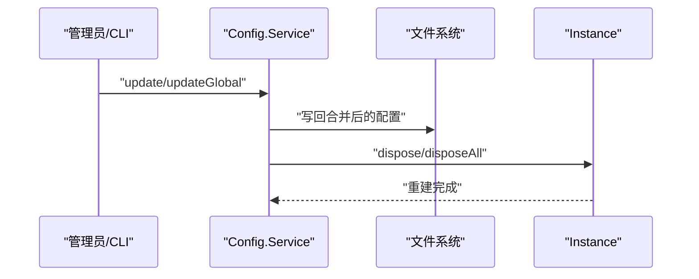
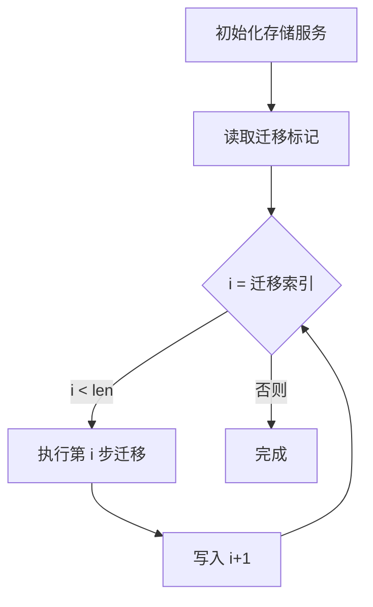
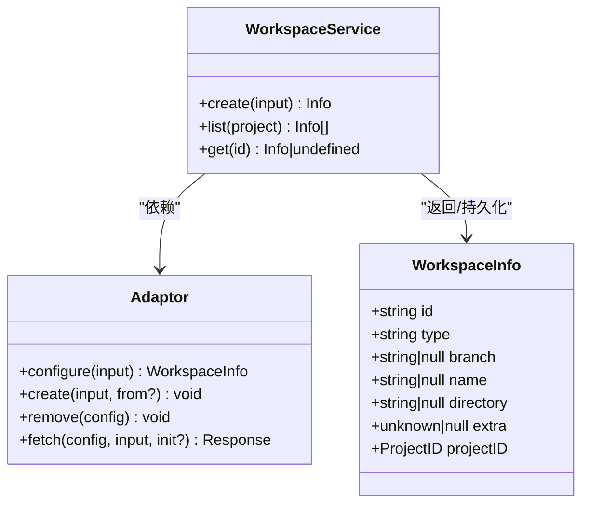
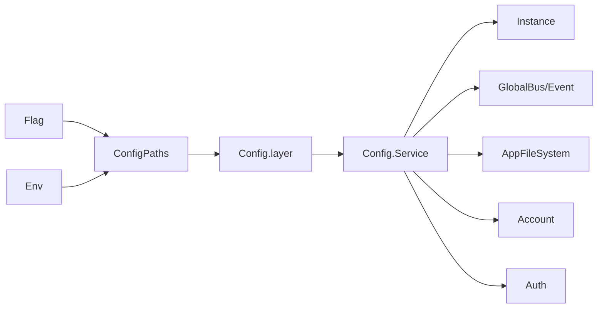

# 配置管理

<cite>
**本文引用的文件**
- [.opencode/opencode.jsonc](file://.opencode/opencode.jsonc)
- [.opencode/package.json](file://.opencode/package.json)
- [packages/opencode/src/config/config.ts](file://packages/opencode/src/config/config.ts)
- [packages/opencode/src/config/paths.ts](file://packages/opencode/src/config/paths.ts)
- [packages/opencode/src/flag/flag.ts](file://packages/opencode/src/flag/flag.ts)
- [packages/opencode/src/env/index.ts](file://packages/opencode/src/env/index.ts)
- [packages/opencode/src/control-plane/workspace.ts](file://packages/opencode/src/control-plane/workspace.ts)
- [packages/opencode/src/control-plane/types.ts](file://packages/opencode/src/control-plane/types.ts)
- [packages/opencode/src/storage/storage.ts](file://packages/opencode/src/storage/storage.ts)
- [packages/opencode/src/cli/error.ts](file://packages/opencode/src/cli/error.ts)
- [packages/opencode/src/utils/server-errors.ts](file://packages/opencode/src/utils/server-errors.ts)
- [packages/opencode/test/config/config.test.ts](file://packages/opencode/test/config/config.test.ts)
</cite>

## 目录
1. [简介](#简介)
2. [项目结构](#项目结构)
3. [核心组件](#核心组件)
4. [架构总览](#架构总览)
5. [详细组件分析](#详细组件分析)
6. [依赖关系分析](#依赖关系分析)
7. [性能考量](#性能考量)
8. [故障排除指南](#故障排除指南)
9. [结论](#结论)
10. [附录](#附录)

## 简介
本文件系统化阐述 OpenCode 的配置管理机制，涵盖以下主题：
- 全局与工作区配置的结构、字段与作用域
- 配置文件的解析、校验与错误处理
- 环境变量与文件占位符的注入与优先级
- 配置继承与覆盖规则（含企业托管与 macOS MDM）
- 配置热更新与实例失效机制
- 配置迁移与版本兼容策略
- 常见场景示例：多用户、团队协作、CI/CD
- 故障排除与调试技巧

## 项目结构
OpenCode 的配置体系由“全局配置”“工作区配置”“企业托管配置”“环境变量与文件占位符”四部分构成，并通过统一的解析与合并逻辑形成最终生效配置。

图表来源
- [packages/opencode/src/config/paths.ts:137-166](file://packages/opencode/src/config/paths.ts#L137-L166)
- [packages/opencode/src/config/config.ts:1144-1174](file://packages/opencode/src/config/config.ts#L1144-L1174)
- [packages/opencode/src/config/config.ts:132-139](file://packages/opencode/src/config/config.ts#L132-L139)
- [packages/opencode/src/config/config.ts:1480-1505](file://packages/opencode/src/config/config.ts#L1480-L1505)

章节来源
- [packages/opencode/src/config/paths.ts:15-36](file://packages/opencode/src/config/paths.ts#L15-L36)
- [packages/opencode/src/config/config.ts:60-75](file://packages/opencode/src/config/config.ts#L60-L75)
- [.opencode/opencode.jsonc:1-19](file://.opencode/opencode.jsonc#L1-L19)

## 核心组件
- 配置路径与解析器：负责在多层级目录中定位配置文件，执行占位符替换与 JSONC 解析，抛出结构化错误。
- 配置服务：封装读取、合并、写入、失效与重建等能力，支持全局与工作区配置。
- 环境变量与文件占位符：提供 {env:VAR} 与 {file:path} 注入，支持注释行跳过与缺失行为控制。
- 企业托管与 macOS MDM：从系统层面读取托管配置，优先于用户配置。
- 错误格式化：将配置无效错误转换为可读消息，便于 CLI 与 UI 展示。

章节来源
- [packages/opencode/src/config/paths.ts:77-134](file://packages/opencode/src/config/paths.ts#L77-L134)
- [packages/opencode/src/config/config.ts:1144-1174](file://packages/opencode/src/config/config.ts#L1144-L1174)
- [packages/opencode/src/config/config.ts:96-102](file://packages/opencode/src/config/config.ts#L96-L102)
- [packages/opencode/src/cli/error.ts:32-46](file://packages/opencode/src/cli/error.ts#L32-L46)
- [packages/opencode/src/utils/server-errors.ts:49-65](file://packages/opencode/src/utils/server-errors.ts#L49-L65)

## 架构总览
下图展示配置从发现到生效的关键流程：解析、校验、合并、缓存与实例失效。

图表来源
- [packages/opencode/src/config/paths.ts:137-166](file://packages/opencode/src/config/paths.ts#L137-L166)
- [packages/opencode/src/config/config.ts:1144-1174](file://packages/opencode/src/config/config.ts#L1144-L1174)
- [packages/opencode/src/config/config.ts:1480-1505](file://packages/opencode/src/config/config.ts#L1480-L1505)

## 详细组件分析

### 全局配置文件结构与字段
- 文件位置：位于用户主目录下的全局配置目录中，文件名通常为 opencode.json 或 opencode.jsonc。
- 关键字段示例（以仓库中的示例为准）：
  - $schema：指向配置模式定义，用于自动补全与校验。
  - provider：模型提供商配置容器，示例中包含 provider.opencode.options。
  - permission：权限规则，示例中包含 edit.packages/opencode/migration/*: deny。
  - mcp：MCP 相关配置容器。
  - tools：工具开关，示例中包含 github-triage、github-pr-search 等布尔开关。
- 字段含义与用途：
  - $schema：确保配置符合预期结构，便于 IDE 与校验器识别。
  - provider：声明使用的模型提供商及其参数。
  - permission：基于路径模式的权限控制，决定操作是否允许。
  - mcp：MCP（Model Context Protocol）相关设置。
  - tools：启用/禁用特定工具功能。

章节来源
- [.opencode/opencode.jsonc:1-19](file://.opencode/opencode.jsonc#L1-L19)

### 工作区配置与继承机制
- 工作区配置位于项目根目录的 .opencode 目录内，按从当前目录向上查找，直到工作树边界或用户主目录。
- 继承与覆盖规则：
  - 按目录层级自底向上合并，后读取的层级覆盖先前层级的同名字段。
  - 数组字段采用“去重拼接”策略，避免简单覆盖导致丢失低优先级层的条目。
  - 可通过环境变量禁用项目配置，强制仅使用全局或其他指定目录。
- 目录发现顺序：
  - 全局配置目录
  - 项目 .opencode 目录（受禁用标志影响）
  - 用户主目录 .opencode 目录
  - OPENCODE_CONFIG_DIR 指定目录（若存在）

图表来源
- [packages/opencode/src/config/paths.ts:15-36](file://packages/opencode/src/config/paths.ts#L15-L36)
- [packages/opencode/src/config/config.ts:132-139](file://packages/opencode/src/config/config.ts#L132-L139)

章节来源
- [packages/opencode/src/config/paths.ts:15-36](file://packages/opencode/src/config/paths.ts#L15-L36)
- [packages/opencode/src/config/config.ts:132-139](file://packages/opencode/src/config/config.ts#L132-L139)

### 企业托管与 macOS MDM
- 企业托管配置目录优先级最高，会覆盖所有用户与项目配置。
- macOS 平台通过 plutil 将 .mobileconfig 中的托管偏好转换为 JSON 后解析，同时过滤掉非 OpenCode 配置的元数据键。
- 读取顺序：用户域 plist -> 机器域 plist；任一存在即停止搜索。

图表来源
- [packages/opencode/src/config/config.ts:96-102](file://packages/opencode/src/config/config.ts#L96-L102)
- [packages/opencode/src/config/config.ts:109-130](file://packages/opencode/src/config/config.ts#L109-L130)

章节来源
- [packages/opencode/src/config/config.ts:60-75](file://packages/opencode/src/config/config.ts#L60-L75)
- [packages/opencode/src/config/config.ts:96-102](file://packages/opencode/src/config/config.ts#L96-L102)
- [packages/opencode/src/config/config.ts:109-130](file://packages/opencode/src/config/config.ts#L109-L130)

### 环境变量与文件占位符
- 占位符类型：
  - {env:VARNAME}：从进程环境变量注入。
  - {file:path}：从文件内容注入，支持 ~ 路径与相对路径解析；注释行（以 // 开头）中的占位符会被保留不替换。
- 缺失处理：
  - 默认策略为报错；可通过特殊标志切换为“空字符串”策略。
- 作用范围：
  - 支持在 OPENCODE_CONFIG_CONTENT 内容中使用，实现从环境注入完整配置。
- 实例隔离：
  - Env 模块为每个实例维护独立的环境副本，避免并发测试相互干扰。

图表来源
- [packages/opencode/src/config/paths.ts:77-134](file://packages/opencode/src/config/paths.ts#L77-L134)
- [packages/opencode/src/env/index.ts:4-28](file://packages/opencode/src/env/index.ts#L4-L28)

章节来源
- [packages/opencode/src/config/paths.ts:77-134](file://packages/opencode/src/config/paths.ts#L77-L134)
- [packages/opencode/src/env/index.ts:4-28](file://packages/opencode/src/env/index.ts#L4-L28)
- [packages/opencode/test/config/config.test.ts:234-270](file://packages/opencode/test/config/config.test.ts#L234-L270)

### 配置验证与错误处理
- 语法错误：JSONC 解析失败时，构造包含上下文与行列号的错误对象。
- 结构错误：Schema 校验失败时，构造包含问题路径与消息的错误对象。
- CLI/UI 友好化：将结构化错误映射为人类可读的消息，支持多语言翻译。
- 测试验证：包含对占位符保留、账户令牌注入、禁用项目配置等场景的断言。

图表来源
- [packages/opencode/src/config/paths.ts:137-166](file://packages/opencode/src/config/paths.ts#L137-L166)
- [packages/opencode/src/config/config.ts:1124-1131](file://packages/opencode/src/config/config.ts#L1124-L1131)
- [packages/opencode/src/cli/error.ts:32-46](file://packages/opencode/src/cli/error.ts#L32-L46)
- [packages/opencode/src/utils/server-errors.ts:49-65](file://packages/opencode/src/utils/server-errors.ts#L49-L65)

章节来源
- [packages/opencode/src/config/config.ts:1124-1131](file://packages/opencode/src/config/config.ts#L1124-L1131)
- [packages/opencode/src/cli/error.ts:32-46](file://packages/opencode/src/cli/error.ts#L32-L46)
- [packages/opencode/src/utils/server-errors.ts:49-65](file://packages/opencode/src/utils/server-errors.ts#L49-L65)

### 配置热更新与动态加载
- 更新入口：支持更新全局配置与工作区配置，内部通过深合并写回文件。
- 失效与重建：更新后触发全局实例失效，随后重建，确保新配置生效。
- 依赖等待：可选择阻塞等待重建完成，或异步重建。

图表来源
- [packages/opencode/src/config/config.ts:1480-1505](file://packages/opencode/src/config/config.ts#L1480-L1505)
- [packages/opencode/src/config/config.ts:1507-1515](file://packages/opencode/src/config/config.ts#L1507-L1515)

章节来源
- [packages/opencode/src/config/config.ts:1480-1505](file://packages/opencode/src/config/config.ts#L1480-L1505)
- [packages/opencode/src/config/config.ts:1507-1515](file://packages/opencode/src/config/config.ts#L1507-L1515)

### 配置迁移与版本兼容
- 存储迁移：通过标记文件记录迁移进度，逐项执行迁移步骤，失败则终止后续迁移。
- 迁移触发：在存储服务初始化时自动检测并执行未完成的迁移。
- 版本兼容：迁移步骤按序号推进，新增字段默认安全，旧版本不会读取新字段。

图表来源
- [packages/opencode/src/storage/storage.ts:219-248](file://packages/opencode/src/storage/storage.ts#L219-L248)

章节来源
- [packages/opencode/src/storage/storage.ts:80-254](file://packages/opencode/src/storage/storage.ts#L80-L254)

### 常见配置场景示例
- 多用户环境：
  - 使用企业托管配置集中下发策略，确保所有用户一致。
  - 个人偏好通过全局配置覆盖，避免冲突。
- 团队协作：
  - 在项目 .opencode 目录中放置团队共享配置，按需在子目录叠加。
  - 使用权限规则限制敏感路径的操作。
- CI/CD 环境：
  - 通过 OPENCODE_CONFIG_CONTENT 注入完整配置，结合 {env:VAR} 注入密钥。
  - 使用 OPENCODE_DISABLE_PROJECT_CONFIG 强制仅使用全局或托管配置，避免本地污染。

章节来源
- [packages/opencode/src/flag/flag.ts:91-122](file://packages/opencode/src/flag/flag.ts#L91-L122)
- [packages/opencode/test/config/config.test.ts:2206-2214](file://packages/opencode/test/config/config.test.ts#L2206-L2214)

### 工作区与项目适配器
- 工作区信息结构：包含 id、type、branch、name、directory、extra、projectID 等字段。
- 适配器接口：configure/create/remove/fetch 等方法，用于与不同后端集成。
- 创建流程：根据输入生成工作区信息并持久化，随后调用适配器创建资源。

图表来源
- [packages/opencode/src/control-plane/types.ts:5-14](file://packages/opencode/src/control-plane/types.ts#L5-L14)
- [packages/opencode/src/control-plane/types.ts:16-21](file://packages/opencode/src/control-plane/types.ts#L16-L21)
- [packages/opencode/src/control-plane/workspace.ts:57-102](file://packages/opencode/src/control-plane/workspace.ts#L57-L102)

章节来源
- [packages/opencode/src/control-plane/types.ts:5-14](file://packages/opencode/src/control-plane/types.ts#L5-L14)
- [packages/opencode/src/control-plane/types.ts:16-21](file://packages/opencode/src/control-plane/types.ts#L16-L21)
- [packages/opencode/src/control-plane/workspace.ts:57-102](file://packages/opencode/src/control-plane/workspace.ts#L57-L102)

## 依赖关系分析
- 配置解析依赖：
  - ConfigPaths：负责路径发现、占位符替换、JSONC 解析与错误包装。
  - Flag：提供运行时可变的环境标志（如禁用项目配置、指定配置目录）。
  - Env：为实例隔离环境变量。
- 配置服务依赖：
  - AppFileSystem/Account/Auth：读取文件与账户上下文。
  - GlobalBus/Event：在配置失效时广播事件。
- 运行时依赖：
  - Instance：在配置变更后进行实例失效与重建。
  - Storage：迁移与状态持久化。

图表来源
- [packages/opencode/src/config/paths.ts:1-10](file://packages/opencode/src/config/paths.ts#L1-L10)
- [packages/opencode/src/flag/flag.ts:91-122](file://packages/opencode/src/flag/flag.ts#L91-L122)
- [packages/opencode/src/env/index.ts:1-29](file://packages/opencode/src/env/index.ts#L1-L29)
- [packages/opencode/src/config/config.ts:1144-1174](file://packages/opencode/src/config/config.ts#L1144-L1174)

章节来源
- [packages/opencode/src/config/paths.ts:1-10](file://packages/opencode/src/config/paths.ts#L1-L10)
- [packages/opencode/src/flag/flag.ts:91-122](file://packages/opencode/src/flag/flag.ts#L91-L122)
- [packages/opencode/src/env/index.ts:1-29](file://packages/opencode/src/env/index.ts#L1-L29)
- [packages/opencode/src/config/config.ts:1144-1174](file://packages/opencode/src/config/config.ts#L1144-L1174)

## 性能考量
- 合并策略：数组字段采用去重拼接，避免重复遍历与复杂比较，时间复杂度近似 O(n+m)。
- 文件锁：安装依赖时使用文件锁避免并发写入竞争。
- 缓存：存储服务对状态进行缓存，减少重复迁移检查与 IO。
- 异步重建：配置更新后采用异步重建，避免阻塞主线程。

## 故障排除指南
- 配置无效错误：
  - 检查 JSONC 语法与字段类型，关注行号与列号提示。
  - 使用可读错误格式化函数获取更清晰的诊断信息。
- 占位符问题：
  - 确认 {env:VAR} 是否存在于进程环境中，{file:path} 是否存在且可读。
  - 若希望在缺失时忽略，调整缺失处理策略。
- 权限与覆盖：
  - 检查权限规则是否匹配目标路径。
  - 确认企业托管配置是否覆盖了预期字段。
- CI/CD 注入：
  - 确保 OPENCODE_CONFIG_CONTENT 包含有效 JSON，并正确使用 {env:VAR} 注入密钥。
- 实例重建：
  - 配置更新后观察实例是否被正确失效与重建。

章节来源
- [packages/opencode/src/utils/server-errors.ts:49-65](file://packages/opencode/src/utils/server-errors.ts#L49-L65)
- [packages/opencode/src/cli/error.ts:32-46](file://packages/opencode/src/cli/error.ts#L32-L46)
- [packages/opencode/test/config/config.test.ts:234-270](file://packages/opencode/test/config/config.test.ts#L234-L270)

## 结论
OpenCode 的配置管理以“多源合并 + 严格校验 + 动态失效重建”为核心，兼顾企业级托管、多用户与 CI/CD 场景需求。通过明确的继承与覆盖规则、完善的错误处理与可读化输出，以及可迁移的状态管理，为用户提供稳定可靠的配置体验。

## 附录
- 环境变量与标志参考：
  - OPENCODE_DISABLE_PROJECT_CONFIG：禁用项目配置，强制使用全局或其他指定目录。
  - OPENCODE_CONFIG_DIR：指定额外的配置目录。
  - OPENCODE_CONFIG_CONTENT：注入完整配置内容，常配合 {env:VAR} 使用。
  - OPENCODE_MODELS_URL/OPENCODE_MODELS_PATH：模型服务相关配置。
  - OPENCODE_DISABLE_EMBEDDED_WEB_UI/OPENCODE_DB/OPENCODE_DISABLE_CHANNEL_DB/OPENCODE_SKIP_MIGRATIONS/OPENCODE_STRICT_CONFIG_DEPS：运行时行为控制。
- 插件与依赖：
  - 全局 package.json 中声明插件依赖，安装时会追加或更新依赖版本。

章节来源
- [packages/opencode/src/flag/flag.ts:75-122](file://packages/opencode/src/flag/flag.ts#L75-L122)
- [.opencode/package.json:1-5](file://.opencode/package.json#L1-L5)