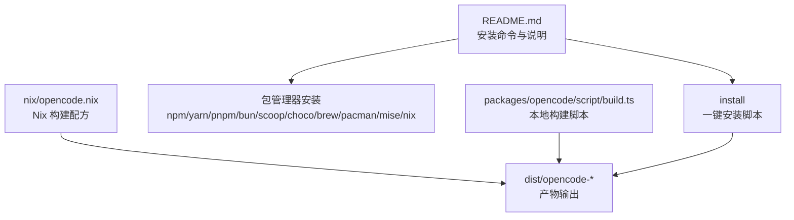
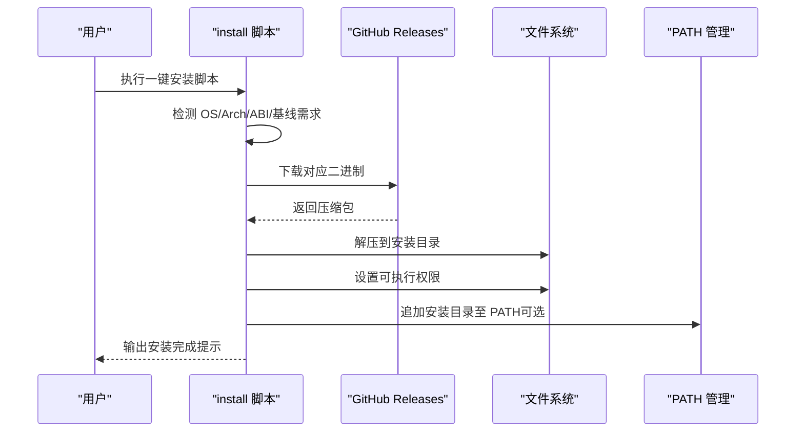
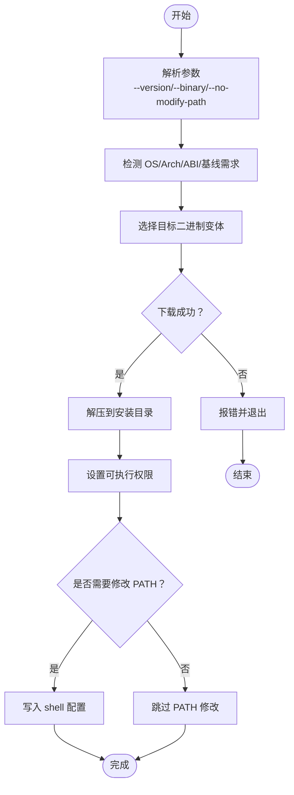
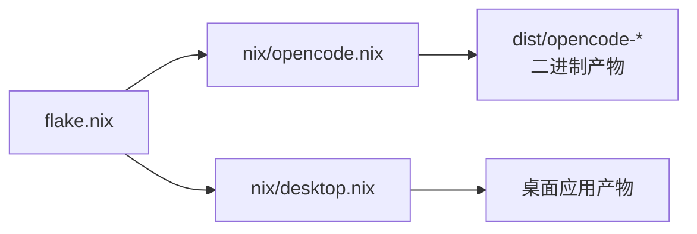
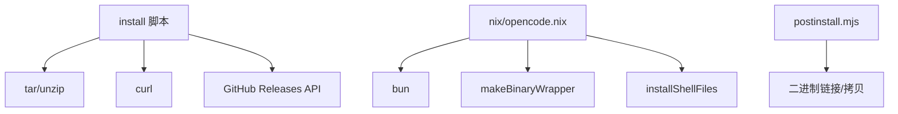
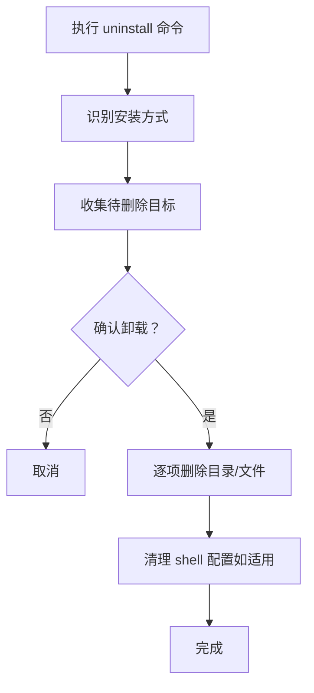
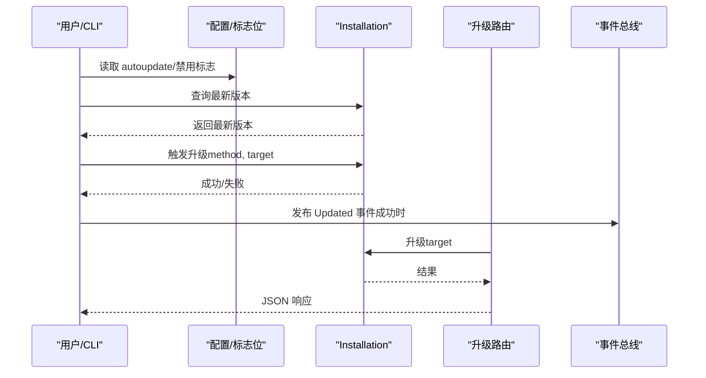

# 安装指南

<cite>
**本文引用的文件**
- [README.md](file://README.md)
- [install](file://install)
- [flake.nix](file://flake.nix)
- [nix/opencode.nix](file://nix/opencode.nix)
- [nix/desktop.nix](file://nix/desktop.nix)
- [packages/opencode/src/cli/cmd/uninstall.ts](file://packages/opencode/src/cli/cmd/uninstall.ts)
- [packages/opencode/script/build.ts](file://packages/opencode/script/build.ts)
- [packages/opencode/script/postinstall.mjs](file://packages/opencode/script/postinstall.mjs)
- [packages/opencode/src/server/routes/global.ts](file://packages/opencode/src/server/routes/global.ts)
- [packages/opencode/src/cli/upgrade.ts](file://packages/opencode/src/cli/upgrade.ts)
- [packages/opencode/src/util/which.ts](file://packages/opencode/src/util/which.ts)
- [CONTRIBUTING.md](file://CONTRIBUTING.md)
</cite>

## 目录
1. [简介](#简介)
2. [项目结构与安装入口](#项目结构与安装入口)
3. [核心安装方式](#核心安装方式)
4. [架构总览](#架构总览)
5. [详细组件解析](#详细组件解析)
6. [依赖关系分析](#依赖关系分析)
7. [性能与兼容性考虑](#性能与兼容性考虑)
8. [安装验证与常见问题排查](#安装验证与常见问题排查)
9. [卸载与版本升级](#卸载与版本升级)
10. [结论](#结论)

## 简介
本指南面向初学者与进阶用户，提供 OpenCode 的多平台安装方法与最佳实践，覆盖一键安装脚本、包管理器安装（npm、yarn、pnpm、bun、scoop、choco、brew、pacman、mise、nix）、以及从源码编译安装。同时说明安装目录优先级与自定义路径、安装验证方法、常见问题排查、卸载流程与版本升级策略。

## 项目结构与安装入口
- 一键安装脚本：位于仓库根目录，提供跨平台自动下载与安装能力，并支持指定版本与本地二进制安装。
- 包管理器安装：README 中列出 npm/yarn/pnpm/bun、Homebrew、Scoop、Chocolatey、Arch Linux、mise、nix 等多种方式。
- 源码编译：提供 Nix 衍生物与本地构建脚本，便于在受控环境中编译与打包。

图表来源
- [README.md:46-83](file://README.md#L46-L83)
- [install:1-461](file://install#L1-L461)
- [nix/opencode.nix:1-102](file://nix/opencode.nix#L1-L102)
- [packages/opencode/script/build.ts:1-277](file://packages/opencode/script/build.ts#L1-L277)

章节来源
- [README.md:46-83](file://README.md#L46-L83)
- [install:1-461](file://install#L1-L461)

## 核心安装方式
以下按“方式”分节，覆盖主流平台与工具链。

### 一键安装脚本（推荐）
- 命令：通过管道执行安装脚本，自动识别系统架构并下载对应二进制。
- 支持参数：
  - 指定版本：--version
  - 使用本地二进制：--binary
  - 不修改 shell 配置：--no-modify-path
- 自动检测与适配：
  - 自动识别 OS/Arch 并选择目标二进制（含 baseline 与 musl 变体）。
  - 在 macOS 上检测 Rosetta 并调整架构。
  - 校验 tar/unzip 工具可用性。
- 安装目录优先级：
  1) OPENCODE_INSTALL_DIR 环境变量
  2) XDG_BIN_DIR（遵循 XDG 规范）
  3) $HOME/bin（若存在或可创建）
  4) $HOME/.opencode/bin（默认回退）

章节来源
- [README.md:85-98](file://README.md#L85-L98)
- [install:10-66](file://install#L10-L66)
- [install:68-110](file://install#L68-L110)
- [install:117-181](file://install#L117-L181)
- [install:362-439](file://install#L362-L439)

### 包管理器安装
- npm/yarn/pnpm/bun：全局安装 opencode-ai。
- Homebrew：macOS/Linux 推荐，提供稳定与官方公式；另有 anomalyco/tap/opencode 公式。
- Scoop/Chocolatey：Windows 生态常用包管理器。
- Arch Linux：pacman 安装稳定版，paru -S opencode-bin 获取 AUR 最新版。
- mise：跨语言工具链管理器，统一运行时与工具版本。
- nix：nix run nixpkgs#opencode 或使用仓库提供的 flake。

章节来源
- [README.md:52-61](file://README.md#L52-L61)

### 桌面应用（Beta）
- 提供 macOS（Apple Silicon/Intel）、Windows、Linux（.deb/.rpm/AppImage）桌面包。
- macOS：brew install --cask opencode-desktop
- Windows：scoop bucket add extras; scoop install extras/opencode-desktop

章节来源
- [README.md:67-83](file://README.md#L67-L83)

### 源码编译安装
- Nix 方式：
  - 使用 flake.nix 的 overlay 与 packages，构建 opencode 与桌面应用。
  - opencode.nix 负责复制 node_modules、构建二进制、安装并包装程序。
  - desktop.nix 基于 opencode 包构建桌面应用。
- 本地构建：
  - build.ts 支持 --single 生成单平台二进制，--baseline 生成 baseline 变体，--skip-install 控制依赖安装。
  - postinstall.mjs 在非 Windows 平台准备二进制链接或拷贝。

章节来源
- [flake.nix:1-77](file://flake.nix#L1-L77)
- [nix/opencode.nix:1-102](file://nix/opencode.nix#L1-L102)
- [nix/desktop.nix:1-101](file://nix/desktop.nix#L1-L101)
- [packages/opencode/script/build.ts:157-176](file://packages/opencode/script/build.ts#L157-L176)
- [packages/opencode/script/build.ts:180-263](file://packages/opencode/script/build.ts#L180-L263)
- [packages/opencode/script/postinstall.mjs:61-131](file://packages/opencode/script/postinstall.mjs#L61-L131)

## 架构总览
下图展示安装流程与关键组件交互：

图表来源
- [install:117-181](file://install#L117-L181)
- [install:327-359](file://install#L327-L359)
- [install:362-439](file://install#L362-L439)

## 详细组件解析

### 一键安装脚本（install）
- 功能要点
  - 参数解析：--version、--binary、--no-modify-path。
  - 平台检测：uname 映射到 os/arch，macOS 下检测 Rosetta。
  - 变体选择：根据 CPU 特性与 libc 类型选择 baseline 或 musl 变体。
  - 下载与校验：支持进度显示与回退方案；校验 GitHub Release 存在性。
  - PATH 注入：按当前 shell 识别配置文件，追加安装目录。
- 关键行为
  - 若已安装且版本一致则直接退出。
  - 支持从本地二进制安装以跳过网络下载。

图表来源
- [install:10-66](file://install#L10-L66)
- [install:117-181](file://install#L117-L181)
- [install:327-359](file://install#L327-L359)
- [install:362-439](file://install#L362-L439)

章节来源
- [install:10-66](file://install#L10-L66)
- [install:117-181](file://install#L117-L181)
- [install:327-359](file://install#L327-L359)
- [install:362-439](file://install#L362-L439)

### 包管理器安装（README）
- 列举了 npm/yarn/pnpm/bun、Homebrew、Scoop、Chocolatey、pacman、mise、nix 等安装方式。
- 提示先清理旧版本（0.1.x 之前）。

章节来源
- [README.md:52-66](file://README.md#L52-L66)

### Nix 构建（flake.nix、opencode.nix、desktop.nix）
- flake.nix 提供开发环境与包导出，overlay 将 opencode 与桌面应用集成。
- opencode.nix 复制 node_modules、构建二进制、安装并包装程序，注入补全。
- desktop.nix 基于 opencode 包构建桌面应用，处理 Linux 平台依赖与输出重命名。

图表来源
- [flake.nix:33-51](file://flake.nix#L33-L51)
- [nix/opencode.nix:30-80](file://nix/opencode.nix#L30-L80)
- [nix/desktop.nix:26-91](file://nix/desktop.nix#L26-L91)

章节来源
- [flake.nix:1-77](file://flake.nix#L1-L77)
- [nix/opencode.nix:1-102](file://nix/opencode.nix#L1-L102)
- [nix/desktop.nix:1-101](file://nix/desktop.nix#L1-L101)

### 本地构建（build.ts、postinstall.mjs）
- build.ts 支持生成多平台二进制、嵌入 Web UI、运行冒烟测试、打包发布产物。
- postinstall.mjs 在非 Windows 平台准备二进制链接或拷贝，确保可执行。

章节来源
- [packages/opencode/script/build.ts:157-263](file://packages/opencode/script/build.ts#L157-L263)
- [packages/opencode/script/postinstall.mjs:61-131](file://packages/opencode/script/postinstall.mjs#L61-L131)

## 依赖关系分析
- 安装脚本依赖系统工具（tar/unzip）、GitHub API 获取最新版本、curl 下载。
- Nix 构建依赖 node_modules、bun、makeBinaryWrapper、installShellFiles 等。
- 包管理器安装依赖各生态的注册表与缓存。
- 升级与卸载依赖 CLI 命令与全局路径。

图表来源
- [install:171-181](file://install#L171-L181)
- [nix/opencode.nix:21-28](file://nix/opencode.nix#L21-L28)
- [packages/opencode/script/postinstall.mjs:61-131](file://packages/opencode/script/postinstall.mjs#L61-L131)

章节来源
- [install:171-181](file://install#L171-L181)
- [nix/opencode.nix:21-28](file://nix/opencode.nix#L21-L28)
- [packages/opencode/script/postinstall.mjs:61-131](file://packages/opencode/script/postinstall.mjs#L61-L131)

## 性能与兼容性考虑
- 变体选择
  - baseline 变体用于缺少 AVX2 的 CPU，确保兼容性但可能牺牲性能。
  - musl 变体用于 Alpine 或 musl 环境，避免 glibc 依赖问题。
- macOS Rosetta
  - 在 Intel 上检测并切换为 arm64 目标，避免不必要的翻译层开销。
- 二进制体积与启动时间
  - 嵌入 Web UI 会增加体积，可通过 --skip-embed-web-ui 控制。
- Nix 构建
  - 通过 overlay 与缓存减少重复构建，提升迭代效率。

章节来源
- [install:130-166](file://install#L130-L166)
- [install:95-100](file://install#L95-L100)
- [packages/opencode/script/build.ts:69-90](file://packages/opencode/script/build.ts#L69-L90)

## 安装验证与常见问题排查
- 验证安装
  - 运行命令查看版本与帮助信息，确认 PATH 已生效。
  - 使用 which/opencode 查找可执行路径，确保优先使用新安装版本。
- 常见问题
  - 权限不足：确保安装目录可写且可执行。
  - PATH 未更新：手动添加安装目录到 PATH，或使用 --no-modify-path 保持原状。
  - 旧版本冲突：先卸载旧版本再安装新版本。
  - 工具缺失：Linux 缺少 tar，Windows/macOS 缺少 unzip，需先安装对应工具。
  - CPU/ABI 不匹配：选择 baseline 或 musl 变体，或使用包管理器提供的二进制。

章节来源
- [install:221-235](file://install#L221-L235)
- [install:362-439](file://install#L362-L439)
- [README.md:64-66](file://README.md#L64-L66)
- [install:171-181](file://install#L171-L181)
- [packages/opencode/src/util/which.ts:5-14](file://packages/opencode/src/util/which.ts#L5-L14)

## 卸载与版本升级

### 卸载指南
- CLI 卸载命令
  - 提供 uninstall 子命令，支持保留配置/数据、预演卸载、强制跳过确认。
  - 自动识别安装方式（curl/npm/yarn/pnpm/bun/brew/choco/scoop），并清理相关文件与 PATH。
- 手动清理
  - 删除安装目录与全局数据/缓存/配置/状态目录。
  - 清理 shell 配置中的 PATH 追加项。

图表来源
- [packages/opencode/src/cli/cmd/uninstall.ts:25-88](file://packages/opencode/src/cli/cmd/uninstall.ts#L25-L88)
- [packages/opencode/src/cli/cmd/uninstall.ts:90-142](file://packages/opencode/src/cli/cmd/uninstall.ts#L90-L142)
- [packages/opencode/src/cli/cmd/uninstall.ts:144-233](file://packages/opencode/src/cli/cmd/uninstall.ts#L144-L233)

章节来源
- [packages/opencode/src/cli/cmd/uninstall.ts:25-88](file://packages/opencode/src/cli/cmd/uninstall.ts#L25-L88)
- [packages/opencode/src/cli/cmd/uninstall.ts:90-142](file://packages/opencode/src/cli/cmd/uninstall.ts#L90-L142)
- [packages/opencode/src/cli/cmd/uninstall.ts:144-233](file://packages/opencode/src/cli/cmd/uninstall.ts#L144-L233)

### 版本升级
- 自动升级
  - CLI 会在满足条件时自动触发升级（受配置与标志位控制）。
- 手动升级
  - 通过安装方式对应的包管理器升级（如 npm/yarn/pnpm/bun/brew/choco/scoop）。
  - 一键安装脚本支持 --version 指定目标版本。
- 服务端升级接口
  - 提供升级路由，返回升级结果与错误信息，触发全局事件通知。

图表来源
- [packages/opencode/src/cli/upgrade.ts:6-31](file://packages/opencode/src/cli/upgrade.ts#L6-L31)
- [packages/opencode/src/server/routes/global.ts:290-312](file://packages/opencode/src/server/routes/global.ts#L290-L312)

章节来源
- [packages/opencode/src/cli/upgrade.ts:6-31](file://packages/opencode/src/cli/upgrade.ts#L6-L31)
- [packages/opencode/src/server/routes/global.ts:290-312](file://packages/opencode/src/server/routes/global.ts#L290-L312)

## 结论
- 对大多数用户，推荐使用一键安装脚本或包管理器安装，快速获得稳定版本。
- 需要定制化或离线环境时，采用 Nix 或本地构建脚本。
- 注意安装目录优先级与 PATH 注入策略，避免与旧版本冲突。
- 升级与卸载均提供自动化 CLI 支持，配合配置与事件机制实现平滑演进。