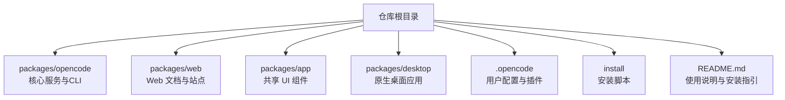
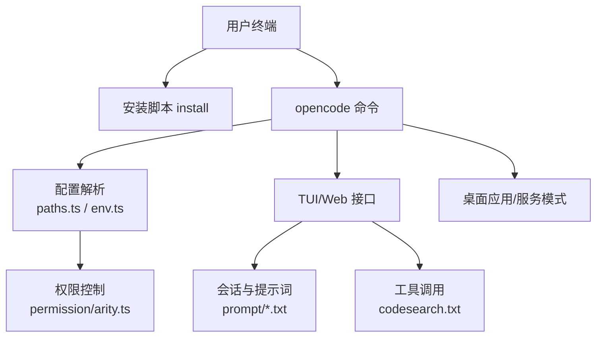
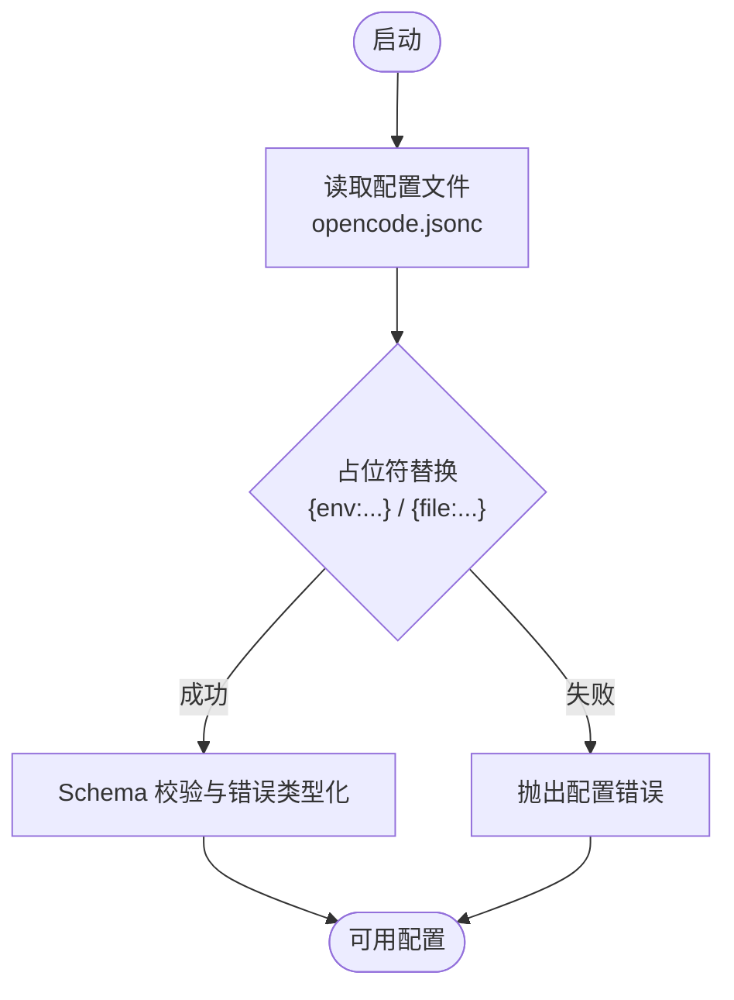
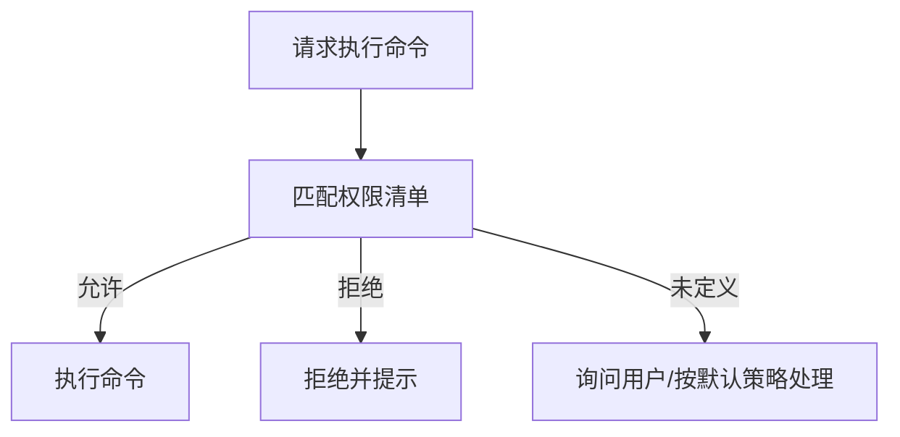
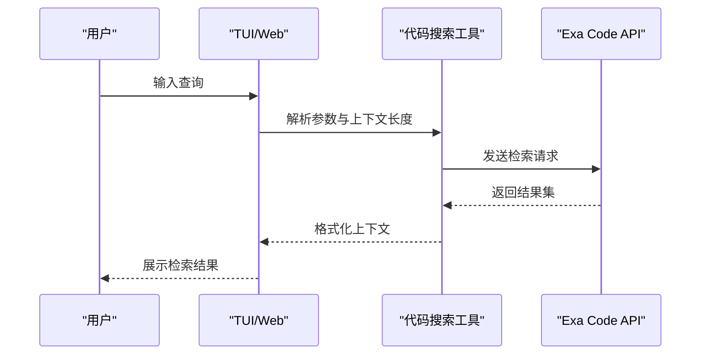
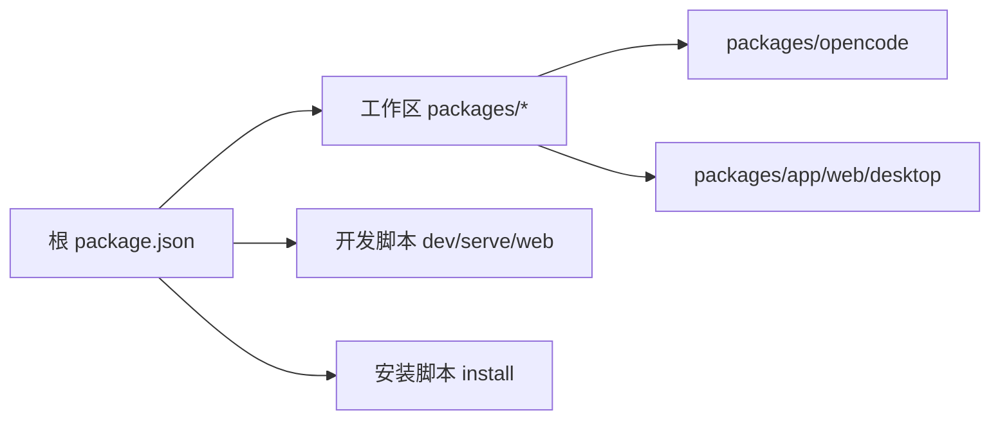

# 快速开始

<cite>
**本文引用的文件**
- [README.md](file://README.md)
- [install](file://install)
- [package.json](file://package.json)
- [.opencode/opencode.jsonc](file://.opencode/opencode.jsonc)
- [.opencode/tui.json](file://.opencode/tui.json)
- [CONTRIBUTING.md](file://CONTRIBUTING.md)
- [packages/opencode/src/config/paths.ts](file://packages/opencode/src/config/paths.ts)
- [packages/opencode/src/env/index.ts](file://packages/opencode/src/env/index.ts)
- [packages/opencode/src/permission/arity.ts](file://packages/opencode/src/permission/arity.ts)
- [packages/opencode/src/session/prompt/copilot-gpt-5.txt](file://packages/opencode/src/session/prompt/copilot-gpt-5.txt)
- [packages/opencode/src/session/prompt/beast.txt](file://packages/opencode/src/session/prompt/beast.txt)
- [packages/opencode/src/tool/codesearch.txt](file://packages/opencode/src/tool/codesearch.txt)
</cite>

## 目录
1. [简介](#简介)
2. [项目结构](#项目结构)
3. [核心组件](#核心组件)
4. [架构总览](#架构总览)
5. [详细组件分析](#详细组件分析)
6. [依赖分析](#依赖分析)
7. [性能考虑](#性能考虑)
8. [故障排除指南](#故障排除指南)
9. [结论](#结论)
10. [附录](#附录)

## 简介
本指南面向首次接触 OpenCode 的用户，帮助你在 5 分钟内完成安装、基础配置与第一次代码生成体验，并覆盖常见使用场景（如代码生成、代码搜索、项目分析）与常见问题排查。OpenCode 是一个开源的 AI 编程代理，支持 TUI 终端界面、多模型提供商、可插拔工具与权限控制，适合在本地或远程环境中进行开发协作。

## 项目结构
OpenCode 采用多包工作区组织方式，核心能力集中在 packages/opencode 中，同时提供 Web/TUI/桌面应用、SDK、插件与工具链等扩展模块。根目录提供了统一的安装脚本与文档，便于快速上手。

图示来源
- [README.md:46-84](file://README.md#L46-L84)
- [package.json:20-27](file://package.json#L20-L27)

章节来源
- [README.md:46-84](file://README.md#L46-L84)
- [package.json:20-27](file://package.json#L20-L27)

## 核心组件
- 安装与运行
  - 支持多种安装方式：一键脚本、包管理器、便携二进制、Nix 等。
  - 运行方式：终端交互（TUI）、无头服务（serve）、Web 界面（web）。
- 配置系统
  - 用户级配置位于 ~/.opencode/opencode.jsonc，支持环境变量与文件占位符替换。
  - TUI 插件与键位绑定通过 tui.json 管理。
- 权限与安全
  - 默认允许与限制的命令清单，避免危险操作。
- 工具与技能
  - 内置代码搜索工具，用于检索高质量上下文与示例。
- 提示词与会话
  - 预设提示词模板，指导代码生成与调试流程。

章节来源
- [README.md:46-84](file://README.md#L46-L84)
- [README.md:100-114](file://README.md#L100-L114)
- [.opencode/opencode.jsonc:1-19](file://.opencode/opencode.jsonc#L1-L19)
- [.opencode/tui.json:1-19](file://.opencode/tui.json#L1-L19)
- [packages/opencode/src/permission/arity.ts:65-134](file://packages/opencode/src/permission/arity.ts#L65-L134)
- [packages/opencode/src/tool/codesearch.txt:1-12](file://packages/opencode/src/tool/codesearch.txt#L1-L12)

## 架构总览
下图展示了从安装到首次交互的典型路径，以及配置、权限与工具如何协同工作。

图示来源
- [install:327-359](file://install#L327-L359)
- [packages/opencode/src/config/paths.ts:59-81](file://packages/opencode/src/config/paths.ts#L59-L81)
- [packages/opencode/src/env/index.ts:1-28](file://packages/opencode/src/env/index.ts#L1-L28)
- [packages/opencode/src/permission/arity.ts:65-134](file://packages/opencode/src/permission/arity.ts#L65-L134)
- [packages/opencode/src/tool/codesearch.txt:1-12](file://packages/opencode/src/tool/codesearch.txt#L1-L12)
- [packages/opencode/src/session/prompt/copilot-gpt-5.txt:57-75](file://packages/opencode/src/session/prompt/copilot-gpt-5.txt#L57-L75)

## 详细组件分析

### 安装与运行
- 安装方式
  - 一键脚本：自动识别平台与架构，下载对应二进制并写入 PATH。
  - 包管理器：npm/bun/pnpm/yarn、Homebrew、Scoop、Chocolatey、pacman 等。
  - Nix：nix run 或 github:anomalyco/opencode。
- 运行模式
  - TUI：直接运行 opencode 进入交互界面。
  - 服务模式：opencode serve 启动无头服务；opencode web 同时启动服务并打开浏览器。
  - 指定目录：opencode <目录> 在指定工作区启动 TUI。

章节来源
- [README.md:46-84](file://README.md#L46-L84)
- [install:327-359](file://install#L327-L359)
- [CONTRIBUTING.md:82-95](file://CONTRIBUTING.md#L82-L95)

### 配置系统
- 配置文件位置与加载
  - 用户配置：~/.opencode/opencode.jsonc，支持 $schema、环境变量与文件占位符替换。
  - 配置解析：读取文本后进行占位符替换与校验，缺失文件返回空值。
- 环境变量注入
  - 通过 {env:VAR} 注入进程环境变量，保证敏感信息不泄露到磁盘。
- TUI 插件与键位
  - 通过 tui.json 管理插件启用状态与快捷键，便于个性化定制。

图示来源
- [packages/opencode/src/config/paths.ts:59-81](file://packages/opencode/src/config/paths.ts#L59-L81)
- [packages/opencode/src/env/index.ts:1-28](file://packages/opencode/src/env/index.ts#L1-L28)
- [.opencode/opencode.jsonc:1-19](file://.opencode/opencode.jsonc#L1-L19)
- [.opencode/tui.json:1-19](file://.opencode/tui.json#L1-L19)

章节来源
- [packages/opencode/src/config/paths.ts:59-81](file://packages/opencode/src/config/paths.ts#L59-L81)
- [packages/opencode/src/env/index.ts:1-28](file://packages/opencode/src/env/index.ts#L1-L28)
- [.opencode/opencode.jsonc:1-19](file://.opencode/opencode.jsonc#L1-L19)
- [.opencode/tui.json:1-19](file://.opencode/tui.json#L1-L19)

### 权限与安全
- 默认策略
  - 仅允许有限命令集合，避免高风险操作。
  - 可通过配置对特定路径设置显式允许/拒绝。
- 交互提示
  - 对可能产生影响的操作（如执行脚本）进行确认或权限询问。

图示来源
- [packages/opencode/src/permission/arity.ts:65-134](file://packages/opencode/src/permission/arity.ts#L65-L134)
- [.opencode/opencode.jsonc:8-12](file://.opencode/opencode.jsonc#L8-L12)

章节来源
- [packages/opencode/src/permission/arity.ts:65-134](file://packages/opencode/src/permission/arity.ts#L65-L134)
- [.opencode/opencode.jsonc:8-12](file://.opencode/opencode.jsonc#L8-L12)

### 工具与技能：代码搜索
- 能力概述
  - 使用 Exa Code API 检索高质量上下文，覆盖库、SDK、API 与编程概念。
  - 可调节上下文长度以平衡精确性与覆盖面。
- 典型用法
  - 用于“查找某框架的某个特性实现”、“定位某语言的特定用法示例”等任务。

图示来源
- [packages/opencode/src/tool/codesearch.txt:1-12](file://packages/opencode/src/tool/codesearch.txt#L1-L12)

章节来源
- [packages/opencode/src/tool/codesearch.txt:1-12](file://packages/opencode/src/tool/codesearch.txt#L1-L12)

### 会话与提示词
- 提示词模板
  - copilot-gpt-5.txt 与 beast.txt 等模板定义了代码生成、变更与调试的步骤与规范。
- 实践要点
  - 生成前先读取足够上下文，小步增量修改，必要时自动生成 .env 占位。
  - 调试时聚焦根因，使用日志/临时代码验证假设。

章节来源
- [packages/opencode/src/session/prompt/copilot-gpt-5.txt:57-75](file://packages/opencode/src/session/prompt/copilot-gpt-5.txt#L57-L75)
- [packages/opencode/src/session/prompt/beast.txt:81-94](file://packages/opencode/src/session/prompt/beast.txt#L81-L94)

## 依赖分析
- 工作区与包管理
  - 根 package.json 定义了工作区与 catalog 依赖版本，确保多包一致性。
- 开发与调试
  - 提供 dev、serve、web、desktop 等命令，便于在不同层面对齐行为。
- 安装脚本
  - 自动检测平台/架构、musl、基线 CPU 要求，选择合适二进制并写入 PATH。

图示来源
- [package.json:20-27](file://package.json#L20-L27)
- [CONTRIBUTING.md:82-95](file://CONTRIBUTING.md#L82-L95)
- [install:327-359](file://install#L327-L359)

章节来源
- [package.json:20-27](file://package.json#L20-L27)
- [CONTRIBUTING.md:82-95](file://CONTRIBUTING.md#L82-L95)
- [install:327-359](file://install#L327-L359)

## 性能考虑
- 选择合适的二进制
  - 安装脚本会根据 CPU 特性与系统选择 baseline 或 musl 版本，减少兼容开销。
- 上下文长度权衡
  - 代码搜索工具支持调整 token 数量，在精确与全面之间取得平衡。
- 服务与 TUI 分离
  - 服务模式适合自动化与集成，TUI 更适合交互式探索。

章节来源
- [install:130-167](file://install#L130-L167)
- [packages/opencode/src/tool/codesearch.txt:7-11](file://packages/opencode/src/tool/codesearch.txt#L7-L11)
- [CONTRIBUTING.md:97-122](file://CONTRIBUTING.md#L97-L122)

## 故障排除指南
- 安装相关
  - 平台/架构不受支持：检查 uname 输出与 install 脚本中的目标组合。
  - 依赖缺失：Linux 需要 tar，非 Linux 需要 unzip；安装脚本会提示。
  - 版本冲突：安装前清理旧版本，使用 install 脚本或包管理器指定版本。
- 运行相关
  - 无法找到 opencode：确认 PATH 是否包含安装目录，或使用绝对路径。
  - 权限被拒：检查 permission/arity.ts 中的命令清单与配置文件中的显式允许/拒绝。
- 配置相关
  - 环境变量未生效：确认 {env:VAR} 占位符是否正确，且进程环境变量已设置。
  - 配置格式错误：查看配置解析错误类型，修正 JSON/JSONC 结构。
- 调试相关
  - 使用 Bun 调试：参考 CONTRIBUTING.md 中的调试建议，优先使用 --inspect 指定 ws 地址并分离调试服务与 TUI。

章节来源
- [install:103-110](file://install#L103-L110)
- [install:171-181](file://install#L171-L181)
- [install:221-235](file://install#L221-L235)
- [packages/opencode/src/config/paths.ts:42-57](file://packages/opencode/src/config/paths.ts#L42-L57)
- [packages/opencode/src/env/index.ts:10-27](file://packages/opencode/src/env/index.ts#L10-L27)
- [CONTRIBUTING.md:158-178](file://CONTRIBUTING.md#L158-L178)

## 结论
通过本指南，你可以在 5 分钟内完成 OpenCode 的安装、基础配置与一次完整的代码生成体验。随着使用深入，你可以逐步掌握权限控制、工具链与会话提示词的最佳实践，并结合服务/桌面模式提升日常开发效率。

## 附录

### 快速开始步骤
- 安装
  - 选择一种安装方式并完成安装，确保 opencode 命令可用。
- 初始化配置
  - 打开 ~/.opencode/opencode.jsonc，按需添加模型提供商与权限规则。
- 首次使用
  - 在任意项目目录运行 opencode，进入 TUI；或使用 opencode web 打开 Web 界面。
- 常用命令
  - opencode：启动 TUI
  - opencode serve：启动服务
  - opencode web：启动服务并打开浏览器
  - opencode <目录>：在指定目录启动 TUI

章节来源
- [README.md:46-84](file://README.md#L46-L84)
- [CONTRIBUTING.md:82-95](file://CONTRIBUTING.md#L82-L95)

### 典型使用场景
- 代码生成
  - 在 TUI 中描述需求，依据提示词模板进行上下文阅读与小步变更。
- 代码搜索
  - 使用内置工具检索相关库/API 示例，结合上下文进行整合。
- 项目分析
  - 利用权限控制与只读 Agent 进行探索性分析，避免误改。

章节来源
- [packages/opencode/src/session/prompt/copilot-gpt-5.txt:57-75](file://packages/opencode/src/session/prompt/copilot-gpt-5.txt#L57-L75)
- [packages/opencode/src/tool/codesearch.txt:1-12](file://packages/opencode/src/tool/codesearch.txt#L1-L12)
- [README.md:100-114](file://README.md#L100-L114)

### 最佳实践
- 配置
  - 将敏感信息通过 {env:VAR} 注入，避免硬编码到配置文件。
  - 为团队约定权限清单，明确允许/拒绝的命令与路径。
- 使用
  - 生成前先检索上下文，再进行小步增量修改。
  - 在调试中坚持“先定位根因，再修复症状”的原则。

章节来源
- [.opencode/opencode.jsonc:1-19](file://.opencode/opencode.jsonc#L1-L19)
- [packages/opencode/src/permission/arity.ts:65-134](file://packages/opencode/src/permission/arity.ts#L65-L134)
- [packages/opencode/src/session/prompt/beast.txt:88-94](file://packages/opencode/src/session/prompt/beast.txt#L88-L94)