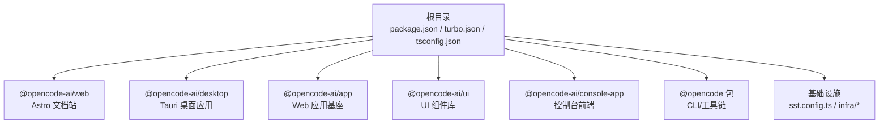
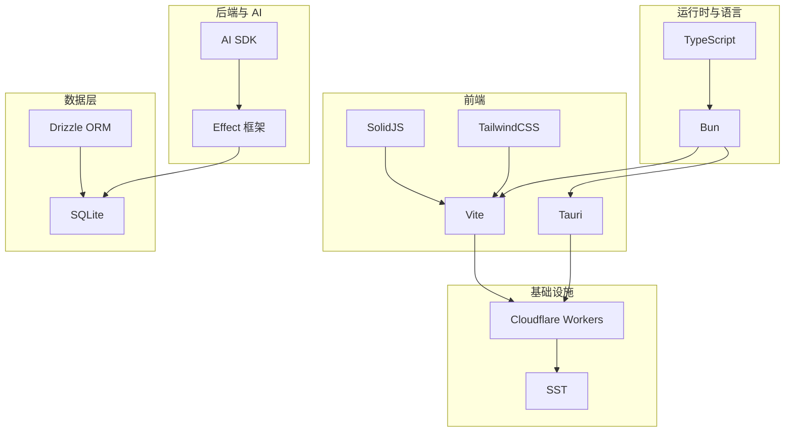
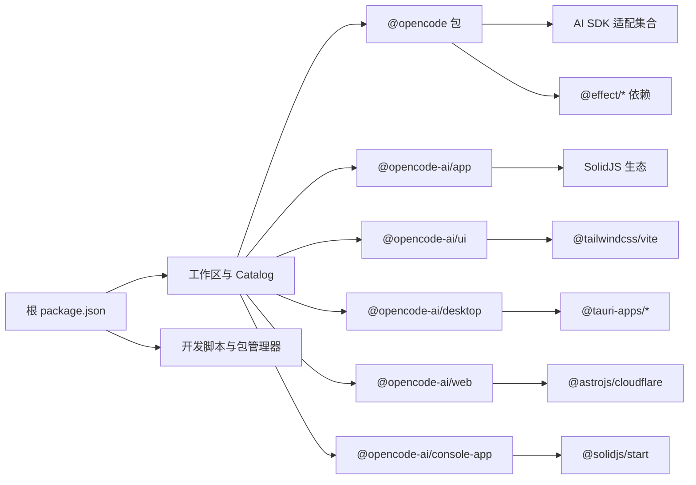

# 技术栈

<cite>
**本文引用的文件**
- [package.json](file://package.json)
- [turbo.json](file://turbo.json)
- [bunfig.toml](file://bunfig.toml)
- [tsconfig.json](file://tsconfig.json)
- [sst.config.ts](file://sst.config.ts)
- [packages/opencode/package.json](file://packages/opencode/package.json)
- [packages/web/package.json](file://packages/web/package.json)
- [packages/web/astro.config.mjs](file://packages/web/astro.config.mjs)
- [packages/desktop/package.json](file://packages/desktop/package.json)
- [packages/desktop/vite.config.ts](file://packages/desktop/vite.config.ts)
- [packages/app/package.json](file://packages/app/package.json)
- [packages/app/src/index.ts](file://packages/app/src/index.ts)
- [packages/ui/package.json](file://packages/ui/package.json)
- [packages/console/app/package.json](file://packages/console/app/package.json)
</cite>

## 目录
1. [简介](#简介)
2. [项目结构](#项目结构)
3. [核心组件](#核心组件)
4. [架构总览](#架构总览)
5. [详细组件分析](#详细组件分析)
6. [依赖关系分析](#依赖关系分析)
7. [性能考量](#性能考量)
8. [故障排查指南](#故障排查指南)
9. [结论](#结论)
10. [附录：学习路径与资源](#附录学习路径与资源)

## 简介
本文件系统性梳理 OpenCode 的技术栈与架构选择，重点覆盖：
- 开发语言与运行时：TypeScript + Bun
- 前端技术栈：SolidJS + TailwindCSS
- 后端与 AI 能力：AI SDK、Effect 框架
- 构建与打包：Vite、Tauri
- 云与基础设施：Cloudflare Workers、SST
- 数据层：SQLite + Drizzle ORM
- 多包管理：Turbo（monorepo）
- 学习路径与资源建议

## 项目结构
OpenCode 采用 monorepo 结构，根目录通过工作区与 Turbo 管理多包；各功能域以 packages 下子包组织，如 web、desktop、app、ui、console 等。根脚本与全局配置统一协调开发体验与构建流程。

图示来源
- [package.json:1-124](file://package.json#L1-L124)
- [turbo.json:1-32](file://turbo.json#L1-L32)
- [packages/web/package.json:1-45](file://packages/web/package.json#L1-L45)
- [packages/desktop/package.json:1-45](file://packages/desktop/package.json#L1-L45)
- [packages/app/package.json:1-78](file://packages/app/package.json#L1-L78)
- [packages/ui/package.json:1-76](file://packages/ui/package.json#L1-L76)
- [packages/console/app/package.json:1-47](file://packages/console/app/package.json#L1-L47)
- [packages/opencode/package.json:1-164](file://packages/opencode/package.json#L1-L164)
- [sst.config.ts:1-24](file://sst.config.ts#L1-L24)

章节来源
- [package.json:1-124](file://package.json#L1-L124)
- [turbo.json:1-32](file://turbo.json#L1-L32)
- [tsconfig.json:1-6](file://tsconfig.json#L1-L6)

## 核心组件
- 运行时与语言
  - TypeScript：统一类型系统，根 tsconfig 扩展 @tsconfig/bun，确保 Bun 环境兼容。
  - Bun：作为包管理器与运行时，脚本中大量使用 bun run、bun test、bun drizzle-kit 等命令。
- 构建与打包
  - Vite：桌面端与 Web 应用均使用 Vite 作为开发服务器与构建工具。
  - Tauri：桌面端基于 Tauri CLI，结合 Vite 配置进行原生窗口与系统能力集成。
- 前端框架与样式
  - SolidJS：广泛用于 app、ui、console 等包，强调响应式与细粒度更新。
  - TailwindCSS：通过 @tailwindcss/vite 插件在 Vite 中启用，配合 UI 包导出样式与主题。
- 后端与 AI 能力
  - AI SDK：在 opencode 包中引入多个 AI 提供商适配（如 OpenAI、Anthropic、Google 等），支持多模型与网关能力。
  - Effect 框架：在 opencode 包与 @effect/platform-node 中使用，提供函数式编程范式与可组合的运行时抽象。
- 云与基础设施
  - Cloudflare Workers：通过 Astro Cloudflare 适配器部署文档站；控制台与部分后端逻辑也面向 Cloudflare 平台。
  - SST：基础设施即代码，定义应用名称、清理策略、提供商（Stripe、PlanetScale）等。
- 数据层
  - SQLite + Drizzle ORM：通过 drizzle-kit 与 drizzle-orm 在 Bun 环境下进行迁移与查询。

章节来源
- [package.json:1-124](file://package.json#L1-L124)
- [packages/opencode/package.json:70-158](file://packages/opencode/package.json#L70-L158)
- [packages/app/package.json:41-76](file://packages/app/package.json#L41-L76)
- [packages/ui/package.json:44-74](file://packages/ui/package.json#L44-L74)
- [packages/console/app/package.json:13-35](file://packages/console/app/package.json#L13-L35)
- [packages/web/package.json:14-37](file://packages/web/package.json#L14-L37)
- [packages/web/astro.config.mjs:13-309](file://packages/web/astro.config.mjs#L13-L309)
- [packages/desktop/package.json:15-35](file://packages/desktop/package.json#L15-L35)
- [packages/desktop/vite.config.ts:1-39](file://packages/desktop/vite.config.ts#L1-L39)
- [sst.config.ts:1-24](file://sst.config.ts#L1-L24)

## 架构总览
OpenCode 的技术栈围绕“TypeScript + Bun”运行时展开，前端以 SolidJS 为核心，借助 Vite/Tauri 实现跨平台体验；后端与 AI 能力由 AI SDK 与 Effect 框架支撑；数据层采用 SQLite 与 Drizzle ORM；基础设施通过 SST 与 Cloudflare Workers 实现云原生部署。

图示来源
- [package.json:1-124](file://package.json#L1-L124)
- [packages/opencode/package.json:70-158](file://packages/opencode/package.json#L70-L158)
- [packages/app/package.json:41-76](file://packages/app/package.json#L41-L76)
- [packages/ui/package.json:44-74](file://packages/ui/package.json#L44-L74)
- [packages/web/astro.config.mjs:13-309](file://packages/web/astro.config.mjs#L13-L309)
- [packages/desktop/vite.config.ts:1-39](file://packages/desktop/vite.config.ts#L1-L39)
- [sst.config.ts:1-24](file://sst.config.ts#L1-L24)

## 详细组件分析

### TypeScript 与 Bun
- 类型系统：根 tsconfig 扩展 @tsconfig/bun，确保在 Bun 环境下的类型推断与编译行为一致。
- 包管理与运行：根 package.json 指定包管理器为 bun，并在多包中使用 bun run、bun test、bun drizzle-kit 等命令。
- 测试隔离：bunfig.toml 将测试根目录设置为非执行目录，避免从根目录误触发测试。

章节来源
- [tsconfig.json:1-6](file://tsconfig.json#L1-L6)
- [package.json:7-18](file://package.json#L7-L18)
- [bunfig.toml:1-7](file://bunfig.toml#L1-L7)

### 前端：SolidJS 与 TailwindCSS
- SolidJS：在 @opencode-ai/app、@opencode-ai/ui、@opencode-ai/console-app 等包中广泛使用，强调细粒度响应与高性能渲染。
- TailwindCSS：通过 @tailwindcss/vite 插件在 Vite 中启用，UI 包导出样式与主题，便于统一设计体系。
- 文档站：@opencode-ai/web 使用 Astro + @astrojs/solid-js + @astrojs/cloudflare，文档站点托管于 Cloudflare Workers。

章节来源
- [packages/app/package.json:41-76](file://packages/app/package.json#L41-L76)
- [packages/ui/package.json:44-74](file://packages/ui/package.json#L44-L74)
- [packages/web/package.json:14-37](file://packages/web/package.json#L14-L37)
- [packages/web/astro.config.mjs:13-309](file://packages/web/astro.config.mjs#L13-L309)

### 后端与 AI：AI SDK 与 Effect 框架
- AI SDK：opencode 包引入多家大模型提供商适配，覆盖 OpenAI、Anthropic、Google、Azure 等，便于统一调用与切换。
- Effect 框架：在 opencode 包与 @effect/platform-node 中使用，提供函数式错误处理、并发与资源管理能力，适合复杂后端逻辑与可观测性需求。
- 入口导出：app 包导出 AppBaseProviders、AppInterface 等，体现 Effect 与应用层的集成点。

章节来源
- [packages/opencode/package.json:70-158](file://packages/opencode/package.json#L70-L158)
- [packages/app/src/index.ts:1-8](file://packages/app/src/index.ts#L1-L8)

### 构建与打包：Vite 与 Tauri
- Vite：桌面端 @opencode-ai/desktop 与 Web 应用均使用 Vite，提供快速热重载与高效构建。
- Tauri：桌面端通过 @tauri-apps/cli 与 Vite 集成，vite.config.ts 引入 appPlugin 并配置固定端口与 HMR。
- 控制台：@opencode-ai/console-app 使用 @solidjs/start 与 Vite，结合 Cloudflare 插件与 wrangler。

章节来源
- [packages/desktop/package.json:15-35](file://packages/desktop/package.json#L15-L35)
- [packages/desktop/vite.config.ts:1-39](file://packages/desktop/vite.config.ts#L1-L39)
- [packages/console/app/package.json:13-35](file://packages/console/app/package.json#L13-L35)

### 云基础设施：Cloudflare Workers 与 SST
- Cloudflare Workers：Astro 文档站通过 @astrojs/cloudflare 适配器部署；控制台前端也面向 Cloudflare 平台。
- SST：通过 sst.config.ts 定义应用名称、清理策略、保护级别与提供商（Stripe、PlanetScale），统一基础设施配置。

章节来源
- [packages/web/astro.config.mjs:13-309](file://packages/web/astro.config.mjs#L13-L309)
- [packages/console/app/package.json:13-35](file://packages/console/app/package.json#L13-L35)
- [sst.config.ts:1-24](file://sst.config.ts#L1-L24)

### 数据层：SQLite 与 Drizzle ORM
- 数据库：SQLite 作为本地与轻量级服务场景首选。
- ORM：通过 drizzle-kit 与 drizzle-orm 在 Bun 环境下进行迁移与查询，opencode 包提供 db 相关脚本与导入别名。

章节来源
- [packages/opencode/package.json:22-36](file://packages/opencode/package.json#L22-L36)
- [package.json:47-48](file://package.json#L47-L48)

### monorepo 管理：Turbo
- 任务编排：turbo.json 定义 typecheck、build 等任务，设置输出目录与依赖顺序，提升缓存命中与并行效率。
- 工作区：根 package.json 的 workspaces 与 catalog 管理依赖版本与共享类型，减少重复安装与版本漂移。

章节来源
- [turbo.json:1-32](file://turbo.json#L1-L32)
- [package.json:20-75](file://package.json#L20-L75)

## 依赖关系分析

图示来源
- [package.json:20-75](file://package.json#L20-L75)
- [packages/opencode/package.json:70-158](file://packages/opencode/package.json#L70-L158)
- [packages/app/package.json:41-76](file://packages/app/package.json#L41-L76)
- [packages/ui/package.json:44-74](file://packages/ui/package.json#L44-L74)
- [packages/desktop/package.json:15-35](file://packages/desktop/package.json#L15-L35)
- [packages/web/package.json:14-37](file://packages/web/package.json#L14-L37)
- [packages/console/app/package.json:13-35](file://packages/console/app/package.json#L13-L35)

章节来源
- [package.json:20-75](file://package.json#L20-L75)

## 性能考量
- Bun 运行时：以更快的启动与执行速度优化开发体验与构建性能。
- Vite：快速冷启与热重载，桌面端通过固定端口与 HMR 配置提升调试效率。
- SolidJS：细粒度响应与最小化重渲染，降低前端渲染开销。
- Effect：函数式并发与资源管理，有助于后端长尾延迟与错误恢复。
- Drizzle ORM：在 SQLite 场景下提供简洁的查询与迁移体验，避免复杂 ORM 的额外成本。
- Cloudflare Workers：边缘部署降低网络往返，适合静态文档与轻量 API。

## 故障排查指南
- 测试隔离：bunfig.toml 将测试根目录设置为不可执行目录，避免从根目录误触发测试。
- 构建输出：turbo.json 为 build 任务配置输出目录，确保缓存与增量构建正确。
- 类型检查：根与各包的 typecheck 脚本配合 tsgo 或 tsc，定位类型问题。
- 依赖版本：catalog 与 overrides 管理统一版本，减少冲突；若出现解析异常，优先检查 catalog 对应版本是否可用。

章节来源
- [bunfig.toml:1-7](file://bunfig.toml#L1-L7)
- [turbo.json:5-30](file://turbo.json#L5-L30)
- [package.json:14, 20-75](file://package.json#L14,L20-L75)

## 结论
OpenCode 的技术栈以 TypeScript + Bun 为基础，结合 SolidJS、Vite/Tauri、AI SDK、Effect 框架、Cloudflare Workers 与 SST、SQLite/Drizzle，形成一套现代化、高性能且易于维护的全栈方案。Turbo 管理多包协作，确保开发与发布效率。该组合既满足桌面端与 Web 端的用户体验，又兼顾后端与 AI 能力的扩展性与可观测性。

## 附录：学习路径与资源
- TypeScript 与 Bun
  - 学习路径：从基础类型系统到 Bun 的包管理与运行时特性
  - 参考资源：TypeScript 官方文档、Bun 官方文档
- 前端：SolidJS 与 TailwindCSS
  - 学习路径：SolidJS 响应式与组件模式 → TailwindCSS 实战 → Vite 集成
  - 参考资源：SolidJS 官方文档、TailwindCSS 官方文档
- 后端与 AI：AI SDK 与 Effect
  - 学习路径：Effect 基础与并发 → AI SDK 多模型适配 → 服务端集成
  - 参考资源：Effect 官方文档、AI SDK 官方文档
- 构建与打包：Vite 与 Tauri
  - 学习路径：Vite 配置与插件 → Tauri 原生集成 → 桌面端发布
  - 参考资源：Vite 官方文档、Tauri 官方文档
- 云与基础设施：Cloudflare Workers 与 SST
  - 学习路径：Cloudflare Workers 部署 → SST 基础设施即代码 → PlanetScale/Stripe 集成
  - 参考资源：Cloudflare Workers 官方文档、SST 官方文档
- 数据层：SQLite 与 Drizzle ORM
  - 学习路径：SQLite 基础 → Drizzle 迁移与查询 → Bun 环境实践
  - 参考资源：Drizzle 官方文档、SQLite 官方文档
- monorepo：Turbo
  - 学习路径：Turbo 基础任务 → 缓存与并行 → 工作区与 Catalog 管理
  - 参考资源：Turbo 官方文档