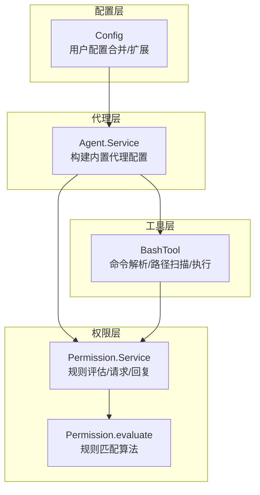
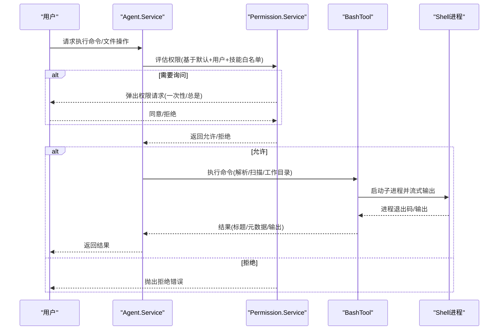
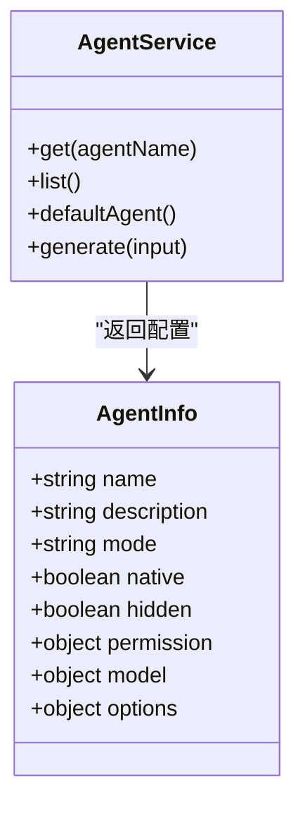
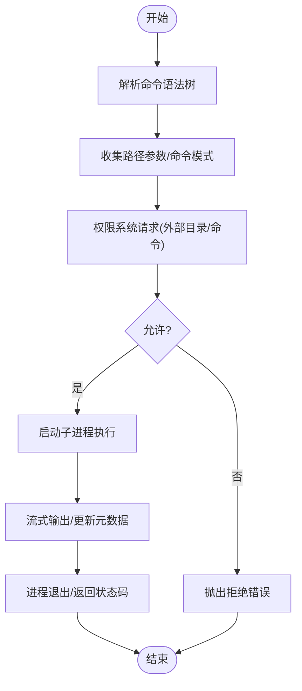
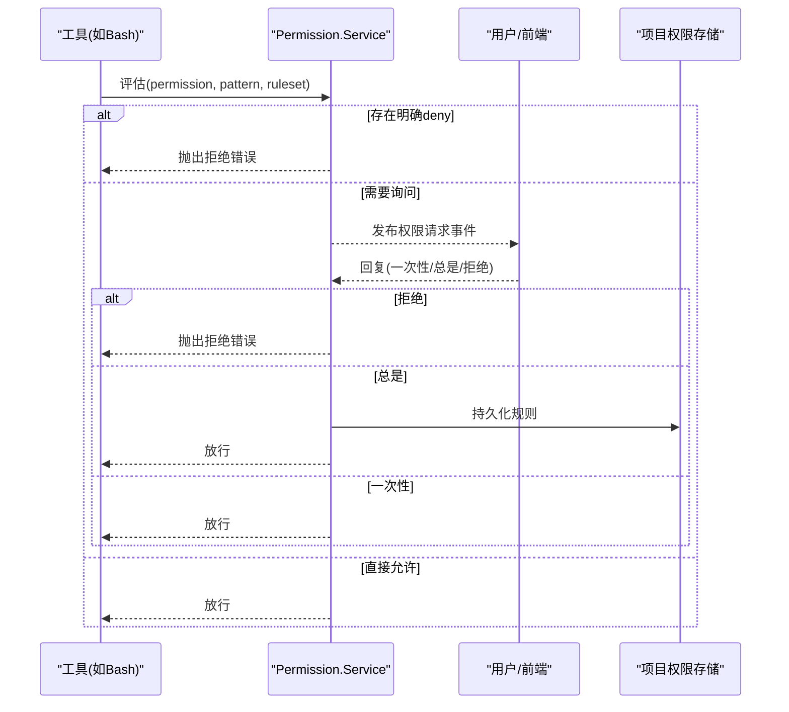
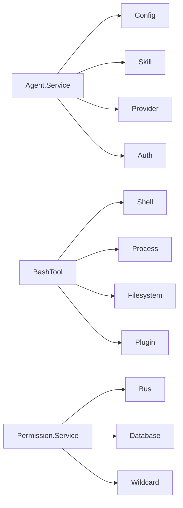

# Build 代理

<cite>
**本文引用的文件**
- [packages/opencode/src/agent/agent.ts](file://packages/opencode/src/agent/agent.ts)
- [packages/opencode/src/tool/bash.ts](file://packages/opencode/src/tool/bash.ts)
- [packages/opencode/src/permission/index.ts](file://packages/opencode/src/permission/index.ts)
- [packages/opencode/test/agent/agent.test.ts](file://packages/opencode/test/agent/agent.test.ts)
- [packages/web/src/content/docs/zh-tw/agents.mdx](file://packages/web/src/content/docs/zh-tw/agents.mdx)
- [packages/opencode/src/config/config.ts](file://packages/opencode/src/config/config.ts)
- [packages/opencode/src/permission/evaluate.ts](file://packages/opencode/src/permission/evaluate.ts)
- [packages/opencode/src/permission/arity.ts](file://packages/opencode/src/permission/arity.ts)
- [packages/opencode/test/permission/next.test.ts](file://packages/opencode/test/permission/next.test.ts)
</cite>

## 目录
1. [简介](#简介)
2. [项目结构](#项目结构)
3. [核心组件](#核心组件)
4. [架构总览](#架构总览)
5. [详细组件分析](#详细组件分析)
6. [依赖关系分析](#依赖关系分析)
7. [性能考量](#性能考量)
8. [故障排查指南](#故障排查指南)
9. [结论](#结论)
10. [附录](#附录)

## 简介
本文件面向 OpenCode 的 Build 代理，系统性阐述其作为“全权限代理”的核心能力与安全机制。Build 代理是默认主代理（primary），具备最强的工具调用权限：可直接执行 Bash 命令、读写项目文件系统、访问外部目录、进行计划模式交互等。同时，它通过细粒度的权限规则与“询问-同意”流程，确保在开放能力的同时保持可控与可审计。

## 项目结构
围绕 Build 代理的关键代码分布在以下模块：
- 代理定义与默认配置：packages/opencode/src/agent/agent.ts
- Bash 工具与路径扫描：packages/opencode/src/tool/bash.ts
- 权限系统与规则评估：packages/opencode/src/permission/index.ts 及其子模块
- 配置解析与合并：packages/opencode/src/config/config.ts
- 测试与示例文档：packages/opencode/test/agent/agent.test.ts、packages/web/src/content/docs/zh-tw/agents.mdx

图表来源
- [packages/opencode/src/agent/agent.ts:107-122](file://packages/opencode/src/agent/agent.ts#L107-L122)
- [packages/opencode/src/tool/bash.ts:439-496](file://packages/opencode/src/tool/bash.ts#L439-L496)
- [packages/opencode/src/permission/index.ts:140-269](file://packages/opencode/src/permission/index.ts#L140-L269)
- [packages/opencode/src/config/config.ts:458-468](file://packages/opencode/src/config/config.ts#L458-L468)

章节来源
- [packages/opencode/src/agent/agent.ts:107-122](file://packages/opencode/src/agent/agent.ts#L107-L122)
- [packages/opencode/src/tool/bash.ts:439-496](file://packages/opencode/src/tool/bash.ts#L439-L496)
- [packages/opencode/src/permission/index.ts:140-269](file://packages/opencode/src/permission/index.ts#L140-L269)
- [packages/opencode/src/config/config.ts:458-468](file://packages/opencode/src/config/config.ts#L458-L468)

## 核心组件
- Build 代理身份与默认权限
  - Build 代理被注册为内置 primary 代理，默认开启“question/plan_enter”等交互能力，整体权限以“允许一切”为基础，再叠加用户配置与技能白名单目录。
  - 默认策略包含：通配符允许、环境外目录访问需“询问”、敏感文件读取（如 .env）需“询问”、计划模式相关工具允许等。
- Bash 工具
  - 支持命令解析、路径参数提取、工作目录解析、超时控制、输出预览、跨平台 Shell 执行（含 PowerShell）。
  - 在执行前会扫描命令涉及的路径与模式，向权限系统发起“外部目录/命令”两类请求。
- 权限系统
  - 规则由“默认规则 + 用户规则 + 技能白名单目录”三层合并而来；支持“允许/拒绝/询问”三态。
  - 评估采用“从后向前匹配”的规则优先级，确保更具体的规则覆盖更通用规则。
  - 提供“一次性/总是”两种同意方式，支持批量放行后续同类请求。

章节来源
- [packages/opencode/src/agent/agent.ts:86-122](file://packages/opencode/src/agent/agent.ts#L86-L122)
- [packages/opencode/src/tool/bash.ts:24-51](file://packages/opencode/src/tool/bash.ts#L24-L51)
- [packages/opencode/src/tool/bash.ts:267-288](file://packages/opencode/src/tool/bash.ts#L267-L288)
- [packages/opencode/src/permission/index.ts:22-41](file://packages/opencode/src/permission/index.ts#L22-L41)
- [packages/opencode/src/permission/index.ts:133-136](file://packages/opencode/src/permission/index.ts#L133-L136)
- [packages/opencode/src/permission/index.ts:293-295](file://packages/opencode/src/permission/index.ts#L293-L295)

## 架构总览
下图展示 Build 代理在一次典型任务中的调用链：代理获取 → 权限评估 → Bash 工具执行 → 输出返回。

图表来源
- [packages/opencode/src/agent/agent.ts:319-391](file://packages/opencode/src/agent/agent.ts#L319-L391)
- [packages/opencode/src/permission/index.ts:167-202](file://packages/opencode/src/permission/index.ts#L167-L202)
- [packages/opencode/src/tool/bash.ts:470-494](file://packages/opencode/src/tool/bash.ts#L470-L494)

## 详细组件分析

### 组件一：Agent.Service（Build 代理）
- 职责
  - 注册内置代理（含 build/general/explore/plan 等），构建默认权限规则集。
  - 将默认规则、用户配置、技能白名单目录合并，形成最终权限。
  - 确保未显式禁止时，允许对实例根目录的通配访问（Truncate.GLOB）。
- 关键点
  - Build 代理默认为 primary，且具备交互能力（question/plan_enter/plan_exit）。
  - 外部目录访问默认为“询问”，除非显式允许或技能白名单覆盖。
  - 用户可在全局或代理级覆盖权限，后者优先于前者。

图表来源
- [packages/opencode/src/agent/agent.ts:54-66](file://packages/opencode/src/agent/agent.ts#L54-L66)
- [packages/opencode/src/agent/agent.ts:107-122](file://packages/opencode/src/agent/agent.ts#L107-L122)

章节来源
- [packages/opencode/src/agent/agent.ts:86-122](file://packages/opencode/src/agent/agent.ts#L86-L122)
- [packages/opencode/src/agent/agent.ts:265-279](file://packages/opencode/src/agent/agent.ts#L265-L279)

### 组件二：BashTool（命令执行）
- 职责
  - 解析命令语法树，提取涉及的路径参数与命令模式。
  - 对工作目录进行解析与规范化，确保在项目实例范围内。
  - 发起权限请求（外部目录/命令），执行子进程并流式返回输出。
- 安全要点
  - 路径扫描仅针对“文件类命令”（如 rm/cp/mv/mkdir/cat 等）提取目标路径。
  - 支持超时与中断，避免长时间阻塞。
  - 跨平台处理（Bash/Pwsh），Windows 下特殊兼容。

图表来源
- [packages/opencode/src/tool/bash.ts:261-265](file://packages/opencode/src/tool/bash.ts#L261-L265)
- [packages/opencode/src/tool/bash.ts:267-288](file://packages/opencode/src/tool/bash.ts#L267-L288)
- [packages/opencode/src/tool/bash.ts:317-409](file://packages/opencode/src/tool/bash.ts#L317-L409)

章节来源
- [packages/opencode/src/tool/bash.ts:24-51](file://packages/opencode/src/tool/bash.ts#L24-L51)
- [packages/opencode/src/tool/bash.ts:439-496](file://packages/opencode/src/tool/bash.ts#L439-L496)

### 组件三：Permission.Service（权限评估与请求）
- 职责
  - 将默认规则、用户规则、已批准规则合并，评估某次工具调用是否允许。
  - 对需要“询问”的请求，通过事件总线通知前端，等待用户“一次性/总是/拒绝”。
  - “总是”同意将规则持久化到项目权限表，后续同类请求自动放行。
- 规则优先级
  - 采用“从后向前匹配”的策略，最后一条匹配规则生效，确保更具体规则覆盖更通用规则。
  - 支持通配符与 glob 模式，允许对特定命令或路径精确控制。

图表来源
- [packages/opencode/src/permission/index.ts:167-202](file://packages/opencode/src/permission/index.ts#L167-L202)
- [packages/opencode/src/permission/index.ts:204-260](file://packages/opencode/src/permission/index.ts#L204-L260)
- [packages/opencode/src/permission/evaluate.ts](file://packages/opencode/src/permission/evaluate.ts)

章节来源
- [packages/opencode/src/permission/index.ts:22-41](file://packages/opencode/src/permission/index.ts#L22-L41)
- [packages/opencode/src/permission/index.ts:133-136](file://packages/opencode/src/permission/index.ts#L133-L136)
- [packages/opencode/test/permission/next.test.ts:194-233](file://packages/opencode/test/permission/next.test.ts#L194-L233)

### 组件四：配置与规则合并
- 用户可通过全局配置或代理级配置覆盖默认权限。
- 配置解析保留原始键序，确保规则合并顺序稳定。
- Build 代理的权限在默认规则之上叠加用户配置，且技能白名单目录始终允许访问。

章节来源
- [packages/opencode/src/config/config.ts:458-468](file://packages/opencode/src/config/config.ts#L458-L468)
- [packages/opencode/src/agent/agent.ts:236-263](file://packages/opencode/src/agent/agent.ts#L236-L263)

## 依赖关系分析
- Agent.Service 依赖 Config、Skill、Provider、Auth 等服务，构建默认权限与代理列表。
- BashTool 依赖 Shell、Process、Filesystem、Plugin 等，负责命令解析与执行。
- Permission.Service 依赖 Bus、Database、Wildcard 等，负责权限请求、回复与持久化。

图表来源
- [packages/opencode/src/agent/agent.ts:72-79](file://packages/opencode/src/agent/agent.ts#L72-L79)
- [packages/opencode/src/tool/bash.ts:1-22](file://packages/opencode/src/tool/bash.ts#L1-L22)
- [packages/opencode/src/permission/index.ts:140-142](file://packages/opencode/src/permission/index.ts#L140-L142)

章节来源
- [packages/opencode/src/agent/agent.ts:72-79](file://packages/opencode/src/agent/agent.ts#L72-L79)
- [packages/opencode/src/tool/bash.ts:1-22](file://packages/opencode/src/tool/bash.ts#L1-L22)
- [packages/opencode/src/permission/index.ts:140-142](file://packages/opencode/src/permission/index.ts#L140-L142)

## 性能考量
- 命令解析与路径扫描：使用语法树解析，避免正则误判；仅对文件类命令提取路径，减少不必要的权限请求。
- 流式输出：子进程输出边产生边上报，降低大输出时的内存峰值。
- 超时与中断：默认超时可配置，支持用户中断，避免长时间占用资源。
- 权限缓存：已“总是”同意的规则会持久化，后续同类请求无需重复确认。

章节来源
- [packages/opencode/src/tool/bash.ts:24-51](file://packages/opencode/src/tool/bash.ts#L24-L51)
- [packages/opencode/src/tool/bash.ts:317-409](file://packages/opencode/src/tool/bash.ts#L317-L409)
- [packages/opencode/src/permission/index.ts:204-260](file://packages/opencode/src/permission/index.ts#L204-L260)

## 故障排查指南
- 权限被拒绝
  - 检查规则评估结果：是否存在“deny”规则或“ask”但用户拒绝。
  - 使用“总是”同意将规则持久化，避免重复弹窗。
- Bash 命令执行失败
  - 查看输出元数据中的超时/中断提示。
  - 确认工作目录与路径解析是否正确（支持 ~/$HOME 自动展开）。
- 权限规则不生效
  - 确认规则合并顺序：后出现的规则覆盖先前规则。
  - 检查是否使用了通配符“*”导致覆盖预期。

章节来源
- [packages/opencode/src/permission/index.ts:175-179](file://packages/opencode/src/permission/index.ts#L175-L179)
- [packages/opencode/src/tool/bash.ts:393-398](file://packages/opencode/src/tool/bash.ts#L393-L398)
- [packages/opencode/test/permission/next.test.ts:206-220](file://packages/opencode/test/permission/next.test.ts#L206-L220)

## 结论
Build 代理通过“默认开放 + 严格评估 + 询问同意”的设计，在保证强大能力的同时确保安全可控。其权限模型灵活、可配置性强，适合承担代码生成、文件修改、项目重构等高风险任务。建议在生产环境中结合“总是”授权策略与最小权限原则，谨慎使用 Bash 的高危命令，并定期审查权限记录。

## 附录

### 使用场景与最佳实践
- 代码生成与模板填充：利用 Build 代理的 Bash 能力批量生成/替换文件，配合权限系统对目标目录进行白名单控制。
- 文件修改与批量重命名：通过 Bash 工具执行移动/复制/权限变更命令，注意对关键路径设置“询问”以避免误操作。
- 项目重构与迁移：在受控目录内执行重构脚本，使用“总是”同意将常用命令规则持久化，提升效率。
- 安全加固建议
  - 为高危命令（如 rm、chmod）单独设置 deny 或 ask。
  - 使用 glob 精确限定允许范围，避免通配符滥用。
  - 定期审阅权限历史与拒绝记录，及时调整策略。

章节来源
- [packages/opencode/test/agent/agent.test.ts:201-244](file://packages/opencode/test/agent/agent.test.ts#L201-L244)
- [packages/web/src/content/docs/zh-tw/agents.mdx:429-502](file://packages/web/src/content/docs/zh-tw/agents.mdx#L429-L502)