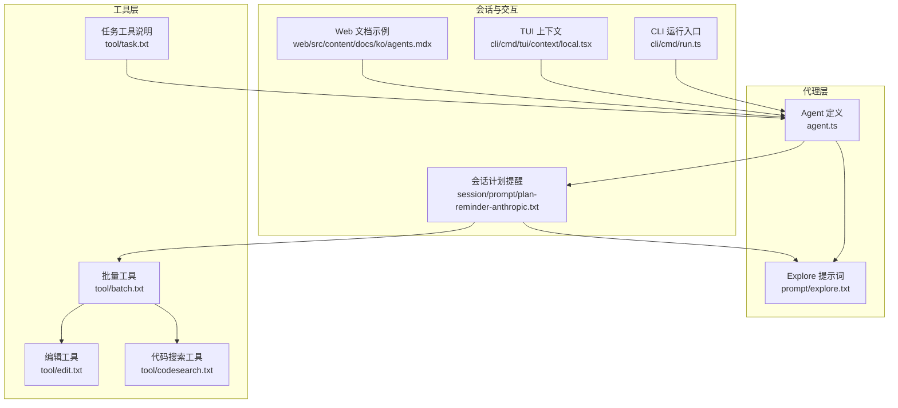
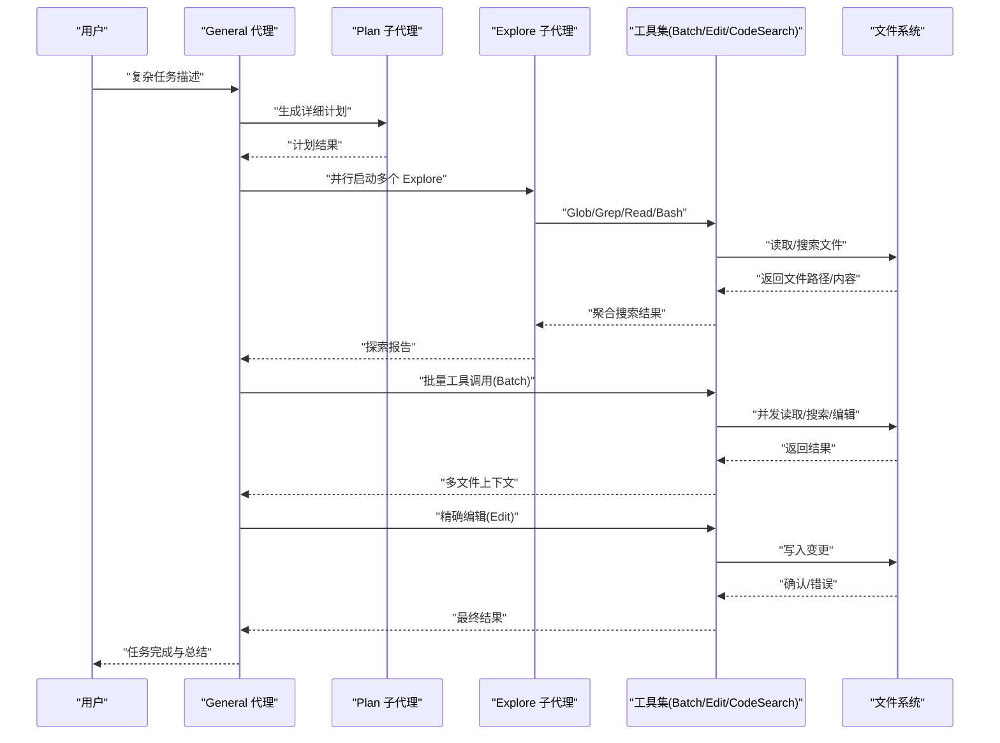
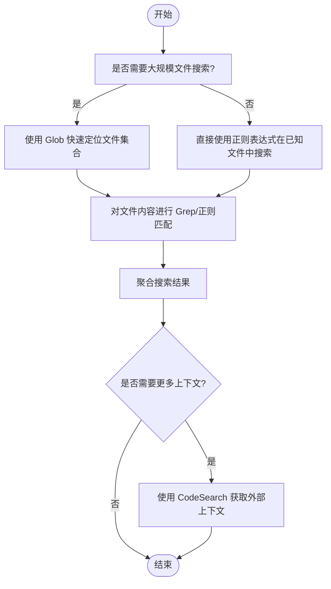
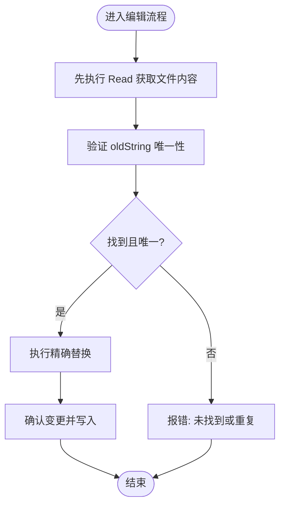
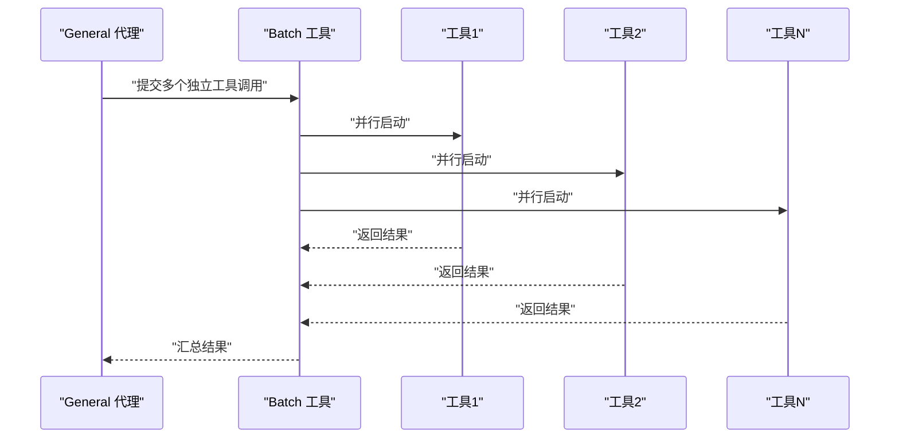
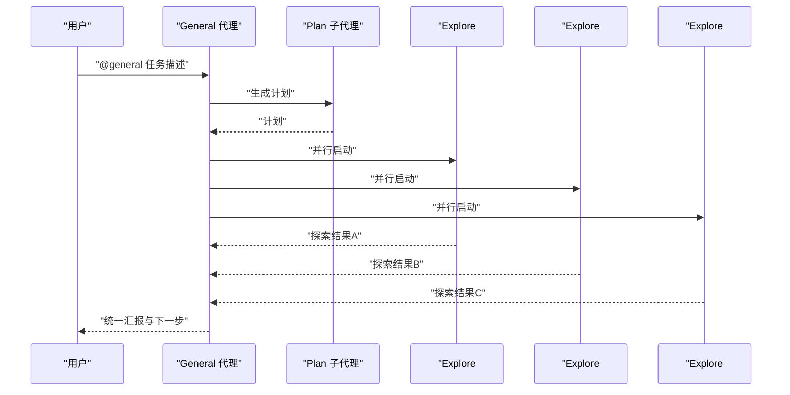
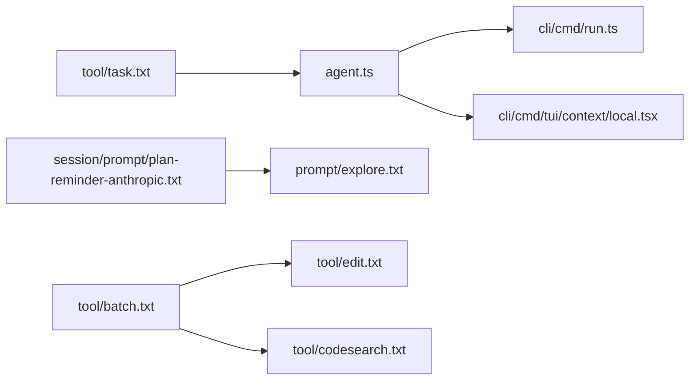

# General 代理

<cite>
**本文引用的文件**
- [packages/opencode/src/agent/prompt/explore.txt](file://packages/opencode/src/agent/prompt/explore.txt)
- [packages/opencode/src/tool/batch.txt](file://packages/opencode/src/tool/batch.txt)
- [packages/opencode/src/tool/edit.txt](file://packages/opencode/src/tool/edit.txt)
- [packages/opencode/src/tool/codesearch.txt](file://packages/opencode/src/tool/codesearch.txt)
- [packages/opencode/src/session/prompt/plan-reminder-anthropic.txt](file://packages/opencode/src/session/prompt/plan-reminder-anthropic.txt)
- [packages/opencode/src/agent/agent.ts](file://packages/opencode/src/agent/agent.ts)
- [packages/opencode/src/cli/cmd/run.ts](file://packages/opencode/src/cli/cmd/run.ts)
- [packages/opencode/src/cli/cmd/tui/context/local.tsx](file://packages/opencode/src/cli/cmd/tui/context/local.tsx)
- [packages/web/src/content/docs/ko/agents.mdx](file://packages/web/src/content/docs/ko/agents.mdx)
- [packages/opencode/src/tool/task.txt](file://packages/opencode/src/tool/task.txt)
</cite>

## 目录
1. [简介](#简介)
2. [项目结构](#项目结构)
3. [核心组件](#核心组件)
4. [架构总览](#架构总览)
5. [详细组件分析](#详细组件分析)
6. [依赖分析](#依赖分析)
7. [性能考虑](#性能考虑)
8. [故障排查指南](#故障排查指南)
9. [结论](#结论)
10. [附录](#附录)

## 简介
本文件面向 OpenCode 的 General 代理（通用代理），系统化阐述其在复杂多步任务中的角色定位、与 Explore 子代理的协作关系、以及在大规模代码库中执行“文件搜索、代码片段提取、多文件编辑”的通用能力。文档重点覆盖以下方面：
- 搜索与匹配机制：基于 Glob、Grep、正则表达式与 Exa Code API 的组合策略
- 精确查找与替换：基于 Read + Edit 的严格匹配与容错策略
- 多文件操作：通过 Batch 工具并发执行多个独立工具调用
- 使用场景与最佳实践：代码重构、批量修改、跨文件分析
- 与其他代理的协作：Primary/Secondary 模型下的任务编排与子代理调用

## 项目结构
与 General 代理相关的关键目录与文件如下：
- 代理定义与模式：packages/opencode/src/agent/agent.ts
- Explore 子代理提示词：packages/opencode/src/agent/prompt/explore.txt
- 批量工具：packages/opencode/src/tool/batch.txt
- 编辑工具：packages/opencode/src/tool/edit.txt
- 代码搜索工具：packages/opencode/src/tool/codesearch.txt
- 会话计划提醒（包含并行启动 Explore 的指导）：packages/opencode/src/session/prompt/plan-reminder-anthropic.txt
- CLI 交互与主代理选择：packages/opencode/src/cli/cmd/run.ts、packages/opencode/src/cli/cmd/tui/context/local.tsx
- 文档示例（@general 调用方式）：packages/web/src/content/docs/ko/agents.mdx
- 任务工具说明（Task 工具与子代理类型）：packages/opencode/src/tool/task.txt

**图表来源**
- [packages/opencode/src/agent/agent.ts:26-317](file://packages/opencode/src/agent/agent.ts#L26-L317)
- [packages/opencode/src/agent/prompt/explore.txt:1-19](file://packages/opencode/src/agent/prompt/explore.txt#L1-L19)
- [packages/opencode/src/tool/batch.txt:1-24](file://packages/opencode/src/tool/batch.txt#L1-L24)
- [packages/opencode/src/tool/edit.txt:1-10](file://packages/opencode/src/tool/edit.txt#L1-L10)
- [packages/opencode/src/tool/codesearch.txt:1-12](file://packages/opencode/src/tool/codesearch.txt#L1-L12)
- [packages/opencode/src/session/prompt/plan-reminder-anthropic.txt:24-43](file://packages/opencode/src/session/prompt/plan-reminder-anthropic.txt#L24-L43)
- [packages/opencode/src/cli/cmd/run.ts:580-627](file://packages/opencode/src/cli/cmd/run.ts#L580-L627)
- [packages/opencode/src/cli/cmd/tui/context/local.tsx:37-83](file://packages/opencode/src/cli/cmd/tui/context/local.tsx#L37-L83)
- [packages/web/src/content/docs/ko/agents.mdx:110-120](file://packages/web/src/content/docs/ko/agents.mdx#L110-L120)
- [packages/opencode/src/tool/task.txt:1-15](file://packages/opencode/src/tool/task.txt#L1-L15)

**章节来源**
- [packages/opencode/src/agent/agent.ts:26-317](file://packages/opencode/src/agent/agent.ts#L26-L317)
- [packages/opencode/src/agent/prompt/explore.txt:1-19](file://packages/opencode/src/agent/prompt/explore.txt#L1-L19)
- [packages/opencode/src/tool/batch.txt:1-24](file://packages/opencode/src/tool/batch.txt#L1-L24)
- [packages/opencode/src/tool/edit.txt:1-10](file://packages/opencode/src/tool/edit.txt#L1-L10)
- [packages/opencode/src/tool/codesearch.txt:1-12](file://packages/opencode/src/tool/codesearch.txt#L1-L12)
- [packages/opencode/src/session/prompt/plan-reminder-anthropic.txt:24-43](file://packages/opencode/src/session/prompt/plan-reminder-anthropic.txt#L24-L43)
- [packages/opencode/src/cli/cmd/run.ts:580-627](file://packages/opencode/src/cli/cmd/run.ts#L580-L627)
- [packages/opencode/src/cli/cmd/tui/context/local.tsx:37-83](file://packages/opencode/src/cli/cmd/tui/context/local.tsx#L37-L83)
- [packages/web/src/content/docs/ko/agents.mdx:110-120](file://packages/web/src/content/docs/ko/agents.mdx#L110-L120)
- [packages/opencode/src/tool/task.txt:1-15](file://packages/opencode/src/tool/task.txt#L1-L15)

## 核心组件
- 代理模式与可见性
  - 代理分为 primary、subagent、all 三种模式；primary 代理可被用户直接选择，subagent 由 primary 代理自动或手动调用以完成特定任务。
  - 默认代理与隐藏代理的约束：默认代理必须是 primary 且未隐藏；否则会回退到其他可用 primary 代理。
- Explore 子代理
  - 专长于文件搜索、正则匹配与内容读取；适合在大规模代码库中快速定位目标文件与代码片段。
- 批量工具（Batch）
  - 并发执行多个独立工具调用，显著降低延迟；适用于多文件读取、多处 grep、多 bash 命令、跨文件的多段编辑等。
- 编辑工具（Edit）
  - 基于精确字符串替换；要求先 Read 再 Edit，并对 oldString 的唯一性与上下文严格校验，避免误改。
- 代码搜索工具（CodeSearch）
  - 基于 Exa Code API，提供高质量、最新的库、SDK 与 API 上下文，适合通用编程问题与模式检索。

**章节来源**
- [packages/opencode/src/agent/agent.ts:26-317](file://packages/opencode/src/agent/agent.ts#L26-L317)
- [packages/opencode/src/agent/prompt/explore.txt:1-19](file://packages/opencode/src/agent/prompt/explore.txt#L1-L19)
- [packages/opencode/src/tool/batch.txt:1-24](file://packages/opencode/src/tool/batch.txt#L1-L24)
- [packages/opencode/src/tool/edit.txt:1-10](file://packages/opencode/src/tool/edit.txt#L1-L10)
- [packages/opencode/src/tool/codesearch.txt:1-12](file://packages/opencode/src/tool/codesearch.txt#L1-L12)

## 架构总览
General 代理作为 primary 代理，负责：
- 接收用户复杂多步任务请求
- 在必要时并行启动 Explore 子代理进行探索
- 组织批量工具调用以高效完成多文件读取与搜索
- 通过精确编辑工具执行替换与重命名
- 与会话计划流程协同，确保任务规划与合成阶段的连贯性

**图表来源**
- [packages/opencode/src/session/prompt/plan-reminder-anthropic.txt:24-43](file://packages/opencode/src/session/prompt/plan-reminder-anthropic.txt#L24-L43)
- [packages/opencode/src/agent/prompt/explore.txt:1-19](file://packages/opencode/src/agent/prompt/explore.txt#L1-L19)
- [packages/opencode/src/tool/batch.txt:1-24](file://packages/opencode/src/tool/batch.txt#L1-L24)
- [packages/opencode/src/tool/edit.txt:1-10](file://packages/opencode/src/tool/edit.txt#L1-L10)
- [packages/opencode/src/tool/codesearch.txt:1-12](file://packages/opencode/src/tool/codesearch.txt#L1-L12)

## 详细组件分析

### 搜索与匹配机制
- 文件搜索
  - Explore 子代理擅长使用 Glob 模式快速定位文件集合，随后结合 Grep 与正则表达式在文件内容中进行精确匹配。
- 内容搜索
  - 对于通用编程问题与模式检索，可使用 CodeSearch 工具获取高质量上下文，辅助理解与定位。
- 多文件并发搜索
  - Batch 工具支持并发执行多个独立工具调用，显著提升多文件读取与搜索效率。

**图表来源**
- [packages/opencode/src/agent/prompt/explore.txt:1-19](file://packages/opencode/src/agent/prompt/explore.txt#L1-L19)
- [packages/opencode/src/tool/codesearch.txt:1-12](file://packages/opencode/src/tool/codesearch.txt#L1-L12)
- [packages/opencode/src/tool/batch.txt:1-24](file://packages/opencode/src/tool/batch.txt#L1-L24)

**章节来源**
- [packages/opencode/src/agent/prompt/explore.txt:1-19](file://packages/opencode/src/agent/prompt/explore.txt#L1-L19)
- [packages/opencode/src/tool/codesearch.txt:1-12](file://packages/opencode/src/tool/codesearch.txt#L1-L12)
- [packages/opencode/src/tool/batch.txt:1-24](file://packages/opencode/src/tool/batch.txt#L1-L24)

### 精确查找与替换
- 先读取后编辑
  - Edit 工具要求在编辑前至少执行一次 Read，以确保 oldString 的唯一性与上下文准确性。
- 唯一性与容错
  - 若 oldString 在文件中不存在或出现多次，编辑将失败并给出明确错误提示；可通过提供更多上下文或使用 replaceAll 实现全局替换。
- 变更范围控制
  - 优先编辑现有文件，避免创建新文件；仅在明确需要时才新建文件。

**图表来源**
- [packages/opencode/src/tool/edit.txt:1-10](file://packages/opencode/src/tool/edit.txt#L1-L10)

**章节来源**
- [packages/opencode/src/tool/edit.txt:1-10](file://packages/opencode/src/tool/edit.txt#L1-L10)

### 多文件操作与批处理
- 并发执行
  - Batch 工具允许一次性提交多个独立工具调用，所有调用并行启动，不保证顺序，部分失败不影响其他调用。
- 典型用例
  - 多文件读取、grep + glob + read 组合、多 bash 命令、跨文件的多段编辑。
- 限制与注意
  - 不应在另一个 Batch 中嵌套使用 Batch；避免依赖先前输出的有状态操作序列。

**图表来源**
- [packages/opencode/src/tool/batch.txt:1-24](file://packages/opencode/src/tool/batch.txt#L1-L24)

**章节来源**
- [packages/opencode/src/tool/batch.txt:1-24](file://packages/opencode/src/tool/batch.txt#L1-L24)

### 与 Explore 子代理的协作
- 启动时机
  - 在会话计划阶段，根据任务复杂度并行启动 1–3 个 Explore 子代理，分别聚焦不同方面（如现有实现、相关组件、测试模式）。
- 协作方式
  - Explore 子代理负责文件与内容搜索，General 代理汇总结果并制定后续步骤。
- 调用方式
  - 用户可在消息中 @general 触发任务；也可由系统根据描述自动调用 Explore 子代理。

**图表来源**
- [packages/opencode/src/session/prompt/plan-reminder-anthropic.txt:24-43](file://packages/opencode/src/session/prompt/plan-reminder-anthropic.txt#L24-L43)
- [packages/opencode/src/agent/prompt/explore.txt:1-19](file://packages/opencode/src/agent/prompt/explore.txt#L1-L19)
- [packages/web/src/content/docs/ko/agents.mdx:110-120](file://packages/web/src/content/docs/ko/agents.mdx#L110-L120)

**章节来源**
- [packages/opencode/src/session/prompt/plan-reminder-anthropic.txt:24-43](file://packages/opencode/src/session/prompt/plan-reminder-anthropic.txt#L24-L43)
- [packages/opencode/src/agent/prompt/explore.txt:1-19](file://packages/opencode/src/agent/prompt/explore.txt#L1-L19)
- [packages/web/src/content/docs/ko/agents.mdx:110-120](file://packages/web/src/content/docs/ko/agents.mdx#L110-L120)

### 与 Task 工具及子代理类型的协作
- Task 工具用于启动专门处理复杂多步任务的子代理；当需要执行自定义斜杠命令或特定任务时，应指定 subagent_type 参数。
- 不建议在以下场景使用 Task 工具：
  - 需要读取特定文件路径时，优先使用 Read 或 Glob 工具
  - 寻找特定类定义时，使用 Glob 工具更快
  - 在少量文件内搜索代码时，使用 Read 工具更高效

**章节来源**
- [packages/opencode/src/tool/task.txt:1-15](file://packages/opencode/src/tool/task.txt#L1-L15)

## 依赖分析
- 代理模式与可见性约束
  - 默认代理必须是 primary 且未隐藏；否则回退到其他可用 primary 代理。
- CLI 与 TUI 交互
  - CLI 运行入口与 TUI 上下文均从代理注册表中读取可用 primary 代理列表，确保用户界面与命令行一致。
- 会话计划与子代理编排
  - 计划提醒中明确建议并行启动 Explore 子代理，以提高探索效率。

**图表来源**
- [packages/opencode/src/agent/agent.ts:26-317](file://packages/opencode/src/agent/agent.ts#L26-L317)
- [packages/opencode/src/cli/cmd/run.ts:580-627](file://packages/opencode/src/cli/cmd/run.ts#L580-L627)
- [packages/opencode/src/cli/cmd/tui/context/local.tsx:37-83](file://packages/opencode/src/cli/cmd/tui/context/local.tsx#L37-L83)
- [packages/opencode/src/session/prompt/plan-reminder-anthropic.txt:24-43](file://packages/opencode/src/session/prompt/plan-reminder-anthropic.txt#L24-L43)
- [packages/opencode/src/agent/prompt/explore.txt:1-19](file://packages/opencode/src/agent/prompt/explore.txt#L1-L19)
- [packages/opencode/src/tool/batch.txt:1-24](file://packages/opencode/src/tool/batch.txt#L1-L24)
- [packages/opencode/src/tool/edit.txt:1-10](file://packages/opencode/src/tool/edit.txt#L1-L10)
- [packages/opencode/src/tool/codesearch.txt:1-12](file://packages/opencode/src/tool/codesearch.txt#L1-L12)
- [packages/opencode/src/tool/task.txt:1-15](file://packages/opencode/src/tool/task.txt#L1-L15)

**章节来源**
- [packages/opencode/src/agent/agent.ts:26-317](file://packages/opencode/src/agent/agent.ts#L26-L317)
- [packages/opencode/src/cli/cmd/run.ts:580-627](file://packages/opencode/src/cli/cmd/run.ts#L580-L627)
- [packages/opencode/src/cli/cmd/tui/context/local.tsx:37-83](file://packages/opencode/src/cli/cmd/tui/context/local.tsx#L37-L83)
- [packages/opencode/src/session/prompt/plan-reminder-anthropic.txt:24-43](file://packages/opencode/src/session/prompt/plan-reminder-anthropic.txt#L24-L43)
- [packages/opencode/src/tool/task.txt:1-15](file://packages/opencode/src/tool/task.txt#L1-L15)

## 性能考虑
- 并行探索：在不确定范围或涉及多区域代码库时，优先并行启动多个 Explore 子代理，减少总体等待时间。
- 批量工具：对多文件读取、多处搜索与跨文件编辑，使用 Batch 工具可获得 2–5 倍效率提升。
- 精确匹配：在编辑前使用 Read 获取上下文，避免因模糊匹配导致的多次失败重试。
- 外部上下文：对于通用编程问题，优先使用 CodeSearch 获取最新、最相关的上下文，减少无效搜索。

## 故障排查指南
- 代理不可用
  - 当默认代理为 subagent 或隐藏时，系统会回退到其他可用 primary 代理；检查代理配置与可见性设置。
- 编辑失败
  - 若提示 oldString 未找到或重复，请提供更大上下文或使用 replaceAll；确保先执行 Read 再 Edit。
- 批量工具异常
  - 避免在另一个 Batch 中嵌套使用 Batch；若存在依赖前序输出的状态化操作，请拆分为多个批次或调整策略。
- 子代理调用
  - 自定义斜杠命令或特定任务请使用 Task 工具并指定 subagent_type；避免在简单场景中滥用 Task 工具。

**章节来源**
- [packages/opencode/src/agent/agent.ts:297-309](file://packages/opencode/src/agent/agent.ts#L297-L309)
- [packages/opencode/src/tool/edit.txt:1-10](file://packages/opencode/src/tool/edit.txt#L1-L10)
- [packages/opencode/src/tool/batch.txt:20-24](file://packages/opencode/src/tool/batch.txt#L20-L24)
- [packages/opencode/src/tool/task.txt:1-15](file://packages/opencode/src/tool/task.txt#L1-L15)

## 结论
General 代理作为 OpenCode 的核心 primary 代理，通过与 Explore 子代理的并行协作、批量工具的高效执行、以及精确编辑的安全策略，实现了在大规模代码库中的复杂搜索与多文件操作能力。遵循本文提供的使用场景与最佳实践，可有效支撑代码重构、批量修改与跨文件分析等高级任务。

## 附录
- 使用场景与最佳实践
  - 代码重构：先用 Explore 搜索相关实现与测试，再用 Batch 并发读取与搜索，最后用 Edit 精确替换。
  - 批量修改：使用 Batch 对多文件执行相同模式的 grep 与替换，确保 oldString 唯一后再执行 Edit。
  - 跨文件分析：并行启动多个 Explore 子代理分别探索不同模块，汇总结果后制定统一方案。
- 与其他代理的协作时机
  - 当任务描述明确且范围有限时，直接使用 Explore 子代理即可；当任务复杂、需要多步编排时，由 General 代理协调 Plan 与 Explore 子代理共同完成。