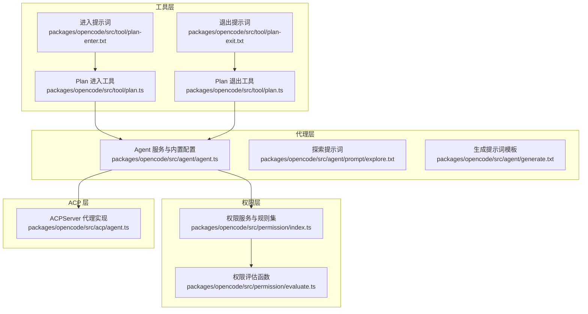
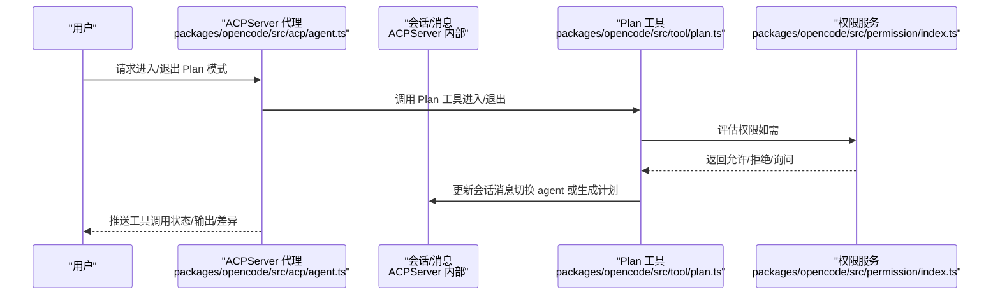
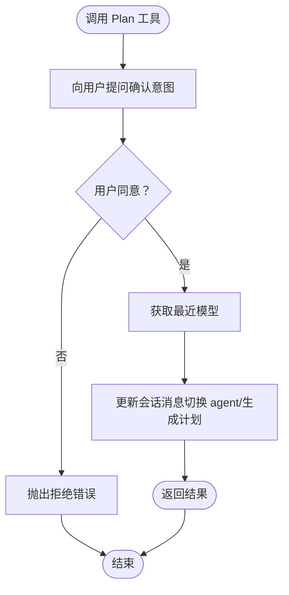
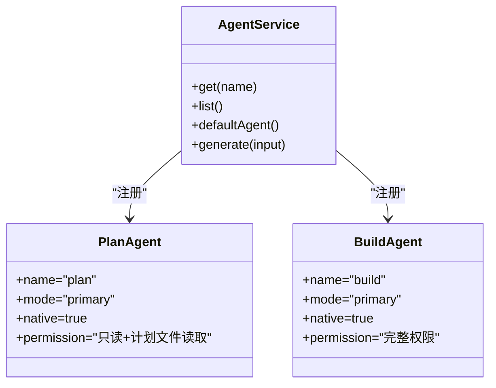
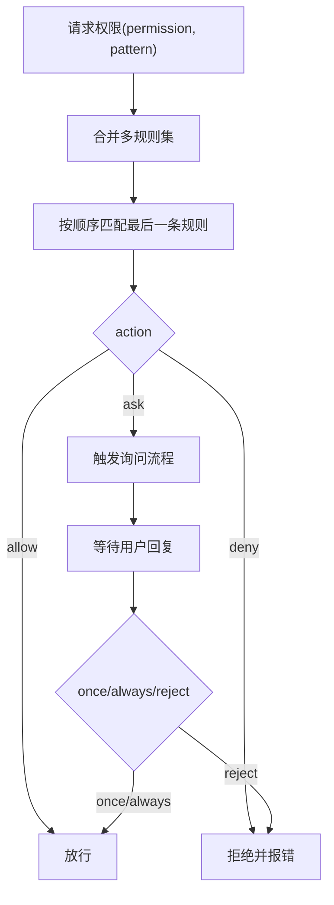
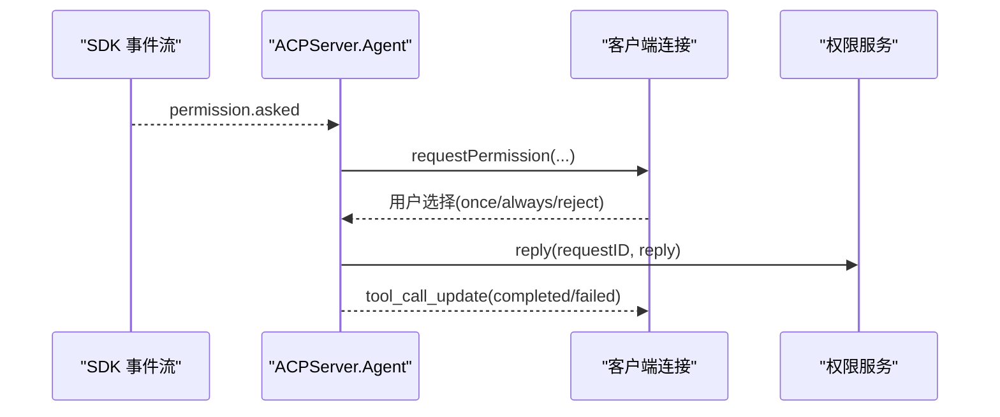
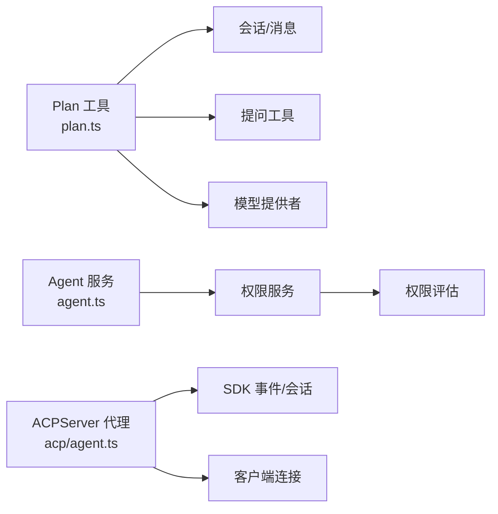

# Plan 代理

<cite>
**本文引用的文件**
- [README.md](file://README.md)
- [AGENTS.md](file://AGENTS.md)
- [packages/opencode/src/tool/plan.ts](file://packages/opencode/src/tool/plan.ts)
- [packages/opencode/src/tool/plan-exit.txt](file://packages/opencode/src/tool/plan-exit.txt)
- [packages/opencode/src/tool/plan-enter.txt](file://packages/opencode/src/tool/plan-enter.txt)
- [packages/opencode/src/agent/agent.ts](file://packages/opencode/src/agent/agent.ts)
- [packages/opencode/src/acp/agent.ts](file://packages/opencode/src/acp/agent.ts)
- [packages/opencode/src/permission/evaluate.ts](file://packages/opencode/src/permission/evaluate.ts)
- [packages/opencode/src/permission/index.ts](file://packages/opencode/src/permission/index.ts)
- [packages/opencode/src/agent/prompt/explore.txt](file://packages/opencode/src/agent/prompt/explore.txt)
- [packages/opencode/src/agent/generate.txt](file://packages/opencode/src/agent/generate.txt)
</cite>

## 目录
1. [简介](#简介)
2. [项目结构](#项目结构)
3. [核心组件](#核心组件)
4. [架构总览](#架构总览)
5. [详细组件分析](#详细组件分析)
6. [依赖关系分析](#依赖关系分析)
7. [性能考量](#性能考量)
8. [故障排查指南](#故障排查指南)
9. [结论](#结论)
10. [附录](#附录)

## 简介
本文件面向 OpenCode 的 Plan 代理，系统性阐述其只读分析模式与规划能力，覆盖以下主题：
- 计划流程：从进入 Plan 模式到完成规划并切换至 Build 实施
- 代码库分析：如何进行代码搜索、文件浏览与项目结构分析
- 规划生成：如何产出可执行的修改建议与任务清单
- 权限与安全：为何采用只读设计、如何通过权限系统保障安全
- 使用场景与最佳实践：大型项目分析、代码重构规划、开发任务分解等

## 项目结构
围绕 Plan 代理的关键文件分布如下：
- 工具层：Plan 进入/退出工具与提示词
- 代理层：内置 Agent 配置与权限规则
- 权限层：权限评估与拒绝/询问机制
- ACP 层：会话管理与事件驱动的交互桥接

**图表来源**
- [packages/opencode/src/tool/plan.ts:1-132](file://packages/opencode/src/tool/plan.ts#L1-L132)
- [packages/opencode/src/tool/plan-enter.txt:1-15](file://packages/opencode/src/tool/plan-enter.txt#L1-L15)
- [packages/opencode/src/tool/plan-exit.txt:1-14](file://packages/opencode/src/tool/plan-exit.txt#L1-L14)
- [packages/opencode/src/agent/agent.ts:1-421](file://packages/opencode/src/agent/agent.ts#L1-L421)
- [packages/opencode/src/permission/evaluate.ts:1-15](file://packages/opencode/src/permission/evaluate.ts#L1-L15)
- [packages/opencode/src/permission/index.ts:128-165](file://packages/opencode/src/permission/index.ts#L128-L165)
- [packages/opencode/src/acp/agent.ts:1-800](file://packages/opencode/src/acp/agent.ts#L1-L800)

**章节来源**
- [README.md:100-114](file://README.md#L100-L114)
- [AGENTS.md:1-129](file://AGENTS.md#L1-L129)

## 核心组件
- Plan 进入/退出工具：负责在用户请求下切换到 Plan 模式或从 Plan 模式切换回 Build 模式，并在合适时机生成计划文件路径供后续使用。
- Agent 服务与内置配置：定义内置 Agent（含 plan）及其权限规则；Plan 模式默认禁止编辑类工具，仅允许特定读取与提问。
- 权限系统：基于通配符匹配的规则评估，支持“允许/拒绝/询问”三种策略，确保只读安全边界。
- ACP 代理实现：订阅会话事件，将工具调用状态、输出内容与差异更新推送到客户端，同时处理权限请求。

**章节来源**
- [packages/opencode/src/tool/plan.ts:19-72](file://packages/opencode/src/tool/plan.ts#L19-L72)
- [packages/opencode/src/agent/agent.ts:107-146](file://packages/opencode/src/agent/agent.ts#L107-L146)
- [packages/opencode/src/permission/evaluate.ts:9-15](file://packages/opencode/src/permission/evaluate.ts#L9-L15)
- [packages/opencode/src/acp/agent.ts:184-533](file://packages/opencode/src/acp/agent.ts#L184-L533)

## 架构总览
Plan 代理的运行时交互由“工具调用—权限评估—会话事件—客户端展示”构成闭环。下图展示了关键交互序列：

**图表来源**
- [packages/opencode/src/acp/agent.ts:184-533](file://packages/opencode/src/acp/agent.ts#L184-L533)
- [packages/opencode/src/tool/plan.ts:19-72](file://packages/opencode/src/tool/plan.ts#L19-L72)
- [packages/opencode/src/permission/index.ts:128-165](file://packages/opencode/src/permission/index.ts#L128-L165)

## 详细组件分析

### 组件一：Plan 进入/退出工具
- 功能职责
  - 进入：当用户需要先研究再实施时，引导切换到 Plan 模式，并生成计划文件路径。
  - 退出：当计划完成并准备实施时，引导切换到 Build 模式并注入一条“开始实施”的用户消息。
- 关键行为
  - 通过提问确认用户意图，若拒绝则抛出拒绝错误以中止流程。
  - 获取最近一次使用的模型信息，保证会话上下文一致。
  - 在会话中写入合成消息，标记目标 agent 与意图。
- 安全与只读
  - 该工具本身不直接修改文件，仅用于模式切换与消息注入，符合只读原则。

**图表来源**
- [packages/opencode/src/tool/plan.ts:19-72](file://packages/opencode/src/tool/plan.ts#L19-L72)

**章节来源**
- [packages/opencode/src/tool/plan.ts:19-72](file://packages/opencode/src/tool/plan.ts#L19-L72)
- [packages/opencode/src/tool/plan-exit.txt:1-14](file://packages/opencode/src/tool/plan-exit.txt#L1-L14)
- [packages/opencode/src/tool/plan-enter.txt:1-15](file://packages/opencode/src/tool/plan-enter.txt#L1-L15)

### 组件二：Agent 服务与内置配置（含 Plan 权限）
- 内置 Agent
  - build：默认代理，具备完整权限（除部分受限工具外）。
  - plan：只读代理，禁止编辑类工具，允许提问与读取特定计划文件路径。
  - explore/general/compaction/title/summary：其他辅助代理。
- 权限规则要点
  - 默认规则：大部分工具“允许”，外部目录访问需“询问”，敏感文件（如 .env）需“询问”。
  - Plan 模式：显式禁止 edit 类工具；仅允许读取“.opencode/plans/*.md”与工作区内的“plans/*.md”。
  - Build 模式：额外允许 plan_enter 工具，便于从实施阶段回到规划阶段。
- 用户自定义
  - 支持通过配置覆盖默认 Agent 行为与权限，合并优先级明确。

**图表来源**
- [packages/opencode/src/agent/agent.ts:107-146](file://packages/opencode/src/agent/agent.ts#L107-L146)

**章节来源**
- [packages/opencode/src/agent/agent.ts:86-103](file://packages/opencode/src/agent/agent.ts#L86-L103)
- [packages/opencode/src/agent/agent.ts:107-146](file://packages/opencode/src/agent/agent.ts#L107-L146)
- [packages/opencode/src/agent/agent.ts:236-279](file://packages/opencode/src/agent/agent.ts#L236-L279)

### 组件三：权限评估与拒绝/询问机制
- 评估逻辑
  - 基于多规则集按顺序匹配，最后一条匹配规则生效。
  - 支持通配符匹配 permission 与 pattern，确保细粒度控制。
- 典型场景
  - 外部目录访问：默认“询问”，白名单目录可“允许”。
  - 敏感文件：如 .env 系列，默认“询问”，示例文件可“允许”。
  - 编辑类工具：Plan 模式默认“拒绝”，Build 模式默认“允许”（受用户规则影响）。
- 错误处理
  - 当规则要求“拒绝”或“询问”且未获批准时，工具调用被中止。

**图表来源**
- [packages/opencode/src/permission/evaluate.ts:9-15](file://packages/opencode/src/permission/evaluate.ts#L9-L15)
- [packages/opencode/src/permission/index.ts:128-165](file://packages/opencode/src/permission/index.ts#L128-L165)

**章节来源**
- [packages/opencode/src/permission/evaluate.ts:9-15](file://packages/opencode/src/permission/evaluate.ts#L9-L15)
- [packages/opencode/src/permission/index.ts:128-165](file://packages/opencode/src/permission/index.ts#L128-L165)

### 组件四：ACPServer 代理（事件驱动与工具状态推送）
- 事件订阅
  - 订阅全局事件流，处理权限请求、消息增量、工具调用生命周期等。
- 工具状态与输出
  - 将工具“进行中/完成/失败”状态、原始输入/输出、文本/推理片段、diff 内容等推送给客户端。
- 权限请求处理
  - 对需要“询问”的操作，向客户端发起权限请求，支持“一次性/总是/拒绝”三种选项；必要时对编辑类工具预写入目标文件内容。

**图表来源**
- [packages/opencode/src/acp/agent.ts:184-533](file://packages/opencode/src/acp/agent.ts#L184-L533)

**章节来源**
- [packages/opencode/src/acp/agent.ts:184-533](file://packages/opencode/src/acp/agent.ts#L184-L533)

### 组件五：代码搜索、文件浏览与项目结构分析
- 探索代理（explore）
  - 提供快速探索能力：文件模式匹配、代码搜索、网络抓取/搜索、命令执行等。
  - 适合在 Plan 阶段快速定位关键模块、接口与依赖关系。
- 提示词与生成
  - Explore 提示词与通用生成提示词模板用于指导模型在不同任务中采取合适的策略与格式。

**章节来源**
- [packages/opencode/src/agent/agent.ts:161-187](file://packages/opencode/src/agent/agent.ts#L161-L187)
- [packages/opencode/src/agent/prompt/explore.txt](file://packages/opencode/src/agent/prompt/explore.txt)
- [packages/opencode/src/agent/generate.txt:1-76](file://packages/opencode/src/agent/generate.txt#L1-L76)

## 依赖关系分析
- 工具依赖
  - Plan 工具依赖 Session/MessageV2 以写入切换消息；依赖 Question 以进行用户确认；依赖 Provider/Session 获取模型信息。
- 权限依赖
  - Agent 服务在构建内置 Agent 时，将默认规则与用户规则合并；权限评估函数负责最终决策。
- ACP 依赖
  - ACP 代理依赖 SDK 事件流与会话 API；在权限请求时与客户端交互；在工具完成后推送 diff 与输出。

**图表来源**
- [packages/opencode/src/tool/plan.ts:1-132](file://packages/opencode/src/tool/plan.ts#L1-L132)
- [packages/opencode/src/agent/agent.ts:86-103](file://packages/opencode/src/agent/agent.ts#L86-L103)
- [packages/opencode/src/permission/index.ts:128-165](file://packages/opencode/src/permission/index.ts#L128-L165)
- [packages/opencode/src/acp/agent.ts:184-533](file://packages/opencode/src/acp/agent.ts#L184-L533)

**章节来源**
- [packages/opencode/src/tool/plan.ts:1-132](file://packages/opencode/src/tool/plan.ts#L1-L132)
- [packages/opencode/src/agent/agent.ts:86-103](file://packages/opencode/src/agent/agent.ts#L86-L103)
- [packages/opencode/src/permission/index.ts:128-165](file://packages/opencode/src/permission/index.ts#L128-L165)
- [packages/opencode/src/acp/agent.ts:184-533](file://packages/opencode/src/acp/agent.ts#L184-L533)

## 性能考量
- 事件驱动与增量推送：ACPServer 通过事件流与增量文本/推理片段推送，避免一次性传输大量数据，降低带宽与渲染压力。
- 权限评估复杂度：规则匹配为线性扫描，结合通配符匹配，通常开销较小；建议保持规则集精简以提升匹配效率。
- 模型上下文与成本：通过会话用量更新，可估算输入/缓存读取与累计成本，便于控制长会话的开销。

[本节为通用性能讨论，无需具体文件引用]

## 故障排查指南
- 权限被拒绝
  - 现象：工具调用被中断并提示权限不足。
  - 排查：检查 Agent 权限规则（尤其是 edit/read/external_directory），确认是否命中“拒绝”或“询问”规则。
  - 处理：在客户端选择“允许一次/总是”，或调整配置规则。
- 无法切换到 Plan/Build
  - 现象：Plan 工具调用后未切换 agent。
  - 排查：确认工具返回值与会话消息更新是否成功；检查用户确认是否通过。
  - 处理：重新触发工具，确保提问环节未被忽略。
- 输出未显示差异
  - 现象：编辑类工具完成但未看到 diff。
  - 排查：确认 ACP 代理是否正确解析工具输出并构造 diff；检查文件路径与旧/新内容字段。
  - 处理：查看事件日志与工具完成回调，核对输出结构。

**章节来源**
- [packages/opencode/src/acp/agent.ts:351-417](file://packages/opencode/src/acp/agent.ts#L351-L417)
- [packages/opencode/src/permission/index.ts:128-165](file://packages/opencode/src/permission/index.ts#L128-L165)

## 结论
Plan 代理通过“只读+权限控制+事件驱动”的设计，在保证安全的前提下，为复杂任务提供了强大的分析与规划能力。其核心价值在于：
- 明确的只读边界，避免误改风险
- 可插拔的权限体系，满足不同项目的安全需求
- 与 ACP 的无缝集成，提供实时反馈与可视化差异
- 与 Explore/General 等代理协同，形成从“探索—规划—实施”的完整闭环

[本节为总结性内容，无需具体文件引用]

## 附录

### 使用场景与最佳实践
- 大型项目分析
  - 步骤：使用 Explore 快速定位关键模块与依赖；在 Plan 中整理模块间关系与潜在风险；通过 Plan 工具生成计划文件并审阅。
  - 最佳实践：分层拆解、标注风险点、记录替代方案。
- 代码重构规划
  - 步骤：识别重构范围与影响面；在 Plan 中列出待变更文件与修改点；生成可执行的任务清单；与团队评审后再进入 Build 实施。
  - 最佳实践：优先处理低耦合模块、保留回滚路径、最小化单次变更粒度。
- 开发任务分解
  - 步骤：将复杂需求拆分为若干子任务；在 Plan 中逐项验证可行性与依赖；形成计划文件作为交付物；按优先级推进。
  - 最佳实践：明确验收标准、预留缓冲时间、持续回顾与调整。

[本节为概念性内容，无需具体文件引用]