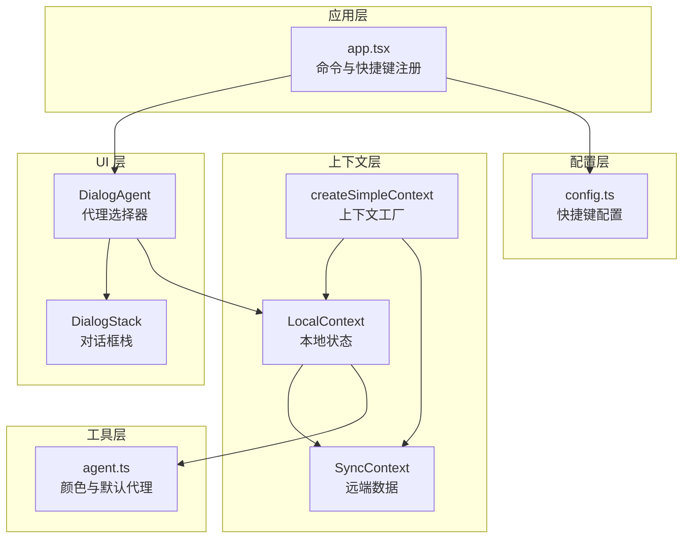
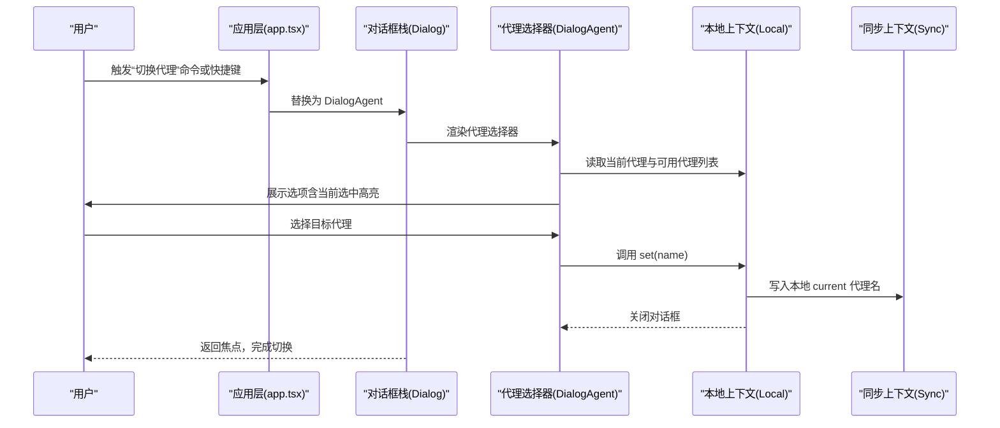
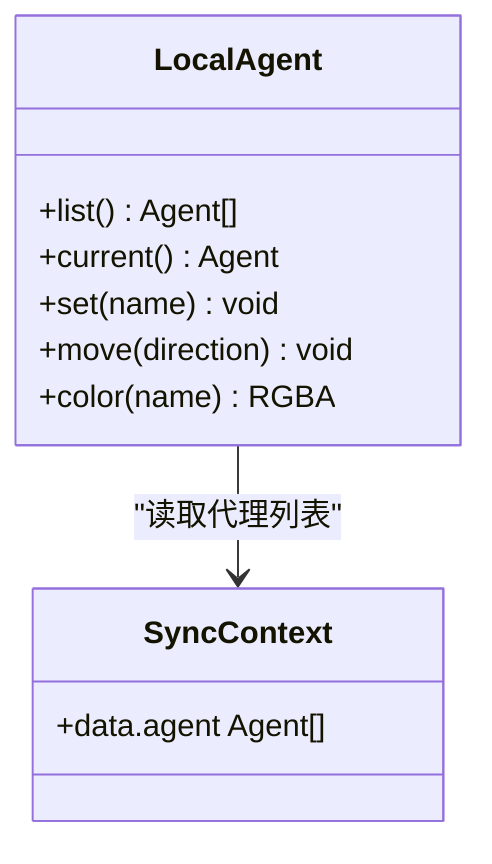
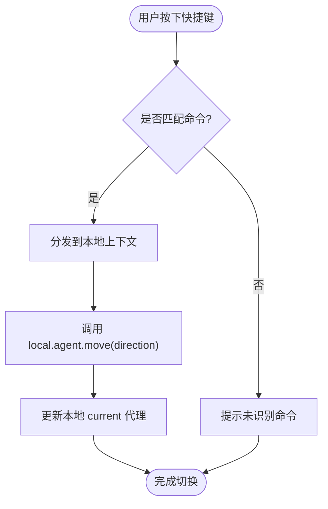
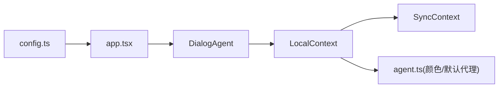

# 代理切换机制

<cite>
**本文引用的文件**
- [packages/opencode/src/cli/cmd/tui/component/dialog-agent.tsx](file://packages/opencode/src/cli/cmd/tui/component/dialog-agent.tsx)
- [packages/opencode/src/cli/cmd/tui/context/local.tsx](file://packages/opencode/src/cli/cmd/tui/context/local.tsx)
- [packages/opencode/src/cli/cmd/tui/app.tsx](file://packages/opencode/src/cli/cmd/tui/app.tsx)
- [packages/opencode/src/cli/cmd/tui/ui/dialog.tsx](file://packages/opencode/src/cli/cmd/tui/ui/dialog.tsx)
- [packages/opencode/src/cli/cmd/tui/context/sync.tsx](file://packages/opencode/src/cli/cmd/tui/context/sync.tsx)
- [packages/opencode/src/config/config.ts](file://packages/opencode/src/config/config.ts)
- [packages/opencode/src/cli/cmd/tui/context/helper.tsx](file://packages/opencode/src/cli/cmd/tui/context/helper.tsx)
- [packages/opencode/src/agent/agent.ts](file://packages/opencode/src/agent/agent.ts)
- [packages/app/src/utils/agent.ts](file://packages/app/src/utils/agent.ts)
</cite>

## 目录
1. [简介](#简介)
2. [项目结构](#项目结构)
3. [核心组件](#核心组件)
4. [架构总览](#架构总览)
5. [详细组件分析](#详细组件分析)
6. [依赖关系分析](#依赖关系分析)
7. [性能考量](#性能考量)
8. [故障排查指南](#故障排查指南)
9. [结论](#结论)
10. [附录：最佳实践与使用技巧](#附录最佳实践与使用技巧)

## 简介
本文件系统性阐述 OpenCode 在 TUI（文本用户界面）中的“代理切换”机制，覆盖从 UI 设计到交互逻辑、状态管理与数据流同步的完整链路。重点包括：
- 基于 Tab 键的代理循环切换与反向切换
- 通过命令面板或快捷键触发的代理选择器对话框
- 本地状态与远端数据的同步策略
- 用户体验优化与错误处理
- 实战建议与常见问题解决

## 项目结构
围绕代理切换的关键文件分布如下：
- UI 层：代理选择器对话框组件
- 上下文层：本地状态与远端数据同步
- 应用层：命令注册与快捷键绑定
- 配置层：默认快捷键定义
- 工具层：颜色映射与默认代理解析

图表来源
- [packages/opencode/src/cli/cmd/tui/app.tsx](file://packages/opencode/src/cli/cmd/tui/app.tsx)
- [packages/opencode/src/cli/cmd/tui/component/dialog-agent.tsx](file://packages/opencode/src/cli/cmd/tui/component/dialog-agent.tsx)
- [packages/opencode/src/cli/cmd/tui/ui/dialog.tsx](file://packages/opencode/src/cli/cmd/tui/ui/dialog.tsx)
- [packages/opencode/src/cli/cmd/tui/context/local.tsx](file://packages/opencode/src/cli/cmd/tui/context/local.tsx)
- [packages/opencode/src/cli/cmd/tui/context/sync.tsx](file://packages/opencode/src/cli/cmd/tui/context/sync.tsx)
- [packages/opencode/src/cli/cmd/tui/context/helper.tsx](file://packages/opencode/src/cli/cmd/tui/context/helper.tsx)
- [packages/opencode/src/config/config.ts](file://packages/opencode/src/config/config.ts)
- [packages/app/src/utils/agent.ts](file://packages/app/src/utils/agent.ts)

章节来源
- [packages/opencode/src/cli/cmd/tui/app.tsx](file://packages/opencode/src/cli/cmd/tui/app.tsx)
- [packages/opencode/src/cli/cmd/tui/component/dialog-agent.tsx](file://packages/opencode/src/cli/cmd/tui/component/dialog-agent.tsx)
- [packages/opencode/src/cli/cmd/tui/context/local.tsx](file://packages/opencode/src/cli/cmd/tui/context/local.tsx)
- [packages/opencode/src/cli/cmd/tui/context/sync.tsx](file://packages/opencode/src/cli/cmd/tui/context/sync.tsx)
- [packages/opencode/src/cli/cmd/tui/ui/dialog.tsx](file://packages/opencode/src/cli/cmd/tui/ui/dialog.tsx)
- [packages/opencode/src/cli/cmd/tui/context/helper.tsx](file://packages/opencode/src/cli/cmd/tui/context/helper.tsx)
- [packages/opencode/src/config/config.ts](file://packages/opencode/src/config/config.ts)
- [packages/app/src/utils/agent.ts](file://packages/app/src/utils/agent.ts)

## 核心组件
- 代理选择器对话框：提供“选择代理”的交互入口，支持当前选中项高亮与选项描述展示。
- 本地上下文（Local）：维护当前代理的本地状态，提供设置与循环切换能力，并与远端数据保持一致。
- 同步上下文（Sync）：承载远端代理列表、模型等数据，负责事件驱动的状态更新。
- 对话框栈（Dialog）：统一管理弹窗显示与关闭，确保 UI 切换流畅。
- 应用层命令与快捷键：注册“切换代理”“代理循环”等命令，绑定默认快捷键。
- 配置层：定义默认快捷键（如 Tab/Shift+Tab 循环代理）。

章节来源
- [packages/opencode/src/cli/cmd/tui/component/dialog-agent.tsx](file://packages/opencode/src/cli/cmd/tui/component/dialog-agent.tsx)
- [packages/opencode/src/cli/cmd/tui/context/local.tsx](file://packages/opencode/src/cli/cmd/tui/context/local.tsx)
- [packages/opencode/src/cli/cmd/tui/context/sync.tsx](file://packages/opencode/src/cli/cmd/tui/context/sync.tsx)
- [packages/opencode/src/cli/cmd/tui/ui/dialog.tsx](file://packages/opencode/src/cli/cmd/tui/ui/dialog.tsx)
- [packages/opencode/src/cli/cmd/tui/app.tsx](file://packages/opencode/src/cli/cmd/tui/app.tsx)
- [packages/opencode/src/config/config.ts](file://packages/opencode/src/config/config.ts)

## 架构总览
代理切换的端到端流程如下：

图表来源
- [packages/opencode/src/cli/cmd/tui/app.tsx](file://packages/opencode/src/cli/cmd/tui/app.tsx)
- [packages/opencode/src/cli/cmd/tui/ui/dialog.tsx](file://packages/opencode/src/cli/cmd/tui/ui/dialog.tsx)
- [packages/opencode/src/cli/cmd/tui/component/dialog-agent.tsx](file://packages/opencode/src/cli/cmd/tui/component/dialog-agent.tsx)
- [packages/opencode/src/cli/cmd/tui/context/local.tsx](file://packages/opencode/src/cli/cmd/tui/context/local.tsx)
- [packages/opencode/src/cli/cmd/tui/context/sync.tsx](file://packages/opencode/src/cli/cmd/tui/context/sync.tsx)

## 详细组件分析

### 组件一：代理选择器对话框（DialogAgent）
- 功能职责
  - 基于本地上下文提供的代理列表生成选项
  - 显示当前代理名称与描述（原生/描述）
  - 选择后调用本地上下文设置代理并关闭对话框
- 数据来源
  - 本地上下文的代理列表与当前代理
- 交互行为
  - 选项 memo 化，避免重复渲染
  - 选择回调中调用本地 set 并清理对话框

章节来源
- [packages/opencode/src/cli/cmd/tui/component/dialog-agent.tsx](file://packages/opencode/src/cli/cmd/tui/component/dialog-agent.tsx)
- [packages/opencode/src/cli/cmd/tui/context/local.tsx](file://packages/opencode/src/cli/cmd/tui/context/local.tsx)

### 组件二：本地上下文（LocalContext）中的代理模块
- 代理列表与可见性
  - 过滤掉子代理与隐藏代理，仅保留主代理
- 当前代理与设置
  - 提供 current 读取与 set 设置
  - set 中进行存在性校验，不存在则提示警告
- 循环切换
  - move 支持正向/反向循环，边界处理为环形
- 颜色映射
  - 根据可见代理索引与主题色表返回对应颜色

图表来源
- [packages/opencode/src/cli/cmd/tui/context/local.tsx](file://packages/opencode/src/cli/cmd/tui/context/local.tsx)
- [packages/opencode/src/cli/cmd/tui/context/sync.tsx](file://packages/opencode/src/cli/cmd/tui/context/sync.tsx)

章节来源
- [packages/opencode/src/cli/cmd/tui/context/local.tsx](file://packages/opencode/src/cli/cmd/tui/context/local.tsx)
- [packages/opencode/src/cli/cmd/tui/context/sync.tsx](file://packages/opencode/src/cli/cmd/tui/context/sync.tsx)

### 组件三：应用层命令与快捷键
- 命令注册
  - “切换代理”：打开代理选择器
  - “代理循环”：正向循环切换
  - “代理循环反向”：反向循环切换
- 快捷键绑定
  - 默认“agent_cycle”为 Tab，“agent_cycle_reverse”为 Shift+Tab
  - 可在配置中自定义

图表来源
- [packages/opencode/src/cli/cmd/tui/app.tsx](file://packages/opencode/src/cli/cmd/tui/app.tsx)
- [packages/opencode/src/config/config.ts](file://packages/opencode/src/config/config.ts)

章节来源
- [packages/opencode/src/cli/cmd/tui/app.tsx](file://packages/opencode/src/cli/cmd/tui/app.tsx)
- [packages/opencode/src/config/config.ts](file://packages/opencode/src/config/config.ts)

### 组件四：对话框栈（Dialog）
- 职责
  - 维护对话框栈，支持替换与清空
  - 在替换时自动聚焦与失焦处理，保证交互一致性
- 与代理切换的关系
  - 代理选择器通过替换对话框栈来呈现
  - 选择完成后清理栈并恢复焦点

章节来源
- [packages/opencode/src/cli/cmd/tui/ui/dialog.tsx](file://packages/opencode/src/cli/cmd/tui/ui/dialog.tsx)
- [packages/opencode/src/cli/cmd/tui/component/dialog-agent.tsx](file://packages/opencode/src/cli/cmd/tui/component/dialog-agent.tsx)

### 组件五：上下文工厂（createSimpleContext）
- 作用
  - 统一上下文提供者与消费方式，简化依赖注入
- 与代理切换的关系
  - Local/Sync 上下文均通过该工厂创建，保证生命周期与依赖关系清晰

章节来源
- [packages/opencode/src/cli/cmd/tui/context/helper.tsx](file://packages/opencode/src/cli/cmd/tui/context/helper.tsx)
- [packages/opencode/src/cli/cmd/tui/context/local.tsx](file://packages/opencode/src/cli/cmd/tui/context/local.tsx)
- [packages/opencode/src/cli/cmd/tui/context/sync.tsx](file://packages/opencode/src/cli/cmd/tui/context/sync.tsx)

### 组件六：默认代理与颜色映射
- 默认代理解析
  - 若未配置默认代理，则选择第一个可见主代理
- 颜色映射
  - 依据代理名称映射到主题色或预设图标色，用于 UI 标识

章节来源
- [packages/opencode/src/agent/agent.ts](file://packages/opencode/src/agent/agent.ts)
- [packages/app/src/utils/agent.ts](file://packages/app/src/utils/agent.ts)

## 依赖关系分析
- UI 依赖本地上下文（Local），Local 依赖同步上下文（Sync）
- 应用层通过命令与快捷键触发 UI 行为
- 配置层决定快捷键默认值
- 工具层提供颜色与默认代理解析

图表来源
- [packages/opencode/src/config/config.ts](file://packages/opencode/src/config/config.ts)
- [packages/opencode/src/cli/cmd/tui/app.tsx](file://packages/opencode/src/cli/cmd/tui/app.tsx)
- [packages/opencode/src/cli/cmd/tui/component/dialog-agent.tsx](file://packages/opencode/src/cli/cmd/tui/component/dialog-agent.tsx)
- [packages/opencode/src/cli/cmd/tui/context/local.tsx](file://packages/opencode/src/cli/cmd/tui/context/local.tsx)
- [packages/opencode/src/cli/cmd/tui/context/sync.tsx](file://packages/opencode/src/cli/cmd/tui/context/sync.tsx)
- [packages/app/src/utils/agent.ts](file://packages/app/src/utils/agent.ts)

章节来源
- [packages/opencode/src/config/config.ts](file://packages/opencode/src/config/config.ts)
- [packages/opencode/src/cli/cmd/tui/app.tsx](file://packages/opencode/src/cli/cmd/tui/app.tsx)
- [packages/opencode/src/cli/cmd/tui/component/dialog-agent.tsx](file://packages/opencode/src/cli/cmd/tui/component/dialog-agent.tsx)
- [packages/opencode/src/cli/cmd/tui/context/local.tsx](file://packages/opencode/src/cli/cmd/tui/context/local.tsx)
- [packages/opencode/src/cli/cmd/tui/context/sync.tsx](file://packages/opencode/src/cli/cmd/tui/context/sync.tsx)
- [packages/app/src/utils/agent.ts](file://packages/app/src/utils/agent.ts)

## 性能考量
- 选项 memo 化：代理选择器对选项进行 memo 化，减少不必要的重渲染
- 批量更新：循环切换使用批量更新，避免多次独立更新导致的抖动
- 边界处理：环形索引计算避免频繁数组越界判断
- 事件驱动：远端数据变更通过事件更新，本地只在必要时重新计算

## 故障排查指南
- 选择的代理不存在
  - 现象：设置代理时报错提示“代理不存在”
  - 处理：确认代理名称正确且非子代理；检查远端代理列表是否已加载
  - 参考路径：[packages/opencode/src/cli/cmd/tui/context/local.tsx](file://packages/opencode/src/cli/cmd/tui/context/local.tsx)
- 子代理不可直接作为默认代理
  - 现象：尝试设置子代理为当前代理失败
  - 处理：仅可选择主代理；若需要子代理，请通过会话内操作
  - 参考路径：[packages/opencode/src/agent/agent.ts](file://packages/opencode/src/agent/agent.ts)
- 代理循环无效
  - 现象：按 Tab/Shift+Tab 无响应
  - 处理：检查快捷键配置是否被覆盖；确认当前命令面板未拦截
  - 参考路径：[packages/opencode/src/config/config.ts](file://packages/opencode/src/config/config.ts)
- 代理颜色异常
  - 现象：代理标识颜色不正确
  - 处理：检查代理配置颜色字段；若为空则回退到主题色表
  - 参考路径：[packages/app/src/utils/agent.ts](file://packages/app/src/utils/agent.ts)

章节来源
- [packages/opencode/src/cli/cmd/tui/context/local.tsx](file://packages/opencode/src/cli/cmd/tui/context/local.tsx)
- [packages/opencode/src/agent/agent.ts](file://packages/opencode/src/agent/agent.ts)
- [packages/opencode/src/config/config.ts](file://packages/opencode/src/config/config.ts)
- [packages/app/src/utils/agent.ts](file://packages/app/src/utils/agent.ts)

## 结论
OpenCode 的代理切换机制以“命令/快捷键 → 对话框 → 本地上下文 → 同步上下文”的清晰链路实现，具备以下特点：
- 交互直观：Tab/Shift+Tab 即可快速循环切换
- 体验友好：选择器高亮当前项、描述信息明确
- 状态可靠：本地状态与远端数据通过上下文解耦，事件驱动更新
- 扩展性强：可通过配置自定义快捷键，颜色与默认代理策略灵活

## 附录：最佳实践与使用技巧
- 快捷键定制
  - 在配置中修改“agent_cycle”“agent_cycle_reverse”，适配个人习惯
  - 参考路径：[packages/opencode/src/config/config.ts](file://packages/opencode/src/config/config.ts)
- 优先使用“代理循环”
  - 在多个主代理间频繁切换时，优先使用 Tab/Shift+Tab，无需打开对话框
  - 参考路径：[packages/opencode/src/cli/cmd/tui/app.tsx](file://packages/opencode/src/cli/cmd/tui/app.tsx)
- 使用“切换代理”对话框
  - 需要精确选择或查看代理描述时，使用“切换代理”命令打开选择器
  - 参考路径：[packages/opencode/src/cli/cmd/tui/component/dialog-agent.tsx](file://packages/opencode/src/cli/cmd/tui/component/dialog-agent.tsx)
- 模型联动
  - 代理切换会自动更新当前模型（若代理自带模型），注意观察模型变化
  - 参考路径：[packages/opencode/src/cli/cmd/tui/context/local.tsx](file://packages/opencode/src/cli/cmd/tui/context/local.tsx)
- 子代理与主代理
  - 仅主代理可直接切换；子代理需在会话内操作
  - 参考路径：[packages/opencode/src/agent/agent.ts](file://packages/opencode/src/agent/agent.ts)