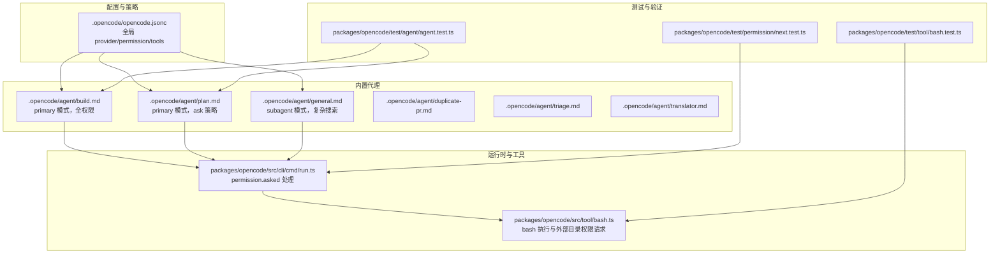
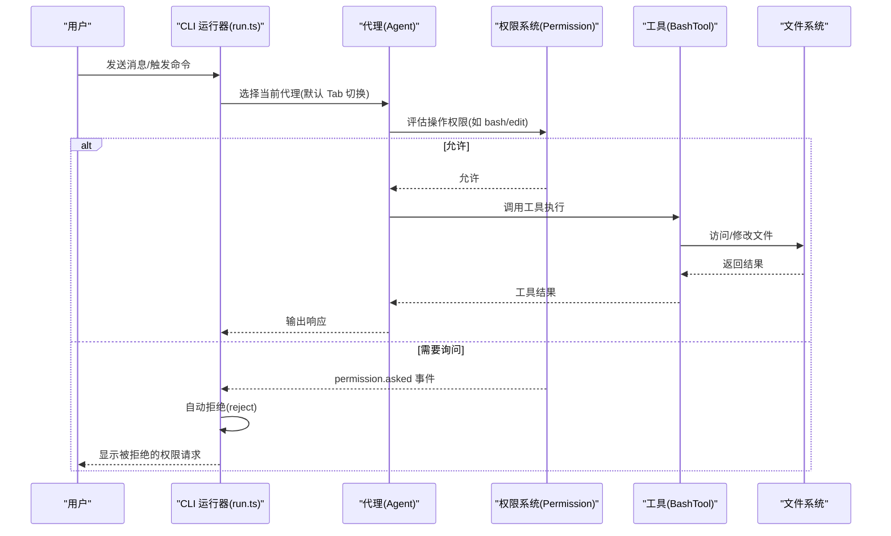
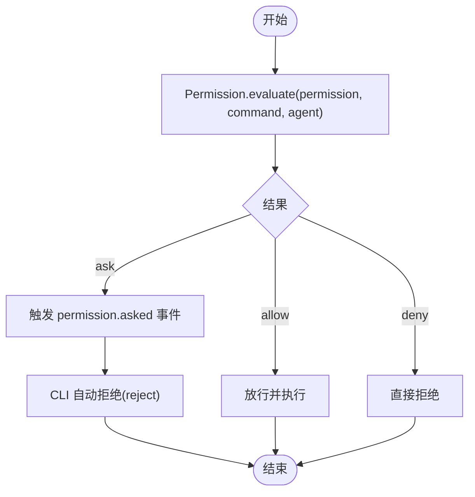
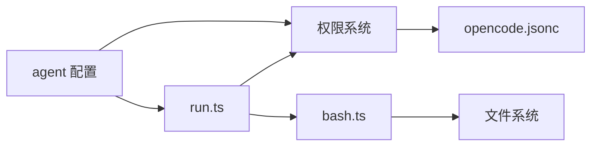

# 多代理系统

<cite>
**本文引用的文件**
- [README.md](file://README.md)
- [AGENTS.md](file://AGENTS.md)
- [.opencode/opencode.jsonc](file://.opencode/opencode.jsonc)
- [.opencode/agent/duplicate-pr.md](file://.opencode/agent/duplicate-pr.md)
- [.opencode/agent/triage.md](file://.opencode/agent/triage.md)
- [.opencode/agent/translator.md](file://.opencode/agent/translator.md)
- [packages/opencode/test/agent/agent.test.ts](file://packages/opencode/test/agent/agent.test.ts)
- [packages/opencode/test/permission/next.test.ts](file://packages/opencode/test/permission/next.test.ts)
- [packages/opencode/test/tool/bash.test.ts](file://packages/opencode/test/tool/bash.test.ts)
- [packages/opencode/src/tool/bash.ts](file://packages/opencode/src/tool/bash.ts)
- [packages/opencode/src/cli/cmd/run.ts](file://packages/opencode/src/cli/cmd/run.ts)
- [packages/web/src/content/docs/da/agents.mdx](file://packages/web/src/content/docs/da/agents.mdx)
</cite>

## 目录
1. [简介](#简介)
2. [项目结构](#项目结构)
3. [核心组件](#核心组件)
4. [架构总览](#架构总览)
5. [详细组件分析](#详细组件分析)
6. [依赖关系分析](#依赖关系分析)
7. [性能考量](#性能考量)
8. [故障排查指南](#故障排查指南)
9. [结论](#结论)
10. [附录](#附录)

## 简介
本文件面向 OpenCode 的多代理系统，围绕三大核心代理：build（构建代理）、plan（规划代理）、以及 general（通用子代理），系统性阐述其权限模型、安全限制、交互与切换机制，并给出使用场景与最佳实践。同时，从代码层面梳理代理的配置、权限评估、工具调用与事件处理流程，帮助开发者理解代理工作原理并进行扩展。

## 项目结构
OpenCode 的代理系统由“内置代理配置”“权限策略”“工具与命令”“前端交互与切换”“测试与验证”等模块协同组成。关键位置如下：
- 配置与策略：.opencode/opencode.jsonc 定义全局 provider、permission、tools 等
- 内置代理：.opencode/agent/*.md 描述 build、plan、general 等代理的行为与工具集
- 权限与工具：packages/opencode/src/tool/bash.ts 实现 bash 工具与路径扫描、权限请求
- 运行时与事件：packages/opencode/src/cli/cmd/run.ts 处理 permission.asked 事件并自动拒绝
- 测试与验证：packages/opencode/test 下的 agent、permission、tool 测试覆盖代理行为、权限禁用规则、外部目录权限请求等

图表来源
- [.opencode/opencode.jsonc:1-19](file://.opencode/opencode.jsonc#L1-L19)
- [.opencode/agent/duplicate-pr.md:1-27](file://.opencode/agent/duplicate-pr.md#L1-L27)
- [.opencode/agent/triage.md:1-141](file://.opencode/agent/triage.md#L1-L141)
- [.opencode/agent/translator.md:1-901](file://.opencode/agent/translator.md#L1-L901)
- [packages/opencode/src/cli/cmd/run.ts:544-578](file://packages/opencode/src/cli/cmd/run.ts#L544-L578)
- [packages/opencode/src/tool/bash.ts:24-71](file://packages/opencode/src/tool/bash.ts#L24-L71)
- [packages/opencode/test/agent/agent.test.ts:201-244](file://packages/opencode/test/agent/agent.test.ts#L201-L244)
- [packages/opencode/test/permission/next.test.ts:390-432](file://packages/opencode/test/permission/next.test.ts#L390-L432)
- [packages/opencode/test/tool/bash.test.ts:207-795](file://packages/opencode/test/tool/bash.test.ts#L207-L795)

章节来源
- [README.md:100-114](file://README.md#L100-L114)
- [.opencode/opencode.jsonc:1-19](file://.opencode/opencode.jsonc#L1-L19)

## 核心组件
- build 代理（primary 模式）
  - 默认全权限，适合需要文件编辑、命令执行的开发任务
  - 可通过配置覆盖名称、步骤上限、禁用等
- plan 代理（primary 模式）
  - 以“ask”策略为主，禁止文件编辑与 bash 命令默认执行
  - 适合探索、分析与制定计划，避免误改代码库
- general 子代理（subagent 模式）
  - 用于复杂搜索与多步任务，具备完整工具集（除特定限制外）
  - 可在消息中通过 @general 触发，内部使用

章节来源
- [README.md:100-114](file://README.md#L100-L114)
- [packages/web/src/content/docs/da/agents.mdx:39-81](file://packages/web/src/content/docs/da/agents.mdx#L39-L81)
- [packages/opencode/test/agent/agent.test.ts:246-281](file://packages/opencode/test/agent/agent.test.ts#L246-L281)
- [packages/opencode/test/agent/agent.test.ts:361-413](file://packages/opencode/test/agent/agent.test.ts#L361-L413)

## 架构总览
OpenCode 的代理系统采用“配置驱动 + 权限评估 + 工具执行 + 事件处理”的分层架构：
- 配置层：opencode.jsonc 提供 provider、permission、tools 等全局设置
- 代理层：内置 agent 配置决定模式（primary/subagent）、工具集与行为
- 权限层：Permission.evaluate 评估具体操作（如 bash、edit）是否允许或需询问
- 工具层：BashTool 等工具在执行前扫描命令涉及的路径，必要时请求 external_directory 权限
- 事件层：CLI 在收到 permission.asked 时自动拒绝，确保默认安全策略

图表来源
- [packages/opencode/src/cli/cmd/run.ts:544-578](file://packages/opencode/src/cli/cmd/run.ts#L544-L578)
- [packages/opencode/src/tool/bash.ts:24-71](file://packages/opencode/src/tool/bash.ts#L24-L71)
- [packages/opencode/test/tool/bash.test.ts:207-795](file://packages/opencode/test/tool/bash.test.ts#L207-L795)

## 详细组件分析

### build 代理（全权限）
- 角色定位：开发工作的默认代理，拥有全部权限
- 行为特征：可直接进行文件编辑、命令执行；适合落地修改与自动化脚本
- 配置要点：可通过配置覆盖名称、最大步数、禁用状态等
- 使用建议：
  - 优先用于需要写入与执行的明确任务
  - 对高风险命令（如删除根目录）可在权限配置中显式 deny

章节来源
- [packages/opencode/test/agent/agent.test.ts:246-281](file://packages/opencode/test/agent/agent.test.ts#L246-L281)
- [packages/opencode/test/agent/agent.test.ts:361-413](file://packages/opencode/test/agent/agent.test.ts#L361-L413)

### plan 代理（只读分析）
- 角色定位：分析与规划专用代理，默认禁止文件编辑与 bash 命令
- 权限策略：默认对 edit、bash 设置为 ask，需要显式授权
- 安全控制：CLI 收到 permission.asked 会自动拒绝，降低误操作风险
- 使用建议：
  - 探索未知代码库、生成变更方案、审查代码时优先使用
  - 若确需执行命令，应明确授权后再继续

章节来源
- [README.md:100-114](file://README.md#L100-L114)
- [packages/opencode/test/agent/agent.test.ts:201-244](file://packages/opencode/test/agent/agent.test.ts#L201-L244)
- [packages/opencode/src/cli/cmd/run.ts:544-578](file://packages/opencode/src/cli/cmd/run.ts#L544-L578)

### general 子代理（复杂搜索）
- 角色定位：用于复杂查询与多步任务，具备完整工具集（除特定限制外）
- 触发方式：在消息中使用 @general 调用
- 使用建议：
  - 适合跨文件检索、批量分析、多工具协作的任务
  - 注意与 build/plan 的权限差异，避免在 plan 模式下执行高风险操作

章节来源
- [README.md:110-111](file://README.md#L110-L111)
- [packages/web/src/content/docs/da/agents.mdx:71-81](file://packages/web/src/content/docs/da/agents.mdx#L71-L81)

### 权限控制系统与安全限制
- 权限评估
  - 通过 Permission.evaluate 判断某项操作在给定代理上的许可状态（allow/deny/ask）
  - 支持针对具体命令模式（如 bash rm -rf *）的细粒度 deny
- 禁用推导
  - 当某类权限被 deny 或 ask 时，系统可推导出哪些工具/能力被禁用
- 外部目录权限
  - BashTool 在检测到可能访问项目外路径时，请求 external_directory 权限
  - CLI 对 permission.asked 事件默认拒绝，确保默认安全
- 配置示例
  - opencode.jsonc 中可设置全局 permission.edit 的 deny 规则，限制迁移脚本等敏感路径

图表来源
- [packages/opencode/test/permission/next.test.ts:390-432](file://packages/opencode/test/permission/next.test.ts#L390-L432)
- [packages/opencode/test/tool/bash.test.ts:207-795](file://packages/opencode/test/tool/bash.test.ts#L207-L795)
- [packages/opencode/src/cli/cmd/run.ts:544-578](file://packages/opencode/src/cli/cmd/run.ts#L544-L578)

章节来源
- [.opencode/opencode.jsonc:8-12](file://.opencode/opencode.jsonc#L8-L12)
- [packages/opencode/test/permission/next.test.ts:390-432](file://packages/opencode/test/permission/next.test.ts#L390-L432)
- [packages/opencode/test/tool/bash.test.ts:207-795](file://packages/opencode/test/tool/bash.test.ts#L207-L795)
- [packages/opencode/src/cli/cmd/run.ts:544-578](file://packages/opencode/src/cli/cmd/run.ts#L544-L578)

### 代理切换机制（Tab 键）
- 用户可在两个内置主代理之间通过 Tab 键快速切换
- 切换后，后续对话与工具调用均基于当前代理的权限与模式执行
- 默认代理可由配置指定；若默认代理为 subagent 或隐藏/不存在，则会抛出错误提示

章节来源
- [README.md:100-114](file://README.md#L100-L114)
- [packages/opencode/test/agent/agent.test.ts:606-681](file://packages/opencode/test/agent/agent.test.ts#L606-L681)

### 代理扩展与自定义
- 支持自定义 agent：通过配置定义多个 agent，设置 mode（primary/subagent）、名称、步骤上限等
- 支持覆盖默认代理：当默认代理不可用时，系统会回退到下一个可用的 primary 代理
- 内置工具与子代理：duplicate-pr、triage、translator 等作为示例，展示如何通过工具与模式组合实现特定任务

章节来源
- [packages/opencode/test/agent/agent.test.ts:361-413](file://packages/opencode/test/agent/agent.test.ts#L361-L413)
- [packages/opencode/test/agent/agent.test.ts:606-717](file://packages/opencode/test/agent/agent.test.ts#L606-L717)
- [.opencode/agent/duplicate-pr.md:1-27](file://.opencode/agent/duplicate-pr.md#L1-L27)
- [.opencode/agent/triage.md:1-141](file://.opencode/agent/triage.md#L1-L141)
- [.opencode/agent/translator.md:1-901](file://.opencode/agent/translator.md#L1-L901)

## 依赖关系分析
- 组件耦合
  - CLI 运行器依赖权限系统与工具层，负责事件处理与安全策略执行
  - 代理配置影响权限评估与工具可用性
  - 工具层（如 BashTool）依赖文件系统与路径扫描逻辑
- 外部依赖
  - 配置文件 opencode.jsonc 提供 provider、permission、tools 等全局开关
  - 文档与测试共同约束行为边界与回归质量

图表来源
- [packages/opencode/src/cli/cmd/run.ts:544-578](file://packages/opencode/src/cli/cmd/run.ts#L544-L578)
- [packages/opencode/src/tool/bash.ts:24-71](file://packages/opencode/src/tool/bash.ts#L24-L71)
- [.opencode/opencode.jsonc:1-19](file://.opencode/opencode.jsonc#L1-L19)

章节来源
- [packages/opencode/src/cli/cmd/run.ts:544-578](file://packages/opencode/src/cli/cmd/run.ts#L544-L578)
- [packages/opencode/src/tool/bash.ts:24-71](file://packages/opencode/src/tool/bash.ts#L24-L71)
- [.opencode/opencode.jsonc:1-19](file://.opencode/opencode.jsonc#L1-L19)

## 性能考量
- 并行工具调用：在支持的场景下，建议一次性发起多个非冲突的工具调用，以减少往返时间
- 步骤上限与超时：合理设置 agent 的 steps/maxSteps 与 bash 默认超时，避免长时间阻塞
- 权限预评估：在执行前尽量明确权限范围，减少 permission.asked 事件频率

## 故障排查指南
- 问题：permission.asked 一直弹出
  - 检查代理权限配置，确认是否存在 ask 策略或 deny 规则
  - 确认 CLI 是否正确自动拒绝（默认行为）
- 问题：bash 命令被拒绝
  - 检查命令是否涉及外部目录访问，必要时在配置中添加 external_directory 的 allow/always
- 问题：默认代理不可用
  - 检查配置中的 default_agent 是否指向 primary 且可见；否则系统会回退或报错

章节来源
- [packages/opencode/src/cli/cmd/run.ts:544-578](file://packages/opencode/src/cli/cmd/run.ts#L544-L578)
- [packages/opencode/test/tool/bash.test.ts:207-795](file://packages/opencode/test/tool/bash.test.ts#L207-L795)
- [packages/opencode/test/agent/agent.test.ts:606-717](file://packages/opencode/test/agent/agent.test.ts#L606-L717)

## 结论
OpenCode 的多代理系统通过“配置驱动 + 权限评估 + 工具执行 + 事件处理”的架构，在保证安全性的同时提供了灵活的开发体验。build 代理适用于落地修改，plan 代理专注于分析与规划，general 子代理胜任复杂搜索与多步任务。借助清晰的权限策略与自动化的安全控制，开发者可以按需选择代理并在不同任务中高效切换。

## 附录
- 最佳实践清单
  - 分析阶段优先使用 plan 代理，避免误改
  - 需要写入或执行时再切回 build 代理
  - 对高风险命令在权限配置中显式 deny
  - 使用 general 子代理处理复杂检索与多步任务
  - 合理设置 agent 的 steps 与 bash 超时，提升稳定性