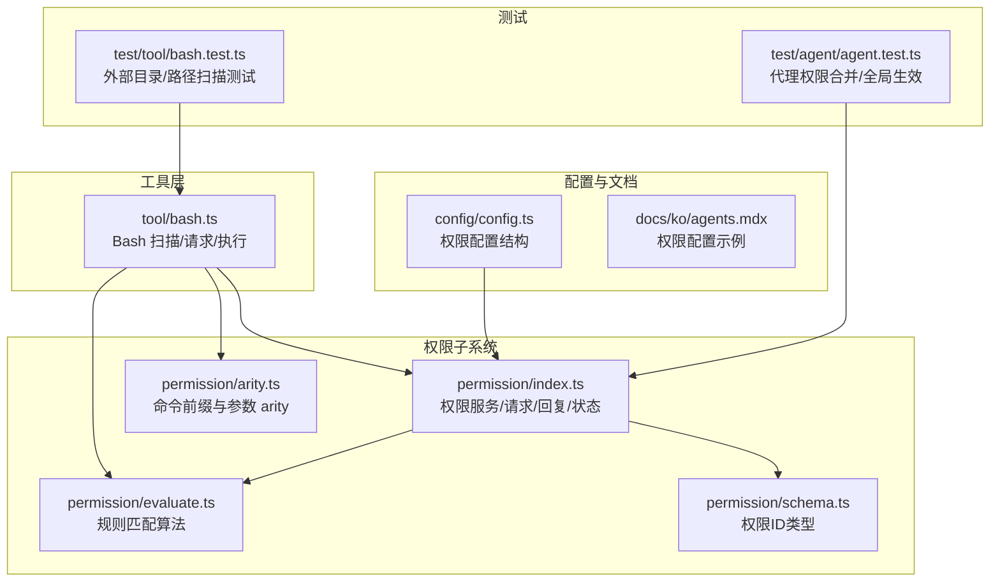
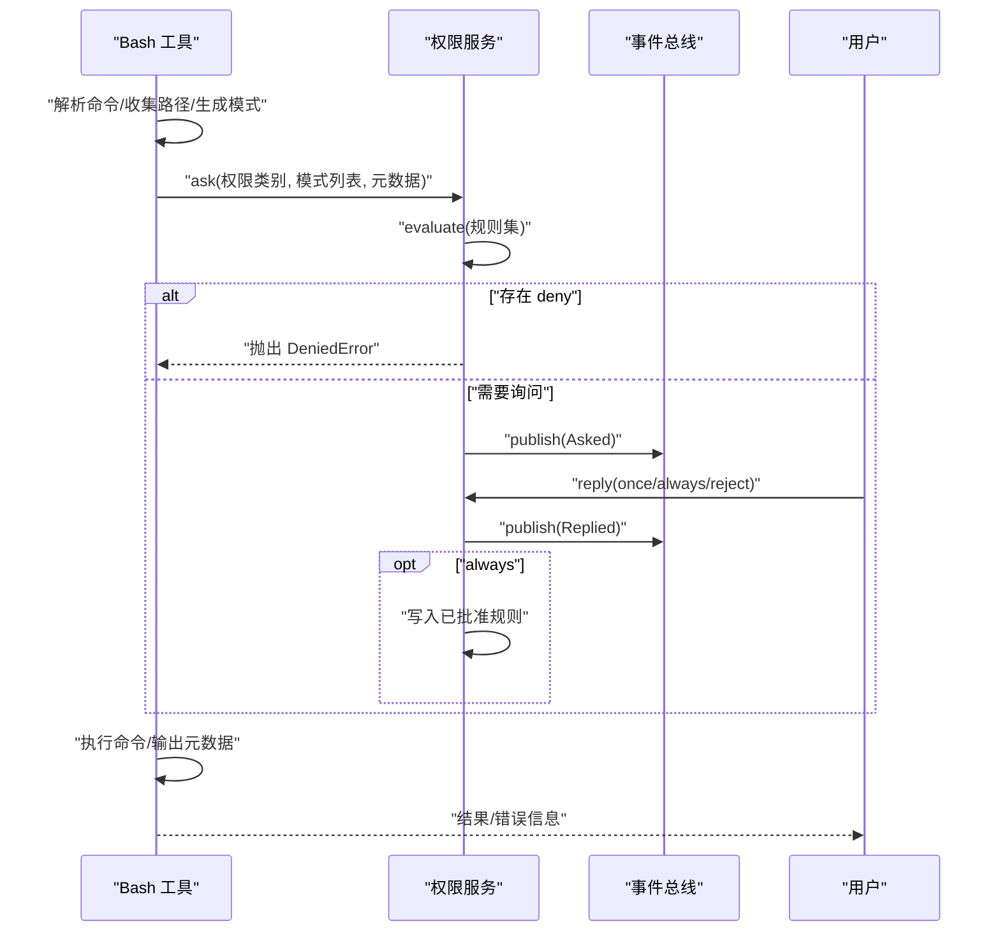
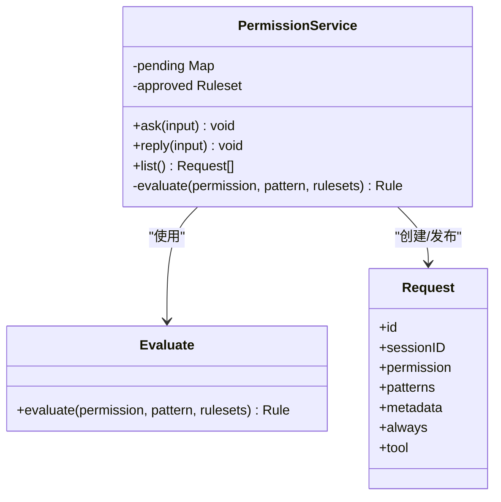
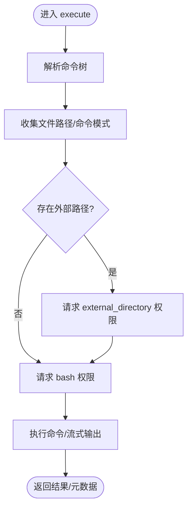
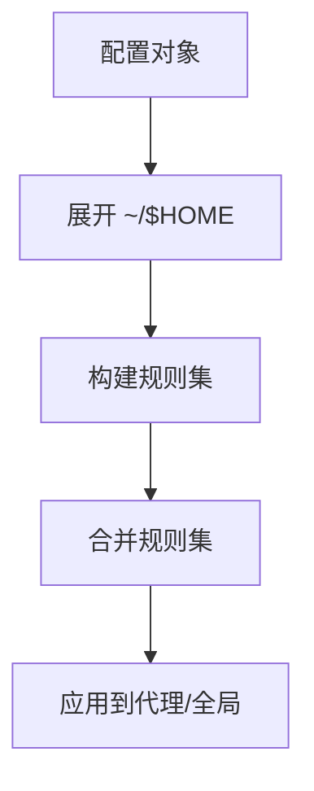
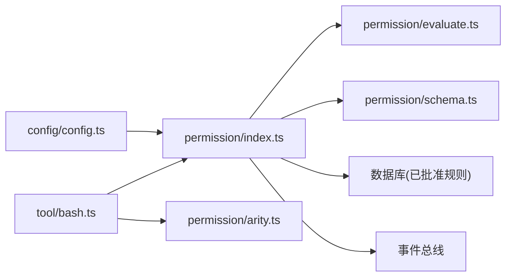

# 权限控制系统

<cite>
**本文引用的文件**
- [packages/opencode/src/permission/index.ts](file://packages/opencode/src/permission/index.ts)
- [packages/opencode/src/permission/evaluate.ts](file://packages/opencode/src/permission/evaluate.ts)
- [packages/opencode/src/permission/schema.ts](file://packages/opencode/src/permission/schema.ts)
- [packages/opencode/src/permission/arity.ts](file://packages/opencode/src/permission/arity.ts)
- [packages/opencode/src/tool/bash.ts](file://packages/opencode/src/tool/bash.ts)
- [packages/opencode/test/agent/agent.test.ts](file://packages/opencode/test/agent/agent.test.ts)
- [packages/opencode/test/tool/bash.test.ts](file://packages/opencode/test/tool/bash.test.ts)
- [packages/web/src/content/docs/ko/agents.mdx](file://packages/web/src/content/docs/ko/agents.mdx)
- [packages/opencode/src/config/config.ts](file://packages/opencode/src/config/config.ts)
</cite>

## 目录
1. [简介](#简介)
2. [项目结构](#项目结构)
3. [核心组件](#核心组件)
4. [架构总览](#架构总览)
5. [详细组件分析](#详细组件分析)
6. [依赖关系分析](#依赖关系分析)
7. [性能考量](#性能考量)
8. [故障排查指南](#故障排查指南)
9. [结论](#结论)
10. [附录](#附录)

## 简介
本文件面向 OpenCode 的权限控制系统，聚焦代理权限设计与安全机制，覆盖文件系统访问权限、Bash 命令执行权限与网络访问限制的策略与实现；阐明不同代理的权限差异与安全边界；解释权限配置方法（含继承与合并）、权限验证流程与错误处理；并说明权限控制与代理系统的集成方式与关键实现细节。

## 项目结构
权限控制相关代码主要分布在以下模块：
- 权限服务与规则：packages/opencode/src/permission/*
- Bash 工具与路径扫描：packages/opencode/src/tool/bash.ts
- 配置与规则解析：packages/opencode/src/config/config.ts
- 文档与示例：packages/web/src/content/docs/ko/agents.mdx
- 测试用例：packages/opencode/test/agent/agent.test.ts、packages/opencode/test/tool/bash.test.ts

**图表来源**
- [packages/opencode/src/permission/index.ts:1-326](file://packages/opencode/src/permission/index.ts#L1-L326)
- [packages/opencode/src/permission/evaluate.ts:1-16](file://packages/opencode/src/permission/evaluate.ts#L1-L16)
- [packages/opencode/src/permission/schema.ts:1-18](file://packages/opencode/src/permission/schema.ts#L1-L18)
- [packages/opencode/src/permission/arity.ts:1-164](file://packages/opencode/src/permission/arity.ts#L1-L164)
- [packages/opencode/src/tool/bash.ts:1-497](file://packages/opencode/src/tool/bash.ts#L1-L497)
- [packages/opencode/src/config/config.ts:432-468](file://packages/opencode/src/config/config.ts#L432-L468)
- [packages/web/src/content/docs/ko/agents.mdx:412-427](file://packages/web/src/content/docs/ko/agents.mdx#L412-L427)
- [packages/opencode/test/agent/agent.test.ts:201-244](file://packages/opencode/test/agent/agent.test.ts#L201-L244)
- [packages/opencode/test/tool/bash.test.ts:207-591](file://packages/opencode/test/tool/bash.test.ts#L207-L591)

**章节来源**
- [packages/opencode/src/permission/index.ts:1-326](file://packages/opencode/src/permission/index.ts#L1-L326)
- [packages/opencode/src/tool/bash.ts:1-497](file://packages/opencode/src/tool/bash.ts#L1-L497)
- [packages/opencode/src/config/config.ts:432-468](file://packages/opencode/src/config/config.ts#L432-L468)
- [packages/web/src/content/docs/ko/agents.mdx:412-427](file://packages/web/src/content/docs/ko/agents.mdx#L412-L427)
- [packages/opencode/test/agent/agent.test.ts:201-244](file://packages/opencode/test/agent/agent.test.ts#L201-L244)
- [packages/opencode/test/tool/bash.test.ts:207-591](file://packages/opencode/test/tool/bash.test.ts#L207-L591)

## 核心组件
- 权限服务（Permission.Service）
  - 职责：统一管理“待审批”请求、已批准规则集；对外暴露 ask/reply/list 接口；通过事件总线广播“被询问/已回复”事件。
  - 关键点：支持一次性（once）或永久（always）授权；拒绝时可附带用户反馈；会清理未决请求。
- 规则评估（evaluate）
  - 职责：按“权限名 + 模式”进行通配匹配，返回最终动作（allow/deny/ask），默认兜底为 ask。
- 请求/回复模型（Request/Reply/Event）
  - 职责：描述一次权限请求的上下文（权限类别、模式列表、元数据、触发工具等），以及用户回复（一次性/永久/拒绝）。
- Bash 工具
  - 职责：解析命令树、识别文件操作与工作目录变更、收集外部路径与命令模式、向权限服务发起 ask 请求、执行并产出元数据。
- 配置与规则
  - 职责：定义权限配置结构（支持字符串简写与对象细粒度），从配置生成规则集；支持多规则集合并与默认值。

**章节来源**
- [packages/opencode/src/permission/index.ts:117-136](file://packages/opencode/src/permission/index.ts#L117-L136)
- [packages/opencode/src/permission/evaluate.ts:9-15](file://packages/opencode/src/permission/evaluate.ts#L9-L15)
- [packages/opencode/src/tool/bash.ts:225-288](file://packages/opencode/src/tool/bash.ts#L225-L288)
- [packages/opencode/src/config/config.ts:435-468](file://packages/opencode/src/config/config.ts#L435-L468)

## 架构总览
权限控制以“工具侧扫描 + 权限服务评估 + 用户交互”的流水线运行：工具在执行前扫描命令中的文件路径与模式，构造权限请求；权限服务根据“已批准规则集 + 当次规则集”评估，必要时通过事件总线通知 UI 进行交互；用户回复后更新状态并可能持久化“总是允许”的规则。

**图表来源**
- [packages/opencode/src/tool/bash.ts:267-288](file://packages/opencode/src/tool/bash.ts#L267-L288)
- [packages/opencode/src/permission/index.ts:167-260](file://packages/opencode/src/permission/index.ts#L167-L260)

## 详细组件分析

### 组件一：权限服务与规则评估
- 服务接口
  - ask：接收请求输入，评估规则，若需询问则发布 Asked 事件并等待回复；若命中 deny 则抛出 DeniedError。
  - reply：处理用户回复，支持 reject/once/always；reject 时可附带反馈；always 将规则写入已批准集合，并对同会话其他待决请求进行批量判定。
  - list：列出当前会话的待处理请求。
- 状态与持久化
  - 使用实例状态保存“待处理请求 + 已批准规则集”，并在实例销毁时清理未决请求。
- 规则评估
  - 支持通配符匹配权限名与模式；优先使用“最近匹配规则”；无匹配时默认 ask。
- 错误模型
  - DeniedError：用户规则阻止了本次调用。
  - RejectedError：用户拒绝授权。
  - CorrectedError：用户拒绝授权并附带反馈。

**图表来源**
- [packages/opencode/src/permission/index.ts:117-136](file://packages/opencode/src/permission/index.ts#L117-L136)
- [packages/opencode/src/permission/evaluate.ts:9-15](file://packages/opencode/src/permission/evaluate.ts#L9-L15)

**章节来源**
- [packages/opencode/src/permission/index.ts:117-260](file://packages/opencode/src/permission/index.ts#L117-L260)
- [packages/opencode/src/permission/evaluate.ts:9-15](file://packages/opencode/src/permission/evaluate.ts#L9-L15)

### 组件二：Bash 工具的权限扫描与执行
- 命令解析与扫描
  - 使用语法树解析命令，提取命令名与参数，识别文件类操作（如 rm/cp/mv/cat 等）与工作目录变更（cd/set-location 等）。
  - 对参数进行路径展开与规范化，区分项目内与外部路径；收集外部目录通配与命令模式。
- 权限请求
  - 若存在外部目录，先请求 external_directory 权限（模式为目录通配）。
  - 再请求 bash 权限（模式为命令片段或“命令前缀 + *”）。
- 执行与元数据
  - 设置超时、中断与输出预览；记录退出码与元数据；支持用户取消与超时提示。

**图表来源**
- [packages/opencode/src/tool/bash.ts:225-288](file://packages/opencode/src/tool/bash.ts#L225-L288)
- [packages/opencode/src/tool/bash.ts:317-409](file://packages/opencode/src/tool/bash.ts#L317-L409)

**章节来源**
- [packages/opencode/src/tool/bash.ts:225-288](file://packages/opencode/src/tool/bash.ts#L225-L288)
- [packages/opencode/src/tool/bash.ts:317-409](file://packages/opencode/src/tool/bash.ts#L317-L409)

### 组件三：权限配置与继承
- 配置结构
  - 支持字符串简写（如 "bash": "deny"）与对象细粒度（如 "bash": { "rm -rf *": "deny" }）。
  - 保留原始键序，保证规则合并时的语义顺序。
- 规则生成与合并
  - fromConfig：将配置转换为规则集，支持 ~/$HOME 展开。
  - merge：将多个规则集扁平化合并。
- 代理级与全局级
  - 全局 permission 配置对所有代理生效；代理级 agent.{name}.permission 可覆盖全局。
  - 测试验证：代理权限可与默认值合并；全局配置对所有代理生效。

**图表来源**
- [packages/opencode/src/config/config.ts:450-468](file://packages/opencode/src/config/config.ts#L450-L468)
- [packages/opencode/src/permission/index.ts:279-295](file://packages/opencode/src/permission/index.ts#L279-L295)
- [packages/opencode/test/agent/agent.test.ts:201-244](file://packages/opencode/test/agent/agent.test.ts#L201-L244)

**章节来源**
- [packages/opencode/src/config/config.ts:435-468](file://packages/opencode/src/config/config.ts#L435-L468)
- [packages/opencode/src/permission/index.ts:279-295](file://packages/opencode/src/permission/index.ts#L279-L295)
- [packages/opencode/test/agent/agent.test.ts:201-244](file://packages/opencode/test/agent/agent.test.ts#L201-L244)

### 组件四：命令前缀与 arity（用于模式泛化）
- 作用：从具体命令中提取“人类可理解的命令前缀”，结合通配符生成更宽泛的模式，减少重复授权。
- 示例：git checkout、npm run dev 等，通过前缀长度映射避免对每个子命令单独授权。

**章节来源**
- [packages/opencode/src/permission/arity.ts:1-164](file://packages/opencode/src/permission/arity.ts#L1-L164)

### 组件五：权限 ID 类型与事件模型
- 权限 ID：基于 Newtype 的强类型标识，支持升序生成，保证唯一性与可排序性。
- 事件模型：Asked/Replied 两类事件，承载请求与回复信息，便于 UI 与审计。

**章节来源**
- [packages/opencode/src/permission/schema.ts:7-17](file://packages/opencode/src/permission/schema.ts#L7-L17)
- [packages/opencode/src/permission/index.ts:71-81](file://packages/opencode/src/permission/index.ts#L71-L81)

## 依赖关系分析
- 工具到权限：Bash 工具依赖权限服务进行 ask/reply；依赖 arity 生成命令前缀模式。
- 权限到存储：权限服务读取/写入数据库中的已批准规则集，保证跨会话持久化。
- 权限到事件：通过事件总线广播权限请求与回复，解耦 UI 与业务逻辑。
- 配置到权限：配置模块定义权限配置结构，权限服务负责将其转换为规则集并参与评估。

**图表来源**
- [packages/opencode/src/tool/bash.ts:1-497](file://packages/opencode/src/tool/bash.ts#L1-L497)
- [packages/opencode/src/permission/index.ts:1-326](file://packages/opencode/src/permission/index.ts#L1-L326)
- [packages/opencode/src/permission/evaluate.ts:1-16](file://packages/opencode/src/permission/evaluate.ts#L1-L16)
- [packages/opencode/src/permission/arity.ts:1-164](file://packages/opencode/src/permission/arity.ts#L1-L164)
- [packages/opencode/src/permission/schema.ts:1-18](file://packages/opencode/src/permission/schema.ts#L1-L18)
- [packages/opencode/src/config/config.ts:435-468](file://packages/opencode/src/config/config.ts#L435-L468)

**章节来源**
- [packages/opencode/src/tool/bash.ts:1-497](file://packages/opencode/src/tool/bash.ts#L1-L497)
- [packages/opencode/src/permission/index.ts:1-326](file://packages/opencode/src/permission/index.ts#L1-L326)
- [packages/opencode/src/config/config.ts:435-468](file://packages/opencode/src/config/config.ts#L435-L468)

## 性能考量
- 规则评估复杂度：evaluate 采用线性扫描并使用通配符匹配，整体为 O(R)（R 为规则数量），在典型场景下足够高效。
- 命令解析：Bash 工具使用 Web Tree-Sitter 解析命令，解析成本与命令复杂度相关；建议尽量复用解析结果，避免重复解析。
- I/O 与超时：Bash 执行设置超时与中断处理，防止长时间阻塞；输出流式写入，降低内存占用。
- 规则合并：fromConfig 与 merge 为 O(P)（P 为配置项数），通常开销较小。

[本节为通用性能讨论，不直接分析具体文件]

## 故障排查指南
- 常见错误
  - DeniedError：检查用户规则是否将该权限/模式设为 deny；可通过“总是允许”扩大范围或调整规则。
  - RejectedError/CorrectedError：用户拒绝授权，需重新协商或调整请求模式。
- 定位步骤
  - 查看权限服务日志与事件总线消息，确认 ask 是否被触发及 reply 结果。
  - 在 Bash 工具侧确认命令解析与路径扫描是否正确，是否存在外部路径导致额外 ask。
- 建议
  - 使用“命令前缀 + *”模式减少重复授权；合理利用 always 授权提升效率。
  - 对高风险命令（如 rm -rf）在全局或代理级配置中显式 deny，并在 UI 中明确提示。

**章节来源**
- [packages/opencode/src/permission/index.ts:175-182](file://packages/opencode/src/permission/index.ts#L175-L182)
- [packages/opencode/src/tool/bash.ts:267-288](file://packages/opencode/src/tool/bash.ts#L267-L288)

## 结论
OpenCode 的权限控制系统通过“工具侧扫描 + 权限服务评估 + 用户交互”的闭环，实现了对文件系统访问、Bash 命令执行与潜在网络行为的有效约束。其设计强调：
- 明确的安全边界：外部路径与命令模式分离授权；
- 可配置的策略：支持全局与代理级覆盖、细粒度模式控制；
- 友好的用户体验：支持一次性与永久授权、清晰的错误反馈；
- 可扩展的架构：事件驱动与规则引擎便于后续增强。

[本节为总结性内容，不直接分析具体文件]

## 附录

### 权限类别与动作说明
- 权限类别
  - edit：文件编辑/写入能力
  - bash：Bash 命令执行能力
  - external_directory：访问项目外目录的能力
- 动作
  - ask：执行前询问
  - allow：无需询问直接允许
  - deny：禁止使用

**章节来源**
- [packages/web/src/content/docs/ko/agents.mdx:412-427](file://packages/web/src/content/docs/ko/agents.mdx#L412-L427)

### 配置示例与最佳实践
- 全局 deny bash
  - 在全局 permission 中将 bash 设为 deny，确保所有代理默认不可执行命令。
- 代理级覆盖
  - 在 agent.{name}.permission 中针对特定代理放宽或收紧权限，实现差异化控制。
- 模式细化
  - 对危险命令（如 rm -rf）使用精确模式 deny，避免过度授权。

**章节来源**
- [packages/opencode/test/agent/agent.test.ts:228-244](file://packages/opencode/test/agent/agent.test.ts#L228-L244)
- [packages/web/src/content/docs/ko/agents.mdx:412-427](file://packages/web/src/content/docs/ko/agents.mdx#L412-L427)

### 测试要点
- 外部路径扫描
  - Bash 工具在遇到通配符或跨目录路径时，应请求 external_directory 权限。
- 权限合并与全局生效
  - 代理级配置与全局配置合并，且全局配置对所有代理生效。
- PowerShell 特性
  - Set-Location 等命令被视为 cd 类别，仅触发 external_directory 请求，不额外触发 bash 请求。

**章节来源**
- [packages/opencode/test/tool/bash.test.ts:207-229](file://packages/opencode/test/tool/bash.test.ts#L207-L229)
- [packages/opencode/test/tool/bash.test.ts:326-352](file://packages/opencode/test/tool/bash.test.ts#L326-L352)
- [packages/opencode/test/tool/bash.test.ts:504-531](file://packages/opencode/test/tool/bash.test.ts#L504-L531)
- [packages/opencode/test/tool/bash.test.ts:564-591](file://packages/opencode/test/tool/bash.test.ts#L564-L591)
- [packages/opencode/test/agent/agent.test.ts:201-244](file://packages/opencode/test/agent/agent.test.ts#L201-L244)