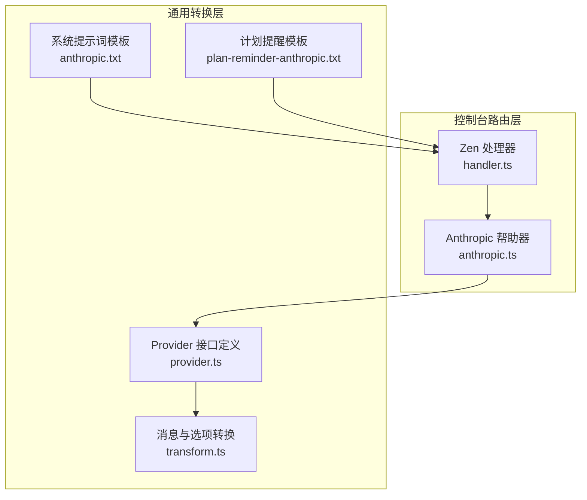
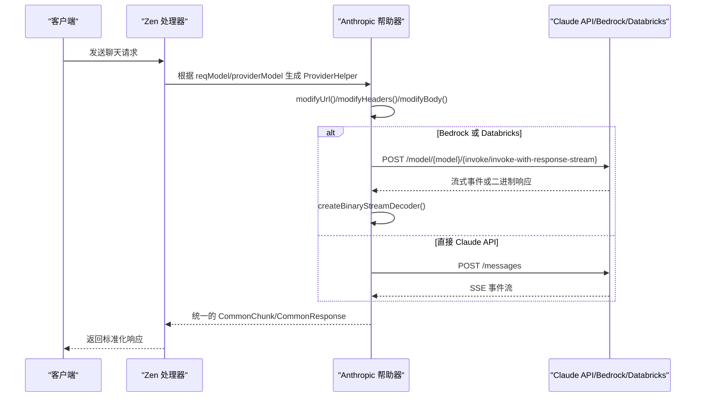
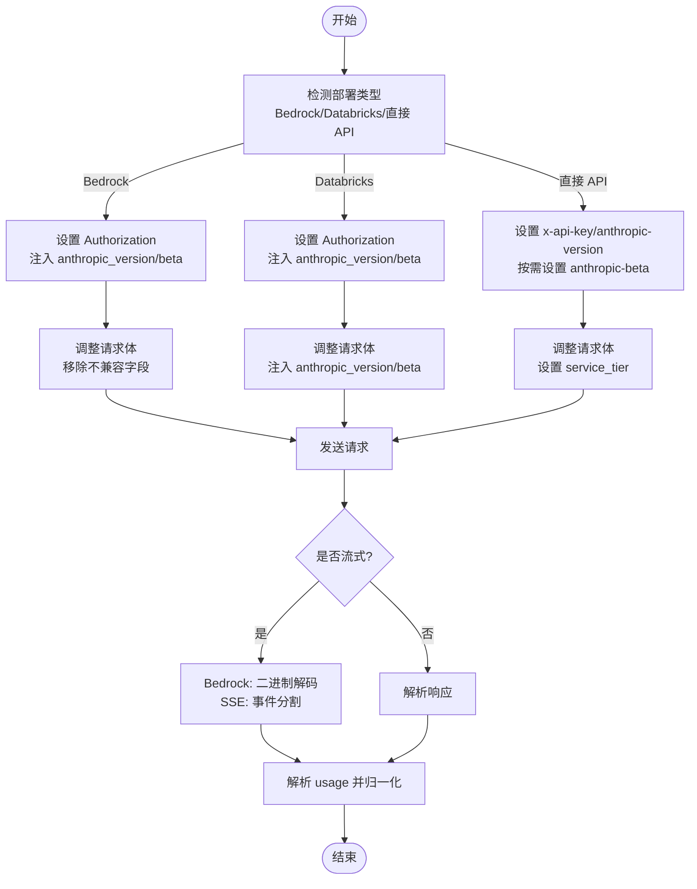
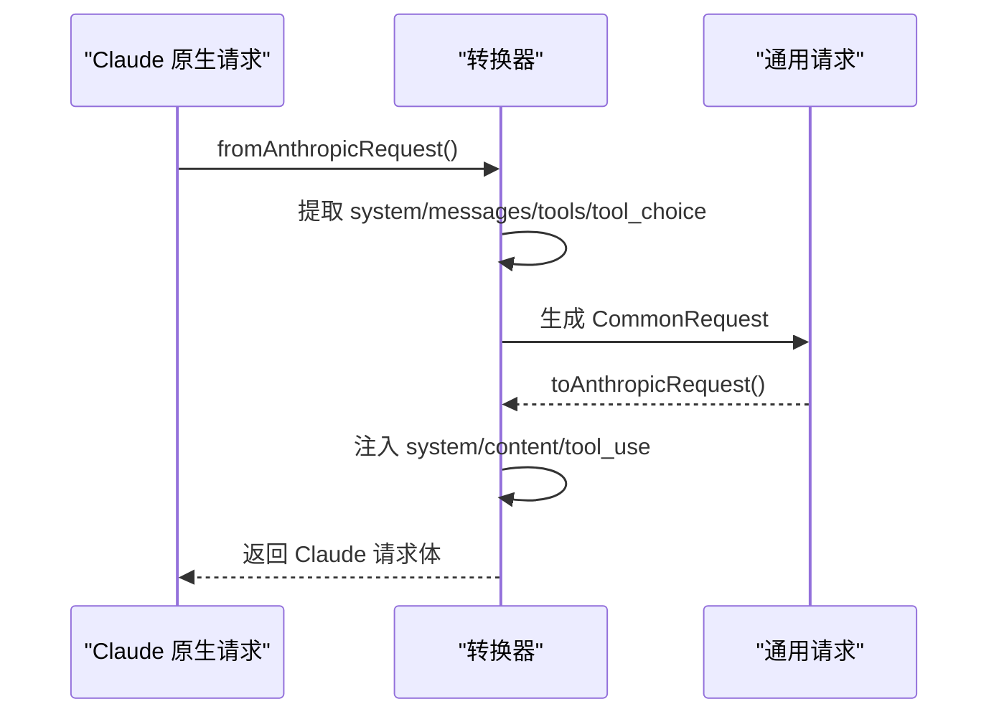
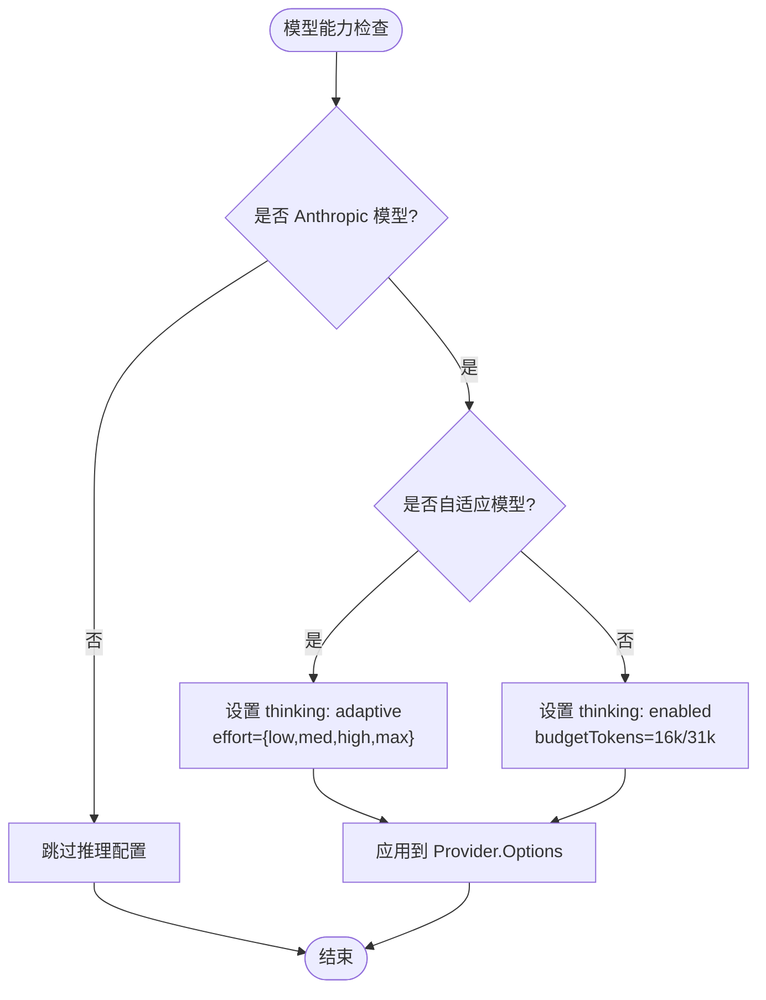
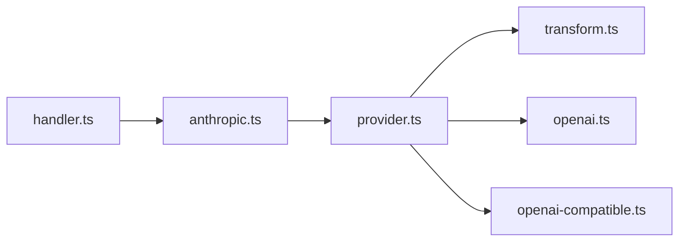

# Anthropic Claude 集成

<cite>
**本文档引用的文件**
- [packages/console/app/src/routes/zen/util/provider/anthropic.ts](file://packages/console/app/src/routes/zen/util/provider/anthropic.ts)
- [packages/console/app/src/routes/zen/util/provider/provider.ts](file://packages/console/app/src/routes/zen/util/provider/provider.ts)
- [packages/opencode/src/provider/transform.ts](file://packages/opencode/src/provider/transform.ts)
- [packages/opencode/src/session/prompt/anthropic.txt](file://packages/opencode/src/session/prompt/anthropic.txt)
- [packages/opencode/src/session/prompt/plan-reminder-anthropic.txt](file://packages/opencode/src/session/prompt/plan-reminder-anthropic.txt)
- [packages/console/app/src/routes/zen/util/handler.ts](file://packages/console/app/src/routes/zen/util/handler.ts)
</cite>

## 目录
1. [简介](#简介)
2. [项目结构](#项目结构)
3. [核心组件](#核心组件)
4. [架构概览](#架构概览)
5. [详细组件分析](#详细组件分析)
6. [依赖关系分析](#依赖关系分析)
7. [性能考虑](#性能考虑)
8. [故障排除指南](#故障排除指南)
9. [结论](#结论)
10. [附录](#附录)

## 简介
本文件为 Anthropic Claude 模型提供商在 OpenCode 项目中的集成技术文档。重点涵盖以下方面：
- Claude API 的集成方式：API 密钥配置、消息格式适配、工具调用支持
- Anthropic 特有功能特性：系统提示词、角色扮演模式、长上下文处理（1M 上下文）
- 具体配置示例与使用场景：如何处理 Claude 的特殊输出格式、错误处理策略、性能优化技巧
- 与 OpenAI 集成的差异及各自适用场景

## 项目结构
该集成主要分布在控制台路由层与通用转换层两个部分：
- 控制台路由层：负责根据请求模型与提供商模型动态选择 Claude API 调用路径、头部与请求体的修改逻辑，并处理流式响应与用量统计
- 通用转换层：提供统一的消息、请求、响应与流片段的跨提供商转换接口，确保上层业务逻辑与具体提供商解耦

**图表来源**
- [packages/console/app/src/routes/zen/util/handler.ts:473-492](file://packages/console/app/src/routes/zen/util/handler.ts#L473-L492)
- [packages/console/app/src/routes/zen/util/provider/anthropic.ts:19-41](file://packages/console/app/src/routes/zen/util/provider/anthropic.ts#L19-L41)
- [packages/console/app/src/routes/zen/util/provider/provider.ts:36-54](file://packages/console/app/src/routes/zen/util/provider/provider.ts#L36-L54)
- [packages/opencode/src/provider/transform.ts:20-322](file://packages/opencode/src/provider/transform.ts#L20-L322)
- [packages/opencode/src/session/prompt/anthropic.txt:1-106](file://packages/opencode/src/session/prompt/anthropic.txt#L1-L106)
- [packages/opencode/src/session/prompt/plan-reminder-anthropic.txt:1-68](file://packages/opencode/src/session/prompt/plan-reminder-anthropic.txt#L1-L68)

**章节来源**
- [packages/console/app/src/routes/zen/util/handler.ts:473-492](file://packages/console/app/src/routes/zen/util/handler.ts#L473-L492)
- [packages/console/app/src/routes/zen/util/provider/anthropic.ts:19-41](file://packages/console/app/src/routes/zen/util/provider/anthropic.ts#L19-L41)
- [packages/console/app/src/routes/zen/util/provider/provider.ts:36-54](file://packages/console/app/src/routes/zen/util/provider/provider.ts#L36-L54)
- [packages/opencode/src/provider/transform.ts:20-322](file://packages/opencode/src/provider/transform.ts#L20-L322)
- [packages/opencode/src/session/prompt/anthropic.txt:1-106](file://packages/opencode/src/session/prompt/anthropic.txt#L1-L106)
- [packages/opencode/src/session/prompt/plan-reminder-anthropic.txt:1-68](file://packages/opencode/src/session/prompt/plan-reminder-anthropic.txt#L1-L68)

## 核心组件
- ProviderHelper 接口：定义了针对不同提供商的统一适配能力，包括 URL 修改、头部设置、请求体调整、二进制流解码器、流分隔符、用量解析器与归一化
- Anthropic 帮助器：实现 ProviderHelper，专门处理 Claude API 的请求与响应格式、流式事件转换、用量统计与长上下文支持
- 通用转换函数：提供 from/to Anthropic/OpenAI/OA-Compatible 的双向转换，确保上层业务与具体提供商解耦
- 消息与选项转换：在消息层面进行空内容过滤、工具调用 ID 规整、缓存控制注入；在选项层面根据模型能力启用推理（thinking）与限制输出令牌数

**章节来源**
- [packages/console/app/src/routes/zen/util/provider/provider.ts:36-54](file://packages/console/app/src/routes/zen/util/provider/provider.ts#L36-L54)
- [packages/console/app/src/routes/zen/util/provider/anthropic.ts:19-41](file://packages/console/app/src/routes/zen/util/provider/anthropic.ts#L19-L41)
- [packages/console/app/src/routes/zen/util/provider/anthropic.ts:190-322](file://packages/console/app/src/routes/zen/util/provider/anthropic.ts#L190-L322)
- [packages/opencode/src/provider/transform.ts:49-190](file://packages/opencode/src/provider/transform.ts#L49-L190)
- [packages/opencode/src/provider/transform.ts:551-583](file://packages/opencode/src/provider/transform.ts#L551-L583)

## 架构概览
下图展示了从请求进入 Zen 处理器到最终调用 Claude API 的完整流程，以及在不同部署环境（直接 API、AWS Bedrock、Databricks）下的差异化处理。

**图表来源**
- [packages/console/app/src/routes/zen/util/handler.ts:473-492](file://packages/console/app/src/routes/zen/util/handler.ts#L473-L492)
- [packages/console/app/src/routes/zen/util/provider/anthropic.ts:27-41](file://packages/console/app/src/routes/zen/util/provider/anthropic.ts#L27-L41)
- [packages/console/app/src/routes/zen/util/provider/anthropic.ts:60-143](file://packages/console/app/src/routes/zen/util/provider/anthropic.ts#L60-L143)

**章节来源**
- [packages/console/app/src/routes/zen/util/handler.ts:473-492](file://packages/console/app/src/routes/zen/util/handler.ts#L473-L492)
- [packages/console/app/src/routes/zen/util/provider/anthropic.ts:27-41](file://packages/console/app/src/routes/zen/util/provider/anthropic.ts#L27-L41)
- [packages/console/app/src/routes/zen/util/provider/anthropic.ts:60-143](file://packages/console/app/src/routes/zen/util/provider/anthropic.ts#L60-L143)

## 详细组件分析

### Anthropic 帮助器（ProviderHelper 实现）
- 动态 URL 与头部管理
  - 直接 Claude API：使用 /messages 端点
  - AWS Bedrock：使用 /model/{model}/{invoke/invoke-with-response-stream} 端点
  - Databricks：使用 Bedrock 兼容端点
  - 头部设置：直接 API 使用 x-api-key 与 anthropic-version；Bedrock/Databricks 使用 Authorization；根据模型能力自动添加 anthropic-beta 支持 1M 上下文
- 请求体适配
  - Bedrock/Databricks：注入 anthropic_version 与 anthropic_beta；移除不兼容字段
  - 直接 API：设置 service_tier 为 standard_only
- 流式响应处理
  - Bedrock：提供 createBinaryStreamDecoder 将二进制事件流解码为标准 SSE
  - SSE：通过 streamSeparator 分割事件，解析 usage 并归一化为统一格式
- 用量统计
  - 解析 message_start/message_delta 等事件中的 usage 字段，合并缓存读写与输入输出令牌
  - 归一化为统一的 UsageInfo 结构，包含输入、输出、缓存读写等指标

**图表来源**
- [packages/console/app/src/routes/zen/util/provider/anthropic.ts:27-41](file://packages/console/app/src/routes/zen/util/provider/anthropic.ts#L27-L41)
- [packages/console/app/src/routes/zen/util/provider/anthropic.ts:42-58](file://packages/console/app/src/routes/zen/util/provider/anthropic.ts#L42-L58)
- [packages/console/app/src/routes/zen/util/provider/anthropic.ts:60-143](file://packages/console/app/src/routes/zen/util/provider/anthropic.ts#L60-L143)
- [packages/console/app/src/routes/zen/util/provider/anthropic.ts:145-187](file://packages/console/app/src/routes/zen/util/provider/anthropic.ts#L145-L187)

**章节来源**
- [packages/console/app/src/routes/zen/util/provider/anthropic.ts:27-41](file://packages/console/app/src/routes/zen/util/provider/anthropic.ts#L27-L41)
- [packages/console/app/src/routes/zen/util/provider/anthropic.ts:42-58](file://packages/console/app/src/routes/zen/util/provider/anthropic.ts#L42-L58)
- [packages/console/app/src/routes/zen/util/provider/anthropic.ts:60-143](file://packages/console/app/src/routes/zen/util/provider/anthropic.ts#L60-L143)
- [packages/console/app/src/routes/zen/util/provider/anthropic.ts:145-187](file://packages/console/app/src/routes/zen/util/provider/anthropic.ts#L145-L187)

### 消息与工具调用适配
- fromAnthropicRequest：将 Claude 原生请求转换为通用格式
  - 系统提示词：提取 system 数组中的文本内容
  - 用户消息：支持文本与图片（data URL/base64），工具调用结果作为 tool 角色消息
  - 助手消息：将 tool_use 内容转换为 tool_calls，文本内容拼接
  - 工具定义：提取 tools 中的 input_schema 并映射为 function 类型
  - 工具选择：支持 auto/any/tool 映射
- toAnthropicRequest：将通用格式转换为 Claude 请求
  - 系统提示词：以数组形式注入，最多 4 条并应用缓存控制
  - 用户/助手消息：将文本与图片转换为 Claude 的 content 数组，工具调用转换为 tool_use
  - 工具选择：支持 "auto"/"required"/{type:"function",function:{name}} 映射
- fromAnthropicResponse/toAnthropicResponse：在 Claude 原生响应与通用响应之间双向转换
  - finish_reason 映射：end_turn→stop、tool_use→tool_calls、max_tokens→length、content_filter→content_filter
  - usage 映射：input_tokens/output_tokens/cache_read_input_tokens 等字段归一化
- from/to Anthropic Chunk：在 SSE 事件与通用流片段之间转换
  - content_block_start/delta 对应文本增量与工具调用参数增量
  - message_delta 对应完成原因与 usage

**图表来源**
- [packages/console/app/src/routes/zen/util/provider/anthropic.ts:190-322](file://packages/console/app/src/routes/zen/util/provider/anthropic.ts#L190-L322)
- [packages/console/app/src/routes/zen/util/provider/anthropic.ts:324-466](file://packages/console/app/src/routes/zen/util/provider/anthropic.ts#L324-L466)
- [packages/console/app/src/routes/zen/util/provider/anthropic.ts:468-549](file://packages/console/app/src/routes/zen/util/provider/anthropic.ts#L468-L549)
- [packages/console/app/src/routes/zen/util/provider/anthropic.ts:551-614](file://packages/console/app/src/routes/zen/util/provider/anthropic.ts#L551-L614)
- [packages/console/app/src/routes/zen/util/provider/anthropic.ts:616-703](file://packages/console/app/src/routes/zen/util/provider/anthropic.ts#L616-L703)
- [packages/console/app/src/routes/zen/util/provider/anthropic.ts:705-759](file://packages/console/app/src/routes/zen/util/provider/anthropic.ts#L705-L759)

**章节来源**
- [packages/console/app/src/routes/zen/util/provider/anthropic.ts:190-322](file://packages/console/app/src/routes/zen/util/provider/anthropic.ts#L190-L322)
- [packages/console/app/src/routes/zen/util/provider/anthropic.ts:324-466](file://packages/console/app/src/routes/zen/util/provider/anthropic.ts#L324-L466)
- [packages/console/app/src/routes/zen/util/provider/anthropic.ts:468-549](file://packages/console/app/src/routes/zen/util/provider/anthropic.ts#L468-L549)
- [packages/console/app/src/routes/zen/util/provider/anthropic.ts:551-614](file://packages/console/app/src/routes/zen/util/provider/anthropic.ts#L551-L614)
- [packages/console/app/src/routes/zen/util/provider/anthropic.ts:616-703](file://packages/console/app/src/routes/zen/util/provider/anthropic.ts#L616-L703)
- [packages/console/app/src/routes/zen/util/provider/anthropic.ts:705-759](file://packages/console/app/src/routes/zen/util/provider/anthropic.ts#L705-L759)

### 推理（Thinking）与变体配置
- 变体映射：针对 Anthropic 的 opus-4-6/sonnet-4-6 等模型启用自适应推理；其他模型提供 high/max 两种变体，分别设置思考预算
- 选项注入：在使用 @ai-sdk/anthropic 或 @ai-sdk/google-vertex/anthropic 时，自动为 Kimi/K2 等模型启用 thinking 并设置预算
- 通用转换：在消息层面应用缓存控制（ephemeral），在工具调用 ID 清理与序列修复方面进行规范化

**图表来源**
- [packages/opencode/src/provider/transform.ts:551-583](file://packages/opencode/src/provider/transform.ts#L551-L583)
- [packages/opencode/src/provider/transform.ts:800-810](file://packages/opencode/src/provider/transform.ts#L800-L810)

**章节来源**
- [packages/opencode/src/provider/transform.ts:551-583](file://packages/opencode/src/provider/transform.ts#L551-L583)
- [packages/opencode/src/provider/transform.ts:800-810](file://packages/opencode/src/provider/transform.ts#L800-L810)
- [packages/opencode/src/provider/transform.ts:278-322](file://packages/opencode/src/provider/transform.ts#L278-L322)

### 系统提示词与计划提醒
- 系统提示词模板：定义了 OpenCode 作为 Claude 代理的行为准则、风格要求与工具使用策略
- 计划提醒模板：在计划模式下提供结构化的规划工作流与文件管理建议

**章节来源**
- [packages/opencode/src/session/prompt/anthropic.txt:1-106](file://packages/opencode/src/session/prompt/anthropic.txt#L1-L106)
- [packages/opencode/src/session/prompt/plan-reminder-anthropic.txt:1-68](file://packages/opencode/src/session/prompt/plan-reminder-anthropic.txt#L1-L68)

## 依赖关系分析
- ProviderHelper 与 Provider 接口：通过 Provider 接口统一暴露 modifyUrl/modifyHeaders/modifyBody/createBinaryStreamDecoder/streamSeparator/createUsageParser/normalizeUsage 等方法，确保不同提供商的一致性
- 转换器链路：handler.ts 根据 format 选择相应的 ProviderHelper；Provider 接口再将请求/响应/流片段在不同格式间转换
- 与 AI SDK 的集成：transform.ts 将 @ai-sdk/anthropic 与 @ai-sdk/google-vertex/anthropic 的模型能力映射到统一的 Provider.Options

**图表来源**
- [packages/console/app/src/routes/zen/util/handler.ts:473-492](file://packages/console/app/src/routes/zen/util/handler.ts#L473-L492)
- [packages/console/app/src/routes/zen/util/provider/anthropic.ts:1-10](file://packages/console/app/src/routes/zen/util/provider/anthropic.ts#L1-L10)
- [packages/console/app/src/routes/zen/util/provider/provider.ts:1-26](file://packages/console/app/src/routes/zen/util/provider/provider.ts#L1-L26)
- [packages/opencode/src/provider/transform.ts:20-47](file://packages/opencode/src/provider/transform.ts#L20-L47)

**章节来源**
- [packages/console/app/src/routes/zen/util/handler.ts:473-492](file://packages/console/app/src/routes/zen/util/handler.ts#L473-L492)
- [packages/console/app/src/routes/zen/util/provider/anthropic.ts:1-10](file://packages/console/app/src/routes/zen/util/provider/anthropic.ts#L1-L10)
- [packages/console/app/src/routes/zen/util/provider/provider.ts:1-26](file://packages/console/app/src/routes/zen/util/provider/provider.ts#L1-L26)
- [packages/opencode/src/provider/transform.ts:20-47](file://packages/opencode/src/provider/transform.ts#L20-L47)

## 性能考虑
- 缓存控制：在消息与内容级别注入缓存控制（ephemeral），减少重复计算与网络往返
- 流式处理：Bedrock 二进制事件流与 SSE 事件流均进行增量解析，降低内存占用
- 输出令牌限制：统一限制最大输出令牌数，避免超大响应导致资源浪费
- 推理预算：为支持推理的模型设置合理的思考预算，平衡质量与成本

## 故障排除指南
- 认证失败：当未提供有效 API Key 且模型不允许匿名访问时抛出认证错误
- 模型不支持：Alpha 模型在生产环境仅限管理员工作区使用
- 流式解码异常：Bedrock 二进制解码过程中捕获异常并中断解析，需检查模型 ARN/ID 与版本头
- 用量解析失败：SSE 事件中 usage 字段缺失或格式异常时忽略该段用量

**章节来源**
- [packages/console/app/src/routes/zen/util/handler.ts:494-616](file://packages/console/app/src/routes/zen/util/handler.ts#L494-L616)
- [packages/console/app/src/routes/zen/util/provider/anthropic.ts:135-142](file://packages/console/app/src/routes/zen/util/provider/anthropic.ts#L135-L142)

## 结论
该集成通过 ProviderHelper 与通用转换层实现了对 Anthropic Claude API 的完整适配，覆盖了直接 API、AWS Bedrock 与 Databricks 三种部署形态，并提供了长上下文支持、工具调用、流式处理与用量统计等关键能力。配合 transform.ts 的推理配置与缓存控制，能够在保证性能的同时提升用户体验。

## 附录

### 配置示例与使用场景
- API 密钥配置
  - 直接 Claude API：通过 x-api-key 与 anthropic-version 头部进行认证
  - Bedrock/Databricks：通过 Authorization 头部传递 Bearer Token
- 消息格式适配
  - 系统提示词：支持多条 system 文本并应用缓存控制
  - 用户消息：支持文本与图片（data URL/base64），工具调用结果转换为 tool 角色
  - 助手消息：将 tool_use 转换为 tool_calls，finish_reason 映射为标准值
- 工具调用支持
  - 支持 auto/any/tool 三种工具选择策略
  - 工具定义通过 input_schema 进行参数校验
- 长上下文处理
  - 通过 anthropic-beta: context-1m-2025-08-07 启用 1M 上下文支持（适用于特定模型）

### 与 OpenAI 集成的差异
- 认证头部：OpenAI 使用 Authorization: Bearer，Claude 使用 x-api-key 或 Authorization（Bedrock/Databricks）
- 端点路径：OpenAI 使用 /chat/completions，Claude 使用 /messages 或 Bedrock 端点
- 工具调用：OpenAI 使用 tool_calls，Claude 使用 tool_use；转换层提供双向映射
- 流式事件：OpenAI 使用 data: 块，Claude 使用 SSE 事件；Bedrock 使用二进制事件流
- 推理配置：OpenAI 通过 reasoningEffort，Claude 通过 thinking/budgetTokens 或 adaptive