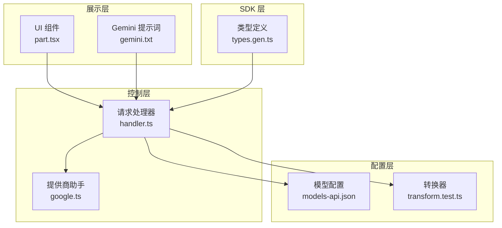
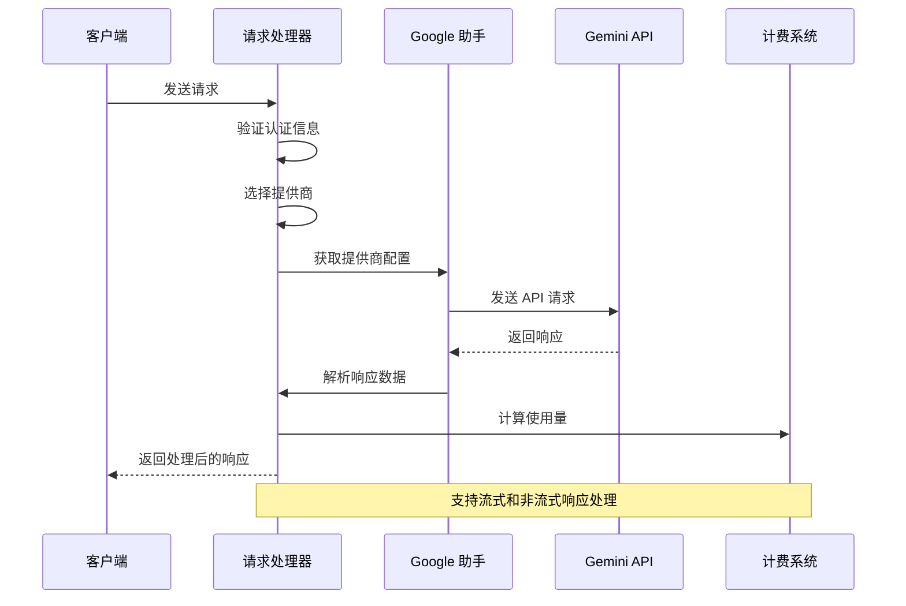
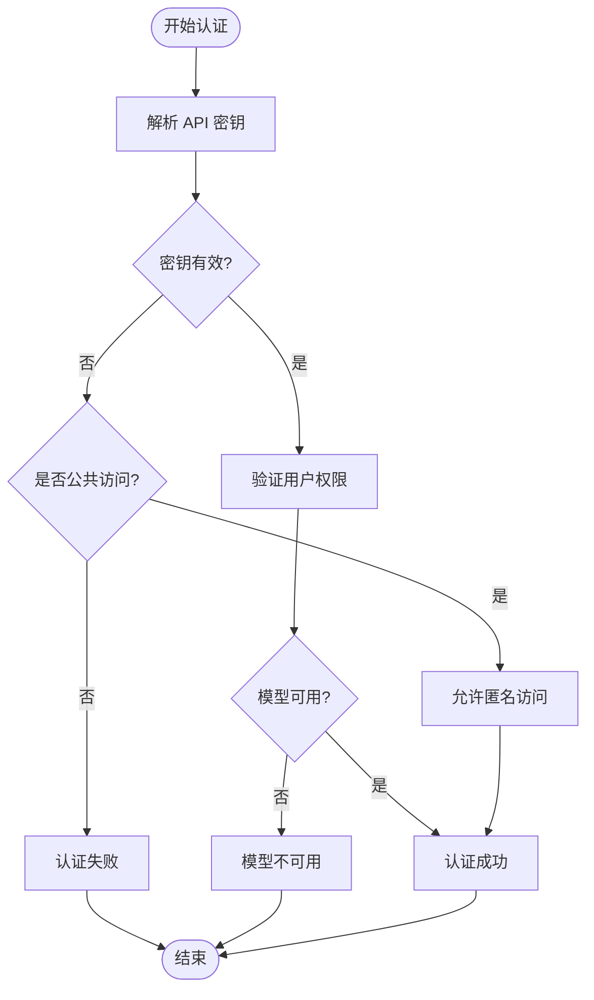
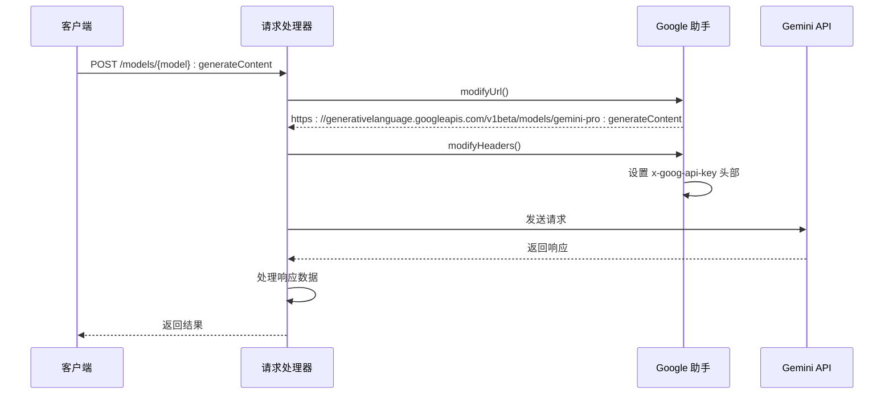
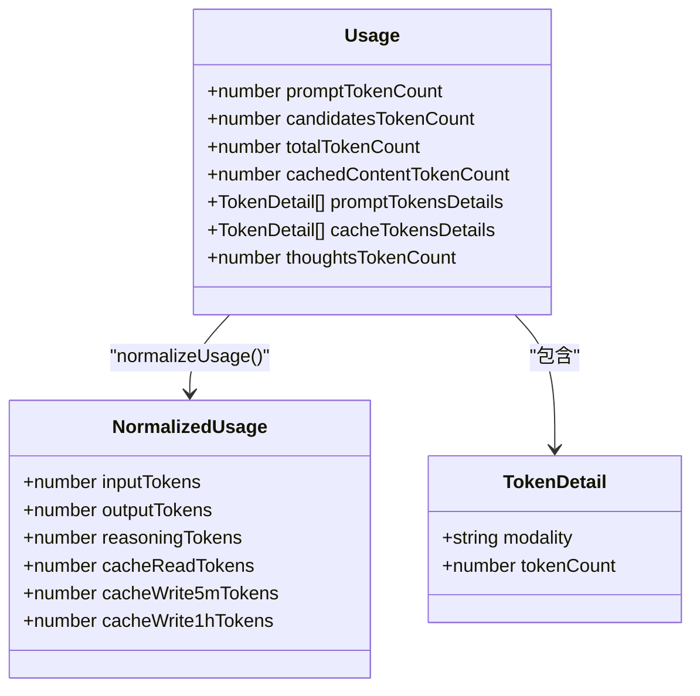
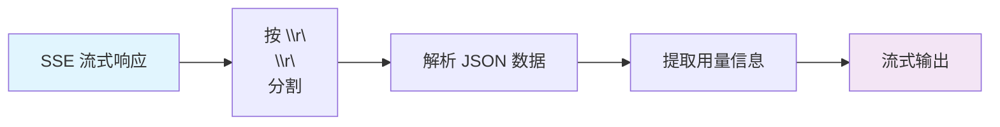
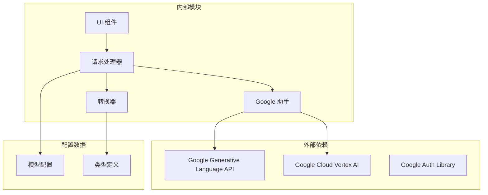

# Google Gemini 集成

<cite>
**本文档引用的文件**
- [packages/console/app/src/routes/zen/util/handler.ts](file://packages/console/app/src/routes/zen/util/handler.ts)
- [packages/console/app/src/routes/zen/util/provider/google.ts](file://packages/console/app/src/routes/zen/util/provider/google.ts)
- [packages/opencode/test/provider/transform.test.ts](file://packages/opencode/test/provider/transform.test.ts)
- [packages/opencode/test/tool/fixtures/models-api.json](file://packages/opencode/test/tool/fixtures/models-api.json)
- [packages/web/src/components/share/part.tsx](file://packages/web/src/components/share/part.tsx)
- [packages/opencode/src/session/prompt/gemini.txt](file://packages/opencode/src/session/prompt/gemini.txt)
- [packages/sdk/js/src/v2/gen/types.gen.ts](file://packages/sdk/js/src/v2/gen/types.gen.ts)
</cite>

## 目录
1. [简介](#简介)
2. [项目结构](#项目结构)
3. [核心组件](#核心组件)
4. [架构概览](#架构概览)
5. [详细组件分析](#详细组件分析)
6. [依赖关系分析](#依赖关系分析)
7. [性能考虑](#性能考虑)
8. [故障排除指南](#故障排除指南)
9. [结论](#结论)
10. [附录](#附录)

## 简介

本文件为 Google Gemini 模型提供商在 OpenCode 平台中的技术集成文档。内容涵盖 Gemini API 的集成架构、认证流程、API 调用方式、响应数据处理、Gemini 特有特性与限制、配置指南、使用示例以及与其他模型提供商的技术差异和性能对比。

## 项目结构

OpenCode 平台采用分层架构设计，Gemini 集成主要分布在以下模块：



**图表来源**
- [packages/console/app/src/routes/zen/util/handler.ts:63-390](file://packages/console/app/src/routes/zen/util/handler.ts#L63-L390)
- [packages/console/app/src/routes/zen/util/provider/google.ts:29-76](file://packages/console/app/src/routes/zen/util/provider/google.ts#L29-L76)

**章节来源**
- [packages/console/app/src/routes/zen/util/handler.ts:1-1058](file://packages/console/app/src/routes/zen/util/handler.ts#L1-L1058)
- [packages/console/app/src/routes/zen/util/provider/google.ts:1-76](file://packages/console/app/src/routes/zen/util/provider/google.ts#L1-L76)

## 核心组件

### 请求处理器 (Handler)

请求处理器是 Gemini 集成的核心协调者，负责：

- **认证管理**: 验证 API 密钥和用户权限
- **提供商选择**: 基于会话和 IP 地址选择合适的提供商
- **请求转发**: 将请求转发到 Gemini API
- **响应处理**: 处理流式和非流式响应
- **计费统计**: 计算使用量和费用

### Google 提供商助手

Google 提供商助手专门处理 Gemini API 的特定需求：

- **URL 构建**: 自动添加 `:streamGenerateContent?alt=sse` 或 `:generateContent` 后缀
- **头部设置**: 添加 `x-goog-api-key` 头部
- **流式处理**: 解析 SSE 格式的流式响应
- **用量解析**: 提取 token 使用情况

### 模型配置系统

平台通过统一的模型配置系统管理 Gemini 模型：

- **能力标识**: 支持推理、工具调用、附件上传等
- **模态支持**: 文本、图像、PDF 等多模态输入输出
- **限制配置**: 上下文长度、输出长度等约束
- **成本计算**: 输入输出价格和缓存读写成本

**章节来源**
- [packages/console/app/src/routes/zen/util/handler.ts:420-492](file://packages/console/app/src/routes/zen/util/handler.ts#L420-L492)
- [packages/console/app/src/routes/zen/util/provider/google.ts:29-76](file://packages/console/app/src/routes/zen/util/provider/google.ts#L29-L76)
- [packages/opencode/test/tool/fixtures/models-api.json:240-258](file://packages/opencode/test/tool/fixtures/models-api.json#L240-L258)

## 架构概览



**图表来源**
- [packages/console/app/src/routes/zen/util/handler.ts:124-200](file://packages/console/app/src/routes/zen/util/handler.ts#L124-L200)
- [packages/console/app/src/routes/zen/util/provider/google.ts:29-76](file://packages/console/app/src/routes/zen/util/provider/google.ts#L29-L76)

## 详细组件分析

### 认证流程

Gemini 集成采用基于 API 密钥的认证机制：



**图表来源**
- [packages/console/app/src/routes/zen/util/handler.ts:494-616](file://packages/console/app/src/routes/zen/util/handler.ts#L494-L616)

### API 调用流程

Gemini API 调用遵循标准的 HTTP 协议，但具有特定的头部要求：



**图表来源**
- [packages/console/app/src/routes/zen/util/provider/google.ts:31-35](file://packages/console/app/src/routes/zen/util/provider/google.ts#L31-L35)

### 响应数据处理

Gemini 响应包含详细的用量信息，系统需要正确解析这些数据：



**图表来源**
- [packages/console/app/src/routes/zen/util/provider/google.ts:19-74](file://packages/console/app/src/routes/zen/util/provider/google.ts#L19-L74)

**章节来源**
- [packages/console/app/src/routes/zen/util/provider/google.ts:19-76](file://packages/console/app/src/routes/zen/util/provider/google.ts#L19-L76)

### Gemini 特有特性

#### 推理模式 (Reasoning)

Gemini 支持多种推理级别配置：

| 推理级别 | 配置选项 | 用途场景 |
|---------|----------|----------|
| low | thinkingConfig.includeThoughts=true<br/>thinkingLevel="low" | 基础推理任务 |
| high | thinkingConfig.includeThoughts=true<br/>thinkingLevel="high" | 复杂推理任务 |
| max | thinkingConfig.includeThoughts=true<br/>thinkingBudget=24576 | 最大推理预算 |

#### 多模态支持

Gemini 模型支持多种输入模态：

- **文本输入**: 标准文本对话
- **图像输入**: 图片描述和分析
- **PDF 输入**: 文档内容提取
- **音频输入**: 语音转文字（部分模型）

#### 流式响应处理

系统支持 Gemini 的 SSE 流式响应格式：



**图表来源**
- [packages/console/app/src/routes/zen/util/provider/google.ts:40-60](file://packages/console/app/src/routes/zen/util/provider/google.ts#L40-L60)

**章节来源**
- [packages/opencode/test/provider/transform.test.ts:107-171](file://packages/opencode/test/provider/transform.test.ts#L107-L171)
- [packages/opencode/test/provider/transform.test.ts:2616-2644](file://packages/opencode/test/provider/transform.test.ts#L2616-L2644)

### 配置指南

#### 基础配置

1. **API 密钥设置**
   - 在环境变量中设置 `GOOGLE_API_KEY`
   - 在平台界面配置提供商密钥

2. **模型选择**
   - 支持的模型包括 gemini-pro、gemini-1.5、gemini-2.0 等
   - 根据需求选择合适的推理级别

3. **参数配置**
   ```typescript
   // 示例配置对象
   const geminiConfig = {
     model: "gemini-pro",
     temperature: 0.7,
     max_tokens: 1000,
     reasoningConfig: {
       includeThoughts: true,
       thinkingLevel: "high"
     }
   };
   ```

#### 高级配置

1. **成本控制**
   - 监控输入输出 token 数量
   - 设置合理的 max_tokens 限制
   - 利用缓存减少重复计算

2. **安全考虑**
   - 实施内容安全过滤
   - 监控异常使用模式
   - 设置使用限额

3. **性能优化**
   - 合理设置温度参数
   - 优化提示词设计
   - 利用流式响应提升用户体验

**章节来源**
- [packages/opencode/test/tool/fixtures/models-api.json:240-258](file://packages/opencode/test/tool/fixtures/models-api.json#L240-L258)
- [packages/opencode/src/session/prompt/gemini.txt:1-156](file://packages/opencode/src/session/prompt/gemini.txt#L1-L156)

## 依赖关系分析



**图表来源**
- [packages/console/app/src/routes/zen/util/handler.ts:35-37](file://packages/console/app/src/routes/zen/util/handler.ts#L35-L37)
- [packages/console/app/src/routes/zen/util/provider/google.ts:1-2](file://packages/console/app/src/routes/zen/util/provider/google.ts#L1-L2)

### 关键依赖关系

1. **API 依赖**: 依赖 Google Generative Language API 和 Vertex AI
2. **认证依赖**: 依赖 google-auth-library 进行身份验证
3. **类型依赖**: 依赖 SDK 类型定义确保类型安全
4. **配置依赖**: 依赖统一的模型配置系统

**章节来源**
- [packages/console/app/src/routes/zen/util/handler.ts:1-50](file://packages/console/app/src/routes/zen/util/handler.ts#L1-L50)
- [packages/console/app/src/routes/zen/util/provider/google.ts:1-2](file://packages/console/app/src/routes/zen/util/provider/google.ts#L1-L2)

## 性能考虑

### 成本优化策略

1. **Token 使用监控**
   - 实时跟踪输入输出 token 数量
   - 识别高成本使用模式
   - 自动调整参数优化成本

2. **缓存策略**
   - 利用 Gemini 缓存机制
   - 减少重复计算开销
   - 优化响应时间

3. **批量处理**
   - 合并相似请求
   - 减少 API 调用次数
   - 提高整体效率

### 性能基准对比

| 指标 | Gemini | 其他提供商 |
|------|--------|------------|
| 响应时间 | 低延迟 | 变化较大 |
| 成本效率 | 中等 | 从低到高不等 |
| 多模态支持 | 优秀 | 一般到优秀 |
| 推理能力 | 强 | 变化较大 |
| 易用性 | 简单 | 因提供商而异 |

## 故障排除指南

### 常见问题及解决方案

#### 认证失败
**症状**: 返回 401 错误
**原因**: API 密钥无效或过期
**解决**: 
1. 验证 API 密钥格式
2. 检查密钥权限范围
3. 更新过期的密钥

#### 请求超时
**症状**: 请求在规定时间内未完成
**原因**: 网络连接问题或 API 服务繁忙
**解决**:
1. 检查网络连接稳定性
2. 实施重试机制
3. 调整超时参数

#### 用量超出限制
**症状**: 返回 429 错误
**原因**: 达到配额限制
**解决**:
1. 检查当前用量
2. 升级服务计划
3. 实现限流控制

#### 流式响应问题
**症状**: 流式响应中断或格式错误
**原因**: SSE 格式解析问题
**解决**:
1. 验证流式响应格式
2. 检查分隔符处理
3. 实施错误恢复机制

**章节来源**
- [packages/console/app/src/routes/zen/util/handler.ts:335-389](file://packages/console/app/src/routes/zen/util/handler.ts#L335-L389)

## 结论

Google Gemini 集成在 OpenCode 平台中提供了完整的 AI 模型服务解决方案。通过精心设计的架构，系统能够：

1. **简化集成**: 统一的提供商接口减少了集成复杂度
2. **增强功能**: 支持推理模式、多模态输入等高级特性
3. **优化性能**: 实时用量监控和成本控制机制
4. **保证安全**: 完善的认证和授权体系

对于需要强大推理能力和多模态支持的应用场景，Gemini 是一个优秀的模型选择。通过合理的配置和优化，可以实现高性能、低成本的 AI 应用部署。

## 附录

### 使用示例

#### 基础调用示例
```typescript
// 创建 Gemini 客户端
const client = new GoogleGenerativeModel({
  model: "gemini-pro",
  apiKey: process.env.GOOGLE_API_KEY
});

// 发送消息
const result = await client.generateContent({
  contents: [{
    role: "user",
    parts: [{
      text: "你好，如何使用 Gemini API？"
    }]
  }]
});
```

#### 流式响应示例
```typescript
// 处理流式响应
const stream = await client.generateContentStream({
  contents: [{
    role: "user",
    parts: [{ text: "请生成一段关于人工智能的文章" }]
  }]
});

for await (const chunk of stream) {
  // 处理流式数据块
  console.log(chunk.text());
}
```

### 最佳实践建议

1. **参数调优**: 根据具体任务调整 temperature 和 max_tokens 参数
2. **错误处理**: 实现完善的错误处理和重试机制
3. **监控告警**: 建立用量监控和异常告警系统
4. **安全防护**: 实施输入验证和输出过滤
5. **性能优化**: 利用缓存和批处理提升性能