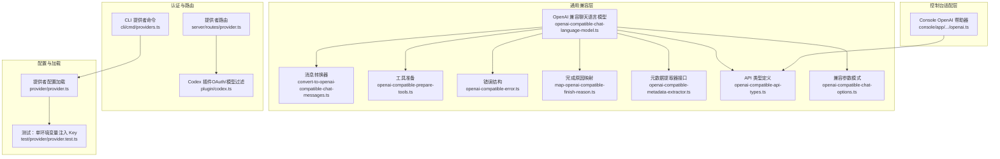
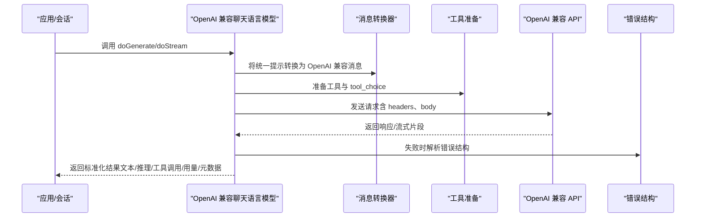
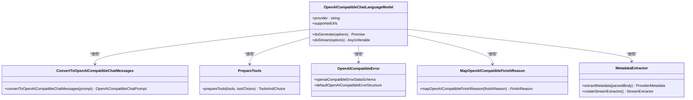
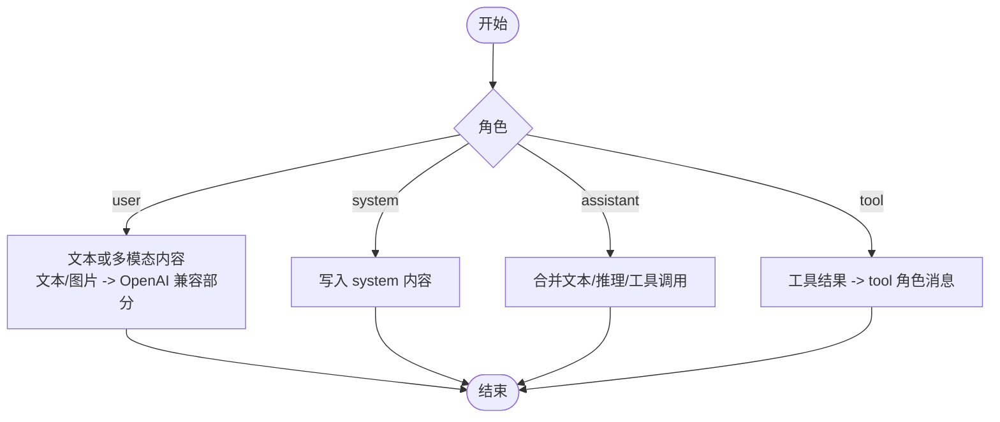
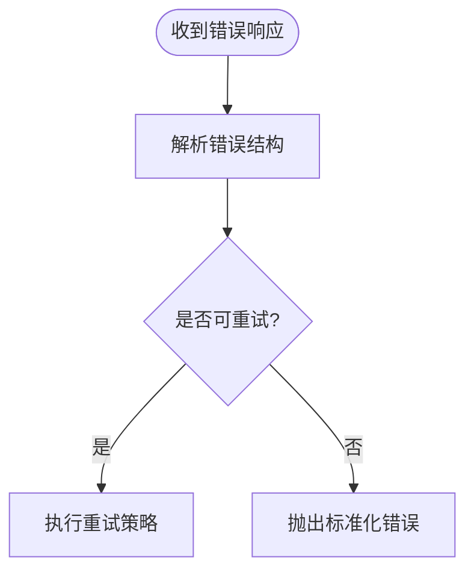
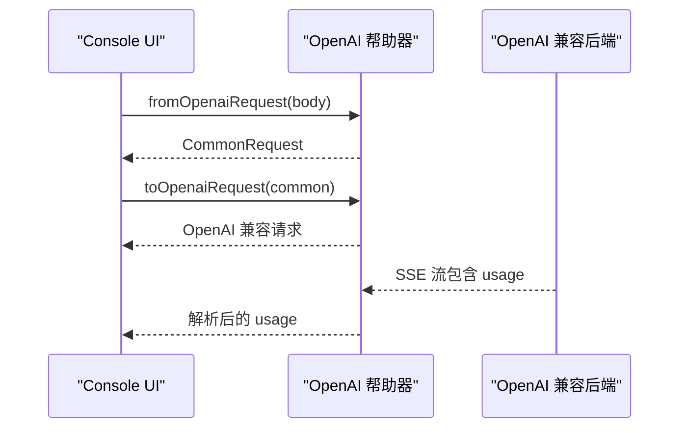
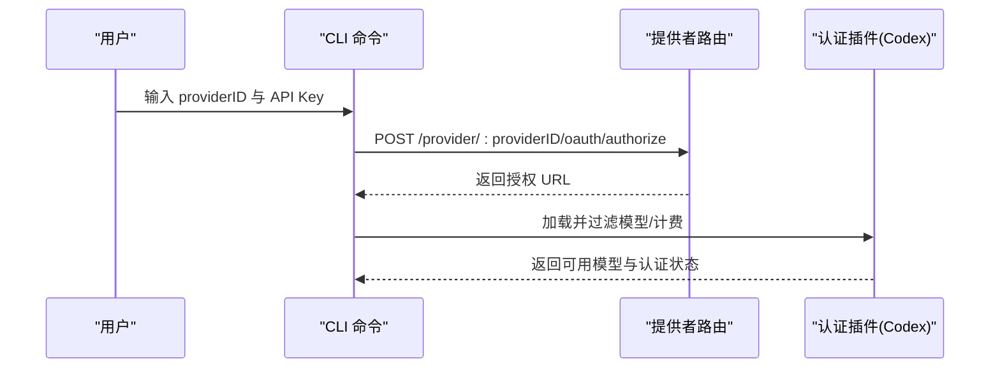
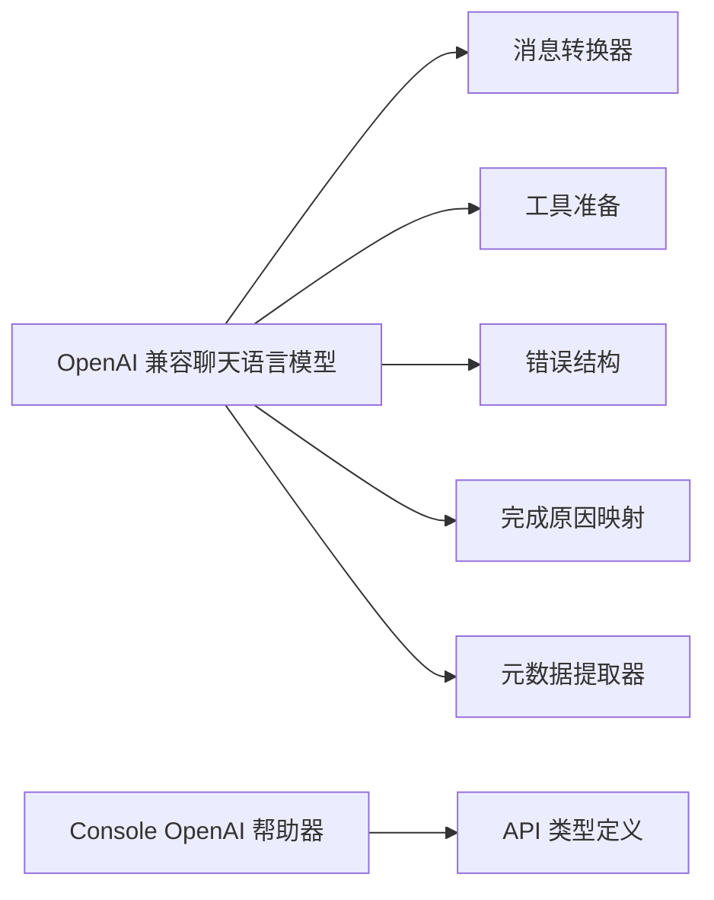

# OpenAI 集成

<cite>
**本文引用的文件**
- [packages/opencode/src/provider/sdk/copilot/chat/openai-compatible-chat-language-model.ts](file://packages/opencode/src/provider/sdk/copilot/chat/openai-compatible-chat-language-model.ts)
- [packages/opencode/src/provider/sdk/copilot/chat/convert-to-openai-compatible-chat-messages.ts](file://packages/opencode/src/provider/sdk/copilot/chat/convert-to-openai-compatible-chat-messages.ts)
- [packages/opencode/src/provider/sdk/copilot/chat/openai-compatible-chat-options.ts](file://packages/opencode/src/provider/sdk/copilot/chat/openai-compatible-chat-options.ts)
- [packages/opencode/src/provider/sdk/copilot/openai-compatible-error.ts](file://packages/opencode/src/provider/sdk/copilot/openai-compatible-error.ts)
- [packages/opencode/src/provider/sdk/copilot/chat/openai-compatible-api-types.ts](file://packages/opencode/src/provider/sdk/copilot/chat/openai-compatible-api-types.ts)
- [packages/opencode/src/provider/sdk/copilot/chat/openai-compatible-prepare-tools.ts](file://packages/opencode/src/provider/sdk/copilot/chat/openai-compatible-prepare-tools.ts)
- [packages/opencode/src/provider/sdk/copilot/chat/map-openai-compatible-finish-reason.ts](file://packages/opencode/src/provider/sdk/copilot/chat/map-openai-compatible-finish-reason.ts)
- [packages/opencode/src/provider/sdk/copilot/chat/openai-compatible-metadata-extractor.ts](file://packages/opencode/src/provider/sdk/copilot/chat/openai-compatible-metadata-extractor.ts)
- [packages/console/app/src/routes/zen/util/provider/openai.ts](file://packages/console/app/src/routes/zen/util/provider/openai.ts)
- [packages/opencode/src/plugin/codex.ts](file://packages/opencode/src/plugin/codex.ts)
- [packages/opencode/src/server/routes/provider.ts](file://packages/opencode/src/server/routes/provider.ts)
- [packages/opencode/src/cli/cmd/providers.ts](file://packages/opencode/src/cli/cmd/providers.ts)
- [packages/opencode/src/provider/provider.ts](file://packages/opencode/src/provider/provider.ts)
- [packages/opencode/test/provider/provider.test.ts](file://packages/opencode/test/provider/provider.test.ts)
- [packages/opencode/test/session/message-v2.test.ts](file://packages/opencode/test/session/message-v2.test.ts)
</cite>

## 目录
1. [简介](#简介)
2. [项目结构](#项目结构)
3. [核心组件](#核心组件)
4. [架构总览](#架构总览)
5. [组件详解](#组件详解)
6. [依赖关系分析](#依赖关系分析)
7. [性能考量](#性能考量)
8. [故障排查指南](#故障排查指南)
9. [结论](#结论)
10. [附录：配置与最佳实践](#附录配置与最佳实践)

## 简介
本文件面向希望在系统中集成 OpenAI 或 OpenAI 兼容模型的开发者，系统性阐述 OpenAI 模型提供商的集成架构与实现要点，涵盖认证机制、API 密钥管理、请求/响应转换、消息格式映射、工具调用支持、错误处理与元数据提取等。同时给出配置示例、性能优化建议以及与其他模型提供商的差异与优势，帮助团队正确选择与使用 OpenAI 服务。

## 项目结构
围绕 OpenAI 集成的关键代码分布在以下模块：
- 通用兼容层：统一的 OpenAI 兼容聊天语言模型实现、消息转换、工具准备、错误结构、完成原因映射、元数据提取器等。
- 控制台适配层：针对 Console 的 OpenAI 响应/请求格式转换与流式解析。
- 认证与路由：提供者认证方法查询、OAuth 授权入口、CLI 交互与密钥录入。
- 配置与加载：通过配置文件与环境变量自动注入 API Key，支持多环境回退策略。

**图表来源**
- [packages/opencode/src/provider/sdk/copilot/chat/openai-compatible-chat-language-model.ts:53-724](file://packages/opencode/src/provider/sdk/copilot/chat/openai-compatible-chat-language-model.ts#L53-L724)
- [packages/opencode/src/provider/sdk/copilot/chat/convert-to-openai-compatible-chat-messages.ts:13-170](file://packages/opencode/src/provider/sdk/copilot/chat/convert-to-openai-compatible-chat-messages.ts#L13-L170)
- [packages/opencode/src/provider/sdk/copilot/chat/openai-compatible-prepare-tools.ts:3-83](file://packages/opencode/src/provider/sdk/copilot/chat/openai-compatible-prepare-tools.ts#L3-L83)
- [packages/opencode/src/provider/sdk/copilot/openai-compatible-error.ts:1-28](file://packages/opencode/src/provider/sdk/copilot/openai-compatible-error.ts#L1-L28)
- [packages/opencode/src/provider/sdk/copilot/chat/map-openai-compatible-finish-reason.ts:3-19](file://packages/opencode/src/provider/sdk/copilot/chat/map-openai-compatible-finish-reason.ts#L3-L19)
- [packages/opencode/src/provider/sdk/copilot/chat/openai-compatible-metadata-extractor.ts:8-44](file://packages/opencode/src/provider/sdk/copilot/chat/openai-compatible-metadata-extractor.ts#L8-L44)
- [packages/opencode/src/provider/sdk/copilot/chat/openai-compatible-api-types.ts:5-64](file://packages/opencode/src/provider/sdk/copilot/chat/openai-compatible-api-types.ts#L5-L64)
- [packages/opencode/src/provider/sdk/copilot/chat/openai-compatible-chat-options.ts:5-26](file://packages/opencode/src/provider/sdk/copilot/chat/openai-compatible-chat-options.ts#L5-L26)
- [packages/console/app/src/routes/zen/util/provider/openai.ts:15-63](file://packages/console/app/src/routes/zen/util/provider/openai.ts#L15-L63)
- [packages/opencode/src/server/routes/provider.ts:54-95](file://packages/opencode/src/server/routes/provider.ts#L54-L95)
- [packages/opencode/src/plugin/codex.ts:353-596](file://packages/opencode/src/plugin/codex.ts#L353-L596)
- [packages/opencode/src/cli/cmd/providers.ts:425-453](file://packages/opencode/src/cli/cmd/providers.ts#L425-L453)
- [packages/opencode/src/provider/provider.ts:1021-1045](file://packages/opencode/src/provider/provider.ts#L1021-L1045)
- [packages/opencode/test/provider/provider.test.ts:1147-1186](file://packages/opencode/test/provider/provider.test.ts#L1147-L1186)

**章节来源**
- [packages/opencode/src/provider/sdk/copilot/chat/openai-compatible-chat-language-model.ts:53-724](file://packages/opencode/src/provider/sdk/copilot/chat/openai-compatible-chat-language-model.ts#L53-L724)
- [packages/console/app/src/routes/zen/util/provider/openai.ts:15-63](file://packages/console/app/src/routes/zen/util/provider/openai.ts#L15-L63)

## 核心组件
- OpenAI 兼容聊天语言模型：封装生成与流式调用，负责参数标准化、消息转换、工具调用、完成原因映射、用量统计与元数据提取。
- 消息转换器：将统一的提示格式转换为 OpenAI 兼容的消息数组，支持文本与图片输入、多模态内容、推理字段与工具调用。
- 工具准备：将通用工具描述转换为 OpenAI 兼容的函数工具，并支持 tool_choice 映射。
- 错误结构：定义统一的错误模式与消息提取逻辑，便于失败响应处理。
- 完成原因映射：将不同提供商的 finish_reason 统一到标准枚举。
- 元数据提取器：从完整或流式响应中抽取提供商特定元数据。
- Console OpenAI 帮助器：将 Console 的内部格式与 OpenAI 兼容格式互转，并解析 SSE 流中的 usage。
- 认证与路由：提供认证方式查询、OAuth 授权、CLI 密钥录入与配置加载。

**章节来源**
- [packages/opencode/src/provider/sdk/copilot/chat/openai-compatible-chat-language-model.ts:53-724](file://packages/opencode/src/provider/sdk/copilot/chat/openai-compatible-chat-language-model.ts#L53-L724)
- [packages/opencode/src/provider/sdk/copilot/chat/convert-to-openai-compatible-chat-messages.ts:13-170](file://packages/opencode/src/provider/sdk/copilot/chat/convert-to-openai-compatible-chat-messages.ts#L13-L170)
- [packages/opencode/src/provider/sdk/copilot/chat/openai-compatible-prepare-tools.ts:3-83](file://packages/opencode/src/provider/sdk/copilot/chat/openai-compatible-prepare-tools.ts#L3-L83)
- [packages/opencode/src/provider/sdk/copilot/openai-compatible-error.ts:1-28](file://packages/opencode/src/provider/sdk/copilot/openai-compatible-error.ts#L1-L28)
- [packages/opencode/src/provider/sdk/copilot/chat/map-openai-compatible-finish-reason.ts:3-19](file://packages/opencode/src/provider/sdk/copilot/chat/map-openai-compatible-finish-reason.ts#L3-L19)
- [packages/opencode/src/provider/sdk/copilot/chat/openai-compatible-metadata-extractor.ts:8-44](file://packages/opencode/src/provider/sdk/copilot/chat/openai-compatible-metadata-extractor.ts#L8-L44)
- [packages/console/app/src/routes/zen/util/provider/openai.ts:15-63](file://packages/console/app/src/routes/zen/util/provider/openai.ts#L15-L63)

## 架构总览
下图展示从应用层到 OpenAI 兼容 API 的端到端调用链路，包括认证、消息转换、工具调用、流式处理与错误处理。

**图表来源**
- [packages/opencode/src/provider/sdk/copilot/chat/openai-compatible-chat-language-model.ts:192-303](file://packages/opencode/src/provider/sdk/copilot/chat/openai-compatible-chat-language-model.ts#L192-L303)
- [packages/opencode/src/provider/sdk/copilot/chat/convert-to-openai-compatible-chat-messages.ts:13-170](file://packages/opencode/src/provider/sdk/copilot/chat/convert-to-openai-compatible-chat-messages.ts#L13-L170)
- [packages/opencode/src/provider/sdk/copilot/chat/openai-compatible-prepare-tools.ts:3-83](file://packages/opencode/src/provider/sdk/copilot/chat/openai-compatible-prepare-tools.ts#L3-L83)
- [packages/opencode/src/provider/sdk/copilot/openai-compatible-error.ts:1-28](file://packages/opencode/src/provider/sdk/copilot/openai-compatible-error.ts#L1-L28)

## 组件详解

### OpenAI 兼容聊天语言模型
该类实现了统一的语言模型接口，负责：
- 参数标准化：温度、top_p、频率/存在惩罚、停止序列、种子、响应格式（含 JSON Schema 结构化输出）、推理参数等。
- 消息转换：将统一提示转换为 OpenAI 兼容消息数组。
- 工具调用：准备函数工具与 tool_choice，支持流式增量拼接参数并最终发出工具调用事件。
- 流式处理：基于 EventSource 解析增量片段，按类型分发 text/reasoning/tool-input/start/end 等事件。
- 用量统计：解析 prompt/completion/reasoning/token 细项，构建统一用量对象。
- 元数据提取：从完整/流式响应中抽取提供商特定元数据。

**图表来源**
- [packages/opencode/src/provider/sdk/copilot/chat/openai-compatible-chat-language-model.ts:53-724](file://packages/opencode/src/provider/sdk/copilot/chat/openai-compatible-chat-language-model.ts#L53-L724)
- [packages/opencode/src/provider/sdk/copilot/chat/convert-to-openai-compatible-chat-messages.ts:13-170](file://packages/opencode/src/provider/sdk/copilot/chat/convert-to-openai-compatible-chat-messages.ts#L13-L170)
- [packages/opencode/src/provider/sdk/copilot/chat/openai-compatible-prepare-tools.ts:3-83](file://packages/opencode/src/provider/sdk/copilot/chat/openai-compatible-prepare-tools.ts#L3-L83)
- [packages/opencode/src/provider/sdk/copilot/openai-compatible-error.ts:1-28](file://packages/opencode/src/provider/sdk/copilot/openai-compatible-error.ts#L1-L28)
- [packages/opencode/src/provider/sdk/copilot/chat/map-openai-compatible-finish-reason.ts:3-19](file://packages/opencode/src/provider/sdk/copilot/chat/map-openai-compatible-finish-reason.ts#L3-L19)
- [packages/opencode/src/provider/sdk/copilot/chat/openai-compatible-metadata-extractor.ts:8-44](file://packages/opencode/src/provider/sdk/copilot/chat/openai-compatible-metadata-extractor.ts#L8-L44)

**章节来源**
- [packages/opencode/src/provider/sdk/copilot/chat/openai-compatible-chat-language-model.ts:53-724](file://packages/opencode/src/provider/sdk/copilot/chat/openai-compatible-chat-language-model.ts#L53-L724)

### 消息格式转换与工具调用
- 消息转换：支持 system/user（文本/图片）、assistant（文本/推理/工具调用）、tool（工具结果）角色；将多模态内容转换为 OpenAI 兼容格式；保留提供商特定元数据。
- 工具准备：将通用工具描述转换为函数工具；支持 tool_choice 的多种模式映射；对不支持的工具类型发出警告。

**图表来源**
- [packages/opencode/src/provider/sdk/copilot/chat/convert-to-openai-compatible-chat-messages.ts:13-170](file://packages/opencode/src/provider/sdk/copilot/chat/convert-to-openai-compatible-chat-messages.ts#L13-L170)
- [packages/opencode/src/provider/sdk/copilot/chat/openai-compatible-prepare-tools.ts:3-83](file://packages/opencode/src/provider/sdk/copilot/chat/openai-compatible-prepare-tools.ts#L3-L83)

**章节来源**
- [packages/opencode/src/provider/sdk/copilot/chat/convert-to-openai-compatible-chat-messages.ts:13-170](file://packages/opencode/src/provider/sdk/copilot/chat/convert-to-openai-compatible-chat-messages.ts#L13-L170)
- [packages/opencode/src/provider/sdk/copilot/chat/openai-compatible-prepare-tools.ts:3-83](file://packages/opencode/src/provider/sdk/copilot/chat/openai-compatible-prepare-tools.ts#L3-L83)

### 错误处理与完成原因映射
- 错误结构：统一解析 error.message、type、param、code 等字段，支持宽松模式以兼容不同提供商的差异。
- 完成原因映射：将 stop、length、content_filter、tool_calls 等映射为统一枚举，便于上层一致处理。

**图表来源**
- [packages/opencode/src/provider/sdk/copilot/openai-compatible-error.ts:1-28](file://packages/opencode/src/provider/sdk/copilot/openai-compatible-error.ts#L1-L28)
- [packages/opencode/src/provider/sdk/copilot/chat/map-openai-compatible-finish-reason.ts:3-19](file://packages/opencode/src/provider/sdk/copilot/chat/map-openai-compatible-finish-reason.ts#L3-L19)

**章节来源**
- [packages/opencode/src/provider/sdk/copilot/openai-compatible-error.ts:1-28](file://packages/opencode/src/provider/sdk/copilot/openai-compatible-error.ts#L1-L28)
- [packages/opencode/src/provider/sdk/copilot/chat/map-openai-compatible-finish-reason.ts:3-19](file://packages/opencode/src/provider/sdk/copilot/chat/map-openai-compatible-finish-reason.ts#L3-L19)

### Console OpenAI 帮助器
- 请求/响应转换：将 Console 内部格式与 OpenAI 兼容格式互转，支持工具调用、停止序列、消息角色映射。
- 流式解析：基于 SSE 分隔符解析 usage，标准化用量字段。
- 头部与安全标识：自动添加 Bearer Token 与工作区安全标识。

**图表来源**
- [packages/console/app/src/routes/zen/util/provider/openai.ts:15-63](file://packages/console/app/src/routes/zen/util/provider/openai.ts#L15-L63)
- [packages/console/app/src/routes/zen/util/provider/openai.ts:65-200](file://packages/console/app/src/routes/zen/util/provider/openai.ts#L65-L200)
- [packages/console/app/src/routes/zen/util/provider/openai.ts:202-330](file://packages/console/app/src/routes/zen/util/provider/openai.ts#L202-L330)
- [packages/console/app/src/routes/zen/util/provider/openai.ts:332-475](file://packages/console/app/src/routes/zen/util/provider/openai.ts#L332-L475)

**章节来源**
- [packages/console/app/src/routes/zen/util/provider/openai.ts:15-63](file://packages/console/app/src/routes/zen/util/provider/openai.ts#L15-L63)
- [packages/console/app/src/routes/zen/util/provider/openai.ts:65-200](file://packages/console/app/src/routes/zen/util/provider/openai.ts#L65-L200)
- [packages/console/app/src/routes/zen/util/provider/openai.ts:202-330](file://packages/console/app/src/routes/zen/util/provider/openai.ts#L202-L330)
- [packages/console/app/src/routes/zen/util/provider/openai.ts:332-475](file://packages/console/app/src/routes/zen/util/provider/openai.ts#L332-L475)

### 认证机制与 API 密钥管理
- OAuth 授权：提供统一的 OAuth 授权入口，返回授权 URL 与方法。
- API Key 管理：CLI 支持交互式输入密钥并保存；支持单环境变量自动注入与多环境回退策略。
- Codex 插件：OAuth 场景下过滤允许的 Codex 模型并调整计费信息。

**图表来源**
- [packages/opencode/src/server/routes/provider.ts:54-95](file://packages/opencode/src/server/routes/provider.ts#L54-L95)
- [packages/opencode/src/cli/cmd/providers.ts:425-453](file://packages/opencode/src/cli/cmd/providers.ts#L425-L453)
- [packages/opencode/src/plugin/codex.ts:353-596](file://packages/opencode/src/plugin/codex.ts#L353-L596)

**章节来源**
- [packages/opencode/src/server/routes/provider.ts:54-95](file://packages/opencode/src/server/routes/provider.ts#L54-L95)
- [packages/opencode/src/cli/cmd/providers.ts:425-453](file://packages/opencode/src/cli/cmd/providers.ts#L425-L453)
- [packages/opencode/src/plugin/codex.ts:353-596](file://packages/opencode/src/plugin/codex.ts#L353-L596)

## 依赖关系分析
- 组件内聚：OpenAI 兼容聊天语言模型高度内聚于消息转换、工具准备、错误处理与元数据提取。
- 组件耦合：模型依赖多个工具模块；Console 帮助器独立于模型层，仅依赖 API 类型定义。
- 外部依赖：统一使用 @ai-sdk/provider 与 @ai-sdk/provider-utils 的标准接口与工具函数。

**图表来源**
- [packages/opencode/src/provider/sdk/copilot/chat/openai-compatible-chat-language-model.ts:53-724](file://packages/opencode/src/provider/sdk/copilot/chat/openai-compatible-chat-language-model.ts#L53-L724)
- [packages/opencode/src/provider/sdk/copilot/chat/convert-to-openai-compatible-chat-messages.ts:13-170](file://packages/opencode/src/provider/sdk/copilot/chat/convert-to-openai-compatible-chat-messages.ts#L13-L170)
- [packages/opencode/src/provider/sdk/copilot/chat/openai-compatible-prepare-tools.ts:3-83](file://packages/opencode/src/provider/sdk/copilot/chat/openai-compatible-prepare-tools.ts#L3-L83)
- [packages/opencode/src/provider/sdk/copilot/openai-compatible-error.ts:1-28](file://packages/opencode/src/provider/sdk/copilot/openai-compatible-error.ts#L1-L28)
- [packages/opencode/src/provider/sdk/copilot/chat/map-openai-compatible-finish-reason.ts:3-19](file://packages/opencode/src/provider/sdk/copilot/chat/map-openai-compatible-finish-reason.ts#L3-L19)
- [packages/opencode/src/provider/sdk/copilot/chat/openai-compatible-metadata-extractor.ts:8-44](file://packages/opencode/src/provider/sdk/copilot/chat/openai-compatible-metadata-extractor.ts#L8-L44)
- [packages/console/app/src/routes/zen/util/provider/openai.ts:15-63](file://packages/console/app/src/routes/zen/util/provider/openai.ts#L15-L63)

**章节来源**
- [packages/opencode/src/provider/sdk/copilot/chat/openai-compatible-chat-language-model.ts:53-724](file://packages/opencode/src/provider/sdk/copilot/chat/openai-compatible-chat-language-model.ts#L53-L724)

## 性能考量
- 流式传输：启用 include_usage 可在流式响应中携带用量统计，减少额外请求。
- 工具调用增量拼接：在流式场景下先发送工具调用起始事件，再增量拼接参数，最后一次性发出工具调用事件，降低延迟。
- 用量归因：区分推理 token、缓存命中与预测 token，便于成本优化与容量规划。
- 兼容参数：合理设置 temperature/top_p/stop 等参数，平衡质量与吞吐。

[本节为通用指导，无需列出具体文件来源]

## 故障排查指南
- 常见错误码：测试覆盖了配额不足、未包含使用范围、无效提示等错误码的序列化与错误包装。
- 错误重试：根据错误结构判断是否可重试，结合指数退避策略提升稳定性。
- 上下文溢出：当输入超过模型上下文窗口时，序列化为特定错误类型以便前端提示。

**章节来源**
- [packages/opencode/test/session/message-v2.test.ts:812-847](file://packages/opencode/test/session/message-v2.test.ts#L812-L847)
- [packages/opencode/src/provider/sdk/copilot/openai-compatible-error.ts:1-28](file://packages/opencode/src/provider/sdk/copilot/openai-compatible-error.ts#L1-L28)

## 结论
本集成方案通过“统一模型接口 + 兼容层 + 控制台适配”的分层设计，既保证了与 OpenAI 生态的高度兼容，又提供了灵活的工具调用、流式处理与元数据提取能力。配合完善的认证与配置机制，能够快速落地到生产环境并具备良好的可维护性与扩展性。

[本节为总结性内容，无需列出具体文件来源]

## 附录：配置与最佳实践

### 环境变量与密钥注入
- 单环境变量注入：当提供者仅依赖单一环境变量时，系统可自动将其作为 API Key 注入。
- 多环境变量回退：支持优先使用主变量，若缺失则回退到备用变量，确保部署灵活性。

**章节来源**
- [packages/opencode/test/provider/provider.test.ts:1147-1186](file://packages/opencode/test/provider/provider.test.ts#L1147-L1186)
- [packages/opencode/test/provider/provider.test.ts:1423-1461](file://packages/opencode/test/provider/provider.test.ts#L1423-L1461)
- [packages/opencode/src/provider/provider.ts:1021-1045](file://packages/opencode/src/provider/provider.ts#L1021-L1045)

### 模型参数配置
- 温度、top_p、频率/存在惩罚、停止序列、种子、响应格式（JSON Schema 结构化输出）、推理参数等均在兼容层进行标准化映射。
- 工具调用：支持 auto/none/required 与指定工具名的 tool_choice；对不支持的工具类型发出警告。

**章节来源**
- [packages/opencode/src/provider/sdk/copilot/chat/openai-compatible-chat-language-model.ts:87-190](file://packages/opencode/src/provider/sdk/copilot/chat/openai-compatible-chat-language-model.ts#L87-L190)
- [packages/opencode/src/provider/sdk/copilot/chat/openai-compatible-chat-options.ts:5-26](file://packages/opencode/src/provider/sdk/copilot/chat/openai-compatible-chat-options.ts#L5-L26)
- [packages/opencode/src/provider/sdk/copilot/chat/openai-compatible-prepare-tools.ts:3-83](file://packages/opencode/src/provider/sdk/copilot/chat/openai-compatible-prepare-tools.ts#L3-L83)

### 认证与 OAuth
- OAuth 授权入口：通过提供者路由获取授权 URL，支持多提供商统一入口。
- CLI 交互：交互式输入 API Key 并保存，简化本地开发体验。
- Codex 过滤：OAuth 下仅暴露允许的 Codex 模型并调整计费信息。

**章节来源**
- [packages/opencode/src/server/routes/provider.ts:54-95](file://packages/opencode/src/server/routes/provider.ts#L54-L95)
- [packages/opencode/src/cli/cmd/providers.ts:425-453](file://packages/opencode/src/cli/cmd/providers.ts#L425-L453)
- [packages/opencode/src/plugin/codex.ts:353-596](file://packages/opencode/src/plugin/codex.ts#L353-L596)

### 与其他提供商的差异与优势
- 统一抽象：通过 @ai-sdk/provider 的统一接口，屏蔽不同提供商的差异，便于横向切换与迁移。
- 流式增强：在流式场景下提供更细粒度的事件拆分（文本/推理/工具输入），提升用户体验与可观测性。
- 元数据提取：支持从响应中抽取提供商特定元数据，便于监控与审计。
- 错误一致性：统一错误结构与可重试判定，降低异常处理复杂度。

[本节为概念性对比，无需列出具体文件来源]