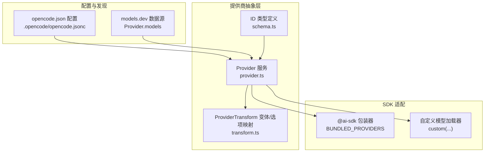
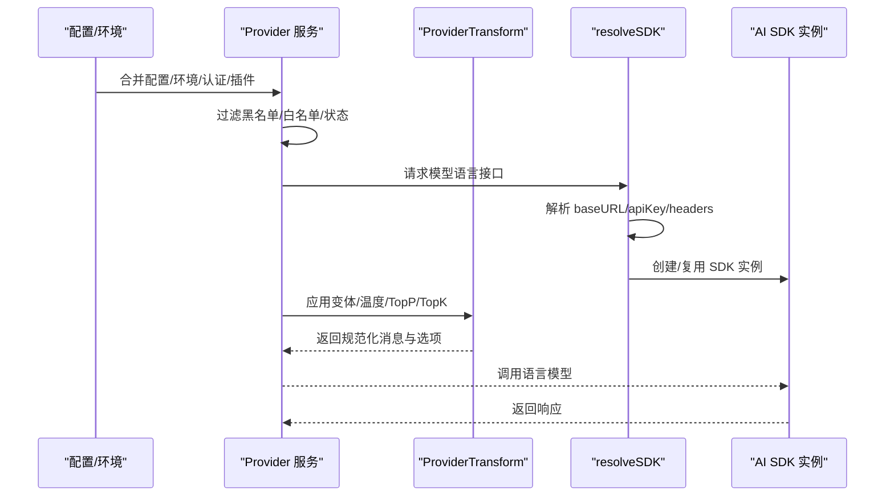
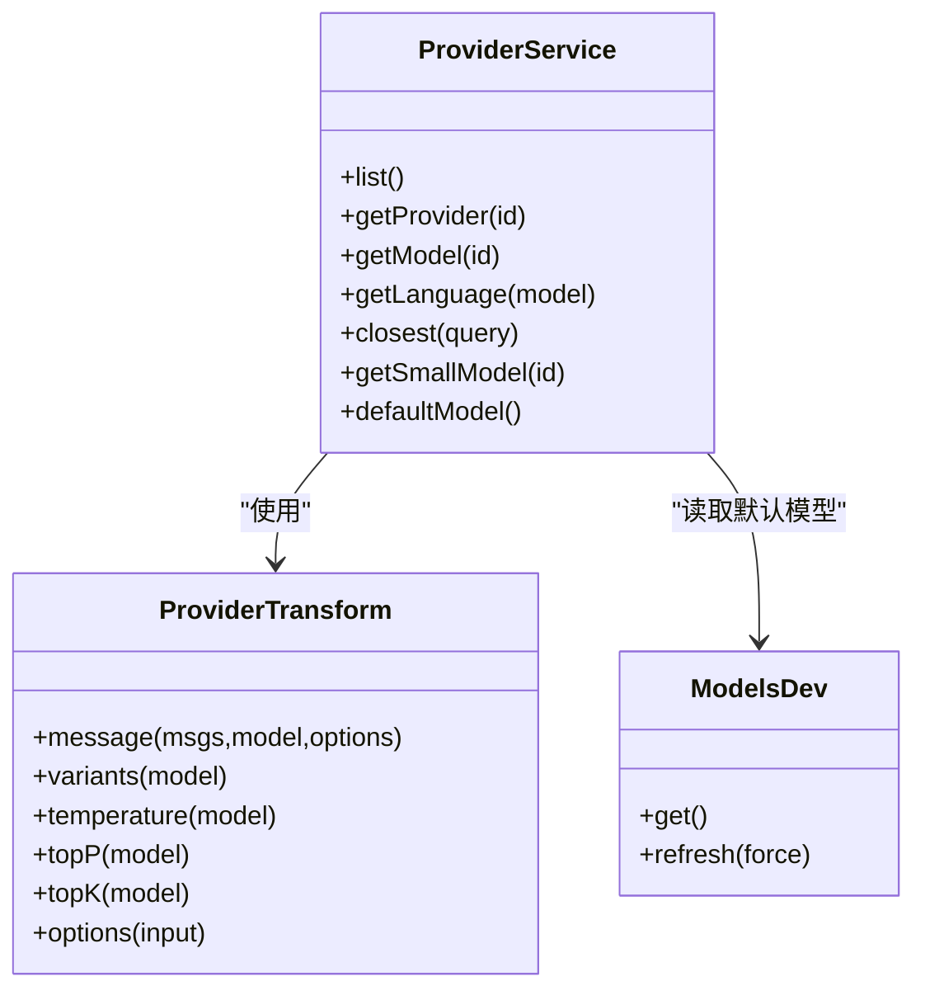
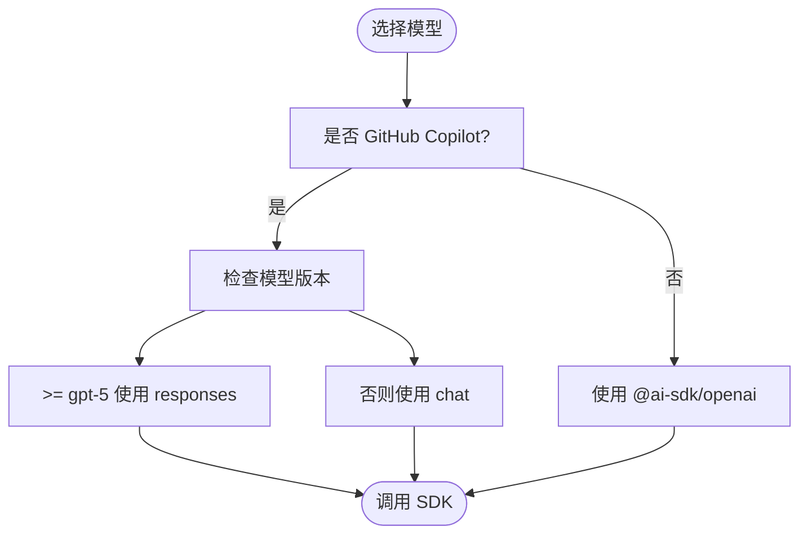
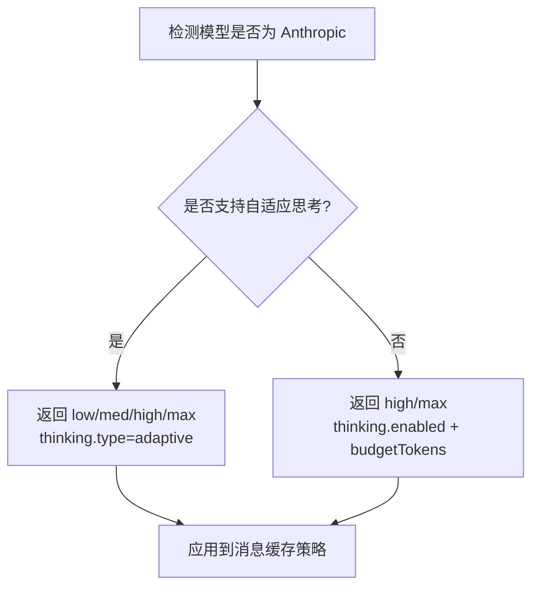
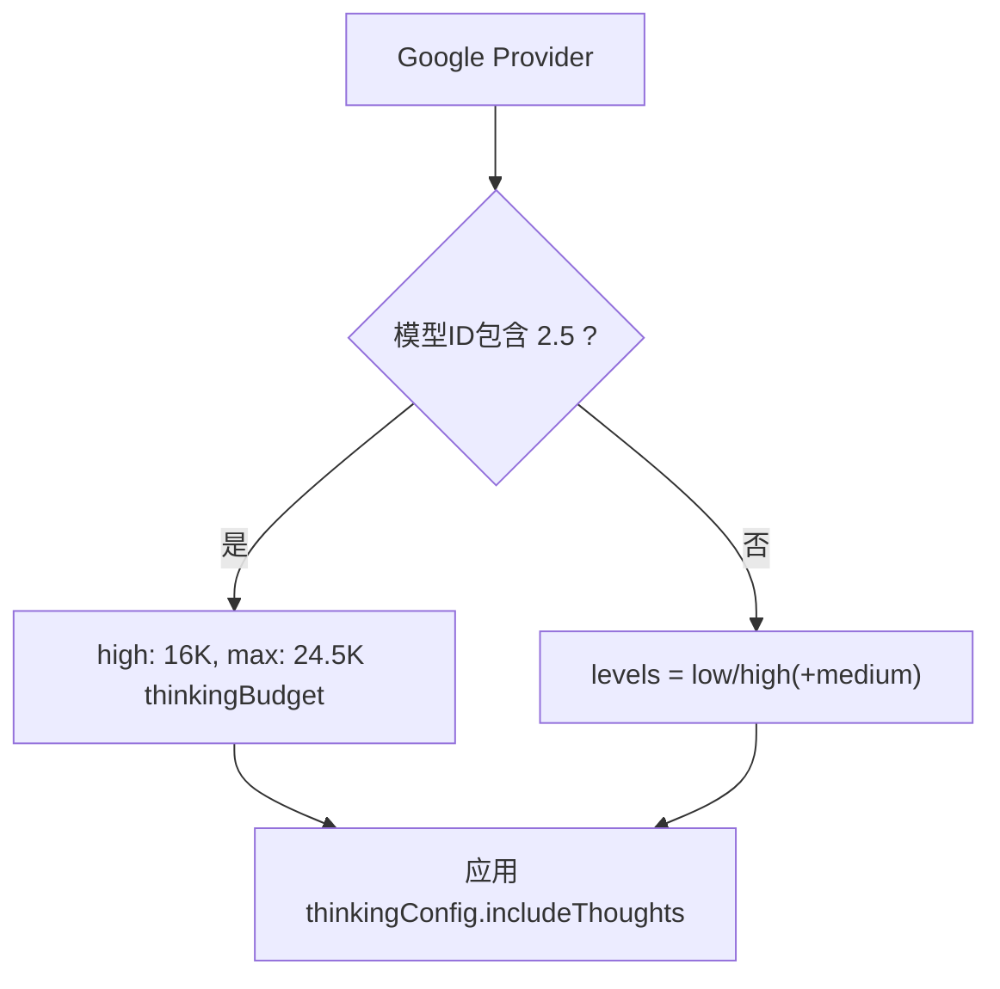
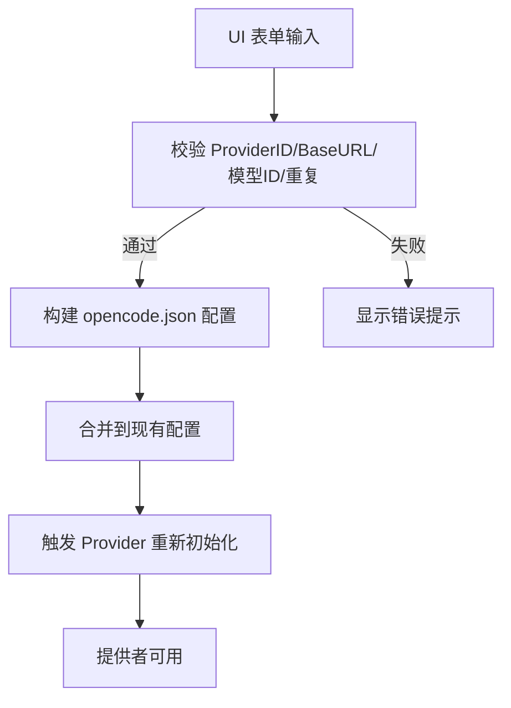
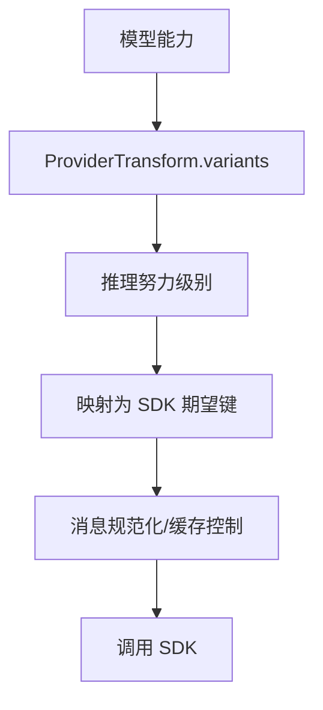
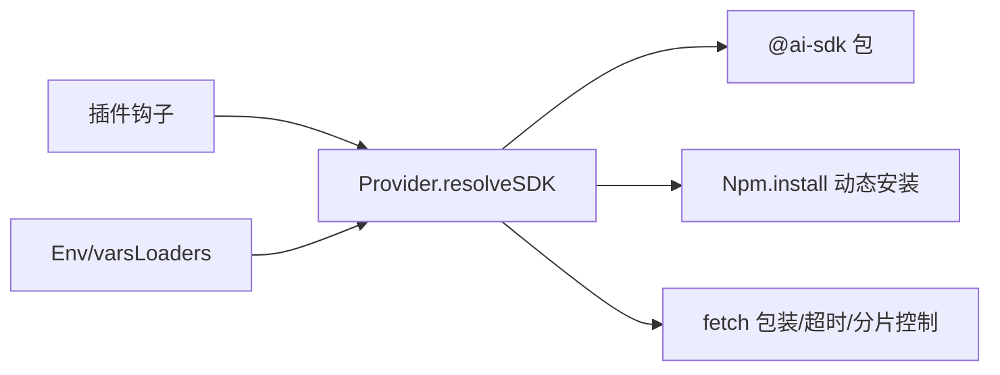

# 多模型提供商支持

<cite>
**本文档引用的文件**
- [provider.ts](file://packages/opencode/src/provider/provider.ts)
- [transform.ts](file://packages/opencode/src/provider/transform.ts)
- [schema.ts](file://packages/opencode/src/provider/schema.ts)
- [models.ts](file://packages/opencode/src/provider/models.ts)
- [openai-compatible-chat-options.ts](file://packages/opencode/src/provider/sdk/copilot/chat/openai-compatible-chat-options.ts)
- [opencode.jsonc](file://.opencode/opencode.jsonc)
- [provider.test.ts](file://packages/opencode/test/provider/provider.test.ts)
- [transform.test.ts](file://packages/opencode/test/provider/transform.test.ts)
- [dialog-custom-provider-form.ts](file://packages/app/src/components/dialog-custom-provider-form.ts)
- [settings-providers.spec.ts](file://packages/app/e2e/settings/settings-providers.spec.ts)
</cite>

## 目录
1. [简介](#简介)
2. [项目结构](#项目结构)
3. [核心组件](#核心组件)
4. [架构总览](#架构总览)
5. [详细组件分析](#详细组件分析)
6. [依赖关系分析](#依赖关系分析)
7. [性能考量](#性能考量)
8. [故障排除指南](#故障排除指南)
9. [结论](#结论)
10. [附录](#附录)

## 简介
本文件系统性阐述 OpenCode 的多模型提供商支持能力，覆盖 OpenAI、Anthropic、Google Vertex、Azure、Bedrock、Mistral、Cohere、Perplexity、Vercel、OpenRouter、GitHub Copilot、Groq、Cerebras、TogetherAI、XAI、DeepInfra、SAP AI Core、GitLab、Cloudflare Workers AI、Cloudflare AI Gateway、Venice 等主流与兼容型 AI 提供商的集成方式与配置方法。文档重点说明：
- 抽象层设计与统一接口实现
- 如何添加新模型提供商（含自定义提供商）
- 不同模型的特点、推理能力、性能差异与价格对比
- 配置示例与最佳实践（API 密钥管理、模型切换、性能优化）

## 项目结构
OpenCode 将“模型提供商”抽象为统一的服务层，通过配置文件与插件机制动态加载与组合多个提供商，最终以 AI SDK 的语言模型接口对外提供服务。

**图表来源**
- [provider.ts:127-150](file://packages/opencode/src/provider/provider.ts#L127-L150)
- [transform.ts:24-47](file://packages/opencode/src/provider/transform.ts#L24-L47)
- [models.ts:16-93](file://packages/opencode/src/provider/models.ts#L16-L93)
- [schema.ts:6-27](file://packages/opencode/src/provider/schema.ts#L6-L27)

**章节来源**
- [provider.ts:127-150](file://packages/opencode/src/provider/provider.ts#L127-L150)
- [models.ts:16-93](file://packages/opencode/src/provider/models.ts#L16-L93)
- [schema.ts:6-27](file://packages/opencode/src/provider/schema.ts#L6-L27)

## 核心组件
- Provider 服务：负责聚合配置、环境变量、认证信息与插件扩展，构建可用的提供商集合，并解析 SDK、模型与变体。
- ProviderTransform：将模型能力映射为推理变体（如 Anthropic 的 thinking、Google Gemini 的 thinkingConfig、OpenRouter 的 reasoning），并处理消息规范化、缓存控制、参数重映射等。
- ModelsDev：从 models.dev 获取模型清单快照或实时数据，作为默认数据库。
- Schema：对 ProviderID、ModelID 进行类型安全的品牌化封装。
- SDK 适配：内置打包的 @ai-sdk 提供商创建函数，以及按提供商定制的模型加载器与环境变量注入。

**章节来源**
- [provider.ts:895-901](file://packages/opencode/src/provider/provider.ts#L895-L901)
- [transform.ts:20-47](file://packages/opencode/src/provider/transform.ts#L20-L47)
- [models.ts:16-93](file://packages/opencode/src/provider/models.ts#L16-L93)
- [schema.ts:6-27](file://packages/opencode/src/provider/schema.ts#L6-L27)

## 架构总览
下图展示从配置到 SDK 调用的关键流程：配置合并 → 认证与环境变量注入 → SDK 解析与缓存 → 模型实例化 → 推理变体应用 → 请求发送。

**图表来源**
- [provider.ts:1302-1437](file://packages/opencode/src/provider/provider.ts#L1302-L1437)
- [transform.ts:278-322](file://packages/opencode/src/provider/transform.ts#L278-L322)

**章节来源**
- [provider.ts:1302-1437](file://packages/opencode/src/provider/provider.ts#L1302-L1437)
- [transform.ts:278-322](file://packages/opencode/src/provider/transform.ts#L278-L322)

## 详细组件分析

### 抽象层与统一接口
- 统一接口：Provider.list/getProvider/getModel/getLanguage/closest/getSmallModel/defaultModel
- 状态管理：使用 Effect/InstanceState 维护 providers、sdk 缓存、模型实例缓存
- 模型来源：默认来自 models.dev，可被配置与插件扩展覆盖
- 变体生成：根据模型能力与提供商 SDK，自动推导推理变体（如 high/max、thinkingConfig、reasoningEffort）

**图表来源**
- [provider.ts:874-885](file://packages/opencode/src/provider/provider.ts#L874-L885)
- [transform.ts:20-47](file://packages/opencode/src/provider/transform.ts#L20-L47)
- [models.ts:133-136](file://packages/opencode/src/provider/models.ts#L133-L136)

**章节来源**
- [provider.ts:874-885](file://packages/opencode/src/provider/provider.ts#L874-L885)
- [transform.ts:364-744](file://packages/opencode/src/provider/transform.ts#L364-L744)
- [models.ts:133-136](file://packages/opencode/src/provider/models.ts#L133-L136)

### OpenAI 集成与 GitHub Copilot 兼容
- 使用 @ai-sdk/openai 或 @ai-sdk/openai-compatible
- 支持 responses/chat 两种模式（GitHub Copilot 会根据模型版本选择 responses 或 chat）
- 支持 includeUsage、store=false 等选项；对 Azure 场景进行特殊处理（保留 store=true 的情况）

**图表来源**
- [provider.ts:63-67](file://packages/opencode/src/provider/provider.ts#L63-L67)
- [provider.ts:222-230](file://packages/opencode/src/provider/provider.ts#L222-L230)
- [openai-compatible-chat-options.ts:1-28](file://packages/opencode/src/provider/sdk/copilot/chat/openai-compatible-chat-options.ts#L1-L28)

**章节来源**
- [provider.ts:63-67](file://packages/opencode/src/provider/provider.ts#L63-L67)
- [provider.ts:222-230](file://packages/opencode/src/provider/provider.ts#L222-L230)
- [openai-compatible-chat-options.ts:1-28](file://packages/opencode/src/provider/sdk/copilot/chat/openai-compatible-chat-options.ts#L1-L28)

### Anthropic 集成与推理变体
- 使用 @ai-sdk/anthropic 或 @ai-sdk/google-vertex/anthropic
- 支持自适应思考（adaptive thinking）与固定预算（budgetTokens）
- 对 Claude Sonnet 4.6/Opus 4.6 等模型启用 adaptive thinking
- 对其他 Anthropic 模型提供 high/max 两种变体

**图表来源**
- [transform.ts:551-583](file://packages/opencode/src/provider/transform.ts#L551-L583)
- [transform.test.ts:2700-2751](file://packages/opencode/test/provider/transform.test.ts#L2700-L2751)

**章节来源**
- [transform.ts:551-583](file://packages/opencode/src/provider/transform.ts#L551-L583)
- [transform.test.ts:2700-2751](file://packages/opencode/test/provider/transform.test.ts#L2700-L2751)

### Google Vertex 与 Google Generative AI
- 使用 @ai-sdk/google-vertex 或 @ai-sdk/google
- 支持 thinkingConfig（includeThoughts/thinkingLevel/thinkingBudget）
- Gemini 2.5 使用高预算（16K/24.5K），Gemini 3.1+ 支持 medium 级别
- Vertex Anthropic 通过 google-vertex/anthropic 提供

**图表来源**
- [transform.ts:631-666](file://packages/opencode/src/provider/transform.ts#L631-L666)
- [provider.test.ts:2188-2233](file://packages/opencode/test/provider/provider.test.ts#L2188-L2233)

**章节来源**
- [transform.ts:631-666](file://packages/opencode/src/provider/transform.ts#L631-L666)
- [provider.test.ts:2188-2233](file://packages/opencode/test/provider/provider.test.ts#L2188-L2233)

### Azure、Amazon Bedrock、OpenRouter、Vercel、Cerebras、Groq、Mistral、Cohere、Perplexity、XAI、TogetherAI、DeepInfra、SAP AI Core、GitLab、Cloudflare、Venice
- Azure：支持 responses/chat 切换与资源名解析
- Bedrock：支持跨区域前缀与推理配置（reasoningConfig）
- OpenRouter：设置 HTTP-Referer/X-Title，支持 reasoning.effort
- Vercel：设置 http-referer/x-title
- Cerebras：设置第三方集成头
- Groq：支持 reasoningEffort
- Mistral/Cohere：当前不暴露推理变体
- Perplexity：当前不暴露推理变体
- XAI/TogetherAI/DeepInfra：兼容 OpenAI-Compatible
- SAP AI Core：注入 AICORE_SERVICE_KEY 等环境变量
- GitLab：工作流模型发现与代理平台模型
- Cloudflare Workers AI/AI Gateway：账户级与网关级鉴权
- Venice：统一格式模型 ID（provider/model）

**章节来源**
- [provider.ts:231-272](file://packages/opencode/src/provider/provider.ts#L231-L272)
- [provider.ts:273-418](file://packages/opencode/src/provider/provider.ts#L273-L418)
- [provider.ts:419-438](file://packages/opencode/src/provider/provider.ts#L419-L438)
- [provider.ts:429-438](file://packages/opencode/src/provider/provider.ts#L429-L438)
- [provider.ts:490-527](file://packages/opencode/src/provider/provider.ts#L490-L527)
- [provider.ts:528-549](file://packages/opencode/src/provider/provider.ts#L528-L549)
- [provider.ts:674-703](file://packages/opencode/src/provider/provider.ts#L674-L703)
- [provider.ts:704-765](file://packages/opencode/src/provider/provider.ts#L704-L765)
- [provider.ts:504-527](file://packages/opencode/src/provider/provider.ts#L504-L527)
- [provider.ts:538-673](file://packages/opencode/src/provider/provider.ts#L538-L673)

### 自定义提供商与配置示例
- 支持在配置中声明自定义提供商（npm、name、options、models）
- 支持通过环境变量注入（{env:VAR}）、baseURL 占位符、headers 注入
- UI 表单校验：ProviderID 必填且为小写 URL 安全字符；Base URL 必须以 http(s) 开头；模型 ID 去空格、去重、必填

**图表来源**
- [dialog-custom-provider-form.ts:66-100](file://packages/app/src/components/dialog-custom-provider-form.ts#L66-L100)
- [settings-providers.spec.ts:52-112](file://packages/app/e2e/settings/settings-providers.spec.ts#L52-L112)

**章节来源**
- [dialog-custom-provider-form.ts:66-100](file://packages/app/src/components/dialog-custom-provider-form.ts#L66-L100)
- [settings-providers.spec.ts:52-112](file://packages/app/e2e/settings/settings-providers.spec.ts#L52-L112)
- [opencode.jsonc:1-19](file://.opencode/opencode.jsonc#L1-L19)

### 推理变体与参数映射
- 温度/TopP/TopK：针对不同模型族设定默认值
- 变体映射：根据提供商 SDK 与模型 ID，生成推理变体（如 reasoningEffort、thinkingConfig、reasoning）
- 消息规范化：过滤空内容、清理工具调用 ID、处理交错推理字段

**图表来源**
- [transform.ts:364-744](file://packages/opencode/src/provider/transform.ts#L364-L744)
- [transform.ts:278-322](file://packages/opencode/src/provider/transform.ts#L278-L322)

**章节来源**
- [transform.ts:364-744](file://packages/opencode/src/provider/transform.ts#L364-L744)
- [transform.ts:278-322](file://packages/opencode/src/provider/transform.ts#L278-L322)

## 依赖关系分析
- 内置提供商映射：BUNDLED_PROVIDERS 将 npm 包名映射到对应的 create 函数
- SDK 解析：优先使用已安装包，否则动态安装；支持 fetch 包装与超时控制
- 插件扩展：通过 plugin.auth/plugin.provider 钩子注入认证与模型扩展
- 环境变量注入：varsLoaders 用于将运行时变量注入 baseURL 占位符

**图表来源**
- [provider.ts:1401-1437](file://packages/opencode/src/provider/provider.ts#L1401-L1437)
- [provider.ts:1302-1437](file://packages/opencode/src/provider/provider.ts#L1302-L1437)

**章节来源**
- [provider.ts:1401-1437](file://packages/opencode/src/provider/provider.ts#L1401-L1437)
- [provider.ts:1302-1437](file://packages/opencode/src/provider/provider.ts#L1302-L1437)

## 性能考量
- SDK 缓存：基于 providerID/npm/options 的哈希缓存 SDK 实例与模型实例，避免重复初始化
- SSE 分片超时：可配置 chunkTimeout，防止长时间无数据推送导致阻塞
- 默认禁用存储：OpenAI 及其兼容 SDK 默认关闭 store，减少额外开销
- 思考预算：Anthropic/Google Vertex 等提供思考预算上限，平衡质量与成本
- 小模型优先：getSmallModel 提供常见小模型优先级列表，便于快速测试与低延迟场景

**章节来源**
- [provider.ts:1347-1353](file://packages/opencode/src/provider/provider.ts#L1347-L1353)
- [provider.ts:1358-1399](file://packages/opencode/src/provider/provider.ts#L1358-L1399)
- [transform.ts:750-788](file://packages/opencode/src/provider/transform.ts#L750-L788)
- [provider.ts:1516-1570](file://packages/opencode/src/provider/provider.ts#L1516-L1570)

## 故障排除指南
- 模型不存在：当配置或模糊匹配不到模型时抛出 ModelNotFoundError，建议检查 ProviderID 与模型 ID 是否正确
- SDK 初始化失败：InitError 包含 providerID，检查 npm 包是否正确安装、baseURL/apiKey/headers 是否有效
- 认证错误：AuthError/CreditsError/MonthlyLimitError/UserLimitError 等，需检查密钥、配额与订阅状态
- 使用限制：FreeUsageLimitError/SubscriptionUsageLimitError 返回 429 并携带 retry-after
- GitLab 发现失败：日志记录警告并跳过，检查 instanceUrl、token 与 featureFlags

**章节来源**
- [provider.ts:1443-1459](file://packages/opencode/src/provider/provider.ts#L1443-L1459)
- [provider.ts:1434-1437](file://packages/opencode/src/provider/provider.ts#L1434-L1437)
- [provider.ts:349-392](file://packages/opencode/src/provider/provider.ts#L349-L392)
- [provider.ts:1204-1217](file://packages/opencode/src/provider/provider.ts#L1204-L1217)

## 结论
OpenCode 的多模型提供商支持通过统一抽象层与 AI SDK 适配，实现了对主流与兼容型提供商的一致接入。借助配置、插件与变体映射机制，用户可以灵活地选择与切换模型，同时获得推理能力、性能与成本的平衡。新增提供商只需遵循 npm 包规范与 ProviderTransform 映射规则，即可快速集成。

## 附录

### 配置示例与最佳实践
- 在 opencode.json 中声明自定义提供商，设置 npm、name、options（baseURL、apiKey、headers）、models（名称与上下文/输出限制）
- 使用 {env:VAR} 引用环境变量，避免硬编码密钥
- 通过 enabled_providers/disabled_providers/blacklist/whitelist 控制可用模型
- 使用 small_model/defaultModel 与最近使用记录优化初始体验

**章节来源**
- [opencode.jsonc:1-19](file://.opencode/opencode.jsonc#L1-L19)
- [provider.ts:1029-1033](file://packages/opencode/src/provider/provider.ts#L1029-L1033)
- [provider.ts:1572-1599](file://packages/opencode/src/provider/provider.ts#L1572-L1599)

### 不同模型的特点与推理能力
- Anthropic：支持 adaptive thinking 与预算控制；Gemini 2.5/3.1+ 支持 thinkingConfig
- OpenAI/OpenRouter：支持 reasoningEffort；部分模型支持 reasoningSummary
- Azure：支持 reasoningEffort 并可结合 store 参数
- Groq/SAP AI Core：支持 reasoningEffort
- Google Vertex：Anthropic 与 Gemini 均支持思考配置
- GitHub Copilot：对 Claude/GPT 系列提供推理变体

**章节来源**
- [transform.ts:398-744](file://packages/opencode/src/provider/transform.ts#L398-L744)
- [transform.test.ts:2631-2660](file://packages/opencode/test/provider/transform.test.ts#L2631-L2660)
- [transform.test.ts:2700-2751](file://packages/opencode/test/provider/transform.test.ts#L2700-L2751)