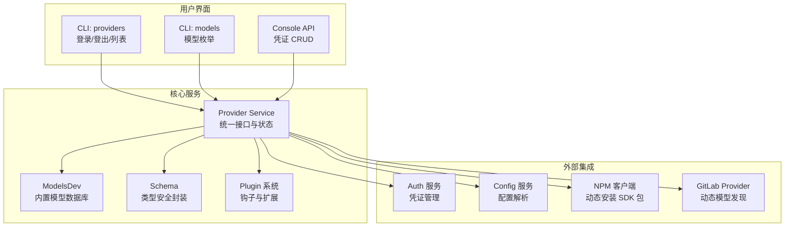
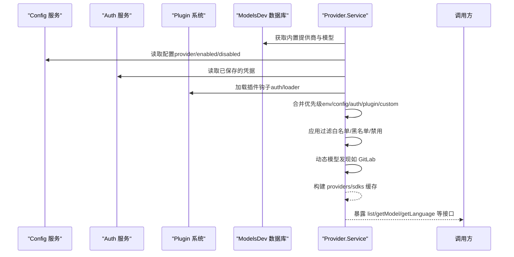
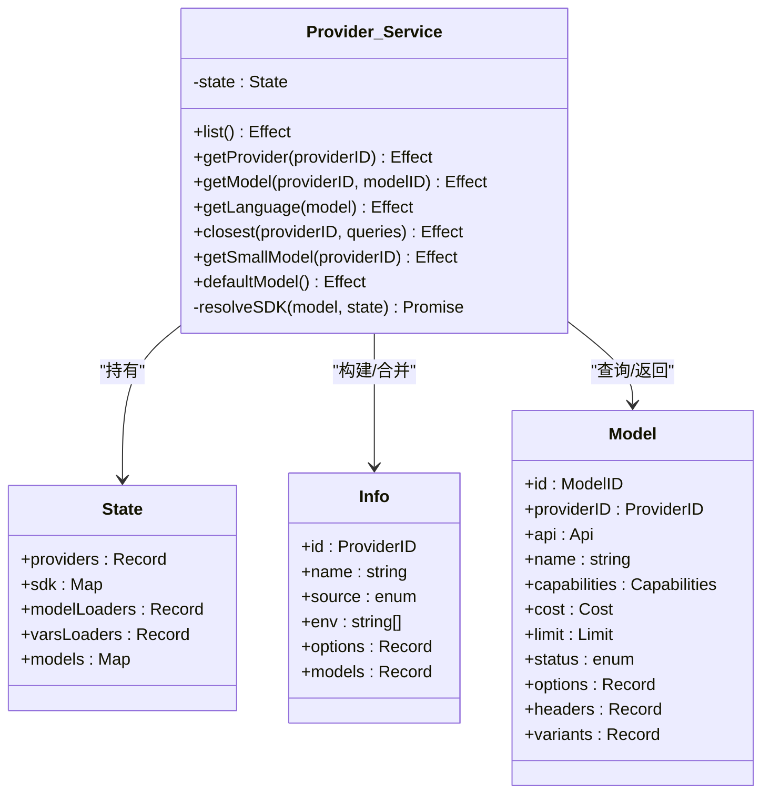
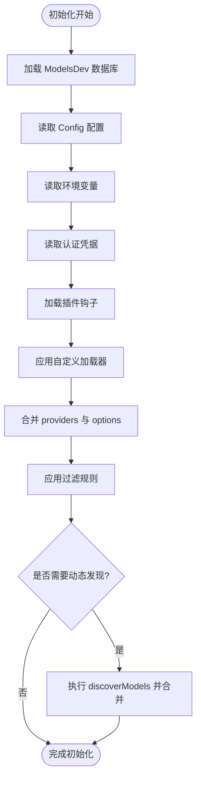
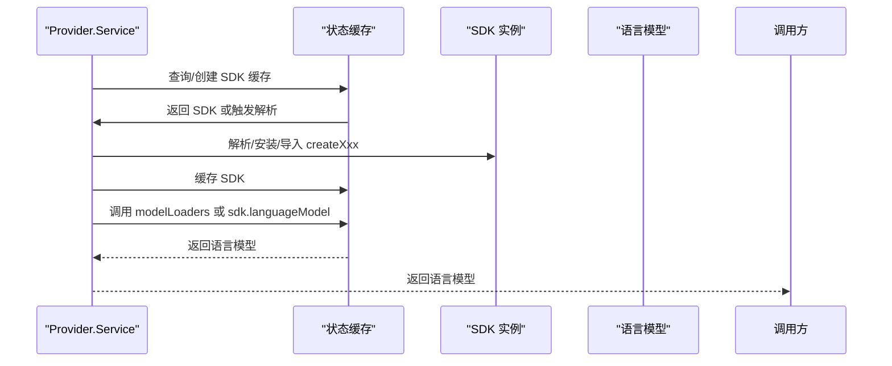
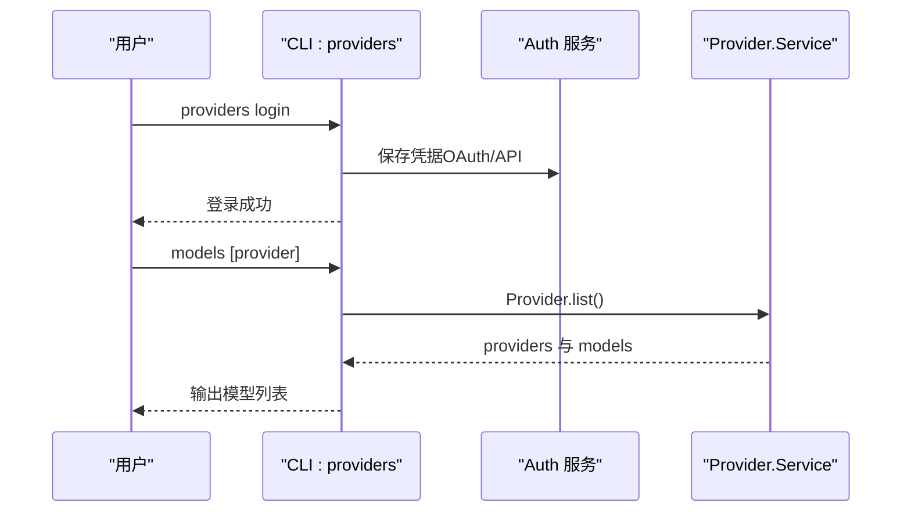
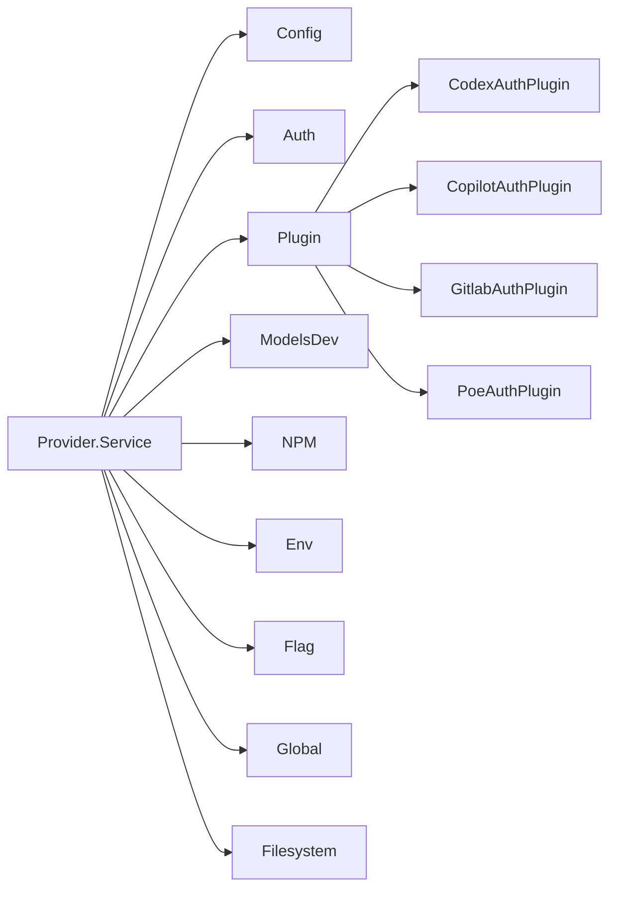

# 模型提供商架构设计

<cite>
**本文档引用的文件**
- [packages/opencode/src/provider/provider.ts](file://packages/opencode/src/provider/provider.ts)
- [packages/opencode/src/provider/models.ts](file://packages/opencode/src/provider/models.ts)
- [packages/opencode/src/provider/schema.ts](file://packages/opencode/src/provider/schema.ts)
- [packages/opencode/src/provider/sdk/copilot/copilot-provider.ts](file://packages/opencode/src/provider/sdk/copilot/copilot-provider.ts)
- [packages/opencode/src/plugin/index.ts](file://packages/opencode/src/plugin/index.ts)
- [packages/opencode/src/cli/cmd/providers.ts](file://packages/opencode/src/cli/cmd/providers.ts)
- [packages/opencode/src/cli/cmd/models.ts](file://packages/opencode/src/cli/cmd/models.ts)
- [packages/console/core/src/provider.ts](file://packages/console/core/src/provider.ts)
- [packages/opencode/test/provider/provider.test.ts](file://packages/opencode/test/provider/provider.test.ts)
</cite>

## 目录
1. [简介](#简介)
2. [项目结构](#项目结构)
3. [核心组件](#核心组件)
4. [架构总览](#架构总览)
5. [详细组件分析](#详细组件分析)
6. [依赖关系分析](#依赖关系分析)
7. [性能考虑](#性能考虑)
8. [故障排除指南](#故障排除指南)
9. [结论](#结论)
10. [附录](#附录)

## 简介
本文件系统性阐述 OpenCode 模型提供商抽象层的设计与实现，覆盖统一接口设计、注册与发现机制、动态加载与配置验证、运行时切换、扩展机制（插件）以及新提供商集成指南。通过架构图与代码路径引用，帮助开发者快速理解整体设计并进行二次开发。

## 项目结构
OpenCode 将“模型提供商”抽象置于核心包中，围绕 Provider Service 构建统一入口，结合插件系统、配置系统与认证系统完成动态加载与运行时装配。关键模块包括：
- Provider Service：统一的模型提供商接口与状态管理
- ModelsDev：内置模型数据库与缓存刷新
- Schema：ProviderID/ModelID 类型安全封装
- Plugin：插件系统，支持 auth/loader 扩展点
- CLI：提供者管理与模型列表展示
- Console：后端数据库操作（凭证存储）

**图表来源**
- [packages/opencode/src/provider/provider.ts:975-1298](file://packages/opencode/src/provider/provider.ts#L975-L1298)
- [packages/opencode/src/provider/models.ts:111-151](file://packages/opencode/src/provider/models.ts#L111-L151)
- [packages/opencode/src/plugin/index.ts:94-261](file://packages/opencode/src/plugin/index.ts#L94-L261)
- [packages/opencode/src/cli/cmd/providers.ts:199-479](file://packages/opencode/src/cli/cmd/providers.ts#L199-L479)
- [packages/opencode/src/cli/cmd/models.ts:35-78](file://packages/opencode/src/cli/cmd/models.ts#L35-L78)
- [packages/console/core/src/provider.ts:8-57](file://packages/console/core/src/provider.ts#L8-L57)

**章节来源**
- [packages/opencode/src/provider/provider.ts:975-1298](file://packages/opencode/src/provider/provider.ts#L975-L1298)
- [packages/opencode/src/provider/models.ts:111-151](file://packages/opencode/src/provider/models.ts#L111-L151)
- [packages/opencode/src/plugin/index.ts:94-261](file://packages/opencode/src/plugin/index.ts#L94-L261)

## 核心组件
- 统一接口与服务
  - Provider.Service 实现统一接口，包含 list、getProvider、getModel、getLanguage、closest、getSmallModel、defaultModel 等方法，使用 Effect.Effect 进行可组合的异步执行。
  - 状态管理：在实例状态中维护 providers、sdk 缓存、modelLoaders、varsLoaders 等，确保按需初始化与复用。
- 数据模型与类型安全
  - Info/Model Zod Schema 定义了提供商与模型的结构，包括能力、成本、限制、变体等字段。
  - ProviderID/ModelID 使用品牌化 Schema，避免字符串误用。
- 动态加载与 SDK 解析
  - 支持内置 SDK 与外部 npm 包两种方式；根据 api.npm 选择 createXxx 函数或动态导入。
  - 自定义 fetch 包装，支持超时、SSE 分块超时、请求头合并等。
- 注册与发现机制
  - 基于 ModelsDev 提供的数据库进行初始填充，再叠加配置、环境变量、认证、插件与自定义加载器。
  - 支持 GitLab 等提供商的动态模型发现与合并。
- 插件扩展
  - 插件可通过 auth/loader 钩子参与认证与选项注入，实现运行时切换与覆盖。
- CLI 与控制台
  - CLI 提供 providers/list/models 子命令，支持交互式登录、登出与凭据管理。
  - Console 提供凭证的增删改查。

**章节来源**
- [packages/opencode/src/provider/provider.ts:874-895](file://packages/opencode/src/provider/provider.ts#L874-L895)
- [packages/opencode/src/provider/provider.ts:897-973](file://packages/opencode/src/provider/provider.ts#L897-L973)
- [packages/opencode/src/provider/provider.ts:1300-1502](file://packages/opencode/src/provider/provider.ts#L1300-L1502)
- [packages/opencode/src/provider/schema.ts:6-39](file://packages/opencode/src/provider/schema.ts#L6-L39)
- [packages/opencode/src/provider/models.ts:25-87](file://packages/opencode/src/provider/models.ts#L25-L87)
- [packages/opencode/src/cli/cmd/providers.ts:254-479](file://packages/opencode/src/cli/cmd/providers.ts#L254-L479)
- [packages/opencode/src/cli/cmd/models.ts:35-78](file://packages/opencode/src/cli/cmd/models.ts#L35-L78)
- [packages/console/core/src/provider.ts:8-57](file://packages/console/core/src/provider.ts#L8-L57)

## 架构总览
Provider Service 的初始化流程串联配置、认证、插件与自定义加载器，最终生成可用的 providers 与 SDK 缓存，并暴露统一查询与语言模型获取接口。

**图表来源**
- [packages/opencode/src/provider/provider.ts:975-1298](file://packages/opencode/src/provider/provider.ts#L975-L1298)
- [packages/opencode/src/provider/models.ts:111-151](file://packages/opencode/src/provider/models.ts#L111-L151)
- [packages/opencode/src/plugin/index.ts:94-261](file://packages/opencode/src/plugin/index.ts#L94-L261)

**章节来源**
- [packages/opencode/src/provider/provider.ts:975-1298](file://packages/opencode/src/provider/provider.ts#L975-L1298)

## 详细组件分析

### 组件 A：Provider.Service（统一接口与状态）
- 角色与职责
  - 统一抽象：提供 list、getProvider、getModel、getLanguage、closest、getSmallModel、defaultModel 等方法。
  - 状态管理：维护 providers、sdk 缓存、modelLoaders、varsLoaders、languages 缓存。
  - 初始化：从 ModelsDev 数据库构建初始 providers，叠加配置、环境变量、认证、插件与自定义加载器。
- 关键流程
  - 合并策略：env > config > api > custom > builtin；支持 options 合并与模型变体合并。
  - 过滤策略：enabled_providers/disabled_providers、白名单/黑名单、状态过滤（alpha/deprecated）、实验特性开关。
  - 动态模型发现：对特定提供商（如 gitlab）执行 discoverModels 并合并结果。
  - SDK 解析：根据 api.npm 选择内置或外部包，动态导入 createXxx 函数，支持自定义 fetch 包装与 baseURL 变量替换。
- 错误处理
  - ModelNotFoundError：提供模糊建议（fuzzysort），便于用户修正拼写。
  - InitError：SDK 初始化失败时抛出，携带 providerID 信息。

**图表来源**
- [packages/opencode/src/provider/provider.ts:874-895](file://packages/opencode/src/provider/provider.ts#L874-L895)
- [packages/opencode/src/provider/provider.ts:859-872](file://packages/opencode/src/provider/provider.ts#L859-L872)
- [packages/opencode/src/provider/provider.ts:897-973](file://packages/opencode/src/provider/provider.ts#L897-L973)

**章节来源**
- [packages/opencode/src/provider/provider.ts:874-895](file://packages/opencode/src/provider/provider.ts#L874-L895)
- [packages/opencode/src/provider/provider.ts:1300-1502](file://packages/opencode/src/provider/provider.ts#L1300-L1502)
- [packages/opencode/src/provider/provider.ts:1655-1678](file://packages/opencode/src/provider/provider.ts#L1655-L1678)

### 组件 B：注册与发现机制（配置、环境、认证、插件、自定义）
- 配置与环境
  - 从 Config 读取 provider/enabled_providers/disabled_providers，合并 options 与模型定义。
  - 从 Env 读取环境变量，匹配 Provider.env 列表，自动启用对应提供商。
- 认证
  - 从 Auth 读取已保存的凭据，支持 api/oauth 两类；将 key 注入到 providers 中。
- 插件
  - 通过 plugin.auth.loader 注入 options；通过 plugin.provider.models 注入动态模型。
- 自定义加载器
  - custom(...) 返回每个提供商的 autoload/getModel/vars/discoverModels/options，按需启用并合并。
- 发现机制
  - 对 gitlab 等提供商执行 discoverModels，将返回的模型合并到 providers 中。

**图表来源**
- [packages/opencode/src/provider/provider.ts:975-1298](file://packages/opencode/src/provider/provider.ts#L975-L1298)

**章节来源**
- [packages/opencode/src/provider/provider.ts:1021-1217](file://packages/opencode/src/provider/provider.ts#L1021-L1217)

### 组件 C：SDK 解析与语言模型获取
- SDK 解析
  - 优先使用内置映射 BUNDLED_PROVIDERS；否则通过 NPM 安装并动态导入 createXxx。
  - 支持 baseURL 变量替换（${VAR}）、headers 合并、fetch 包装（超时、SSE 分块）。
- 语言模型获取
  - 先尝试自定义 modelLoaders（如 responses/chat/languageModel），否则回退到 sdk.languageModel。
  - 支持 E2E 模式（通过 e2eURL 覆盖）。

**图表来源**
- [packages/opencode/src/provider/provider.ts:1300-1502](file://packages/opencode/src/provider/provider.ts#L1300-L1502)

**章节来源**
- [packages/opencode/src/provider/provider.ts:1300-1502](file://packages/opencode/src/provider/provider.ts#L1300-L1502)

### 组件 D：CLI 与控制台（凭据管理与模型枚举）
- CLI providers
  - list：列出凭据与环境变量。
  - login/logout：支持 OAuth 与 API Key，支持插件方法选择与输入提示。
- CLI models
  - 枚举指定提供商或全部提供商的模型清单，支持详细输出。
- Console
  - 提供凭证的增删改查接口，供后端使用。

**图表来源**
- [packages/opencode/src/cli/cmd/providers.ts:254-479](file://packages/opencode/src/cli/cmd/providers.ts#L254-L479)
- [packages/opencode/src/cli/cmd/models.ts:35-78](file://packages/opencode/src/cli/cmd/models.ts#L35-L78)
- [packages/console/core/src/provider.ts:8-57](file://packages/console/core/src/provider.ts#L8-L57)

**章节来源**
- [packages/opencode/src/cli/cmd/providers.ts:254-479](file://packages/opencode/src/cli/cmd/providers.ts#L254-L479)
- [packages/opencode/src/cli/cmd/models.ts:35-78](file://packages/opencode/src/cli/cmd/models.ts#L35-L78)
- [packages/console/core/src/provider.ts:8-57](file://packages/console/core/src/provider.ts#L8-L57)

## 依赖关系分析
- 内部依赖
  - Provider.Service 依赖 Config、Auth、Plugin、ModelsDev、Npm、Env、Flag、Global、Filesystem 等服务。
  - 使用 Effect.Effect/Layer 进行服务装配与作用域管理。
- 外部依赖
  - @ai-sdk/* 生态（内置映射）与外部 npm 包（动态安装）。
  - 插件生态（opencode-*）通过钩子扩展认证与模型发现。
- 循环依赖
  - 通过 Layer 与延迟导入避免循环依赖；插件加载顺序保持确定性。

**图表来源**
- [packages/opencode/src/provider/provider.ts:1-58](file://packages/opencode/src/provider/provider.ts#L1-L58)
- [packages/opencode/src/plugin/index.ts:48-137](file://packages/opencode/src/plugin/index.ts#L48-L137)

**章节来源**
- [packages/opencode/src/provider/provider.ts:1-58](file://packages/opencode/src/provider/provider.ts#L1-L58)
- [packages/opencode/src/plugin/index.ts:48-137](file://packages/opencode/src/plugin/index.ts#L48-L137)

## 性能考虑
- 缓存策略
  - SDK 实例与语言模型均采用 Map 缓存，避免重复解析与创建。
  - ModelsDev 数据库带 TTL 与文件锁，减少网络请求与并发竞争。
- 按需初始化
  - 仅在首次访问时解析 SDK、创建语言模型；disabled/enabled 白名单/黑名单在初始化阶段剔除无效项。
- 请求优化
  - 自定义 fetch 合并超时信号，SSE 分块超时控制，减少长时间等待。
- 模糊匹配
  - closest 与 ModelNotFoundError 的 suggestions 降低用户输入错误带来的重试成本。

[本节为通用指导，无需具体文件分析]

## 故障排除指南
- 常见错误与定位
  - ProviderModelNotFoundError：检查 providerID/modelID 是否正确，查看 suggestions；确认配置中的 provider/model 名称与数据库一致。
  - ProviderInitError：检查 api.npm 是否存在入口导出、baseURL/headers 是否正确、凭据是否有效。
- 调试建议
  - 使用 CLI providers list 查看当前凭据与环境变量。
  - 使用 CLI models 枚举模型，确认模型是否被过滤（白/黑名单、禁用、状态）。
  - 在测试中参考 provider.test.ts 的断言模式，验证配置合并、别名、baseURL 优先级等行为。

**章节来源**
- [packages/opencode/src/provider/provider.ts:1663-1678](file://packages/opencode/src/provider/provider.ts#L1663-L1678)
- [packages/opencode/test/provider/provider.test.ts:297-344](file://packages/opencode/test/provider/provider.test.ts#L297-L344)
- [packages/opencode/src/cli/cmd/providers.ts:208-252](file://packages/opencode/src/cli/cmd/providers.ts#L208-L252)

## 结论
OpenCode 的模型提供商抽象层通过统一接口、严格的类型安全、灵活的注册与发现机制、强大的插件扩展能力，实现了对多厂商 SDK 的无缝接入与运行时切换。其初始化流程清晰地体现了“配置 > 环境 > 认证 > 插件 > 自定义”的优先级策略，并通过缓存与按需初始化保障性能。开发者可基于现有接口与扩展点快速集成新的提供商，同时遵循配置验证与错误处理的最佳实践。

[本节为总结，无需具体文件分析]

## 附录

### 如何实现新的模型提供商集成（开发指南）
- 接口实现
  - 若 SDK 已在 @ai-sdk 生态中提供 createXxx，请将其加入 BUNDLED_PROVIDERS 映射，或在自定义加载器中返回对应的 SDK 创建函数。
  - 若 SDK 为第三方 npm 包，确保导出包含 createXxx 的入口；Provider 会通过 NPM 安装并动态导入。
- 配置管理
  - 在 opencode.json 的 provider 节点下声明提供商名称、npm 包、api 基础地址、环境变量、模型列表与 options。
  - 使用 env 字段声明所需环境变量，实现自动启用。
  - 使用 whitelist/blacklist 控制模型可见性；使用 enabled_providers/disabled_providers 控制提供商启用范围。
- 认证与运行时切换
  - 通过 CLI providers login 添加凭据；OAuth 与 API Key 均受支持。
  - 插件可通过 auth.loader 注入 options，实现运行时切换与覆盖。
- 错误处理
  - 遵循 ProviderModelNotFoundError 的错误结构，确保 suggestions 能帮助用户纠正输入。
  - 初始化失败时抛出 ProviderInitError，便于上层捕获与提示。

**章节来源**
- [packages/opencode/src/provider/provider.ts:127-150](file://packages/opencode/src/provider/provider.ts#L127-L150)
- [packages/opencode/src/provider/provider.ts:1172-1191](file://packages/opencode/src/provider/provider.ts#L1172-L1191)
- [packages/opencode/src/cli/cmd/providers.ts:254-479](file://packages/opencode/src/cli/cmd/providers.ts#L254-L479)
- [packages/opencode/test/provider/provider.test.ts:185-261](file://packages/opencode/test/provider/provider.test.ts#L185-L261)