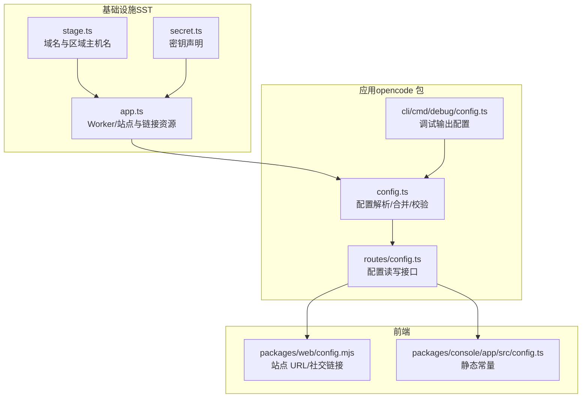
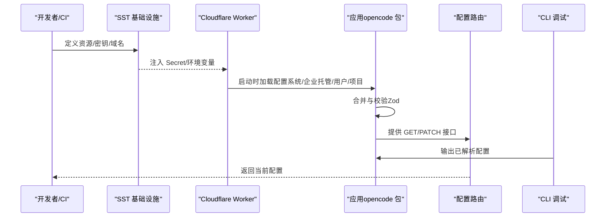
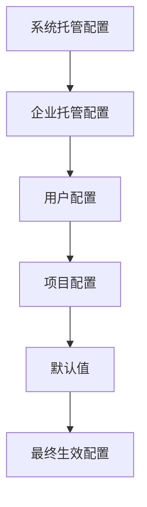
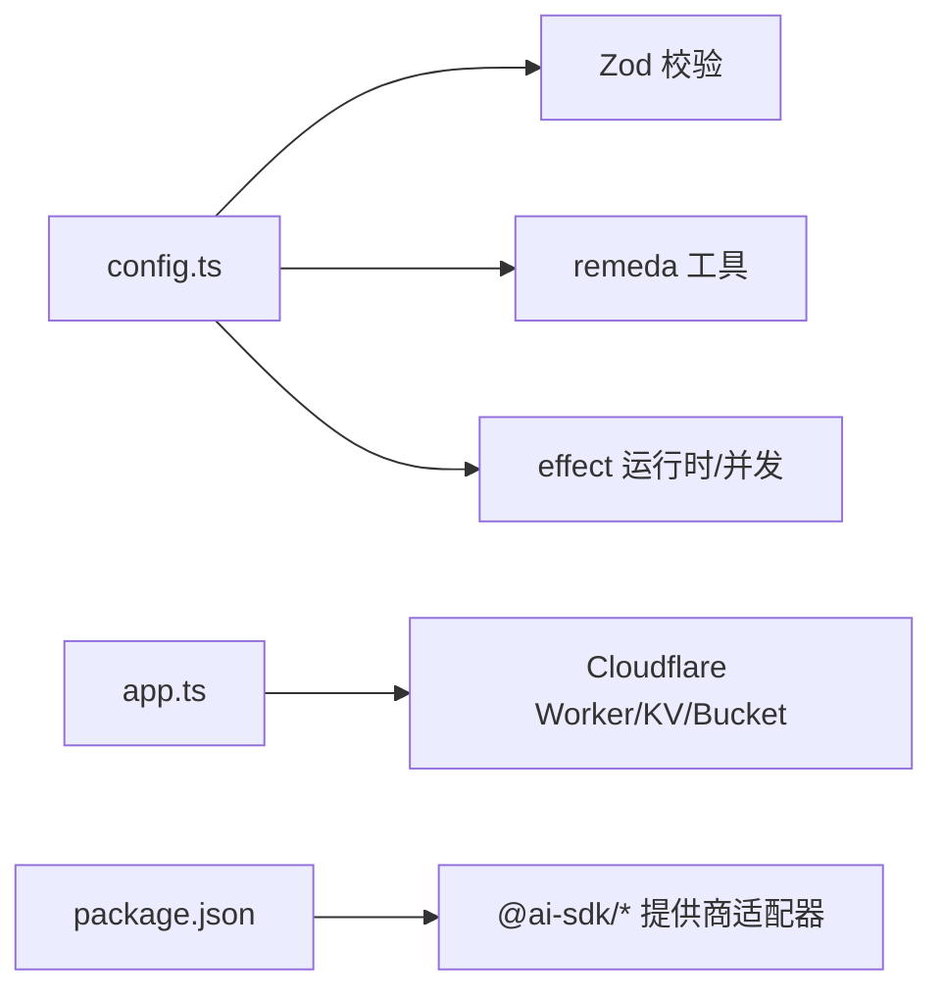

# 配置管理与最佳实践

<cite>
**本文引用的文件**
- [opencode.jsonc](file://.opencode/opencode.jsonc)
- [sst-env.d.ts](file://sst-env.d.ts)
- [secret.ts](file://infra/secret.ts)
- [app.ts](file://infra/app.ts)
- [stage.ts](file://infra/stage.ts)
- [config.ts（核心配置）](file://packages/opencode/src/config/config.ts)
- [config 路由](file://packages/opencode/src/server/routes/config.ts)
- [config 调试命令](file://packages/opencode/src/cli/cmd/debug/config.ts)
- [包配置（opencode 包）](file://packages/opencode/package.json)
- [Web 站点配置](file://packages/web/config.mjs)
- [Console 应用配置](file://packages/console/app/src/config.ts)
</cite>

## 目录
1. [简介](#简介)
2. [项目结构](#项目结构)
3. [核心组件](#核心组件)
4. [架构总览](#架构总览)
5. [详细组件分析](#详细组件分析)
6. [依赖分析](#依赖分析)
7. [性能考量](#性能考量)
8. [故障排除指南](#故障排除指南)
9. [结论](#结论)
10. [附录](#附录)

## 简介
本指南面向模型提供商的配置管理与使用最佳实践，围绕以下目标展开：  
- 解释配置文件结构与参数含义，涵盖 API 密钥管理、模型参数配置、环境变量使用等  
- 提供开发/生产/多用户等典型场景的配置示例与建议  
- 讲解配置优先级、继承关系与安全注意事项  
- 给出常见问题排查方法与性能优化、成本控制策略  

## 项目结构
本仓库采用多包与基础设施即代码（IaC）结合的方式组织，与“配置”直接相关的关键位置如下：
- 核心配置解析与合并逻辑位于 opencode 包的配置模块
- 运行时环境变量通过 SST 的类型化资源注入到 Worker/站点
- 基础设施层定义了密钥、存储桶、域名等资源，并将敏感值以 Secret 形式注入应用
- Web 与 Console 应用分别有各自运行期配置入口

图表来源
- [stage.ts:1-20](file://infra/stage.ts#L1-L20)
- [app.ts:1-69](file://infra/app.ts#L1-L69)
- [secret.ts:1-5](file://infra/secret.ts#L1-L5)
- [config.ts（核心配置）:1-800](file://packages/opencode/src/config/config.ts#L1-L800)
- [config 路由:1-93](file://packages/opencode/src/server/routes/config.ts#L1-L93)
- [config 调试命令:1-17](file://packages/opencode/src/cli/cmd/debug/config.ts#L1-L17)
- [Web 站点配置:1-15](file://packages/web/config.mjs#L1-L15)
- [Console 应用配置:1-30](file://packages/console/app/src/config.ts#L1-L30)

章节来源
- [stage.ts:1-20](file://infra/stage.ts#L1-L20)
- [app.ts:1-69](file://infra/app.ts#L1-L69)
- [secret.ts:1-5](file://infra/secret.ts#L1-L5)
- [config.ts（核心配置）:1-800](file://packages/opencode/src/config/config.ts#L1-L800)
- [config 路由:1-93](file://packages/opencode/src/server/routes/config.ts#L1-L93)
- [config 调试命令:1-17](file://packages/opencode/src/cli/cmd/debug/config.ts#L1-L17)
- [Web 站点配置:1-15](file://packages/web/config.mjs#L1-L15)
- [Console 应用配置:1-30](file://packages/console/app/src/config.ts#L1-L30)

## 核心组件
- 配置解析与合并：负责从系统/企业托管、用户目录、项目目录等多源加载配置，进行深度合并与字段级拼接（如指令数组），并提供 Zod 校验与类型约束
- 模型提供商配置：支持按提供商分组、白名单/黑名单、模型变体开关等
- 运行时配置接口：提供 GET/PATCH 配置读取与更新的 API；CLI 提供调试输出能力
- 环境变量与密钥注入：通过 SST 将 Secret 注入 Worker/站点，前端站点配置根据阶段动态选择 URL

章节来源
- [config.ts（核心配置）:60-140](file://packages/opencode/src/config/config.ts#L60-L140)
- [config.ts（核心配置）:787-806](file://packages/opencode/src/config/config.ts#L787-L806)
- [config 路由:13-92](file://packages/opencode/src/server/routes/config.ts#L13-L92)
- [config 调试命令:6-16](file://packages/opencode/src/cli/cmd/debug/config.ts#L6-L16)
- [sst-env.d.ts:1-315](file://sst-env.d.ts#L1-L315)

## 架构总览
下图展示“配置从生成到生效”的端到端流程：  
- 开发者在本地或 CI 中通过 IaC 定义资源与密钥
- 应用启动时读取系统/企业托管配置、用户配置与项目配置，进行合并与校验
- 运行时通过 API 或 CLI 查看/更新配置
- 前端根据阶段选择正确的后端地址

图表来源
- [app.ts:13-49](file://infra/app.ts#L13-L49)
- [sst-env.d.ts:1-315](file://sst-env.d.ts#L1-L315)
- [config.ts（核心配置）:60-140](file://packages/opencode/src/config/config.ts#L60-L140)
- [config 路由:13-92](file://packages/opencode/src/server/routes/config.ts#L13-L92)
- [config 调试命令:6-16](file://packages/opencode/src/cli/cmd/debug/config.ts#L6-L16)

## 详细组件分析

### 配置文件结构与参数说明
- 结构概览
  - provider：按提供商分组的配置对象，支持白名单/黑名单与模型变体开关
  - permission：权限规则，支持按动作（ask/allow/deny）或按路径/工具粒度控制
  - mcp：MCP（Model Context Protocol）服务器连接配置（本地/远程）
  - tools：工具开关（示例中包含若干 GitHub 工具）
  - 其他：指令、代理、技能、键位、服务端口与 CORS 等

- 关键字段与用途
  - provider.models.*.variants.*.disabled：禁用特定模型的某个变体
  - permission.read/edit/glob 等：细粒度权限控制
  - mcp.local/remote：MCP 服务器的启动方式与认证
  - tools.*：启用/禁用特定外部工具

章节来源
- [opencode.jsonc:1-19](file://.opencode/opencode.jsonc#L1-L19)
- [config.ts（核心配置）:787-806](file://packages/opencode/src/config/config.ts#L787-L806)
- [config.ts（核心配置）:432-433](file://packages/opencode/src/config/config.ts#L432-L433)
- [config.ts（核心配置）:470-500](file://packages/opencode/src/config/config.ts#L470-L500)
- [config.ts（核心配置）:372-433](file://packages/opencode/src/config/config.ts#L372-L433)

### 配置优先级与继承关系
- 优先级（从高到低）
  1) 企业托管配置（macOS MDM/系统托管目录）：最高优先级，覆盖所有用户与项目配置
  2) 系统/企业托管目录：管理员集中配置
  3) 用户配置目录：用户级覆盖
  4) 项目配置：项目级覆盖
  5) 默认值：未显式配置时的回退

- 合并与继承策略
  - 深度合并：对象字段递归合并
  - 数组字段：采用去重拼接策略（如指令列表）
  - 权限规则：保留原始键序，确保语义一致

图表来源
- [config.ts（核心配置）:60-140](file://packages/opencode/src/config/config.ts#L60-L140)
- [config.ts（核心配置）:132-139](file://packages/opencode/src/config/config.ts#L132-L139)

章节来源
- [config.ts（核心配置）:60-140](file://packages/opencode/src/config/config.ts#L60-L140)
- [config.ts（核心配置）:132-139](file://packages/opencode/src/config/config.ts#L132-L139)

### API 密钥管理与环境变量使用
- 密钥注入
  - 通过 SST Secret 声明并在 Worker/站点中注入，避免硬编码
  - 示例密钥：数据库凭据、第三方平台令牌、支付网关密钥等

- 运行时访问
  - Worker 环境变量通过 SST 自动注入，可在应用中读取
  - 建议仅在需要时读取敏感变量，避免泄露

- 最佳实践
  - 使用最小权限原则授予密钥
  - 定期轮换密钥，配合 CI/CD 自动化
  - 在本地开发与生产之间区分密钥与端点

章节来源
- [secret.ts:1-5](file://infra/secret.ts#L1-L5)
- [app.ts:13-49](file://infra/app.ts#L13-L49)
- [sst-env.d.ts:1-315](file://sst-env.d.ts#L1-L315)

### 模型参数配置
- 提供商与模型
  - 支持按提供商分组配置，可设置白名单/黑名单
  - 模型变体可单独开关，便于灰度或禁用特定变体

- 参数要点
  - 变体禁用：针对特定模型的变体进行禁用
  - 默认模型选择：可通过 Provider 列表接口获取默认模型

章节来源
- [config.ts（核心配置）:787-806](file://packages/opencode/src/config/config.ts#L787-L806)
- [config 路由:83-90](file://packages/opencode/src/server/routes/config.ts#L83-L90)

### 环境变量与部署阶段
- 阶段与域名
  - 不同阶段（dev/production/thdxr 等）对应不同域名与区域主机名
  - 前端站点配置根据 SST_STAGE 动态选择 URL

- 站点配置
  - Web 站点配置根据阶段决定根 URL、控制台登录 URL、社交卡片等
  - Console 应用配置包含静态常量（如 GitHub 仓库、统计数字）

章节来源
- [stage.ts:1-20](file://infra/stage.ts#L1-L20)
- [app.ts:51-68](file://infra/app.ts#L51-L68)
- [web/config.mjs:1-15](file://packages/web/config.mjs#L1-L15)
- [console/app/src/config.ts:1-30](file://packages/console/app/src/config.ts#L1-L30)

### 运行时配置接口与 CLI 调试
- 配置接口
  - GET / 获取当前配置
  - PATCH / 更新配置（请求体需满足配置模式）

- CLI 调试
  - 输出已解析的最终配置，便于快速定位问题

章节来源
- [config 路由:13-92](file://packages/opencode/src/server/routes/config.ts#L13-L92)
- [config 调试命令:6-16](file://packages/opencode/src/cli/cmd/debug/config.ts#L6-L16)

### 多用户与多项目场景
- 多用户
  - 用户级配置独立于项目配置，遵循“用户 > 项目 > 默认”的合并顺序
- 多项目
  - 项目内配置仅影响该项目，不污染其他项目
- 企业托管
  - 管理员可通过系统托管目录下发统一策略，覆盖用户与项目配置

章节来源
- [config.ts（核心配置）:60-140](file://packages/opencode/src/config/config.ts#L60-L140)

## 依赖分析
- 配置模块依赖
  - Zod：用于配置模式校验与类型推断
  - remeda：提供深度合并与数组去重等工具函数
  - effect：用于并发锁、运行时构建与错误处理

- 外部依赖
  - Cloudflare Workers/KV/Bucket：作为运行时承载与数据存储
  - 第三方 SDK：如 ai-sdk 各提供商适配器，用于模型调用

图表来源
- [config.ts（核心配置）:1-42](file://packages/opencode/src/config/config.ts#L1-L42)
- [package.json:70-158](file://packages/opencode/package.json#L70-L158)
- [app.ts:11-49](file://infra/app.ts#L11-L49)

章节来源
- [config.ts（核心配置）:1-42](file://packages/opencode/src/config/config.ts#L1-L42)
- [package.json:70-158](file://packages/opencode/package.json#L70-L158)
- [app.ts:11-49](file://infra/app.ts#L11-L49)

## 性能考量
- 配置加载与缓存
  - 合并与校验发生在启动阶段，尽量减少重复解析
  - 对频繁访问的配置项可做内存缓存（注意与热更新的协调）

- 并发与锁
  - 依赖 flock 机制避免并发安装/写入冲突
  - 在大规模并发场景下，建议将配置变更批量化

- 网络与 I/O
  - 将大型配置拆分为多个小文件，按需加载
  - 减少磁盘与网络 I/O，优先使用本地缓存

- 模型调用
  - 合理设置模型变体与默认模型，避免不必要的切换
  - 使用连接池与超时控制，防止阻塞

## 故障排除指南
- 配置无法生效
  - 检查优先级：企业托管是否覆盖了用户/项目配置
  - 使用 CLI 输出最终配置，确认字段是否被正确合并

- 权限拒绝
  - 核对 permission 规则与路径匹配，确认动作（ask/allow/deny）
  - 若使用旧版 tools 字段，请迁移至 permission

- 模型不可用
  - 检查 provider.models 下的变体是否被禁用
  - 确认白名单/黑名单是否限制了目标模型

- 环境变量缺失
  - 确认 SST Secret 是否已声明并链接到 Worker
  - 检查运行时注入的变量名与大小写

- API 更新失败
  - 确保请求体符合配置模式
  - 查看响应中的错误详情，逐项修正

章节来源
- [config 调试命令:6-16](file://packages/opencode/src/cli/cmd/debug/config.ts#L6-L16)
- [config.ts（核心配置）:470-500](file://packages/opencode/src/config/config.ts#L470-L500)
- [config.ts（核心配置）:787-806](file://packages/opencode/src/config/config.ts#L787-L806)
- [secret.ts:1-5](file://infra/secret.ts#L1-L5)
- [config 路由:54-59](file://packages/opencode/src/server/routes/config.ts#L54-L59)

## 结论
通过明确的配置优先级、严格的模式校验与安全的密钥注入，本项目实现了可维护、可观测且可扩展的配置体系。建议在团队内统一配置规范，结合 CLI 与 API 快速验证与迭代，并在生产中强化密钥轮换与最小权限原则。

## 附录

### 场景化配置示例（说明性）
- 开发环境
  - 使用 dev 阶段域名与本地/测试密钥
  - 允许更多调试工具与宽松的权限策略
- 生产环境
  - 使用生产域名与强权限策略
  - 严格限制模型变体与工具范围
- 多用户环境
  - 通过企业托管下发统一策略
  - 用户与项目配置仅作补充

### 安全与合规建议
- 仅在必要时读取敏感变量
- 定期轮换密钥并审计访问日志
- 使用最小权限原则与职责分离
- 对配置变更进行版本化与审批