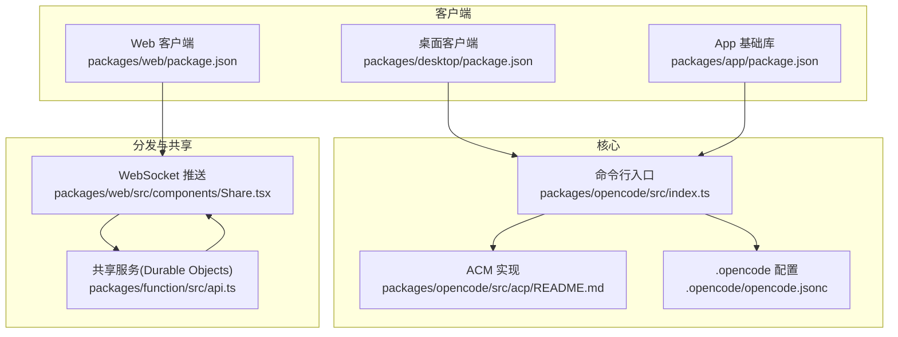
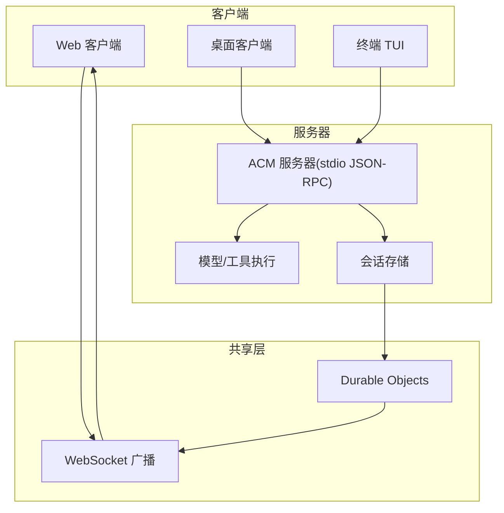
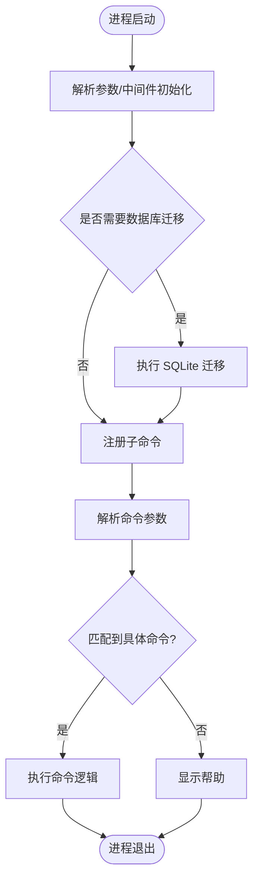
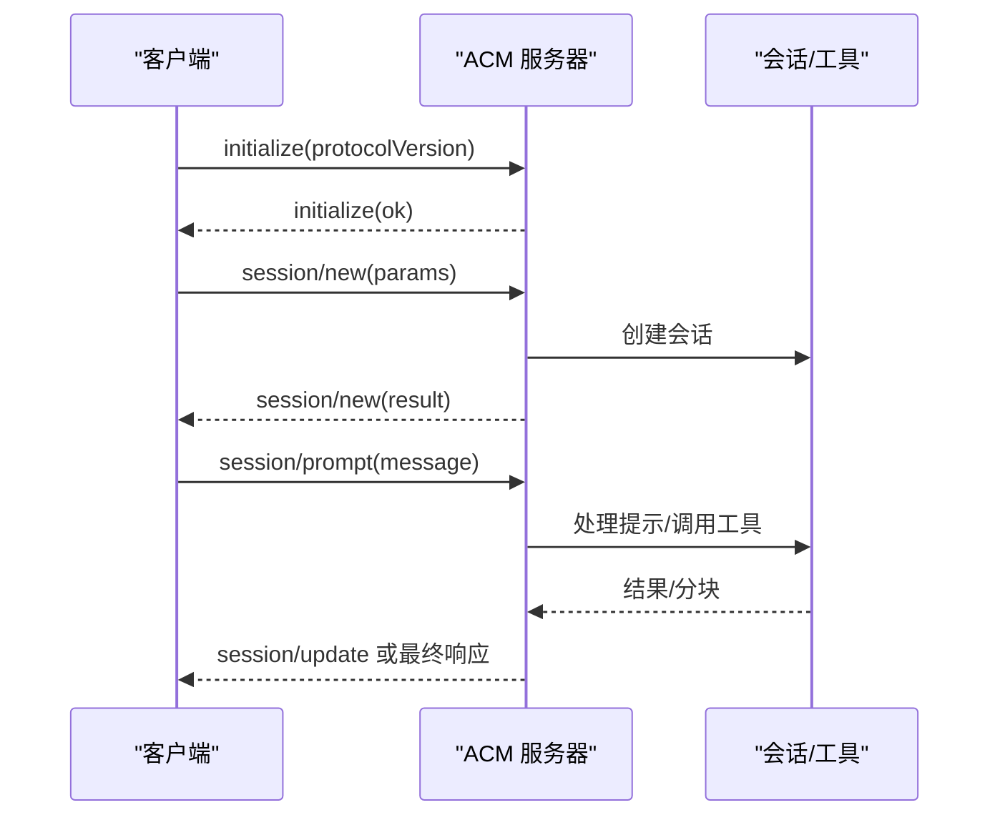
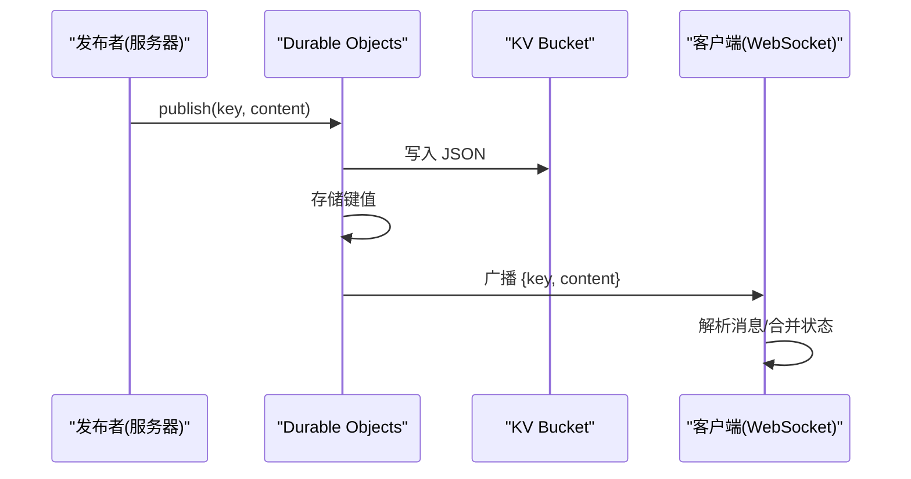
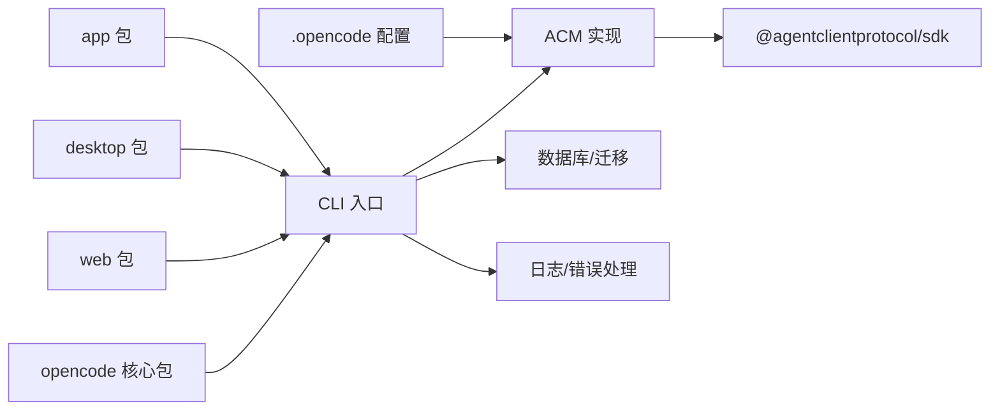

# 客户端/服务器架构

<cite>
**本文引用的文件**
- [README.md](file://README.md)
- [packages/opencode/src/index.ts](file://packages/opencode/src/index.ts)
- [packages/opencode/src/acp/README.md](file://packages/opencode/src/acp/README.md)
- [.opencode/opencode.jsonc](file://.opencode/opencode.jsonc)
- [packages/web/package.json](file://packages/web/package.json)
- [packages/desktop/package.json](file://packages/desktop/package.json)
- [packages/app/package.json](file://packages/app/package.json)
- [packages/function/src/api.ts](file://packages/function/src/api.ts)
- [packages/web/src/components/Share.tsx](file://packages/web/src/components/Share.tsx)
</cite>

## 目录
1. [引言](#引言)
2. [项目结构](#项目结构)
3. [核心组件](#核心组件)
4. [架构总览](#架构总览)
5. [详细组件分析](#详细组件分析)
6. [依赖关系分析](#依赖关系分析)
7. [性能考量](#性能考量)
8. [故障排查指南](#故障排查指南)
9. [结论](#结论)
10. [附录](#附录)

## 引言
本文件面向希望理解与扩展 OpenCode 客户端/服务器架构的开发者，系统阐述其设计理念、技术实现与运行机制，并对比传统单机应用的优势。OpenCode 将“智能体代理”与“会话/消息/内容分发”解耦，通过标准协议（Agent Client Protocol，简称 ACP）在本地或云端以“服务器”形态运行，同时以多种“客户端”接入（终端 TUI、Web、桌面应用），从而实现远程控制、多设备协作与分布式部署。

## 项目结构
OpenCode 采用多包工作区组织方式，围绕“核心 CLI 服务器”与“多客户端入口”构建：
- 核心服务器：命令行入口负责解析参数、初始化日志与数据库迁移、注册各类子命令（含 ACP/MCP/TUI/Web 等）
- 客户端生态：Web、桌面应用、终端 TUI 分别作为不同交互入口
- 分发与共享：基于 Cloudflare Workers/Durable Objects 的会话共享与 WebSocket 推送
- 协议与工具：ACM 协议实现、权限与工具配置、SDK 与插件生态

图表来源
- [packages/opencode/src/index.ts:1-241](file://packages/opencode/src/index.ts#L1-L241)
- [packages/opencode/src/acp/README.md:1-175](file://packages/opencode/src/acp/README.md#L1-L175)
- [.opencode/opencode.jsonc:1-19](file://.opencode/opencode.jsonc#L1-L19)
- [packages/web/package.json:1-45](file://packages/web/package.json#L1-L45)
- [packages/desktop/package.json:1-45](file://packages/desktop/package.json#L1-L45)
- [packages/app/package.json:1-78](file://packages/app/package.json#L1-L78)
- [packages/function/src/api.ts:36-79](file://packages/function/src/api.ts#L36-L79)
- [packages/web/src/components/Share.tsx:81-186](file://packages/web/src/components/Share.tsx#L81-L186)

章节来源
- [packages/opencode/src/index.ts:1-241](file://packages/opencode/src/index.ts#L1-L241)
- [packages/opencode/src/acp/README.md:1-175](file://packages/opencode/src/acp/README.md#L1-L175)
- [.opencode/opencode.jsonc:1-19](file://.opencode/opencode.jsonc#L1-L19)
- [packages/web/package.json:1-45](file://packages/web/package.json#L1-L45)
- [packages/desktop/package.json:1-45](file://packages/desktop/package.json#L1-L45)
- [packages/app/package.json:1-78](file://packages/app/package.json#L1-L78)
- [packages/function/src/api.ts:36-79](file://packages/function/src/api.ts#L36-L79)
- [packages/web/src/components/Share.tsx:81-186](file://packages/web/src/components/Share.tsx#L81-L186)

## 核心组件
- 命令行入口与生命周期
  - 负责参数解析、日志初始化、一次性数据库迁移、注册子命令（包含 ACP/MCP/TUI/Web 等）
  - 统一处理未捕获异常与拒绝事件，确保稳定退出
- ACP（Agent Client Protocol）服务器
  - 提供 JSON-RPC over stdio 的协议实现，支持会话创建/加载、提示处理、能力声明与客户端能力（文件读写、权限请求等）
  - 与内部会话模型映射，复用工具注册表与工作目录上下文
- 分发与共享（Cloudflare Workers/Durable Objects）
  - 使用 Durable Objects 作为会话级存储与广播中心，通过 WebSocket 向订阅者推送增量更新
  - 支持按会话键空间发布/订阅，保障消息幂等与一致性
- 客户端层
  - Web 客户端：通过 WebSocket 订阅会话更新，实现跨设备实时共享
  - 桌面客户端：基于 Tauri，可直接调用本地服务器能力
  - App 基础库：提供通用 UI、状态与网络抽象，支撑多端一致体验

章节来源
- [packages/opencode/src/index.ts:1-241](file://packages/opencode/src/index.ts#L1-L241)
- [packages/opencode/src/acp/README.md:1-175](file://packages/opencode/src/acp/README.md#L1-L175)
- [packages/function/src/api.ts:36-79](file://packages/function/src/api.ts#L36-L79)
- [packages/web/src/components/Share.tsx:81-186](file://packages/web/src/components/Share.tsx#L81-L186)

## 架构总览
OpenCode 的客户端/服务器架构将“计算与存储”从“界面与交互”中解耦：
- 服务器侧（本地或云端）：运行 ACP/MCP 服务，维护会话状态、执行工具与模型调用
- 客户端侧（Web/桌面/TUI）：通过标准协议或 WebSocket 订阅会话变更，实现远程控制与多设备协作
- 分布式与可扩展性：借助 Durable Objects 与 WebSocket，可在多实例间进行会话共享与状态同步

图表来源
- [packages/opencode/src/acp/README.md:1-175](file://packages/opencode/src/acp/README.md#L1-L175)
- [packages/function/src/api.ts:36-79](file://packages/function/src/api.ts#L36-L79)
- [packages/web/src/components/Share.tsx:81-186](file://packages/web/src/components/Share.tsx#L81-L186)

## 详细组件分析

### 命令行入口与生命周期
- 参数解析与中间件：统一注入环境变量、初始化日志级别、决定是否纯模式运行
- 数据库迁移：首次启动时执行 SQLite 迁移，带进度反馈
- 子命令注册：集中注册 ACP、MCP、TUI、Web、Serve 等命令，形成统一 CLI 生态
- 错误处理：捕获未处理拒绝与异常，格式化输出并记录日志

图表来源
- [packages/opencode/src/index.ts:64-185](file://packages/opencode/src/index.ts#L64-L185)

章节来源
- [packages/opencode/src/index.ts:1-241](file://packages/opencode/src/index.ts#L1-L241)

### ACP 服务器与会话管理
- 协议实现：遵循 ACP v1 规范，使用官方 SDK，提供 initialize、session/new、session/prompt 等方法
- 会话映射：将 ACP 会话映射到内部会话模型，保持工作目录上下文与工具链可用
- 客户端能力：文件读写、权限请求占位、终端支持预留
- 当前限制：暂不支持流式响应、工具执行报告、认证、会话持久化等，后续规划明确

图表来源
- [packages/opencode/src/acp/README.md:80-128](file://packages/opencode/src/acp/README.md#L80-L128)

章节来源
- [packages/opencode/src/acp/README.md:1-175](file://packages/opencode/src/acp/README.md#L1-L175)

### 分发与共享（Durable Objects + WebSocket）
- 发布/订阅模型：服务端将会话键空间限定为 session/info、session/message、session/part，仅允许合法键发布
- 存储与广播：内容写入 KV Bucket 与本地存储，同时向所有已连接 WebSocket 广播
- 客户端订阅：Web 客户端通过 wss:// 构建 WebSocket 地址，自动重连，接收增量更新并合并到本地状态

图表来源
- [packages/function/src/api.ts:58-79](file://packages/function/src/api.ts#L58-L79)
- [packages/web/src/components/Share.tsx:98-166](file://packages/web/src/components/Share.tsx#L98-L166)

章节来源
- [packages/function/src/api.ts:36-79](file://packages/function/src/api.ts#L36-L79)
- [packages/web/src/components/Share.tsx:81-186](file://packages/web/src/components/Share.tsx#L81-L186)

### 客户端生态与集成
- Web 客户端：通过 Astro/Solid 构建，使用 WebSocket 订阅会话更新；支持环境变量切换 API 地址
- 桌面客户端：基于 Tauri，可直接调用本地 opencode 服务器能力，具备剪贴板、对话框、窗口状态等原生能力
- App 基础库：提供 UI、状态、网络与 WebSocket 抽象，支撑多端一致体验

章节来源
- [packages/web/package.json:1-45](file://packages/web/package.json#L1-L45)
- [packages/desktop/package.json:1-45](file://packages/desktop/package.json#L1-L45)
- [packages/app/package.json:1-78](file://packages/app/package.json#L1-L78)

## 依赖关系分析
- 包依赖与脚手架
  - opencode 核心包导出 CLI 入口，注册多条子命令，依赖日志、安装信息、数据库等模块
  - web/desktop/app 包分别定义开发/构建脚本与依赖，体现多端分离
- 协议与工具
  - ACP 实现依赖官方 SDK，确保协议兼容性
  - 工具与权限由配置文件控制，便于在不同客户端中启用/禁用

图表来源
- [packages/opencode/src/index.ts:1-241](file://packages/opencode/src/index.ts#L1-L241)
- [packages/opencode/src/acp/README.md:140-149](file://packages/opencode/src/acp/README.md#L140-L149)
- [.opencode/opencode.jsonc:1-19](file://.opencode/opencode.jsonc#L1-L19)
- [packages/web/package.json:1-45](file://packages/web/package.json#L1-L45)
- [packages/desktop/package.json:1-45](file://packages/desktop/package.json#L1-L45)
- [packages/app/package.json:1-78](file://packages/app/package.json#L1-L78)

章节来源
- [packages/opencode/src/index.ts:1-241](file://packages/opencode/src/index.ts#L1-L241)
- [packages/opencode/src/acp/README.md:140-149](file://packages/opencode/src/acp/README.md#L140-L149)
- [.opencode/opencode.jsonc:1-19](file://.opencode/opencode.jsonc#L1-L19)
- [packages/web/package.json:1-45](file://packages/web/package.json#L1-L45)
- [packages/desktop/package.json:1-45](file://packages/desktop/package.json#L1-L45)
- [packages/app/package.json:1-78](file://packages/app/package.json#L1-L78)

## 性能考量
- 服务器侧
  - 使用官方 ACP SDK 可减少协议实现成本，提升稳定性与兼容性
  - 数据库迁移仅在首次启动执行，避免重复开销
- 客户端侧
  - WebSocket 自动重连与增量更新可降低带宽与渲染压力
  - 分发层使用 KV 与 Durable Objects，适合高并发场景下的会话级广播
- 扩展建议
  - 对于长会话，考虑对消息分页与历史压缩
  - 在多实例部署时，确保会话键空间隔离与一致性策略
  - 对工具调用结果进行缓存与去重，减少重复计算

## 故障排查指南
- 日志与错误
  - CLI 统一捕获未处理拒绝与异常，输出格式化错误并记录日志文件路径
- ACP 诊断
  - 使用官方示例与 stdio 测试 initialize/session/new/prompt 等流程
  - 关注当前限制项（如不支持流式响应、认证、会话持久化等）
- 分发与共享
  - 确认 WebSocket 地址为 wss 协议，检查 API URL 环境变量
  - 若出现连接失败，查看浏览器控制台错误与重连逻辑

章节来源
- [packages/opencode/src/index.ts:40-50](file://packages/opencode/src/index.ts#L40-L50)
- [packages/opencode/src/acp/README.md:129-137](file://packages/opencode/src/acp/README.md#L129-L137)
- [packages/web/src/components/Share.tsx:89-153](file://packages/web/src/components/Share.tsx#L89-L153)

## 结论
OpenCode 的客户端/服务器架构通过标准协议与分发层，实现了“计算与界面”的解耦、远程控制与多设备协作的可能。核心优势包括：
- 协议兼容：基于 ACP v1，易于与其他客户端互通
- 多端接入：Web/桌面/TUI 三端统一通过服务器能力提供一致体验
- 分布式共享：基于 Durable Objects 的会话广播，天然支持多实例与跨设备同步
- 可扩展性：清晰的模块边界与配置化工具/权限，便于二次开发与定制

## 附录
- 快速对比
  - 与 Claude Code 的差异点强调了“100% 开源”“提供商无关”“TUI 优先”“客户端/服务器架构”
- 相关文件
  - ACP 协议实现与限制说明
  - 分发服务发布/订阅与 WebSocket 订阅逻辑
  - 多端包配置与脚本

章节来源
- [README.md:129-137](file://README.md#L129-L137)
- [packages/opencode/src/acp/README.md:109-128](file://packages/opencode/src/acp/README.md#L109-L128)
- [packages/function/src/api.ts:58-79](file://packages/function/src/api.ts#L58-L79)
- [packages/web/src/components/Share.tsx:98-166](file://packages/web/src/components/Share.tsx#L98-L166)