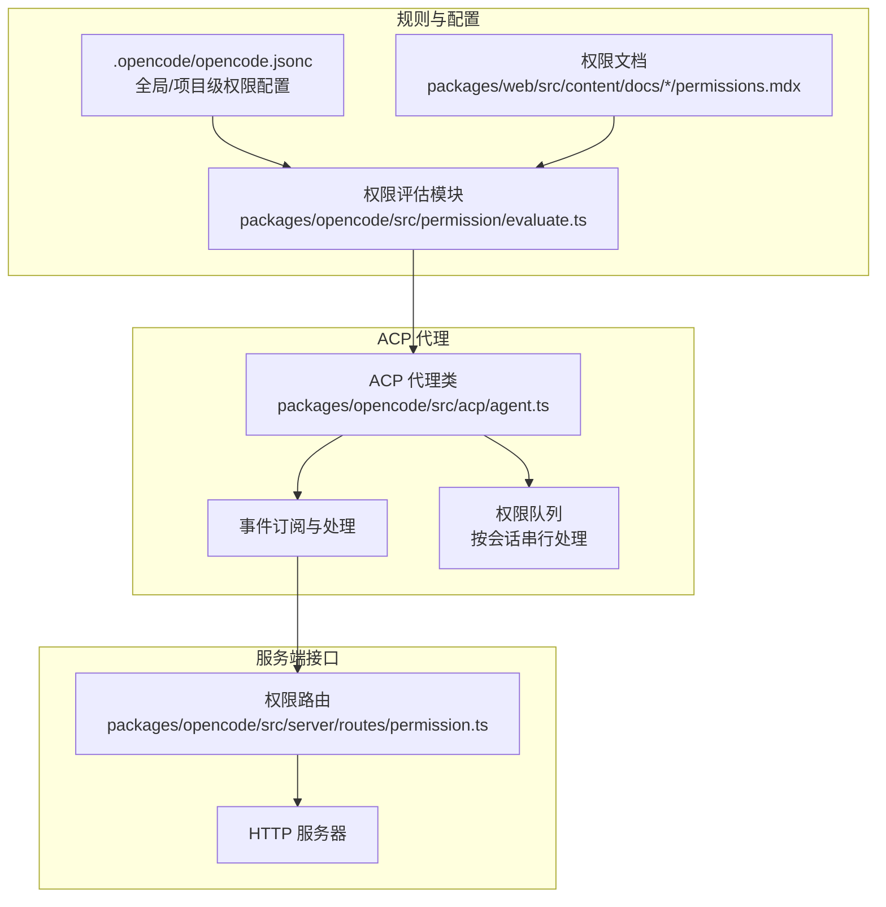
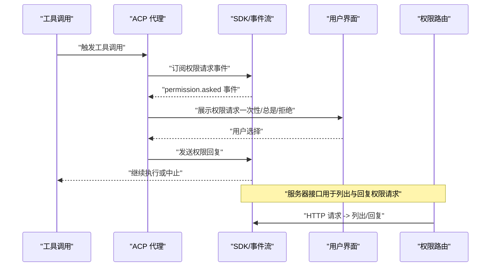
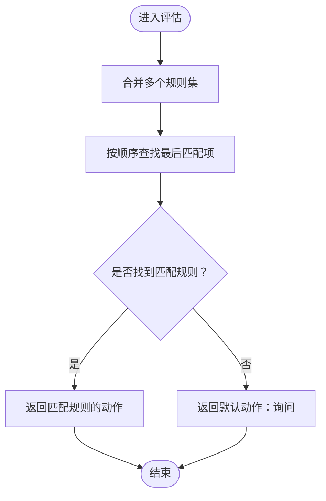
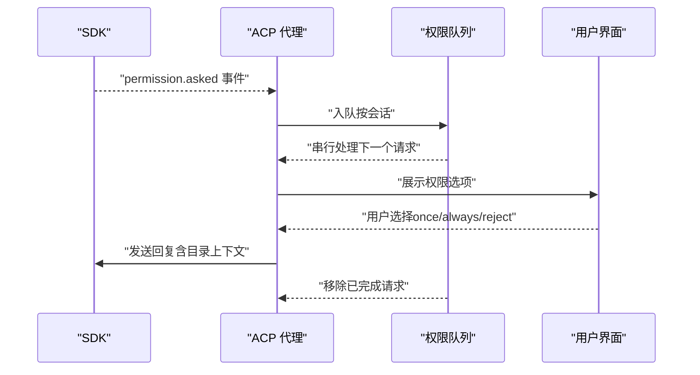
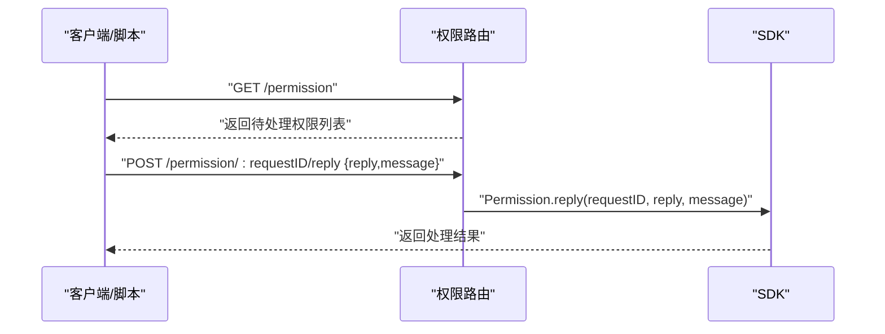
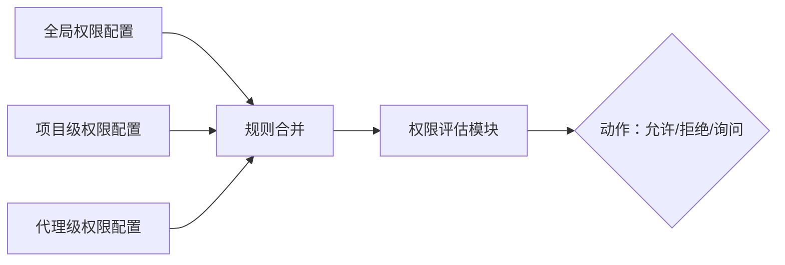
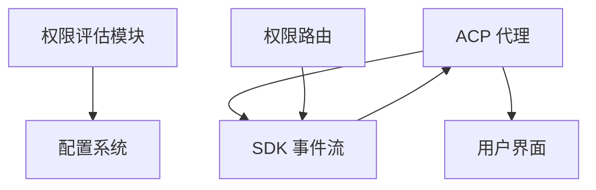

# 权限控制系统

<cite>
**本文档引用的文件**
- [SECURITY.md](file://SECURITY.md)
- [README.md](file://README.md)
- [.opencode/opencode.jsonc](file://.opencode/opencode.jsonc)
- [packages/opencode/src/permission/evaluate.ts](file://packages/opencode/src/permission/evaluate.ts)
- [packages/opencode/src/acp/agent.ts](file://packages/opencode/src/acp/agent.ts)
- [packages/opencode/src/server/routes/permission.ts](file://packages/opencode/src/server/routes/permission.ts)
- [packages/web/src/content/docs/ko/permissions.mdx](file://packages/web/src/content/docs/ko/permissions.mdx)
- [packages/web/src/content/docs/tr/permissions.mdx](file://packages/web/src/content/docs/tr/permissions.mdx)
- [packages/opencode/test/agent/agent.test.ts](file://packages/opencode/test/agent/agent.test.ts)
- [packages/opencode/test/acp/event-subscription.test.ts](file://packages/opencode/test/acp/event-subscription.test.ts)
- [packages/opencode/test/permission-task.test.ts](file://packages/opencode/test/permission-task.test.ts)
- [packages/opencode/test/util/wildcard.test.ts](file://packages/opencode/test/util/wildcard.test.ts)
</cite>

## 目录
1. [简介](#简介)
2. [项目结构](#项目结构)
3. [核心组件](#核心组件)
4. [架构总览](#架构总览)
5. [详细组件分析](#详细组件分析)
6. [依赖关系分析](#依赖关系分析)
7. [性能考虑](#性能考虑)
8. [故障排除指南](#故障排除指南)
9. [结论](#结论)
10. [附录](#附录)

## 简介
本文件面向 OpenCode 的权限控制系统，系统性阐述权限架构设计、权限规则定义、用户身份验证与授权流程、不同代理的权限差异、文件操作与命令执行权限控制等核心机制。同时提供配置与管理权限规则的方法（全局权限、项目级权限、用户权限分配），并总结安全最佳实践与风险防范措施，帮助用户建立完善的安全管理体系。

## 项目结构
OpenCode 的权限控制由多层协作实现：
- 规则引擎：基于通配符匹配的规则评估模块，负责对权限请求进行决策。
- ACP（Agent Control Plane）代理：订阅全局事件，拦截需要用户确认的权限请求，并通过 UI 或 API 进行交互。
- 服务器路由：提供 HTTP 接口用于列出待处理权限请求与回复权限请求。
- 配置文件：支持在全局与项目级配置权限规则，覆盖默认行为。
- 文档与测试：官方文档提供规则示例与说明；测试用例覆盖合并策略、会话隔离与事件处理。

**图表来源**
- [packages/opencode/src/permission/evaluate.ts:1-16](file://packages/opencode/src/permission/evaluate.ts#L1-L16)
- [.opencode/opencode.jsonc:1-19](file://.opencode/opencode.jsonc#L1-L19)
- [packages/opencode/src/acp/agent.ts:184-265](file://packages/opencode/src/acp/agent.ts#L184-L265)
- [packages/opencode/src/server/routes/permission.ts:1-70](file://packages/opencode/src/server/routes/permission.ts#L1-L70)

**章节来源**
- [README.md:100-114](file://README.md#L100-L114)
- [.opencode/opencode.jsonc:1-19](file://.opencode/opencode.jsonc#L1-L19)
- [packages/opencode/src/permission/evaluate.ts:1-16](file://packages/opencode/src/permission/evaluate.ts#L1-L16)
- [packages/opencode/src/acp/agent.ts:184-265](file://packages/opencode/src/acp/agent.ts#L184-L265)
- [packages/opencode/src/server/routes/permission.ts:1-70](file://packages/opencode/src/server/routes/permission.ts#L1-L70)

## 核心组件
- 权限评估模块：提供规则合并与匹配能力，支持通配符模式，返回允许、拒绝或询问三种动作。
- ACP 代理：订阅全局事件，拦截“权限请求”事件，向用户展示可选操作（一次性允许、总是允许、拒绝），并将结果回传给 SDK。
- 服务器路由：提供列出待处理权限与回复权限的 HTTP 接口，便于远程或自动化场景使用。
- 配置系统：支持在全局与项目级配置权限规则，优先级与合并策略确保灵活性与安全性。
- 文档与测试：官方文档提供规则示例与说明；测试覆盖规则合并、会话隔离与事件处理等关键行为。

**章节来源**
- [packages/opencode/src/permission/evaluate.ts:1-16](file://packages/opencode/src/permission/evaluate.ts#L1-L16)
- [packages/opencode/src/acp/agent.ts:144-148](file://packages/opencode/src/acp/agent.ts#L144-L148)
- [packages/opencode/src/server/routes/permission.ts:9-70](file://packages/opencode/src/server/routes/permission.ts#L9-L70)
- [.opencode/opencode.jsonc:8-12](file://.opencode/opencode.jsonc#L8-L12)
- [packages/web/src/content/docs/ko/permissions.mdx:156-189](file://packages/web/src/content/docs/ko/permissions.mdx#L156-L189)

## 架构总览
下图展示了从工具调用到权限决策与用户交互的关键路径，以及服务器接口的参与方式。

**图表来源**
- [packages/opencode/src/acp/agent.ts:184-265](file://packages/opencode/src/acp/agent.ts#L184-L265)
- [packages/opencode/src/server/routes/permission.ts:36-46](file://packages/opencode/src/server/routes/permission.ts#L36-L46)

## 详细组件分析

### 权限评估模块
- 规则结构：包含权限类型、模式与动作（允许/拒绝/询问）。
- 匹配策略：使用通配符匹配权限类型与模式，采用后向查找以保留更具体的规则优先级。
- 返回值：若无匹配规则，默认返回“询问”，确保不会静默放行高风险操作。

**图表来源**
- [packages/opencode/src/permission/evaluate.ts:9-15](file://packages/opencode/src/permission/evaluate.ts#L9-L15)

**章节来源**
- [packages/opencode/src/permission/evaluate.ts:1-16](file://packages/opencode/src/permission/evaluate.ts#L1-L16)
- [packages/opencode/test/util/wildcard.test.ts](file://packages/opencode/test/util/wildcard.test.ts)

### ACP 代理与权限队列
- 事件订阅：持续监听全局事件流，识别“权限请求”事件。
- 权限选项：提供一次性允许、总是允许、拒绝三种选项，用于即时与持久授权。
- 会话隔离：按会话维护串行队列，避免并发权限请求导致的竞态与状态混乱。
- 特殊处理：对于编辑权限，若用户选择总是允许，代理会根据元数据计算并应用补丁，确保最小化变更。

**图表来源**
- [packages/opencode/src/acp/agent.ts:184-265](file://packages/opencode/src/acp/agent.ts#L184-L265)
- [packages/opencode/src/acp/agent.ts:143-148](file://packages/opencode/src/acp/agent.ts#L143-L148)

**章节来源**
- [packages/opencode/src/acp/agent.ts:143-148](file://packages/opencode/src/acp/agent.ts#L143-L148)
- [packages/opencode/src/acp/agent.ts:184-265](file://packages/opencode/src/acp/agent.ts#L184-L265)
- [packages/opencode/test/acp/event-subscription.test.ts:372-408](file://packages/opencode/test/acp/event-subscription.test.ts#L372-L408)

### 服务器权限路由
- 列出待处理权限：返回所有会话中的待处理权限请求，便于集中查看与处理。
- 回复权限请求：接收用户通过 UI 或自动化脚本做出的决定，并写入 SDK 事件流。
- 安全注意：服务器模式需设置密码以启用 HTTP 基本身份认证；未设置时运行于未认证状态并给出警告。

**图表来源**
- [packages/opencode/src/server/routes/permission.ts:9-70](file://packages/opencode/src/server/routes/permission.ts#L9-L70)

**章节来源**
- [packages/opencode/src/server/routes/permission.ts:9-70](file://packages/opencode/src/server/routes/permission.ts#L9-L70)
- [SECURITY.md:21-24](file://SECURITY.md#L21-L24)

### 配置与规则管理
- 全局权限：在全局配置文件中定义默认规则，适用于所有代理与会话。
- 项目级权限：在项目配置中覆盖全局规则，实现更细粒度的控制。
- 代理级权限：每个代理可独立配置权限，优先级高于全局配置。
- 规则示例：文档提供了读取权限的示例配置，展示如何通过通配符模式精确控制敏感文件访问。

**图表来源**
- [.opencode/opencode.jsonc:8-12](file://.opencode/opencode.jsonc#L8-L12)
- [packages/web/src/content/docs/ko/permissions.mdx:156-189](file://packages/web/src/content/docs/ko/permissions.mdx#L156-L189)
- [packages/web/src/content/docs/tr/permissions.mdx:183-186](file://packages/web/src/content/docs/tr/permissions.mdx#L183-L186)

**章节来源**
- [.opencode/opencode.jsonc:8-12](file://.opencode/opencode.jsonc#L8-L12)
- [packages/web/src/content/docs/ko/permissions.mdx:156-189](file://packages/web/src/content/docs/ko/permissions.mdx#L156-L189)
- [packages/web/src/content/docs/tr/permissions.mdx:183-186](file://packages/web/src/content/docs/tr/permissions.mdx#L183-L186)
- [packages/opencode/test/agent/agent.test.ts:201-244](file://packages/opencode/test/agent/agent.test.ts#L201-L244)

### 不同代理的权限差异
- 默认代理（build）：全功能代理，适合开发工作。
- 只读代理（plan）：默认拒绝文件编辑，运行命令前会请求权限，适合探索与规划。
- 通用子代理（general）：用于复杂搜索与多步任务，内部使用。

**章节来源**
- [README.md:100-114](file://README.md#L100-L114)

## 依赖关系分析
- 组件耦合：
  - 权限评估模块与配置系统解耦，通过规则集输入进行评估。
  - ACP 代理依赖 SDK 事件流与 UI 交互，保持与业务逻辑的松耦合。
  - 服务器路由仅作为外部接口，不直接参与业务决策。
- 外部依赖：
  - 通配符匹配库用于规则模式匹配。
  - HTTP 框架用于暴露权限路由。
- 潜在环路：
  - 事件流与路由之间无直接循环依赖，通过 SDK 作为中介。

**图表来源**
- [packages/opencode/src/permission/evaluate.ts:1-16](file://packages/opencode/src/permission/evaluate.ts#L1-L16)
- [packages/opencode/src/acp/agent.ts:184-265](file://packages/opencode/src/acp/agent.ts#L184-L265)
- [packages/opencode/src/server/routes/permission.ts:1-70](file://packages/opencode/src/server/routes/permission.ts#L1-L70)

**章节来源**
- [packages/opencode/src/permission/evaluate.ts:1-16](file://packages/opencode/src/permission/evaluate.ts#L1-L16)
- [packages/opencode/src/acp/agent.ts:184-265](file://packages/opencode/src/acp/agent.ts#L184-L265)
- [packages/opencode/src/server/routes/permission.ts:1-70](file://packages/opencode/src/server/routes/permission.ts#L1-L70)

## 性能考虑
- 规则评估：通配符匹配为线性扫描，建议合理组织规则顺序，将更具体的规则置于靠后位置以减少不必要的匹配开销。
- 事件处理：按会话串行处理权限请求，避免并发冲突，但可能带来延迟；可通过优化 UI 响应与批量处理提升体验。
- 服务器接口：路由层仅做参数校验与转发，性能瓶颈通常不在接口层。

## 故障排除指南
- 权限请求未出现：
  - 检查事件订阅是否正常启动与运行。
  - 确认工具调用确实触发了需要权限的请求。
- 权限回复无效：
  - 确认请求 ID 正确且仍在有效期内。
  - 检查服务器密码配置与认证状态。
- 会话间权限混乱：
  - 确保按会话的权限队列正常工作，避免跨会话共享状态。
- 规则未生效：
  - 检查规则合并顺序与优先级，确认代理级规则覆盖了全局规则。

**章节来源**
- [packages/opencode/src/acp/agent.ts:158-182](file://packages/opencode/src/acp/agent.ts#L158-L182)
- [packages/opencode/src/server/routes/permission.ts:36-46](file://packages/opencode/src/server/routes/permission.ts#L36-L46)
- [SECURITY.md:21-24](file://SECURITY.md#L21-L24)

## 结论
OpenCode 的权限控制系统通过“规则评估 + 事件驱动 + 用户交互”的组合，在本地运行环境中提供了可控且可审计的操作边界。配合全局/项目/代理三级权限配置，用户可以灵活地平衡便利性与安全性。建议在生产环境谨慎开放服务器模式，并结合最小权限原则与定期审计，构建完善的安全管理体系。

## 附录
- 官方文档示例：读取权限的配置示例与“总是/一次性/拒绝”选项说明。
- 测试用例参考：规则合并、会话隔离与事件处理的行为验证。

**章节来源**
- [packages/web/src/content/docs/ko/permissions.mdx:156-189](file://packages/web/src/content/docs/ko/permissions.mdx#L156-L189)
- [packages/opencode/test/agent/agent.test.ts:201-244](file://packages/opencode/test/agent/agent.test.ts#L201-L244)
- [packages/opencode/test/acp/event-subscription.test.ts:372-408](file://packages/opencode/test/acp/event-subscription.test.ts#L372-L408)