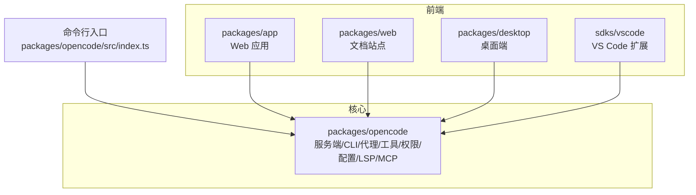
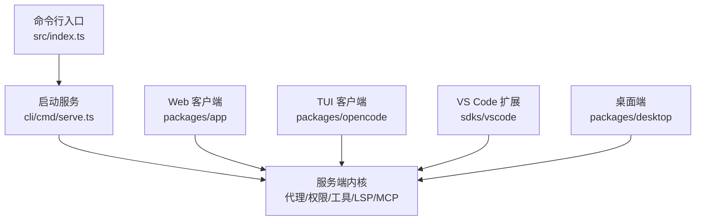
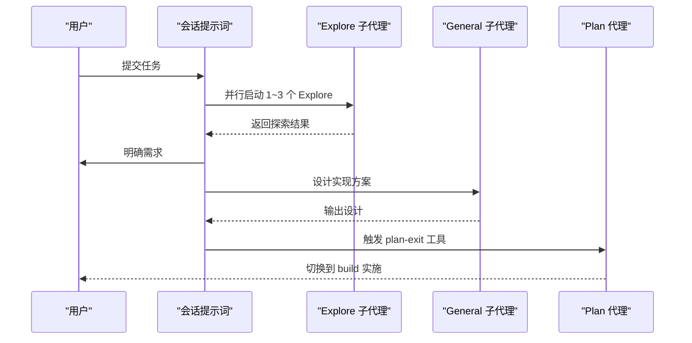
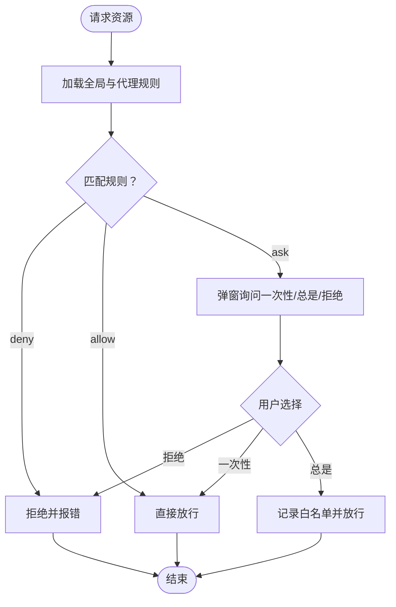
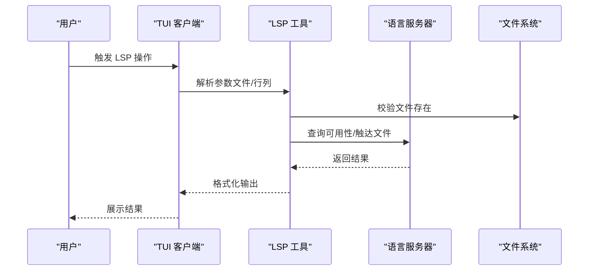
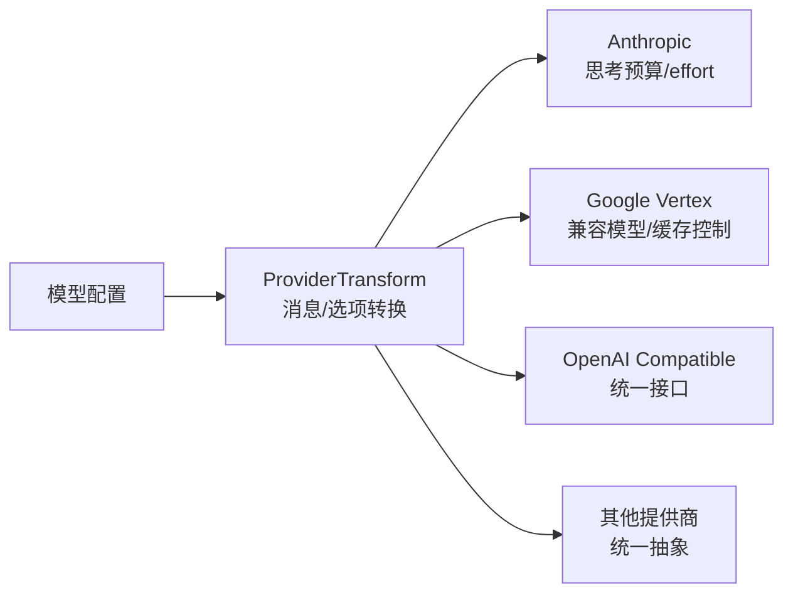
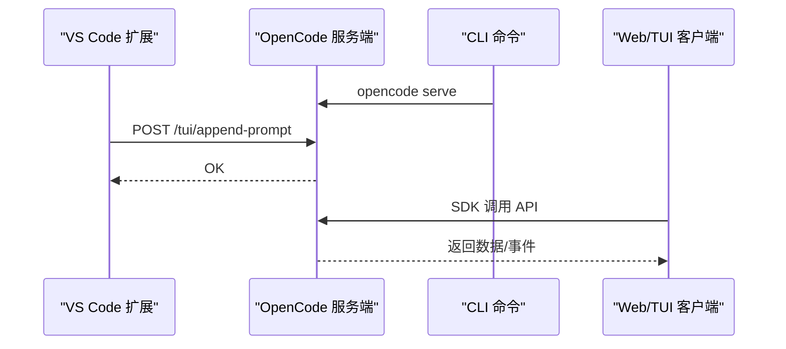
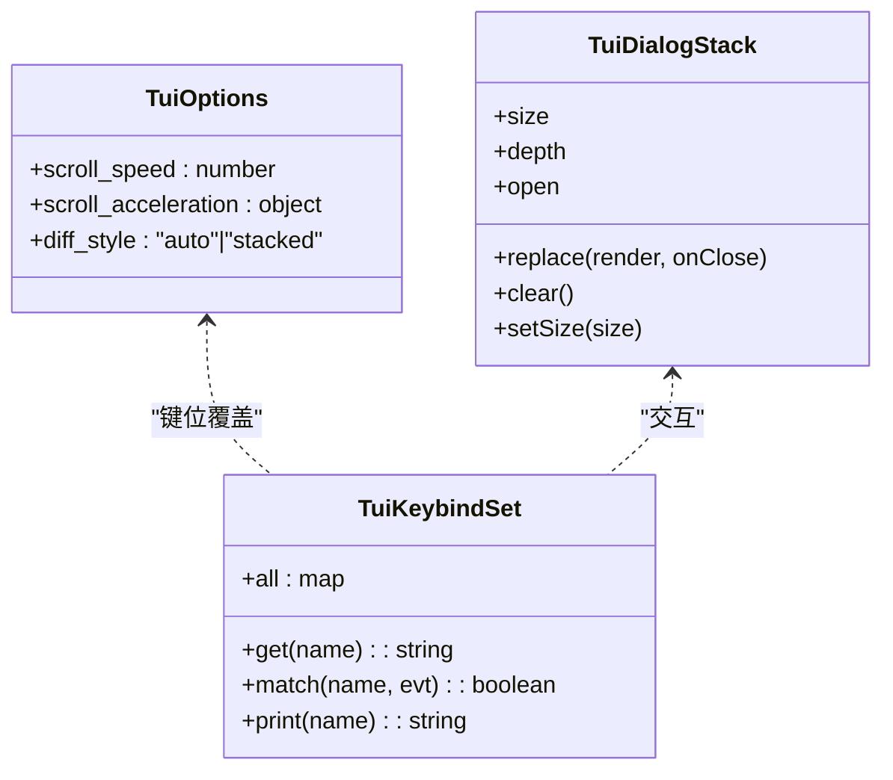
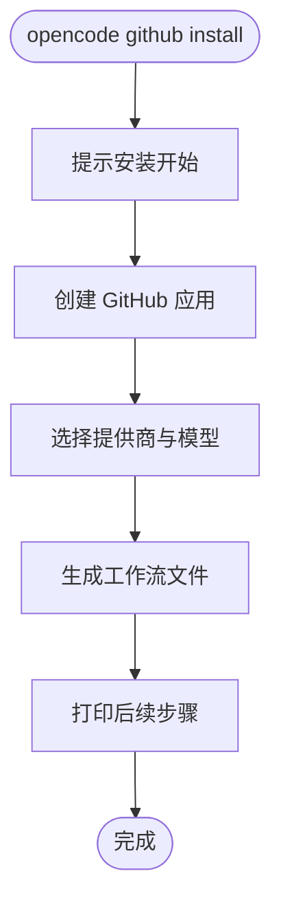
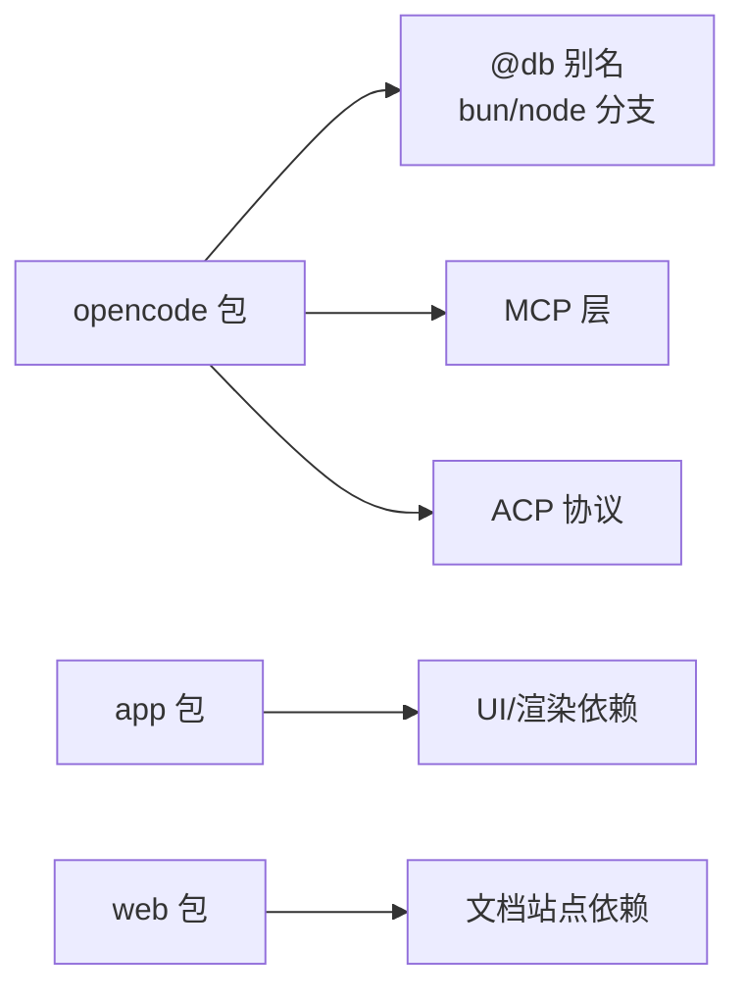

# 核心特性

<cite>
**本文引用的文件**
- [README.md](file://README.md)
- [AGENTS.md](file://AGENTS.md)
- [packages/opencode/package.json](file://packages/opencode/package.json)
- [packages/app/package.json](file://packages/app/package.json)
- [packages/web/package.json](file://packages/web/package.json)
- [packages/opencode/src/index.ts](file://packages/opencode/src/index.ts)
- [packages/opencode/src/cli/cmd/serve.ts](file://packages/opencode/src/cli/cmd/serve.ts)
- [packages/opencode/src/agent/generate.txt](file://packages/opencode/src/agent/generate.txt)
- [packages/opencode/src/tool/plan-exit.txt](file://packages/opencode/src/tool/plan-exit.txt)
- [packages/opencode/test/agent/agent.test.ts](file://packages/opencode/test/agent/agent.test.ts)
- [packages/opencode/src/session/prompt.ts](file://packages/opencode/src/session/prompt.ts)
- [packages/opencode/src/tool/lsp.ts](file://packages/opencode/src/tool/lsp.ts)
- [packages/opencode/src/permission/schema.ts](file://packages/opencode/src/permission/schema.ts)
- [packages/opencode/src/permission/index.ts](file://packages/opencode/src/permission/index.ts)
- [packages/opencode/src/config/config.ts](file://packages/opencode/src/config/config.ts)
- [packages/opencode/src/config/tui-schema.ts](file://packages/opencode/src/config/tui-schema.ts)
- [packages/opencode/src/mcp/index.ts](file://packages/opencode/src/mcp/index.ts)
- [packages/opencode/src/ide/index.ts](file://packages/opencode/src/ide/index.ts)
- [sdks/vscode/src/extension.ts](file://sdks/vscode/src/extension.ts)
- [packages/opencode/src/provider/transform.ts](file://packages/opencode/src/provider/transform.ts)
- [packages/opencode/test/provider/transform.test.ts](file://packages/opencode/test/provider/transform.test.ts)
- [packages/opencode/test/provider/provider.test.ts](file://packages/opencode/test/provider/provider.test.ts)
- [packages/app/src/context/global-sdk.tsx](file://packages/app/src/context/global-sdk.tsx)
- [packages/opencode/src/cli/cmd/github.ts](file://packages/opencode/src/cli/cmd/github.ts)
- [.opencode/plugins/tui-smoke.tsx](file://.opencode/plugins/tui-smoke.tsx)
- [packages/plugin/src/tui.ts](file://packages/plugin/src/tui.ts)
- [packages/sdk/js/src/gen/sdk.gen.ts](file://packages/sdk/js/src/gen/sdk.gen.ts)
- [packages/opencode/src/acp/README.md](file://packages/opencode/src/acp/README.md)
- [packages/opencode/src/cli/cmd/tui/feature-plugins/sidebar/lsp.tsx](file://packages/opencode/src/cli/cmd/tui/feature-plugins/sidebar/lsp.tsx)
</cite>

## 目录
1. [简介](#简介)
2. [项目结构](#项目结构)
3. [核心组件](#核心组件)
4. [架构总览](#架构总览)
5. [详细组件分析](#详细组件分析)
6. [依赖关系分析](#依赖关系分析)
7. [性能考量](#性能考量)
8. [故障排查指南](#故障排查指南)
9. [结论](#结论)
10. [附录](#附录)

## 简介
本文件面向使用者与开发者，系统化梳理 OpenCode 的核心特性与实现要点，重点覆盖：
- 多代理系统：build、plan、general 子代理及其工作流
- 多模型提供商支持：OpenAI、Anthropic、Google 等生态集成与适配
- 终端友好（TUI）的用户界面设计与可定制化
- 权限控制系统：规则定义、评估与交互式授权
- 技术创新点：客户端/服务器架构、LSP 支持、跨平台部署与插件化扩展
- 使用示例与最佳实践：从安装到日常使用的完整路径

## 项目结构
OpenCode 采用多包（monorepo）组织方式，围绕“服务端内核 + 前端应用 + 文档站点 + VS Code 扩展 + 桌面端”协同工作：
- packages/opencode：命令行入口、服务端、代理、工具、权限、配置、LSP、MCP 等核心逻辑
- packages/app：Web 应用前端（Solid + Vite），提供图形化界面
- packages/web：文档站点（Astro + Starlight）
- sdks/vscode：VS Code 扩展，桥接本地 OpenCode 服务
- packages/desktop：桌面端应用
- 其他包：插件、工具、企业版、脚本等

图示来源
- [packages/opencode/src/index.ts:1-241](file://packages/opencode/src/index.ts#L1-L241)
- [packages/opencode/package.json:1-164](file://packages/opencode/package.json#L1-L164)
- [packages/app/package.json:1-78](file://packages/app/package.json#L1-L78)
- [packages/web/package.json:1-45](file://packages/web/package.json#L1-L45)

章节来源
- [packages/opencode/src/index.ts:1-241](file://packages/opencode/src/index.ts#L1-L241)
- [packages/opencode/package.json:1-164](file://packages/opencode/package.json#L1-L164)
- [packages/app/package.json:1-78](file://packages/app/package.json#L1-L78)
- [packages/web/package.json:1-45](file://packages/web/package.json#L1-L45)

## 核心组件
- 多代理系统：build（默认主代理，全权限）、plan（受限主代理，需授权执行文件编辑与命令）、general（复杂任务子代理）
- 权限控制：基于规则集的“ask/allow/deny”，支持按代理、按模式（primary/subagent）叠加
- LSP 集成：内置 LSP 工具与 TUI 侧边栏展示，支持多语言服务器连接
- 客户端/服务器架构：CLI 启动服务，TUI/Web/VS Code 等作为客户端访问
- 多模型提供商：通过 ai-sdk 生态统一抽象，覆盖 OpenAI、Anthropic、Google 等
- 可插拔与可定制：TUI 主题、键位绑定、插件系统、企业级托管配置

章节来源
- [README.md:100-114](file://README.md#L100-L114)
- [packages/opencode/src/agent/generate.txt:11-34](file://packages/opencode/src/agent/generate.txt#L11-L34)
- [packages/opencode/src/tool/plan-exit.txt:1-13](file://packages/opencode/src/tool/plan-exit.txt#L1-L13)
- [packages/opencode/src/tool/lsp.ts:1-97](file://packages/opencode/src/tool/lsp.ts#L1-L97)
- [packages/opencode/src/permission/schema.ts:1-17](file://packages/opencode/src/permission/schema.ts#L1-L17)
- [packages/opencode/src/permission/index.ts:128-165](file://packages/opencode/src/permission/index.ts#L128-L165)
- [packages/opencode/src/config/config.ts:432-468](file://packages/opencode/src/config/config.ts#L432-L468)
- [packages/opencode/src/config/tui-schema.ts:1-36](file://packages/opencode/src/config/tui-schema.ts#L1-L36)

## 架构总览
OpenCode 的运行时由“命令行入口”驱动，解析参数后启动服务或进入 TUI；服务端负责代理调度、权限评估、工具调用、LSP 交互、MCP 连接等；前端（Web/TUI/VS Code/桌面）作为客户端通过 HTTP 或本地通道与服务端通信。

图示来源
- [packages/opencode/src/index.ts:1-241](file://packages/opencode/src/index.ts#L1-L241)
- [packages/opencode/src/cli/cmd/serve.ts:1-25](file://packages/opencode/src/cli/cmd/serve.ts#L1-L25)

章节来源
- [packages/opencode/src/index.ts:1-241](file://packages/opencode/src/index.ts#L1-L241)
- [packages/opencode/src/cli/cmd/serve.ts:1-25](file://packages/opencode/src/cli/cmd/serve.ts#L1-L25)

## 详细组件分析

### 多代理系统与工作流
- build 代理：默认主代理，具备全量工具权限，适合开发与变更操作
- plan 代理：受限主代理，默认对文件编辑与 bash 命令采用“ask”策略，适合探索与规划
- general 子代理：用于复杂搜索与多步任务，可并行启动以提升效率
- plan 结束工具：在完成规划后引导切换至 build 实施计划
- 会话提示词：明确规划阶段的并行探索与设计流程

图示来源
- [packages/opencode/src/session/prompt.ts:319-339](file://packages/opencode/src/session/prompt.ts#L319-L339)
- [packages/opencode/src/tool/plan-exit.txt:1-13](file://packages/opencode/src/tool/plan-exit.txt#L1-L13)

章节来源
- [README.md:100-114](file://README.md#L100-L114)
- [packages/opencode/test/agent/agent.test.ts:246-264](file://packages/opencode/test/agent/agent.test.ts#L246-L264)
- [packages/opencode/test/agent/agent.test.ts:683-717](file://packages/opencode/test/agent/agent.test.ts#L683-L717)
- [packages/opencode/src/agent/generate.txt:11-34](file://packages/opencode/src/agent/generate.txt#L11-L34)
- [packages/opencode/src/session/prompt.ts:319-339](file://packages/opencode/src/session/prompt.ts#L319-L339)
- [packages/opencode/src/tool/plan-exit.txt:1-13](file://packages/opencode/src/tool/plan-exit.txt#L1-L13)

### 权限控制系统
- 规则定义：支持字符串或对象两种粒度，保留原始键序，支持通配符与环境变量注入
- 评估机制：按代理/全局规则叠加，优先级由代理规则覆盖全局
- 交互策略：ask 模式下提供“一次性/总是/拒绝”的决策，支持基于工具生成的建议白名单
- 默认策略：读取默认宽松，敏感文件（如 .env）默认拒绝，避免泄露

图示来源
- [packages/opencode/src/config/config.ts:432-468](file://packages/opencode/src/config/config.ts#L432-L468)
- [packages/opencode/src/permission/schema.ts:1-17](file://packages/opencode/src/permission/schema.ts#L1-L17)
- [packages/opencode/src/permission/index.ts:128-165](file://packages/opencode/src/permission/index.ts#L128-L165)

章节来源
- [packages/opencode/src/config/config.ts:432-468](file://packages/opencode/src/config/config.ts#L432-L468)
- [packages/opencode/src/permission/schema.ts:1-17](file://packages/opencode/src/permission/schema.ts#L1-L17)
- [packages/opencode/src/permission/index.ts:128-165](file://packages/opencode/src/permission/index.ts#L128-L165)

### LSP 支持与 TUI 集成
- LSP 工具：封装常用操作（跳转定义、引用、悬停、符号、调用层级等），自动校验文件存在性与 LSP 可用性，并触发文件触达
- TUI 侧边栏：显示已连接的 LSP 列表与根目录，支持展开/折叠与状态指示
- IDE 识别：检测当前 IDE（如 VS Code）并注入环境变量，便于联动

图示来源
- [packages/opencode/src/tool/lsp.ts:1-97](file://packages/opencode/src/tool/lsp.ts#L1-L97)
- [packages/opencode/src/cli/cmd/tui/feature-plugins/sidebar/lsp.tsx:12-66](file://packages/opencode/src/cli/cmd/tui/feature-plugins/sidebar/lsp.tsx#L12-L66)
- [packages/opencode/src/ide/index.ts:1-49](file://packages/opencode/src/ide/index.ts#L1-L49)

章节来源
- [packages/opencode/src/tool/lsp.ts:1-97](file://packages/opencode/src/tool/lsp.ts#L1-L97)
- [packages/opencode/src/cli/cmd/tui/feature-plugins/sidebar/lsp.tsx:12-66](file://packages/opencode/src/cli/cmd/tui/feature-plugins/sidebar/lsp.tsx#L12-L66)
- [packages/opencode/src/ide/index.ts:1-49](file://packages/opencode/src/ide/index.ts#L1-L49)

### 多模型提供商支持与适配
- 生态覆盖：通过 ai-sdk 生态统一抽象，支持 OpenAI、Anthropic、Google、Azure、Bedrock、TogetherAI、Cerebras、Mistral、Perplexity、Vercel、X.AI、Amazon Bedrock、Google Vertex、OpenRouter 等
- 适配策略：针对不同提供商（如 Anthropic 思维预算、Google Vertex 兼容模型）进行消息与选项转换
- 兼容层：Vertex OpenAI 兼容模型映射，简化配置与调用

图示来源
- [packages/opencode/src/provider/transform.ts:551-583](file://packages/opencode/src/provider/transform.ts#L551-L583)
- [packages/opencode/test/provider/transform.test.ts:107-1847](file://packages/opencode/test/provider/transform.test.ts#L107-L1847)
- [packages/opencode/test/provider/provider.test.ts:2188-2233](file://packages/opencode/test/provider/provider.test.ts#L2188-L2233)

章节来源
- [packages/opencode/src/provider/transform.ts:551-583](file://packages/opencode/src/provider/transform.ts#L551-L583)
- [packages/opencode/test/provider/transform.test.ts:107-1847](file://packages/opencode/test/provider/transform.test.ts#L107-L1847)
- [packages/opencode/test/provider/provider.test.ts:2188-2233](file://packages/opencode/test/provider/provider.test.ts#L2188-L2233)

### 客户端/服务器架构与跨平台部署
- 服务端：CLI 提供 serve 命令，监听网络地址，支持未设置密码时的安全警告
- 客户端：TUI、Web、VS Code 扩展、桌面端均通过 HTTP 访问服务端
- 插件与 MCP：支持本地/远程 MCP 传输，带超时与资源安全关闭
- VS Code 扩展：向本地服务追加提示文本，自动解析选区与行号
- 全局 SDK：前端应用通过统一 SDK 创建客户端，支持事件订阅与错误抛出

图示来源
- [packages/opencode/src/cli/cmd/serve.ts:1-25](file://packages/opencode/src/cli/cmd/serve.ts#L1-L25)
- [sdks/vscode/src/extension.ts:93-137](file://sdks/vscode/src/extension.ts#L93-L137)
- [packages/app/src/context/global-sdk.tsx:225-250](file://packages/app/src/context/global-sdk.tsx#L225-L250)
- [packages/opencode/src/mcp/index.ts:242-271](file://packages/opencode/src/mcp/index.ts#L242-L271)
- [packages/sdk/js/src/gen/sdk.gen.ts:1091-1127](file://packages/sdk/js/src/gen/sdk.gen.ts#L1091-L1127)

章节来源
- [packages/opencode/src/cli/cmd/serve.ts:1-25](file://packages/opencode/src/cli/cmd/serve.ts#L1-L25)
- [sdks/vscode/src/extension.ts:93-137](file://sdks/vscode/src/extension.ts#L93-L137)
- [packages/app/src/context/global-sdk.tsx:225-250](file://packages/app/src/context/global-sdk.tsx#L225-L250)
- [packages/opencode/src/mcp/index.ts:242-271](file://packages/opencode/src/mcp/index.ts#L242-L271)
- [packages/sdk/js/src/gen/sdk.gen.ts:1091-1127](file://packages/sdk/js/src/gen/sdk.gen.ts#L1091-L1127)

### 终端友好（TUI）界面设计与可定制
- TUI 选项：滚动速度、滚动加速、差异样式（自动/堆叠）
- 键位绑定：可覆盖默认键位，支持对话框栈与尺寸管理
- 主题与插件：支持主题切换与插件启用/禁用，TUI 插件可自定义侧边栏、Logo 等
- VS Code 集成：自动识别 VS Code 环境，注入 OPENCODE_CALLER 便于联动

图示来源
- [packages/opencode/src/config/tui-schema.ts:1-36](file://packages/opencode/src/config/tui-schema.ts#L1-L36)
- [packages/plugin/src/tui.ts:71-127](file://packages/plugin/src/tui.ts#L71-L127)
- [.opencode/plugins/tui-smoke.tsx:618-642](file://.opencode/plugins/tui-smoke.tsx#L618-L642)
- [packages/opencode/src/ide/index.ts:1-49](file://packages/opencode/src/ide/index.ts#L1-L49)

章节来源
- [packages/opencode/src/config/tui-schema.ts:1-36](file://packages/opencode/src/config/tui-schema.ts#L1-L36)
- [packages/plugin/src/tui.ts:71-127](file://packages/plugin/src/tui.ts#L71-L127)
- [.opencode/plugins/tui-smoke.tsx:618-642](file://.opencode/plugins/tui-smoke.tsx#L618-L642)
- [packages/opencode/src/ide/index.ts:1-49](file://packages/opencode/src/ide/index.ts#L1-L49)

### GitHub 集成与工作流安装
- 提供安装命令，引导创建 GitHub 应用、选择提供商与模型、生成工作流文件
- 针对特定提供商（如 Amazon Bedrock）给出 OIDC 配置指引

图示来源
- [packages/opencode/src/cli/cmd/github.ts:199-236](file://packages/opencode/src/cli/cmd/github.ts#L199-L236)

章节来源
- [packages/opencode/src/cli/cmd/github.ts:199-236](file://packages/opencode/src/cli/cmd/github.ts#L199-L236)

## 依赖关系分析
- 包导出与别名：opencode 包通过 imports 为数据库模块提供平台分支（bun/node），便于跨平台编译与运行
- 前端包：app/web 包含大量 UI 与渲染依赖，支撑 Web/TUI/桌面端
- ACP/MCP：服务端通过 MCP 层连接外部模型/工具，提供统一协议与资源安全

图示来源
- [packages/opencode/package.json:28-37](file://packages/opencode/package.json#L28-L37)
- [packages/app/package.json:41-76](file://packages/app/package.json#L41-L76)
- [packages/web/package.json:14-44](file://packages/web/package.json#L14-L44)
- [packages/opencode/src/mcp/index.ts:242-271](file://packages/opencode/src/mcp/index.ts#L242-L271)
- [packages/opencode/src/acp/README.md:170-175](file://packages/opencode/src/acp/README.md#L170-L175)

章节来源
- [packages/opencode/package.json:28-37](file://packages/opencode/package.json#L28-L37)
- [packages/app/package.json:41-76](file://packages/app/package.json#L41-L76)
- [packages/web/package.json:14-44](file://packages/web/package.json#L14-L44)
- [packages/opencode/src/mcp/index.ts:242-271](file://packages/opencode/src/mcp/index.ts#L242-L271)
- [packages/opencode/src/acp/README.md:170-175](file://packages/opencode/src/acp/README.md#L170-L175)

## 性能考量
- 并行探索：规划阶段最多并行启动 3 个 Explore 子代理，以缩短理解与定位时间
- 滚动优化：TUI 支持滚动速度与加速配置，降低长输出滚动负担
- 缓存控制：针对部分提供商（如 Google Vertex Anthropic）自动注入缓存控制参数，减少重复计算
- 资源安全：MCP 连接采用超时与资源释放，避免子进程悬挂

章节来源
- [packages/opencode/src/session/prompt.ts:326-330](file://packages/opencode/src/session/prompt.ts#L326-L330)
- [packages/opencode/src/config/tui-schema.ts:14-25](file://packages/opencode/src/config/tui-schema.ts#L14-L25)
- [packages/opencode/src/provider/transform.ts:551-583](file://packages/opencode/src/provider/transform.ts#L551-L583)
- [packages/opencode/src/mcp/index.ts:257-269](file://packages/opencode/src/mcp/index.ts#L257-L269)

## 故障排查指南
- 数据库迁移：首次运行会进行 SQLite 迁移，进度可通过 TTY 进度条观察
- 权限问题：若出现 ask 循环，检查规则配置与代理叠加顺序；必要时使用“总是”白名单
- LSP 不可用：确认目标文件类型有对应 LSP 服务器，或检查文件是否存在
- 服务未受保护：serve 时未设置密码会提示风险，建议生产环境配置密码
- VS Code 集成：确保扩展与本地服务在同一主机通信，检查端口与 CORS 设置

章节来源
- [packages/opencode/src/index.ts:111-146](file://packages/opencode/src/index.ts#L111-L146)
- [packages/opencode/src/tool/lsp.ts:56-59](file://packages/opencode/src/tool/lsp.ts#L56-L59)
- [packages/opencode/src/cli/cmd/serve.ts:14-16](file://packages/opencode/src/cli/cmd/serve.ts#L14-L16)
- [sdks/vscode/src/extension.ts:93-137](file://sdks/vscode/src/extension.ts#L93-L137)

## 结论
OpenCode 以“多代理 + 权限 + LSP + 多提供商 + 客户端/服务器 + TUI 可定制”为核心能力，既满足终端用户的高效体验，又提供企业级的可控性与可扩展性。通过统一的配置与规则体系、丰富的生态适配与跨平台部署能力，OpenCode 能够在不同场景下稳定落地。

## 附录
- 快速开始：参考安装与服务启动命令，随后在 TUI/Web/VS Code 中使用
- 最佳实践：
  - 规划阶段优先使用 plan 代理，避免误改
  - 复杂任务拆分为 Explore + General 并行探索与设计
  - 对敏感文件与命令使用 ask 策略，逐步建立白名单
  - 在企业环境中使用托管配置与 MCP 管理外部能力