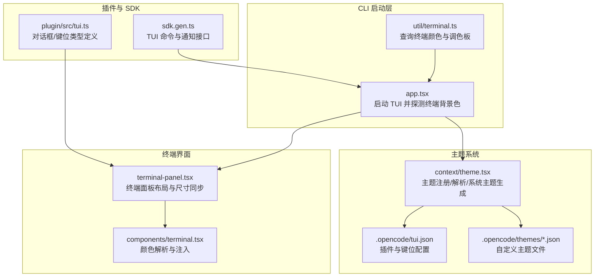
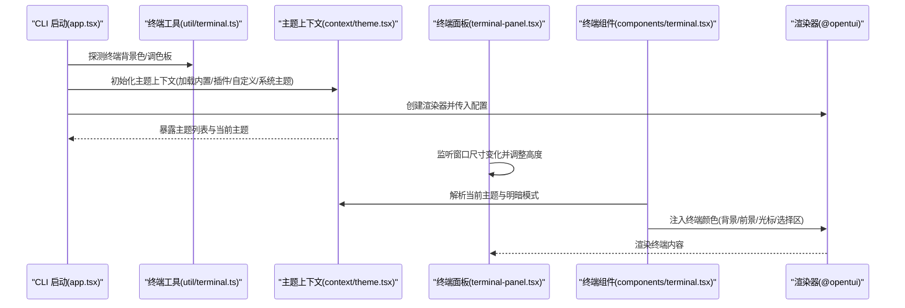
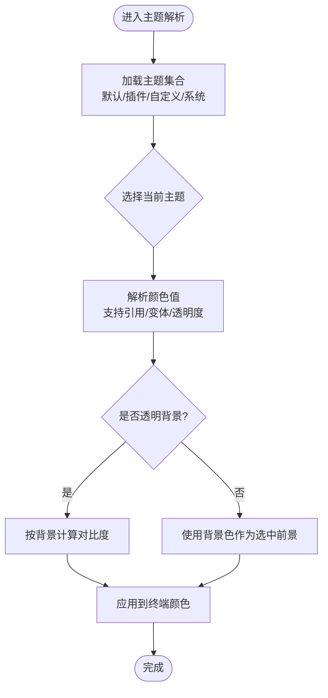
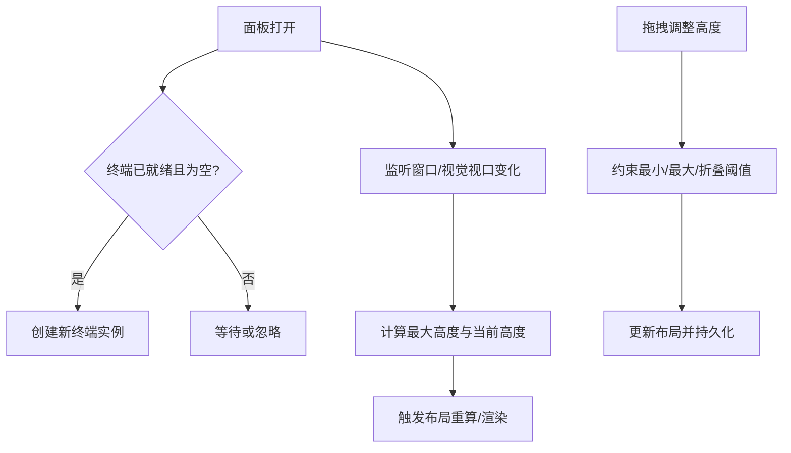
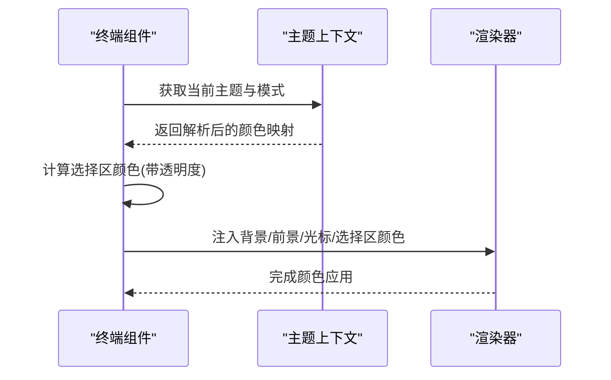
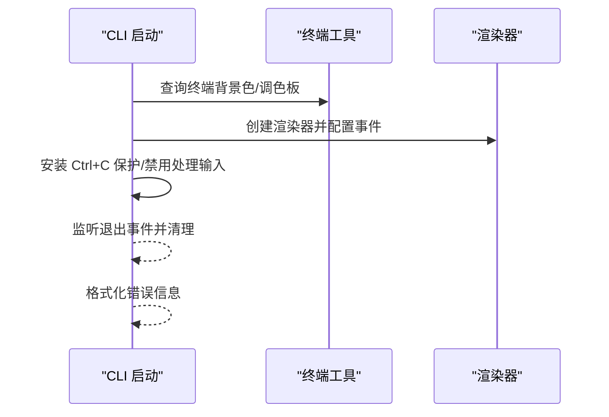
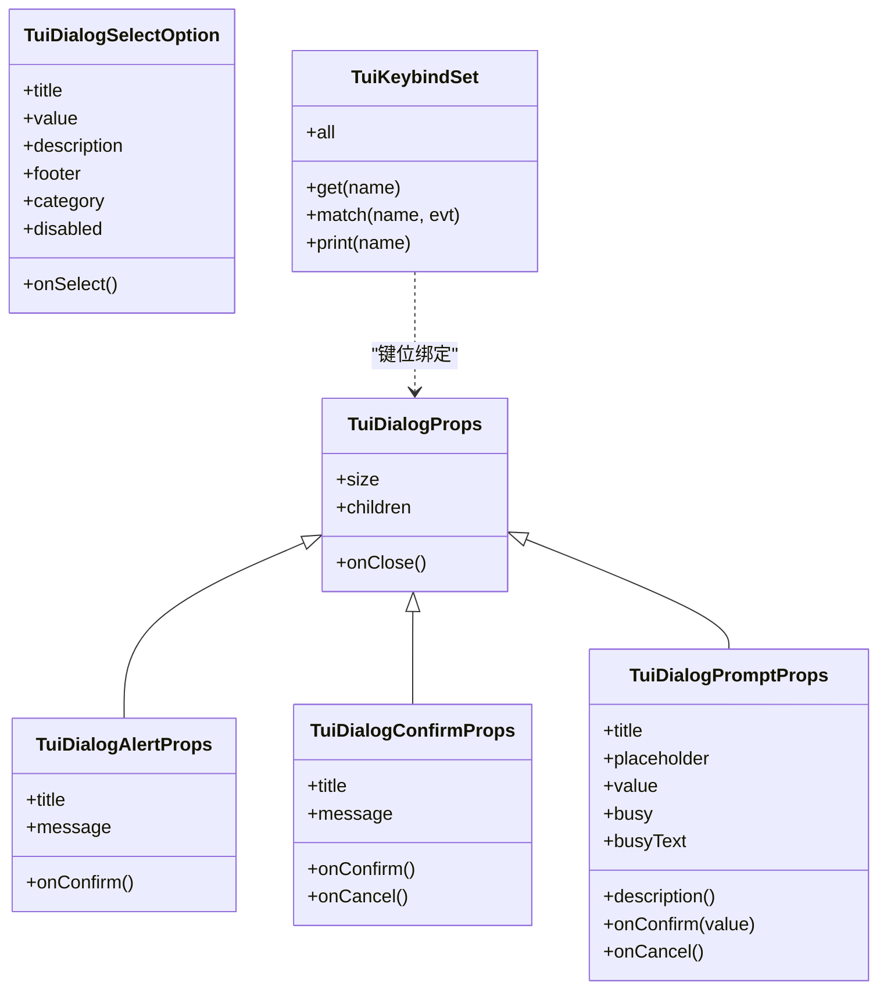
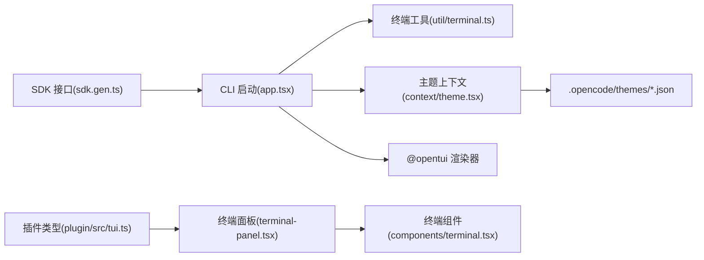

# 终端友好界面

<cite>
**本文引用的文件**
- [packages/opencode/src/cli/cmd/tui/context/theme.tsx](file://packages/opencode/src/cli/cmd/tui/context/theme.tsx)
- [packages/opencode/src/cli/cmd/tui/app.tsx](file://packages/opencode/src/cli/cmd/tui/app.tsx)
- [packages/opencode/src/cli/cmd/tui/util/terminal.ts](file://packages/opencode/src/cli/cmd/tui/util/terminal.ts)
- [packages/app/src/pages/session/terminal-panel.tsx](file://packages/app/src/pages/session/terminal-panel.tsx)
- [packages/app/src/components/terminal.tsx](file://packages/app/src/components/terminal.tsx)
- [packages/plugin/src/tui.ts](file://packages/plugin/src/tui.ts)
- [packages/web/src/content/docs/themes.mdx](file://packages/web/src/content/docs/themes.mdx)
- [.opencode/tui.json](file://.opencode/tui.json)
- [.opencode/opencode.jsonc](file://.opencode/opencode.jsonc)
- [packages/sdk/js/src/gen/sdk.gen.ts](file://packages/sdk/js/src/gen/sdk.gen.ts)
</cite>

## 目录
1. [简介](#简介)
2. [项目结构](#项目结构)
3. [核心组件](#核心组件)
4. [架构总览](#架构总览)
5. [详细组件分析](#详细组件分析)
6. [依赖关系分析](#依赖关系分析)
7. [性能考量](#性能考量)
8. [故障排查指南](#故障排查指南)
9. [结论](#结论)
10. [附录](#附录)

## 简介
本文件面向 OpenCode 的终端友好界面（TUI）设计与实现，聚焦于在终端这一“像素级受限”的环境中提供高密度、高可用的交互体验。内容涵盖主题系统、颜色解析、终端尺寸同步、对话框与键位绑定、以及在有限空间中实现丰富功能的布局与交互策略。目标是帮助开发者与使用者在命令行中获得接近桌面应用的体验。

## 项目结构
OpenCode 的 TUI 能力由多处模块协同完成：
- CLI 主程序负责启动 TUI、探测终端背景色、初始化渲染器与上下文
- 主题上下文负责加载内置/插件/自定义主题，并生成系统主题
- 终端面板与终端组件负责布局、尺寸同步与颜色注入
- 插件层提供对话框、键位绑定等 UI 扩展能力
- 文档与配置文件提供主题定义规范与运行时配置

图表来源
- [packages/opencode/src/cli/cmd/tui/app.tsx:63-193](file://packages/opencode/src/cli/cmd/tui/app.tsx#L63-L193)
- [packages/opencode/src/cli/cmd/tui/util/terminal.ts:1-32](file://packages/opencode/src/cli/cmd/tui/util/terminal.ts#L1-L32)
- [packages/opencode/src/cli/cmd/tui/context/theme.tsx:1-200](file://packages/opencode/src/cli/cmd/tui/context/theme.tsx#L1-L200)
- [.opencode/tui.json:1-19](file://.opencode/tui.json#L1-L19)
- [packages/app/src/pages/session/terminal-panel.tsx:24-223](file://packages/app/src/pages/session/terminal-panel.tsx#L24-L223)
- [packages/app/src/components/terminal.tsx:214-258](file://packages/app/src/components/terminal.tsx#L214-L258)
- [packages/plugin/src/tui.ts:71-127](file://packages/plugin/src/tui.ts#L71-L127)
- [packages/sdk/js/src/gen/sdk.gen.ts:1091-1127](file://packages/sdk/js/src/gen/sdk.gen.ts#L1091-L1127)

章节来源
- [packages/opencode/src/cli/cmd/tui/app.tsx:63-193](file://packages/opencode/src/cli/cmd/tui/app.tsx#L63-L193)
- [packages/opencode/src/cli/cmd/tui/util/terminal.ts:1-32](file://packages/opencode/src/cli/cmd/tui/util/terminal.ts#L1-L32)
- [packages/opencode/src/cli/cmd/tui/context/theme.tsx:1-200](file://packages/opencode/src/cli/cmd/tui/context/theme.tsx#L1-L200)
- [.opencode/tui.json:1-19](file://.opencode/tui.json#L1-L19)
- [packages/app/src/pages/session/terminal-panel.tsx:24-223](file://packages/app/src/pages/session/terminal-panel.tsx#L24-L223)
- [packages/app/src/components/terminal.tsx:214-258](file://packages/app/src/components/terminal.tsx#L214-L258)
- [packages/plugin/src/tui.ts:71-127](file://packages/plugin/src/tui.ts#L71-L127)
- [packages/sdk/js/src/gen/sdk.gen.ts:1091-1127](file://packages/sdk/js/src/gen/sdk.gen.ts#L1091-L1127)

## 核心组件
- 主题上下文：集中管理主题注册、解析、系统主题生成与切换；支持内置主题、插件主题、自定义主题与系统主题
- 终端面板：负责终端区域的布局、拖拽调整高度、窗口尺寸变化监听与自动创建
- 终端组件：根据当前主题与明暗模式解析终端颜色（背景、前景、光标、选择区），并注入到渲染器
- 键位与对话框：通过插件层提供统一的键位映射与对话框栈管理，便于在 TUI 中实现复杂交互
- CLI 启动：探测终端背景色、初始化渲染器、处理退出流程与错误格式化

章节来源
- [packages/opencode/src/cli/cmd/tui/context/theme.tsx:198-381](file://packages/opencode/src/cli/cmd/tui/context/theme.tsx#L198-L381)
- [packages/app/src/pages/session/terminal-panel.tsx:24-223](file://packages/app/src/pages/session/terminal-panel.tsx#L24-L223)
- [packages/app/src/components/terminal.tsx:214-258](file://packages/app/src/components/terminal.tsx#L214-L258)
- [packages/plugin/src/tui.ts:71-127](file://packages/plugin/src/tui.ts#L71-L127)
- [packages/opencode/src/cli/cmd/tui/app.tsx:146-193](file://packages/opencode/src/cli/cmd/tui/app.tsx#L146-L193)

## 架构总览
下图展示了从 CLI 启动到主题解析、颜色注入与终端面板渲染的整体流程：

图表来源
- [packages/opencode/src/cli/cmd/tui/app.tsx:63-193](file://packages/opencode/src/cli/cmd/tui/app.tsx#L63-L193)
- [packages/opencode/src/cli/cmd/tui/util/terminal.ts:1-32](file://packages/opencode/src/cli/cmd/tui/util/terminal.ts#L1-L32)
- [packages/opencode/src/cli/cmd/tui/context/theme.tsx:303-381](file://packages/opencode/src/cli/cmd/tui/context/theme.tsx#L303-L381)
- [packages/app/src/pages/session/terminal-panel.tsx:24-223](file://packages/app/src/pages/session/terminal-panel.tsx#L24-L223)
- [packages/app/src/components/terminal.tsx:214-258](file://packages/app/src/components/terminal.tsx#L214-L258)

## 详细组件分析

### 主题系统与颜色解析
- 主题注册与优先级：默认主题 < 插件主题 < 自定义主题 < 系统主题
- 系统主题生成：基于终端调色板与背景色推断出一套与终端一致的配色方案
- 颜色解析：支持直接色值、引用、变体（明/暗）与透明度计算
- 选中项前景色：针对透明背景自动计算对比度，确保可读性
- 主题切换：支持锁定明暗模式与动态更新

图表来源
- [packages/opencode/src/cli/cmd/tui/context/theme.tsx:53-69](file://packages/opencode/src/cli/cmd/tui/context/theme.tsx#L53-L69)
- [packages/opencode/src/cli/cmd/tui/context/theme.tsx:198-200](file://packages/opencode/src/cli/cmd/tui/context/theme.tsx#L198-L200)
- [packages/opencode/src/cli/cmd/tui/context/theme.tsx:303-381](file://packages/opencode/src/cli/cmd/tui/context/theme.tsx#L303-L381)

章节来源
- [packages/opencode/src/cli/cmd/tui/context/theme.tsx:198-381](file://packages/opencode/src/cli/cmd/tui/context/theme.tsx#L198-L381)
- [packages/web/src/content/docs/themes.mdx:128-143](file://packages/web/src/content/docs/themes.mdx#L128-L143)

### 终端面板与尺寸同步
- 响应式高度：根据视口高度与最大比例限制动态计算面板高度
- 拖拽调整：提供垂直拖拽句柄，支持最小/最大/折叠阈值控制
- 自动创建：首次打开时自动创建终端实例
- 尺寸同步：监听窗口/视觉视口变化，及时更新终端大小

图表来源
- [packages/app/src/pages/session/terminal-panel.tsx:24-223](file://packages/app/src/pages/session/terminal-panel.tsx#L24-L223)

章节来源
- [packages/app/src/pages/session/terminal-panel.tsx:24-223](file://packages/app/src/pages/session/terminal-panel.tsx#L24-L223)

### 终端颜色注入与渲染
- 颜色来源：主题变体（明/暗）、默认终端颜色、透明度混合
- 选择区颜色：基于文本颜色按明暗模式设定不透明度
- 渲染器集成：将解析后的颜色传递给渲染器以驱动终端绘制

图表来源
- [packages/app/src/components/terminal.tsx:214-258](file://packages/app/src/components/terminal.tsx#L214-L258)
- [packages/opencode/src/cli/cmd/tui/context/theme.tsx:303-381](file://packages/opencode/src/cli/cmd/tui/context/theme.tsx#L303-L381)

章节来源
- [packages/app/src/components/terminal.tsx:214-258](file://packages/app/src/components/terminal.tsx#L214-L258)

### CLI 启动与错误处理
- 终端背景色探测：通过 OSC 序列查询终端背景色，用于推断明/暗模式
- 渲染器初始化：根据配置创建渲染器并设置事件
- 退出与清理：安装 Ctrl+C 保护、禁用处理输入、释放资源
- 错误格式化：对未知错误与结构化错误进行统一格式化输出

图表来源
- [packages/opencode/src/cli/cmd/tui/app.tsx:63-193](file://packages/opencode/src/cli/cmd/tui/app.tsx#L63-L193)
- [packages/opencode/src/cli/cmd/tui/util/terminal.ts:1-32](file://packages/opencode/src/cli/cmd/tui/util/terminal.ts#L1-L32)

章节来源
- [packages/opencode/src/cli/cmd/tui/app.tsx:63-193](file://packages/opencode/src/cli/cmd/tui/app.tsx#L63-L193)
- [packages/opencode/src/cli/cmd/tui/util/terminal.ts:1-32](file://packages/opencode/src/cli/cmd/tui/util/terminal.ts#L1-L32)

### 插件与对话框、键位绑定
- 对话框类型：确认、提示、选择、警告等，支持尺寸与关闭回调
- 键位绑定：统一的键位映射与匹配机制，支持打印与展示
- 插件配置：通过 tui.json 管理插件启用与键位映射

图表来源
- [packages/plugin/src/tui.ts:71-127](file://packages/plugin/src/tui.ts#L71-L127)
- [.opencode/tui.json:1-19](file://.opencode/tui.json#L1-L19)

章节来源
- [packages/plugin/src/tui.ts:71-127](file://packages/plugin/src/tui.ts#L71-L127)
- [.opencode/tui.json:1-19](file://.opencode/tui.json#L1-L19)

### 主题定义与终端默认色
- 支持在主题中使用 `"none"` 来继承终端默认前景/背景色，便于与终端配色无缝融合
- 示例主题可通过文档指引创建与扩展

章节来源
- [packages/web/src/content/docs/themes.mdx:128-143](file://packages/web/src/content/docs/themes.mdx#L128-L143)

## 依赖关系分析
- CLI 依赖终端工具进行颜色探测，依赖主题上下文进行主题解析，依赖渲染器进行绘制
- 终端面板依赖布局与尺寸状态，依赖终端组件进行颜色注入
- 主题上下文依赖配置与 KV 存储，支持系统主题生成与自定义主题扫描
- 插件层提供对话框与键位绑定的类型定义，供上层 UI 使用
- SDK 提供 TUI 命令与通知接口，便于外部集成

图表来源
- [packages/opencode/src/cli/cmd/tui/app.tsx:63-193](file://packages/opencode/src/cli/cmd/tui/app.tsx#L63-L193)
- [packages/opencode/src/cli/cmd/tui/util/terminal.ts:1-32](file://packages/opencode/src/cli/cmd/tui/util/terminal.ts#L1-L32)
- [packages/opencode/src/cli/cmd/tui/context/theme.tsx:490-503](file://packages/opencode/src/cli/cmd/tui/context/theme.tsx#L490-L503)
- [packages/app/src/pages/session/terminal-panel.tsx:24-223](file://packages/app/src/pages/session/terminal-panel.tsx#L24-L223)
- [packages/app/src/components/terminal.tsx:214-258](file://packages/app/src/components/terminal.tsx#L214-L258)
- [packages/plugin/src/tui.ts:71-127](file://packages/plugin/src/tui.ts#L71-L127)
- [packages/sdk/js/src/gen/sdk.gen.ts:1091-1127](file://packages/sdk/js/src/gen/sdk.gen.ts#L1091-L1127)

章节来源
- [packages/opencode/src/cli/cmd/tui/app.tsx:63-193](file://packages/opencode/src/cli/cmd/tui/app.tsx#L63-L193)
- [packages/opencode/src/cli/cmd/tui/util/terminal.ts:1-32](file://packages/opencode/src/cli/cmd/tui/util/terminal.ts#L1-L32)
- [packages/opencode/src/cli/cmd/tui/context/theme.tsx:490-503](file://packages/opencode/src/cli/cmd/tui/context/theme.tsx#L490-L503)
- [packages/app/src/pages/session/terminal-panel.tsx:24-223](file://packages/app/src/pages/session/terminal-panel.tsx#L24-L223)
- [packages/app/src/components/terminal.tsx:214-258](file://packages/app/src/components/terminal.tsx#L214-L258)
- [packages/plugin/src/tui.ts:71-127](file://packages/plugin/src/tui.ts#L71-L127)
- [packages/sdk/js/src/gen/sdk.gen.ts:1091-1127](file://packages/sdk/js/src/gen/sdk.gen.ts#L1091-L1127)

## 性能考量
- 主题解析与缓存：系统主题生成后应缓存调色板，避免重复查询终端颜色
- 终端尺寸同步：在高频 resize 场景下，建议节流/防抖更新逻辑
- 颜色注入：仅在主题或模式变更时重新计算颜色，减少渲染器调用
- 插件与对话框：对话框栈深度与尺寸变更应避免不必要的重排

## 故障排查指南
- 终端颜色异常
  - 检查终端是否支持查询背景/前景颜色（部分容器/代理可能过滤 OSC）
  - 若失败，回退到默认颜色并检查主题配置
- 主题切换无效
  - 确认主题名称存在且格式正确
  - 检查明暗模式锁定状态与 KV 存储
- 终端面板无法拖拽或高度异常
  - 确认视觉视口监听与最小/最大/折叠阈值设置
  - 检查布局状态与面板打开状态
- 键位冲突
  - 检查 tui.json 中键位映射与插件启用状态
  - 使用键位打印函数核对当前映射

章节来源
- [packages/opencode/src/cli/cmd/tui/util/terminal.ts:1-32](file://packages/opencode/src/cli/cmd/tui/util/terminal.ts#L1-L32)
- [packages/opencode/src/cli/cmd/tui/context/theme.tsx:303-381](file://packages/opencode/src/cli/cmd/tui/context/theme.tsx#L303-L381)
- [packages/app/src/pages/session/terminal-panel.tsx:24-223](file://packages/app/src/pages/session/terminal-panel.tsx#L24-L223)
- [.opencode/tui.json:1-19](file://.opencode/tui.json#L1-L19)

## 结论
OpenCode 的终端友好界面通过“主题系统 + 终端面板 + 颜色注入 + 插件扩展”的分层设计，在有限的终端空间内实现了高密度、高可读性的交互体验。借助系统主题生成与终端默认色继承，界面能够自然融入用户的终端环境；通过对话框与键位绑定，复杂任务也能在 TUI 中高效完成。建议在实际使用中结合个人终端配色与工作流，合理配置主题与键位，以获得更佳的使用体验。

## 附录
- 运行时配置示例：提供 provider、权限与工具开关等配置入口
- SDK 接口：支持清除提示、执行命令、显示通知等 TUI 操作

章节来源
- [.opencode/opencode.jsonc:1-19](file://.opencode/opencode.jsonc#L1-L19)
- [packages/sdk/js/src/gen/sdk.gen.ts:1091-1127](file://packages/sdk/js/src/gen/sdk.gen.ts#L1091-L1127)