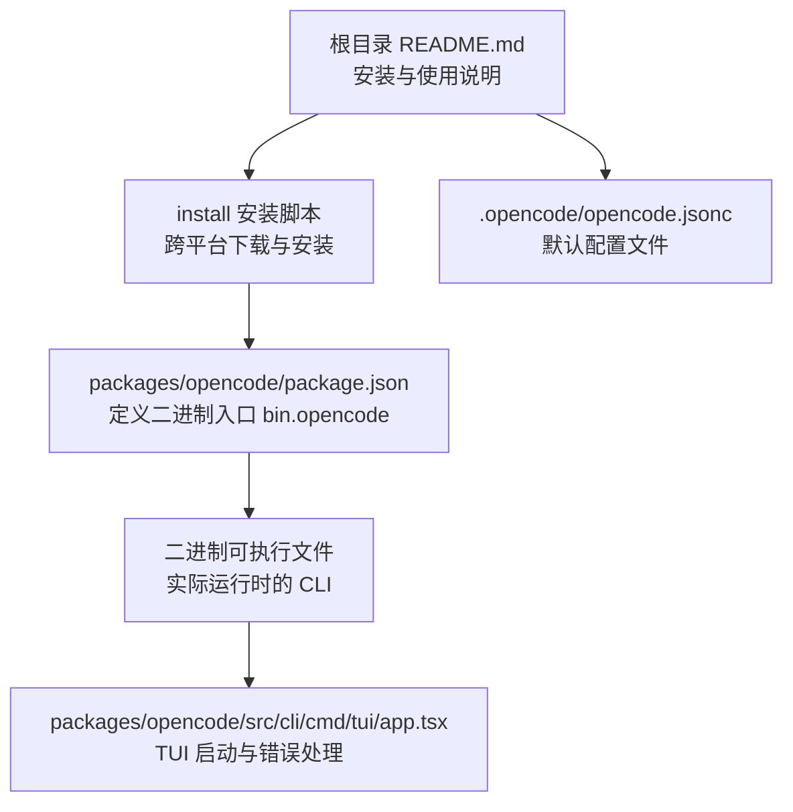
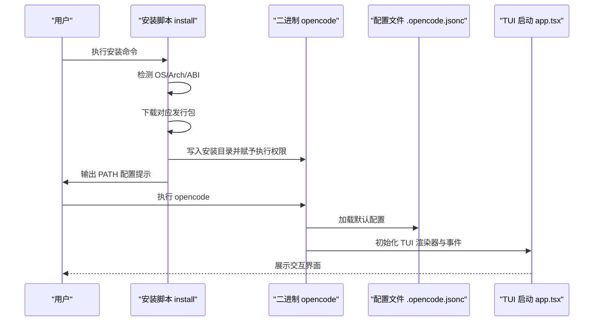
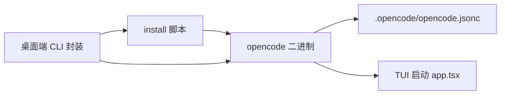

# CLI 命令行部署

<cite>
**本文档引用的文件**
- [README.md](file://README.md)
- [install](file://install)
- [.opencode/opencode.jsonc](file://.opencode/opencode.jsonc)
- [packages/opencode/package.json](file://packages/opencode/package.json)
- [packages/opencode/src/cli/cmd/tui/app.tsx](file://packages/opencode/src/cli/cmd/tui/app.tsx)
- [packages/desktop/src/cli.ts](file://packages/desktop/src/cli.ts)
- [packages/desktop/src-tauri/src/cli.rs](file://packages/desktop/src-tauri/src/cli.rs)
- [packages/desktop-electron/src/main/cli.ts](file://packages/desktop-electron/src/main/cli.ts)
</cite>

## 目录
1. [简介](#简介)
2. [项目结构](#项目结构)
3. [核心组件](#核心组件)
4. [架构总览](#架构总览)
5. [详细组件分析](#详细组件分析)
6. [依赖关系分析](#依赖关系分析)
7. [性能考虑](#性能考虑)
8. [故障排除指南](#故障排除指南)
9. [结论](#结论)
10. [附录](#附录)

## 简介
本文件面向希望在本地以命令行方式部署与使用 OpenCode 的用户与开发者，系统性阐述 CLI 安装、配置与使用流程，覆盖全局安装、本地安装与开发环境配置；解释命令执行方式、参数选项与典型使用场景；并从代码层面梳理 CLI 的架构设计（命令解析、代理系统集成、工具调用机制等），提供跨平台（Windows、macOS、Linux）安装与环境配置建议，以及常见问题排查指引。

## 项目结构
OpenCode 采用多包工作区结构，CLI 作为独立可执行程序由 packages/opencode 包导出二进制入口，并通过根目录安装脚本进行分发与安装。.opencode 目录存放默认配置与内置命令/工具模板。

图表来源
- [README.md:46-98](file://README.md#L46-L98)
- [install:68-359](file://install#L68-L359)
- [packages/opencode/package.json:24-26](file://packages/opencode/package.json#L24-L26)
- [.opencode/opencode.jsonc:1-19](file://.opencode/opencode.jsonc#L1-L19)
- [packages/opencode/src/cli/cmd/tui/app.tsx:163-193](file://packages/opencode/src/cli/cmd/tui/app.tsx#L163-L193)

章节来源
- [README.md:46-98](file://README.md#L46-L98)
- [install:68-359](file://install#L68-L359)
- [packages/opencode/package.json:24-26](file://packages/opencode/package.json#L24-L26)
- [.opencode/opencode.jsonc:1-19](file://.opencode/opencode.jsonc#L1-L19)
- [packages/opencode/src/cli/cmd/tui/app.tsx:163-193](file://packages/opencode/src/cli/cmd/tui/app.tsx#L163-L193)

## 核心组件
- 安装脚本：负责检测平台与架构、选择合适的发行包、下载与解压、写入 PATH、输出安装完成提示。
- 配置文件：.opencode/opencode.jsonc 提供默认模型提供商、权限策略、工具开关等配置项。
- CLI 可执行文件：由 packages/opencode/package.json 中的 bin 字段声明，实际运行逻辑位于 TUI 启动模块。
- 桌面端集成：桌面应用在 macOS/Linux 上支持一键安装 CLI，并在版本不一致时自动同步更新。

章节来源
- [install:10-27](file://install#L10-L27)
- [.opencode/opencode.jsonc:1-19](file://.opencode/opencode.jsonc#L1-L19)
- [packages/opencode/package.json:24-26](file://packages/opencode/package.json#L24-L26)
- [packages/opencode/src/cli/cmd/tui/app.tsx:163-193](file://packages/opencode/src/cli/cmd/tui/app.tsx#L163-L193)

## 架构总览
下图展示从用户执行到 CLI 运行的整体流程，包括安装脚本、可执行文件、配置加载与 TUI 初始化。

图表来源
- [install:68-359](file://install#L68-L359)
- [packages/opencode/package.json:24-26](file://packages/opencode/package.json#L24-L26)
- [.opencode/opencode.jsonc:1-19](file://.opencode/opencode.jsonc#L1-L19)
- [packages/opencode/src/cli/cmd/tui/app.tsx:163-193](file://packages/opencode/src/cli/cmd/tui/app.tsx#L163-L193)

## 详细组件分析

### 安装脚本 install（跨平台安装）
- 功能要点
  - 支持指定版本安装、从本地二进制安装、跳过修改 shell 配置等选项。
  - 自动识别 OS/Arch 并选择目标发行包（含 musl、baseline 等变体）。
  - 下载进度可视化、校验版本是否已安装、自动写入 PATH 或提示手动添加。
  - 支持 GitHub Actions 环境自动注入 GITHUB_PATH。
- 关键行为
  - 优先级：OPENCODE_INSTALL_DIR > XDG_BIN_DIR > $HOME/bin > 默认 $HOME/.opencode/bin。
  - 在非 TTY 或 Windows 环境回退到标准下载方式。
  - 对 Apple Silicon Mac 在 Rosetta 环境下自动切换为 arm64 目标。
  - Linux 平台根据 CPU 特性与 libc 类型选择 baseline 或 musl 变体。
- 典型使用
  - 全局安装最新版：参考根目录 README 的安装示例。
  - 指定版本安装：install 脚本支持 --version 参数。
  - 从本地二进制安装：install 脚本支持 --binary 参数。

章节来源
- [install:10-27](file://install#L10-L27)
- [install:68-110](file://install#L68-L110)
- [install:117-167](file://install#L117-L167)
- [install:168-205](file://install#L168-L205)
- [install:221-235](file://install#L221-L235)
- [install:267-359](file://install#L267-L359)
- [install:362-439](file://install#L362-L439)
- [README.md:46-62](file://README.md#L46-L62)

### 配置文件 .opencode/opencode.jsonc
- 作用
  - 定义默认模型提供商、权限策略、工具开关、MCP 集成等。
- 关键字段
  - provider.opencode.options：默认模型相关选项。
  - permission.edit：对特定路径的编辑权限控制。
  - tools.github-triage / github-pr-search：工具开关。
- 影响范围
  - CLI 启动时加载该配置，影响可用能力与安全边界。

章节来源
- [.opencode/opencode.jsonc:1-19](file://.opencode/opencode.jsonc#L1-L19)

### CLI 可执行文件与 TUI 启动
- 二进制入口
  - 由 packages/opencode/package.json 的 bin 字段声明，指向 ./bin/opencode。
- 启动流程
  - TUI 启动模块负责初始化渲染器、处理退出与异常、设置终端模式等。
  - 错误处理包含通用格式化与数据结构化消息提取。
- 与桌面端集成
  - 桌面应用在 macOS/Linux 上可触发 CLI 安装与版本同步。

章节来源
- [packages/opencode/package.json:24-26](file://packages/opencode/package.json#L24-L26)
- [packages/opencode/src/cli/cmd/tui/app.tsx:146-193](file://packages/opencode/src/cli/cmd/tui/app.tsx#L146-L193)

### 桌面端 CLI 安装与同步
- Electron 版本
  - 提供安装 CLI 的封装函数，包含环境变量拼接、路径解析、版本比较与错误映射。
- Tauri 版本
  - 获取 CLI 当前版本并与应用版本比较，若旧则触发安装流程。
  - 解析用户 shell、转义参数、处理 WSL 等平台差异。
- 错误处理
  - 将底层错误映射为本地化提示，便于用户理解失败原因。

章节来源
- [packages/desktop/src/cli.ts:6-30](file://packages/desktop/src/cli.ts#L6-L30)
- [packages/desktop/src-tauri/src/cli.rs:190-218](file://packages/desktop/src-tauri/src/cli.rs#L190-L218)
- [packages/desktop/src-tauri/src/cli.rs:220-245](file://packages/desktop/src-tauri/src/cli.rs#L220-L245)
- [packages/desktop-electron/src/main/cli.ts:238-283](file://packages/desktop-electron/src/main/cli.ts#L238-L283)

## 依赖关系分析
- 安装脚本依赖
  - 平台检测：uname、sysctl、ldd、/etc/alpine-release 等。
  - 下载工具：curl（带进度跟踪）、tar/unzip。
  - PATH 注入：根据当前 shell 选择 .bashrc/.zshrc 等配置文件。
- CLI 运行时依赖
  - 配置加载：读取 .opencode/opencode.jsonc。
  - TUI 渲染：初始化渲染器与事件处理。
- 桌面端依赖
  - 跨语言调用：Rust 侧调用系统命令与解析环境。
  - Shell 与路径：统一处理不同 shell 的转义与路径。

图表来源
- [install:68-359](file://install#L68-L359)
- [.opencode/opencode.jsonc:1-19](file://.opencode/opencode.jsonc#L1-L19)
- [packages/opencode/src/cli/cmd/tui/app.tsx:163-193](file://packages/opencode/src/cli/cmd/tui/app.tsx#L163-L193)
- [packages/desktop/src/cli.ts:32-43](file://packages/desktop/src/cli.ts#L32-L43)
- [packages/desktop/src-tauri/src/cli.rs:190-218](file://packages/desktop/src-tauri/src/cli.rs#L190-L218)

章节来源
- [install:68-359](file://install#L68-L359)
- [.opencode/opencode.jsonc:1-19](file://.opencode/opencode.jsonc#L1-L19)
- [packages/opencode/src/cli/cmd/tui/app.tsx:163-193](file://packages/opencode/src/cli/cmd/tui/app.tsx#L163-L193)
- [packages/desktop/src/cli.ts:32-43](file://packages/desktop/src/cli.ts#L32-L43)
- [packages/desktop/src-tauri/src/cli.rs:190-218](file://packages/desktop/src-tauri/src/cli.rs#L190-L218)

## 性能考虑
- 安装阶段
  - 使用 curl 进度跟踪与分段打印，提升大文件下载体验；在非 TTY 或 Windows 环境回退到标准下载。
  - 针对 Linux 的 musl 与 baseline 变体减少不必要的运行时开销。
- 运行阶段
  - TUI 初始化时进行终端模式设置与颜色检测，避免频繁重绘。
  - 错误处理中尽量复用格式化逻辑，减少重复计算。

章节来源
- [install:267-325](file://install#L267-L325)
- [install:117-167](file://install#L117-L167)
- [packages/opencode/src/cli/cmd/tui/app.tsx:178-193](file://packages/opencode/src/cli/cmd/tui/app.tsx#L178-L193)

## 故障排除指南
- 安装后无法找到命令
  - 检查 PATH 是否包含安装目录（默认 $HOME/.opencode/bin），必要时手动追加或使用 --no-modify-path 跳过自动注入。
  - 参考安装脚本的 PATH 注入逻辑与提示信息。
- 权限问题
  - 确认二进制具备执行权限；如从本地安装，请确保复制路径正确且权限为 755。
- 平台兼容性
  - Windows：确认 PowerShell 或 pwsh 可用，Rosetta 环境下会自动选择 arm64 变体。
  - Linux：若 CPU 不支持 AVX2 或使用 musl libc，将选择 baseline 或 musl 变体。
- 桌面端安装失败
  - 查看错误映射：平台不支持、侧车二进制缺失、脚本写入失败、权限设置失败、脚本运行失败、安装路径未知等。
  - 确保 HOME 环境变量存在，且安装目录可写。

章节来源
- [install:362-439](file://install#L362-L439)
- [install:348-352](file://install#L348-L352)
- [install:87-110](file://install#L87-L110)
- [install:117-167](file://install#L117-L167)
- [packages/desktop/src/cli.ts:6-30](file://packages/desktop/src/cli.ts#L6-L30)
- [packages/desktop/src-tauri/src/cli.rs:190-218](file://packages/desktop/src-tauri/src/cli.rs#L190-L218)

## 结论
OpenCode CLI 通过统一的安装脚本与可执行二进制，实现了跨平台的一致体验；默认配置文件提供了灵活的能力开关与安全边界；TUI 启动模块承担了交互与错误处理的核心职责；桌面端进一步增强了安装与版本同步的自动化程度。遵循本文档的安装与配置步骤，可在 Windows、macOS、Linux 上快速完成部署并进入日常使用。

## 附录

### 安装与使用速览
- 全局安装
  - 参考根目录 README 的安装示例，支持 curl 安装、包管理器安装与 Nix 等多种方式。
- 本地安装
  - 使用安装脚本的 --binary 参数从本地二进制安装。
- 开发环境
  - 通过根目录 package.json 的工作区与脚本进行开发与调试。

章节来源
- [README.md:46-62](file://README.md#L46-L62)
- [install:10-27](file://install#L10-L27)
- [README.md:46-62](file://README.md#L46-L62)

### 常见命令与参数
- 安装脚本参数
  - --version：安装指定版本。
  - --binary：从本地二进制安装。
  - --no-modify-path：不修改 shell 配置文件。
- CLI 启动
  - 执行 opencode 进入交互界面；TUI 启动模块负责初始化与错误处理。

章节来源
- [install:10-27](file://install#L10-L27)
- [packages/opencode/src/cli/cmd/tui/app.tsx:163-193](file://packages/opencode/src/cli/cmd/tui/app.tsx#L163-L193)