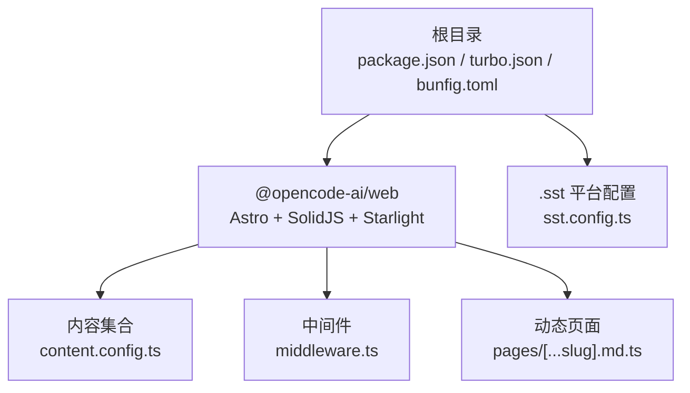
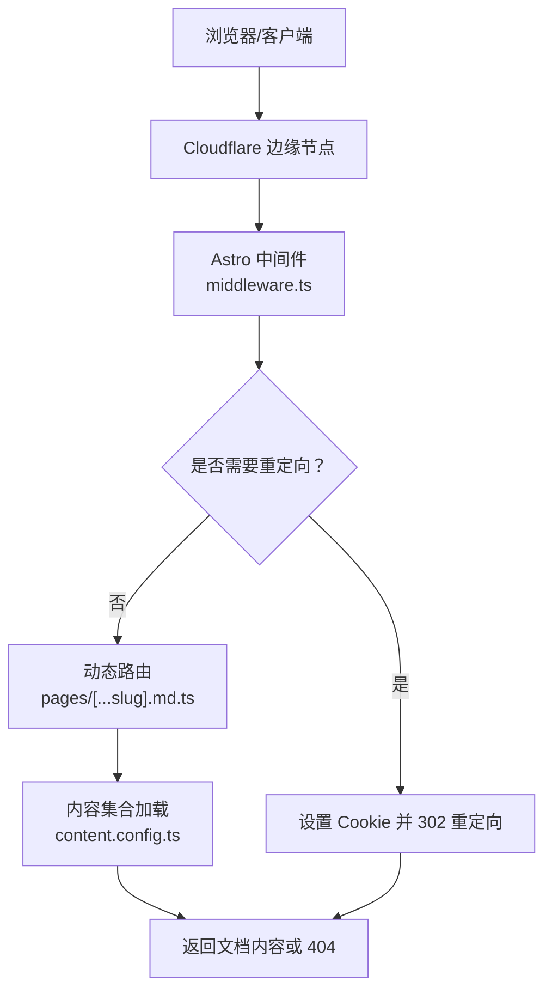
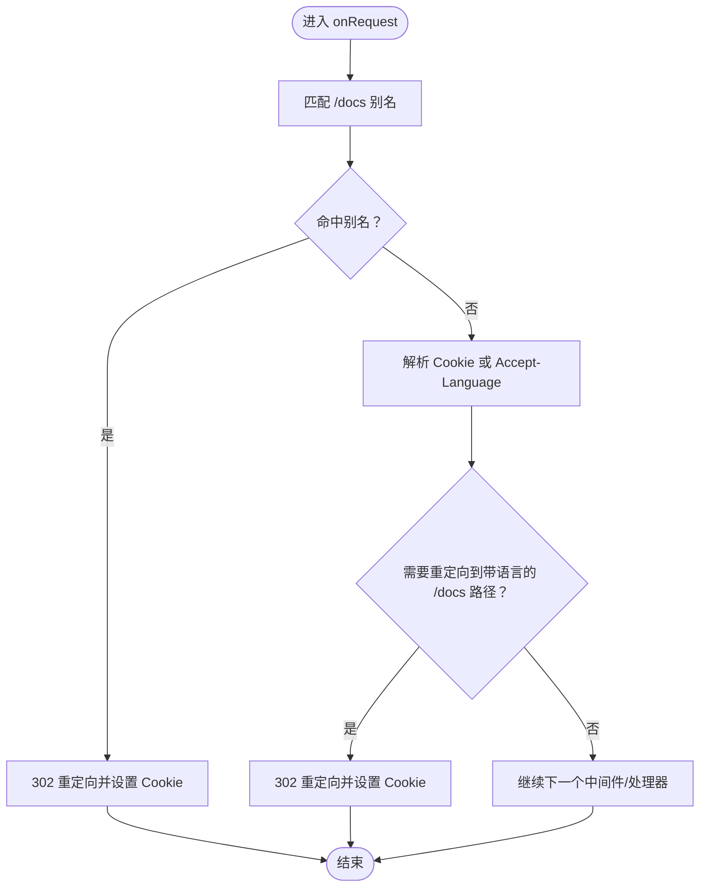
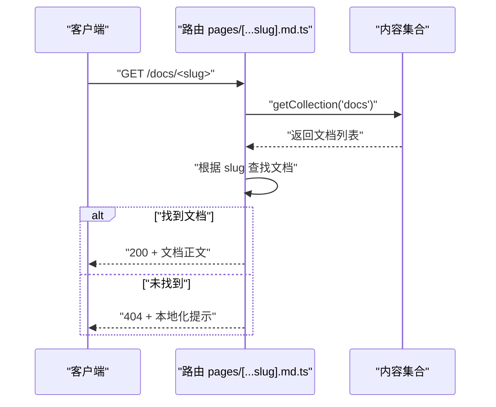
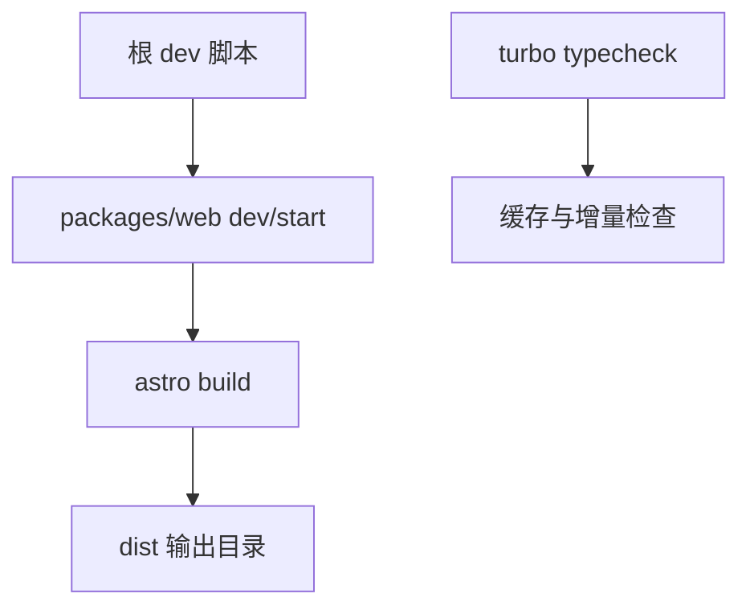
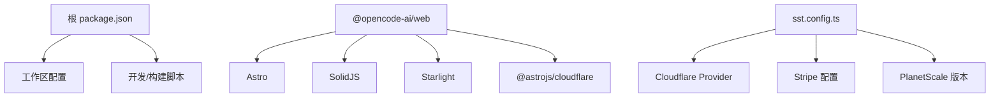

# Web 应用部署

<cite>
**本文引用的文件**
- [README.md](file://README.md)
- [package.json](file://package.json)
- [turbo.json](file://turbo.json)
- [bunfig.toml](file://bunfig.toml)
- [sst.config.ts](file://sst.config.ts)
- [packages/web/package.json](file://packages/web/package.json)
- [packages/web/src/middleware.ts](file://packages/web/src/middleware.ts)
- [packages/web/src/content.config.ts](file://packages/web/src/content.config.ts)
- [packages/web/src/pages/[...slug].md.ts](file://packages/web/src/pages/[...slug].md.ts)
</cite>

## 目录
1. [简介](#简介)
2. [项目结构](#项目结构)
3. [核心组件](#核心组件)
4. [架构总览](#架构总览)
5. [详细组件分析](#详细组件分析)
6. [依赖分析](#依赖分析)
7. [性能考虑](#性能考虑)
8. [故障排查指南](#故障排查指南)
9. [结论](#结论)
10. [附录](#附录)

## 简介
本文件面向 OpenCode Web 应用的部署与运维，聚焦于前端框架选型、构建与打包、部署策略、环境配置与后端交互方式。OpenCode Web 基于 Astro + SolidJS 技术栈，采用多语言内容管理（Starlight）与 Cloudflare 平台进行部署。本文同时提供开发、测试与生产环境的部署步骤，并覆盖容器化、静态托管与反向代理等高级部署方案。

## 项目结构
OpenCode 仓库采用 monorepo 结构，Web 应用位于 packages/web，使用 Astro 作为静态站点生成器（SSG），SolidJS 作为前端框架，Starlight 提供文档站点能力，并通过 Cloudflare Workers Pages 进行托管与边缘分发。

- 根级脚本与工作区
  - 根 package.json 定义了统一的开发与构建脚本，以及工作区配置，便于在多包之间共享依赖与工具链。
  - turbo.json 配置了类型检查与构建任务的依赖关系，确保在多包环境下高效并行构建。
  - bunfig.toml 指定安装行为与测试根目录，保证依赖锁定与测试隔离。

- Web 应用子包
  - packages/web/package.json 指定 Astro、SolidJS、Starlight 及 Cloudflare 托管适配器等依赖，定义 dev/build/preview 等常用命令。
  - packages/web/src 下包含中间件、内容配置与动态路由处理逻辑，支撑文档站点与国际化重定向。

**图表来源**
- [package.json:1-124](file://package.json#L1-L124)
- [turbo.json:1-32](file://turbo.json#L1-L32)
- [bunfig.toml:1-7](file://bunfig.toml#L1-L7)
- [packages/web/package.json:1-45](file://packages/web/package.json#L1-L45)
- [packages/web/src/content.config.ts:1-17](file://packages/web/src/content.config.ts#L1-L17)
- [packages/web/src/middleware.ts:1-95](file://packages/web/src/middleware.ts#L1-L95)
- [packages/web/src/pages/[...slug].md.ts:1-35](file://packages/web/src/pages/[...slug].md.ts#L1-L35)
- [sst.config.ts:1-24](file://sst.config.ts#L1-L24)

**章节来源**
- [package.json:1-124](file://package.json#L1-L124)
- [turbo.json:1-32](file://turbo.json#L1-L32)
- [bunfig.toml:1-7](file://bunfig.toml#L1-L7)
- [packages/web/package.json:1-45](file://packages/web/package.json#L1-L45)

## 核心组件
- 构建与开发工具链
  - 包管理与脚本：根 package.json 提供 dev、dev:web、typecheck 等脚本；packages/web/package.json 提供 astro dev/build/preview。
  - 类型检查与缓存：turbo.json 定义 typecheck、build 任务与输出目录，提升多包构建效率。
  - 依赖安装策略：bunfig.toml 使用精确版本安装，避免漂移。

- 文档与国际化
  - 内容加载：content.config.ts 使用 Starlight 的 docsLoader/i18nLoader，结合自定义校验模式，支持多语言文档与本地化键值。
  - 动态路由：pages/[...slug].md.ts 读取内容集合，按 slug 返回文档正文，缺失时返回 404。
  - 中间件：middleware.ts 实现文档路径别名重写与语言首选项解析，优先从 Cookie 获取语言，其次从 Accept-Language 解析。

- 部署与平台
  - 平台配置：sst.config.ts 指定应用名称、清理策略、保护级别与 Cloudflare 作为 home 提供商，并集成 Stripe 与 PlanetScale。
  - Web 包依赖：packages/web/package.json 引入 @astrojs/cloudflare，适配 Cloudflare Pages 部署。

**章节来源**
- [packages/web/src/content.config.ts:1-17](file://packages/web/src/content.config.ts#L1-L17)
- [packages/web/src/pages/[...slug].md.ts:1-35](file://packages/web/src/pages/[...slug].md.ts#L1-L35)
- [packages/web/src/middleware.ts:1-95](file://packages/web/src/middleware.ts#L1-L95)
- [packages/web/package.json:1-45](file://packages/web/package.json#L1-L45)
- [sst.config.ts:1-24](file://sst.config.ts#L1-L24)

## 架构总览
下图展示 Web 应用在 Cloudflare Pages 上的部署与请求流转：客户端请求经由 Cloudflare 边缘节点，中间件根据语言偏好与路径别名进行重定向，动态路由读取内容集合并返回文档内容或 404。

**图表来源**
- [packages/web/src/middleware.ts:80-94](file://packages/web/src/middleware.ts#L80-L94)
- [packages/web/src/pages/[...slug].md.ts:19-34](file://packages/web/src/pages/[...slug].md.ts#L19-L34)
- [packages/web/src/content.config.ts:8-16](file://packages/web/src/content.config.ts#L8-L16)

## 详细组件分析

### 组件一：国际化与路径重定向中间件
- 功能要点
  - 文档别名映射：将 /docs/<locale> 形式的路径规范化到 /docs 或 /docs/<locale>。
  - Cookie 语言解析：从 oc_locale Cookie 中提取语言标识，若不存在则回退至 Accept-Language。
  - 重定向响应：设置语言 Cookie 并返回 302，引导用户到正确语言的文档首页。

**图表来源**
- [packages/web/src/middleware.ts:4-19](file://packages/web/src/middleware.ts#L4-L19)
- [packages/web/src/middleware.ts:21-48](file://packages/web/src/middleware.ts#L21-L48)
- [packages/web/src/middleware.ts:80-94](file://packages/web/src/middleware.ts#L80-L94)

**章节来源**
- [packages/web/src/middleware.ts:1-95](file://packages/web/src/middleware.ts#L1-L95)

### 组件二：内容集合与动态路由
- 功能要点
  - 内容加载：通过 docsLoader/i18nLoader 加载文档与本地化资源，配合自定义 Schema 校验。
  - 动态路由：根据 slug 查找对应文档，返回正文内容；未找到时返回 404。
  - 国际化文案：通过 locals.t 获取“未找到”文案，兼容多语言显示。

**图表来源**
- [packages/web/src/pages/[...slug].md.ts:19-34](file://packages/web/src/pages/[...slug].md.ts#L19-L34)
- [packages/web/src/content.config.ts:8-16](file://packages/web/src/content.config.ts#L8-L16)

**章节来源**
- [packages/web/src/content.config.ts:1-17](file://packages/web/src/content.config.ts#L1-L17)
- [packages/web/src/pages/[...slug].md.ts:1-35](file://packages/web/src/pages/[...slug].md.ts#L1-L35)

### 组件三：构建与开发流程
- 开发与预览
  - 根脚本：dev、dev:web 分别启动主应用与 Web 子包的开发服务器。
  - Web 子包：dev/start/preview/build 对应 Astro 的开发、预览与构建命令。
- 类型检查与缓存
  - turbo.json 将类型检查与构建任务解耦，确保增量构建与缓存命中。
- 依赖安装
  - bunfig.toml 使用精确安装，减少版本漂移带来的不一致。

**图表来源**
- [package.json:8-18](file://package.json#L8-L18)
- [packages/web/package.json:6-12](file://packages/web/package.json#L6-L12)
- [turbo.json:5-10](file://turbo.json#L5-L10)
- [bunfig.toml:1-7](file://bunfig.toml#L1-L7)

**章节来源**
- [package.json:1-124](file://package.json#L1-L124)
- [packages/web/package.json:1-45](file://packages/web/package.json#L1-L45)
- [turbo.json:1-32](file://turbo.json#L1-L32)
- [bunfig.toml:1-7](file://bunfig.toml#L1-L7)

## 依赖分析
- 外部平台与提供商
  - Cloudflare：作为 home 提供商，配合 @astrojs/cloudflare 适配 Pages 部署。
  - Stripe：通过 sst.config.ts 注入密钥，用于支付相关功能。
  - PlanetScale：数据库服务版本声明，用于数据持久化。
- 内部包与工作区
  - 根 package.json 的 workspaces 配置包含多个子包，统一管理依赖与脚本。
  - packages/web 作为独立子包，拥有自身依赖与脚本，便于独立开发与部署。

**图表来源**
- [package.json:20-75](file://package.json#L20-L75)
- [packages/web/package.json:14-37](file://packages/web/package.json#L14-L37)
- [sst.config.ts:3-23](file://sst.config.ts#L3-L23)

**章节来源**
- [package.json:1-124](file://package.json#L1-L124)
- [packages/web/package.json:1-45](file://packages/web/package.json#L1-L45)
- [sst.config.ts:1-24](file://sst.config.ts#L1-L24)

## 性能考虑
- 构建与缓存
  - 使用 Turbo 清晰的任务依赖与输出目录，提升增量构建速度。
  - 精确安装依赖，降低因版本漂移导致的重复下载与构建。
- 内容与路由
  - 文档内容通过内容集合加载，建议保持条目数量合理，避免单页过大。
  - 动态路由按需查找，注意在高并发场景下的内容加载性能。
- 边缘分发
  - 利用 Cloudflare 边缘节点就近响应，减少网络延迟；对静态资源可启用缓存头以优化二次访问。

## 故障排查指南
- 文档 404 问题
  - 现象：访问 /docs/<slug> 返回 404。
  - 排查：确认 slug 是否存在于内容集合；检查 pages/[...slug].md.ts 的查找逻辑与本地化文案。
- 语言重定向异常
  - 现象：访问 /docs 未按预期跳转到带语言的路径。
  - 排查：检查 middleware.ts 的 Cookie 解析与 Accept-Language 解析顺序；确认 oc_locale Cookie 是否正确设置。
- 开发服务器无法启动
  - 现象：执行 dev/dev:web 报错。
  - 排查：确认 Node/Bun 版本与依赖安装；查看根与子包的脚本差异；确保端口未被占用。
- 构建失败
  - 现象：执行 build 报错。
  - 排查：先运行 typecheck；检查内容集合与路由文件语法；核对输出目录 dist 是否存在权限问题。

**章节来源**
- [packages/web/src/pages/[...slug].md.ts:19-34](file://packages/web/src/pages/[...slug].md.ts#L19-L34)
- [packages/web/src/middleware.ts:80-94](file://packages/web/src/middleware.ts#L80-L94)
- [package.json:8-18](file://package.json#L8-L18)
- [turbo.json:5-10](file://turbo.json#L5-L10)

## 结论
OpenCode Web 应用采用 Astro + SolidJS + Starlight 的现代化前端技术栈，结合 Cloudflare Pages 实现高性能、低延迟的静态站点托管。通过中间件与动态路由实现文档站点的国际化与路径规范化，借助 sst.config.ts 与工作区配置实现平台集成与多包协同。建议在生产环境中充分利用边缘缓存与内容集合的组织方式，确保文档访问体验与构建稳定性。

## 附录

### 安装与运行环境
- 安装方式
  - 在 README 中提供了多种安装渠道与示例，适用于不同操作系统与包管理器。
- 运行环境
  - 根据 package.json 使用 Bun 作为包管理器与运行时，建议使用受支持的 Node/Bun 版本。
  - 工作区配置包含多个子包，建议在统一的 monorepo 环境中进行开发与构建。

**章节来源**
- [README.md:46-62](file://README.md#L46-L62)
- [package.json:7-8](file://package.json#L7-L8)

### 配置选项与环境变量
- 开发与构建脚本
  - 根脚本：dev、dev:web、typecheck 等，分别用于启动开发服务器与类型检查。
  - Web 子包脚本：dev/start/preview/build/astro，覆盖 Astro 的完整开发与发布流程。
- 平台配置
  - sst.config.ts 指定应用名称、清理与保护策略、Cloudflare 提供商与第三方服务（Stripe、PlanetScale）。
- 依赖安装策略
  - bunfig.toml 使用精确安装，避免版本漂移。

**章节来源**
- [package.json:8-18](file://package.json#L8-L18)
- [packages/web/package.json:6-12](file://packages/web/package.json#L6-L12)
- [sst.config.ts:3-23](file://sst.config.ts#L3-L23)
- [bunfig.toml:1-7](file://bunfig.toml#L1-L7)

### 与后端服务的交互方式
- 当前仓库中的 Web 应用主要为静态文档站点，未直接暴露后端 API 接口。
- 若需与后端交互，请在实际项目中补充 API 层（如 Hono、Cloudflare Workers Functions 等），并在前端通过 fetch 或 SDK 访问。
- 认证机制与数据传输建议遵循安全最佳实践，例如使用 HTTPS、令牌管理与 CORS 配置。

### 不同部署环境的配置指南
- 开发环境
  - 使用 dev/dev:web 启动本地开发服务器，实时热更新。
  - 可通过环境变量（如 VITE_API_URL）切换远程后端地址。
- 测试环境
  - 使用 preview 本地预览构建产物，验证内容与路由行为。
- 生产环境
  - 在 Cloudflare Pages 上部署，使用 @astrojs/cloudflare 适配器。
  - 通过 sst.config.ts 配置提供商与密钥，确保平台集成稳定。

**章节来源**
- [packages/web/package.json:6-12](file://packages/web/package.json#L6-L12)
- [packages/web/package.json:14-18](file://packages/web/package.json#L14-L18)
- [sst.config.ts:3-23](file://sst.config.ts#L3-L23)

### 高级部署方案
- Docker 容器化部署
  - 可在容器内运行 Astro 构建后的静态文件，结合 Nginx/Apache 提供静态托管。
  - 建议将 dist 目录挂载为只读卷，并开启 Gzip/Br 压缩与缓存头。
- 静态文件托管
  - 将构建产物上传至对象存储（如 S3）或 CDN，结合 Cloudflare Workers 进行边缘计算与缓存。
- 反向代理配置
  - 在反向代理层设置缓存头、压缩与安全头（如 CSP、HSTS），并转发语言与 Cookie 信息以维持国际化状态。