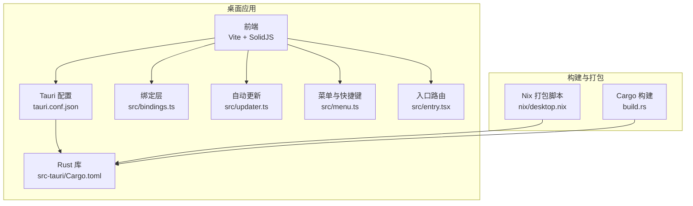
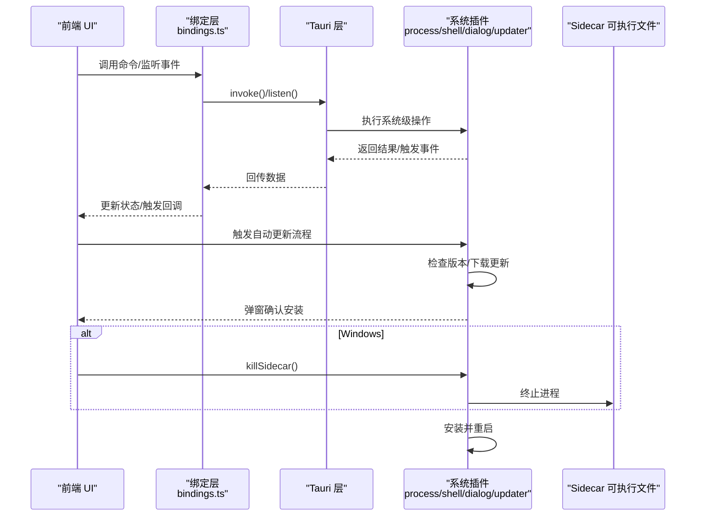
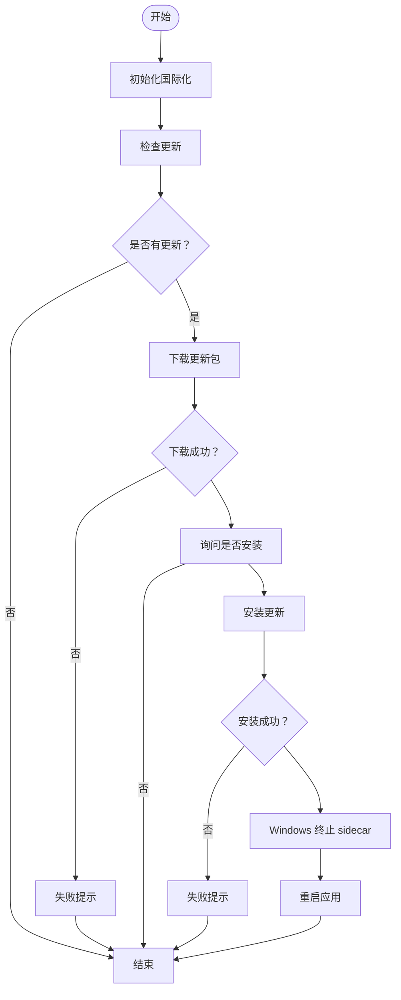
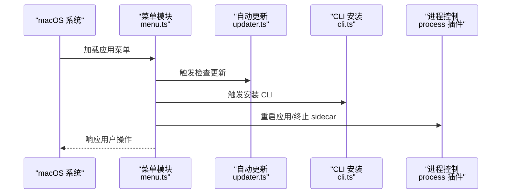
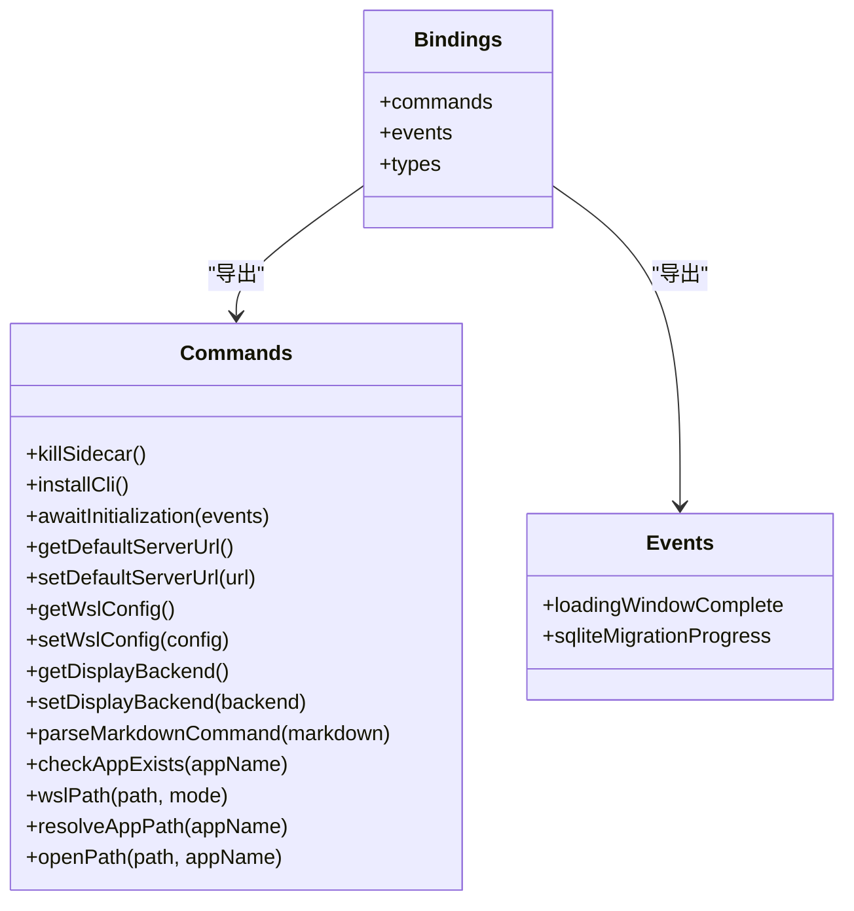
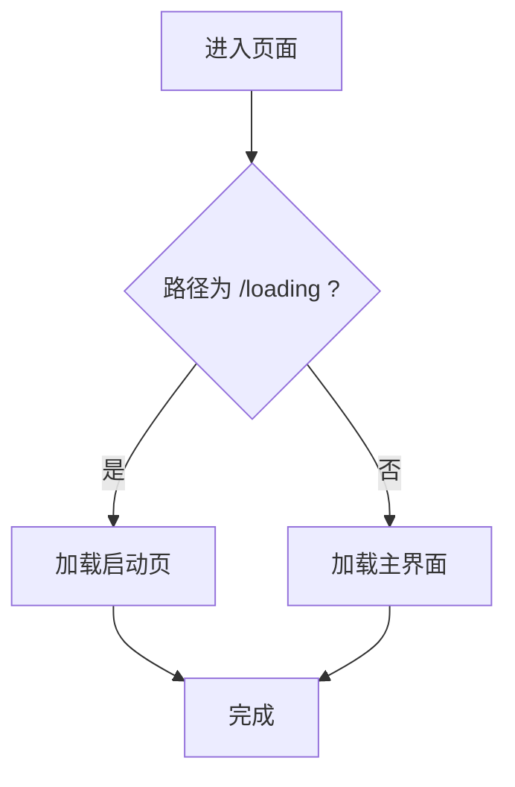
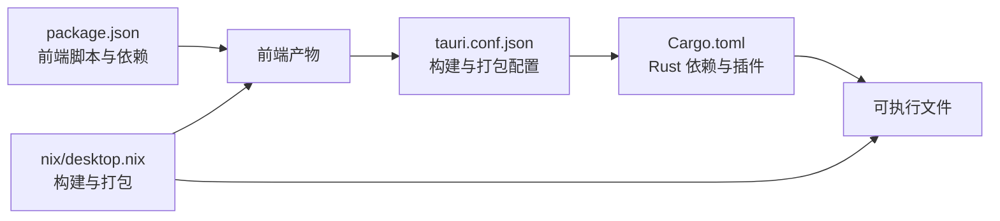

# 桌面应用部署

<cite>
**本文引用的文件**
- [packages/desktop/package.json](file://packages/desktop/package.json)
- [packages/desktop/src-tauri/Cargo.toml](file://packages/desktop/src-tauri/Cargo.toml)
- [packages/desktop/src-tauri/tauri.conf.json](file://packages/desktop/src-tauri/tauri.conf.json)
- [packages/desktop/src-tauri/build.rs](file://packages/desktop/src-tauri/build.rs)
- [packages/desktop/src/bindings.ts](file://packages/desktop/src/bindings.ts)
- [packages/desktop/src/updater.ts](file://packages/desktop/src/updater.ts)
- [packages/desktop/src/menu.ts](file://packages/desktop/src/menu.ts)
- [packages/desktop/src/entry.tsx](file://packages/desktop/src/entry.tsx)
- [nix/desktop.nix](file://nix/desktop.nix)
</cite>

## 目录
1. [简介](#简介)
2. [项目结构](#项目结构)
3. [核心组件](#核心组件)
4. [架构总览](#架构总览)
5. [详细组件分析](#详细组件分析)
6. [依赖关系分析](#依赖关系分析)
7. [性能考量](#性能考量)
8. [故障排查指南](#故障排查指南)
9. [结论](#结论)
10. [附录](#附录)

## 简介
本文件面向 OpenCode 桌面应用的部署与运维，聚焦于基于 Tauri（Rust）+ 前端（Vite/SolidJS）的混合架构，覆盖以下主题：
- 架构设计：Electron 替代方案、原生能力集成、跨平台兼容策略
- 安装包制作：多目标打包、签名与验证、自动更新机制
- 系统资源交互：文件系统、剪贴板、进程与系统命令、窗口状态、通知、HTTP 访问
- 打包与分发：macOS App Store、Windows Microsoft Store、Linux 应用商店路径
- 用户体验优化：图标、启动画面、权限配置与本地化

## 项目结构
OpenCode 桌面应用采用 Monorepo 结构，桌面子包位于 packages/desktop，前端源码在 src，Rust 后端逻辑在 src-tauri，Nix 用于构建与打包。

图表来源
- [packages/desktop/src-tauri/tauri.conf.json:1-67](file://packages/desktop/src-tauri/tauri.conf.json#L1-L67)
- [packages/desktop/src-tauri/Cargo.toml:1-76](file://packages/desktop/src-tauri/Cargo.toml#L1-L76)
- [packages/desktop/src/bindings.ts:1-68](file://packages/desktop/src/bindings.ts#L1-L68)
- [packages/desktop/src/updater.ts:1-52](file://packages/desktop/src/updater.ts#L1-L52)
- [packages/desktop/src/menu.ts:1-191](file://packages/desktop/src/menu.ts#L1-L191)
- [packages/desktop/src/entry.tsx:1-6](file://packages/desktop/src/entry.tsx#L1-L6)
- [nix/desktop.nix:1-101](file://nix/desktop.nix#L1-L101)
- [packages/desktop/src-tauri/build.rs:1-4](file://packages/desktop/src-tauri/build.rs#L1-L4)

章节来源
- [packages/desktop/package.json:1-45](file://packages/desktop/package.json#L1-L45)
- [packages/desktop/src-tauri/tauri.conf.json:1-67](file://packages/desktop/src-tauri/tauri.conf.json#L1-L67)
- [packages/desktop/src-tauri/Cargo.toml:1-76](file://packages/desktop/src-tauri/Cargo.toml#L1-L76)
- [nix/desktop.nix:1-101](file://nix/desktop.nix#L1-L101)

## 核心组件
- 前端与构建
  - 使用 Vite 进行开发与构建，SolidJS 提供 UI 组件生态，国际化通过 @solid-primitives/i18n 实现。
  - 开发脚本通过 beforeDevCommand 和 beforeBuildCommand 调用 Bun，产物输出到 dist。
- Rust 后端与插件
  - 通过 Tauri v2 集成多插件：shell、dialog、process、store、window-state、clipboard-manager、notification、http、updater、os、opener、single-instance、deep-link 等。
  - 针对 Linux/Windows/macOS 的依赖与特性（如 Wayland、Win32 注册表、macOS 私有 API）在 Cargo.toml 中声明。
- 绑定层与事件
  - 通过 Tauri Specta 生成的 bindings.ts 将 Rust 命令暴露给前端，支持事件监听与通道通信。
- 自动更新
  - 基于 @tauri-apps/plugin-updater，支持检查、下载、安装与重启；Windows 下会先终止 sidecar 再安装。
- 菜单与快捷键
  - macOS 原生菜单，包含应用、文件、编辑、视图、帮助等子菜单，并提供更新、安装 CLI、重启等动作。
- 入口路由
  - 根据路径选择加载主界面或启动页，提升首屏体验。

章节来源
- [packages/desktop/package.json:7-14](file://packages/desktop/package.json#L7-L14)
- [packages/desktop/src-tauri/Cargo.toml:20-56](file://packages/desktop/src-tauri/Cargo.toml#L20-L56)
- [packages/desktop/src/bindings.ts:6-28](file://packages/desktop/src/bindings.ts#L6-L28)
- [packages/desktop/src/updater.ts:1-52](file://packages/desktop/src/updater.ts#L1-L52)
- [packages/desktop/src/menu.ts:10-191](file://packages/desktop/src/menu.ts#L10-L191)
- [packages/desktop/src/entry.tsx:1-6](file://packages/desktop/src/entry.tsx#L1-L6)

## 架构总览
下图展示从浏览器渲染进程到 Rust 后端的调用链路，以及自动更新与系统插件的交互。

图表来源
- [packages/desktop/src/bindings.ts:6-28](file://packages/desktop/src/bindings.ts#L6-L28)
- [packages/desktop/src/updater.ts:11-51](file://packages/desktop/src/updater.ts#L11-L51)
- [packages/desktop/src-tauri/Cargo.toml:20-33](file://packages/desktop/src-tauri/Cargo.toml#L20-L33)

## 详细组件分析

### 组件一：自动更新机制
- 功能要点
  - 检查更新、下载、确认安装、安装失败回退、重启应用。
  - Windows 平台在安装前终止 sidecar 进程，避免文件占用。
  - 多语言提示，失败时可弹窗提示。
- 流程图

图表来源
- [packages/desktop/src/updater.ts:11-51](file://packages/desktop/src/updater.ts#L11-L51)

章节来源
- [packages/desktop/src/updater.ts:1-52](file://packages/desktop/src/updater.ts#L1-L52)

### 组件二：原生菜单与快捷键（macOS）
- 功能要点
  - 创建应用、文件、编辑、视图、帮助等菜单项。
  - 支持更新检查、安装 CLI、重载 WebView、重启应用等动作。
  - 视图菜单包含侧边栏、终端、文件树切换及历史导航。
- 时序图

图表来源
- [packages/desktop/src/menu.ts:10-191](file://packages/desktop/src/menu.ts#L10-L191)
- [packages/desktop/src/updater.ts:1-52](file://packages/desktop/src/updater.ts#L1-L52)

章节来源
- [packages/desktop/src/menu.ts:1-191](file://packages/desktop/src/menu.ts#L1-L191)

### 组件三：绑定层与事件系统
- 功能要点
  - 自动生成命令与事件接口，统一前端调用入口。
  - 包含服务器等待、SQLite 迁移进度、WSL 配置、显示后端设置、路径解析与打开等命令。
- 类图

图表来源
- [packages/desktop/src/bindings.ts:6-28](file://packages/desktop/src/bindings.ts#L6-L28)

章节来源
- [packages/desktop/src/bindings.ts:1-68](file://packages/desktop/src/bindings.ts#L1-L68)

### 组件四：入口路由与启动画面
- 功能要点
  - 根据路径决定加载主界面还是启动页，改善首屏体验。
- 流程图

图表来源
- [packages/desktop/src/entry.tsx:1-6](file://packages/desktop/src/entry.tsx#L1-L6)

章节来源
- [packages/desktop/src/entry.tsx:1-6](file://packages/desktop/src/entry.tsx#L1-L6)

## 依赖关系分析
- 前端依赖
  - @opencode-ai/app、@opencode-ai/ui：业务与 UI 基础。
  - @tauri-apps/api 及各类插件：系统能力封装。
  - @solid-primitives/i18n、solid-js：国际化与 UI。
- Rust 依赖
  - tauri、tauri-plugin-*：核心运行时与插件。
  - tokio、reqwest、serde 等：异步与网络。
  - 针对平台的依赖（gtk/webkit2gtk、windows-sys、objc2 等）。
- Nix 构建
  - 通过 desktop.nix 统一构建 Rust 二进制、打包前端、注入 sidecar 可执行文件，并按平台输出包。

图表来源
- [packages/desktop/package.json:15-43](file://packages/desktop/package.json#L15-L43)
- [packages/desktop/src-tauri/Cargo.toml:20-56](file://packages/desktop/src-tauri/Cargo.toml#L20-L56)
- [packages/desktop/src-tauri/tauri.conf.json:7-12](file://packages/desktop/src-tauri/tauri.conf.json#L7-L12)
- [nix/desktop.nix:26-101](file://nix/desktop.nix#L26-L101)

章节来源
- [packages/desktop/package.json:1-45](file://packages/desktop/package.json#L1-L45)
- [packages/desktop/src-tauri/Cargo.toml:1-76](file://packages/desktop/src-tauri/Cargo.toml#L1-L76)
- [packages/desktop/src-tauri/tauri.conf.json:1-67](file://packages/desktop/src-tauri/tauri.conf.json#L1-L67)
- [nix/desktop.nix:1-101](file://nix/desktop.nix#L1-L101)

## 性能考量
- 启动优化
  - 使用启动页与按需加载，减少首屏阻塞。
  - 合理拆分前端构建，避免一次性加载过多资源。
- 网络与存储
  - 使用 @tauri-apps/plugin-http 与 reqwest，结合 TLS rustls，确保安全高效的数据传输。
  - 使用 @tauri-apps/plugin-store 进行轻量持久化，避免频繁磁盘 IO。
- 进程与系统调用
  - 通过 @tauri-apps/plugin-process 与 sidecar 协作，避免主线程阻塞。
  - 在 Windows 上安装更新前终止 sidecar，降低锁文件风险。
- 平台差异
  - Linux 使用 GTK/WebKit，注意内存与渲染性能；macOS 利用私有 API 与原生菜单提升体验；Windows 使用 Win32 注册表与 NSIS 安装器。

## 故障排查指南
- 自动更新失败
  - 现象：检查或下载阶段抛错，或安装阶段失败。
  - 排查：确认网络连通、更新源可达；查看失败弹窗提示；Windows 平台确认 sidecar 是否被正确终止。
  - 参考
    - [packages/desktop/src/updater.ts:11-51](file://packages/desktop/src/updater.ts#L11-L51)
- 菜单无响应
  - 现象：macOS 菜单项点击无效。
  - 排查：确认已调用 setAsAppMenu；检查命令是否正确注册；查看国际化是否初始化。
  - 参考
    - [packages/desktop/src/menu.ts:10-191](file://packages/desktop/src/menu.ts#L10-L191)
- 绑定命令未生效
  - 现象：前端调用 invoke 报错或无返回。
  - 排查：确认命令已在 Rust 侧注册；检查生成的 bindings.ts 是否最新；核对事件通道类型。
  - 参考
    - [packages/desktop/src/bindings.ts:6-28](file://packages/desktop/src/bindings.ts#L6-L28)
- 打包与签名问题
  - 现象：Windows 安装包无法签名或更新失败。
  - 排查：确认签名脚本路径与参数；检查 entitlements.plist（macOS）；核对 Nix 构建标志（如 no-sign）。
  - 参考
    - [packages/desktop/src-tauri/tauri.conf.json:48-56](file://packages/desktop/src-tauri/tauri.conf.json#L48-L56)
    - [nix/desktop.nix:78-83](file://nix/desktop.nix#L78-L83)

章节来源
- [packages/desktop/src/updater.ts:1-52](file://packages/desktop/src/updater.ts#L1-L52)
- [packages/desktop/src/menu.ts:1-191](file://packages/desktop/src/menu.ts#L1-L191)
- [packages/desktop/src/bindings.ts:1-68](file://packages/desktop/src/bindings.ts#L1-L68)
- [packages/desktop/src-tauri/tauri.conf.json:48-56](file://packages/desktop/src-tauri/tauri.conf.json#L48-L56)
- [nix/desktop.nix:78-83](file://nix/desktop.nix#L78-L83)

## 结论
OpenCode 桌面应用以 Tauri 为核心，结合 Rust 插件与前端生态，实现了高性能、跨平台的原生体验。通过完善的自动更新、原生菜单、系统交互与打包脚本，满足了多平台发布与维护需求。建议在生产环境中启用签名与验证、完善日志与错误上报，并针对各平台进行专项测试与优化。

## 附录

### 打包与分发指南
- macOS
  - 使用 dmg 与 app 目标打包；配置 entitlements.plist 以启用特定权限；可提交至 Mac App Store（需遵循 Apple 审核规范）。
  - 参考
    - [packages/desktop/src-tauri/tauri.conf.json:34-46](file://packages/desktop/src-tauri/tauri.conf.json#L34-L46)
- Windows
  - 使用 nsis 安装器，配置签名命令；可提交至 Microsoft Store（需遵循 Microsoft 审核规范）。
  - 参考
    - [packages/desktop/src-tauri/tauri.conf.json:47-57](file://packages/desktop/src-tauri/tauri.conf.json#L47-L57)
- Linux
  - 支持 deb、rpm；Nix 脚本中包含 Linux 依赖与 gobject/wrapGAppsHook；可适配各发行版应用商店。
  - 参考
    - [nix/desktop.nix:50-64](file://nix/desktop.nix#L50-L64)
    - [packages/desktop/src-tauri/tauri.conf.json:35-43](file://packages/desktop/src-tauri/tauri.conf.json#L35-L43)

### 图标与启动画面
- 图标
  - 配置多尺寸 PNG 与 icns/ico；确保在各平台清晰显示。
  - 参考
    - [packages/desktop/src-tauri/tauri.conf.json:27-33](file://packages/desktop/src-tauri/tauri.conf.json#L27-L33)
- 启动画面
  - 通过入口路由区分 /loading 与主界面，优化首屏加载体验。
  - 参考
    - [packages/desktop/src/entry.tsx:1-6](file://packages/desktop/src/entry.tsx#L1-L6)

### 权限与本地化
- 权限
  - macOS 私有 API 与 entitlements；Windows 注册表与线程 API；Linux GTK/WebKit。
  - 参考
    - [packages/desktop/src-tauri/Cargo.toml:61-67](file://packages/desktop/src-tauri/Cargo.toml#L61-L67)
- 本地化
  - 使用 @solid-primitives/i18n 与多语言资源；菜单与更新弹窗均支持国际化。
  - 参考
    - [packages/desktop/src/menu.ts:13-191](file://packages/desktop/src/menu.ts#L13-L191)
    - [packages/desktop/src/updater.ts:11-21](file://packages/desktop/src/updater.ts#L11-L21)