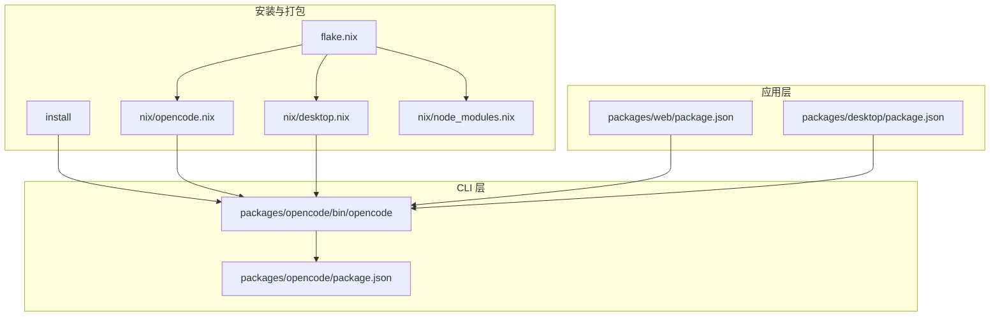
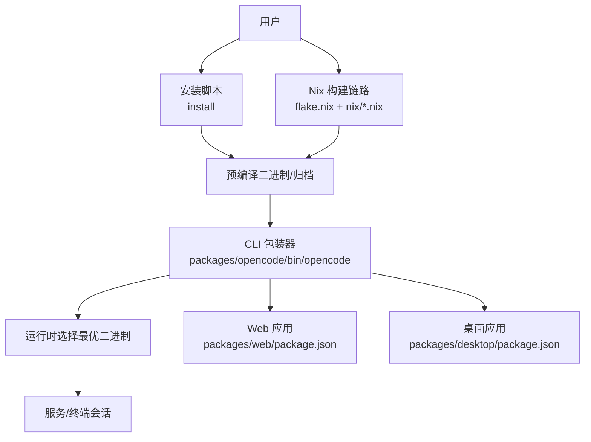
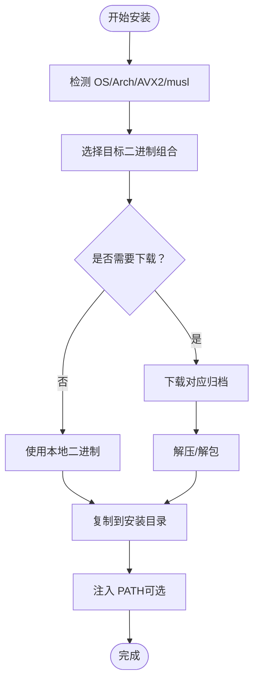
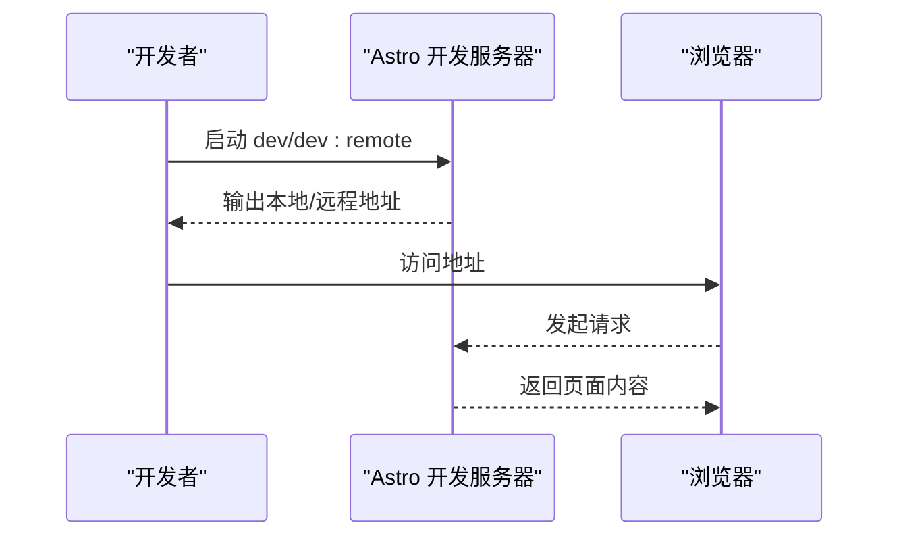
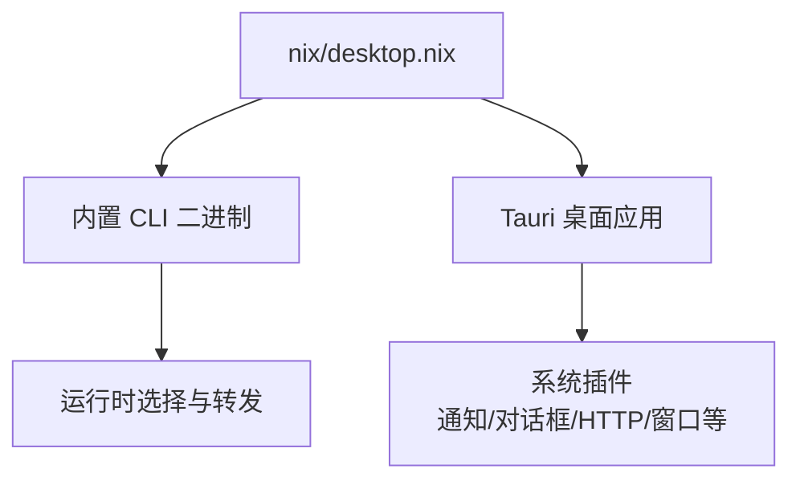
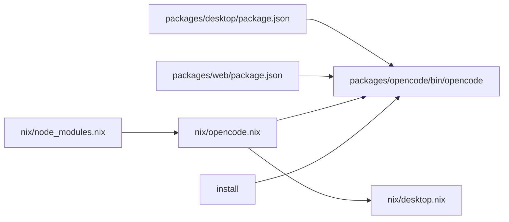

# 跨平台部署能力

<cite>
**本文引用的文件**
- [README.md](file://README.md)
- [install](file://install)
- [flake.nix](file://flake.nix)
- [nix/opencode.nix](file://nix/opencode.nix)
- [nix/desktop.nix](file://nix/desktop.nix)
- [nix/node_modules.nix](file://nix/node_modules.nix)
- [packages/opencode/bin/opencode](file://packages/opencode/bin/opencode)
- [packages/opencode/package.json](file://packages/opencode/package.json)
- [packages/web/package.json](file://packages/web/package.json)
- [packages/desktop/package.json](file://packages/desktop/package.json)
- [packages/opencode/src/flag/flag.ts](file://packages/opencode/src/flag/flag.ts)
- [packages/opencode/src/cli/cmd/uninstall.ts](file://packages/opencode/src/cli/cmd/uninstall.ts)
</cite>

## 目录
1. [简介](#简介)
2. [项目结构](#项目结构)
3. [核心组件](#核心组件)
4. [架构总览](#架构总览)
5. [详细组件分析](#详细组件分析)
6. [依赖关系分析](#依赖关系分析)
7. [性能考量](#性能考量)
8. [故障排查指南](#故障排查指南)
9. [结论](#结论)
10. [附录](#附录)

## 简介
本文件系统性阐述 OpenCode 的跨平台部署能力，覆盖 CLI、Web 应用与桌面应用三类部署形态。文档从安装与配置、运行时行为、性能特征到最佳实践进行分层说明，帮助用户在不同场景下做出合适的选择：本地命令行的完全控制、Web 应用的便捷访问、桌面应用的富功能体验。

## 项目结构
OpenCode 采用多包工作区（monorepo）组织，核心部署相关模块分布如下：
- CLI 可执行程序与包装器：位于 packages/opencode/bin/opencode，负责根据平台与 CPU 特性选择合适的二进制并转发参数。
- 安装脚本：install 提供一键安装、版本选择、PATH 注入、进度显示等功能。
- Nix 构建：flake.nix 统一定义开发环境与构建产物；nix/opencode.nix 和 nix/desktop.nix 分别构建 CLI 与桌面应用；nix/node_modules.nix 生成可复用的 node_modules。
- Web 应用：packages/web 以 Astro 构建静态站点或前端页面。
- 桌面应用：packages/desktop 基于 Tauri + Solid 构建跨平台桌面客户端。
- 运行时配置开关：packages/opencode/src/flag/flag.ts 定义大量环境变量开关，用于控制模型、数据库、Web UI 等行为。

图表来源
- [packages/opencode/bin/opencode](file://packages/opencode/bin/opencode)
- [packages/opencode/package.json](file://packages/opencode/package.json)
- [install](file://install)
- [flake.nix](file://flake.nix)
- [nix/opencode.nix](file://nix/opencode.nix)
- [nix/desktop.nix](file://nix/desktop.nix)
- [nix/node_modules.nix](file://nix/node_modules.nix)
- [packages/web/package.json](file://packages/web/package.json)
- [packages/desktop/package.json](file://packages/desktop/package.json)

章节来源
- [README.md:46-118](file://README.md#L46-L118)
- [packages/opencode/bin/opencode:1-180](file://packages/opencode/bin/opencode#L1-L180)
- [install:1-461](file://install#L1-L461)
- [flake.nix:1-77](file://flake.nix#L1-L77)
- [nix/opencode.nix:1-102](file://nix/opencode.nix#L1-L102)
- [nix/desktop.nix:1-101](file://nix/desktop.nix#L1-L101)
- [nix/node_modules.nix:1-86](file://nix/node_modules.nix#L1-L86)
- [packages/web/package.json:1-45](file://packages/web/package.json#L1-L45)
- [packages/desktop/package.json:1-45](file://packages/desktop/package.json#L1-L45)

## 核心组件
- CLI 包装器与自动选择器：根据操作系统、CPU 架构与指令集特性（如 AVX2、musl）选择最优二进制，确保在不同硬件与发行版上稳定运行。
- 安装脚本：支持 curl 一键安装、指定版本、本地二进制安装、不修改 shell 配置等选项；自动注入 PATH 并处理 GitHub Actions 环境。
- Nix 构建链路：统一 node_modules、CLI 与桌面应用的构建与打包，保证跨平台一致性与可复现性。
- Web 应用：基于 Astro 的前端工程，便于快速发布与托管。
- 桌面应用：基于 Tauri 的原生桌面客户端，提供更丰富的系统集成能力。
- 运行时配置：通过环境变量与动态 getter 控制模型源、数据库、Web UI 开关等。

章节来源
- [packages/opencode/bin/opencode:34-179](file://packages/opencode/bin/opencode#L34-L179)
- [install:10-66](file://install#L10-L66)
- [install:327-359](file://install#L327-L359)
- [install:403-444](file://install#L403-L444)
- [nix/opencode.nix:16-92](file://nix/opencode.nix#L16-L92)
- [nix/desktop.nix:26-100](file://nix/desktop.nix#L26-L100)
- [packages/web/package.json:6-13](file://packages/web/package.json#L6-L13)
- [packages/desktop/package.json:7-14](file://packages/desktop/package.json#L7-L14)
- [packages/opencode/src/flag/flag.ts:75-122](file://packages/opencode/src/flag/flag.ts#L75-L122)

## 架构总览
OpenCode 的部署架构围绕“统一 CLI + 多端分发”的模式设计：
- CLI 作为统一入口，负责运行时二进制选择与参数转发。
- 安装脚本与 Nix 构建链路负责将 CLI 打包为多平台二进制，并在桌面应用中内嵌该 CLI。
- Web 应用与桌面应用分别面向浏览器与原生桌面场景，共享底层模型与工具链。

图表来源
- [install](file://install)
- [flake.nix](file://flake.nix)
- [nix/opencode.nix](file://nix/opencode.nix)
- [nix/desktop.nix](file://nix/desktop.nix)
- [packages/opencode/bin/opencode](file://packages/opencode/bin/opencode)
- [packages/web/package.json](file://packages/web/package.json)
- [packages/desktop/package.json](file://packages/desktop/package.json)

## 详细组件分析

### CLI 部署方式（本地命令行）
- 安装与升级
  - 支持 curl 一键安装、指定版本、本地二进制安装、不修改 PATH 等选项。
  - 自动检测 OS/Arch、Rosetta、AVX2、musl 等特性，选择对应二进制。
  - 在非 TTY 或 Windows 环境下降级为标准下载流程。
- 运行时行为
  - CLI 包装器根据平台与架构映射出候选二进制名，按优先级查找 node_modules 中的匹配项。
  - 若未找到匹配二进制，提示用户手动安装对应平台包。
- 性能与兼容性
  - 针对 x64 且无 AVX2 的 CPU 自动回退到 baseline 构建。
  - 在 Alpine 或使用 musl 的系统上优先选择 musl 构建。
  - Windows 上通过 PowerShell/Pwsh 检测 AVX2 特性。
- 配置与卸载
  - 支持通过环境变量控制模型源、数据库、Web UI 等行为。
  - 卸载流程会列出将被移除的目录、二进制与 shell 配置文件。

图表来源
- [install:79-205](file://install#L79-L205)
- [install:327-359](file://install#L327-L359)
- [install:403-444](file://install#L403-L444)

章节来源
- [README.md:46-118](file://README.md#L46-L118)
- [install:10-66](file://install#L10-L66)
- [install:79-205](file://install#L79-L205)
- [install:327-359](file://install#L327-L359)
- [install:403-444](file://install#L403-L444)
- [packages/opencode/bin/opencode:34-179](file://packages/opencode/bin/opencode#L34-L179)
- [packages/opencode/src/flag/flag.ts:75-122](file://packages/opencode/src/flag/flag.ts#L75-L122)
- [packages/opencode/src/cli/cmd/uninstall.ts:98-128](file://packages/opencode/src/cli/cmd/uninstall.ts#L98-L128)

### Web 应用部署方式（浏览器访问）
- 技术栈
  - 基于 Astro，支持静态构建与预览，适合托管在云平台或边缘网络。
- 使用场景
  - 快速试用、无需本地安装、跨设备访问。
- 配置要点
  - 通过脚本 dev/dev:remote/start 等启动开发/预览服务。
  - 可通过环境变量切换后端 API 地址（如远程 API）。

图表来源
- [packages/web/package.json:6-13](file://packages/web/package.json#L6-L13)

章节来源
- [packages/web/package.json:6-13](file://packages/web/package.json#L6-L13)

### 桌面应用部署方式（原生桌面）
- 技术栈
  - Tauri + Solid，桌面端原生体验，具备系统集成能力（剪贴板、对话框、窗口状态等）。
- 构建与分发
  - Nix 叠加构建 CLI 并将其作为 sidecar 内置于桌面应用，确保运行时一致性。
  - Linux 下对 glib、gtk、webkit 等库进行严格依赖管理。
- 使用场景
  - 需要富功能界面、系统级交互、离线可用、与本地文件系统深度集成的场景。
- 配置要点
  - 通过 Tauri 插件体系扩展能力（如通知、HTTP、窗口状态等）。
  - 通过环境变量控制模型与数据库行为（与 CLI 共享同一套开关）。

图表来源
- [nix/desktop.nix:26-100](file://nix/desktop.nix#L26-L100)
- [nix/opencode.nix:55-80](file://nix/opencode.nix#L55-L80)
- [packages/desktop/package.json:15-35](file://packages/desktop/package.json#L15-L35)

章节来源
- [nix/desktop.nix:26-100](file://nix/desktop.nix#L26-L100)
- [nix/opencode.nix:55-80](file://nix/opencode.nix#L55-L80)
- [packages/desktop/package.json:15-35](file://packages/desktop/package.json#L15-L35)

## 依赖关系分析
- CLI 与安装脚本
  - install 负责下载/解压/注入 PATH；packages/opencode/bin/opencode 负责运行时二进制选择与转发。
- Nix 构建链路
  - flake.nix 统一输出 CLI 与桌面应用；nix/node_modules.nix 产出可复用的 node_modules；nix/opencode.nix/nix/desktop.nix 负责具体构建。
- 应用层
  - packages/web 与 packages/desktop 通过各自 package.json 的脚本与依赖，间接依赖 CLI 与底层模型/工具链。

图表来源
- [install](file://install)
- [packages/opencode/bin/opencode](file://packages/opencode/bin/opencode)
- [nix/node_modules.nix](file://nix/node_modules.nix)
- [nix/opencode.nix](file://nix/opencode.nix)
- [nix/desktop.nix](file://nix/desktop.nix)
- [packages/web/package.json](file://packages/web/package.json)
- [packages/desktop/package.json](file://packages/desktop/package.json)

章节来源
- [install:1-461](file://install#L1-L461)
- [packages/opencode/bin/opencode:1-180](file://packages/opencode/bin/opencode#L1-L180)
- [nix/node_modules.nix:1-86](file://nix/node_modules.nix#L1-L86)
- [nix/opencode.nix:1-102](file://nix/opencode.nix#L1-L102)
- [nix/desktop.nix:1-101](file://nix/desktop.nix#L1-L101)
- [packages/web/package.json:1-45](file://packages/web/package.json#L1-L45)
- [packages/desktop/package.json:1-45](file://packages/desktop/package.json#L1-L45)

## 性能考量
- CPU 指令集与二进制选择
  - x64 且无 AVX2 的 CPU 将回退到 baseline 构建，避免运行时指令不支持导致崩溃。
  - Windows/macOS/Linux 通过系统调用/命令检测 AVX2，确保选择最优二进制。
- 运行时路径与兼容性
  - musl 系统优先选择 musl 构建，提升兼容性与启动速度。
- 下载与安装
  - 在非 TTY 或 Windows 环境下降级为标准下载流程，保证稳定性。
- Nix 构建
  - 通过固定哈希与可复现构建，减少因依赖差异导致的性能波动。

章节来源
- [packages/opencode/bin/opencode:56-149](file://packages/opencode/bin/opencode#L56-L149)
- [install:130-158](file://install#L130-L158)
- [install:327-359](file://install#L327-L359)
- [nix/node_modules.nix:75-77](file://nix/node_modules.nix#L75-L77)

## 故障排查指南
- 无法找到匹配的二进制
  - 现象：提示需要手动安装对应平台包。
  - 排查：确认 OS/Arch 与目标二进制命名一致；检查 node_modules 是否包含对应目录。
- 安装后命令不可用
  - 现象：终端提示命令不存在。
  - 排查：确认 PATH 已注入安装目录；若 no-modify-path，则需手动添加。
- 卸载残留
  - 行为：卸载流程会列出将被删除的目录、二进制与 shell 配置。
  - 建议：按提示确认清理，必要时手动检查配置文件。

章节来源
- [packages/opencode/bin/opencode:169-179](file://packages/opencode/bin/opencode#L169-L179)
- [install:403-444](file://install#L403-L444)
- [packages/opencode/src/cli/cmd/uninstall.ts:98-128](file://packages/opencode/src/cli/cmd/uninstall.ts#L98-L128)

## 结论
OpenCode 的跨平台部署以“统一 CLI + 多端分发”为核心策略：CLI 提供一致的运行时体验，安装脚本与 Nix 构建保障跨平台兼容与可复现；Web 应用强调便捷访问，桌面应用强调富功能与系统集成。结合环境变量与卸载流程，用户可在不同场景下灵活选择与优化部署方案。

## 附录
- 安装与配置建议
  - 本地优先：使用 curl 一键安装，配合 PATH 注入；如需特定版本，使用 --version 指定。
  - 企业内网：使用 --binary 指向内部二进制；或通过 Nix 在受控环境中构建。
  - Web 快速试用：直接使用 packages/web 的 dev/preview 脚本。
  - 桌面应用：从发布页下载对应平台包，或通过包管理器安装。
- 最佳实践
  - 优先使用官方预编译二进制，避免自编译带来的性能与兼容性风险。
  - 在 CI/CD 中使用固定版本与缓存策略，提升一致性与速度。
  - 对于 macOS Intel 机器，注意 Rosetta 环境下的架构选择。
  - 使用环境变量微调模型源、数据库与 Web UI 行为，满足不同合规与性能需求。

章节来源
- [README.md:46-118](file://README.md#L46-L118)
- [install:10-66](file://install#L10-L66)
- [packages/web/package.json:6-13](file://packages/web/package.json#L6-L13)
- [packages/desktop/package.json:7-14](file://packages/desktop/package.json#L7-L14)
- [packages/opencode/src/flag/flag.ts:75-122](file://packages/opencode/src/flag/flag.ts#L75-L122)