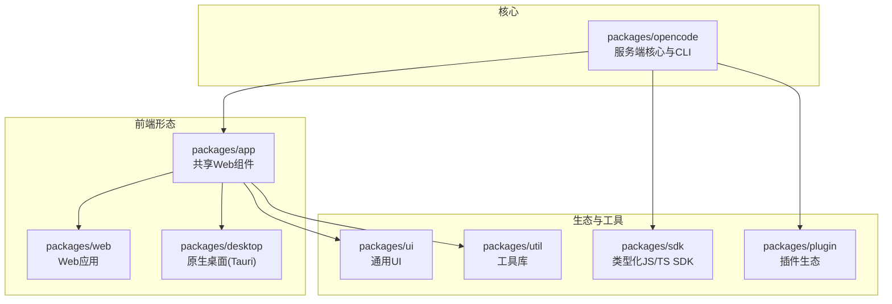
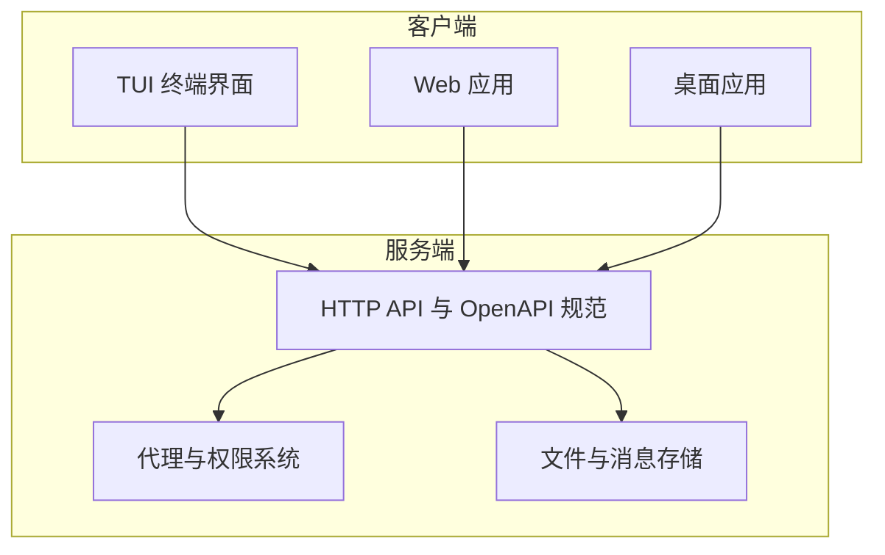
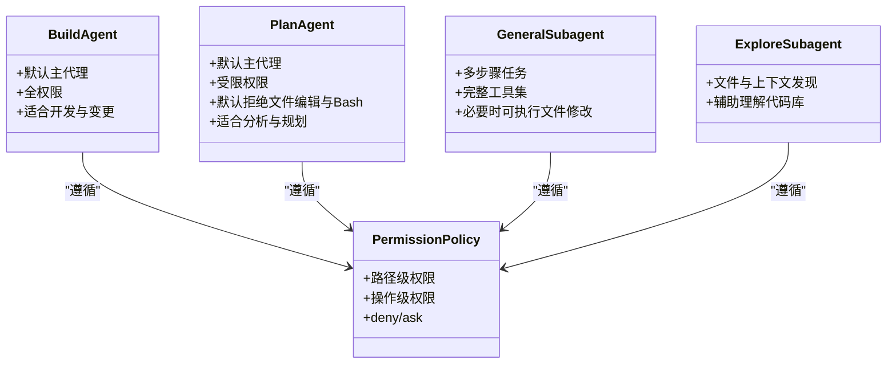
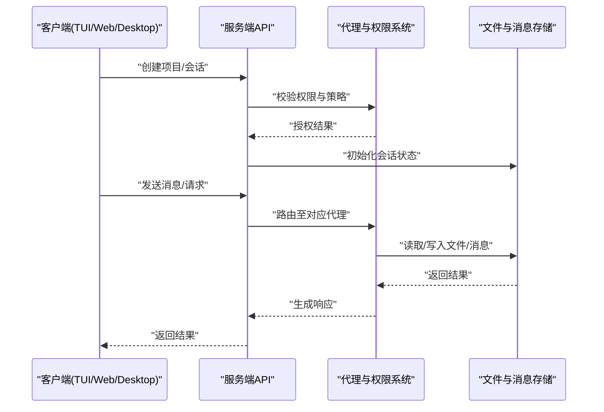
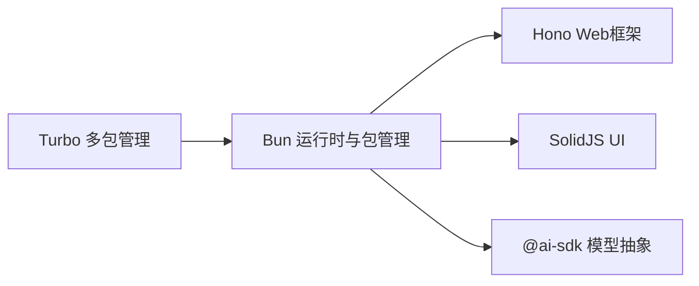

# 项目介绍

<cite>
**本文引用的文件**
- [README.md](file://README.md)
- [CONTRIBUTING.md](file://CONTRIBUTING.md)
- [AGENTS.md](file://AGENTS.md)
- [package.json](file://package.json)
- [.opencode/opencode.jsonc](file://.opencode/opencode.jsonc)
- [specs/project.md](file://specs/project.md)
- [STATS.md](file://STATS.md)
</cite>

## 目录
1. [引言](#引言)
2. [项目结构](#项目结构)
3. [核心组件](#核心组件)
4. [架构总览](#架构总览)
5. [详细组件分析](#详细组件分析)
6. [依赖关系分析](#依赖关系分析)
7. [性能考量](#性能考量)
8. [故障排查指南](#故障排查指南)
9. [结论](#结论)
10. [附录](#附录)

## 引言
OpenCode 是一个开源的 AI 编程代理工具，旨在通过“终端优先”的设计理念，将强大的大模型能力与开发者熟悉的命令行工作流深度融合。它强调完全开源、多模型提供商支持、原生 LSP 支持以及客户端/服务器架构，使用户能够在终端中高效完成从代码探索、规划到实际修改的全流程任务。

OpenCode 的核心价值主张包括：
- 完全开源：用户可自由审计、定制与扩展
- 多模型提供商支持：不绑定单一供应商，便于在不同模型间切换与迁移
- 终端优先：以 TUI 为核心交互方式，充分发挥终端在开发场景中的效率优势
- 客户端/服务器架构：允许远程控制与多客户端接入，提升使用灵活性
- 内置代理与权限体系：提供“构建”和“计划”两类代理，并通过权限系统保障安全可控

目标用户群体覆盖：
- 需要在终端中进行高效编码与重构的开发者
- 对数据主权与可审计性有要求的企业与团队
- 希望在多模型之间灵活切换并优化成本的用户
- 追求“终端原生体验”的技术爱好者与极客

OpenCode 与 Claude Code 等竞品的主要差异体现在：
- 100% 开源，避免闭源锁定
- 不耦合于任何模型提供商，支持 Claude、OpenAI、Google 乃至本地模型
- 出发点即为 LSP 支持，天然契合编辑器生态
- 终端优先的 TUI 设计，持续拓展终端可用边界
- 客户端/服务器架构，便于远程控制与多端接入

**章节来源**
- [README.md:129-138](file://README.md#L129-L138)

## 项目结构
仓库采用多包（monorepo）结构，围绕“服务端核心 + 多客户端形态 + 插件与 SDK”组织。核心模块包括：
- packages/opencode：服务端核心与 CLI，承载业务逻辑与 API
- packages/app：共享 Web UI 组件，基于 SolidJS
- packages/desktop：基于 Tauri 的原生桌面应用
- packages/web：Web 端应用
- packages/sdk：类型化 JS/TS SDK，用于与服务端交互
- packages/plugin：插件生态与集成入口
- packages/ui、packages/util：通用 UI 与工具库
- .opencode：默认配置与权限策略示例

**图表来源**
- [package.json:20-26](file://package.json#L20-L26)
- [CONTRIBUTING.md:72-77](file://CONTRIBUTING.md#L72-L77)

**章节来源**
- [package.json:20-26](file://package.json#L20-L26)
- [CONTRIBUTING.md:72-77](file://CONTRIBUTING.md#L72-L77)

## 核心组件
- 服务端与 CLI：提供统一的 API 与命令行接口，支持启动无头服务、Web 界面与 TUI
- TUI（终端用户界面）：以 SolidJS + opentui 构建，专注终端交互体验
- Web 应用与桌面应用：分别面向浏览器与原生桌面环境
- SDK：类型化 JS/TS 客户端，用于程序化调用与集成
- 插件系统：扩展第三方能力，如认证、日志、沙箱等
- 配置与权限：通过 .opencode/opencode.jsonc 定义默认提供商、权限与工具开关

**章节来源**
- [CONTRIBUTING.md:72-77](file://CONTRIBUTING.md#L72-L77)
- [.opencode/opencode.jsonc:1-19](file://.opencode/opencode.jsonc#L1-L19)

## 架构总览
OpenCode 采用“客户端/服务器”架构，服务端负责会话管理、代理调度、文件与消息处理；TUI/Web/Desktop 作为不同客户端接入同一后端，实现跨平台一致体验。

**图表来源**
- [specs/project.md:5-64](file://specs/project.md#L5-L64)
- [CONTRIBUTING.md:97-122](file://CONTRIBUTING.md#L97-L122)

**章节来源**
- [specs/project.md:5-64](file://specs/project.md#L5-L64)
- [CONTRIBUTING.md:97-122](file://CONTRIBUTING.md#L97-L122)

## 详细组件分析

### 代理与权限体系
OpenCode 提供两类主代理与两类子代理，配合权限系统实现“可规划、可执行、可审计”的开发流程。

- 构建代理（build）：默认主代理，具备完整权限，适合日常开发与变更
- 计划代理（plan）：受限代理，默认拒绝文件编辑与直接执行 Bash，需授权后方可运行命令，适合分析与规划
- 通用子代理（general）：用于复杂搜索与多步骤任务，具备完整工具集，必要时可执行文件修改
- 探索子代理（explore）：用于文件与上下文发现，辅助理解未知代码库

权限策略可通过配置文件定义，例如对特定路径或操作设置“deny/ask”等策略，确保在探索阶段不会误改关键文件。

**图表来源**
- [README.md:100-113](file://README.md#L100-L113)
- [.opencode/opencode.jsonc:8-18](file://.opencode/opencode.jsonc#L8-L18)

**章节来源**
- [README.md:100-113](file://README.md#L100-L113)
- [.opencode/opencode.jsonc:8-18](file://.opencode/opencode.jsonc#L8-L18)

### API 与会话管理
OpenCode 服务端提供一组清晰的 REST API，涵盖项目、会话、消息、文件与权限等资源。其设计目标是支持多项目、多工作树场景下的并发会话管理，并提供可编程化的交互入口。

**图表来源**
- [specs/project.md:5-64](file://specs/project.md#L5-L64)

**章节来源**
- [specs/project.md:5-64](file://specs/project.md#L5-L64)

### 安装与运行
OpenCode 提供多种安装方式，覆盖主流包管理器与平台；同时支持通过命令行启动服务端、Web 界面与 TUI。开发与调试流程也已明确，便于贡献者快速上手。

- 安装方式：curl 脚本、npm/bun/pnpm/yarn、Windows Scoop/Chocolatey、macOS Homebrew、Arch Linux、mise、Nix 等
- 运行方式：服务端、Web 界面、TUI 三类模式，支持指定端口与目录
- 开发模式：bun dev 提供 serve/web/<dir> 等子命令，便于本地联调

**章节来源**
- [README.md:46-98](file://README.md#L46-L98)
- [CONTRIBUTING.md:79-95](file://CONTRIBUTING.md#L79-L95)
- [CONTRIBUTING.md:97-122](file://CONTRIBUTING.md#L97-L122)

## 依赖关系分析
OpenCode 采用 Bun 作为运行时与包管理器，结合 Turbo 管理多包类型检查与构建；核心依赖包括 Hono（Web 框架）、SolidJS（UI）、@ai-sdk（模型抽象）等。工作区配置包含多个 packages 与 catalog，形成统一的依赖与版本管理。

**图表来源**
- [package.json:8-18](file://package.json#L8-L18)
- [package.json:20-75](file://package.json#L20-L75)

**章节来源**
- [package.json:8-18](file://package.json#L8-L18)
- [package.json:20-75](file://package.json#L20-L75)

## 性能考量
- 运行时选择：Bun 具备更快的启动与执行性能，适合终端工具链
- 并发与会话：多项目/多工作树场景下，建议合理划分会话与权限，减少不必要的文件扫描与写入
- 网络与模型：在多提供商环境下，按需选择模型与地区节点，平衡延迟与成本
- 调试与观测：利用 OpenAPI 文档与 SDK 进行可观测性建设，便于定位性能瓶颈

## 故障排查指南
- 权限相关问题：检查 .opencode/opencode.jsonc 中的权限策略，确认路径与操作是否被正确限制
- 代理行为异常：切换至“计划”代理验证是否为权限导致的行为差异
- 服务端连接问题：确认服务端端口与主机名配置，必要时使用 --hostname/--port 参数显式指定
- 调试建议：参考贡献指南中的调试方法，优先使用 --inspect 与 spawn 模式以获得更准确的断点映射

**章节来源**
- [.opencode/opencode.jsonc:8-18](file://.opencode/opencode.jsonc#L8-L18)
- [CONTRIBUTING.md:158-177](file://CONTRIBUTING.md#L158-L177)

## 结论
OpenCode 以“终端优先”的开源理念，结合多模型提供商支持与客户端/服务器架构，为开发者提供了可审计、可扩展、可远程控制的 AI 编程代理。通过内置代理与权限体系，OpenCode 在保证安全性的同时，最大化发挥终端在开发场景中的效率优势。随着生态的完善与社区的壮大，OpenCode 将持续拓展终端可用边界，成为开发者在终端中的智能伙伴。

## 附录

### 发展历程与下载统计
根据下载统计数据，OpenCode 的全球下载量呈现稳步增长趋势，表明社区活跃度与用户认可度持续提升。该数据可用于评估项目在不同地区的接受程度与推广效果。

**章节来源**
- [STATS.md:1-218](file://STATS.md#L1-L218)

### 技术愿景与使命
- 技术愿景：将 AI 编程能力深度融入终端工作流，打造可审计、可扩展、可远程控制的智能开发助手
- 使命：降低 AI 编程门槛，提升开发效率，保护用户数据主权，推动开源与多模型生态繁荣