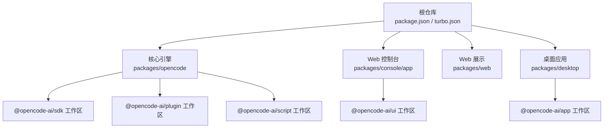
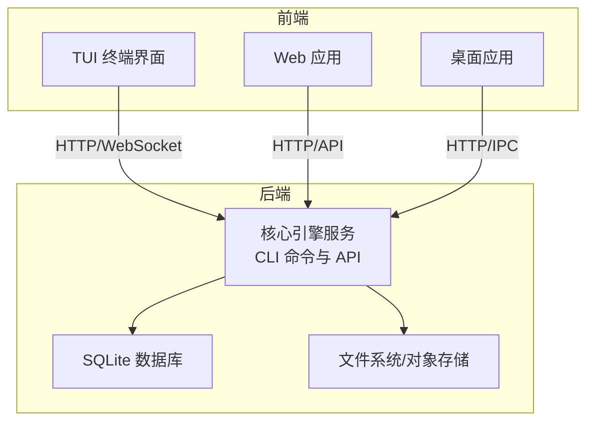
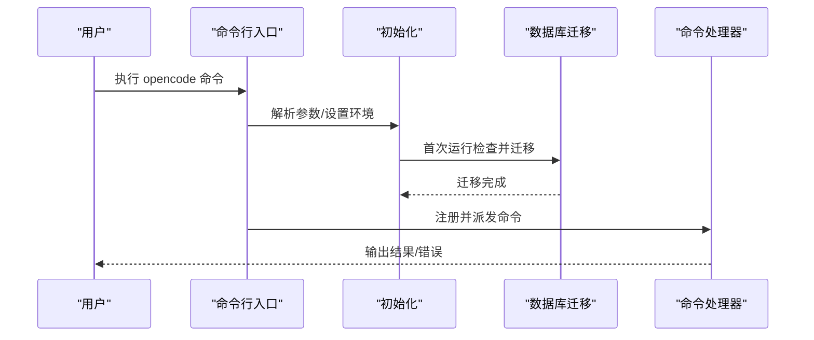
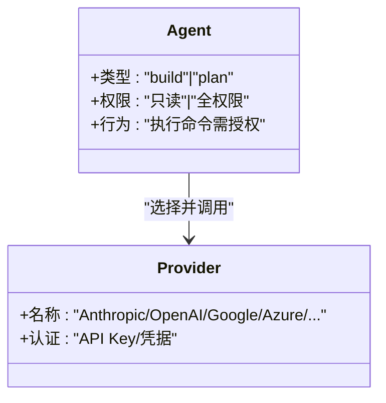
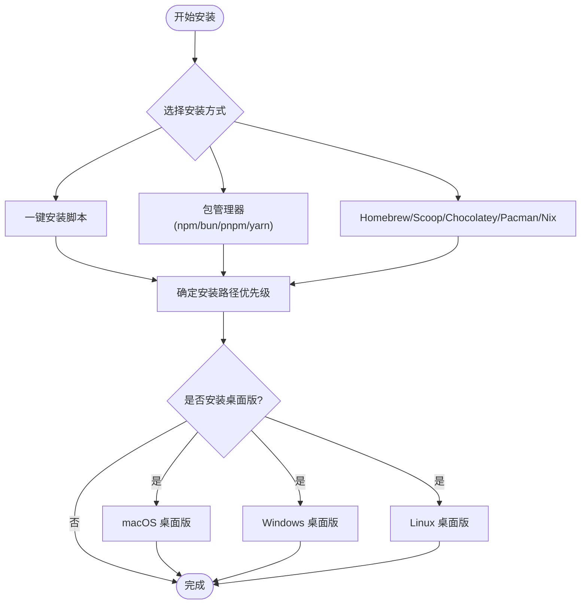
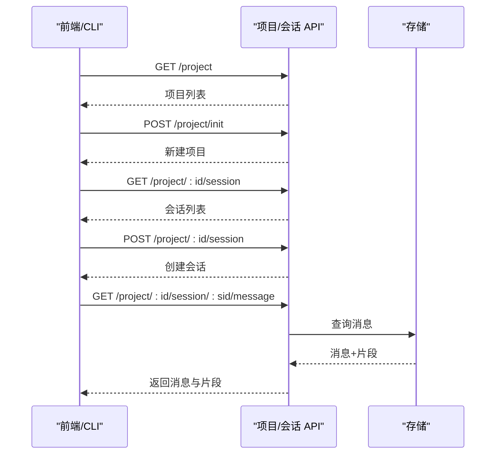
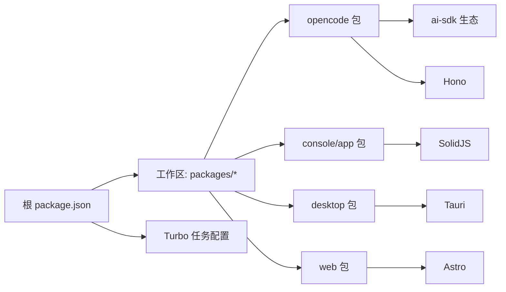

# 项目概述

<cite>
**本文引用的文件**
- [README.md](file://README.md)
- [package.json](file://package.json)
- [turbo.json](file://turbo.json)
- [CONTRIBUTING.md](file://CONTRIBUTING.md)
- [AGENTS.md](file://AGENTS.md)
- [specs/project.md](file://specs/project.md)
- [packages/opencode/src/index.ts](file://packages/opencode/src/index.ts)
- [packages/opencode/package.json](file://packages/opencode/package.json)
- [packages/console/app/package.json](file://packages/console/app/package.json)
- [packages/web/package.json](file://packages/web/package.json)
- [packages/desktop/package.json](file://packages/desktop/package.json)
</cite>

## 目录
1. [简介](#简介)
2. [项目结构](#项目结构)
3. [核心组件](#核心组件)
4. [架构总览](#架构总览)
5. [详细组件分析](#详细组件分析)
6. [依赖关系分析](#依赖关系分析)
7. [性能考量](#性能考量)
8. [故障排查指南](#故障排查指南)
9. [结论](#结论)
10. [附录](#附录)

## 简介
OpenCode 是一个开源的 AI 编程代理工具，致力于在终端友好、可扩展且多模型提供商支持的环境中提升开发效率。其核心价值主张包括：
- 开源与中立：完全开源，不绑定特定模型提供商，支持 Claude、OpenAI、Google、本地模型等多种来源。
- 终端优先：以 TUI（文本用户界面）为核心体验，适合在终端中高效工作。
- 多代理系统：内置“build”和“plan”两类代理，支持复杂任务的多步骤执行与权限控制。
- 客户端/服务器架构：服务端可独立运行，前端可为 TUI、Web 或桌面应用，便于远程操控与多端协同。

项目提供多种安装方式与多平台部署能力，并通过 monorepo 管理核心引擎、Web 控制台、桌面应用与 SDK 等模块。

章节来源
- [README.md:100-138](file://README.md#L100-L138)

## 项目结构
OpenCode 采用 monorepo 结构，根目录通过包管理器与构建工具统一调度，核心模块分布如下：
- 核心引擎与 CLI：位于 packages/opencode，包含命令行入口、会话管理、存储迁移与错误处理等。
- Web 控制台：packages/console/app，基于 SolidJS 的现代前端应用。
- Web 展示站点：packages/web，使用 Astro 构建的文档与落地页。
- 桌面应用：packages/desktop，基于 Tauri 的原生桌面壳层，包装 Web UI。
- 其他子包：app、ui、sdk、plugin、util、enterprise、extensions 等，按功能域拆分。

图表来源
- [package.json:20-26](file://package.json#L20-L26)
- [packages/opencode/package.json:24-26](file://packages/opencode/package.json#L24-L26)
- [packages/console/app/package.json:19-22](file://packages/console/app/package.json#L19-L22)
- [packages/desktop/package.json:16-17](file://packages/desktop/package.json#L16-L17)

章节来源
- [package.json:20-26](file://package.json#L20-L26)
- [turbo.json:1-32](file://turbo.json#L1-L32)
- [CONTRIBUTING.md:72-77](file://CONTRIBUTING.md#L72-L77)

## 核心组件
- 命令行入口与路由：packages/opencode/src/index.ts 负责解析参数、初始化日志与数据库迁移、注册各类命令并处理未捕获异常。
- 代理系统：内置 build/plan 两类代理，支持复杂搜索与多步任务的 general 子代理；可通过 Tab 在两者间切换。
- 多模型提供商支持：通过 ai-sdk 生态与多种 provider 包实现对主流模型的统一接入。
- 终端友好设计：强调 TUI 体验，适配终端交互与快捷键操作。
- 多平台部署：提供安装脚本与包管理器安装方式，支持 macOS、Windows、Linux；同时提供桌面应用与 Web 应用两种前端形态。

章节来源
- [packages/opencode/src/index.ts:1-241](file://packages/opencode/src/index.ts#L1-L241)
- [README.md:100-113](file://README.md#L100-L113)
- [packages/opencode/package.json:74-92](file://packages/opencode/package.json#L74-L92)

## 架构总览
OpenCode 采用客户端/服务器架构：核心引擎作为后端服务，提供统一的 API；前端以 TUI、Web 或桌面应用形式存在，通过 HTTP 或 IPC 与服务端交互。核心流程包括启动、会话管理、消息流转与持久化。

图表来源
- [packages/opencode/src/index.ts:64-186](file://packages/opencode/src/index.ts#L64-L186)
- [specs/project.md:5-64](file://specs/project.md#L5-L64)

## 详细组件分析

### 命令行入口与生命周期
- 参数解析与帮助：使用 yargs 定义命令与选项，支持打印日志、设置日志级别、纯模式运行等。
- 初始化阶段：根据运行环境初始化日志、启动埋点、设置进程环境变量；首次运行执行 SQLite 迁移并显示进度。
- 错误处理：捕获未处理拒绝与未捕获异常，格式化错误信息并输出到日志与标准错误。
- 命令注册：集中注册所有 CLI 命令，包括运行、生成、调试、会话、插件、数据库等。

图表来源
- [packages/opencode/src/index.ts:64-186](file://packages/opencode/src/index.ts#L64-L186)
- [packages/opencode/src/index.ts:121-146](file://packages/opencode/src/index.ts#L121-L146)

章节来源
- [packages/opencode/src/index.ts:1-241](file://packages/opencode/src/index.ts#L1-L241)

### 代理系统与多模型支持
- 代理类型：build（默认全权限）、plan（只读，需授权执行命令），以及内部使用的 general 子代理。
- 模型提供商：通过 ai-sdk 及其 provider 生态，支持 Anthropic、OpenAI、Google、Azure、Bedrock、Vercel、OpenRouter 等多家模型。
- 权限与安全：plan 代理默认禁止文件编辑，执行 bash 命令前需要确认；适合探索与规划。

图表来源
- [README.md:100-113](file://README.md#L100-L113)
- [packages/opencode/package.json:74-92](file://packages/opencode/package.json#L74-L92)

章节来源
- [README.md:100-113](file://README.md#L100-L113)
- [packages/opencode/package.json:74-92](file://packages/opencode/package.json#L74-L92)

### 多平台部署与安装
- 安装方式：一键安装脚本、包管理器（npm/bun/pnpm/yarn）、Homebrew、Scoop、Chocolatey、Pacman、Nix 等。
- 安装路径优先级：OPENCODE_INSTALL_DIR > XDG_BIN_DIR > $HOME/bin > $HOME/.opencode/bin。
- 桌面应用：提供 macOS、Windows、Linux 的安装包与 Homebrew 桌面版。

图表来源
- [README.md:46-98](file://README.md#L46-L98)
- [README.md:67-83](file://README.md#L67-L83)

章节来源
- [README.md:46-98](file://README.md#L46-L98)
- [README.md:67-83](file://README.md#L67-L83)

### API 规划与会话管理
- 项目与会话：支持多项目、多工作树场景，提供会话的创建、初始化、中止、分享、压缩、消息查询与文件状态查询等接口。
- 文件与消息：支持按会话获取消息列表与单条消息，支持文件内容与补丁获取、文件状态查询。
- 提供商与配置：按目录解析当前可用的模型提供商与配置。

图表来源
- [specs/project.md:5-64](file://specs/project.md#L5-L64)

章节来源
- [specs/project.md:1-65](file://specs/project.md#L1-L65)

## 依赖关系分析
- 包管理与工作区：根 package.json 使用 workspaces 管理 packages/*、console/*、sdk/js、slack 等；通过 catalog 字段统一依赖版本。
- 构建与缓存：Turbo 管理任务依赖与输出缓存，确保增量构建与跨包一致性。
- 核心依赖：ai-sdk 生态、Hono（Web 框架）、SolidJS（UI）、Effect（函数式运行时）、@opencode-ai/* 工作区包等。
- 平台与工具链：Bun 作为运行时与构建工具，Tauri 用于桌面应用，Vite/Astro 用于 Web 前端。

图表来源
- [package.json:20-26](file://package.json#L20-L26)
- [turbo.json:5-30](file://turbo.json#L5-L30)
- [packages/opencode/package.json:70-158](file://packages/opencode/package.json#L70-L158)
- [packages/console/app/package.json:13-35](file://packages/console/app/package.json#L13-L35)
- [packages/web/package.json:14-36](file://packages/web/package.json#L14-L36)
- [packages/desktop/package.json:15-34](file://packages/desktop/package.json#L15-L34)

章节来源
- [package.json:20-26](file://package.json#L20-L26)
- [turbo.json:1-32](file://turbo.json#L1-L32)
- [packages/opencode/package.json:70-158](file://packages/opencode/package.json#L70-L158)

## 性能考量
- 启动与迁移：首次运行进行 SQLite 迁移，建议在空闲时段或 CI 中预热以减少首次延迟。
- 日志与诊断：通过 --print-logs 与 --log-level 控制输出，结合 Heap 跟踪与错误格式化辅助定位问题。
- 并行与缓存：利用 Turbo 的任务依赖与输出缓存，避免重复构建；在开发中优先使用并行工具与增量编译。
- 前端性能：Web 与桌面应用采用现代打包工具（Vite/Astro/Tauri），建议启用生产构建与资源压缩。

章节来源
- [packages/opencode/src/index.ts:72-100](file://packages/opencode/src/index.ts#L72-L100)
- [CONTRIBUTING.md:158-177](file://CONTRIBUTING.md#L158-L177)
- [turbo.json:5-30](file://turbo.json#L5-L30)

## 故障排查指南
- 常见问题
  - 安装失败：检查安装路径优先级与权限，确保 OPENCODE_INSTALL_DIR 或 XDG_BIN_DIR 设置正确。
  - 首次启动缓慢：数据库迁移可能耗时，可在后台运行或预热。
  - 桌面应用无法运行：确认已满足 Tauri 前置条件（Rust 工具链、平台库）。
- 调试建议
  - 使用 Bun 的 --inspect 选项附加调试器，必要时分离调试服务端与 TUI。
  - 对于并发与信号处理问题，参考注释中的退出策略以避免子进程悬挂。
- 日志与错误
  - 使用 --print-logs 与 --log-level 调整日志级别，查看致命错误与堆栈信息。
  - 遇到未知参数或参数不足时，自动显示帮助信息，核对命令拼写与参数顺序。

章节来源
- [README.md:85-98](file://README.md#L85-L98)
- [packages/opencode/src/index.ts:173-184](file://packages/opencode/src/index.ts#L173-L184)
- [CONTRIBUTING.md:158-177](file://CONTRIBUTING.md#L158-L177)

## 结论
OpenCode 以开源、中立、终端友好的理念，结合多代理系统与多模型提供商支持，构建了从 CLI 到 Web/桌面的全栈开发体验。通过 monorepo 与现代化技术栈，项目在可扩展性、可维护性与多平台部署方面具备坚实基础。面向初学者，OpenCode 提供清晰的安装与使用路径；面向开发者，项目提供了完善的贡献规范、调试与测试指引。

## 附录

### 快速上手要点
- 安装：选择一键脚本或包管理器安装，或使用 Homebrew/Scoop/Chocolatey/Pacman/Nix。
- 运行：bun dev 启动开发服务器，或直接使用 opencode 命令。
- 代理切换：在 TUI 中使用 Tab 在 build/plan 之间切换。
- 多模型：在配置中选择任一支持的提供商，或使用本地模型。

章节来源
- [README.md:46-113](file://README.md#L46-L113)
- [CONTRIBUTING.md:72-95](file://CONTRIBUTING.md#L72-L95)